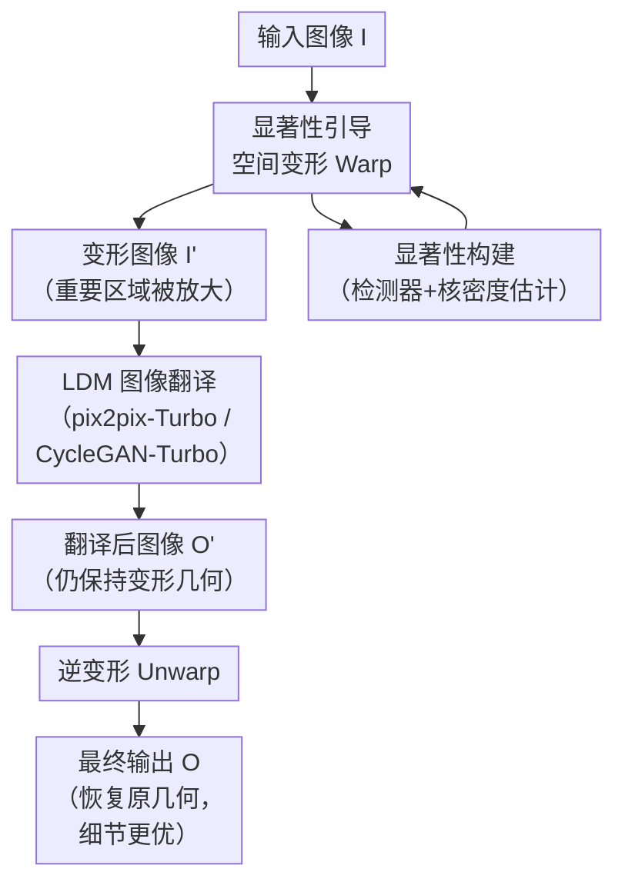

# WarpI2I: Image Warping for Image-to-Image Translation

**会议**: ECCV2026  
**arXiv**: [2606.31018](https://arxiv.org/abs/2606.31018)  
**代码**: [https://shenzheng2000.github.io/WarpI2I.github.io/](https://shenzheng2000.github.io/WarpI2I.github.io/) (项目页，代码待确认)  
**领域**: 图像生成 / 图像翻译  
**关键词**: 图像变形, 隐扩散模型, 图像翻译, 重打光, 显著性引导

## 一句话总结

本文提出一个与模型无关、无参的 warp-unwarp 框架，在编码前对显著性区域做空间放大再反向还原，在不增大隐空间分辨率的前提下保留 LDM 图像翻译中的细粒度结构信息；同时配套提出一套基于 FLUX 的轻量合成数据管线，在人体/驾驶场景重打光与天气/时段驾驶翻译任务中以极小开销取得显著提升。

## 研究背景与动机

图像到图像的翻译（I2I translation）在人体重打光、驾驶场景天气变换等任务上取得了长足进步，目前主流方案是隐扩散模型（LDM）。然而，轻量级 LDM 在高分辨率输入时，编码器会将输入压缩 8 倍空间下采样，导致人脸五官、交通标志、车牌号等细粒度前景结构在隐空间中仅占据极少的像素，生成结果中这些区域往往模糊变形。一个直觉的解法是降低压缩比或提高输入分辨率来获得更大的隐空间，但这会使计算量随空间尺寸平方增长，在实际部署中极其昂贵；多尺度扩散或测试时精炼等方法虽能缓解，却引入了额外的训练/推理开销和架构改动。

这种困境的核心矛盾在于：LDM 的计算-精度权衡要求尽可能小的隐空间，但小隐空间必然会丢弃高频结构信息。现有方法要么牺牲效率换取空间分辨率，要么在编码-解码过程中永久丢失细节——没有人思考过「能不能在编码前就把信息重新分配好」。本文的切入角度极其巧妙：既然问题出在编码器的均匀压缩导致每个位置的像素配额相同，而语义重要的区域（人脸、眼睛、小物体）其实只占输入很小一部分，那么只需**在编码前对这些区域做局部放大，让它们在隐空间中占据更多像素，翻译完后再逆变换还原**即可。**核心 idea：用一个内容感知的显著性引导 warp 操作在 LDM 编码前对重要区域做空间放大（warp），让有限隐空间像素集中在语义关键处，翻译输出后用逆变换（unwarp）恢复原几何，从而零改动地提升任意 I2I 框架的细粒度保真度。**

## 方法详解

### 整体框架

WarpI2I 的核心管线是一个「变形→翻译→逆变形」三阶段流程，可插入任何已有的 LDM 图像翻译模型。整体框架如下：

输入图像 `I` 首先由显著性检测器（如 InsightFace 检测人脸和眼睛、YOLO-World 检测物体）获得区域边界框，通过核密度估计构造连续显著性图 `S`。根据 `S` 对 `I` 做非均匀变形（warp），使高显著性区域在像素空间上被放大、低显著性区域被压缩，得到变形图像 `I'`。然后将 `I'` 送入已有的 LDM 图像翻译模型（如 pix2pix-Turbo、CycleGAN-Turbo）进行处理，输出同样处于变形几何下的翻译结果 `O'`。最后对 `O'` 执行近似逆变形（unwarp），恢复为原始几何结构，得到最终输出 `O`。整个 warp 和 unwarp 操作仅引入约 6 ms（各 3 ms）的推理延迟，且不增加任何可学习参数。

### 关键设计

**1. 显著性引导的空间变形：在编码前重新分配像素配额**

LDM 编码器的均匀空间下采样有一个隐含假设：图像各区域具有同等信息重要性。这在语义任务上显然不成立——人脸尤其是眼睛区域承载的判别信息远高于背景。本文的核心洞察是：与其改动编码器架构或增大隐空间，不如**在编码前直接对输入图像做非均匀变形**，将高显著性区域在像素域局部放大，等价于让它们在隐空间中占据更多 latent pixel。

具体地，给定检测器输出的边界框集合（中心 `c_i`、宽 `w_i`、高 `h_i`），用高斯核密度估计构造连续显著性图：

$$S = \sum_{(c_i, w_i, h_i) \in \text{bboxes}} \mathcal{N}\left(c_i, b \begin{bmatrix} w_i & 0 \\ 0 & h_i \end{bmatrix} \right)$$

其中 `b` 是 warp 带宽，控制变形强度（b 越小变形越剧烈，实验中 64–256 均表现稳定）。变形通过逆向映射参数化：`I'(u) = I(T_S^{-1}(u))`，即对每个输出像素位置 `u`，查显著性图 `S` 找到其在输入空间中的源位置，再做双线性采样。由于这种变形是内容感知的，显著区域（如人脸、眼睛）在变形后被放大数倍，在后续编码中得以保留更丰富的结构信息。

**2. 像素域逆变形近似：可微分且保真度极高**

与以往的变形式方法（如 LZU、InstanceWarp）在 2D 特征空间或预测空间中进行逆变换不同，WarpI2I 选择在像素域（image space）直接做 unwarp。这个选择有三个关键理由：一是兼容性——ViT/DiT 类 backbone 使用 1D token 序列，无法处理 2D 特征空间 unwarp；二是逆向变换函数 `T^{-1}` 没有闭式解，但可以用分片双线性近似 `\tilde{T}^{-1}` 高效实现分段局部可逆的映射；三是最关键的 insight——**unwarp 是可微的**，因此 LDM 在训练过程中可以自动学习补偿变形/逆变形引入的任何微小伪影。实验也证实：经过 warp→diffusion→unwarp 完整流程后，与原始图像之间的像素差异热图几乎全黑（见图 5 的 heatmap），说明信息损失极小。

**3. 基于 FLUX 的轻量合成数据管线：10K 对就够用**

真实拍摄同一场景在不同光照下的像素级对齐数据几乎无法获取（同一动态场景的人物姿势、光照、背景同时变化）。现有方法（IC-Light、DreamLight）依赖复杂闭源管线生成数百万级合成数据，耗时巨大。本文提出了一条极其轻量的开源管线，核心流程如下：

- **FLUX 扩充绘（Outpainting）**：用 FLUX.1-Fill-dev 在扩大的画布上对背景进行扩充绘制，改变背景但保留前景人物不变。ChatGPT 先对原图生成结构化描述（人物属性 + 背景 + 光照），然后将描述中的背景替换为中性的「室内白色工作室」描述（Background Prompt Substitution, BPS），以避免原白色背景训练的 ill-posed 一对多映射问题。
- **Depth Anything 深度估计**：对扩充后的图像估计深度图，提供几何条件信号。
- **FLUX 深度条件生成**：将基图和重打光图的深度图拼成 2×1 网格，以结构化 prompt 输入 FLUX.1-Depth-dev，生成同时保留前景身份且光照不同的左右配对图像。
- **ChatGPT 自动筛选**：用 GPT-4o 自动验证每对图像的身份、服装、姿态一致性和光照忠实度，通过率约 96%（其中约 95% 的人工审核与 ChatGPT 判决一致）。

这条管线仅需 **10K 合成对**（8 张 A6000 约 1 天生成），而 IC-Light 需要 >10M、DreamLight 需要 >1M 训练图像，效率高出 2–3 个数量级。

### 损失函数 / 训练策略

对于有监督配对任务（人体/驾驶场景重打光），使用 pix2pix-Turbo 的标准对抗损失 + L1 重建损失 + 感知损失。对于无监督配对任务（天气/时段驾驶翻译），使用 CycleGAN-Turbo 的循环一致损失 + 对抗损失，依靠 CycleGAN 的循环一致性自动建立跨域映射。WarpI2I 本身不引入额外的损失项——warp 和 unwarp 作为预处理/后处理模块插入，不对训练目标做任何改动，适配 LoRA 微调即可。

## 实验关键数据

### 主实验

**人体重打光用户研究（VITON-HD）**：60 名参与者按 1–5 分对四个维度打分。

| 方法 | 人物身份 | 服装身份 | 图像质量 | 光照忠实度 | 平均 |
|------|---------|---------|---------|-----------|-----|
| IC-Light | 3.43 | 3.46 | 3.47 | 3.51 | 3.47 |
| DreamLight | 3.52 | 3.50 | 3.50 | 3.41 | 3.48 |
| Ours (no BPS) | 3.70 | 3.72 | 3.62 | 3.64 | 3.67 |
| Ours (no warp) | 3.60 | 3.62 | 3.48 | 3.54 | 3.56 |
| **Ours** | **4.36** | **4.43** | **4.31** | **4.21** | **4.33** |

**驾驶翻译任务（BDD100K Day→Night）**：FID/KID 等自动指标对比。

| 方法 | FID↓ | KID↓×1000 | Clean-FID↓ | DINO-Struct↓×100 |
|------|------|----------|-----------|-----------------|
| CycleGAN-Turbo | 19.2 | 8.08 | 31.3 | 3.00 |
| +Warp (Det bbox) | 17.7 | 6.70 | 17.3 | 2.95 |
| +Warp (GT bbox) | 17.5 | 6.61 | 17.2 | 2.92 |

### 消融实验

| 配置 | 用户研究平均分 | 说明 |
|------|--------------|------|
| Full model (Ours) | 4.33 | 完整 warp + BPS |
| w/o BPS | 3.67 | 去掉背景提示替换，降幅显著 |
| w/o Warp | 3.56 | 去掉 warp 操作，降幅显著 |
| Bw=64 | 4.27 | 小带宽，表现稳定 |
| Bw=256 | 4.29 | 大带宽，同样稳定 |
| bbox jitter=0.2 | 4.24 | 检测误差下依然稳健 |
| bbox jitter=0.3 | 4.15 | 大噪声下略有下降但远好于基线 |

### 关键发现

- **Warp 贡献最大**：从 w/o Warp（3.56）到 Full（4.33），用户评分提升 0.77 分，远超过 BPS 的贡献（3.56→3.67，+0.11），说明 warp 本身是效果提升的主要来源。
- **BPS 解决白色背景的歧义映射**：VITON-HD 图像背景多为纯白，不加 BPS 时模型生成结果背景多样性受限、训练不稳定；BPS 虽只提了 0.11 分，但定性结果中背景自然度提升明显。
- **对检测误差高度鲁棒**：即使在边界框加入标准差为 0.2–0.3 倍框宽的高斯抖动，ArcFace 身份相似度从 0.783 仅降至 0.767–0.775，显示 warp 不需要精确分割。
- **隐式背景改善**：虽然 warp 旨在改进前景结构，实际中背景区域也因扩散模型产生幻觉的空间范围被限制（变形后背景区域被压缩），从而背景色彩和光照一致性更为自然。

## 亮点与洞察

- **"不增加就是最好的增加"**：不增大隐空间、不改编码器架构、不增参数——仅靠一个固定 warp 操作就把细粒度保真度从 3.5 提到 4.3，这种极简设计思路很有启发性。
- **像素域 unwarp 是点睛之笔**：之前的方法都在特征域或预测域做 unwarp，导致与 ViT/DiT 不兼容。WarpI2I 回归到像素域做逆变形，不仅兼容任何 backbone，还能利用可微性质让扩散模型自动补偿变形核的微小伪影，非常巧妙。
- **数据管线效率碾压**：10K vs >1M 对训练数据，96% 的自动筛选通过率，整条管线开源且可复制，大幅降低了重打光研究的数据门槛。
- **BPS 的小技巧**：自动生成的 caption 会如实描述"白色背景"，导致 I2I 训练时输入全是白背景但输出想要多样背景的歧义映射——简单替换为中性描述就解决了，属于动脑不动钱的好范例。

## 局限与展望

- 当前仅在单步扩散模型（pix2pix-Turbo、CycleGAN-Turbo）上验证，未测试多步扩散（如 SDXL 完整 50 步采样）；作者指出在极端天气→清晰（Dense Fog→Cityscapes）翻译任务中，基线模型本身发散，warp 也无法完全解决，说明对大规模任务可能需要更强 baseline。
- 逐帧视频推理在快速运动时可能出现闪烁，作者提了光流约束的可改进方向但未做，是一个明确的下一步。
- 合成数据管线的背景多样性依赖 FLUX 的 outpainting 质量；如果前景和背景颜色/纹理存在硬性耦合（如透明反光物体），outpainting 可能导致不一致。

## 相关工作与启发

- **vs InstanceWarp / Fovea / TPP**：这些方法在判别任务（检测、分割）中用显著性变形提升小目标性能，WarpI2I 首次将其引入生成式图像翻译。关键区别在于特征域 vs 像素域 unwarp 的选择，使 WarpI2I 能兼容任意 backbone。
- **vs IC-Light / DreamLight**：它们在重打光上性能不弱但需要海量合成数据（>1M–10M 对），WarpI2I 的数据管线效率高出两个数量级；warp 机制使身份和服装保真度显著优于两者。
- **vs 其他像素分配策略**：多尺度扩散（Cascaded Diffusion）和测试时精炼虽然也能保留细节，但计算开销巨大且在部署时不现实。WarpI2I 的 warp 近似无开销，"分配"概念本身也可推广到其他需要区分重要性的视觉任务。

## 评分

- 新颖性: ⭐⭐⭐⭐⭐ 将变形操作引入 LDM 图像翻译的思路非常简洁且反直觉（"输入上动手脚而非改模型"），同时数据管线大幅降低重打光研究门槛
- 实验充分度: ⭐⭐⭐⭐⭐ 三个任务（人体/驾驶/天气翻译）× 三个基线和四个数据集和两个消融维度 × 用户研究（60 人）+ 自动指标，还做了检测误差/带宽鲁棒性测试
- 写作质量: ⭐⭐⭐⭐ 动机清晰、图好、论证严密；只是方法编号 3.2–3.5 四个子节略多，核心 warp 机制淹没在数据管线的细节中，但论文整体可读性强
- 价值: ⭐⭐⭐⭐⭐ 方法极简却效果显著，模型无关性使其可即插即用到任何 I2I 任务中；数据管线开源可复现，有很强的实用价值

<!-- RELATED:START -->

## 相关论文

- [\[AAAI 2026\] Hierarchical Prompt Learning for Image- and Text-Based Person Re-Identification](../../AAAI2026/autonomous_driving/hierarchical_prompt_learning_for_image-_and_text-based_person_re-identification.md)
- [\[CVPR 2026\] SearchAD: Large-Scale Rare Image Retrieval Dataset for Autonomous Driving](../../CVPR2026/autonomous_driving/searchad_large-scale_rare_image_retrieval_dataset_for_autonomous_driving.md)
- [\[AAAI 2026\] MambaSeg: Harnessing Mamba for Accurate and Efficient Image-Event Semantic Segmentation](../../AAAI2026/autonomous_driving/mambaseg_harnessing_mamba_for_accurate_and_efficient_image-e.md)
- [\[ICML 2025\] Geometry-to-Image Synthesis-Driven Generative Point Cloud Registration](../../ICML2025/autonomous_driving/geometry-to-image_synthesis-driven_generative_point_cloud_registration.md)
- [\[ICCV 2025\] SkyDiffusion: Leveraging BEV Paradigm for Ground-to-Aerial Image Synthesis](../../ICCV2025/autonomous_driving/leveraging_bev_paradigm_for_ground-to-aerial_image_synthesis.md)

<!-- RELATED:END -->
