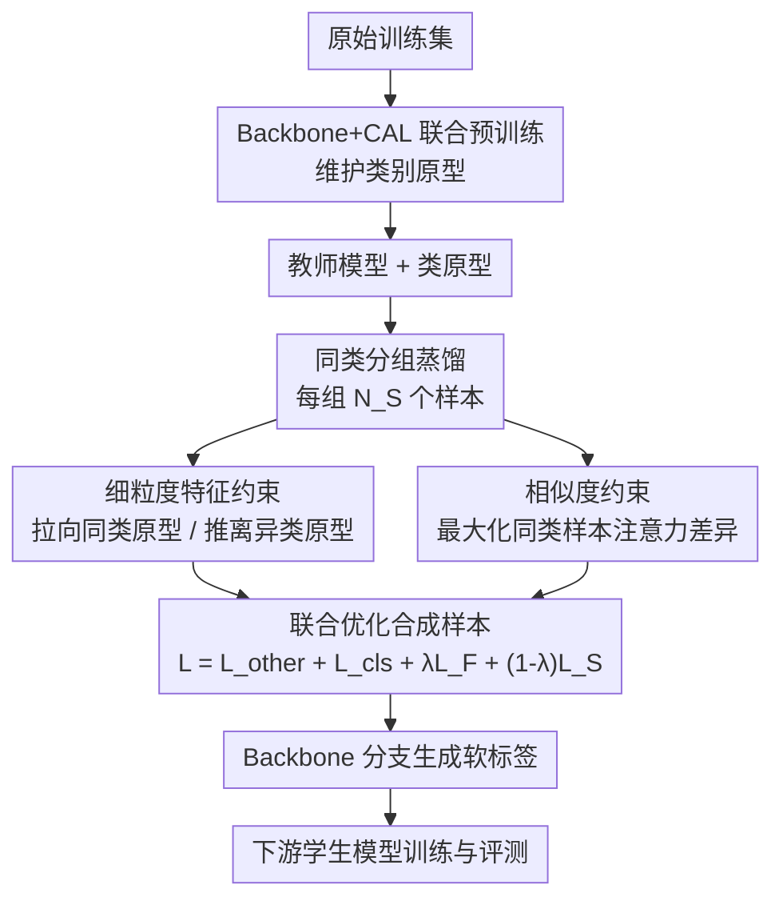

# FD$^2$: A Dedicated Framework for Fine-Grained Dataset Distillation

**会议**: ECCV 2026  
**arXiv**: [2603.25144](https://arxiv.org/abs/2603.25144)  
**代码**: [https://github.com/Guang000/FD2](https://github.com/Guang000/FD2)  
**领域**: 数据蒸馏 / 细粒度识别  
**关键词**: 数据集蒸馏, 细粒度识别, 反事实注意力学习, 解耦蒸馏, 类别原型

## 一句话总结
FD$^2$ 针对现有解耦式数据集蒸馏方法在细粒度数据集上忽略了判别性局部区域的问题，通过引入反事实注意力学习（CAL）提取判别性注意力图和类别原型，并在蒸馏阶段加入细粒度特征约束和同类样本相似度约束，作为即插即用模块显著提升 SRe2L++ 和 FADRM+ 在 CUB-200-2011、FGVC-Aircraft、Stanford Cars 等细粒度数据集上的蒸馏质量，IPC=1 时最大提升 +15.1%。

## 研究背景与动机

**领域现状**：数据集蒸馏（Dataset Distillation, DD）旨在将大规模训练集压缩为极小的合成集，使得在合成集上训练的模型性能接近在全量数据上训练。现有方法主要分为梯度匹配、分布匹配、轨迹匹配、解耦式蒸馏和生成式蒸馏五大类。其中，解耦式蒸馏（如 SRe2L、SRe2L++、FADRM+）将流程拆分为模型预训练、样本蒸馏和软标签生成三个阶段，在通用基准上兼顾了效率与精度。

**现有痛点**：直接将解耦式蒸馏方法搬到细粒度数据集（如 CUB-200-2011 鸟类识别）上时，会出现两个问题：（1）蒸馏出的合成集继承了原始数据"类内差异大、类间差异小"的细粒度特性，这使得学生模型难以学到判别性表征；（2）同一类内蒸馏出的多个样本过于相似，注意力热图显示它们聚焦在高度一致的区域，缺少对不同判别性部位的覆盖，导致学生模型可用的判别线索单一。

**核心矛盾**：解耦式蒸馏在优化合成样本时仅依赖粗粒度的类别标签监督——它强制类别级语义一致性，但并没有显式地鼓励细粒度层面的类内紧凑性和类间可分性。同时，同类样本的逐样本迭代合成过程共享几乎相同的优化路径，天然导致合成样本在解空间收敛到相似解。

**本文目标**：在不改变解耦式蒸馏整体流程的前提下，为细粒度数据集蒸馏引入专门的细粒度监督信号，以（1）抑制不利于识别的细粒度特性（提升类内紧凑性和类间可分性），（2）增强同类合成样本的注意力多样性（覆盖更多判别性区域）。

**切入角度**：作者观察到，细粒度识别中一个行之有效的思路是利用注意力机制定位判别性局部区域（如鸟喙、翅膀纹理），并通过反事实干预来量化注意力的贡献。如果将这一思路引入数据集蒸馏，用高质量的注意力图和由此构建的类别原型作为蒸馏时的额外监督，就有可能在保持解耦框架高效性的同时解决细粒度场景特有的问题。

**核心 idea**：用反事实注意力学习（CAL）提取的判别性注意力图和类别原型作为细粒度监督信号，在解耦式蒸馏的目标函数中追加两个即插即用约束——细粒度特征约束（拉向同类原型、推离异类原型）和相似度约束（最大化同类样本注意力图之间的距离），从而让合成集在特征空间类内聚拢、类间分开，在注意力空间覆盖不同判别区域。

## 方法详解

### 整体框架

FD$^2$ 遵循解耦式蒸馏的三阶段范式，作为一个附加模块嵌入到 SRe2L++ 或 FADRM+ 等现有解耦方法中。框架的核心创新发生在预训练和蒸馏两个阶段：预训练阶段用 Backbone+CAL 双分支联合训练教师模型并在线维护各类别的细粒度原型；蒸馏阶段将合成样本按同类分组（每组 $N_S$ 个），对每个样本引入细粒度特征约束和相似度约束，与原始蒸馏目标联合优化；软标签生成阶段仅使用 Backbone 分支，以避免 CAL 分支与下游 Backbone 学生的架构不匹配引入偏差。

### 关键设计

**1. 反事实注意力学习（CAL）预训练：定位判别区域并构建细粒度类原型**

解耦式蒸馏的教师模型通常只使用标准 Backbone 分类器，缺乏对细粒度判别区域的显式建模能力。FD$^2$ 在预训练阶段引入 CAL 分支，与 Backbone 分类器联合优化。给定输入图像 $x$，Backbone 提取特征图 $F$，CAL 的注意力预测器 $g(\cdot)$ 生成 $M$ 张注意力图 $A=\{A_m\}_{m=1}^M$，经双线性注意力池化得到事实表征 $z=\Phi(F,A)$。CAL 的核心机制是反事实干预：将注意力图替换为扰动版本 $\bar{A}$ 得到反事实表征 $\hat{z}=\Phi(F,\bar{A})$，用事实 logit 减去反事实 logit 得到效应预测 $p_{\text{eff}}=p_{\text{raw}}-W\hat{z}$——如果注意力确实聚焦在判别性区域，替换后会削弱类别证据，使得 $p_{\text{eff}}$ 更具判别力。训练时同时优化 $p_{\text{raw}}$ 和 $p_{\text{eff}}$ 的交叉熵损失。

与此同时，CAL 以动量更新方式在线维护各类别的特征中心作为类别原型：$c_y \leftarrow (1-\mu)c_y + \mu\,\text{Norm}(z)$，并通过中心正则项 $\mathcal{L}_{\text{center}}=\|z-\text{Norm}(c_y)\|_2^2$ 鼓励事实表征向本类原型靠拢。整体预训练损失为 $\mathcal{L}_{\text{pre}}=(1-\alpha)\mathcal{L}_{\text{ce}}(p_{\text{bb}},y)+\alpha\mathcal{L}_{\text{CAL}}$，其中 $\alpha$ 控制 CAL 分支的贡献比例。这一双分支联合优化确保 Backbone 教师既保留了生成稳定软标签的能力，又从 CAL 获得了判别性表征和原型聚合的好处。

**2. 细粒度特征约束：同时提升类内紧凑性与类间可分性**

蒸馏阶段的第一个核心约束直接针对细粒度数据"类内散、类间近"的问题。对于类别 $y$ 的第 $i$ 个合成样本 $\tilde{x}_{y,i}$，教师模型提取其特征表征 $z_{y,i}$，细粒度特征约束定义为：

$$\mathcal{L}_F(\tilde{x}_{y,i}) = \beta\,\ell_2(z_{y,i},c_y) + (1-\beta)\left(1-\mathbb{E}_{k\neq y}\big[\ell_2(z_{y,i},c_k)\big]\right)$$

其中 $\ell_2(u,v)=\|u-v\|_2/(\|u\|_2+\|v\|_2+\varepsilon)$ 是对称归一化的欧氏距离，$c_y$ 和 $c_k$ 分别是当前类和其他类的原型，$\beta\in[0,1]$ 控制"拉向本类"和"推离他类"的相对权重。第一项最小化样本与同类原型的距离（增强类内紧凑性），第二项最大化与异类原型的距离（增强类间可分性）。该约束作为即插即用项加入蒸馏目标，不改变原有优化流程。作者在补充材料中给出了理论分析：在原型逼近判别性类代表的假设下，最小化 $\mathcal{L}_F$ 等价于最大化归一化原型空间中的判别分数，与经典判别分析中"减小类内偏差、增大类间中心距"的原理一致。

**3. 相似度约束：增强同类合成样本的注意力多样性**

第二个约束解决同类合成样本过于相似、注意力区域高度重叠的问题。在解耦式蒸馏中，同类样本的逐样本迭代合成共享相同的优化流程和相似的初始化图像（从原始数据中随机选取），这导致它们的注意力图天然趋同。相似度约束在同类样本组（大小为 $N_S$）内，对第 $i$ 个（$i>1$）合成样本最大化其注意力图与同组先前样本注意力图之间的距离：

$$\mathcal{L}_S(\tilde{x}_{y,i}) = 1 - \mathbb{E}_{j<i}\big[\ell_2(A_{y,i}, A_{y,j})\big],\quad 1 < i \leq N_S$$

当 $i=1$ 时该约束为零（没有可比较的先前样本）。通过最小化 $\mathcal{L}_S$，当前样本被迫将注意力分配到与同组已有样本不同的判别性区域，从而让同一类的多个合成样本覆盖更丰富的局部判别线索。补充材料中的理论分析表明，最小化 $\mathcal{L}_S$ 扩大了下界 $\text{tr}(\Sigma_A^{(y)})$，即增强了同类样本注意力图的整体离散度，进而通过线性注意力池化传递到表征空间，提升了表征多样性。

### 损失函数 / 训练策略

蒸馏阶段的每个合成样本还接受双分类器（Backbone + CAL）的类别监督：

$$\mathcal{L}_{\text{cls}}(\tilde{x}_{y,i}) = (1-\alpha)\mathcal{L}_{\text{ce}}(p_{\text{bb}}^{y,i}, y) + \alpha\mathcal{L}_{\text{ce}}(p_{\text{cal}}^{y,i}, y)$$

最终每个合成样本的优化目标为：

$$\mathcal{L}_{\text{total}} = \mathcal{L}_{\text{other}} + \mathcal{L}_{\text{cls}} + \lambda\mathcal{L}_F + (1-\lambda)\mathcal{L}_S$$

其中 $\mathcal{L}_{\text{other}}$ 是底层解耦蒸馏方法的原始损失（如 SRe2L++ 的 BN 统计量匹配损失），$\lambda$ 控制两个新增约束的相对权重。一个关键实现细节是分组蒸馏策略：每个类别的 IPC 个合成样本被分成 $G = \lceil\text{IPC}/N_S\rceil$ 组，前 $G-1$ 组各含 $N_S$ 个样本，最后一组含剩余样本。这样避免了相似度约束在样本数过多时引入弱判别性区域。预训练选择 $N_S=4$、$\lambda=0.8$、$\beta=0.5$ 作为默认配置，且预训练和蒸馏阶段使用相同的 CAL 比例 $\alpha$ 以保持特征分布一致。

## 实验关键数据

### 主实验

FD$^2$ 在三个细粒度数据集（CUB-200-2011、FGVC-Aircraft、Stanford Cars）和两个通用数据集（ImageNette、ImageWoof）上评估，作为附加模块集成到 SRe2L++ 和 FADRM+ 中。下表为细粒度数据集上 IPC=1/3/5 时的 Top-1 精度对比（ResNet18 学生）。

| 数据集 | IPC | RDED | SRe2L++ | SRe2L++$_{\text{FD}^2}$ | FADRM+ | FADRM+$_{\text{FD}^2}$ |
|--------|-----|------|---------|------------------------|--------|------------------------|
| CUB-200-2011 | 1 | 38.3 | 53.4 | **56.4** (+3.0) | 54.8 | 55.0 (+0.2) |
| CUB-200-2011 | 3 | 52.6 | 60.0 | **64.9** (+4.9) | 64.0 | 64.6 (+0.6) |
| CUB-200-2011 | 5 | 63.9 | 63.5 | **67.0** (+3.5) | 66.4 | 67.5 (+1.1) |
| FGVC-Aircraft | 1 | 22.1 | 52.6 | **58.2** (+5.6) | 55.0 | 60.5 (+5.5) |
| FGVC-Aircraft | 3 | 36.4 | 66.6 | **76.1** (+9.5) | 72.9 | 75.1 (+2.2) |
| FGVC-Aircraft | 5 | 38.6 | 68.3 | **80.0** (+11.7) | 74.0 | 77.6 (+3.6) |
| Stanford Cars | 1 | 33.0 | 52.4 | **64.5** (+12.1) | 60.3 | 74.1 (+13.8) |
| Stanford Cars | 3 | 69.4 | 68.2 | **75.2** (+7.0) | 75.0 | 84.8 (+9.8) |
| Stanford Cars | 5 | 76.1 | 70.9 | **81.4** (+10.5) | 77.7 | 86.6 (+8.9) |

使用 ResNet50 作为学生时，提升更为显著。例如 CUB-200-2011 IPC=1 时 SRe2L++$_{\text{FD}^2}$ 达到 70.1%（+9.0%），Stanford Cars IPC=1 时 SRe2L++$_{\text{FD}^2}$ 达到 80.7%（+15.1%）。通用数据集上，FD$^2$ 在大容量学生（ResNet50）上提升明显（如 ImageWoof IPC=50 时 FADRM+$_{\text{FD}^2}$ 达 80.2%，+8.5%），在小容量学生（ResNet18）上增益有限——表明 FD$^2$ 引入的细粒度判别线索更依赖模型容量来有效利用。

跨架构泛化实验中（CUB-200-2011, IPC=3），SRe2L++$_{\text{FD}^2}$ 在 ShuffleNetV2（+9.1%）、MobileNetV2（+5.8%）、DenseNet121（+3.8%）、ConvNeXt-Tiny（+1.5%）上均有一致提升，证明蒸馏出的合成集对不同架构学生具有良好迁移性。

### 消融实验

下表展示不同约束组合在 CUB-200-2011 IPC=3 下的效果：

| 配置 | $\mathcal{L}_F$ | $\mathcal{L}_S$ | Top-1 Acc |
|------|:---:|:---:|:---:|
| Baseline (仅 $\mathcal{L}_{\text{other}}+\mathcal{L}_{\text{cls}}$) | -- | -- | 63.4 |
| + 细粒度特征约束 | ✓ | -- | 64.8 |
| + 相似度约束 | -- | ✓ | 64.6 |
| + 两个约束 | ✓ | ✓ | **64.9** |

两个约束各自带来提升，联合使用时精度最高（64.9%），验证了它们互补——$\mathcal{L}_F$ 改善特征空间的类内紧凑性和类间可分性，$\mathcal{L}_S$ 提升注意力空间的多样性。

其他关键消融结论：（1）$\beta=0.5$（$\mathcal{L}_F$ 中拉近与推远的平衡）达到最优；（2）$N_S=4$（相似度约束的组大小）达到最优 66.1%，$N_S=5$ 时因可用判别线索有限而降为 64.6%；（3）$\lambda=0.8$（$\mathcal{L}_F$ 和 $\mathcal{L}_S$ 的相对权重）达到最优 67.0%，表明细粒度特征约束对蒸馏质量贡献更大；（4）预训练和蒸馏阶段使用相同的 CAL 比例 $\alpha$ 可减少阶段间特征分布不匹配，$\alpha=0.5$ 在 CUB-200-2011 上最佳（63.4%）。

### 关键发现

- **细粒度特征约束的贡献略大于相似度约束**（分别 +1.4% 和 +1.2%），但二者联合时互补效应使总提升达 +1.5%，表明单纯改善特征空间或注意力空间都不足够，两者协同才最有效。
- **IPC=1 时提升最显著**：只有一个合成样本时，FD$^2$ 的细粒度监督信号帮助样本最大程度保留判别性线索——Stanford Cars 上 SRe2L++$_{\text{FD}^2}$ 比 SRe2L++ 高出 12.1% (ResNet18) / 15.1% (ResNet50)。
- **t-SNE 可视化和类中心最近邻距离分析**证实 FD$^2$ 合成的样本类内更紧凑、类间更分离；注意力热图对比显示引入 $\mathcal{L}_S$ 后同类样本聚焦于不同判性区域，MPCS（平均成对余弦相似度）显著下降。
- **RDED（基于裁剪真实图像的方法）表现始终最差**，说明粗粒度裁剪无法可靠捕获细粒度判别区域，进一步凸显了 FD$^2$ 利用 CAL 精确定位判别性区域的价值。
- **效率开销可接受**：SRe2L++$_{\text{FD}^2}$ 单次迭代耗时 96.8ms（SRe2L++ 为 64.6ms），峰值 GPU 内存 5.3GB（SRe2L++ 为 4.8GB），相比 FADRM+（12.2GB）和 DSA（68.4GB）仍然高效。

## 亮点与洞察

- **将反事实注意力从分类任务迁移到数据集蒸馏，定位判别区域作为蒸馏的细粒度监督信号**：这不是简单的"加一个 attention module"，而是用 CAL 的 fact-counterfact 对比机制确保注意力图真正聚焦在判别性部位，再用这些高质量注意力图和由此构建的类别原型来指导合成样本的优化方向，相当于在蒸馏过程中引入了"什么才是关键判别线索"的先验知识。
- **两个约束分别从特征空间和注意力空间发力，互补且各有侧重**：$\mathcal{L}_F$ 管"每个样本更像谁"（在特征空间中拉向同类原型、推离异类原型），$\mathcal{L}_S$ 管"同类样本之间别一样"（在注意力空间中彼此推开以覆盖不同判别区域）——前者保证判别的准确性，后者保证判别的丰富性，这种双重空间约束的设计思路可迁移到其他需要合成多样化高质量数据的任务。
- **分组蒸馏策略巧妙地平衡了多样性约束与计算开销**：将同类 IPC 个样本分成 $N_S=4$ 的小组，约束只在组内生效，既避免了组过大导致的冗余注意力重复，又保证了组内多样性约束的计算可控，还天然支持多进程/多 GPU 并行。这种"局部多样性 + 全局分组"的策略对任何需要合成多样化样本的场景都有参考价值。
- **CAL 的反事实干预机制本质上是量化了注意力的因果效应**：用"替换注意力后预测变差多少"来判断注意力区域是否真的判别性——这个因果归因的思路不限于细粒度识别，可以迁移到任何需要评估特征重要性的场景（如可解释性、特征选择、知识蒸馏中的软目标构建）。

## 局限与展望

- **小容量学生模型上增益有限**：ImageNette 上 ResNet18 + FADRM+$_{\text{FD}^2}$ 几乎没有提升甚至 IPC=1 时略降（-0.6%），说明 FD$^2$ 引入的细粒度判别线索需要足够的模型容量才能被有效利用——对于轻量级部署场景，需要进一步研究如何压缩或蒸馏这些线索。
- **依赖 CAL 教师的注意力质量**：FD$^2$ 的效果建立在 CAL 能准确定位判别性区域的前提下。在 ShuffleNetV2 等极轻量骨干上，CAL 因其特征判别力不足而收敛困难（仅在 $\alpha=0.1$ 时可用），这限制了 FD$^2$ 在资源受限场景下的适用性。
- **仅验证解耦式蒸馏范式**：FD$^2$ 的设计紧密依赖解耦式蒸馏的预训练-蒸馏-软标签三阶段流程。作者提出未来将其扩展到基于 ViT 的模型和更大规模数据集（如 ImageNet-1K），以及更广泛的蒸馏范式。
- **组大小 $N_S$ 的选择缺乏自适应机制**：$N_S$ 对最终性能敏感（2/3/4/5 对应 64.1/64.9/66.1/64.6），但选择依据是经验性的网格搜索，能否根据数据集特性自动确定组大小是一个有意义的改进方向。
- **通用数据集上的泛化性仍需加强**：作者承认 FD$^2$ 在通用数据集上的改进不如细粒度数据集显著，未来如何让 FD$^2$ 在通用场景下也带来一致性收益是一个开放问题。

## 相关工作与启发

- **vs SRe2L / SRe2L++ / FADRM+**：这些解耦式蒸馏方法是 FD$^2$ 的底座，它们通过 BN 统计量匹配、多尺度残差连接等机制在通用基准上表现优异，但仅依赖粗粒度类别标签监督。FD$^2$ 不改变它们的工作流，只是追加了两个细粒度约束作为即插即用项。从实验看，FD$^2$ 对 SRe2L++ 的提升比对 FADRM+ 更显著（后者本身已有更强的多模型集成能力，留给 FD$^2$ 的提升空间较小）。
- **vs CAL**：FD$^2$ 直接采用 CAL 作为注意力提取和原型构建模块，但创新在于将 CAL 的输出从分类任务重新定位为数据集蒸馏的监督信号。CAL 在原始论文中仅用于提升分类精度，FD$^2$ 则将其扩展为蒸馏过程中的细粒度约束来源，展示了反事实注意力在数据合成方向的新用途。
- **vs RDED**：RDED 通过裁剪真实图像构建合成集，本质上是利用真实图像的局部区域。但它的裁剪是粗粒度的（基于图像坐标裁剪），无法保证裁剪区域包含判别性部位。FD$^2$ 的注意力引导合成在判别性区域定位上更精确，实验也印证了两者的巨大性能差距（CUB-200 IPC=1: 38.3% vs 56.4%）。

## 评分
- 新颖性: ⭐⭐⭐⭐ 将反事实注意力学习引入数据集蒸馏用于解决细粒度场景的类内散/类间近和同类样本同质化问题，思路清晰且切入点精准，不是简单的"加模块"而是从问题本质出发设计了两个互补约束。
- 实验充分度: ⭐⭐⭐⭐⭐ 覆盖 3 个细粒度 + 2 个通用数据集、2 个底层蒸馏方法、5 种学生架构、多组 IPC 设置，消融实验覆盖 CAL 比例、$\beta$、$N_S$、约束组合、$\lambda$、$\mathcal{L}_{\text{cls}}$ 等全部关键超参，配有 t-SNE、注意力热图、MPCS 等多维度可视化分析，补充材料还提供了理论证明和效率对比。
- 写作质量: ⭐⭐⭐⭐ 问题动机通过 Fig.1 的定量可视化（类内离散度 + 类间距离）和图注意力热图引出，方法描述清晰且配有完整算法伪代码，补充材料的理论分析为两个约束的有效性提供了严谨的数学支持。
- 价值: ⭐⭐⭐⭐ 细粒度数据集蒸馏是一个有意义但此前被忽视的问题，FD$^2$ 作为首个针对性框架，且设计为即插即用模块可直接增强现有解耦方法，对需要高效处理细粒度数据的实际应用场景（如物种识别、车型识别）有直接价值。

<!-- RELATED:START -->

## 相关论文

- [\[CVPR 2025\] FG-VCE: Towards Fine-Grained Interpretability — Counterfactual Explanations for Misclassification with Saliency Partition](../../CVPR2025/causal_inference/towards_fine-grained_interpretability_counterfactual_explanations_for_misclassif.md)
- [\[ECCV 2024\] Distill Gold from Massive Ores: Bi-level Data Pruning towards Efficient Dataset Distillation](../../ECCV2024/causal_inference/distill_gold_from_massive_ores_bi-level_data_pruning_towards_efficient_dataset_d.md)
- [\[ICLR 2026\] Coarse-to-Fine Learning of Dynamic Causal Structures](../../ICLR2026/causal_inference/coarse-to-fine_learning_of_dynamic_causal_structures.md)
- [\[ICLR 2026\] Counterfactual LLM-based Framework for Measuring Rhetorical Style](../../ICLR2026/causal_inference/counterfactual_llm-based_framework_for_measuring_rhetorical_style.md)
- [\[CVPR 2026\] A Polynomial Chaos Framework for Causal Discovery in Nonlinear Uncertain Systems](../../CVPR2026/causal_inference/a_polynomial_chaos_framework_for_causal_discovery_in_nonlinear_uncertain_systems.md)

<!-- RELATED:END -->
