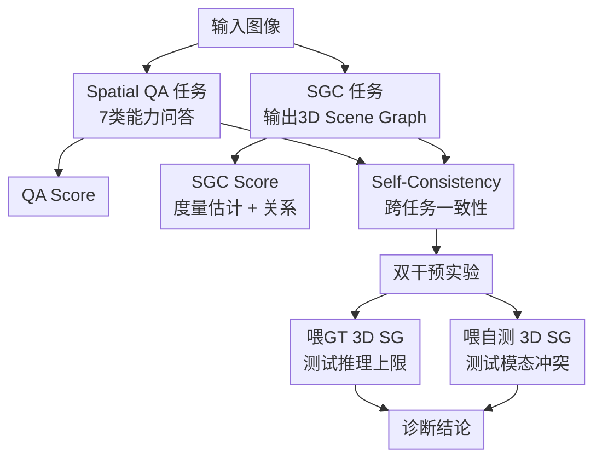

# From Hallucination to Grounding: Diagnosing Visual Spatial Intelligence via CRISP

**会议**: ECCV2026  
**arXiv**: [2606.26535](https://arxiv.org/abs/2606.26535)  
**代码**: [https://github.com/iiyamayuki/CRISP-Bench](https://github.com/iiyamayuki/CRISP-Bench)  
**领域**: 多模态VLM / 评测基准  
**关键词**: 空间推理, 3D场景图, 感知-推理解耦, 语义捷径, 一致性  

## 一句话总结

CRISP 是一个结构诊断式视觉空间智能评测基准，通过 Spatial QA + 3D Scene Graph 双任务范式与跨任务一致性协议，揭示 VLM 的空间推理究竟是真正的 3D 几何理解还是依靠语言先验的语义捷径。

## 研究背景与动机

当前视觉语言模型在语义识别上已相当出色——认出"桌子上的杯子""椅子旁边的桌子"这类静态语义关系不成问题。但真正服务于具身智能和自动驾驶的空间智能，需要的远不止语义标签：机器人判断水杯和桌沿的相对距离、估计某物体是否挡路、在脑海里"旋转"视角去理解另一侧的空间布局——这些能力要求模型具备隐式的 3D 空间认知，能从单张 2D 图像中恢复出场景的内在几何结构。然而，现有评测标准习惯用分类式 QA 来评估空间推理，比如问"椅子在桌子的左边还是右边？"模型回答对了就算过关。这种做法的隐患在于：模型完全可以通过语言先验（统计上"椅子常在桌子旁""画框通常在墙边"）来猜对答案，并不需要真正构建场景的三维几何。当前许多 VLM 在看似正确的回答背后隐藏着严重的内在不一致性——它们输出正确结果但中间的空间建模是错的，这被本文称为"空间智能的幻觉"。

这一问题的核心矛盾在于：传统 QA 格式无法区分"懂几何"和"懂语言统计"。一个模型可以答对大量空间问题，但它的 3D 感知可能几乎为零——只要训练数据中存在足够的语义共现模式。更糟糕的是，即使模型确实具备部分感知能力，我们也没法判断它到底是在用视觉信号推理，还是在用语言先验补偿。现有的探测方法也难当此任：文本 rationale 自身就包含幻觉，2D 认知地图缺乏 3D 度量精度，注意力图只能说明模型看了某个区域但不能说明它理解了深度和尺度。我们需要一个更严格的诊断工具。

本文的切入点是：要真正诊断空间智能，必须让模型把它的隐式 3D 建模"显式外化"出来，不给它留语言先验的逃生通道。CRISP 的双任务范式正是为此设计——模型既要回答空间 QA，又要生成结构化的 3D Scene Graph，包含精确的度量估计（物体尺寸、距离）和拓扑关系（前后左右等语义关系）。然后通过跨任务一致性来验证模型的推理是否真正锚定在它自己的几何感知上。**核心 idea：一个真正理解场景的模型，它的 QA 回答必须与它自己生成的 3D Scene Graph 保持一致——这种跨任务一致性本身才是空间理解的可靠诊断信号，而非单纯的答题正确率。**

## 方法详解

### 整体框架

CRISP 是一个结构诊断式评测基准，核心是让模型在两份"考卷"上答题——一份传统空间 QA，另一份 3D Scene Graph Construction（SGC）——然后检查两份答卷是否自洽。整个框架包含四个模块：数据构建、双任务设计、评估指标、干预诊断协议。

数据来自 nuScenes（室外驾驶）和 ScanNet++（室内场景），精选 1,162 张高质量静态单视图（室内外 1:1），经过严格的可见性过滤（遮挡率<0.8、2D 框最短边≥40 像素）和多样性过滤后，通过确定性逻辑引擎从 3D ground truth 中程序化生成 9,839 道 QA 问题。一个精妙的设计是全程使用数字 ID 而非语义标签来指代物体——提问中共不出现"椅子""桌子"这类词，从而切断语义共现先验的泄漏通道。

评估分三个层面：QA Score（MCQ 用准确率、数值答案用 MRA），SGC Score（度量估计 $S_{est}$ 和关系准确率 $S_{rel}$ 的均值），以及最具诊断意义的 Self-Consistency Score——用模型自身生成的 SGC 经确定性逻辑引擎推导出 QA 答案，然后与模型直接给出的 QA 回答计算对齐分数。

### 关键设计

**1. 双任务结构诊断：让隐式建模无处藏身**

传统空间评测只用 QA，模型可以依靠语言先验蒙混过关。CRISP 的核心洞察是：要诊断一件事，就得让它暴露。为此 CRISP 同时设计了 Spatial QA 和 3D Scene Graph Construction 两个互补任务。QA 测试"显式推理结果"，SGC 测试"隐式感知建模"。这两个任务的组合提供了四象限诊断：QA 正确 + SGC 混乱 = 语义捷径（模型靠语言先验猜对答案但内在几何建模崩溃）；QA 错误 + SGC 合理 = 感知-推理断连（建了好的场景图，推理时没用）；两者一致且正确 = 真正理解；两者一致且错误 = 一致幻觉（语言先验太强，连 SGC 也被带偏了）。SGC 任务采用星形拓扑生成策略——给定一个中心物体，模型只生成它与其他物体的关系子图。这不仅使输出规模可控，更关键的是实验验证了此格式下所有模型的格式合规率>99%，说明低 SGC 得分确实来自感知缺陷而非格式能力不足。

**2. Self-Consistency 跨任务一致性：最严格的"是否真懂"检验**

这是 CRISP 最核心的诊断工具，本质上是"用自己的另一份答卷来验证自己"。具体分两步：首先用一个确定性逻辑引擎解析模型输出的 3D Scene Graph，从中符号推导出对应 QA 问题的答案（Derived QA），比如从 SGC 中的"物体 5 在物体 3 左边 1.2 米"推导出"物体 5 在物体 3 左边"。然后比较 Derived QA 与模型直接给出的 QA 回答（$A_{QA}$）之间的一致性。注意这里不比较任何一项与 ground truth 的对错——一个模型可以一致地"错"（所谓"一致幻觉"），这同样不叫理解。真正重要的是：如果模型的空间推理是真实锚定在几何感知上的，那么 $A_{QA}$ 必须与 SGC 推导结果一致。实验确实发现约 10-12% 的一致幻觉样本：模型用 SGC 推导和直接 QA 回答自洽但都偏离了 ground truth，这说明语言先验的牵引力足以覆盖感知信号。

**3. Oracle 干预实验：把感知和推理切开看**

为了回答"模型到底是感知不行还是推理不行"，CRISP 设计了双干预实验。第一个条件是给模型同时喂图像和 Ground-Truth 3D Scene Graph——模拟"理想感知"下的推理能力上限。第二个条件是喂图像和模型自己预测的 SGC（Pred SG）——模拟"不完美但真实的感知"下的推理鲁棒性。通过对比这两种条件的 QA 表现与基线（仅图像），可以精准定位瓶颈在哪。

结果是惊人的。注入 GT 3D SG 后几乎所有模型的 QA 都大幅跃升，Gemini 2.5 Flash 提升 30.3 个百分点，接近纯符号推理上限（约 80%）。这有两个证据意义：第一，它证明当前顶级 VLM 内部存在鲁棒的潜在推理引擎，完全有能力做复杂的多跳空间推理；第二，既然推理能力没问题，那瓶颈一定在感知端——具体而言，在感知输出到推理引擎的"对齐"环节。而喂入 Pred SG 时，大多数模型的 QA 反而下降，说明模型对自己生成的错误文本化输出存在信任偏差，宁可相信它也不回头用视觉信号校正。Gemini 2.5 Flash 是唯一例外（Pred SG 提升 QA），暗示其 SGC 质量跨越了某个临界阈值——当自测 SGC 够好时，显式结构本身就成了推理的认知支架。

**4. 三模式诊断分类：从发现问题到指引改进**

基于以上分析，CRISP 归纳出三种诊断模式并给出对应的改进路线。第一种是"语义捷径"型（高 QA + 低 SGC/低 Consistency）：模型绕过几何依靠语言先验作答，需要强化视觉编码器提升原始度量感知（比如注入深度先验）。第二种是"感知-推理断连"型（中高 SGC + 低 QA）：视觉编码器能提取粗略结构但推理引擎没有锚定它，需要重新设计多模态对齐策略来弥合内部利用鸿沟。第三种是"模态信任偏差"型（喂自测 SGC 后 QA 反而下降）：模型优先相信自己生成的有误文本而非视觉信号，需要升级 LLM backbone 的冲突解决能力和组合推理深度。三类模式的诊断依据均可从 CRISP 的三维得分（QA / SGC / Consistency）直接读取，为后续空间智能研究提供了明确可操作的优化方向。

## 实验关键数据

### 主实验

CRISP 评测了 13 个 SOTA VLM，包括闭源模型（Gemini 2.5 Flash/Pro、Gemini 3 Flash、GPT-5 Mini/5.2）、开源模型（Qwen2.5/3-VL、InternVL3.5、LLaVA-OneVision-1.5）以及专门空间模型（Cambrian-S、VG LLM），均为零样本设置，且禁用了大部分模型的思考模式以隔离测试时计算的影响。

| 模型 | QA | S_est | S_rel | SGC | Consistency |
|------|-----|-------|-------|-----|-------------|
| Gemini-2.5-Pro | 58.93 | 57.79 | 71.36 | 64.58 | 57.28 |
| Gemini-3-Flash | 53.41 | 65.25 | 72.33 | 68.79 | 55.20 |
| GPT-5-Mini | 54.15 | 61.39 | 72.01 | 66.70 | 56.75 |
| Qwen3-VL-8B | 55.34 | 57.09 | 67.62 | 62.35 | 52.16 |
| InternVL3.5-38B | 53.98 | 53.12 | 64.68 | 58.90 | 48.70 |
| LLaVA-OV-1.5-8B | 47.85 | 44.53 | 56.12 | 50.33 | 38.98 |
| Cambrian-S（专门空间） | 45.95 | 46.76 | 47.50 | 47.13 | 34.22 |

核心发现：所有模型的绝对得分远低于传统 VQA 的报道分数，说明真正的空间智能远未被攻克。所有模型在拓扑关系（S_rel）上显著优于度量估计（S_est），精确的 3D 度量感知是当前最大的共同瓶颈。专门的视觉空间模型反而落后于通用基线，暗示现有空间后训练方法可能只激活了局部结构线索而没有确保推理引擎利用它们。值得注意的是 Qwen3-VL-8B 开源模型的表现接近 GPT-5-Mini，说明闭源与开源的差距在迅速缩小。

### 消融实验

盲测实验（去掉视觉输入，仅用数字 ID 提问）为理解各模型的视觉贡献量提供了关键基准线。

| 模型 | QA Blind（下降） | SGC Blind（下降） | 关键解读 |
|------|------------------|-------------------|----------|
| Gemini-3-Flash | 7.94 (-45.47) | 39.47 (-29.32) | 视觉贡献最大，但 Blind 时安全策略导致大量拒答 |
| Gemini-2.5-Pro | 26.90 (-32.03) | 37.05 (-27.53) | 视觉对 SGC 提升明显，感知端能力扎实 |
| Qwen2.5-VL-7B | 28.47 (-16.31) | 39.46 (-3.24) | ⚠️ QA提升显著但SGC几乎不变——语义-几何鸿沟 |
| Qwen3-VL-8B | 31.29 (-24.05) | 34.75 (-27.60) | 视觉增益在QA和SGC上均衡，无鸿沟 |
| LLaVA-OV-1.5-8B | 22.39 (-25.46) | 43.20 (-7.13) | SGC增益极小，视觉主要用于语义识别而非几何理解 |

### 关键发现

- **语义-几何鸿沟是最具启发性的发现**：Qwen2.5-VL 在有视觉输入时 QA 提升 16.31 分，但 SGC 仅提升 3.24 分，几乎回到基线。这意味着它的视觉编码器成功识别了画面中的物体（恢复了语义上下文），但没有转化为"它们在哪"的几何理解——模型知道画里有椅子，但不知道椅子在画面中的具体位置和距离。这有力地证明传统 QA 评测会把语义识别与空间理解混为一谈。
- **感知-推理断连是闭源模型的典型问题**：Gemini 2.5 Flash 的 SGC 得分几乎与 Pro 版本持平（仅低 0.34 分），但 QA 差距达 11.25 分——它建了合理的场景图，推理时却没有利用它。干预实验进一步确认：一旦喂入 GT 3D SG，QA 飙升 30 个百分点，说明推理引擎本身完好无损，问题在于感知输出到推理输入的对齐环节。
- **认知支架效应**：即使自测 SGC 有度量误差，大多数模型在组合推理（compositional logic）任务上仍然受益。这说明显式结构化表示本身具有认知释放功能——即便度量噪声大，结构拓扑也释放了模型维护空间关系的计算负担，让有限资源可以集中于高层推理。

## 亮点与洞察

- **Self-Consistency 替代"正确率"作为理解指标**：这是本文最有价值的概念贡献。传统评测只看最终答案对错，而 CRISP 把"跨任务内部一致性"作为理解与否的判定标准——答对不一定懂，但答对且与自己画的场景图吻合，才说明真懂。这一思路可以迁移到任何需要诊断模型"是真理解还是在作弊"的场景。
- **Oracle 干预实验的设计极为干净**：只改输入条件（GT vs Pred SGC）就隔离出感知和推理的因果关系，类似科学实验的"控制变量法"，干净地证明了核心结论——推理引擎没问题，问题在对齐。这个实验范式可以直接推广到其他需要解耦感知与推理的任务（如导航、物体操作）。
- **数字 ID 反泄漏设计**：看似小改动但"堵死了一条大路"。SGC 任务中用数字 ID 而非语义标签指代物体，从根源上切断了语义共现先验的泄漏通道。许多空间评测声称在测"空间理解"，但它们的 benchmark 泄露了大量语义信息（比如问题本身就包含了物体名，而物体名天然携带位置分布先验）。CRISP 的这个设计细节值得所有空间评测学习。
- **从诊断到行动的完整闭环**：CRISP 不仅给出三种诊断模式，还对每种模式给出了具体的改进路径——这是纯评测工作很少做到的，让基准结果可直接转化为研发方向。

## 局限与展望

- 论文自身承认，"感知-推理断连"等术语描述的是经验观察到的行为综合征，而非经过因果验证的神经机制。目前的证据是相关性的，需要更精细的因果实验（如对中间表示做 ablation-by-intervention）来确认是否存在真正的"断连"。
- CRISP 聚焦于静态单视图 3D 几何理解，这是必要前提但不是充分条件。真正的空间智能需要处理动态多视图场景（如视差、运动遮挡），这些留给了未来工作。
- 数据来源为 nuScenes 和 ScanNet++，场景类型限于城市道路与标准室内。极端环境如密集杂乱场景、透明物体、镜面反射、水面等几乎未覆盖，可能存在 domain bias。
- Oracle 干预实验中 GT 3D SG 以文本形式（自然语言描述）注入，而模型自身的 SGC 也是文本输出。这里存在一个竞争性假说：文本结构在形式上天然比原始视觉信号更容易推理——如果换用渲染的 3D 鸟瞰图注入，GPT-5 还能保持推理上限吗？区分"文本作为推理介质"和"结构信息本身"对推理的贡献，会是一个有趣的方向。

## 相关工作与启发

- **vs VSI-bench / OmniSpatial / SpatialEval**：这些空间 VLM 评测基准都采用纯 QA 格式，无法区分语义捷径和真实几何理解。CRISP 新增了 SGC 生成任务和 Consistency 指标，在诊断粒度上有本质提升。
- **vs SpatialRGPT / SpatialCLIP**：这些方法通过显式注入深度图来增强 VLM 的空间感知。CRISP 的诊断结果恰好为这类方法的必要性提供了最直接证据——如果感知-推理对齐是主要瓶颈，深度图作为一种显式结构先验很可能对症。
- **vs SPACE / Whatsup**：这些早期工作发现了 VLM 的空间缺陷但只指出"有问题"，没有回答"是感知还是推理的问题"。CRISP 的干预实验和三种诊断模式补上了这个空白。
- **vs SpatialReasoner / SpaceR**：这些工作用 RL 提升 VLM 空间推理。CRISP 揭示的开源模型缺乏多跳组合推理能力（而非感知能力）这一发现，为 RL 的训练策略提供了具体的优化目标——应该优先训练组合推理，而非改善感知。

## 评分

- 新颖性: ⭐⭐⭐⭐⭐ 用跨任务一致性而非正确率来诊断空间理解，Oracle 干预实验的设计尤为精妙，三个发现都有独立价值
- 实验充分度: ⭐⭐⭐⭐⭐ 13 个模型 × 4 个评测维度（QA/SGC/Consistency/Intervention），盲测、干预、复杂度分解实验设计干净有力
- 写作质量: ⭐⭐⭐⭐ 结构和论证清晰，但部分章节术语密集、需要反复回看才完全消化
- 价值: ⭐⭐⭐⭐⭐ 为空间 VLM 评测提供了全新的诊断范式，三种诊断模式+对应改进路线直接指导后续研究路线

<!-- RELATED:START -->

## 相关论文

- [\[ICLR 2026\] Grounding or Guessing? Visual Signals for Detecting Hallucinations in Sign Language Translation](../../ICLR2026/hallucination/grounding_or_guessing_visual_signals_for_detecting_hallucinations_in_sign_langua.md)
- [\[CVPR 2026\] First Logit Boosting: Visual Grounding Method to Mitigate Object Hallucination in Large Vision-Language Models](../../CVPR2026/hallucination/first_logit_boosting_visual_grounding_method_to_mitigate_object_hallucination_in.md)
- [\[ICLR 2026\] Mitigating Hallucination in Vision-Language Model with Depth and Spatial-aware Key-Value Refinement](../../ICLR2026/hallucination/mitigating_hallucination_in_vision-language_model_with_depth_and_spatial-aware_k.md)
- [\[ICLR 2026\] Visual Multi-Agent System: Mitigating Hallucination Snowballing via Visual Flow](../../ICLR2026/hallucination/visual_multi-agent_system_mitigating_hallucination_snowballing_via_visual_flow.md)
- [\[CVPR 2026\] Evaluating and Easing Hallucinations for GUI Grounding](../../CVPR2026/hallucination/exposing_and_evaluating_hallucinations_for_gui_grounding.md)

<!-- RELATED:END -->
