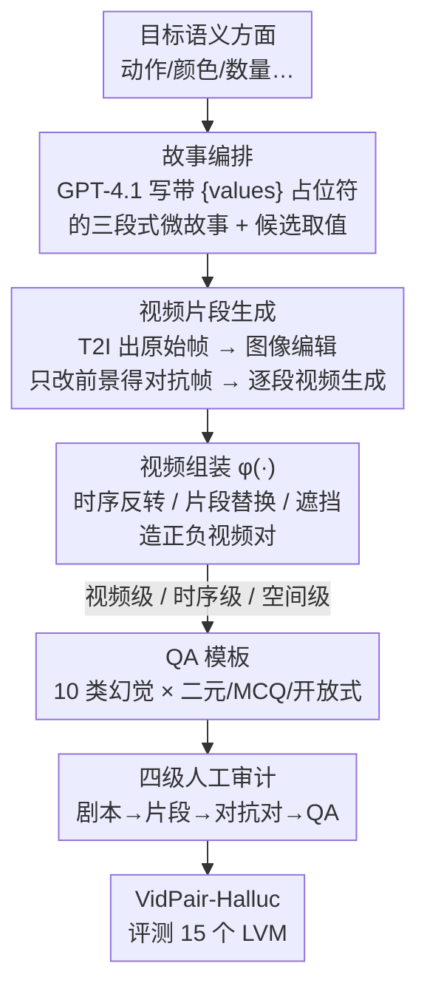

# No Place to Hide: Benchmarking Video Hallucination with Background-Controlled Pairs

**会议**: ECCV 2026  
**arXiv**: [2606.31933](https://arxiv.org/abs/2606.31933)  
**代码**: 项目页公开（论文标注 "code and data are available at the project page"，未给出具体 GitHub 链接）  
**领域**: 视频理解 / 多模态幻觉评测  
**关键词**: 视频幻觉、对抗视频对、背景可控、benchmark、生成式数据合成

## 一句话总结
本文提出 VidPair-Halluc 视频幻觉 benchmark，用「背景高度相似、前景语义显著不同」的对抗视频对，把模型出错的原因从背景变化里剥离出来、干净地归因到前景幻觉；配套的 PairFlow 三阶段生成流水线借助 T2I / 视频生成模型自动造出 1K 高质量视频对与 11K 时空 QA，评测显示主流大视频模型在这种受控设置下普遍大幅掉点。

## 研究背景与动机
视频幻觉（video hallucination）指大视频模型（LVM）生成与视觉证据不符却又自信满满的内容，其根源常在于视频编码器远弱于经过大规模预训练的 LLM，弱视觉信号导致「过度自信但错误」的输出。为了诊断这一问题，评测 benchmark 一路演进：最早的 Vript-HAL、EventHallusion 在单个视频上问时空问题，考察对物体关系、动作、事件序列的基础理解；VideoHallucer 进一步在单视频上引入对抗性文本（一真一假的成对二元问题、误导性 distractor），把矛头对准语言先验；再往后 HallusionBench、VidHalluc 开始用成对视觉输入来测细粒度语义对齐。然而这些工作有一个共同的软肋——它们要么靠文本扰动误导 LLM，要么用 CLIP/DINO 特征检索出「视觉上相似但背景仍会整体变化」的视频对，从未显式控制背景一致性。

这就埋下了一个致命的归因混淆：当一个模型答错时，你无法判断它是真的把前景语义搞错了（真幻觉），还是仅仅被背景、镜头运动的整体变化带偏了。背景是「与查询无关」的视觉上下文，前景才是「与查询相关」的关键证据；只有把背景尽可能钉死、只改前景，才能把出错干净地归到前景语义误读上。更麻烦的是，从真实视频里构造这种「背景几乎一样、只有关键前景不同」的对抗对代价极高——真实视频有固定剧情线和复杂时空依赖，逐帧编辑或帧替换往往破坏背景/实体一致性，视频编辑技术在复杂场景里又缺乏稳定性与保真度，靠编辑关键帧再生成则受制于稀缺的帧级 caption 和高昂标注成本。图像 VQA 领域早已借助 inpainting 和自动化流水线规模化生产对抗样本，但视频域一直卡在这个可扩展性瓶颈上，这正是「之前没人系统做」的技术壁垒所在。

本文的切入点是：既然文生图（T2I）和视频生成/编辑模型已经足够强，就可以绕开真实视频，用「先编故事、再生成片段、最后组装成对」的合成流水线，以极少人工介入造出背景一致、前景发散的对抗视频对。**核心 idea**：把「幻觉归因」这件事变成一个可控实验——通过合成手段固定住与查询无关的背景、只改动被问及的前景取值或时序顺序，让模型「无处遁形」（No Place to Hide），从而把视频幻觉的来源从背景漂移中彻底隔离出来，得到比真实视频挖掘更干净的诊断信号。

## 方法详解

### 整体框架
VidPair-Halluc 要解决的核心问题是「如何规模化地造出背景受控的对抗视频对，并据此严格评测 LVM 的细粒度视频幻觉」。整套系统由两部分咬合：一是数据生成引擎 **PairFlow**，二是在其产物上定义的三层对抗评测协议（视频级 / 时序级 / 空间级）。

PairFlow 是一条三阶段串行流水线。**Stage 1 故事编排**：针对某个目标语义方面（如动作、颜色、数量），用 GPT-4.1 自动写出带占位符 `{values}` 的三段式微故事，并为占位符准备若干「彼此显著不同、但都能顺理成章嵌入剧情」的候选取值（如 "choose" 与 "fold"）。**Stage 2 视频片段生成**：先用 T2I 模型（FLUX）根据脚本生成原始关键帧，再用图像编辑模型（SeedEdit）在保持背景不变的前提下精修前景、得到「原始 vs 对抗」两版关键帧；随后视频生成模型（Wan2.1/2.2-14B）以「上一片段的末帧 + 当前段脚本」为条件逐段生成，保证片段间的连贯性。**Stage 3 视频组装**：把片段拼成正样本视频，再用一个对抗函数 φ(·) 施加时序反转、片段替换、遮挡等操作，产出负样本视频，配成视频级 / 时序级 / 空间级三种粒度的对抗对。最后每个通过审核的视频对被套上覆盖 10 类时空幻觉的 QA 模板，生成二元 QA、多选 MCQ、开放式描述三类题目，并经过四级人工审计。

最终数据集含 2,000 段 15 秒视频、1K 对抗视频对、11,523 条 QA（4,000 二元 + 4,000 MCQ + 3,523 开放式），覆盖时序（33%）与空间（67%）两大类共 10 个语义视角。

### 关键设计

**1. 背景受控、前景发散的对抗对：把「谁害你出错」隔离开**

这是整个 benchmark 的立身之本，也是它区别于所有前作的核心。以往 VidHalluc 等用 CLIP/DINO 检索出的视频对，背景、镜头、前景往往一起变，模型答错时根本无法归因；本文则刻意把背景钉得尽可能死、只改「被查询的前景语义」，从而把出错干净地归到前景幻觉上。为了量化「背景到底有多像」，作者按是否依赖场景把对抗对分成两类分别度量：非场景依赖（如同一背景下改物体/动作）算整帧相似度，场景依赖（人本身就是背景）则先遮住一致主体、只在 mask 区域算指标。三项指标——DINOv2、LPIPS、SSIM——在非场景类上达到 DINOv2 0.94、LPIPS 0.15、SSIM 0.76，遮挡场景类 SSIM 更高到 0.90，相比随机对（DINOv2 仅 0.21）验证了背景确实被控制在极高相似度。正因为背景不再是变量，一旦模型答错，就只能是它没读懂前景——这正是「无处遁形」的字面含义。

**2. PairFlow 生成流水线：用「编故事+编辑关键帧+逐段续生」绕开真实视频的可扩展瓶颈**

真实视频造对抗对贵得离谱，而三种朴素合成路线各有硬伤：直接生成视频对或逐帧替换会破坏背景/实体一致性、产生突兀过渡；视频编辑在复杂场景缺乏稳定性与保真度；靠编辑关键帧再生成又受制于稀缺的帧级 caption 和高标注成本。PairFlow 的巧处在于把这三个坑各个击破：用占位符故事把「一个剧情、多种取值」参数化，保证候选取值既彼此显著不同又逻辑自洽；用图像编辑而非视频编辑来注入前景差异，规避视频编辑的不稳定；用「末帧续生」把片段一段段接起来，保证时序连贯。其数学表达是逐段生成：

$$V_i = f(V_{i-1}^{L}, S_i), \quad i \ge 2$$

其中 $f(\cdot)$ 是视频生成模型，输入上一片段 $V_{i-1}$ 的末帧 $V_{i-1}^{L}$ 与当前段脚本 $S_i$，输出等长的下一段 $V_i$。这样每段都以前一段的最后画面为锚，既承接了背景与实体，又能按脚本切换前景取值。作者还给出了「合成可行性」的实证：随着视频生成器变强，单遍人工通过率从约 63% 升到约 83%，Wan2.2 在各维度上 pass@1 达到约 70–100%，说明这条路会随生成模型进步越走越顺。

**3. 三层对抗粒度（视频/时序/空间）：从「整体语义」逐级下探到「片段级细节」**

单一粒度不足以刻画幻觉的全貌，本文用对抗函数 φ(·) 造出层次递进的三种难度。**视频级**通过替换/改写整段内容，让正负视频的全局语义完全不同，考察模型能否抓住整体语义一致性——这是最基础的判别。**时序级**主要用「完整序列反转」把片段倒序重排成 $[V_N, V_{N-1}, \dots, V_1]$；之所以选反转而非 shuffle，是因为反转最大程度保留了时序语义、最纯粹地考验时间逻辑理解。**空间级**则对特定片段做遮挡、替换或细微修改，注入「物体消失、场景改变」这类局部不一致，用二元 QA 测对空间细节和物体级连贯的敏感度，再用 MCQ 要求模型对片段级描述排序、逼它做更细粒度的时空理解。三层由粗到细，恰好对应「全局语义 → 时序顺序 → 局部前景」三个模型最容易出幻觉的层面。

**4. 四级人工审计：让「生成器不给自己打分」，保证保留的错误可溯源**

合成数据最大的风险是生成器既当运动员又当裁判。本文用一条「模型辅助 + 人工复核」的四级审计把这个风险摁死：训练过的评审先审 GPT-4.1 剧本的连贯性和结局的可区分性；标注员在 Label Studio 里逐个核对生成片段与描述是否吻合、基础画质是否达标；针对对抗对，reviewer 只保留「背景高度相似且前景语义差异明确」的样本，剔除背景漂移、前景歧义、身份/属性漂移、时序不连贯、可见 artifact 的样本；最后对全部 11,523 条 QA，另一组评审确认严格的问-视频对齐。四级审计的关键效果是「生成器从不评判自己的输出」，且被保留下来的模型错误可以被追溯到「特意改动的前景取值或时序顺序」上——这让评测结论的因果归因站得住脚。

### 损失函数 / 训练策略
本文是评测 benchmark，不训练模型，故无损失函数。评测侧为了刻画模型对对抗对的鲁棒性，定义了几个成对指标（详见实验节）：Question Pair Accuracy（qAcc，模型要在一个对抗对内所有实例上都答对才算对）、Video Pair Accuracy（vAcc，某视频在其全部问题上都答对才算对）、二者按样本量加权得到 wAcc，以及 Yes Percentage Difference（衡量模型「yes」比例相对真值的偏移，越接近 0 越无偏）。

## 实验关键数据

### 主实验
在 15 个主流 LVM（开源 + 闭源 API）上评测，人类结果作为上界。核心发现是闭源模型校准更好、Gemini-2.5-Pro 综合最强，但所有模型都远低于人类。

| 模型 | 参数 | 二元 wAcc ↑ | 二元 FP ↓ | MCQ F1 ↑ | MCQ vAcc ↑ | 开放式 Desc ↑ |
|------|------|------------|----------|---------|-----------|--------------|
| Video-ChatGPT | 7B | 24.58 | 33.66 | 6.10 | 0.0 | 27.70 |
| Qwen2.5-VL-Instruct | 7B | 41.66 | 48.71 | 61.50 | 42.86 | 45.07 |
| Video-LLaMA2 | 7B | 21.48 | 43.00 | 62.91 | 42.86 | 40.85 |
| GPT-4o | - | 26.97 | 29.16 | 59.15 | 38.10 | 47.89 |
| GPT-5-mini | - | 29.33 | 19.65 | 64.82 | **45.28** | 49.33 |
| Gemini-2.5-Pro | - | **49.15** | **13.07** | **67.32** | 43.36 | **54.68** |
| **Human（上界）** | - | 74.32 | 9.28 | 89.21 | 79.66 | - |

Gemini-2.5-Pro 拿下最高二元 wAcc、最低 FP、最强 MCQ 与开放式描述；GPT-5-mini 则在 vAcc 上最高。但即便最强模型，二元 wAcc（49.15）离人类（74.32）仍有 25 个点的鸿沟，MCQ vAcc 更是从人类 79.66 骤降到 40 出头，说明在背景受控的细粒度设置下，现有 LVM 普遍脆弱。开源模型里 Qwen2.5-VL 的 wAcc 尚可但 FP 偏高，暴露校准短板。

### 消融 / 对照分析
论文没有传统的模块消融表（benchmark 论文特性），但给出了若干有说服力的对照。

| 对照维度 | 关键结果 | 说明 |
|---------|---------|------|
| 文本对 vs 视频对幻觉 | 视频对显著更难 | 背景高度相似的视频对比文本扰动更能诱发幻觉（Fig.6） |
| VidHalluc vs VidPair-Halluc | 多数模型大幅掉点 | 背景被控制后，细粒度前景差异更难识别（Fig.9） |
| Wan2.1 vs Wan2.2 合成质量 | 单遍通过率 ~63% → ~83% | 生成器越强，合成数据人工通过率越高，验证流水线可行性（Fig.7b） |
| Qwen2.5-VL 表征分析 | 正负样本 t-SNE 大量重叠 | 严格背景控制下模型几乎分不开「关系极性」，偏向背景线索而非前景证据（Fig.7a） |

### 关键发现
- **背景受控让幻觉「原形毕露」**：Qwen2.5-VL 的 t-SNE 显示，一旦背景被钉死，正负样本在视频和文本上都大量重叠，说明模型学到的表征更看重场景上下文和风格，而非幻觉检测真正需要的物体/动作细粒度证据——这直接印证了本文「背景是混淆变量」的核心论点。
- **低 FP 对安全关键场景尤为重要**：Gemini-2.5-Pro 的最低 FP 意味着更少的「无中生有」，在错报代价高昂的决策管线里价值突出；而高 wAcc 代表跨对抗视频-文本对的广泛鲁棒性，而非孤立成功。
- **推理模型在二元判断上反而更稳**：case study 发现，当任务退化为无需 CoT 的二元判断时，推理型 ThinkLite-VL 的注意力更丰富、定位更准，比 Qwen2.5-VL 更可靠地区分细微差异——这与「更多思考反而更多幻觉」的既有说法相左。
- **前沿模型仍未追平人类**：附录补测的 Gemini-3.1-Pro、GPT-5.4 等新一代旗舰把二元 wAcc 推到 60+（Gemini-3.1-Pro 63.84），大幅逼近人类 74.32，但仍未追平，且各模型呈现互补而非单一碾压的能力画像。

## 亮点与洞察
- **把「幻觉归因」转化为「受控实验」**：最巧的地方在于用「背景一致、前景发散」这一实验设计，把过去混在一起的「背景漂移」和「前景误读」两个变量拆开，让 benchmark 第一次能干净地归因到前景幻觉。这个「控制变量」的思路可迁移到任何需要归因的多模态诊断任务。
- **合成数据从「训练用」转向「评测用」的定位**：多数工作用生成模型造训练数据，本文明确把合成主要用于评测，靠控制非目标背景、只改被查询的取值或顺序，比挖真实视频对更干净地隔离幻觉来源——这是对生成式数据用途的一个务实再定位。
- **「末帧续生 + 图像编辑注前景」的组合拳**：不用不稳定的视频编辑，而是在关键帧上做图像编辑再逐段续生，既拿到了前景差异又保住了时序连贯，是一个可复用的对抗视频合成配方。
- **四级审计的「生成器不评判自己」原则**：把裁判与运动员分离，让保留的错误可溯源，是合成 benchmark 可信度的一个可借鉴的工程范式。

## 局限与展望
- **受制于视频生成模型的物理先验**：作者承认 PairFlow 目前受限于现有视频生成模型有限的物理先验，这是进一步大规模扩展的瓶颈——生成器物理不合理时，合成对抗对的可信度会打折。
- **视频偏短、片段偏少**：当前发布版每个视频仅 3 段 5 秒片段、总长限制在 15 秒，主要探索「少量片段」场景；更长、更多段的组合式长视频的生成与评测留作未来工作，而这恰恰更贴近真实世界的复杂度。
- **与真实视频 benchmark 是互补而非替代**：作者明确本 benchmark 是「受控设置」，真实视频捕捉自然多样性、受控对隔离查询前景，两者应配合使用——单独用受控对会低估真实场景中背景变化本身带来的幻觉。
- **可改进方向**：可把 PairFlow 从「评测用」延伸到对比学习/偏好训练（如为 DPO 造 hard negative），论文也暗示随生成器变强这条路会越来越有用。

## 相关工作与启发
- **vs VideoHallucer**：它在单视频上造「一真一假」的二元问题对，主要诱发的是文本幻觉（扰动 LLM）；本文造的是视频对、且严格控制背景，直指视觉幻觉。本文优势是能把出错归到前景而非语言先验，但代价是依赖合成、受生成模型质量约束。
- **vs VidHalluc**：它用 CLIP/DINO 检索出「视觉上不同但语义相近」的数千视频对来测时序幻觉，背景与镜头会整体变化；本文刻意固定背景、只改前景。实验（Fig.9）显示多数模型从 VidHalluc 换到 VidPair-Halluc 后大幅掉点，说明背景受控确实更难、也更能暴露细粒度短板。
- **vs HallusionBench**：它在图像层面用精心构造的图-问对来解耦语言幻觉与视觉错觉；本文把这一思路扩展到视频，并额外引入时序维度的对抗对。
- **vs VistaDPO / Hound-DPO 等偏好对齐工作**：它们靠视觉偏好对做训练来缓解幻觉，但高质量视频偏好对严重依赖人工标注关键帧/片段、可扩展性差；PairFlow 沿同一「对抗视频对」方向，但用生成合成绕开人工、且主打评测，为将来低成本造偏好对留了接口。

## 评分
- 新颖性: ⭐⭐⭐⭐⭐ 首个显式控制背景一致性的视频幻觉 benchmark，「背景受控归因」的实验设计切中前作要害。
- 实验充分度: ⭐⭐⭐⭐☆ 覆盖 15 个 LVM + 附录 7 个前沿旗舰、三类 QA、多维对照分析扎实；但缺 PairFlow 各阶段的系统消融。
- 写作质量: ⭐⭐⭐⭐☆ 动机与流水线讲得清楚，图示丰富；部分指标定义（qAcc/vAcc）符号略密。
- 价值: ⭐⭐⭐⭐⭐ 为细粒度视频幻觉诊断提供了干净的受控探针，并为合成对抗对的评测/训练复用铺路。

<!-- RELATED:START -->

## 相关论文

- [\[ACL 2026\] Distorted or Fabricated? A Survey on Hallucination in Video LLMs](../../ACL2026/hallucination/distorted_or_fabricated_a_survey_on_hallucination_in_video_llms.md)
- [\[CVPR 2026\] SVHalluc: Benchmarking Speech-Vision Hallucination in Audio-Visual Large Language Models](../../CVPR2026/hallucination/svhalluc_benchmarking_speech-vision_hallucination_in_audio-visual_large_language.md)
- [\[ACL 2026\] Benchmarking Deflection and Hallucination in Large Vision-Language Models](../../ACL2026/hallucination/benchmarking_deflection_and_hallucination_in_large_vision-language_models.md)
- [\[AAAI 2026\] ESG-Bench: Benchmarking Long-Context ESG Reports for Hallucination Mitigation](../../AAAI2026/hallucination/esg-bench_benchmarking_long-context_esg_reports_for_hallucination_mitigation.md)
- [\[AAAI 2026\] When Hallucination Costs Millions: Benchmarking AI Agents in High-Stakes Adversarial Financial Markets](../../AAAI2026/hallucination/when_hallucination_costs_millions_benchmarking_ai_agents_in_high-stakes_adversar.md)

<!-- RELATED:END -->
