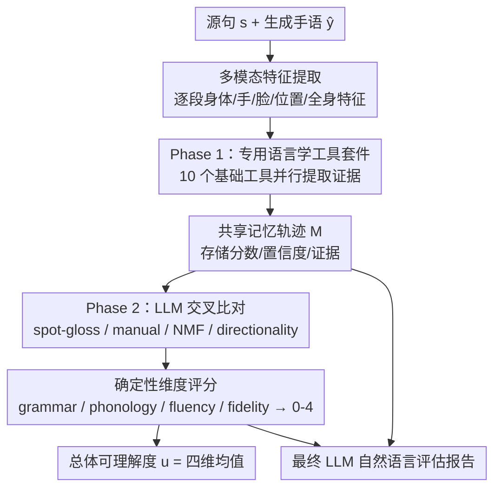

# BackTranslation2.0 -- A Linguistically Motivated Metric to Assess Sign Language Production

**会议**: ECCV 2026  
**arXiv**: [2606.28673](https://arxiv.org/abs/2606.28673)  
**代码**: [cogvis-cvssp.github.io/BackTranslation2/](https://cogvis-cvssp.github.io/BackTranslation2/) (有)  
**领域**: 人体理解  
**关键词**: 手语生成评估, 反向翻译指标, 语言学驱动评估, 多维度评分, LLM智能体

## 一句话总结
提出 BackTranslation2.0，一个语言学驱动的文本到手语翻译评估指标，通过两阶段智能体框架（10 个专用工具提取证据 + 4 个 LLM 交叉比对模块）在语法正确性、音系准确性、运动流畅度和生成保真度四个维度上给出确定性评分，在已知损坏和合成数据上与人类判断达到 Pearson r=1.00 / Spearman ρ=1.00，远超现有反向翻译和运动相似度基线。

## 研究背景与动机
手语生成（Sign Language Production, SLP）是聋人无障碍技术的核心前沿，但如何可靠评估生成手语的质量一直是个未解决的瓶颈。现有自动评估主要依赖两类范式：一类是**反向翻译**（backtranslation），将生成的手语序列通过手语识别模型翻译回文本，再用 BLEU-4 等文本指标与源句比对；另一类是**运动空间参考比对**，用 DTW、SiBLEU 或 SignCLIP 在姿态/嵌入空间直接比较生成序列与参考序列的距离。

这两类方法存在根本性缺陷。反向翻译方案的问题在于，手语到文本的翻译本身就是一个远未解决的问题——用性能不佳的识别/翻译技术去评估同样在发展中的生成技术，形成循环依赖，且 BLEU 等文本指标对手语特有的语法结构、空间指代、方向性动词一致等完全不敏感。运动参考方案则要求成对的 ground-truth 手语序列，不仅采集成本高，且将手语的丰富表达（语法、词汇、发音变异）强行压缩为单一规范轨迹的偏离度，无法建模"多种表达都是对的"这一手语基本特性。

与此形成对比的是，人类评估——尤其是聋人母语评估者——会同时考察多个语言学维度：手形准确性、发音位置、签名空间与方向性的使用、非手控特征（面部表情/身体姿态）、句法词序、动作自然度等。但专家标注昂贵且不可规模化。

**核心矛盾**由此显现：自动指标便宜但不准（与人类判断相关性差），人类评估准但不可规模化（费时费钱且一致性有限）。本文的核心 idea 是，不把评估交给单一的端到端模型，而是构建一个语言学驱动的多维度智能体框架——让一组专用工具各自提取不同模态的结构化证据，再由 LLM 作为推理层交叉比对、检验一致性，最后用确定性加权公式算出可复现的分数——在自动化的前提下逼近人类评估的多维细粒度。

## 方法详解

### 整体框架
BackTranslation2.0（BT2）是一个确定性的智能体框架，输入为源句 $s$ 和生成手语输出 $\hat{y}$（可以是 RGB 视频、姿态序列、mesh 动画或混合渲染格式），输出为每个工具的结构化证据、四个维度的分数、总体可理解度分数以及一段基于证据的自然语言评估报告。

整个流水线分为两个固定阶段，所有样本走完全相同的工具调用序列，不做动态工具选择，以保证可复现性和跨样本可比性。先经多模态特征提取构建结构化样本 $\mathcal{X} = \Phi(s, \hat{y}) = \{x^{(1)}, \dots, x^{(M)}, x^{\text{seq}}\}$，其中 $x^{(m)}$ 为第 $m$ 个时间片段的手语特征（身体、手、面部、空间位置、全身关键点），$x^{\text{seq}}$ 为全序列级特征。随后执行 10 个基础工具（Phase 1）提取证据，再经过 4 个比较工具（Phase 2）交叉比对，所有中间结果写入共享记忆轨迹 $\mathcal{M}$，最终通过确定性加权公式算出四个维度分数 $\mathbf{d} = [d_{\text{gram}}, d_{\text{phon}}, d_{\text{flu}}, d_{\text{fid}}]$（均在 0-4 量表上），总体分数 $u = \frac{1}{4}(d_{\text{gram}} + d_{\text{phon}} + d_{\text{flu}} + d_{\text{fid}})$ 为四维算术平均。最后一步的 LLM 只负责基于完整记忆轨迹写自然语言解释报告，不再修改任何数值分数。

### 关键设计

**1. 语言学驱动的四维度评分体系：把"手语好不好"拆成四个可独立测量、又与人类评估对齐的维度**

传统反向翻译只给一个 BLEU 分数，把语法错误、手形不准、动作僵硬、画面模糊全部混在一起，既不可解释也不知道扣分扣在哪。BT2 将评估拆为语法正确性（Grammatical Correctness）、音系准确性（Phonological Accuracy）、运动流畅度（Motion Fluency）和生成保真度（Generation Fidelity）四个维度，每个维度直接对应人类评估者在结构化研究中考察的语言学属性。语法维度覆盖签名空间使用、代词索引、方向性动词一致（directionality）；音系维度覆盖手形（handshape）、运动、位置、方向和非手控特征（NMF）等亚词汇成分的正确性；流畅度维度衡量签名运动的自然度和时间平滑性；保真度维度检查生成输出的视觉质量和解剖学合理性。四个维度的选择并非随意，而是直接对齐 SLP Tier 框架（一个由聋人社区参与制定的手语系统自动化分级标准）中定义的五个核心属性，确保评估内容与实际应用场景的需求一致。

**2. Phase 1 专用语言学工具套件：不用一个大模型硬猜，而是为每个语言学属性设计专用提取器**

BT2 的 Phase 1 部署了 10 个基础工具，各自针对特定的语言学或视觉证据，全部写入共享记忆轨迹供 Phase 2 消费。语法和空间证据由四个工具覆盖：Pseudo-Gloss 生成器用 LLM 将源句映射为候选 gloss 序列 $g^\star$，作为"期望看到什么手语词"的参照；Sign Spotting 将每个签名片段嵌入后与词典做余弦检索，返回 Top-K 候选 gloss 匹配；Directionality 工具结合 SL-GCN 索引预测和腕部轨迹 DTW 匹配判断方向性；Topographic Scorer 用 FastDTW 比较腕部路径方向。音系证据由三个工具覆盖：Handshape 分类器用 Transformer 对左右手分别预测手形并取置信度高的那侧为主手；Location 分类器使用 SMPL-X 重优化后的深度特征加接触接近度线索做位置评分；Non-Manuals 分类器从逐帧 Action Unit 经语义映射聚合到片段级非手控标签集。运动和保真度证据由三个工具覆盖：Fluency 工具用条件流匹配模型的 U-Net 瓶颈特征在参考高斯分布下计算对数概率并线性校准到 0-4；Visual Metrics 用固定权重组合高频能量、平滑度（jerk）、运动幅度和主频合理性四个确定性运动学指标；Hand Fidelity 用二分类器（真手 vs 合成手 crop）的 logit 均值映射到 0-4。

**3. Phase 2 LLM 交叉比对：不让工具各自打分然后硬平均，而是让 LLM 作为推理层交叉检验工具输出的一致性**

这是 BT2 与"先把各种工具跑一遍再取平均"的简单 ensemble 方案的本质区别。Phase 2 包含四个固定的比较工具，每个工具接收两类输入——来自 Phase 1 的"检测侧"证据和来自伪 gloss/词典的"期望侧"证据——然后由 LLM 在语言学约束下比对两者的一致性。Spot-gloss 比较先用确定性预过滤处理明显匹配对，再把模糊的语义对应交给 LLM 做语义匹配；Manual-features 比较走词典映射路径，低置信度时回退到 LLM；Non-manual-features 比较可以选择通过 LLM 推断期望的非手控标记或用确定性规则；Directionality 比较完全确定性。消融实验表明，把 Phase 2 的 LLM 替换为确定性回退规则后，合成数据上可理解度的 $\rho$ 从 0.60 暴跌至 0.09（降幅 85%），说明增益来自推理能力而非工程拼接。

**4. 完整可审计的确定性评分管道：从低层观察到最终分数的每一步都可追溯**

BT2 的分数量化完全由固定加权公式完成，LLM 不参与数值计算。每个维度的子分数来自对应工具的输出经重归一化后的加权组合。所有中间结果——从 Phase 1 每个工具的分数/置信度/证据，到 Phase 2 的比对标签，再到维度级别的聚合——全部保留在共享记忆轨迹 $\mathcal{M}$ 中。这使得任何最终分数都可以向下追溯至具体工具的具体输出，解决了端到端评估指标"只知道分数低、不知道为什么低"的根本问题。最终 LLM 阶段只生成自然语言评估报告，不修改任何数值分数，确保分数可复现。

### 损失函数 / 训练策略
BT2 本身是一个评估指标而非生成模型，不涉及端到端训练。但 Phase 1 中的多个专用工具（手形分类器、位置分类器、非手控分类器、手部保真度分类器、流匹配流畅度模型）各自在 BSL 语料上独立训练，训练细节和校准设置在补充材料中提供。所有工具在推断时固定权重，不做在线学习或自适应。

## 实验关键数据

### 主实验
论文构建了一个专门的 BSL 评估基准，包含四个互补子集：人类 SRT（6 位签名者 x 6 句，覆盖不同熟练度水平）、已知损坏（同一 6 句的三种语言学损坏：缺失非手控、错误词序、错误手形）、合成产物（6 个生成系统，含 SignGAN/SignSplat/SignStream/SignSparK 等专用于 SL 的方法和 GUAVA/Wan2.1 等通用人体运动生成系统）、方向性/地形放置专用集（定向动词、代词索引、空间放置）。同时进行了一项 20 人（聋人和听人）的用户研究，收集 5 点 Likert 评分和异常标记。

下表将 BT2 与参考基准方法（需参考序列）和参考自由方法（仅需源文本）在各子集上做方向归一化的 Pearson r / Spearman ρ 对比。

| 方法 | 已知损坏 Under. r/ρ | 合成 Under. r/ρ | 合成 Qual. r/ρ | 人类 SRT Under. r/ρ |
|------|---------------------|-----------------|----------------|---------------------|
| DTW-MPJPE（参考基准） | 0.91/0.50 | -0.14/-0.03 | -0.33/-0.37 | 0.04/0.00 |
| SiBLEU（参考基准） | -0.58/-0.50 | 0.03/0.31 | -0.05/0.31 | 0.96/0.90 |
| SignCLIP p2p（参考基准） | -0.97/-1.00 | 0.85/0.90 | 0.82/0.70 | 0.69/0.80 |
| SVAE（参考基准） | 0.95/1.00 | 0.43/0.26 | 0.54/0.31 | 0.81/0.80 |
| BT1 BLEU-4（参考自由） | -0.19/0.00 | -0.38/-0.44 | -0.15/-0.10 | 0.00/0.00 |
| SignCLIP p2t（参考自由） | 0.89/0.50 | -0.64/-0.60 | -0.41/-0.30 | -0.07/-0.10 |
| **BT2 Overall（本文）** | **1.00/1.00** | **0.42/0.60** | **0.52/0.66** | -0.43/-0.30 |
| BT2 Phonology | 0.28/0.50 | 0.48/0.26 | 0.35/-0.03 | 0.87/0.90 |
| BT2 Fidelity | 0.80/1.00 | 0.74/0.94 | 0.83/0.94 | -0.81/-0.90 |
| 人类评分者间一致 Gwet's AC2 | 0.69 | 0.69 | 0.68 | 0.69 |

关键发现：BT2 Overall 在已知损坏（r/ρ = 1.00/1.00）和合成数据上均超过所有参考自由基线，且匹配或超越最强参考基准方案。在人类 SRT 子集上 BT2 Overall 为负相关，原因是该子集存在严重的天花板效应（74% 评分 >= 4）、评分者间 ICC 接近 0、签名者均值跨距仅 0.55 分——在此高度压缩的评分区间内，基于排名的评估对任何指标都极其困难。但 BT2 Phonology 在同一 SRT 子集上达到 ρ=0.90，说明在存在真实音系差异的维度上 BT2 仍然有效。

### 消融实验

| 条件 | KC Under. r/ρ | 合成 Under. r/ρ | 合成 Qual. r/ρ | SRT Under. r/ρ |
|------|---------------|-----------------|----------------|----------------|
| No LLM（词启发式替代） | 0.73(↓27%)/0.50(↓50%) | 0.21(↓50%)/0.37(↓38%) | 0.43(↓17%)/0.54(↓18%) | -0.68(↓58%)/-0.40(↓33%) |
| Phase 1 only | 0.73(↓27%)/0.50(↓50%) | 0.21(↓50%)/0.37(↓38%) | 0.43(↓17%)/0.54(↓18%) | -0.68(↓58%)/-0.40(↓33%) |
| Phase 1 + 确定性 Phase 2 | 0.08(↓92%)/0.50(↓50%) | 0.22(↓48%)/0.09(↓85%) | 0.42(↓19%)/0.37(↓44%) | -0.63(↓47%)/-0.50(↓67%) |
| Full - spot-gloss | 0.73(↓27%)/0.50(↓50%) | 0.31(↓26%)/0.37(↓38%) | 0.41(↓21%)/0.49(↓26%) | -0.68(↓58%)/-0.40(↓33%) |
| Full - manual feats. | 0.56(↓44%)/0.50(↓50%) | 0.26(↓38%)/0.37(↓38%) | 0.34(↓35%)/0.49(↓26%) | -0.66(↓53%)/-0.70(↓133%) |
| Full - non-manual | 0.35(↓65%)/0.50(↓50%) | 0.50(↑19%)/0.54(↓10%) | 0.54(↑4%)/0.60(↓9%) | -0.09(↑79%)/-0.10(↑67%) |
| **BT2 Full（本文）** | **1.00/1.00** | **0.42/0.60** | **0.52/0.66** | **-0.43/-0.30** |

每个消融变体在已知损坏上都导致 ρ 从 1.00 下降。将 Phase 2 LLM 替换为确定性回退规则使合成可理解度 ρ 暴跌 85%，证明 Phase 2 的核心增益来自 LLM 的推理能力。尽管有些消融在某些列上略有上升（如去除非手控比较在合成 Qual. 上略微上升），但没有任何变体在所有类别上击败完整系统。人类 SRT 的负相关在所有消融中持续存在，确认这是该子集的结构性问题而非某个特定组件的缺陷。

### 关键发现
- **Phase 2 的 LLM 推理是不可替代的**：替换为确定性回退后 ρ 从 0.60 降至 0.09（降幅 85%），远超任何单个工具移除的影响，说明交叉比对中的语义推理是整个系统的核心价值所在。
- **四个维度互为补充而非冗余**：Fidelity 在合成质量上 ρ=0.94，Phonology 在人类 SRT 上 ρ=0.90——不同维度在不同场景下各有所长，验证了多维度分解设计的必要性。
- **损坏敏感性实验中 BT2 能精确定位损坏类型**：在大规模合成语料（900 对匹配样本）上，手形损坏下手形维度胜率 79-88%，位置损坏下位置维度胜率 73-98%，而流畅度和保真度在这些损坏类型上规律性地呈现反向（wrong-way），证明 BT2 能将每种退化精确归因到目标维度而非笼统扣分。
- **语法评估仍是难点**：语法维度的相关性显著弱于音系维度，原因是自然手语允许比严格控制环境更灵活的词序变化，且评分者间的词序异常标记一致性极低（α 在合成数据上仅 0.01，人类 SRT 上为 -0.01）。

## 亮点与洞察
- **用 LLM 做推理层而非生成器/识别器**：BT2 不给 LLM 看手语视频让它直接打分（那会是一个黑箱且不可解释），而是让 LLM 吃专用工具产出的结构化证据，在语言学规则约束下做交叉比对和一致性判断。这个"LLM as reasoning layer over structured tool outputs"的范式完全可以复用到其他需要多维专家评估的领域，如医学影像报告质量评估、代码生成的多维质量评估等。
- **确定性管道 + 可审计记忆轨迹的设计**：很多 LLM-agent 系统的分数不可复现（每次调用可能不同），BT2 通过固定工具调用序列 + 确定性加权公式 + 完整中间状态保留，在保留 LLM 推理灵活性的同时确保了分数的可复现性和可审计性。共享记忆轨迹 $\mathcal{M}$ 作为"审计链"的设计非常务实。
- **损坏敏感性实验中的"反向"信号验证了指标的忠实性**：当手形被损坏时，流畅度和保真度分数规律性地不降反升（因为手形改变不会破坏运动平滑度或画面质量），这种"该降的降、不该降的不降"比任何聚合分数更有说服力地证明了每个维度确实在测量它声称要测量的东西。
- **伪 gloss 作为"期望锚点"的巧妙设计**：用 LLM 根据源句生成期望的 gloss 序列 $g^\star$，然后让 Phase 2 比较工具将检测到的实际手语词与这个期望序列做交叉比对。这避免了对 ground-truth 手语翻译的依赖，同时提供了一个语言学上有意义的参照标准——本质上是把"手语应该怎么打"的知识从训练数据转移到了 LLM 的语言知识中。

## 局限与展望
- **语法评估在自然场景下失效**：BT2 的语法维度在已知损坏上完美（ρ=1.00），但在人类 SRT 自然签名上为强负相关（ρ=-0.60）。作者将此归因于自然手语中更灵活的词序和评分者间极低的一致性。一个更根本的问题是，当前 gloss 级别的"词序匹配"可能对 BSL 这类允许话题化、省略和空间融合的语言来说本身就过于刚性——未来的改进方向可能是用依存分析或语义角色标注替代序列匹配。
- **对人类 SRT 子集的整体表现不佳反映了一个方法论问题**：当评分者间一致性接近随机（ICC≈0）时，任何自动指标都不可能表现好。与其把这一点视为 BT2 的缺陷，不如说它揭示了"在高质量手语区间做细粒度区分"这一任务本身可能需要更精确的评分量表和更多样化的刺激材料。
- **依赖多个预训练专用工具的鲁棒性风险**：Phase 1 的每个工具（手形分类器、位置分类器、非手控分类器等）一旦在分布外数据上失效，其错误会传播到 Phase 2 并被 LLM 交叉比对放大或误判。目前没有对这些工具的级联误差做系统性分析。
- **BSL 特化 vs 跨语言泛化**：所有实验都在 BSL 上进行。手语之间的语法和音系差异巨大（如美国手语 ASL 和中国手语 CSL 的语法结构显著不同），BT2 迁移到其他手语时，pseudo-gloss 生成、handshape 分类器和词典资源都需要重新训练或适配。

## 相关工作与启发
- **vs 传统反向翻译（BT1, Saunders et al. 2020）**: BT1 将生成手语经识别模型翻译回文本后用 BLEU 比对，本质上是"用一个不准的东西去评价另一个不准的东西"。BT2 完全不依赖手语识别反向通路，改为从手语输出中直接提取语言学证据，规避了循环依赖。
- **vs SignCLIP / SVAE 等嵌入空间方法**: 这些方法在参考序列存在时表现不错（如 SVAE 在已知损坏上 ρ=1.00），但都要求成对 ground-truth，且本质上是"距参考序列有多像"而非"手语打得好不好"。BT2 的评估是参考自由的（不需要成对 ground-truth 序列），且每个维度评估的是语言学属性本身而非与某个特定实现的相似度。
- **vs LLM-as-a-Judge（Zheng et al. 2024）**: LLM-as-a-Judge 范式将 LLM 直接用作评分器，BT2 则将其用作"推理层"——LLM 接收结构化工具输出，在有语言学约束的上下文中做交叉比对，且最终分数由确定性公式而非 LLM 生成。这种"LLM 推理 + 确定性聚合"的混合架构比纯 LLM 评分更可复现、更可审计。
- **vs SLP Tier 框架（Bowden et al. 2025）**: SLP Tier 是一个分类学而非评估指标，定义了手语系统的自动化等级。BT2 的四个评估维度直接对齐 SLP Tier 的五个核心属性，使二者形成互补：Tier 定义"系统能做什么"，BT2 量化"系统做得好不好"。

## 评分
- 新颖性: ⭐⭐⭐⭐⭐ 首个将智能体框架引入手语评估的工作，"专用工具提取 + LLM 推理层交叉比对 + 确定性聚合"三层架构在手语领域是全新的，且"LLM as reasoning layer over tool outputs"的范式设计本身有跨领域迁移价值
- 实验充分度: ⭐⭐⭐⭐⭐ 四个互补基准子集、20 人用户研究、七种消融变体、大规模合成损坏敏感度分析（900 对）、定性工具行为可视化——实验覆盖面和深度均非常扎实
- 写作质量: ⭐⭐⭐⭐ 方法部分公式完整、工具定义清晰，但部分 Phase 1 工具的训练细节和校准过程被推至补充材料，评委在审稿阶段可能无法完整评估
- 价值: ⭐⭐⭐⭐⭐ 手语生成评估是一个长期被忽视但极为重要的基础问题，BT2 提供了一个可规模化、可解释、与聋人社区需求对齐的评估范式，且可审计记忆轨迹的设计解决了 LLM-agent 系统可复现性的通用痛点

<!-- RELATED:START -->

## 相关论文

- [\[CVPR 2026\] SignPR: A Progressive Vector-Quantized Diffusion Framework for Sign Language Production](../../CVPR2026/human_understanding/signpr_a_progressive_vector-quantized_diffusion_framework_for_sign_language_prod.md)
- [\[CVPR 2026\] Focal–General Diffusion Model with Semantic Consistent Guidance for Sign Language Production](../../CVPR2026/human_understanding/focal-general_diffusion_model_with_semantic_consistent_guidance_for_sign_languag.md)
- [\[ECCV 2026\] SIGNET: Motion-Level Knowledge Transfer for Cross-Language Sign Language Translation](signet_motion-level_knowledge_transfer_for_cross-language_sign_language_translat.md)
- [\[ECCV 2026\] SIGNER: Temporally Grounded Sign Language Generation via Time-Resolved Conditioning](signer_temporally_grounded_sign_language_generation_via_time-resolved_conditioni.md)
- [\[ECCV 2026\] SignNet-1M: Large-Scale Multilingual Sign Language Video Dataset with Downstream Benchmarks](signnet-1m_large-scale_multilingual_sign_language_video_dataset_with_downstream_.md)

<!-- RELATED:END -->
