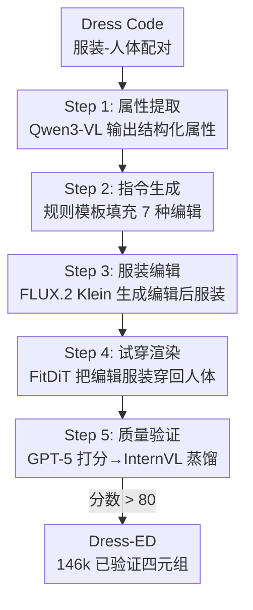

# Dress-ED: Instruction-Guided Editing for Virtual Try-On and Try-Off

**会议**: ECCV 2026  
**arXiv**: [2603.22607](https://arxiv.org/abs/2603.22607)  
**项目页**: [https://aimagelab.github.io/Dress-ED/](https://aimagelab.github.io/Dress-ED/)  
**代码**: 项目页面中提供  
**领域**: 人体理解 / 虚拟试穿  
**关键词**: 虚拟试穿, 虚拟试脱, 指令驱动编辑, 服装编辑, 多模态数据集

## 一句话总结
Dress-ED 构建了首个统一 VTON（虚拟试穿）、VTOFF（虚拟试脱）和文本指令驱动服装编辑的大规模基准数据集（146k 已验证四元组），并提出一套基于 MLLM + 双路径连接器 + DiT 的统一多模态扩散基线模型 Dress-EM，在指令驱动的服装编辑任务上全面超越通用编辑模型和领域专用 VTON 模型。

## 研究背景与动机

虚拟试穿（VTON）和虚拟试脱（VTOFF）近年取得了显著进展，从早期基于形变场的服装对齐到基于扩散模型的注意力条件化生成，图像的写实度和人体服装的贴合度已经大幅提升。然而仔细审视现有工作就会发现一个根本性的局限：所有主流数据集（VITON-HD、Dress Code 等）都是"静态配对"——每张素材只记录了一件衣服和一个穿它的人，模型的任务也不过是一个固定的"穿上"或"脱下"映射。用户无法通过自然语言告诉模型"我想改这件衣服的颜色"或"把袖子改成七分袖"，数据集里也没有编辑后的版本作为监督信号。与此同时，通用图像编辑数据集（InstructPix2Pix、MagicBrush、HQ-Edit 等）虽然支持文本指令驱动的编辑，但它们的样本不包含服装-人体的结构化对应关系——一件衣服在人体上怎么穿、编辑后怎么变，这些几何和语义约束脱离了服装领域就无从保证。专门针对时尚编辑的工作（如 EditGarment、T-FIT）又只做服装到服装的编辑或人体到人体的编辑，没能把 VTON、VTOFF 和指令编辑这三个紧密关联的任务统一到一个框架下。

这种碎片化带来的核心矛盾是：要实现可控的指令驱动时尚编辑，需要大规模、语义一致的"服装-人体-编辑指令-编辑结果"四元组训练数据，但人工标注这种四元组几乎不可行——每对服装-人体都需要精确的编辑指令、编辑后的服装图、以及编辑后的试穿图，成本极高且标注一致性难以保证。本文的切入角度是：能不能让模型自己生成这些标注数据？

**核心 idea：设计一条"MLLM 理解服装属性 → 扩散模型执行编辑 → LLM 验证质量"的全自动流水线，将静态的服装-人体配对规模化转化为带自然语言指令的编辑四元组，首次将 VTON、VTOFF 和指令驱动编辑统一在同一框架下进行训练和评测。**

## 方法详解

### 整体框架

Dress-ED 的贡献分两个层面：数据层面是一条全自动构建指令驱动时尚编辑数据集的生产管线；算法层面是一套统一的 MLLM + DiT 多模态扩散基线模型 Dress-EM。数据管线的输入是 Dress Code 数据集中已有的静态（I_garment, I_person）配对，输出是带验证的四元组 + 指令；Dress-EM 则以编辑指令和参考图像为输入，直接生成编辑后的试穿或服装图像。

### 关键设计

**1. 全自动四阶段数据生成管线**

Dress-ED 数据集的核心是一条四阶段的自动管线。第一阶段，用 Qwen3-VL 同时观察服装图和着装人体图，提取结构化属性（颜色、图案、材质、领口类型、袖长等），输出一个 JSON 格式的描述。第二阶段，基于提取的属性通过规则模板自动生成自然语言编辑指令，覆盖两大类七种编辑类型——外观编辑（改颜色、改图案、改材质、精细细节点）和结构编辑（添加细节、移除元素、修改剪裁形状）。比如一件"蓝色棉质短袖衬衫"可能得到"把袖子改成长袖"或"把衬衫变成黄色"这样的指令。第三阶段，先对服装图用 FLUX.2 Klein 按指令编辑生成 Igarment_edit，再用当前最先进的 VTON 模型 FitDiT 把编辑后的服装穿回人体上，生成 Iperson_edit。第四阶段用 GPT-5 对每个（原图，编辑图，指令）三元组打分（0-100），评估编辑遵循度、内容保留性和写实度；然后将约 5k 标注样本的 GPT-5 评分蒸馏到 InternVL-3.5 上，得到一个可规模化部署的多模态验证器，对所有约 300k 初始样本做过滤，仅保留两项评分均高于 80 的样本。最终得到 146,460 个高质量四元组。这套管线巧妙之处在于它用"生成+验证"的闭环实现了自洽的质量控制，使得下游 VTON/VTOFF 模型不会学到生成模型的伪影——这也是 LLM-as-Judge 和自训练蒸馏在数据构建中的一个优秀应用案例。

**2. 双路径条件融合的连接器架构**

Dress-EM 是本文提出的统一基线模型，由冻结的 InternVL-3.5-8B 作为多模态编码器、可训练的轻量级连接器、以及 DiT 扩散骨干（基于 Stable Diffusion 3 Medium）组成。VTOFF 任务输入为着装人体图，VTON 任务则输入掩码人体图和服装图，二者与文本指令一起送入 MLLM 做单次前向推理，输出融合了服装、人体和编辑意图的多模态 token 序列。关键创新在连接器：它没有简单地对 MLLM token 做池化后送入 DiT，而是拆出两条互补的路径。全局引导路径（Global Guidance Pathway）对 MLLM token 做掩码均值池化后经线性层投影，输出一个 2048 维的全局语义向量 g，告诉扩散模型"要做什么修改"（即编辑意图的高层摘要）。Token 精炼路径（Token Refinement Pathway）则用轻量级 Transformer 块对完整的 token 序列做跨模态交互精炼，输出 77 × 4096 的细粒度多模态嵌入 z_c，告诉扩散模型"修改的区域和上下文在哪里"。两条路径的输出与 VAE 编码的参考图像隐特征 z_VAE 一起作为 DiT 的条件输入。这个设计的核心 insight 是：一个编码的"高层意图"足够引导语义层面的改动方向，但不足以提供局部的空间定位信息；两条路径恰好互补。

**3. 逆向编辑评估协议**

虽然这不是模型架构本身的设计，但本文在评估方法论上有一个值得单讲的设计——逆向编辑协议。为了避免因为参考图像也来自合成模型而导致的指标虚高，测试阶段的 ground truth 直接用真实图像：先用编辑指令将原始真实图像变成编辑版本（正向来），再让模型执行反向指令把编辑后图像还原回原始真实图像（逆向来），在这条"合成→真实"的通道上计算 FID / DINO-I 等指标。这意味着所有参考度量都基于真实像素分布，不受合成数据分布偏移的影响。前向和逆向的结果对比几乎一致，也进一步说明模型学到的不是翻转合成伪影，而是真正的语义编辑能力。

### 损失函数 / 训练策略

采用标准扩散噪声预测损失。训练时 VAE 和 InternVL 冻结，仅连接器与 DiT 端到端更新。特别之处在于混合监督策略：既使用合成编辑图像作为去噪目标，也保留原始真实图像作为目标，迫使模型在跟随指令做外观/结构修改的同时不丢失对真实纹理的保真度。使用 AdamW 优化器、余弦学习率调度（初始 1e-4）、batch size 4、训练 50k 步，在 16 块 A100 上以 DeepSpeed/bf16 精度训练。

## 实验关键数据

### 主实验

| 任务 | 方法 | SSIM ↑ | LPIPS ↓ | FID ↓ | DINO-I ↑ |
|------|------|--------|---------|-------|----------|
| VTON 配对 | FLUX.2 Klein | 0.9291 | 0.0743 | 4.32 | 0.9302 |
| VTON 配对 | Qwen-Image-Edit | 0.9173 | 0.0963 | 8.51 | 0.8802 |
| VTON 配对 | CatVTON | 0.9314 | 0.0801 | 4.57 | 0.9144 |
| VTON 配对 | Any2AnyTryon | 0.9429 | 0.0702 | 5.34 | 0.9074 |
| VTON 配对 | **Dress-EM** | **0.9417** | **0.0628** | **3.79** | **0.9383** |
| VTON 非配对 | **Dress-EM** | — | — | **5.82** | **0.6476** |
| VTOFF | FLUX.2 Klein | 0.8694 | 0.2800 | 17.45 | 0.7468 |
| VTOFF | CatVTON | 0.8800 | 0.2415 | 6.78 | 0.7918 |
| VTOFF | **Dress-EM** | **0.8800** | **0.2060** | **5.06** | **0.8071** |

### 按编辑类型的细粒度分析

Dress-EM 在所有 7 种编辑类型上均取得一致的 DISTS 最低值和 DINO-I 最高值。最显著的领先出现在外观编辑（改色、改图案、改材质），例如 VTOFF 场景下 Dress-EM 的颜色编辑 DISTS（0.180）比 CatVTON（0.210）低 0.03，说明多模态条件融合对于纹理/色调类编辑的表征尤为有效。结构编辑（添加细节、修改结构）的增益虽略小但同样稳定。

### 关键发现

- 与商业模型 GPT-Image-1.5 在 100 样本子集上的对比表明，通用领域的最强编辑模型经零样本迁移至时尚编辑后各指标全面落后于 Dress-EM（LPIPS 0.0838 vs 0.0622），凸显了领域专业数据集和训练的重要性
- 前向编辑与逆向编辑结果几乎一致（DINO-I 正向 0.9493、逆向 0.9383），说明模型学到的是语义编辑而非反转合成伪影
- 人机评估表明，微调后的 InternVL 验证器与人类判断的准确率达到 95.6%（77.7% 人机一致判定为好、17.9% 一致判定为差），验证了 MLLM 过滤替代人工筛选的可行性

## 亮点与洞察

- **全自动数据管线 + 双模验证是最大亮点**：用"MLLM 理解 → 扩散编辑 → 蒸馏验证"的自动化环解决了数据稀缺瓶颈，且验证器从 GPT-5 蒸馏到开源 InternVL 实现了可规模化的复用。这套范式不限于时尚编辑，可沿用到任何需要大规模配对编辑数据但难以人工标注的领域（如医学图像编辑、产品设计编辑）
- **逆向编辑评估协议**：用"合成→还原回真实"来评估，有效隔离了合成数据分布偏移对指标的污染，思路简单而严谨，值得在生成式评估中推广
- **双路径连接器**把"高层编辑意图"和"细粒度空间上下文"分离，相比简单池化或单路径投影，让 DiT 获得更清晰的"改什么 + 改哪里"的条件信号
- Dress-ED 的四元组结构天然兼容多种下游任务——编辑 VTON、编辑 VTOFF、人体编辑、服装编辑、以及标准的 VTON/VTOFF 去掉指令即可，数据复用率极高

## 局限与展望

- **数据完全由模型合成**：这是有意设计但也是最大局限——FLUX.2 Klein 和 FitDiT 的能力上限决定了数据质量天花板。虽然验证器过滤了低分样本，合成数据分布与真实世界之间仍可能存在 gap，特别是在纹理细节、光照一致性方面。未来可以引入小规模真实数据做领域自适应或人工反馈闭环
- **服装类别和编辑类型局限**：仅覆盖连衣裙、上装、下装三大类，未涉及配饰（围巾、珠宝）和叠穿（外套+卫衣）；7 种编辑类型虽然覆盖面较宽，但模板化的指令生成限制了语言表达的多样性，用户实际可能说"我想让它看起来更街头风一点"而不只是"改颜色为绿色"
- **Dress-EM 作为基线本身**：受限于训练时冻结 MLLM 和 VAE 的设计，模型容量受制于预训练特征的表达能力，没有尝试联合微调 MLLM 以更好地适应细粒度编辑任务
- 可扩展方向：引入更丰富的编辑指令变体（LLM 自由重述模板指令）；扩展到多服装、多人交互场景；以及将验证器从判别式评分升级为提供"哪里出问题了"的细粒度反馈

## 相关工作与启发

- **vs CatVTON / Any2AnyTryon**: 这些是标准的 VTON/VTOFF 模型，原始版本不支持文本指令，本文将其重训于 Dress-ED 并适配了指令条件化。Dress-EM 在所有指标上全面领先，尤其在 FID（VTON 配对 3.79 vs CatVTON 4.57）和 DINO-I（0.9383 vs 0.9144）上提升显著，验证了 MLLM 先验编码加双路径条件化的有效性
- **vs EditGarment / T-FIT**: 时尚编辑领域的前作，但只做服装到服装（EditGarment）或人体到人体（T-FIT）的单一方向编辑，无法统一处理 VTON + VTOFF。Dress-ED 不仅统一了二者，还提供了训练/评测所需的大规模数据支撑
- **vs InstructPix2Pix / FLUX.2 Klein**: 通用图像编辑模型在零样本设置下处理时尚编辑时，VTOFF 的 FID > 17，严重退化，说明通用模型缺乏对服装结构的领域特定理解——这反过来凸显了 Dress-ED 作为领域基准的必要性

## 评分

- 新颖性: ★★★★☆ [首个统一 VTON/VTOFF/指令编辑的大规模基准数据集，自建自动生成+验证的管线有推广价值；但核心组件（MLLM、扩散模型、LLM Judge）均为现有能力的高效组合而非全新方法]
- 实验充分度: ★★★★★ [全面的定量评估覆盖配对/非配对 VTON 和 VTOFF，含 7 种编辑类型细粒度分析、前向/逆向对比、商业模型对比、用户研究；指标覆盖 FID/KID/SSIM/LPIPS/DISTS/DINO-I]
- 写作质量: ★★★★☆ [结构清晰，动机和数据构建描述详实；附录给出了完整的模板规则、属性银行、过滤消融；图示丰富]
- 价值: ★★★★★ [Dress-ED 填补了指令驱动时尚编辑领域的基准空白，146k 高质量样本和严谨的评估协议将推动 VTON/VTOFF 从"固定映射"走向"可控交互编辑"，对电商和时尚 AI 有明确的实用价值]

<!-- RELATED:START -->

## 相关论文

- [\[CVPR 2026\] RefTon: Reference Person Shot Assist Virtual Try-on](../../CVPR2026/human_understanding/refton_reference_person_shot_assist_virtual_try-on.md)
- [\[CVPR 2026\] Mobile-VTON: High-Fidelity On-Device Virtual Try-On](../../CVPR2026/human_understanding/mobile_vton_ondevice_virtual_tryon.md)
- [\[CVPR 2026\] MOFA-VTON: More Fashion Possibilities with Fine-Grained Adaptations in Virtual Try-On](../../CVPR2026/human_understanding/mofa-vton_more_fashion_possibilities_with_fine-grained_adaptations_in_virtual_tr.md)
- [\[ECCV 2024\] Wear-Any-Way: Manipulable Virtual Try-on via Sparse Correspondence Alignment](../../ECCV2024/human_understanding/wear-any-way_manipulable_virtual_try-on_via_sparse_correspondence_alignment.md)
- [\[ECCV 2026\] InterEdit: Navigating Text-Guided 3D Dyadic Human Motion Editing](interedit_navigating_text-guided_3d_dyadic_human_motion_editing.md)

<!-- RELATED:END -->
