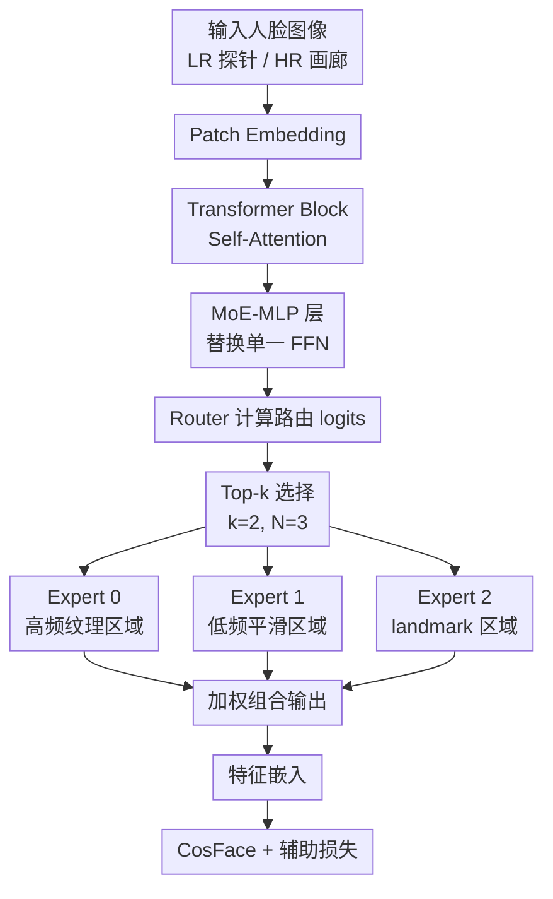

# FaceMoE: Mixture of Experts for Low-Resolution Face Recognition

**会议**: ECCV 2026  
**arXiv**: [2606.32040](https://arxiv.org/abs/2606.32040)  
**代码**: [https://github.com/Kartik-3004/FaceMoE](https://github.com/Kartik-3004/FaceMoE)  
**领域**: 人体理解 / 人脸识别  
**关键词**: 低分辨率人脸识别, 混合专家模型, Transformer, 灾难性遗忘, 分辨率感知特征提取

## 一句话总结
FaceMoE 将 Transformer 中单一 FFN 替换为多个稀疏激活的 MoE 专家加 Top-k 路由器，使不同专家自动特化于人脸不同语义区域（高频纹理/低频平滑/关键点），实现分辨率感知的特征提取；在 BRIAR、IJB-S、TinyFace 三个低分辨率基准上全面超越 SOTA，同时几乎不损失 HR 预训练性能。

## 研究背景与动机

**领域现状**：低分辨率人脸识别（LR-FR）在监控、安防等场景中需求迫切。现有方法主要分为四类：基于超分重建的预处理方法、基于知识蒸馏的训练方法、基于帧选择/特征融合的后处理方法（如 CAFace、CoNAN、ProxyFusion）、以及基于架构改造的方法（如 PETALface 引入质量自适应 LoRA）。主流做法仍然是在 HR 数据上预训练，再在 LR 数据上微调。

**现有痛点**：三个核心挑战叠加。第一，LR 探针图像退化严重（模糊、遮挡、低对比度），只有少数帧包含有效身份信息，导致特征提取和聚合困难。第二，画廊图像是 HR、探针图像是 LR，两者来自不同域——HR 下人脸模型关注皮肤纹理和 landmark 细节，LR 下只能依赖粗粒度轮廓和形状，单一特征编码器无法在两个域上同时做好。第三，HR→LR 微调时发生灾难性遗忘：梯度在微调初期不稳定，模型既丢掉了预训练的 HR 判别能力，又没能有效适应 LR 数据。

**核心矛盾**：单一 FFN 的 Transformer 编码器在表达能力上存在根本瓶颈——它用一个共享的前馈网络处理所有人脸 patch token，无法根据输入分辨率和语义区域做差异化处理，导致"HR 画廊和 LR 探针共享同一套特征提取逻辑"，两个域的特征质量互相拖累。

**本文目标**：(1) 提升 LR 探针的特征提取质量，使退化帧中残留的身份线索能被充分捕获；(2) 缩小 HR 画廊和 LR 探针之间的域差距；(3) 在 LR 微调时保留预训练知识，避免灾难性遗忘。

**切入角度**：作者观察到不同分辨率下模型关注的语义区域不同（HR 看纹理，LR 看轮廓），且微调时只有部分参数需要适应新域。这暗示如果能让不同子网络各司其职——一部分特化于 HR 模式、一部分适应 LR 退化——就能同时解决域差距和灾难性遗忘。MoE 的稀疏激活特性恰好天然支持这种"选择性漂移"（selective drift）。

**核心 idea**：用 MoE（多专家 FFN + Top-k 路由）替换 Transformer 中的单一 FFN，使不同专家自动特化于人脸不同语义区域，路由器根据输入 token 的分辨率和内容动态分配给最相关的专家。

## 方法详解

### 整体框架

FaceMoE 以 Swin-B（或 ViT-B）为骨干，核心改动是将每个 Transformer block 中 Self-Attention 之后的单一 FFN 替换为一个 MoE-MLP 层。输入人脸图像经 Patch Embedding 切分为 T 个 token，依次通过多个 Transformer block，每个 block 内的 MoE-MLP 对每个 token 独立做路由：Router 计算每个 token 到 N 个专家的打分，选出 Top-k 个专家，各专家对 token 做非线性变换，最后加权求和输出。整个网络末端接 CosFace 损失做身份分类。训练时额外加入 router z-loss（抑制 logits 过大）和 load balancing loss（防止专家负载不均），保证路由稳定。

### 关键设计

**1. MoE-MLP 层：用多个 FFN 专家替代单一 FFN，实现语义区域特化**

传统 Transformer 在人脸识别中，Self-Attention 之后接一个共享的 FFN（两层全连接 + GELU 激活）处理所有 token。这种设计隐式假设所有 token 需要同一套非线性变换，但在 LR-FR 场景下，不同 token 对应的人脸区域（眼睛/脸颊/头发）退化程度和信息量差异巨大，单一 FFN 只能学到"折中"的变换。

FaceMoE 将单一 FFN 替换为 N 个独立的专家 MLP，每个专家 $f_i$ 都是标准的两层全连接：$f_i(x_t) = W_{i,2} \cdot \sigma(W_{i,1} x_t + b_{i,1}) + b_{i,2}$，其中 $W_{i,1} \in \mathbb{R}^{d \times h}$，$W_{i,2} \in \mathbb{R}^{h \times d}$，$\sigma$ 为 GELU，$h$ 为隐藏维度。所有专家并行存在但只有被路由选中的才参与计算。实验取 N=3、k=2，激活图（Figure 2/6）显示三个专家自然分化：Expert 0 聚焦于高频区域（边缘、轮廓、头发纹理），Expert 1 聚焦于低频平滑区域（脸颊、额头），Expert 2 聚焦于 landmark 区域（眼睛、鼻子、嘴巴）。这种特化是训练过程中自然涌现的，不需要任何显式监督——路由器在优化 CosFace 损失的过程中，自动学会将不同语义区域的 token 分配给最擅长处理该区域的专家。

**2. Top-k 路由器：token 级动态分配，实现分辨率感知特征提取**

路由器是 FaceMoE 的核心调度模块。对于每个 token $x_t \in \mathbb{R}^d$，路由器通过一个可学习的线性投影 $W_r \in \mathbb{R}^{d \times N}$ 计算 N 个专家的打分：$z_t = x_t W_r$。然后取 Top-k 个最高分专家，对其 logits 做 softmax 得到路由权重：$w_{i_j}(x_t) = \frac{\exp(z_{t, i_j})}{\sum_{j=1}^k \exp(z_{t, i_j})}$。最终该 token 的 MoE 输出为 $y_t = \sum_{j=1}^k w_{i_j}(x_t) f_{i_j}(x_t)$。

这个设计的精妙之处在于**稀疏激活 + token 级粒度**。k=2 << N=3 意味着每个 token 只用 2/3 的专家，计算量远小于稠密 MoE。更重要的是，路由是逐 token 而非逐样本的——同一张脸的不同 patch 可能被分配给不同专家组合。当输入是 LR 图像时，高频纹理退化严重，路由器会减少向 Expert 0（高频专家）的分配，增加向 Expert 1（低频专家）的分配，自然实现"分辨率感知"。论文用条件路由概率形式化表述了这一现象：$\mathbb{P}(i_j \mid R_t = r) > \mathbb{P}(i_j \mid R_t \neq r)$，即给定 token 所属的语义/频率区域 $R_t$ 后，路由到特定专家的概率显著高于其他区域。

**3. 辅助损失设计：router z-loss + load balancing loss，保证训练稳定和专家均衡**

直接用 CosFace 损失训练 MoE 会遇到两个典型问题：(1) 路由 logits 在训练初期容易急剧增大，导致 softmax 退化为 one-hot，梯度消失，专家坍缩；(2) 路由器可能"偷懒"——把所有 token 都分配给同一个专家，其余专家形同虚设。

Router z-loss 惩罚路由 logits 的 L2 范数：$\mathcal{L}_z = \lambda_z \cdot \frac{1}{BT} \sum_{b=1}^B \sum_{t=1}^T \|z_{b,t}\|_2^2$。这个二次惩罚项鼓励路由器产生平滑、低方差的 logits，防止某个专家的打分畸高，从而保证梯度能稳定回传。

Load balancing loss 同时考虑专家的"重要性"（softmax 概率和）和"负载"（被选中的 token 数）：$\mathcal{L}_{\text{balance}} = \lambda_b \cdot N \cdot \frac{1}{(BT)^2} \sum_{i=1}^N \left(\sum_{b,t} p_{b,t,i}\right) \cdot \left(\sum_{b,t} \mathbb{1}[i \in \text{TopK}(z_{b,t})]\right)$。当某个专家的重要性高但负载低（或反之）时，这一项会增大，推动路由器均衡分配。最终总损失为 $\mathcal{L}_{\text{total}} = \mathcal{L}_{\text{face}} + \lambda_1 \mathcal{L}_z + \lambda_2 \mathcal{L}_{\text{balance}}$，其中 $\lambda_1 = \lambda_2 = 10$（经过超参搜索，将辅助损失缩放到与 CosFace 损失同一量级）。

### 损失函数 / 训练策略

FaceMoE 分两阶段训练。预训练阶段：在 WebFace4M（约 4M 图像，205,990 个身份）上用 AdamW（weight decay $5 \times 10^{-2}$）、Polynomial LR scheduler（1 epoch warmup，初始 LR $10^{-3}$）、batch size 128/GPU，训练 26 个 epoch。

微调阶段分两步——线性探测（只训练分类头，LR $10^{-3}$）再全量微调（LR $10^{-4}$ 或 $5 \times 10^{-6}$）。TinyFace：线性探测 10 epoch + 全量微调 40 epoch；BRIAR：两阶段各 20 epoch。辅助损失权重 $\lambda_1 = \lambda_2 = 10$，router z-loss 系数 $\lambda_z = 1$，load balancing 系数 $\lambda_b = 1$。所有实验在 8 张 NVIDIA A6000 (48GB) 上完成。

FaceMoE (N=3, k=2) 相比标准 Swin-B（15.88 GFLOPs）计算量仅增至 26.29 GFLOPs（1.66x），但模型容量提升 2.17x，体现了稀疏激活的效率优势。

## 实验关键数据

### 主实验

**BRIAR Protocol 3.1 结果（Protocol 1）**：在 BRIAR 数据集上，FaceMoE 在所有 FAR 阈值下均大幅超越此前 SOTA。相比第二名 ProxyFusion，1% FAR 下 TAR 从 68.90% 提升至 81.27%（绝对提升 12.37%）；相比 PETALface 在 0.01% FAR 下从 35.12% 提升至 42.36%（绝对提升 7.24%）。值得注意的是，仅做预训练不微调的 CosFace (ViT-B) 在 0.01% FAR 下为 34.29%，微调后的 CosFace 反而暴跌至 11.62%——这是灾难性遗忘的直接证据，而 FaceMoE 不仅没跌反而大幅提升。

| 方法 | TAR@FAR=0.01% | TAR@FAR=0.1% | TAR@FAR=1% |
|------|---------------|--------------|-------------|
| CosFace (ViT-B, 仅预训练) | 34.29 | 47.41 | 62.81 |
| CosFace (微调) | 11.62 | 29.68 | 58.66 |
| CAFace (NeurIPS 2022) | 33.41 | 41.95 | 51.31 |
| CoNAN (IJCB 2023) | 36.52 | 46.14 | 56.32 |
| ProxyFusion (NeurIPS 2024) | 40.10 | 53.90 | 68.90 |
| PETALface (WaCV 2025) | 35.12 | 55.35 | 75.43 |
| **FaceMoE** | **42.36** | **61.47** | **81.27** |

**IJB-S 跨域泛化**：在 Surveillance-to-Surveillance 协议下，FaceMoE 的 TPIR@FPIR=1% 达到 14.85%，Rank-1 检索 44.81%，均显著超越此前最佳 PETALface（12.25% / 38.32%），说明 MoE 专家的分辨率感知能力在分布外监控数据上也有效。

**TinyFace（Protocol 2）**：微调后在 TinyFace 上 Rank-1/5/10 达到 76.18/79.69/81.75，超越 PETALface（75.45/79.05/81.19）。更关键的是，FaceMoE 在 HR 数据集（LFW、CFP-FP 等）和混合质量数据集（IJB-B、IJB-C）上的性能仅比预训练基线微降，而 CosFace/Swin-B 微调后在这些数据集上出现明显掉点——证明 MoE 的稀疏激活确实有效抑制了灾难性遗忘。

### 消融实验

| 配置 | MoE | Top-k Router | Aux Loss | TinyFace Rank-1 | TinyFace Rank-5 | TinyFace Rank-10 |
|------|-----|-------------|----------|-----------------|-----------------|-------------------|
| Baseline (纯 Swin-B) | x | x | x | 75.10 | 78.16 | 80.20 |
| 仅加 MoE，无路由 | v | x | x | 75.40 | 78.46 | 80.63 |
| MoE + 路由，无辅助损失 | v | v | x | 74.94 | 77.92 | 79.90 |
| **FaceMoE 完整** | v | v | v | **76.18** | **79.69** | **81.75** |

三个发现：(1) 仅加 MoE 不做路由（相当于所有 token 共享全部专家输出的平均），Rank-1 仅从 75.10 提升至 75.40，说明**不加路由的 MoE 几乎无效**；(2) 加上 Top-k 路由但去掉辅助损失，性能反而降至 74.94，**低于纯 Swin-B 基线**——因为路由没有正则化时训练不稳定，专家容易坍缩；(3) 三项组件齐全时达到最佳 76.18%，每个组件都不可替代。

**专家数量 N 和 k 的消融**：N=3, k=2 是最优配置（BRIAR Rank-1 73.1%）。N=1 时退化为普通 FFN（70.2%）；N=4 时因路由不稳定和模型碎片化，性能反而下降。k=2 在效果和效率间取得最佳平衡。

### 关键发现
- **Top-k 路由器是最关键组件**：消融中去掉路由后性能暴跌，回到接近纯 Swin-B 水平；而去掉辅助损失的配置（有 MoE 有路由但无正则化）Rank-1 甚至低于纯 Swin-B，说明没有正则化的 MoE 路由反而有害。
- **专家特化是自然涌现的**：激活图显示三个专家无需任何显式语义监督，仅通过 CosFace 损失驱动就自动分化出高频/低频/landmark 三种模式。微调后专家 2（低频轮廓）的激活模式几乎不变（保留预训练知识），而专家 1 的 token 分配显著增加（适应 LR 域）——这是"选择性漂移"的直接可视化证据。
- **灾难性遗忘被有效抑制**：定量证据包括 CKA 相似度分析——微调后绝大多数层的 CKA > 0.99，仅最深两层有显著漂移（0.8086 和 0.8677）；各专家参数的 L2 位移仅约 8%。相比之下 CosFace 微调后 HR 性能断崖式下跌。
- **对分辨率变化鲁棒**：在 8x8 到 96x96 分辨率范围内测试，LFW 上从 80.75% 平滑过渡到 99.73%，不存在某分辨率突然崩溃的"悬崖"。
- **超参 $\lambda$ 不敏感**：将辅助损失权重从 1 调到 100（两个数量级），TinyFace Rank-1 仅在 76.09-76.48 之间波动（<0.4 个百分点），BRIAR TAR@0.01% 在 42.27-42.56 之间波动，说明方法对超参鲁棒。

## 亮点与洞察
- **"选择性漂移"机制**：MoE 之所以能抗灾难性遗忘，不是因为参数多，而是因为稀疏激活限制了每次更新的参数范围——微调时只有被激活的专家子集更新权重，其余专家天然保持预训练状态。这种"模块化隔离"比传统的 L2 正则、EWC 等方法更优雅，不需要额外设计遗忘抑制机制。
- **专家特化无需显式监督**：三个专家自动分化出高频/低频/landmark 的分工，完全由 CosFace 损失驱动。这说明只要给模型足够的"表达能力冗余"（多专家）+ "竞争机制"（Top-k 路由），特化会自然涌现。这一洞察可推广到其他需要多模态/多分辨率特征提取的任务。
- **Top-k 路由的 token 级粒度是关键**：如果路由是样本级的（整张图分配给同一组专家），就无法实现同一张脸内不同区域的差异化处理。token 级粒度使得即使输入分辨率变化（例如 LR 下眼睛区域仍然包含边缘信息但脸颊变成平滑块），路由器能对同一张图的不同 patch 做出不同决策，这是"分辨率感知"的底层机制。
- **辅助损失的双重作用**：router z-loss 不仅稳定训练，还间接鼓励了专家分工——因为 logits 被压低后，softmax 更平滑，路由器更倾向于"综合考虑"多个专家而非每次都选同一个。load balancing loss 则保证所有专家都有机会被训练，避免"富者愈富"的马太效应。

## 局限与展望
- **极端退化仍无力**：作者承认在 8x8 以下分辨率、极端头部姿态（>60 度偏转）、严重遮挡（口罩/帽子/围巾）和大气湍流场景下，专家激活图变得混乱分散，模型性能急剧下降。这些场景下身份信息本质上已不可恢复，不是架构改进能解决的。
- **训练数据偏差**：WebFace4M 以西方、年轻、浅肤色人群为主，未引入平衡采样或去偏损失。虽然作者在 Bias Analysis 中论证 FaceMoE 的偏差小于 Swin-B 基线（SeR/DoB 指标），但这只是相对改善，不代表绝对公平。
- **专家数量扩展的挑战**：增加 N 到 4 以上会导致路由不稳定和训练坍缩（N=8 时 Rank-1 跌至 2.31%），说明当前的路由正则化机制还不足以支撑更大规模的 MoE。未来需要研究更鲁棒的路由策略或渐进式专家增长方法。
- **未探索的改进方向**：(1) 将 MoE 扩展到 Self-Attention 的 Q/K/V 投影层，可能进一步提升分辨率感知能力；(2) 在路由器中显式注入分辨率信息（如输入尺度编码），使路由决策更直接地与分辨率关联；(3) 探索专家数量自适应增长——在微调阶段根据数据复杂度动态增加专家，避免预训练阶段浪费容量。

## 相关工作与启发
- **vs CAFace / CoNAN / ProxyFusion**：这些方法都在做"特征提取之后"的文章——选择哪些帧来融合、怎么加权。它们受限于前端特征编码器的质量。FaceMoE 的思路相反，直接改进特征编码器本身——如果每个 token 的特征都更好了，后端的融合自然会受益。两者是互补的，理论上可以叠加。
- **vs PETALface**：PETALface 用质量自适应 LoRA 模块改造编码器，本质是给编码器增加"条件分支"；FaceMoE 用多个 FFN 专家 + 路由，本质是给编码器增加"竞争性分工"。两者目标相同（改进特征提取），但 FaceMoE 的稀疏激活机制天然提供了对灾难性遗忘的抵抗力（LoRA 更新全部参数，仍会遗忘）。
- **vs MoE-FFD / AMEL（人脸分析中的 MoE）**：这些工作将 MoE 用于人脸伪造检测和反欺骗，但路由是样本级的、专家是参数高效的（LoRA/Adapter）。FaceMoE 的差异化在于 token 级路由和全量 FFN 专家——token 级粒度对"同一张脸的不同区域"做差异化处理，这对 LR-FR 中分辨率感知至关重要；全量专家提供了比 LoRA 更强的表达能力。

## 评分
- 新颖性: ⭐⭐⭐⭐ 首次将 MoE 引入低分辨率人脸识别，用 token 级路由实现分辨率感知，思路直接但此前无人做过。MoE 本身并非新技术，但在 LR-FR 这个特定场景下的适配和验证有实质贡献。
- 实验充分度: ⭐⭐⭐⭐⭐ 11 个数据集（HR/混合/LR 全覆盖）、两个协议、丰富的消融（组件/专家数/骨干/数据规模/分辨率/退化鲁棒性/路由稳定性/偏差分析/CKA 选择性漂移/推理效率），实验设计全面且说服力强。
- 写作质量: ⭐⭐⭐⭐ 三个挑战的提出清晰有力，方法描述公式完整，激活图可视化直观。但部分段落略有重复（数据规模分析在正文和附录中几乎写了两遍相同内容）。
- 价值: ⭐⭐⭐⭐ 在 LR-FR 任务上取得显著提升（BRIAR 1% FAR 提升 12%+），同时提供了一条可复用的技术路径：稀疏 MoE 作为"抗遗忘适配器"的思路可推广到其他需要域适应的视觉任务。

<!-- RELATED:START -->

## 相关论文

- [\[AAAI 2026\] Spatiotemporal-Untrammelled Mixture of Experts for Multi-Person Motion Prediction](../../AAAI2026/human_understanding/spatiotemporal-untrammelled_mixture_of_experts_for_multi-person_motion_predictio.md)
- [\[CVPR 2025\] MoEE: Mixture of Emotion Experts for Audio-Driven Portrait Animation](../../CVPR2025/human_understanding/moee_mixture_of_emotion_experts_for_audio-driven_portrait_animation.md)
- [\[CVPR 2025\] CryptoFace: End-to-End Encrypted Face Recognition](../../CVPR2025/human_understanding/cryptoface_end-to-end_encrypted_face_recognition.md)
- [\[ICCV 2025\] LVFace: Progressive Cluster Optimization for Large Vision Models in Face Recognition](../../ICCV2025/human_understanding/lvface_progressive_cluster_optimization_for_large_vision_models_in_face_recognit.md)
- [\[ICML 2026\] Efficient, Validation-Free Intrinsic Quality Estimation for Large-Scale Face Recognition Datasets](../../ICML2026/human_understanding/efficient_validation-free_intrinsic_quality_estimation_for_large-scale_face_reco.md)

<!-- RELATED:END -->
