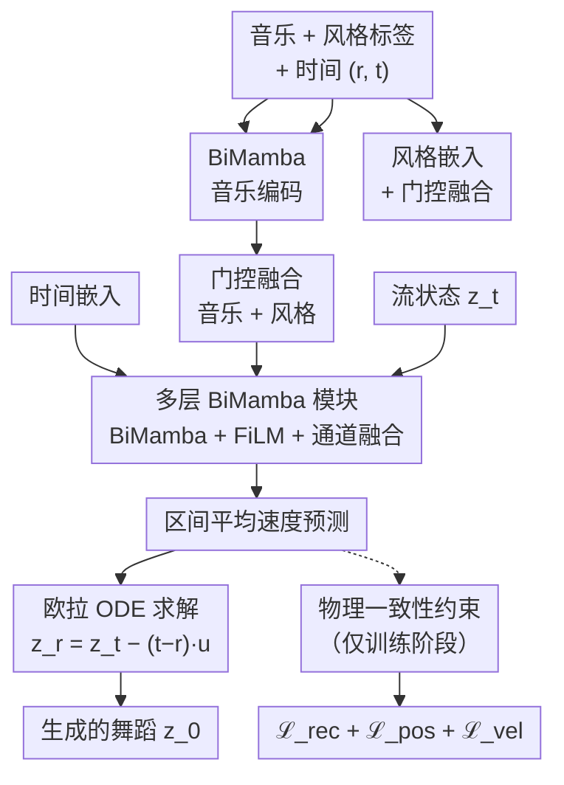

# FlowerDance: MeanFlow for Efficient and Refined 3D Dance Generation

**会议**: ECCV2026  
**arXiv**: [2511.21029](https://arxiv.org/abs/2511.21029)  
**代码**: [https://sun-happy-ykx.github.io/FlowerDance/](https://sun-happy-ykx.github.io/FlowerDance/)（录用后开源）  
**领域**: 人体理解 / 3D 动作生成  
**关键词**: 音乐到舞蹈生成, 流匹配, MeanFlow, 双向 Mamba, 非自回归生成

## 一句话总结
FlowerDance 将 MeanFlow（用区间平均速度替代瞬时速度预测的流匹配变体）与物理一致性约束、双向 Mamba 骨干和通道级跨模态融合相结合，仅需 5-20 步采样即可生成高质量的 3D 舞蹈，在 FineDance 和 AIST++ 上达到 SOTA 的同时推理速度（2008 FPS）远超此前最佳方法（MatchDance 345 FPS），为实时 3D 渲染留出充足算力空间。

## 研究背景与动机

音乐到舞蹈生成（Music-to-Dance）旨在将音频信号转化为逼真的人体运动，是虚拟现实、自动编舞和数字娱乐中的关键技术。现有方法大致分三条路线：GAN 类方法（CoheDancers、Choreography cGAN）生成速度虽快，但易模式崩溃，产出动作单调重复；自回归方法（Bailando、Bailando++、Duolando）以 choreographic unit 为基元逐帧预测，动作生物力学合理但推理延迟高，且存在曝光偏差（exposure bias）影响长程一致性；扩散方法（EDGE、Lodge、GCDance）通过迭代去噪实现高保真度，但由于去噪轨迹弯曲、需要大量采样步（通常 50 步以上），推理开销巨大。这三条路线的共同困境是：生成效率不足——留给下游高保真 3D 渲染的计算预算太少，限制了真实交互场景中 3D 角色的表现力。

从舞蹈编创的角度看，舞者本质上是"先初始化一个高熵的动作种子，再逐步精调速度、质心偏移和过渡动作"——这是一个从粗糙到精细的渐进雕塑过程。流匹配（Flow Matching）通过学习一个从简单先验到数据分布的连续速度场（ODE），恰好镜像了这一流程。然而，标准流匹配估计的是每个时间点的瞬时速度，在生成高维曲线轨迹时，瞬时速度的预测误差会随积分步长放大——为补偿弯曲轨迹，不得不减小步长、增加总步数。其深层矛盾在于：训练目标（瞬时速度匹配）与推理过程（区间 ODE 积分）之间存在错配。与此同时，Mamba 因其固有的序列归纳偏置和线性复杂度，在细粒度时序建模上展现出比 Transformer（位置编码弱、二次复杂度）更自然的优势，但能否将 Mamba 的高效性与流匹配的渐进生成优势协同起来，仍是一个开放问题。

FlowerDance 的核心洞察是：如果将生成策略从"预测瞬时速度"改为"预测区间平均速度"，训练和推理就变成同一件事——模型在训练时直接学习从起点到终点的平均变化方向，推理时一步或多步走完，不必为补偿弯曲轨迹而被迫加步。但直接使用 MeanFlow 会面临 3D 人体运动特有的新问题：人体运动流形高度复杂且多模态，仅靠速度场一致性约束无法锚定生成轨迹，模型会漂移到物理不合理的区域（抖动、根漂移、异常肢体）。因此他们引入物理一致性约束（PCC）作为锚定，在训练时额外从速度场恢复出完整运动，再对恢复后的运动施加重建、关节位置（通过正运动学 FK）和速度三重损失。同时，他们采用双向 Mamba（BiMamba）替代 Transformer 作为骨干网络，以 O(n) 复杂度捕获音乐和舞蹈之间的双向时序依赖；并用通道级逐元素加法替代交叉注意力，实现零参数跨模态融合。**核心 idea：将 MeanFlow 区间平均速度预测与物理一致性约束结合，配合 BiMamba 线性复杂度骨干和零参数通道级跨模态融合，以仅 5-20 步采样实现 SOTA 舞蹈质量与 2008 FPS（比此前最佳方法快 5.8 倍）的推理效率。**

## 方法详解

### 整体框架

FlowerDance 的整体流程是一个基于 MeanFlow 的 ODE 生成框架。输入为音乐特征（35 维，包含 MFCC / Chroma / Peak / Beat / Envelope 等，由 Librosa 提取）、舞蹈风格标签（one-hot 编码）和当前时间步信息（起始时间 r 和结束时间 t）。音乐特征先经多层 BiMamba 编码，与风格标签的嵌入向量通过门控机制融合；时间信息经正弦位置编码后相加融合。融合后的条件特征与当前流状态 z_t 一起送入多层 BiMamba 模块——每层包含 BiMamba 进行时序建模、FiLM 融入时间信息、通道级加法融合跨模态信息——最终输出区间平均速度 u_theta(z_t, r, t)，再通过欧拉离散化求解 ODE 一步或多步还原出完整舞蹈序列 z_0。整个序列以非自回归方式一次性生成，无需逐帧解码。

### 关键设计

**1. MeanFlow 生成策略：用区间平均速度对齐训练与推理错配**

标准流匹配估计的是瞬时速度 v(z_t, t) = ε − x（沿线性插值路径），训练目标为匹配该瞬时速度。但在高维空间中，即使条件流被设计为线性，实际的潜在轨迹仍是弯曲的——用大步长积分时，瞬时速度模型无法准确捕捉弯曲轨迹，导致生成质量退化。MeanFlow 将预测目标从瞬时速度改为区间平均速度：u(z_t, r, t) = (1/(t−r)) ∫_r^t v(z_τ, τ) dτ。通过 MeanFlow 等式 u(z_t, r, t) = v(z_t, t) − (t−r) · d/dt u(z_t, r, t)，模型可直接最小化预测平均速度与真实平均速度之间的均方误差。推理时，ODE 更新变为 z_r = z_t − (t−r) · u_θ(z_t, r, t)，其形式与训练目标完全一致——不再存在"训练预测瞬时、推理用区间"的错配。这使得仅需 5-20 步即可获得媲美扩散模型 50 步的生成质量。

**2. 物理一致性约束（PCC）：给生成轨迹绑定人体运动流形**

MeanFlow 的损失 ℒ_MF 仅约束速度场自身的数学一致性，不对恢复出的具体运动施加任何约束。在 3D 人体运动这一高维多模态条件映射中，仅靠速度场一致性很难收敛——模型会漂移到物理不合理的区域，表现为时序抖动、全局根漂移和异常肢体动作。核心困难在于网络直接输出的是区间平均速度而非原始运动，传统物理损失（速度、加速度、关节点损失）无法直接施加。FlowerDance 的解决方法是：在每个训练迭代中额外采样一个时间 t₁，令模型预测区间 (t₁, 0) 上的平均速度 u_θ(z_{t₁}, 0, t₁)，再通过 ẑ₀ = z_{t₁} − t₁ · u_θ(z_{t₁}, 0, t₁) 恢复出预测运动。然后对 ẑ₀ 施加三重损失：重建损失 ℒ_rec = ‖ẑ₀ − z₀‖²、关节点位置损失 ℒ_pos = ‖FK(ẑ₀) − FK(z₀)‖²（FK 为正运动学，将关节角映射为三维位置）、速度损失 ℒ_vel = ‖FK(ẑ₀)' − FK(z₀)'‖²。消融实验表明，去掉 PCC 后训练直接发散为 NaN，足见其关键作用。

**3. BiMamba 骨干网络：以 O(n) 复杂度实现双向时序建模**

选择 Mamba 而非 Transformer 有三大理由。其一，音乐和舞蹈要求强烈的局部连续性——Transformer 的位置编码本质上是弱归纳偏置，对细粒度局部依赖的建模不如 Mamba 的序列状态空间机制。Mamba 通过选择机制（S6）和递推状态更新，天然具备序列归纳偏置。其二，Mamba 计算复杂度为 O(n)，远低于 Transformer 的 O(n²)，对长序列（如 1024 帧 34 秒舞蹈）优势明显。其三，Mamba 支持非自回归一次生成完整序列，避免了自回归方法的曝光偏差和分段修补方法的边界伪影。但标准 Mamba 是单向的，而音乐和舞蹈的时序依赖都是双向的——当前动作受前面和后面音乐的共同影响。FlowerDance 采用 BiMamba：序列同时经前向和后向 Mamba 分支处理，输出通过加法融合，再用一个乘法残差连接增强梯度流动和特征保留。

**4. 通道级跨模态融合：零参数逐元素加法替代交叉注意力**

音乐和舞蹈在时间上是帧对齐的，且时序建模已由 BiMamba 完成，因此无需交叉注意力那样的复杂交互。FlowerDance 直接用逐元素加法将音乐特征和舞蹈特征在通道维融合——零参数量、不增加推理负担，且在小规模 3D 舞蹈数据集上泛化性优于交叉注意力（参数过多易过拟合）。实验表明，将加法换成交叉注意力后质量略降（FIDg 从 19.59 升至 24.45）且推理速度从 2008 FPS 降至 1463 FPS，验证了加法在效率和质量上的双重优越性。

### 损失函数 / 训练策略

总损失为 ℒ = λ_mf · ℒ_MF + λ_rec · ℒ_rec + λ_pos · ℒ_pos + λ_vel · ℒ_vel，其中 ℒ_MF 为 MeanFlow 速度场一致性损失，ℒ_rec / ℒ_pos / ℒ_vel 为物理一致性约束的三项子损失。λ 在训练开始时按各项损失量级平衡。推理时仅需 ODE 前向求解，PCC 相关的计算全部剥离，故不增加推理开销。

## 实验关键数据

### 主实验

| 数据集 | 指标 | FlowerDance | 之前 SOTA | 提升 |
|--------|------|-------------|-----------|------|
| FineDance | FIDk ↓ | 29.73 | Match 36.68 | 降低 18.9% |
| FineDance | FIDg ↓ | 19.59 | Lodge 35.52 | 降低 44.9% |
| FineDance | 多样性 DIVk ↑ | 8.42 | Bailando 7.74 | +8.8% |
| FineDance | 节拍对齐 BAS ↑ | 0.232 | Lodge 0.226 | +2.7% |
| FineDance | FPS ↑ | 2008 | Match 345 | 快 5.8× |
| FineDance | 参数量 | 63M | Lodge 235M | 减少 73% |
| AIST++ | FIDk ↓ | 20.50 | Bailando 28.16 | 降低 27.2% |
| AIST++ | 几何多样性 DIVg ↑ | 6.52 | FACT 6.18 | +5.5% |

在 FineDance 数据集上，用户研究（40 名舞者、5 分制双盲问卷）显示 FlowerDance 在舞蹈质量（4.18 vs MEGA 4.12）、节拍同步（4.41 vs 4.23）和创造性（4.33 vs 4.27）三个维度均领先。

### 消融实验

| 配置 | FIDk ↓ | FIDg ↓ | FSR ↓ | FPS ↑ | 说明 |
|------|--------|--------|-------|-------|------|
| FlowerDance (完整) | 29.73 | 19.59 | 0.147 | 2008 | 完整模型 |
| BiMamba → Mamba（单向） | 39.40 | 38.93 | 0.197 | 2387 | 去掉双向后质量大幅下降 |
| BiMamba → Transformer (NAR) | NaN | NaN | NaN | 1829 | 非自回归 Transformer 无法泛化到长序列 |
| BiMamba → Transformer (II) | 23.29 | 21.02 | 0.191 | 218 | 修补式 Transformer 指标尚可但速度极慢 |
| 加法 → 交叉注意力 | 32.40 | 24.45 | 0.194 | 1463 | 交叉注意力质量略降、速度更慢 |
| 去掉 PCC | NaN | NaN | NaN | 2008 | 训练发散，说明 PCC 不可或缺 |

### 关键发现

- **MeanFlow 的步数优势极大**：10 步即达 RectFlow 50 步的质量（FIDk 26.17 vs 33.47），20 步全面超越；5 步仍合理（但 FSR 偏高 1.206 表明有脚滑），单步生成仍是开放问题。
- **PCC 是不可或缺的锚定**：去掉 PCC 后训练完全发散（NaN），说明在 3D 人体运动这一复杂高维任务上，仅靠速度场一致性损失远不足以约束生成轨迹到合理运动流形。
- **BiMamba 是效率和质量的平衡点**：单向 Mamba 效率更高但质量差太多；Transformer (II) 质量接近但速度仅 218 FPS（BiMamba 的 1/9），Transformer (NAR) 完全无法处理长序列。
- **通道级加法在质量上不输交叉注意力**：不仅泛化更好（非自回归设置下更稳定），且速度快 37%、参数量更少。

## 亮点与洞察

- **训练-推理一致性的设计哲学**：MeanFlow 把"训练预测平均速度 ↔ 推理用平均速度 ODE 积分"对齐，解决了扩散模型和标准 FM 中训练目标和推理过程错配的根本问题，用极简公式变换换来大幅步数减少。
- **PCC 解决了"速度场模型如何施加运动约束"的困境**：网络预测的是平均速度而非运动，无法直接施加关节点损失——通过额外采样 t₁ → 恢复完整运动 → 再施加 FK 位置损失，这个"附加恢复路径"的思路精妙且可复用。
- **BiMamba + 加法融合的系统级协同**：单看每个组件（Mamba、加法融合）都不是首创，但组合在一起实现了 2008 FPS（此前最高 345 FPS）这种数量级的效率飞跃，证明在效率导向的系统设计中，组件间协同比单点创新更关键。
- **时间衰减软掩码的编辑策略**：考虑到了少步采样缺乏逐轮修正能力，用逐渐减弱的软约束替代硬掩码——避免硬边界处的突变伪影，是面向实际应用的务实设计。

## 局限与展望

- 单步生成（one-step）尚未实现，5 步时 FSR 跳升至 1.206 表明仍有明显脚滑伪影，距实时交互还有一步之遥。
- 依赖 Librosa 手工特征（MFCC / Chroma 等），未探索端到端音频特征学习（如 Jukebox 或 MERT 编码），可能丢失高层语义信息。
- 仅在 SMPL 参数化的人体模型上验证，对非标准体型、多人物交互等泛化性未知；且仅评估 30 FPS 细粒度，未探索变帧率生成功率需求场景。
- 消融中 FIDk 随 MeanFlow 步数增加（5 步 29.05 → 20 步 29.73）反而微升，论文未解释这一非单调现象——可能在步数增加时过度平滑了细节。

## 评分

- 新颖性: ⭐⭐⭐⭐ MeanFlow 在动作生成领域的首次应用 + PCC 巧妙地解决了速度场模型缺乏运动约束的问题，但组件级创新（Mamba 骨干、加法融合）并非首创。
- 实验充分度: ⭐⭐⭐⭐⭐ 两个数据集 + 三类指标（质量/效率/用户）+ 四组消融（生成模型/骨干/融合/PCC），覆盖全面，数据完整。
- 写作质量: ⭐⭐⭐⭐ 动机链清晰（效率瓶颈 → MeanFlow 对齐 → PCC 锚定 → BiMamba 加速），公式推导完整，但方法部分稍微偏长。
- 价值: ⭐⭐⭐⭐⭐ 2008 FPS vs 此前最高 345 FPS，效率提升近 6 倍，为实时 3D 交互场景打开了可能性，实用价值很高。

<!-- RELATED:START -->

## 相关论文

- [\[CVPR 2026\] OpenDance: Multimodal Controllable 3D Dance Generation with Large-scale Internet Data](../../CVPR2026/human_understanding/opendance_multimodal_controllable_3d_dance_generation_with_large-scale_internet_.md)
- [\[ECCV 2026\] Text Dictates, Music Decorates: Energy-based Attention for Editable Dance Motion Generation](text_dictates_music_decorates_energy_based_attention_for_editable_dance_motion_generation.md)
- [\[ICLR 2026\] ReactDance: Hierarchical Representation for High-Fidelity and Coherent Long-Form Reactive Dance Generation](../../ICLR2026/human_understanding/reactdance_hierarchical_representation_for_high-fidelity_and_coherent_long-form_.md)
- [\[ICCV 2025\] MDD: A Dataset for Text-and-Music Conditioned Duet Dance Generation](../../ICCV2025/human_understanding/mdd_a_dataset_for_text-and-music_conditioned_duet_dance_generation.md)
- [\[ICLR 2026\] EasyTune: Efficient Step-Aware Fine-Tuning for Diffusion-Based Motion Generation](../../ICLR2026/human_understanding/easytune_efficient_step-aware_fine-tuning_for_diffusion-based_motion_generation.md)

<!-- RELATED:END -->
