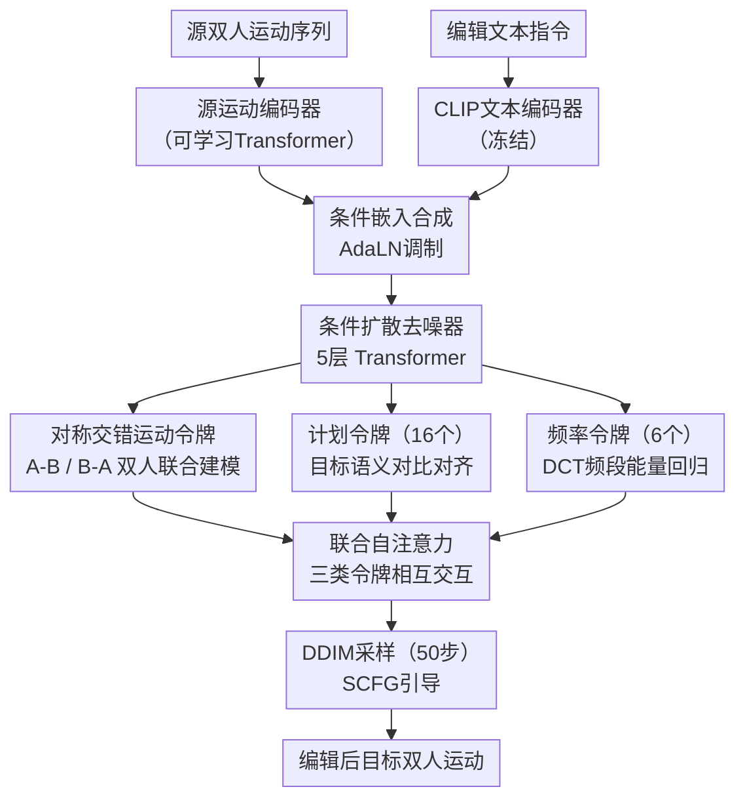

# InterEdit: Navigating Text-Guided 3D Dyadic Human Motion Editing

**会议**: ECCV 2026  
**arXiv**: [2603.13082](https://arxiv.org/abs/2603.13082)  
**代码**: [https://github.com/YNG916/InterEdit](https://github.com/YNG916/InterEdit)  
**领域**: 人体理解 (Human Understanding)  
**关键词**: 双人运动编辑, 文本引导, 条件扩散模型, 交互建模, DCT频域对齐

## 一句话总结
InterEdit 提出了文本引导双人3D运动编辑（TMME）这一新任务，构建了首个大规模双人运动编辑数据集 InterEdit3D（5161组源-目标-文本三元组），并设计了基于条件扩散模型的 InterEdit 方法——通过语义感知计划令牌对齐捕获高层编辑意图、交互感知频率令牌对齐利用DCT频段能量约束交互节奏——在编辑忠实度和运动真实性上显著超越四种基线方法。

## 研究背景与动机

文本引导的3D人体运动编辑已经在单人场景下取得了不错的进展，MotionFix 和 MotionLab 等方法能够根据文本指令有选择地修改单人的动作，同时保留未修改部分。然而现实世界中大量人类行为涉及双人乃至多人交互——握手、跳舞、武术对练、传球——这些交互动作的意义不仅来自个体运动本身，更来自两个人之间的精准时空耦合：谁先动谁后动、两人维持多少距离、挥手是同步的还是交替的、接触时机是否精确。编辑这种交互运动的难度远超单人编辑：对一个人的一个微小改动就可能破坏同步节奏，使动作看起来像两个独立个体各自行动而非真正在互动。这种"改一点就要维持整体协调"的约束在交互场景中格外苛刻。

困难的核心在于数据和方法两方面都缺乏支撑。数据层面，现有运动数据集要么只提供单人运动（HumanML3D、KIT-ML），要么只提供双人生成数据（InterHuman、Inter-X），缺失"编辑前源运动→编辑后目标运动+编辑指令"这种三元组结构。方法层面，现有单人运动编辑方法不了解交互结构，直接拼接两个人的特征后效果很差；而双人运动生成方法虽然能建模交互结构，但缺乏"改指定部分、保留其余"的编辑能力——没有源运动作为锚点，生成过程容易偏离原始动作框架，甚至产生全局漂移。

本文从数据和方法两端同步推进。数据方面，提出了 InterEdit3D 数据集——基于 InterHuman 通过半自动运动检索+人工标注流水线构建，目标是找到"一个参与者的基础动作相似、但交互结构不同"的运动对，再由标注员撰写编辑指令。方法方面，在条件扩散模型框架下引入两套互补的令牌对齐机制：语义感知计划令牌从冻结的教师模型中学习目标运动的高层语义嵌入，告诉模型"要改成什么样"；交互感知频率令牌通过DCT将双人交互信号分解到频域、约束频段能量，告诉模型"交互节奏如何保持不变"。两套令牌分别从语义内容和时序节奏两个正交维度指导编辑过程。**核心 idea：将双人交互运动编辑解耦为语义层面的内容决策和频域层面的节奏保持，用可学习的计划令牌和频率令牌在条件扩散模型内部分别建模这两个维度，辅以同步无分类器引导实现精准编辑。**

## 方法详解

InterEdit 将双人运动编辑建模为基于条件的扩散生成过程。给定源双人运动序列 $x^s$ 和编辑文本指令 $y$，模型生成编辑后的目标运动序列 $\hat{x}_0$，要求在遵循指令改变指定部分的同时，保持与源运动一致的未修改内容，并维持双人交互的时空耦合。

### 整体框架

InterEdit 的整体架构如图（见下方框架图）所示，分为以下几个关键环节：

（1）条件编码：源运动序列经过一个可学习的 Transformer 编码器（含CLS查询令牌）提取为源条件嵌入 $c_{src}$；文本指令经过冻结的 CLIP ViT-L/14 编码器提取为文本条件嵌入 $c_{text}$。两个嵌入通过线性投影后，与时间步嵌入一起相加合成条件嵌入 $e_t$，通过 AdaLN 调制注入去噪器各层。

（2）令牌序列构建：去噪器是一个5层Transformer，采用 Start_X 参数化——直接预测干净运动 $x_0$ 而非噪声。输入令牌序列由三部分组成：对称交错排列的双人运动令牌（两人各自的帧级运动特征交替排列并拼接正反两种角色顺序）、16个可学习的计划令牌（用于捕获高层编辑语义）、6个频率控制令牌（从当前噪声运动的DCT频段能量导出，用于约束交互节奏）。

（3）扩散去噪与目标重建：三组令牌通过 Transformer 的联合自注意力相互交互，运动令牌在去噪过程中同时感知计划令牌提供的高层编辑意图和频率令牌提供的交互节奏约束，最终输出编辑后的目标运动。推理时采用 DDIM 采样（50步）和同步无分类器引导（SCFG）增强条件响应。

### 关键设计

**1. 语义感知计划令牌对齐：用对比学习教会模型要改什么**

对双人运动编辑而言，最核心的问题在于模型必须准确判断"源运动的哪个部分要改、改成什么样子"，同时保留不该改的内容。如果仅仅把源运动和文本指令拼接起来作为条件，模型很难理清"这段运动的哪个片段对应指令中的哪个变化"。

InterEdit 在扩散去噪器的令牌序列中附加了16个可学习的计划令牌（plan tokens）。这些令牌不是固定的，而是在训练过程中通过一个对比对齐信号逐步学会表征目标运动的高层语义。具体实现上，论文使用一个冻结的 TMR 运动教师编码器（在 InterHuman 上经过对比学习训练），从真实目标运动 $x_0$ 中提取一个紧凑的语义嵌入 $z_{tgt} = f_T(x_0) \in \mathbb{R}^C$。在去噪器的第3个Transformer块处，将16个计划令牌各自通过一个线性投影映射到同一语义空间，然后用 InfoNCE 损失约束每个令牌的投影与 $z_{tgt}$ 语义相似、与batch内其他目标嵌入相异：

$$ \mathcal{L}_{\text{plan}} = \frac{1}{N_M}\sum_{k=1}^{N_M}\left[-\log\frac{\exp(\tilde{z}^{(k)\top}\tilde{z}_{\text{tgt}} / \tau)}{\sum_n \exp(\tilde{z}^{(k)\top}\tilde{z}_{\text{tgt}}^{(n)} / \tau)}\right] $$

InfoNCE 的判别性约束让计划令牌学会的不是"记住"目标运动的平均特征，而是捕捉"这个目标运动相对于其他运动独特在哪里"——这恰好是编辑意图表征所需要的。实验显示，单独使用计划令牌就能将 g2t R@1 从 12.54 提升到 14.52，且 InfoNCE 损失的效果优于余弦相似度和 MSE。

**2. 交互感知频率令牌对齐：用频域视角锁住交互节奏**

双人交互的"真实感"很大程度上取决于时序上的微妙协调——两个人是同步挥手还是交替挥手、接触时机是否精确、一人靠近时另一人是否相应后退。这些节奏特征在原始运动坐标空间中难以被显式建模：一个微小的时域偏移不改变单帧空间位置，却会彻底破坏交互的同步感。

InterEdit 从频域角度切入，提出交互感知频率令牌对齐。对双人运动序列 $x = (x^A, x^B)$，论文先构造两个交互信号：平均信号 $z_S = (x^A + x^B)/2$ 捕捉同步分量，差分信号 $z_D = x^A - x^B$ 捕捉相对/对抗分量。对这两个信号沿时间轴做离散余弦变换（DCT），将DCT系数按低频/中频/高频三个频段做能量池化，得到6个频段能量描述子（3频段 × 2信号）。这些描述子被投影为6个频率控制令牌，附加到令牌序列中参与联合自注意力。

训练时，频率令牌通过一个加权回归损失去预测目标运动的DCT频段能量分布，其中高频分量的权重被有意降低（0.25）以减少对噪声的敏感度。这种设计的优雅之处在于：低频分量对应大尺度的交互协调（如一人出手、一人后撤的整体节奏），高频分量对应精细的接触细节（如击掌瞬间的手部同步）。让模型在频域显式对齐这些属性，比只靠空间域损失间接维持交互节奏要直接得多。此外，训练中随机丢弃频率令牌（drop rate=0.04）作为正则化，防止模型过度依赖频率引导而损失生成多样性。

**3. 同步无分类器引导：为编辑定制的条件注入策略**

标准无分类器引导（CFG）在文本条件生成模型中广泛使用，但对于依赖"文本指令 + 源运动"两个条件的编辑任务，简单地将两个条件独立丢弃可能导致引导方向混乱——文本条件给了编辑意图，源条件又要求保持原状，两种信号分离引导时相互消解。

InterEdit 提出同步无分类器引导（SCFG）：训练时以概率 $p_{scfg}=0.1$ 将两个条件**同时置零**，得到一个完全无条件的去噪分支。推理时插值条件和无条件预测：
$$\hat{x}_0 = \gamma \cdot D_\theta(x_t, t; c_{\text{text}}, c_{\text{src}}) + (1-\gamma) \cdot D_\theta(x_t, t; 0, 0)$$
同步丢弃避免了文本指令和源运动之间的信息纠缠，使引导方向更纯净。实验对比了"两分支SCFG"（本文方案）和"三分支SCFG"（额外引入仅源条件分支），两者性能基本持平，但两分支每次推理少一次前向传播，效率更优。

### 损失函数 / 训练策略

InterEdit 的训练损失由三个层次组成。**运动损失** $\mathcal{L}_{\text{motion}}$ 包括扩散重建损失（Start_X参数化，预测 $x_0$ 与真值的MSE）、每人的几何损失（速度平滑 $\mathcal{L}_{\text{vel}}$、脚接触 $\mathcal{L}_{\text{foot}}$、骨骼长度 $\mathcal{L}_{\text{BL}}$）和两人间交互损失（遮罩距离图 $\mathcal{L}_{\text{DM}}$、相对朝向 $\mathcal{L}_{\text{RO}}$）。**计划令牌对齐损失** $\mathcal{L}_{\text{plan}}$ 用 InfoNCE 约束计划令牌与教师目标嵌入对齐（$\lambda_p = 0.03$）。**频率令牌对齐损失** $\mathcal{L}_{\text{freq}}$ 用加权MSE回归目标运动的DCT频段能量（$\lambda_f = 0.01$）。总损失 $\mathcal{L}_{\text{total}} = \mathcal{L}_{\text{motion}} + \lambda_p \mathcal{L}_{\text{plan}} + \lambda_f \mathcal{L}_{\text{freq}}$。

训练使用 AdamW 优化器，峰值学习率 $10^{-4}$ 配合余弦衰减+10轮预热，共1500个epoch，batch size 32。CLIP 文本编码器和 TMR 教师编码器均冻结。模型在8张 RTX Pro 6000 Blackwell GPU 上约4小时35分钟完成训练，可训练参数量8500万。推理时采用 DDIM 采样50步，SCFG 引导尺度 $\gamma = 3.5$。

## 实验关键数据

### 主实验

InterEdit 在自建的 TMME 基准上与四类适配基线方法对比：单人运动编辑方法（MotionFix、MotionLab）和双人运动生成方法（InterGen、TIMotion）。所有基线均在 InterEdit3D 上重新训练。核心指标为生成-目标检索（g2t，越高越好，反映指令遵循度）、生成-源检索（g2s，越高越好，反映源保留度）和 FID（越低越好，反映运动真实性）。

| 方法 | FID ↓ | g2s R@1 ↑ | g2s R@2 ↑ | g2s R@3 ↑ | g2t R@1 ↑ | g2t R@2 ↑ | g2t R@3 ↑ |
|------|-------|-----------|-----------|-----------|-----------|-----------|-----------|
| MotionFix | 2.109 | 3.10 | 7.20 | 9.10 | 11.60 | 17.80 | 21.10 |
| MotionLab | 0.428 | 12.40 | 18.90 | 23.00 | 18.50 | 25.60 | 30.50 |
| InterGen | 0.624 | 9.52 | 15.03 | 18.91 | 18.93 | 26.74 | 31.64 |
| TIMotion | 0.445 | 12.54 | 18.38 | 22.33 | 24.97 | 33.77 | 40.68 |
| **InterEdit** | **0.371** | **17.08** | **24.04** | **29.32** | **30.82** | **40.84** | **47.65** |

InterEdit 在所有指标上全面领先最强基线 TIMotion：g2t R@1 提升 5.85 个百分点（+23%），g2s R@1 提升 4.54 个百分点（+36%），FID 降低 16.7%。值得注意的是，双人生成方法（InterGen、TIMotion）在 g2t 上显著优于单人编辑方法，说明交互感知建模对双人编辑至关重要，但它们缺乏"保留源内容"的显式约束，g2s 明显弱于 InterEdit。

在额外的人类偏好评估中（20组prompt，10名参与者），InterEdit 相比于 TIMotion 在整体偏好（胜75.5%）、指令遵循（胜78.5%）、源保留（胜71.0%）和交互真实感（胜81.0%）四个维度均获得压倒性优势。

### 消融实验

核心消融实验评估两个主要模块的独立和联合效果：

| 配置 | FID ↓ | g2s R@1 ↑ | g2t R@1 ↑ |
|------|-------|-----------|-----------|
| 无plan/freq令牌（基线） | 0.445 | 12.54 | 24.97 |
| 仅plan令牌 | 0.367 | 14.52 | 28.72 |
| 仅freq令牌 | 0.380 | 14.24 | 28.75 |
| plan + freq令牌（完整） | 0.371 | 17.08 | 30.82 |

仅用计划令牌即可显著提升语义编辑（g2t +3.75），仅用频率令牌也能改善检索并维持有竞争力的 FID，两者组合在 g2s 上产生最大的增益（+4.54），验证了"语义引导改什么、频率约束怎么改"的互补设计。频率令牌随机丢弃的最佳 drop rate 为 0.04，过低会导致过度依赖、过高则削弱对齐信号。

此外，InterEdit 在 InterHuman 双人生成基准上也超越了当前最先进的 TIMotion（R-Precision R@1 0.523 vs 0.491），说明语义计划令牌和频率令牌带来的交互建模能力具有通用性，不仅限于编辑场景。

### 关键发现

- **两模块互补性强**：计划令牌主要提升 g2t（语义编辑忠实度），频率令牌主要提升 g2s（源保留度）。两者结合时 g2s 获得最大跳跃（+4.54），说明频率正则化有效防止了编辑过程中的交互漂移。
- **InfoNCE > Cosine > MSE**：计划令牌的对比式对齐明显优于回归式，说明判别性语义表征更适合编辑意图编码。
- **SCFG两分支足够**：三分支SCFG（额外加源条件分支）不带来显著改善，两分支更简洁高效。
- **玄参数不敏感**：$\lambda_p$ 和 $\lambda_f$ 在合理范围内变化表现稳定，超调会轻微降低 FID。

## 亮点与洞察

- **双人→频域视角转换**：将双人交互的时序协调问题转化为DCT频段能量对齐，是一个优雅的降维设计。平均/差分信号分别捕获同步和对抗分量，三个频段对应由粗到细的时间尺度，物理意义直观且数学上可微可导。
- **对比对齐 vs 回归对齐**：计划令牌用 InfoNCE、频率令牌用 MSE——两种对齐方式各有侧重，前者鼓励判别性语义表征，后者约束定量能量分布，恰好对应"改什么"和"怎么改"两个互补目标。
- **从编辑到生成的迁移能力**：InterEdit 在标准双人运动生成基准上也取得领先，说明语义+频率令牌对齐学到的交互表征是通用且可迁移的，不局限于编辑任务。
- **数据集建设思路**：InterEdit3D 的"运动检索+人工标注"流水线是可扩展的——从现有生成数据集中挖掘编辑三元组，避免了从零采集的巨大成本。

## 局限与展望

- **手势歧义**：模型在细粒度手势语义上仍有混淆。例如"双手击掌"可能与"和对方击掌"混淆，源和目标之间仅改变手部交互模式时，模型难以精确辨识。未来可引入手部关键点级别的显式建模。
- **长时序空间漂移**：模型在长序列的高动态交互（如持续跳舞）中容易发生一人逐渐漂移的现象，表明长程空间关系保持仍是挑战。可尝试引入轨迹级约束或显式空间锚点。
- **规模受限**：数据集仅有5161组三元组、指令词汇量1754，相比单人编辑数据集 MotionFix（6730组）差距不算大，但要支撑多人（3+）编辑还远远不够。多人交互的数据标注成本极高，如何利用自我博弈或物理仿真生成训练数据是重要方向。
- **仅限双人**：目前方法只支持双人交互编辑，扩展到三人以上需要重新设计令牌排列和交互建模策略。
- **评估指标局限**：g2t/g2s 检索指标是代理度量，无法完全捕捉感知层面的交互质量（如接触是否自然、节奏感是否真实），需要更完善的交互真实性度量。

## 相关工作与启发

- **vs MotionFix/MotionLab**：两者开创了文本引导单人运动编辑，但直接拼接双人特征后无法维持交互结构。InterEdit 证明了交互感知建模对双人编辑至关重要，为后续推广到多人场景提供了基线。
- **vs TIMotion**：共享对称交错令牌聚合架构，但 TIMotion 是纯生成模型，InterEdit 通过计划令牌和频率令牌将其改造为编辑模型。关键是"不是简单加源条件，而是设计了两套对齐机制来引导编辑方向"。
- **vs InterGen**：从双人生成到双人编辑的进化，核心增量是成对的源-目标监督信号和条件扩散框架。InterGen 的双人交互数据（InterHuman）本身为 InterEdit3D 数据集提供了原料。
- **DCT频域分析在运动领域的应用**：本文的频段能量池化是一个可推广的技巧——任何涉及时序节奏的任务（舞蹈生成、手势同步、人机交互）都可以尝试用DCT分解+频段约束来稳定交互节奏。

## 评分

- 新颖性: ⭐⭐⭐⭐⭐ 首次提出文本引导双人运动编辑任务，同时贡献了首个大规模数据集和完整方法方案，填补了单人编辑到双人交互编辑之间的空白
- 实验充分度: ⭐⭐⭐⭐⭐ 4个基线方法+人类评估+泛化测试+损失函数消融+模块位置/超参数/丢弃率等详尽消融，置信区间和统计严格性到位
- 写作质量: ⭐⭐⭐⭐⭐ 问题动机清晰，方法组织合理（语义vs频率两个互补维度的设计叙事），实验解读充分有层次
- 价值: ⭐⭐⭐⭐⭐ 为动画/游戏/社交机器人等应用提供实质性的交互编辑能力，数据集和方法双重开源，可复现性强

<!-- RELATED:START -->

## 相关论文

- [\[ECCV 2026\] Dress-ED: Instruction-Guided Editing for Virtual Try-On and Try-Off](dress-ed_instruction-guided_editing_for_virtual_try-on_and_try-off.md)
- [\[CVPR 2025\] SimMotionEdit: Text-Based Human Motion Editing with Motion Similarity Prediction](../../CVPR2025/human_understanding/simmotionedit_text-based_human_motion_editing_with_motion_similarity_prediction.md)
- [\[CVPR 2026\] MotionMaster: Generalizable Text-Driven Motion Generation and Editing](../../CVPR2026/human_understanding/motionmaster_generalizable_text-driven_motion_generation_and_editing.md)
- [\[AAAI 2026\] ReAlign: Text-to-Motion Generation via Step-Aware Reward-Guided Alignment](../../AAAI2026/human_understanding/realign_text-to-motion_generation_via_step-aware_reward-guided_alignment.md)
- [\[ECCV 2026\] UniMotion: A Unified Framework for Motion-Text-Vision Understanding and Generation](unimotion_a_unified_framework_for_motion-text-vision_understanding_and_generatio.md)

<!-- RELATED:END -->
