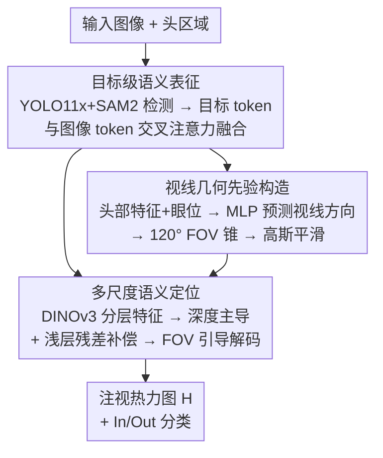

# Multi-scale Object-Aware Gaze Estimation via Geometric Reasoning

**会议**: ECCV2026  
**arXiv**: [2606.29334](https://arxiv.org/abs/2606.29334)  
**代码**: 待确认  
**领域**: 人体理解  
**关键词**: 视线目标估计, 层次化推理, 目标级语义, 多尺度融合, 几何先验

## 一句话总结

将视线目标估计从像素级回归重新建模为层次化推理问题，先用目标级语义表征建立候选注意对象，再用视线方向构造视场锥几何先验约束空间，最后通过多尺度残差融合精确定位，在 GazeFollow/VideoAttentionTarget/ChildPlay/GOO-Real 上以 7.1M 参数取得 SOTA。

## 研究背景与动机

视线目标估计（gaze target estimation）旨在预测场景中观察者正在注视的语义对象，是理解人类视觉注意与社会交互的关键任务，广泛应用于自动驾驶、人机交互和社交机器人。近年来大量工作沿着两条路线推进：一是引入深度/人体姿态/三维头部信息等辅助模态构建多分支网络，虽增强了空间理解，但模型复杂度持续攀升，预测性能严重依赖上游辅助模型的精度，跨场景泛化受限；二是采用预训练视觉基础模型（DINOv2/v3、ViT）作为统一特征提取器，参数效率高、架构简洁，但预测通常只利用最后层特征通过浅层解码完成，层次化表征中的丰富空间结构信息被大量丢弃。

这两类方法共享一个根本性的建模假设——把视线预测当作像素级回归（pixel-level regression）问题，从全局特征直接映射到注视热力图。但人眼注意本质上是以对象为中心的（object-oriented）：观察者先选定一个具体的语义实体作为注意目标，然后在该实体区域内形成精确注视点。当模型缺乏显式的目标级决策建模时，面对复杂场景中多个候选目标竞争注意，预测往往变得空间弥散或语义不稳定。换言之，现有方法的核心瓶颈并非特征表示不够强，而是任务建模层面缺少一个结构化的目标选择机制。

本文的核心洞察是：视线目标估计本质上是一个层次化推理过程，应该被拆解为「先判断在「看哪个物体」，再确定「落在物体的哪个位置」」。基于这一视角，作者将问题重新表述为两阶段的层次化推理：先构建场景中潜在注视目标的语义假设空间，再引入观察者的几何约束（头部姿态 + 视线方向）确定哪些空间区域是视觉可达的，最后在语义和几何双一致候选区域内进行精确的注视定位。**核心 idea：将视线目标估计从单步像素级回归重构为「目标级判别 → 区域级定位」的层次化推理，通过目标语义表征建立候选假设 + 视场锥几何先验约束搜索空间 + 多尺度残差融合精确定位，三者在一个统一的单模态框架内协同完成。**

## 方法详解

### 整体框架

本文方法基于一个冻结的 DINOv3 ViT-L/16 骨干，围绕三个核心机制组织推理管线：先是目标级语义表征，将场景特征与离散语义实体显式关联；再是根据头部外观和眼睛位置估计视线方向，构造视场（Field-of-View, FOV）锥形几何先验，把搜索空间约束到视觉可达区域；最后通过多尺度残差融合把浅层空间细节与深层语义联合起来，结合 FOV 先验完成精确定位。

### 关键设计

**1. 目标级语义表征：在特征编码阶段显式建立候选注视假设**

现有方法直接从全局场景特征预测注视位置，缺少对潜在注视目标的显式建模，在多个竞争目标或强背景干扰的复杂场景中预测不稳定。本文引入目标级语义表征来解决这一痛点。

具体来说，输入图像先通过 YOLO11x 和 SAM2 离线检测得到 N 个候选目标的二值掩码 $\mathbf{M}_i$。图像被划分为非重叠 patch 并投影为图像 token $\mathbf{T}_{\text{img}}$；对每个目标区域，masked feature 经固定网格池化编码为目标 token $\mathbf{T}^{(i)}_{\text{obj}}$（每个目标用 $n^2$ 个 token 表示）。所有目标 token 与图像 token 拼接成统一序列 $\mathbf{T}_{\text{fuse}} = [\mathbf{T}_{\text{img}}; \mathbf{T}^{(1)}_{\text{obj}}; \ldots; \mathbf{T}^{(N)}_{\text{obj}}]$，送入 Transformer 编码器进行跨 token 交互。通过这种交互，单个目标的语义信息被传播到全局视觉表征中，将基于像素的场景特征转变为目标感知的语义表示，显式地建立起候选注视假设。最后从融合表示重建出一张目标感知空间响应图 $\mathbf{O}$，与原始图像经通道拼接 + $1\times1$ 卷积融合得到增强特征 $\mathbf{I}_{\text{enh}}$，为后续步骤提供语义基础。

**2. 视线几何先验：利用观察者头部姿态构造视场锥约束**

场景语义只能告诉模型「哪些物体可能被看」，但不足以唯一确定注视点——人眼注意天然受头部朝向和视线方向约束，视觉注意力被限制在前向视场锥内。本文显式构造这种几何先验来缩小推理空间。

给定头部区域图像和眼位坐标 $(x_e, y_e)$，先提取头部外观特征 $\mathbf{f}_{\text{head}}$，与眼位一起送入 MLP 预测归一化的二维视线方向向量 $\hat{\mathbf{g}}$。训练时用真值目标位置定义监督方向 $\mathbf{g}^{gt}$，施加方向损失 $\mathcal{L}_{\text{dir}}=1-\hat{\mathbf{g}}\cdot\mathbf{g}^{gt}$。基于估计的视线方向，对图像中每个像素 $(x,y)$ 计算从眼位到该像素的单位向量 $\hat{\mathbf{v}}_{(x,y)}$ 与 $\hat{\mathbf{g}}$ 的余弦相似度 $c_{(x,y)}$。考虑到人眼视场有限，设定 FOV 角 $\theta=120^\circ$（经消融实验确定），得到锥形响应图 $\mathbf{C}_{(x,y)}$（大于 $\cos\theta$ 的保留，其余置零）。经高斯平滑消除锥边界的不连续性后，通过广播乘法与可学习的 FOV 嵌入向量 $\mathbf{e}_{\text{fov}}$ 结合，生成几何感知表征 $\mathbf{E}_{\text{fov}}$，注入后续定位阶段。这个先验像一个空间门控：只有位于观察者视场锥内的区域才被允许产生高响应，大幅抑制了视场外或几何上不可达的候选干扰。

**3. 多尺度语义定位：深度主导 + 浅层残差补偿的层次融合定位**

建立目标语义假设和几何约束后，精确定位还需要在语义一致且几何可行的区域内利用多尺度空间信息。本文采用一种深度主导的残差融合策略：增强特征 $\mathbf{I}_{\text{enh}}$ 送入冻结的 DINOv3 提取各层特征，深层语义特征 $\mathbf{F}_{\text{deep}}$ 作为主表示，中层和浅层特征作为有界残差补充：

$$\mathbf{F}_{\text{fused}} = \mathbf{F}_{\text{deep}} + \alpha_{\text{mid}}\mathbf{F}_{\text{mid}} + \alpha_{\text{shallow}}\mathbf{F}_{\text{shallow}}$$

其中 $\alpha_{\text{mid}}$ 和 $\alpha_{\text{shallow}}$ 为可学习融合系数。之所以让深层主导、浅层仅做残差补偿，是因为深层特征已通过目标级语义表征注入了物体信息，浅层的空间细节只需在深层语义框架下做微调，避免多尺度直接拼接导致的特征混叠。随后将视场几何先验 $\mathbf{E}_{\text{fov}}$ 与融合表示融合，生成几何引导特征 $\mathbf{F}_{\text{guided}}$，最后通过轻量解码网络逐步恢复空间分辨率，输出注视概率热力图 $\mathbf{H}$。整个预测不再是全局像素回归的结果，而是目标级语义假设与观察者几何约束联合作用的产物。

### 损失函数 / 训练策略

训练采用三项损失联合优化：注视热力图使用像素级二元交叉熵损失 $\mathcal{L}_{\text{hm}}$，真值注视点处以 2D 高斯核构造热力图目标；视线方向损失 $\mathcal{L}_{\text{dir}}$（余弦相似度）保证 FOV 先验的准确性；外加一个二分类分支判断注视目标是否在图像内（in/out-of-frame），对应 $\mathcal{L}_{\text{inout}}$。总体目标为 $\mathcal{L} = \mathcal{L}_{\text{hm}} + \lambda_{\text{dir}}\mathcal{L}_{\text{dir}} + \lambda_{\text{inout}}\mathcal{L}_{\text{inout}}$，其中 $\lambda_{\text{dir}}=0.5$（经消融确定），$\lambda_{\text{inout}}$ 为数据集相关的二元超参数（有标注时为 1，否则为 0）。训练使用单张 RTX 5090，Adam 优化器，初始学习率 $1\times10^{-3}$，输入分辨率 $512\times512$，热力图输出 $64\times64$。

## 实验关键数据

### 主实验

| 数据集 | 指标 | 本文 | 此前SOTA (Gaze-LLE) | 提升 |
|--------|------|------|---------------------|------|
| GazeFollow | AUC ↑ | **0.961** | 0.953 | +0.008 |
| GazeFollow | Avg L2 ↓ | **55.6** | 58.3 | -2.7 |
| VideoAttentionTarget | AUC ↑ | **0.948** | 0.942 | +0.006 |
| ChildPlay | AUC ↑ | **0.987** | 0.977 | +0.010 |
| GOO-Real | AUC ↑ | **0.977** | 0.962 | +0.015 |

所有结果在 7.1M 参数下取得（Gaze-LLE 使用 307M 参数的 DINOv2-giant，本文仅用 ViT-L/16），参数效率提升显著。

### 消融实验

| 配置 | GazeFollow AUC | VideoAttentionTarget AUC | 说明 |
|------|---------------|-------------------------|------|
| Full model | **0.961** | **0.948** | 完整模型 |
| w/o 目标级语义 | 0.942 | 0.931 | 去掉后 AUC 下降显著 |
| w/o FOV 几何先验 | 0.950 | 0.939 | 缺少几何约束后性能下降 |
| w/o 多尺度融合 | 0.953 | 0.941 | 只用单层深层特征 |
| w/o 全部三项 | 0.925 | 0.912 | 基线（仅 DINOv3 + 简单解码） |

### 关键发现

- **目标级语义表征贡献最大**：去掉后 GazeFollow 掉点 1.9 个 AUC，说明将注视建模为离散目标选择是推理的核心，纯像素回归在复杂场景中会显著退化。
- **FOV 几何先验有效压缩搜索空间**：去掉后 AUC 下降约 1 个点，且定性结果中热力图在多目标场景下更容易分散到注视方向以外的干扰区域。
- **FOV 角度 120° 最优**：太小（60°）会割裂合理注视区域，太大（180°）接近于无约束，最优值恰好与人眼视场范围一致。
- **多尺度残差融合优于直接拼接**：消融证实深度主导 + 浅层残差的设计比简单多尺度拼接高出 0.3-0.5 AUC，且对融合系数 $\alpha$ 较稳定（0.1-0.5 范围内性能波动 <0.2 AUC）。

## 亮点与洞察

- **问题重定义：从像素回归到目标推理**。本文最大的贡献不是某个模块，而是将视线估计的建模视角从「回归一个点」切换为「推理一个物体 + 再定一个点」，这个认知层面的转变比具体工程设计更具启发性。
- **几何先验无需额外传感器**。仅凭头部外观 + 眼位坐标即可估计视线方向，构造 FOV 锥，全在单模态 RGB 图像内完成，与复杂多分支多模态方法相比参数更少、泛化更强。
- **冻结骨干 + 轻量模块**。DINOv3 全程冻结，所有可学模块（交叉注意力融合层、MLP 方向预测、FOV 嵌入、解码网络）总计仅 7.1M 参数，在 ViT-L/16 的监督范式下验证了「冻结基础模型 + 小头」路线的有效性。
- **层次化推理的通用性**。这种「先建立语义假设 → 再用物理约束筛选 → 最后精确定位」的三段式推理范式，可迁移到其他需要结合语义理解和空间定位的任务（如目标检测中的 proposal 筛选、视觉语言导航中的注意定位）。
- **跨数据集泛化能力突出**。在 GOO-Real 上未经过何种域适应，仅轻量微调即达 0.977 AUC，说明目标级建模 + 几何先验的组合有效缓解了域偏移问题。

## 局限与展望

- **语义相似的近邻物体易误判**。当多个外观相近的物体在空间上非常靠近时，视觉上更突出的实例可能产生更强的响应，即使几何线索一致也会导致错误的目标选择。未来可探索自适应物体推理机制（如迭代注意力收缩）。
- **离散标注与连续注意的错配**。在以人为中心的场景中，注视目标往往对应一片连续区域（如人脸而非精确落点），但训练监督是离散点标注，模型倾向于聚焦语义显著区域（如人脸）而非标注位置。未来考虑不确定性感知的注视建模。
- **多人在场场景未覆盖**。本文方法假设场景中仅一个观察者，多人交互场景的联合注视推理尚未支持，可扩展为多观察者 GNN 交互预测。
- **时间信息未利用**。虽然 VAT 上利用单帧已取得好结果，但视频时序中的注视平滑性和注意力转移轨迹尚未建模，引入时序记忆模块有望进一步提升稳定性。

## 相关工作与启发

- **vs Gaze-LLE (Ryan et al., 2025)**: Gaze-LLE 首次引入 DINOv2 冻结骨干做视线估计，但仅用最后一层特征做浅层解码。本文在此基础上增加了目标语义建模 + 多尺度融合 + 几何先验三项关键设计，在更小的骨干（ViT-L vs ViT-g）上全面超越。
- **vs 多分支多模态方法 (Bao et al., ECCV 2022; Fang et al., 2021)**: 这些方法依赖深度/姿态/3D 头部信息等额外模态，训练时需同步获取这些信号，部署前还需多个上游模型离线预测。本文全在单模态 RGB 内完成，更轻量且泛化更强。
- **vs 目标感知方法 (Nieva et al., 2025; Jin et al., 2025)**: 已有工作尝试引入物体检测信息作为辅助引导，但只把目标信息当作特征附加项，不改变回归本质。本文的目标级语义 token 直接参与特征编码的跨注意力融合，从根本上改变了决策过程。

## 评分

- 新颖性: ⭐⭐⭐⭐☆ 问题重定义视角（回归→层次推理）有新意，三项设计的单项各自不算全新，但系统组合与动机闭环好
- 实验充分度: ⭐⭐⭐⭐⭐ 4 个基准测试 + 完整的组件/多尺度/骨干/FOV/超参消融 + 失败用例分析，实验体系扎实
- 写作质量: ⭐⭐⭐⭐⭐ Introduction 的问题定义和动机铺垫清晰，能从认知科学角度论证为什么要重定义任务，方法叙述连贯
- 价值: ⭐⭐⭐⭐⭐ 7.1M 参数超越 307M 模型，参数效率提升 40 倍以上，对资源受限场景的部署意义重大；推理范式的转变可启发后续研究工作

<!-- RELATED:START -->

## 相关论文

- [\[CVPR 2026\] COG: Confidence-aware Optimal Geometric Correspondence for Unsupervised Single-reference Novel Object Pose Estimation](../../CVPR2026/human_understanding/cog_confidence-aware_optimal_geometric_correspondence_for_unsupervised_single-re.md)
- [\[ICCV 2025\] Multi-view Gaze Target Estimation](../../ICCV2025/human_understanding/multi-view_gaze_target_estimation.md)
- [\[CVPR 2025\] GA3CE: Unconstrained 3D Gaze Estimation with Gaze-Aware 3D Context Encoding](../../CVPR2025/human_understanding/ga3ce_unconstrained_3d_gaze_estimation_with_gaze-aware_3d_context_encoding.md)
- [\[ECCV 2024\] GS-Pose: Category-Level Object Pose Estimation via Geometric and Semantic Correspondence](../../ECCV2024/human_understanding/gs-pose_category-level_object_pose_estimation_via_geometric_and_semantic_corresp.md)
- [\[CVPR 2026\] GazeOnce360: Fisheye-Based 360° Multi-Person Gaze Estimation with Global-Local Feature Fusion](../../CVPR2026/human_understanding/gazeonce360_fisheye-based_360deg_multi-person_gaze_estimation_with_global-local_.md)

<!-- RELATED:END -->
