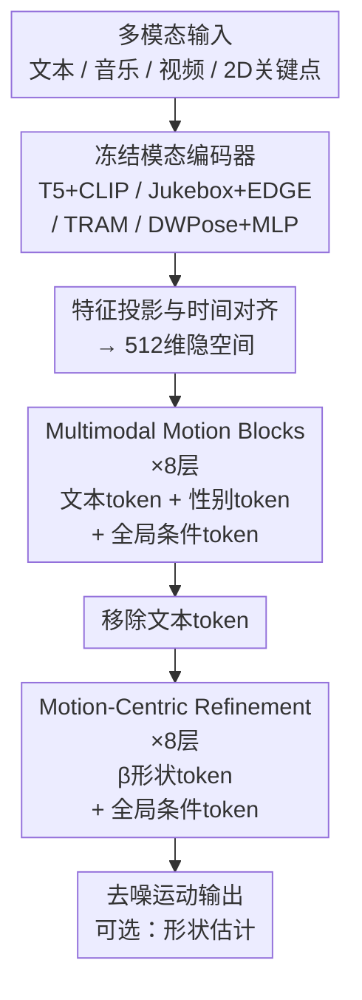

# Odoriko: A Shape-Aware Multimodal Diffusion Framework for Human Motion

**会议**: ECCV 2026  
**arXiv**: [2606.21135](https://arxiv.org/abs/2606.21135)  
**代码**: 待确认  
**领域**: human_understanding  
**关键词**: 人体运动生成, 体态感知, 多模态扩散, 形状条件, SMPL

## 一句话总结
Odoriko 提出首个统一的多模态人体运动生成框架，通过将性别和 SMPL 体形参数作为显式条件信号分层注入扩散骨干网络，使生成的运动能够反映主体的生物形态学特征，同时在文本到运动、音乐到舞蹈、视频到运动估计三个任务上以极少的参数量达到甚至超越当前专用方法的性能。

## 研究背景与动机

人体运动生成在动画、虚拟现实、游戏和具身智能等领域有广泛的应用需求，近年来扩散模型在文本驱动运动合成、音乐驱动舞蹈生成和视频三维姿态估计等方面取得了显著进展。然而，现有工作长期忽视了一个根本性的约束：人体运动不仅是动作意图或外部条件（如文本指令、音乐节拍）的函数，还受到主体生物形态特征的深刻影响——性别差异导致的骨盆宽度、肢体比例和重心分布不同，会系统性地改变走路的步幅、跳跃的高度和舞蹈的姿态风格。例如，相同的「走窄木板」文本提示理应由不同体型的角色产生截然不同的平衡调整策略，但当前的生成模型将所有受试者视为形态等价的，输出的运动无法反映「谁在动」这一关键信息。

近年来已有个别工作开始关注体形对运动的影响，如 ShapeMove 和 AttrMoGen 试图将体形融入文本到运动生成，但它们均聚焦于单一模态且依赖于手工设计的静态体形表示。真正的挑战在于：体形对运动的影响是任务依赖的——它在音乐驱动的舞蹈中更多地影响节奏动力学，而在文本驱动的动作中则影响语义关节的展开方式。要在统一框架中建模这种「模态-体形」的耦合关系，意味着扩散骨干需要同时理解异构输入的主体语义和体形依赖的生物力学变化。

本文的核心 idea 是**将人类体形（性别 + SMPL β 系数）作为与多模态条件信号平行的显式条件，通过分阶段注入的方式分别作用于前期的跨模态语义对齐阶段和后期的运动精修阶段，使扩散模型生成的运动同时满足动作语义和主体形态一致性。**

## 方法详解

### 整体框架

Odoriko 是一个统一的体态感知多模态人体运动扩散框架，同时支持文本到运动、音乐到舞蹈和视频到运动估计三类任务。其核心思想是：用一个统一的扩散骨干网络接收三种信号——噪声运动序列、多模态条件特征和主体体形特征——并通过分阶段的 Transformer 架构逐步去噪。

每种模态先经过各自的冻结预训练编码器提取特征（文本用 T5-Base + CLIP，音乐用 Jukebox + EDGE，视频用 TRAM，2D 关键点用 DWPose + 轻量 MLP 适配器），然后投影到共享的 512 维隐空间并对齐到运动帧的时间轴。体形信号由性别嵌入和 SMPL β 系数两部分分别构造为 shape token。噪声运动 token、模态特征和 shape token 共同送入扩散骨干，经过两个阶段的 Transformer 处理——前半段 Multimodal Motion Blocks 进行跨模态语义对齐（性别 token 在此阶段注入），后半段 Motion-Centric Refinement Blocks 在移除文本 token 后专注于运动时序精修（β token 在此阶段注入）——最终输出去噪的干净运动序列。在形状估计模式下，网络还会额外输出预测的性别和 β 系数。

### 关键设计

**1. 分阶段体形注入：性别先导、β精修**

体形对运动的影响具有天然的层级结构：性别决定了模板和基底的顶层轮廓（如骨盆宽度、肩宽比例），而 β 系数在模板内部描述连续体形偏移（如具体的身高、腰围）。Odoriko 让这种层级结构指导信息注入的顺序——在 Multimodal Motion 阶段仅注入性别 token，利用跨模态对齐的早期层建立起「主体身份模板」的先验；进入 Motion-Centric Refinement 阶段后才注入 β token，让精修层在已经对齐的语义框架下调节细粒度的关节运动学特征（如步幅长度、重心偏移幅度）。消融实验验证了这种因果式设计的必要性：将性别和 β 拼接为一个统一 token 同时注入两个阶段后，R-Precision 从 0.805 降至 0.774、FID 从 0.103 升至 0.118，说明分层注入让模型分别学到了「谁在动」的宏观约束和「动得多精细」的微观调节。

**2. 冻结编码器+轻量适配器的多模态融合**

面对文本、音乐、视频、2D 关键点四种异构输入，Odoriko 不训练各模态的独立编码器，而是直接复用预训练基础模型——T5-Base（token 级文本）、CLIP（句子级文本）、Jukebox+EDGE（音乐）、TRAM（视频）——并在训练时全部冻结，只通过轻量的线性投影层将各编码器输出映射到共享的 512 维隐空间。冻结编码器使梯度只在扩散骨干中传播，避免了多任务联合训练中预训练知识被灾难性遗忘；同时也将参数量压缩至仅 44M，远小于同类多模态模型 GENMO 的 504M。对于 2D 关键点这种非预训练特征，则使用轻量 MLP 从坐标直接投影。这一设计选择的风险是编码器的特征空间是固定的，当模态差异很大时可能不是最优的，但实验表明在实践中收益远大于损失——Odoriko 以 1/10 的参数量在各任务上全面超越 GENMO。

**3. 混合Transformer：语义对齐与精修解耦**

直接对所有模态 token 做全局自注意力在计算上昂贵，且文本 token 在后期精修阶段已完成语义引导。Odoriko 采用分两段的混合设计：前 8 层 Multimodal Motion Blocks 中，运动 token 与文本 token、性别 token、全局条件 token 进行完整自注意力，建立运动与模态语义之间的跨模态关联；后 8 层 Motion-Centric Refinement Blocks 移除文本 token（仅保留运动 token + 全局条件 + β token），注意力复杂度从 O(N+M)² 降至 O(N)²（其中 N 为运动帧数、M 为文本 token 数），专注于运动自身的时序精修。这种受 FLUX 和 MMAudio 启发的设计在保持多模态建模能力的同时实现了计算效率——语义对齐阶段需要宽注意力来理解「做什么」，精修阶段只需要时序注意力来调节「怎么做」。

### 一个完整示例：从文本到体形感知的运动生成

以 HumanML3D 中一个测试样本为例，用户输入「一个人在窄木板上行走保持平衡」。T5 提取 768 维 token 特征，CLIP 提取 512 维句子特征，各经线性投影至 512 维。性别（如 female）通过可学习查找表映射为 512 维性别 token，β 系数（如 [0.3, -0.1, ...]）通过 MLP 投影为 512 维 β token。噪声运动序列（196 帧 × 136 维=根关节高度+根速度+角速度+22 关节 6D 旋转）经位置编码后与上述特征拼接。在 25 步 UniPC 采样中，每步先经过 8 层 Multimodal Motion 块：运动 token 与文本 token 全注意力感知语义，性别 token 加入注意力以匹配女性骨盆较宽带来的步态特征；再进入 8 层 Motion-Centric Refinement 块：文本 token 被移除，β 系数中的具体数值（如骨盆宽度偏移）调节步幅和重心横向偏移，最终输出 196 帧 136 维干净运动表示，按给定 β 重建 SMPL 网格。

### 损失函数 / 训练策略

训练采用标准 DDPM x₀ 预测损失：$\mathcal{L}_{\text{diff}} = \mathbb{E}_{t,\mathbf{x}_t}[\|\mathbf{x}_0 - \hat{\mathbf{x}}_0\|^2]$。形状估计模式下额外添加辅助损失——β 的 L2 损失和性别的交叉熵损失，权重均为 0.1；生成模式下辅助损失权重置零。优化器为 AdamW（lr=1e-4, β₁=0.9, β₂=0.9999），EMA 衰减率 0.9999，余弦噪声调度，单张 A6000 训练约 8 天（batch size 128）。推理使用 UniPC 高阶采样器（25 步优于 DDIM），生成任务 CFG 权重 w=2.5，估计任务 w=1.0。

## 实验关键数据

### 主实验

| 任务 | 数据集 | 指标 | 本文 | 对比多模态SOTA | 变化 |
|------|--------|------|------|---------------|------|
| 文本→运动 | HumanML3D | R-Precision Top-3 ↑ | **0.805** | MotionCraft 0.796 | +0.009 |
| 文本→运动 | HumanML3D | FID ↓ | 0.103 | MCM 0.053（多模态最优） | +0.050 |
| 文本→运动 | HumanML3D | MMDist ↓ | **2.930** | MotionCraft 3.025 | -0.095 |
| 音乐→舞蹈 | FineDance | FIDk ↓ | **37.73** | M3GPT 42.66 | -4.93 |
| 音乐→舞蹈 | FineDance | BAS ↑ | **0.2496** | LODGE++ 0.2423 | +0.0073 |
| 视频→运动 | EMDB | PA-MPJPE ↓ | **41.1** | GENMO 42.5 | -1.4 |
| 视频→运动 | EMDB | MPJPE ↓ | **70.2** | GENMO 73.0 | -2.8 |

### 消融实验

| 配置 | HumanML3D R3 ↑ | HumanML3D FID ↓ | EMDB PA-MPJPE ↓ | 说明 |
|------|---------------|-----------------|-----------------|------|
| Full model | 0.805 | 0.103 | 41.1 | 完整模型 |
| Canonical体形（男+β=0） | 0.768 | 0.592 | - | 体形条件退化，FID暴增表明运动真实感严重损失 |
| 中性性别+零β | - | - | 42.2 | 移除形状估计导致PA-MPJPE上升1.1mm |
| 非因果体形注入 | 0.774 | 0.118 | 41.6 | 性-β合并注入，性能全面下降 |
| 移除CLIP | 0.799 | 0.100 | - | R-Precision降、FID略好 |
| vv预测 | 0.720 | 0.335 | 43.7 | x₀预测在原始运动空间更优 |
| 无2D关键点 | - | - | 46.6 | 多人场景影响更大（3DPW下降更显著） |

### 关键发现

- 体形条件对 FID 的影响是压倒性的（0.103→0.592），说明消除体形变化后模型难以「补偿」缺失的形态信息——生成的运动虽然在语义上正确但生物力学上「不像真实的人」
- 因果式体形注入（性别先于β）在各任务上均有 1-3% 的稳定提升，验证了借用 SMPL 层级结构先验的有效性
- x₀ 预测在原始运动空间上优于速度预测，与图像/视频领域相反，说明高度结构化、有物理约束的运动数据更适合直接回归
- 在 3DPW 上移除 2D 关键点输入导致 MPJPE 从 69.9 升至 100.2，远大于 EMDB 上的降幅，原因是 3DPW 的多人体场景需要 2D 关键点来消歧目标主体
- 形状属性评估中性别分类准确率达 92.0%（真实数据 96.9%），说明生成的运动确实编码了体形信息——这是首次系统量化「体形信息是否真的被生成」

## 亮点与洞察

- **44M vs 504M——体形感知不必然需要大模型**：Odoriko 用 1/10 的参数量打败 GENMO，表明合理的特征解耦策略（冻结编码器+轻量适配器）比盲目扩大参数量更有效
- **分阶段体形注入是一个可迁移的设计模式**：对于任何涉及「主体属性→输出行为」映射的任务（如语音克隆中的说话人嵌入、人脸生成中的身份编码），按照属性的层级结构逐步注入可以作为一种通用设计范式
- **形状属性评估指标填补了空白**：除了常规的 FID/R-Precision，额外训练性别分类器和 β 回归器来评估「生成的运动是否真的反映体形」，这套评估范式可复用于任何体形感知运动生成工作
- **双任务训练的统一代价分析**：作者坦诚讨论了生成（需随机性）与估计（需确定性）之间的内在张力，这个分析对于后续设计统一框架有指导意义

## 局限与展望

- **体形表示受限于 SMPL**：当前体形因子源自 SMPL 的二值性别+10 维 β，无法泛化到非人形角色（史莱姆、吸血鬼等高度风格化角色），作者提出从 3D mesh 直接推导体形表示是一个有前景的方向
- **二值性别建模的局限性**：SMPL 的二值性别设定无法覆盖性别认同完整谱系，SMPL 本身的设计约束限制了模型的包容性，用连续或多标签的性别表示可能是改进方向
- **FID 在多模态方法中并非最优**：虽然 R-Precision 和 MMDist 均为最佳，但 FID（0.103）略高于 MCM（0.053），部分原因是 HumanML3D 评测空间与 Odoriko 内部表示不匹配（需两次格式转换），以及生成-估计双任务训练的内在妥协
- **FineDance 缺乏体形标注**：音乐-舞蹈任务上无法利用体形条件，退化为 shape-agnostic 模式；未来如果有带 SMPL 标注的大规模舞蹈数据集，体形感知在舞蹈上的效果会更值得期待

## 相关工作与启发

- **vs GENMO**: GENMO 也是统一多模态运动框架（文本/音乐/视频），但完全不考虑体形；Odoriko 以 1/10 参数量在各任务上全面超越，证明了体形感知的运动建模方向的有效性
- **vs ShapeMove**: ShapeMove 是首个文本驱动体形感知运动生成，但限于单模态且依赖文本中提取体形提示；Odoriko 将体形作为显式条件输入，覆盖音乐和视频模态，泛化性更强
- **vs MCM**: MCM 通过 ControlNet 方式解决多模态训练的优化冲突，但其体形感知能力为零；Odoriko 的分阶段注入可以理解为一个结构化的控制信号注入方案

## 评分

- 新颖性: ⭐⭐⭐⭐⭐ 首次在统一多模态运动框架中显式建模体形感知，理念清晰且提供了系统性的评估范式
- 实验充分度: ⭐⭐⭐⭐⭐ 覆盖三种任务六个数据集，引入形状属性专项评估（性别分类+β回归+生物力学指标），消融实验体系完整
- 写作质量: ⭐⭐⭐⭐ 动机明确、方法描述有层次，但实验数据分散在主文和附录之间，阅读不够流畅
- 价值: ⭐⭐⭐⭐⭐ 为体形感知运动生成提供了一个可扩展的统一基线和评估范例，44M 参数的高效设计具有工程参考价值

<!-- RELATED:START -->

## 相关论文

- [\[ICLR 2026\] PulpMotion: Framing-Aware Multimodal Camera and Human Motion Generation](../../ICLR2026/human_understanding/pulp_motion_framing-aware_multimodal_camera_and_human_motion_generation.md)
- [\[CVPR 2025\] Shape My Moves: Text-Driven Shape-Aware Synthesis of Human Motions](../../CVPR2025/human_understanding/shape_my_moves_text-driven_shape-aware_synthesis_of_human_motions.md)
- [\[ECCV 2024\] HUMOS: Human Motion Model Conditioned on Body Shape](../../ECCV2024/human_understanding/humos_human_motion_model_conditioned_on_body_shape.md)
- [\[ECCV 2026\] UniMotion: A Unified Framework for Motion-Text-Vision Understanding and Generation](unimotion_a_unified_framework_for_motion-text-vision_understanding_and_generatio.md)
- [\[ICLR 2026\] EasyTune: Efficient Step-Aware Fine-Tuning for Diffusion-Based Motion Generation](../../ICLR2026/human_understanding/easytune_efficient_step-aware_fine-tuning_for_diffusion-based_motion_generation.md)

<!-- RELATED:END -->
