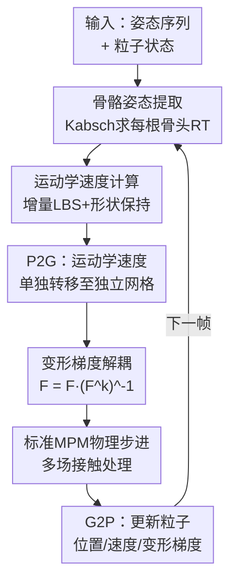

# PIAvatar: Physically Interactive Avatars via Deformation Gradient Decoupling

**会议**: ECCV 2026  
**arXiv**: [2606.21162](https://arxiv.org/abs/2606.21162)  
**代码**: 无  
**领域**: 人体理解  
**关键词**: 物理仿真, 3D人体化身, 变形梯度解耦, MPM, 骨骼姿态估计

## 一句话总结
PIAvatar 提出基于 MPM 的物理可交互 3D 人体化身框架，通过将用户定义的 kinematic velocity 从变形梯度更新中显式解耦，消除运动驱动时产生的非预期内部应力，并嵌入骨骼结构以闭式优化实现形变后姿态的实时追踪，首次在统一 MPM 仿真框架内同时支持人-人、人-物的双向物理交互与非刚性表面形变。

## 研究背景与动机
3D 人体化身的生成技术近年来取得了显著进展，从隐式表示、3D Gaussian Splatting 到参数化身体模型（SMPL/SMPL-X），在视觉保真度上已达到令人印象深刻的水平。然而，这些模型的共同致命局限在于：它们只建模了几何与外观，不包含任何物理属性。结果是化身只能做 kinematic 动画——按照预设姿态序列"播放"运动，无法对碰撞、推力、重力等外部力产生物理响应，不能与其他化身或环境物体发生真实的双向物理交互。一个踢球的化身无法真正"踢"到球，一个被推的化身不会踉跄后退。

近年来，研究者开始尝试将物理特性注入化身。RL-based 方法（如 CLOSD、InterMimic）让化身学习与物体交互的策略，但受限于大规模并行训练对简化物理环境（MuJoCo、Bullet、PhysX）的依赖，化身被退化为圆柱等几何基元，无法表现肌肉、皮肤、软组织等非刚性形变。仿真驱动的方法向物理真实性迈出了有希望的步伐，但各自存在关键缺口：Half-Physics 将 kinematic 人体模型与物理引擎耦合，允许外力改变化身姿态，但响应仅停留在姿态层面，表面不发生形变；PhysAvatar（C-IPC-based）和 MPMAvatar 侧重衣物仿真，支持化身施力于物体，但反向交互（物体施力于化身并使其形变）薄弱或缺失。

核心矛盾在于 MPM 框架的工作机制：用户通过设置粒子速度来驱动化身运动，这个速度在 P2G（粒子到网格）阶段被插值为网格动量，在 G2P（网格到粒子）阶段用于更新变形梯度 $\boldsymbol{F}_p$，而 $\boldsymbol{F}_p$ 的变化根据本构模型必然产生 Cauchy 应力 $\boldsymbol{\sigma}_p$。这个应力在下一帧作为内力反馈回网格，部分抵消掉运动速度，导致化身无法精确到达目标姿态。简而言之，在标准 MPM 中，"运动驱动"和"物理仿真"共享同一个变形梯度通道，运动学速度不可避免地"污染"应力计算——这是本文要解决的根本矛盾。此外，一旦化身在物理交互中发生非刚性形变，其姿态就不再可被直接追踪，通常需要昂贵的参数化模型拟合或非线性优化来恢复。

本文的核心 idea 是：将用户施加的 kinematic velocity 从变形梯度中显式"除"掉，使运动驱动不再产生内部应力，同时完整保留由外部接触力产生的应力，从而在同一 MPM 框架内同时实现精准的姿态跟随和真实的物理交互。

## 方法详解

### 整体框架
PIAvatar 要解决的核心问题是：如何在基于应力本构模型的 MPM 物理仿真框架中，让化身既能精确跟随用户指定的姿态序列（如 AMASS 中的踢腿、跳跃动作），又能与环境和他人发生自然的双向物理交互（碰撞、形变、动量传递）。整体思路是"两条腿走路"——前向路径通过变形梯度解耦消除运动驱动引入的寄生应力，反馈路径通过嵌入式骨骼保证形变后的实际姿态仍可被实时追踪并用于下一帧的运动速度计算。

整个框架的输入是用户指定的姿态序列（来自 AMASS 等数据集）加上化身粒子表示（Animatable Gaussians 或 SMPL-X mesh 采样为粒子），输出是每帧经过物理仿真后的粒子状态（位置、速度、变形梯度），可直接用于渲染。每帧的处理流程为：骨骼姿态提取 -> 运动学速度计算 -> P2G 转移运动学速度 -> 变形梯度解耦 -> 标准 MPM 物理步进（含多场接触处理）-> G2P 更新粒子状态。

### 关键设计

**1. 变形梯度解耦：消除运动驱动产生的寄生应力**

这是 PIAvatar 最核心的设计。在标准 MPM 中，P2G 和 G2P 构成一个闭环：用户设置粒子速度 $\boldsymbol{v}_p$ -> P2G 插值到网格 -> G2P 更新变形梯度 $\boldsymbol{F}_p \leftarrow (\mathbf{I} + \Delta t \nabla \boldsymbol{v}_p) \boldsymbol{F}_p$ -> 根据本构模型产生应力 $\boldsymbol{\sigma}_p = \frac{1}{J_p} \boldsymbol{F}_p \frac{\partial \Psi(\boldsymbol{F}_p)}{\partial \boldsymbol{F}_p}^\top$ -> 下一帧 P2G 中应力作为内力 $\boldsymbol{f}_i^{\text{int}} = -\sum_p V_p \boldsymbol{\sigma}_p \nabla w_{ip}$ 抵消运动速度。对于非刚性人体运动，用户定义的 kinematic velocity 被部分吸收为 $\boldsymbol{F}_p$ 的累积，产生非预期的应力，阻碍化身准确到达目标姿态。图 3 直观展示了这一恶性循环：运动学速度 -> 变形梯度变化（蓝色和红色椭圆变形）-> 应力生成 -> 阻碍运动。

PIAvatar 的解法是将粒子速度分解为运动学速度 $\boldsymbol{v}_p^k$ 和物理速度。具体而言，单独将 $\boldsymbol{v}_p^k$ 经 P2G 转移到一个独立的运动学网格，计算其对应的运动学速度梯度 $\nabla \boldsymbol{v}_p^k$ 和运动学变形梯度 $\boldsymbol{F}_p^k$：

$$m_i^k = \sum_p w_{ip} m_p^k, \quad m_i^k \boldsymbol{v}_i^k = \sum_p w_{ip} m_p^k \boldsymbol{v}_p^k$$
$$\nabla \boldsymbol{v}_p^k = \sum_i \boldsymbol{v}_i^k (\nabla w_{ip})^\top, \quad \boldsymbol{F}_p^k \leftarrow (\mathbf{I} + \Delta t \nabla \boldsymbol{v}_p^k) \boldsymbol{F}_p^k$$

然后从总变形梯度中将运动学分量剔除——这是一个一阶近似操作：

$$\boldsymbol{F}_p \leftarrow \boldsymbol{F}_p (\boldsymbol{F}_p^k)^{-1}$$

剔除后，$\boldsymbol{F}_p$ 中仅保留由外部接触力产生的形变，因此由本构模型算出的应力只反映真实的物理交互，不会再阻碍运动驱动。这一设计与雪仿真中的弹性-塑性分解（Stomakhin et al. 2013）和薄壳刚度校正（Guo et al. 2018）在思路上同源——都是对 $\boldsymbol{F}_p$ 做乘法分解——但应用场景完全不同：前人分解的是材料本构的弹/塑性分量，本文分解的是运动驱动与物理响应两个速度来源。

补充材料 Fig. 11 用三组对照直观验证了这一设计的必要性和效果：(a) 标准 MPM：应力阻止化身到达目标姿态，几乎看不到姿态形变；(b) 完全去掉所有应力：化身能部分跟随运动但完全失去接触响应，会和物体融合穿透；(c) PIAvatar 仅剔除 kinematic 应力：化身既精确跟随运动，又能推开物体并展示自然的碰撞形变。

**2. 基于骨骼的姿态回归：形变后姿态的实时闭式追踪**

物理交互必然导致化身的非刚性形变——被球撞击后身体凹陷、被另一化身推挤后姿态改变。这带来一个棘手问题：形变后化身的实际姿态不再是输入姿态序列中的预设值，如何知道它现在"是什么姿势"？这在标准 MPM 中是 ill-posed 的逆问题，通常需要昂贵的 SMPL 参数拟合（如 SMPLify）或学习式回归（如 HMR、VIBE）。

PIAvatar 的解法非常直接且高效：在化身表面内部嵌入一组骨骼粒子（使用 OSSO 骨骼模型，原始 74,496 粒子经 10 倍体素降采样至约 7,450 粒子以降低 Kabsch 计算开销）。每个关节对应一组骨粒子——当外力作用于化身表面时，力通过粒子-网格耦合传递到骨粒子，使其位置发生相应变化。此时对每组骨粒子运行 Kabsch 算法，求解从规范姿态骨粒子位置 $\boldsymbol{x}_{\text{bone}}^{\text{cano}}$ 到仿真中当前位置 $\boldsymbol{x}_{\text{bone}}^t$ 的最优刚性变换 $[\mathbf{R}_{\text{bone}}^t, \mathbf{t}_{\text{bone}}^t]$：

$$\mathbf{T}_{\text{bone}}^t = [\mathbf{R}_{\text{bone}}^t, \mathbf{t}_{\text{bone}}^t] = K(\boldsymbol{x}_{\text{bone}}^{\text{cano}}, \boldsymbol{x}_{\text{bone}}^t)$$

Kabsch 算法是一个闭式最小二乘解：中心化两组点 -> 计算互相关矩阵 $\mathbf{C} = \mathbf{Q}_{\text{center}}^\top \mathbf{P}_{\text{center}}$ -> SVD 分解 -> $\mathbf{R} = \mathbf{U} \mathbf{V}^\top$（含反射修正：若 $\det(\mathbf{R}) < 0$，翻转最后一列 $\mathbf{U}$ 的符号）-> $\mathbf{t} = \mathbf{Q}_{\text{mean}} - \mathbf{R} \mathbf{P}_{\text{mean}}$。整个过程无需迭代，是确定性的闭式解。

得到当前实际姿态后，用增量式 LBS 计算运动学速度：从输入姿态序列中取相邻帧的增量变换 $\hat{\mathbf{T}}^{t \to t+1} = (\hat{\mathbf{T}}^t)^{-1} \hat{\mathbf{T}}^{t+1}$，将其作用于当前实际姿态得到目标姿态 $\mathbf{T}_{\text{bone}}^{t+1} = \hat{\mathbf{T}}^{t \to t+1} \mathbf{T}_{\text{bone}}^t$，再通过 LBS 计算两组粒子位置 $\boldsymbol{x}^t = \text{LBS}(\mathbf{T}_{\text{bone}}^t, \boldsymbol{x}^{\text{cano}})$ 和 $\boldsymbol{x}^{t+1} = \text{LBS}(\mathbf{T}_{\text{bone}}^{t+1}, \boldsymbol{x}^{\text{cano}})$，位移差除以时间步长即得运动学速度 $\boldsymbol{v}_p^k = (\boldsymbol{x}^{t+1} - \boldsymbol{x}^t) / \Delta t$。

增量式设计的精妙之处在于：即使外力已经将化身推离了输入姿态序列中的绝对姿态，下一帧的运动速度增量仍然平滑合理——它只编码"从当前位置到下一个相对姿态"的位移，而非从输入序列的绝对位置跳变。同时，骨骼层级结构保证了相邻关节之间的平滑运动传播和姿态一致性。

**3. 形状保持项：防止碰撞后的永久形变**

在 MPM 仿真中，强碰撞可能使化身表面粒子偏移至远离 LBS 参考表面的位置，碰撞结束后这些粒子可能无法自行恢复，留下永久凹陷或变形（补充材料 Fig. 12a）。为解决这一问题，PIAvatar 在运动学速度计算中追加了一个形状保持项，灵感来自 meshless shape matching：

$$v_p^k = \underbrace{\frac{x_p^{\text{LBS},t+1} - x_p^{\text{LBS},t}}{\Delta t}}_{\text{kinematic LBS 驱动}} + \underbrace{\alpha \frac{x_p^{\text{LBS},t+1} - x_p^{\text{sim},t}}{\Delta t}}_{\text{形状保持}}, \quad \alpha \in [0, 1]$$

第一项是标准的 LBS 驱动速度，将粒子从当前 LBS 位置推向下一帧 LBS 位置。第二项是形状保持速度：当粒子因碰撞偏离 LBS 参考表面后（$x_p^{\text{sim},t} \neq x_p^{\text{LBS},t+1}$），它会产生一个将粒子拉回目标形状的速度分量，强度由 $\alpha$ 控制。这是纯粹的"软约束"——不是硬性重置粒子位置（那样会破坏物理一致性），而是叠加一个校正速度分量，让形状恢复与物理仿真在同一框架内自然共存。作者的实验表明，加上该顶后化身在受球撞击后能恢复原有身体轮廓（Fig. 12c），而不加则留下永久凹陷（Fig. 12a）。

**4. 多场接触处理：解决多体交互中的粘连与自穿透**

标准 MPM 的一个已知局限是：当多个物体（或同一物体的不同身体部位）的粒子对同一网格节点贡献质量和动量时，它们会被合并为一个平均速度场。这导致两个严重问题：(a) 物体接触后网格不再区分哪个动量属于哪个物体，计算出的平均速度将它们"困"在一起，造成粘连——脚踢球后球粘在脚上不飞走（Fig. 12b）；(b) 同一化身的两个身体部位（如双腿）一旦接触，粒子动量被混合，两个部位融合为一团（Fig. 13a），失去各自的独立形状。

PIAvatar 采用 Bardenhagen et al. 的多场接触方案来解决这一问题。核心思想是：在每个网格节点上，为不同物体维护独立的质量和动量场 $\{m_k, \mathbf{p}_k\}$，各自计算独立的速度 $\mathbf{v}_k = \mathbf{p}_k / m_k$。对于多物体共享的节点，先计算质心速度 $\mathbf{v}_{\text{cm}} = \frac{\sum_k m_k \mathbf{v}_k}{\sum_k m_k}$，然后估计各物体的外法向 $\mathbf{n}_k \propto -\nabla m_k$（质量梯度方向），并施加一个无张力接触投影：

$$\tilde{\mathbf{v}}_k = \mathbf{v}_k - \max((\mathbf{v}_k - \mathbf{v}_{\text{cm}}) \cdot \mathbf{n}_k, 0) \mathbf{n}_k$$

这个投影是关键：它仅移除速度中驱动物体相互穿透的法向分量（$(\mathbf{v}_k - \mathbf{v}_{\text{cm}}) \cdot \mathbf{n}_k > 0$ 表示物体正朝对方运动），完整保留切向滑移和分离运动。结果是，正在靠近的物体不会被穿透，正在分离的物体不会被"拉住"——接触力学在物理上是正确的。对于只有一个物体的节点，速度完全不修改，非接触区域的动力学与标准 MPM 一致。

Fig. 12(c) 和 Fig. 13(b) 分别验证了多场接触对粘连和自穿透的消除效果：加入多场接触后，球正常脱离腹部，双腿接触后保持独立形状。

### 一个完整示例

以"化身踢足球"这一经典交互场景为例，完整走一遍 PIAvatar 的一帧仿真流程。假设当前为第 t 帧，输入姿态序列要求化身从站立姿态执行一个右脚前踢动作，前方地面放置一个质量为 0.5 kg 的足球。

**骨骼姿态提取**：化身表面的 OSSO 骨骼粒子随上一帧的物理仿真已处于某个当前位置。对每根骨头（根骨、脊柱、左右大小腿等），取其规范位置点集和当前位置点集，运行 Kabsch 算法——中心化两组点，SVD 分解互相关矩阵，取 $\mathbf{R} = \mathbf{U} \mathbf{V}^\top$，求 $\mathbf{t}$——得到当前帧每根骨头的旋转 $\mathbf{R}_{\text{bone}}^t$ 和平移 $\mathbf{t}_{\text{bone}}^t$。这一步是闭式求解，每根骨头仅需一次 SVD，整副骨骼（约 55 个关节）的 Kabsch 总开销约 0.008 ms（SMPL-X 单化身）。

**运动学速度计算**：从姿态序列中取第 t 和 t+1 帧的变换矩阵 $\hat{\mathbf{T}}^t$ 和 $\hat{\mathbf{T}}^{t+1}$，计算增量 $\hat{\mathbf{T}}^{t \to t+1}$。将其作用于当前实际姿态 $\mathbf{T}_{\text{bone}}^t$ 得到下一帧目标姿态 $\mathbf{T}_{\text{bone}}^{t+1}$。通过 LBS 分别计算 $\boldsymbol{x}^t$ 和 $\boldsymbol{x}^{t+1}$（基于 SMPL-X 的标准蒙皮权重），位移差除以 $\Delta t$ 得到各粒子的 kinematic velocity $\boldsymbol{v}_p^k$。此刻，右脚区域的粒子获得了向足球方向的高速运动学速度（比如 ~3 m/s），同时形状保持项以 $\alpha=0.3$ 的强度叠加，确保粒子在碰撞后能回到 LBS 参考面。

**变形梯度解耦**：$\boldsymbol{v}_p^k$ 单独经 P2G 转移到独立运动学网格（分辨率 $200^3$），计算 $\nabla \boldsymbol{v}_p^k$ 和 $\boldsymbol{F}_p^k$，然后执行核心解耦操作 $\boldsymbol{F}_p \leftarrow \boldsymbol{F}_p (\boldsymbol{F}_p^k)^{-1}$。此时 $\boldsymbol{F}_p$ 中由右脚前踢产生的运动学分量为单位矩阵（已被除净），仅保留由之前帧累积的接触形变（如双脚站立时与地面的轻微压缩）。

**物理交互与多场接触**：在标准 MPM 的 P2G 阶段，化身粒子和足球粒子的质量/动量分别被转移到共享网格。由于多场接触处理，网格节点维护化身和足球的独立质量/动量，计算各自的独立速度。在脚部与足球的接触节点上，两个物体的速度差通过接触投影处理：当脚向足球运动时，法向分量被移除以防止穿透，足球获得向前的动量传递。脚部区域感受到等大反向的反作用力。单物体节点保持标准 MPM 行为不变。

**G2P 更新**：网格速度回传到各物体的粒子，更新位置（$\boldsymbol{x}_p \leftarrow \boldsymbol{x}_p + \Delta t \boldsymbol{v}_p$）和变形梯度（$\boldsymbol{F}_p \leftarrow (\mathbf{I} + \Delta t \nabla \boldsymbol{v}_p) \boldsymbol{F}_p$）。此刻 $\boldsymbol{F}_p$ 仅包含两个来源的形变：外部接触（脚-球碰撞导致脚面轻微凹陷、球被压缩）和重力/地面支撑。应力完全来自这些真实的物理交互。最终结果：化身右脚精确到达输入序列指定的前踢位置，足球获得动量向前飞出，脚-球干净分离无粘连。

改变足球质量参数（0.5 kg -> 8 kg 保龄球），同一套踢腿动作序列产生截然不同的结果：保龄球几乎不动，化身反而被反作用力推开偏离目标姿态——交互行为完全由物理参数决定，而非预设运动。

### 损失函数 / 训练策略

PIAvatar 是纯仿真方法，不涉及神经网络训练，因此没有传统意义上的损失函数。仿真运行在每帧 100 个 MPM 子步的粒度上，背景网格分辨率 $200^3$（约 8M 个网格节点），时间步长 $\Delta t$ 由 CFL 条件自动确定。运动学速度计算和 Kabsch 算法每帧执行一次（而非每个子步），总开销除以 100 均摊到每个子步，P2G/G2P 在每个子步内执行。

形状保持项中的 $\alpha$ 和材料参数（杨氏模量 $E = 10^2 \sim 10^5$ Pa，Neo-Hookean 用于身体、Corotated 用于衣物/头发）是手动设定的工程参数，通过数值稳定性实验校准。补充材料（Sec. 5.4）展示了用 VLM（Qwen2.5-VL）+ Bayesian Optimization 自动搜索物理参数（球密度、腹部刚度）的初步尝试——以 VLM 对渲染视频判断"重 vs 轻"或"硬 vs 软"的 log-probability 差值作为 BO 的 reward，收敛结果与人类感知（MTurk 50 人用户调研）一致——但目前这仍是探索性实验，不是核心方法。

## 实验关键数据

### 主实验

PIAvatar 与标准 MPM baseline 在姿态跟随精度上的定量对比。实验覆盖两种化身表示：Animatable Gaussians（AG，7 个 ActorsHQ 角色，平均 300k 粒子）和 SMPL-X（参数化 mesh，10,475 粒子），在 100/200/300/400 仿真步后分别测量粒子位置与目标姿态的 MSE（mm）、RMSE（mm）和 Acc@0.01（位置误差 < 0.01m 的粒子比例）。

| 方法 | 指标 | AG 100步 | AG 200步 | AG 300步 | AG 400步 | SMPL-X 100步 | SMPL-X 200步 | SMPL-X 300步 | SMPL-X 400步 |
|------|------|----------|----------|----------|----------|-------------|-------------|-------------|-------------|
| MPM Baseline | MSE↓ | 0.079 | 0.198 | 0.275 | 0.332 | 0.089 | 0.138 | 0.206 | 0.248 |
| MPM Baseline | Acc@0.01↑ | 0.097 | 0.041 | 0.020 | 0.020 | 0.358 | 0.181 | 0.086 | 0.036 |
| **PIAvatar** | MSE↓ | **0.019** | **0.027** | **0.036** | **0.046** | **0.013** | **0.022** | **0.031** | **0.039** |
| **PIAvatar** | Acc@0.01↑ | **0.844** | **0.719** | **0.606** | **0.534** | **0.908** | **0.823** | **0.670** | **0.583** |

核心发现：PIAvatar 在所有步数、所有表示下全面碾压 baseline。AG 在 400 步时 MSE 从 0.332 降至 0.046（降低 86%），Acc@0.01 从 0.020 提升至 0.534（提升超 26 倍）。关键在于 baseline 误差随时间持续累积（MSE 100->400 步增长 4.2 倍），而 PIAvatar 增长平缓（仅增长 2.4 倍），证明变形梯度解耦有效阻断了应力累积-运动偏离的正反馈循环。

### 消融与分析

由于 PIAvatar 是仿真系统而非学习模型（没有可拆卸的神经网络模块），消融通过补充材料的定性对比（Fig. 11-13）和组件贡献进行。下表综合了各消融配置的表现。

| 配置 | 姿态跟随 | 物理交互质量 | 关键观察 |
|------|---------|-------------|---------|
| 标准 MPM（无解耦） | 差，无法到达目标 | 有接触力但效果弱 | 运动学速度产生应力，化身几乎不动（Fig. 11a） |
| 完全去应力（$\boldsymbol{\sigma}=0$） | 中，部分跟随 | 无，穿模融合 | 化身与物体合并穿透，失去所有物理响应（Fig. 11b） |
| 解耦但无形状保持 | 好 | 好但留凹痕 | 强碰撞后表面无法恢复（Fig. 12a） |
| 解耦但无多场接触 | 好 | 差，粘连+自穿透 | 球粘在腹部不脱落（Fig. 12b），双腿融合（Fig. 13a） |
| **PIAvatar 完整** | **好，精确跟随** | **好，自然分离** | 姿态精准 + 碰撞正常 + 形状恢复（Fig. 11c, 12c, 13b） |

骨骼姿态追踪精度（Table 2）验证了 Kabsch 组件的有效性：SMPL-X 化身在 400 步仿真后根旋转误差仅 0.121 度、相对旋转误差 0.320 度、距离误差 3.2 mm。AG 化身因粒子数多（300k vs 10k），误差略大（相对旋转约 0.6 度，距离误差约 5.5 mm），但仍保持在很低的水平——这验证了闭式 Kabsch 骨骼追踪在长时间仿真中的稳定性。

运行时分析（Table 3）：单 SMPL-X 化身每子步总时间 0.492 ms（baseline MPM 为 0.170 ms），额外开销主要来自独立运动学网格的初始化和 Kabsch 计算。四个 AG 化身场景总时间 15.259 ms/子步——每帧 100 子步意味着约 1.5 秒/帧，仍有优化空间。额外内存开销约 122 MB/化身（一个额外的 $200^3$ 运动学网格），相比 baseline MPM 的 3.8 GB（SMPL-X）或 5.4 GB（AG）完全可以接受。

### 关键发现
- **变形梯度解耦是绝对核心**：去掉它回到标准 MPM，Acc@0.01 从 0.844（AG 100 步）暴跌至 0.097。寄生应力是 MPM 化身驱动的头号障碍，解耦是唯一能同时保留姿态精度和物理交互的方案。
- **形状保持和多场接触是"工程必需"而非"锦上添花"**：没有形状保持，化身碰撞后"毁容"；没有多场接触，交互对象"粘在一起"。这两项决定了系统的实用天花板。
- **交互由物理参数决定，非预设运动**：同一踢腿动作分别作用于 0.5 kg 足球和 8 kg 保龄球，结果质的不同——轻球飞远化身不动，重球不动化身被推开。这证明 PIAvatar 做到了真正的物理交互而非视觉特效。
- **异构材质是框架的自然能力**：给身体（$E=10^5$）、头发（$E=10^2$）和衣物（$E=10^3$）分配不同刚度，掉落物体碰到不同部位时呈现出明显不同的碰撞响应——无需任何额外建模，完全由 MPM 本构模型驱动。
- **软组织形变是涌现行为**：腹部抖动（belly jiggling）在跳跃-落地过程中自然出现，不需要显式的软组织模型——仅对腹部区域稍微衰减运动学速度，让接触应力驱动粒子间交互即可（Fig. 6）。

## 亮点与洞察
- **变形梯度解耦的思路极其干净**：问题出在 $\boldsymbol{F}_p$ 把所有速度来源混为一谈，解法就一行核心公式 $\boldsymbol{F}_p \leftarrow \boldsymbol{F}_p (\boldsymbol{F}_p^k)^{-1}$——把运动学分量的贡献"除"出去。这种"分离来源、分别处理"的思想可迁移到任何需要同时做主动控制和被动仿真的粒子/网格混合系统中。
- **骨骼嵌入 + Kabsch 是 elegant 的工程选择**：相比学习式姿态回归（需要训练数据、有泛化风险）或 SMPL 拟合（迭代优化、计算昂贵），闭式 Kabsch 算法零训练、确定性、单次 SVD 即得解，每帧开销仅 0.008 ms。将复杂的三维形变姿态追踪问题退化到骨骼级刚体配准，是用正确粒度的抽象解决了正确的问题。
- **增量式姿态更新的稳定性智慧**：不直接从输入姿态序列的绝对位置计算绝对速度（那会在外力推开化身后产生巨大的"跳回"速度），而是用 $\hat{\mathbf{T}}^{t \to t+1} = (\hat{\mathbf{T}}^t)^{-1} \hat{\mathbf{T}}^{t+1}$ 算相对增量，再作用于当前实际姿态。这是一个看似微小但至关重要的设计——它从根本上保证了运动学速度在任何扰动下都保持平滑。
- **MPM 框架本身的优雅被完整保留**：双向动量传递不需要显式的碰撞检测或接触力建模——化身和物体的粒子自动贡献到同一网格节点，动量在网格层面自动守恒交换。PIAvatar 的解耦设计没有破坏这一核心优势，反而让它首次在化身驱动场景中发挥作用。

## 局限与展望
- **场景设置依赖人工**：创建物理交互场景时需要手动摆放化身位置和选择姿态序列，没有自动化的场景理解或任务规划。AMASS 数据集中缺乏外力（如重力、推力）下的力矩控制标注，且当前仿真未实现摩擦力，导致化身在受外力后难以维持站立等稳定姿态。作者建议未来通过 PID 控制或 RL 补充力矩控制，并通过接入 Genesis 等大规模物理引擎引入摩擦和更丰富的物体属性。
- **极快速碰撞仍有粘连风险**：当两个物体以极高速度碰撞时，应力可能来不及在几个 MPM 子步内充分建立，导致瞬时的穿透或粘连。这暗示可能需要基于学习的方法来理解场景配置和物体级别特征，作为纯仿真方法的补充。
- **无自主平衡控制**：当前化身只执行输入姿态序列，不具备维持平衡的主动控制能力。被推后会倒下而非自动恢复——这在人-人交互场景中不够真实。加入基于物理的平衡控制器（如倒立摆模型 + 力矩补偿）是可预见的改进方向。
- **物理参数手动调校**：材料参数（$E$、密度、$\alpha$）依赖人工设定和反复试错。补充材料中 VLM + BO 自动搜索的初步结果（Tab. 4-5，用户调研验证）展示了自动化潜力，但目前在搜索效率和精度上距实用仍有距离。
- **布料仿真需耦合外部求解器**：松垮衣物（如裙子）的次级动态（摆动、滞后、惯性飘动）无法从体 MPM 框架自然涌现，需要通过 thin-shell cloth solver（来自 MPMAvatar）单独处理。这增加了系统复杂度，且体-壳耦合可能存在数值稳定性问题。

## 相关工作与启发
- **vs Half-Physics**: Half-Physics 将 kinematic 人体模型与物理引擎耦合，允许外力改变化身姿态，但响应只发生在姿态层面（关节角度），表面不发生形变。PIAvatar 直接在 MPM 粒子框架内解耦，同时实现姿态级响应和表面级非刚性形变，物理一致性更强。Half-Physics 的姿态追踪误差在厘米级，PIAvatar 的 Kabsch 方案在毫米级。
- **vs PhysAvatar / MPMAvatar**: PhysAvatar（C-IPC 框架）和 MPMAvatar（MPM 框架）均以衣物形变仿真为核心卖点。它们支持化身施力于衣物/物体，但反向交互（物体推动化身并使其形变）薄弱或缺失。PIAvatar 以双向交互和非刚性化身形变为第一性目标，衣物/软组织形变是框架的自然副产物而非独立模块。
- **vs RL-based 物理化身（CLOSD / InterMimic / DeepMimic）**: RL 方法的核心优势在于可以学习复杂的任务导向交互策略（如拳击、搬运），但代价是简化物理表示（刚体、基元、关节力矩驱动）。PIAvatar 是纯仿真方法，零训练，连续体物理一致性由 MPM 框架数学保证。二者的互补结合——RL 学高层交互策略 + PIAvatar 做底层连续体仿真——将是物理化身领域的重要方向。
- **与更广的 MPM 研究的关系**: 变形梯度乘法分解并非全新概念（雪仿真的弹塑性分解、薄壳刚度校正），但 PIAvatar 首次将其用于解耦运动驱动与物理响应这两个速度来源——这是一个新的应用维度和问题背景。骨骼嵌入 + Kabsch 闭式追踪的设计可推广到其他需要实时姿态估计的粒子仿真系统。

## 评分
- 新颖性: ⭐⭐⭐⭐ 变形梯度解耦应用于化身驱动是新的切入点，骨骼嵌入+闭式 Kabsch 姿态追踪的组合设计干净有效，首次在统一 MPM 框架内同时实现双向交互和非刚性形变
- 实验充分度: ⭐⭐⭐⭐ 定量对比（baseline MPM 姿态跟随精度）、姿态追踪精度验证、运行时分析完备；定性展示覆盖人-物交互、人-人交互、非刚性形变、软组织、异构材质、多物体交互、松垮衣物等多个维度
- 写作质量: ⭐⭐⭐⭐ 问题阐述清晰（Fig. 3 和 Fig. 11 直观说明寄生应力问题），方法逻辑链完整（问题 -> 解耦 -> 骨骼追踪 -> 工程完善），补充材料对实现细节（Kabsch 伪代码、速度计算伪代码、接触处理）交代充分
- 价值: ⭐⭐⭐⭐ 解决了 3D 化身领域"有视觉无物理"的结构性缺口，对 AR/VR 中的物理化身交互、游戏物理仿真、数字人仿真等应用方向有直接推动，且方法零训练、可实时，工程落地门槛低

<!-- RELATED:START -->

## 相关论文

- [\[ICCV 2025\] NGD: Neural Gradient Based Deformation for Monocular Garment Reconstruction](../../ICCV2025/human_understanding/ngd_neural_gradient_based_deformation_for_monocular_garment_reconstruction.md)
- [\[CVPR 2026\] DecoVLN: Decoupling Observation, Reasoning, and Correction for Vision-and-Language Navigation](../../CVPR2026/human_understanding/decovln_decoupling_observation_reasoning_and_correction_for_vision-and-language_.md)
- [\[ICLR 2026\] KinemaDiff: Towards Diffusion for Coherent and Physically Plausible Human Motion Prediction](../../ICLR2026/human_understanding/kinemadiff_towards_diffusion_for_coherent_and_physically_plausible_human_motion_.md)
- [\[CVPR 2026\] Miburi: Towards Expressive Interactive Gesture Synthesis](../../CVPR2026/human_understanding/miburi_towards_expressive_interactive_gesture_synthesis.md)
- [\[CVPR 2026\] FlowPalm: Optical Flow Driven Non-Rigid Deformation for Geometrically Diverse Palmprint Generation](../../CVPR2026/human_understanding/flowpalm_optical_flow_driven_non-rigid_deformation_for_geometrically_diverse_pal.md)

<!-- RELATED:END -->
