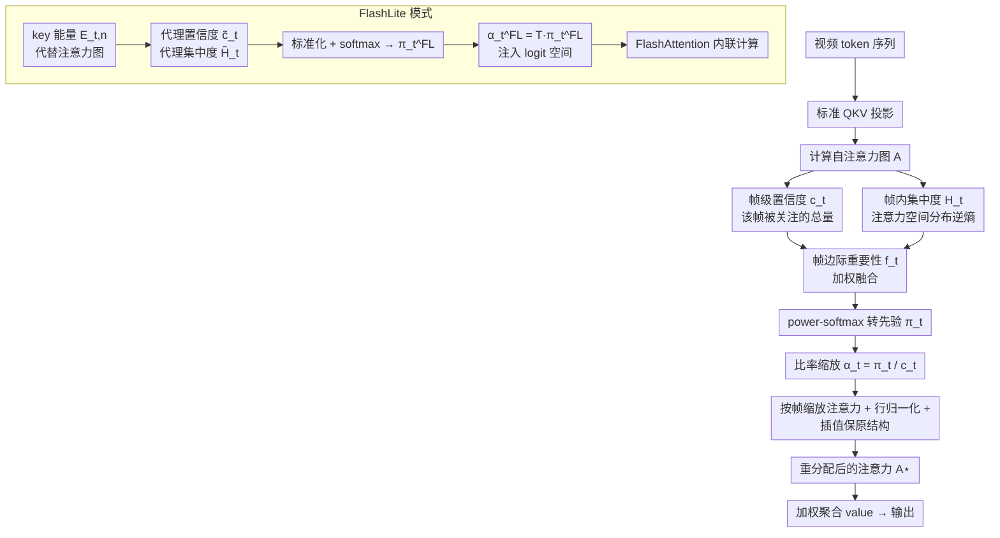

# Reweighting Framewise Attention in Video Transformers for Facial Expression Understanding

**会议**: ECCV 2026  
**arXiv**: [2606.30611](https://arxiv.org/abs/2606.30611)  
**代码**: [https://github.com/ysrinria/MiRA](https://github.com/ysrinria/MiRA)  
**领域**: human_understanding  
**关键词**: 面部表情识别, 注意力重加权, 视频Transformer, 帧边缘注意力, 面部动态建模

## 一句话总结

MiRA 提出一种零额外参数的即插即用帧边缘注意力重分配模块，通过帧级置信度和帧内集中度两种互补统计量重新分配 ViT 自注意力，使模型在不依赖人脸对齐的前提下更精准地聚焦细微面部动态变化，在 DFEW、MAFW、FERV39k 等基准上取得 video-only 方法的 SOTA，其 FlashLite 近似还可兼容 FlashAttention 实现在线高效重分配。

## 研究背景与动机

视频中的面部表情识别是一个极富挑战的任务。真实场景下，细微的面部动态信号——短暂的皱眉、嘴角的微动、眼周的瞬时皱纹——是判断情绪状态的关键线索，但它们在时空维度上都极其微弱且局域化。与此同时，无约束视频中普遍存在大幅度的头部转动、身体晃动以及相机抖动等全局运动，这些运动在能量上远强于微妙的面部变化。当前的视频 ViT 模型（如 VideoMAE、VideoMAEv2）通过大规模自监督掩码重建学习丰富的时空表征，在通用视频理解上表现优异。然而，这类模型的自注意力机制天然倾向于捕获场景级的主导运动模式——因为在掩码重建损失下，重建大幅运动区域的像素能更有效地降低误差，而细微面部变化提供的重建信号太弱。这使得当面部动态与全局运动共存时，前者被自注意力当作冗余信息过滤掉，导致模型对细粒度表情变化不够敏感。

现有专门针对面部表情识别的视频方法主要从两个角度切入。一部分工作设计专门的时空注意力或关键点引导网络来显式建模面部结构；另一部分工作延续自监督 MAE 范式，通过对比学习或多模态融合（引入音频或文本线索）来增强表达。但这些方法普遍依赖 tight face alignment（紧密人脸对齐）作为预处理，即把面部区域从全帧中裁剪并对齐到标准位置。这种启发式在控制实验和固定数据集上效果不错，但放到大规模无约束预训练场景下并不可行——人脸检测器会失准、对齐会变形、且无法覆盖多样化的拍摄条件。更根本的问题在于，即使做了人脸对齐，如果自注意力机制本身不改变，模型仍然会被残存的背景变化或头部姿态变动所主导。

本文的切入角度与上述所有方法都不同：不修改模型架构，不引入额外参数，也不依赖人脸对齐——而是直接从 ViT 自注意力图内部的统计信息出发。论文注意到，每一帧在自注意力图中留下两种互补的"脚印"：一是该帧被所有查询关注的总量（帧级置信度），指示该帧在全局时序中的显著性；二是注意力在该帧内部各空间 token 上的分布是否集中（帧内集中度），指示模型是在关注该帧的广泛区域还是某个局部细节。本文的核心 idea 是**将这两个统计量联合起来估计每帧的边际重要性，然后用比率式对齐重新分配各帧的注意力权重——让富含细微面部动态的关键帧获得更多关注，同时抑制被全局运动主导的冗余帧，全程不改变模型参数。**

## 方法详解

### 整体框架

MiRA 是一个插入 ViT 每层自注意力模块之后的轻量重分配层，不引入可训练参数，对模型结构完全透明。整体流程为：每一层先按标准方式计算 query、key、value 和自注意力图 A，然后利用该注意力图提取两种帧级统计量，将它们加权融合为帧边际重要性分数，最后通过比率缩放修改各帧在注意力图中的权重并做行归一化。为兼顾效率，论文还设计了 FlashLite 模式——用 key 表示的能量代理替代完整的注意力图，并将帧级缩放注入到 pre-softmax logit 空间，从而兼容 FlashAttention 的流式计算模式。

### 关键设计

**1. 帧级互补统计量：置信度与集中度的双通道感知**

该设计的核心洞察是仅靠"哪帧被关注多"不足以识别细微动态——如果一帧虽然被大量关注但注意力区域极度发散（覆盖整张脸甚至背景），它提供的信息量反而不如一帧虽然关注总量中等但注意力高度集中在某个嘴角或眉梢。帧级置信度 $c_t$ 定义为头平均注意力矩阵 $\bar{A} \in \mathbb{R}^{L \times L}$ 中所有查询对帧 $t$ 内所有 key token 的关注总和，经帧间归一化后反映该帧的全局时序显著性。帧内集中度 $H_t$ 则基于帧内注意力分布 $p_{t,n}$ 的逆熵计算——当注意力极度集中在个别空间 token 上时熵值低、集中度高，反之注意力均匀发散时集中度低。两者按固定权重融合为帧边际重要性 $f_t = w_{\text{con}} c_t + w_{\text{ent}} H_t$，再经 per-frame min-max 归一化和 power-softmax 转为帧先验分布 $\pi_t$。高置信度配合高集中度的帧正是面部表情出现瞬间突变的典型特征。

**2. 比率式边际对齐：在保持查询-键结构前提下重分配帧权重**

直接将先验 $\pi_t$ 替换掉原始注意力会破坏查询条件内的注意力分布——$\pi_t$ 只描述了帧级边缘概率，丢失了"每个查询各自关注了哪些键"的细粒度信息。本文的解决方案是比率式缩放：$\alpha_t = \text{clip}(\pi_t / (c_t + \epsilon), \alpha_{\min}, \alpha_{\max})$。当某帧的当前置信度 $c_t$ 低于目标先验 $\pi_t$（该帧被关注得不够）时 $\alpha_t > 1$，反之则 $\alpha_t < 1$，从而在各帧内部 query-key 相对关系不变的前提下调整帧级注意力总量。缩放后的注意力经过均匀平滑（防止过尖或消失）和行归一化后，再与原始注意力做残差插值 $A^\star = (1-\eta)A + \eta A'$，确保不偏离原始注意力结构太远。这种方法本质上是边际对齐的一步 Sinkhorn 归一化——固定帧级目标边缘，让注意力分布围绕它微调。

**3. FlashLite 近似：用 key 能量代理将帧级重分配融入 FlashAttention**

Exact 模式需要在后 softmax 空间操作完整的 $L \times L$ 注意力图，这与 FlashAttention 的流式内核设计不兼容——FlashAttention 在计算过程中不实例化全图，从而将 I/O 复杂度从 $\mathcal{O}(L^2)$ 降到 $\mathcal{O}(L)$。FlashLite 的关键在于将帧级统计量的计算迁移到 key 表示空间：利用多层头平均的 key 能量 $E_{t,n} = \frac{1}{M}\sum_m \frac{1}{d_m} \|K_{m,i_{t,n}}\|_2^2$ 替代注意力图作为代理。直觉上，key 向量的 L2 范数越大，与 query 的内积就会越大，因此 key 能量可以近似反映该 token 在自注意力中的被关注度。基于此代理可以计算 $\tilde{c}_t$ 和 $\tilde{H}_t$ 来近似原始的置信度和集中度，再经标准化和温度控制的 softmax 得到帧先验 $\pi_t^{\mathrm{FL}}$。FlashLite 将帧级缩放因子 $\alpha_t^{\mathrm{FL}}$ 以 $\log \alpha_t$ 的形式直接注入到 pre-softmax logit 中，利用 $\alpha_t \exp(z_i) = \exp(z_i + \log \alpha_t)$ 这一等价关系——乘以帧权重等价于在 logit 中加偏置，完全在 FlashAttention 的流式计算框架内完成。实验表明 FlashLite 在识别准确率上与 exact 模式几乎一致（差距 <0.5%），但带来了 26% 的吞吐量提升（单卡 H100 上 400.6ms 降至 318.7ms），在 finetuning 阶段更是达到 4.1× 加速，使 ViT-L/H 的规模化训练成为可能。

### 损失函数 / 训练策略

MiRA 不引入额外的损失函数。模型遵循 VideoMAE 的标准两阶段管线：先在 VoxCeleb2（120 万条面部视频）上进行 200 轮掩码自监督预训练（masking ratio 0.9，tubelet size 2×16×16），然后在各自标数据集上进行 100 轮有监督 finetune。与标准 VideoMAE 的唯一区别是在每层自注意力块后插入了 MiRA 重分配层。预训练期间对置信度使用指数移动平均（EMA）来稳定 batch 间的波动；finetuning 阶段则用实例级统计量以获得更灵活的样本级适应。关键超参为 $w_{\text{con}}=w_{\text{ent}}=0.5$、$\beta=1.5$、$\tau=1.7$，对全部数据集和模型尺度统一固定。

## 实验关键数据

### 主实验

| 数据集 | 指标 | VideoMAE | MAE-DFER | MiRA ViT-B Exact | MiRA ViT-H FlashLite |
|--------|------|----------|----------|-----------------|---------------------|
| DFEW (5-fold) | UAR / WAR | 63.60 / 74.60 | 63.41 / 74.43 | 65.29 / 75.86 | 68.25 / 78.24 |
| MAFW (5-fold) | UAR / WAR | 40.87 / 53.51 | 41.62 / 54.31 | 45.24 / 58.69 | 48.22 / 61.45 |
| FERV39k | UAR / WAR | 43.33 / 52.39 | 43.12 / 52.07 | — | 45.12 / 55.64 |

MiRA 在 video-only 方法中全面最优，且不需要人脸对齐预处理。将 backbone 从 ViT-B 扩展到 ViT-L 和 ViT-H 后性能持续增长，ViT-H FlashLite 在 DFEW 上达到 UAR 68.25、WAR 78.24，甚至超越部分使用音频-视觉多模态预训练的方法（如 MMA-DFER、AVF-MAE++-L）。

### 消融实验

| 配置 | DFEW UAR | MAFW UAR | 说明 |
|------|---------|---------|------|
| Full model (κ=12) | 63.28 | 38.81 | 全部 12 层使用重分配，效果最优 |
| κ=2（仅顶层） | 62.81 | 36.74 | 仅顶层微调也有不错效果 |
| κ=6 / κ=10 | ~62.7 / 61.65 | ~36.5 / 36.62 | 中间深度反而不如顶层方案 |
| β=0.7（太均匀） | 54.03 | 37.97 | 先验过于平坦，性能大幅下降 |
| β=1.5（最佳） | 63.28 | 38.81 | power-softmax 锐度适中 |
| w_con:w_ent = 0.5:0.5 | 63.28 | 38.81 | 均衡权重最优 |
| Exact vs FlashLite (DFEW 5-fold) | 65.29 vs 65.11 | — | 两者准确率几乎一致 |

### 关键发现

- 全深度重分配（κ=12）效果最好，仅顶层重分配（κ=2）也可作为轻量方案。中间深度（κ=6, 10）表现不升反降，论文推测是在注意力层次结构中引入了不一致性——浅层和深层分别承担不同层次的特征加工，混合中间层时各层的边际信号互相干扰。
- 帧级置信度和帧内集中度缺一不可：仅偏重某一项时性能均有下滑，两者确实提供了正交的互补信号。
- FlashLite 精确近似 exact 模式的物理原因在于 key 能量代理与注意力边际之间存在自然的相关性（key 范数越大 → query-key 内积越大 → 注意力越高），且 $\log \alpha_t$ 的 pre-softmax 注入在数学上与 post-softmax 缩放等价。
- 在 SAMM、MMEW 微表情数据集上的 k-NN probing 显示，MiRA 冻结特征在 k=1/3/5 上都显著优于 VideoMAE 和其他 FER 专用方法，表明重分配后学到的特征对细微的时序动态变更敏感，即使在完全冻住 backbone 不微调的情况下也有体现。

## 亮点与洞察

- **零参数注意力操控**：MiRA 完全不引入可训练参数，只对注意力图统计量做 deterministic 重分配。这种"不学新东西、只重新排序现有信号"的思路在参数效率和泛化性上很巧妙，意味着它可以作为任何 ViT backbone 的零成本插件。
- **置信度+集中度的正交分解**：两个统计量一个捕获取向（哪帧重要），一个捕获精度（帧内聚焦程度），恰好形成"空间×时间"的双维度筛选。这种 orthogonal decomposition 思路可以迁移到其他需要筛选时序帧的任务中（如动作识别、视频摘要、关键帧提取等），只需要重新定义"集中度"的计算粒度。
- **Pre-softmax 重分配的理论等价性**：将 post-softmax 的帧级缩放通过添加对数偏置移到 pre-softmax logit 空间不是工程 hack，而是基于 $\alpha_t \exp(z_i) = \exp(z_i + \log \alpha_t)$ 的严格等价变换。这一技巧可以普遍应用于任何需要向 Transformer 注意力注入帧级或 token 级先验的场景。

## 局限与展望

- **评估仅基于 VideoMAE backbone**：虽然 VideoMAE 是经典选择，但实验结果能否向更现代的视频基础模型（如 VideoMAEv2 大版本、InternVideo、UMT 等）泛化尚不清楚。MiRA 与具体 backbone 的解耦程度需要更多验证。
- **预训练与 finetuning 的 EMA 策略不一致**：预训练时用 EMA 平滑置信度、finetuning 时不用，这一不对称默认选择缺乏充分的消融——如果 finetuning 也加 EMA 会更好还是更差？这种不一致引入了一个需要手动调整的维度。
- **固定权重 $\mathbf{w_{\text{con}}}$ 和 $\mathbf{w_{\text{ent}}}$**：论文对所有数据集和 backbone 统一设为 0.5:0.5，消融也显示该组合基本最优，但不排除在某些极端不平衡或特定表情居多的数据集上需要自适应权重。
- **FlashLite 的近似差距在高频场景下尚未量化**：虽然平均性能接近，但 key 能量代理的近似误差在哪些视频内容上被放大（如极暗光照、密集人群面部）未被分析，边界条件的鲁棒性需要进一步刻画。

## 相关工作与启发

- **vs VideoMAE / MAE-DFER / SVFAP**：这些方法专注于改进掩码策略或引入对比学习来提升面部视频表征，但并未改变自注意力内部的分配机制。MiRA 与其正交——可直接加装在任何 ViT backbone 之上，且加装后性能稳定提升。
- **vs MMA-DFER / HiCMAE / AVF-MAE++**：这些多模态方法引入了音频信号或语言知识来辅助表情识别。MiRA 在纯视频条件下与之竞争甚至超越部分方案，说明做好视频空间内的注意力分配可能比叠加更多模态在某些场景下更重要。两者可能互补——在 MiRA 重分配的视频特征基础上再加音频对齐可能效果更优。
- **vs 传统 tight face alignment 管线**：大多数 FER 方法依赖紧密人脸裁剪来去除背景干扰。MiRA 证明通过注意力重分配可以在全帧级别就抑制背景和头部运动噪声，彻底消除对齐带来的额外计算和泛化瓶颈，这对大规模预训练管线是一个重要的设计启示。

## 评分

- 新颖性: ⭐⭐⭐⭐ 将帧边缘注意力重分配引入面部表情识别，置信度+集中度的双通道设计简洁巧妙，但本质是对自注意力后处理，而非全新范式
- 实验充分度: ⭐⭐⭐⭐⭐ 涵盖 5-fold 交叉验证、3 个数据集、3 种 backbone 规模、深度/权重/锐度三组消融、微表情 probing、注意力可视化、运行时分析，全面且扎实
- 写作质量: ⭐⭐⭐⭐⭐ 动机清晰、方法推导逐步深入（先 exact 再 flashLite）、消融递进合理、图与表对应良好，属顶会上乘写作
- 价值: ⭐⭐⭐⭐⭐ 零参数即插即用设计可复用到所有 ViT-based 视频任务，FlashLite 的高效性使之可规模化落地，实用价值极高

<!-- RELATED:START -->

## 相关论文

- [\[CVPR 2026\] Bridging Facial Understanding and Animation via Language Models](../../CVPR2026/human_understanding/bridging_facial_understanding_and_animation_via_language_models.md)
- [\[ECCV 2026\] Text Dictates, Music Decorates: Energy-based Attention for Editable Dance Motion Generation](text_dictates_music_decorates_energy_based_attention_for_editable_dance_motion_generation.md)
- [\[ECCV 2024\] Generalizable Facial Expression Recognition](../../ECCV2024/human_understanding/generalizable_facial_expression_recognition.md)
- [\[CVPR 2026\] Dynamic Label Noise Suppression with Optimal Teacher Pool for Facial Expression Recognition](../../CVPR2026/human_understanding/dynamic_label_noise_suppression_with_optimal_teacher_pool_for_facial_expression_.md)
- [\[ICCV 2025\] SynFER: Towards Boosting Facial Expression Recognition with Synthetic Data](../../ICCV2025/human_understanding/synfer_towards_boosting_facial_expression_recognition_with_synthetic_data.md)

<!-- RELATED:END -->
