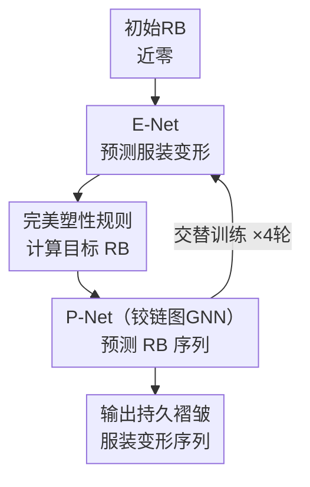

# Self-supervised Garment Dynamics with Persistent Wrinkles

**会议**: ECCV 2026  
**arXiv**: [2606.25065](https://arxiv.org/abs/2606.25065)  
**代码**: [https://github.com/realcrane/EPNet](https://github.com/realcrane/EPNet) (有)  
**领域**: 图形学 / 3D视觉 / 服装仿真  
**关键词**: 自监督服装仿真, 持久褶皱, 弹塑性材料, 课程学习, 铰链图GNN

## 一句话总结

提出首个自监督神经网络服装仿真器，通过动态静止弯曲能量和物理启发的课程学习，显式建模织物的弹塑性变形，首次在自监督框架下生成自然的持久褶皱，在多种服装、体形和动作上均优于现有方法。

## 研究背景与动机

**领域现状**: 自监督神经网络服装仿真器（如 PBNS、SNUG、NCS、HOOD、SENC）通过将物理能量作为损失函数来训练网络，无需任何训练数据即可快速推理，同时具备较好的视觉真实感。这些方法的核心思路是将服装仿真转化为固定能量最小化问题——网络预测服装网格顶点位置，损失函数由弯曲、拉伸、剪切、碰撞和重力等能量项组成。

**现有痛点**: 现有方法在建模弯曲行为时，采用预定义的静态静止弯曲（Rest Bending, RB），即假设每一条网格边的"零能量弯曲状态"是固定的。这种做法本质上把服装看作纯弹性材料：弯曲变形在外力移除后完全恢复，无法产生塑性变形导致的"持久褶皱"。然而真实织物具有弹塑性——当弯曲超过屈服阈值后，材料发生不可逆的塑性变形，褶痕在移除外力后仍然存在。这是现有 SSL 服装仿真器视觉质量远不如物理仿真器的根本原因。

**核心矛盾**: 要产生逼真的持久褶皱，需要将 RB 从静态值变为随变形历史动态演化的量。但这立刻带来一个"鸡生蛋"困境——动态 RB 必须由模型预测，但定义损失函数又需要知道 RB；两者相互依赖，使得训练从一个固定能量最小化问题变为一个"移动目标"的最小化问题，直接联合优化难以收敛。

**切入角度**: 核心洞察在于将弹塑性解耦为弹性变形网络（E-Net）和塑性预测网络（P-Net），并通过物理启发的课程学习让两者交替收敛。课程学习的核心思想是从简单到困难——先从纯弹性（RB 近零）开始训练 E-Net，然后用物理塑性规则从 E-Net 预测中计算目标 RB，再用目标 RB 训练 P-Net，最后用 P-Net 预测的 RB 重新条件化 E-Net 进入下一轮。通过这样的交替，系统从纯弹性逐步"进化"到弹塑性。

**核心 idea**: 用动态 RB 和完美塑性模型显式建模织物塑性，通过双网络交替训练 + 课程学习解决动态损失函数的收敛难题，首次在自监督框架下生成自然的持久褶皱。

## 方法详解

### 整体框架

本文构建了一个双网络自监督服装仿真系统，由弹性网络（E-Net）和塑性网络（P-Net）组成。E-Net 接收初始服装状态、身体动作序列以及静止弯曲（RB）作为输入，预测完整时间序列的服装变形；P-Net 在铰链图（hinge graph）上执行消息传递，从当前服装状态和上一帧 RB 预测 RB 的逐帧增量更新。两网络通过物理启发的课程学习交替训练：初始 RB 设为零（纯弹性），E-Net 预测变形后通过物理塑性规则计算目标 RB，P-Net 学习拟合该 RB，然后 P-Net 预测的 RB 作为下一轮 E-Net 的条件输入，重复 4 轮后收敛。

### 关键设计

**1. 动态静止弯曲与可微完美塑性模型**

现有方法将静止弯曲（RB）设为全局静态值，无法捕捉多次弯曲导致的塑性积累。本文受物理仿真中完美塑性模型启发，定义了一个可微分的塑性更新规则：当总应变 $\varepsilon^{(t)}$ 超过上一帧塑性应变 $\varepsilon^{(t-1)}_{p}$ 与屈服阈值 $\varepsilon_y$ 之和时，超出部分立即转化为新的塑性应变：

$$
\Delta\varepsilon^{(t)} = \varepsilon^{(t)} - \varepsilon^{(t-1)}_{p} - \varepsilon_y
$$

$$
\varepsilon^{(t)}_{p} = \varepsilon^{(t-1)}_{p} + \text{sigmoid}(k_p \Delta\varepsilon^{(t)}) \cdot \Delta\varepsilon^{(t)}
$$

其中 sigmoid 函数保证了更新的平滑可微性。基于此，弯曲能量定义为弹性应变（总应变减去塑性应变）的二次型：

$$
W_{bend} = \frac{1}{TD} \sum_t^T \sum_d^D k_b \frac{l^2}{8a} (\varepsilon^{(t)}_{d} - \varepsilon^{(t)}_{p,d})^2
$$

这一设计的核心优势在于：RB 不再是先验固定的常数，而是随变形历史动态演化的时空变量，织物可以在同一条边上经历多次弯曲后逐步积累塑性变形，产生"越来越深"的褶皱。

**2. 物理启发的课程学习**

动态 RB 带来了"鸡生蛋"问题：需要 RB 来定义损失函数训练 E-Net，但 RB 只能从训练好的 E-Net 预测中计算。直接联合优化 E-Net 和 P-Net 在实践中无法收敛。本文提出的课程学习方案巧妙地将问题分解为交替的子问题：① 初始化 RB 为近零高斯噪声，使服装近似纯弹性；② 用当前 RB 训练 E-Net，通过能量最小化预测服装变形；③ 从 E-Net 预测的总应变出发，用完美塑性规则逐帧计算目标 RB；④ 以目标 RB 为监督信号训练 P-Net，使其学会从运动历史预测 RB；⑤ 用 P-Net 预测的 RB 替换当前 RB，回到步骤 ② 重复。随着交替轮次增加，RB 逐步积累塑性变形，材料从纯弹性自然过渡到弹塑性。实验表明仅需 4 轮即可收敛，每轮内 E-Net 训练 100 epoch、P-Net 训练 50 epoch。

**3. 基于铰链图的消息传递 P-Net**

持久褶皱具有明显的空间和时间相关性：空间上褶皱沿网格邻域传播，时间上塑性随弯曲变形累积。P-Net 在从服装网格导出的铰链图上执行编-处理-解的消息传递。每个节点对应网格的一条内部边（两个相邻三角形），每条边连接相邻铰链节点。每时间步的节点特征为 8 维向量，包含当前/上一帧塑性应变、铰链中点在变形态和静止态的位置。采用 3 轮消息传递（1-ring → 2-ring → 3-ring 邻域逐渐扩大），增量式预测每个铰链的塑性应变更新。逐帧展开即得完整 RB 序列。与 Transformer 相比，铰链图 GNN 仅需 0.6GB GPU 内存（Transformer 需 9.2GB），推理速度达 9.43 FPS（Transformer 仅 0.17 FPS），从"不可用"变为"可用"。

### 一个完整示例：T恤弯腰运动

以 AMASS 数据集中弯腰动作序列（约 200 帧）为例，人物从直立状态缓慢弯腰到 90 度再返回。第 1 轮：所有网格边 RB 近零，E-Net 在纯弹性假设下预测变形——弯腰时腹部三角面产生大弯曲，但回到直立后褶皱即消失。物理规则更新：腹部区域超过屈服阈值 $\varepsilon_y=0.52$ rad 的边触发塑性更新，目标 RB 从零变为非零。P-Net 学习到腹部铰链的 RB 增量规律。第 2 轮：E-Net 以非零 RB 为条件重新预测——现在腹部翘曲在停止弯腰后仍保持隆起，形成与物理仿真（PBS）一致的持久褶皱。第 4 轮后收敛：褶皱位置（腹部、腋下）和尖锐度均与 PBS 高度吻合，BED 比最佳基线 SENC 降低 45.34%。

### 损失函数 / 训练策略

损失函数定义为物理能量之和，与隐式欧拉求解牛顿第二定律等价：

$$
\mathcal{L} = \sum_t \frac{h^2}{2} (\frac{\mathbf{x}^{(t+1)}-\mathbf{x}^{(t)}}{h} - \dot{\mathbf{x}}^{(t)})^\top \mathbf{M} (\frac{\mathbf{x}^{(t+1)}-\mathbf{x}^{(t)}}{h} - \dot{\mathbf{x}}^{(t)}) + W^{(t)}
$$

其中势能 $W = w_b W_{bend} + w_{st} W_{stretch} + w_{sh} W_{shear} + w_c W_{collision} + W_{gravity}$。各项权重：$w_b=4\times10^{-3}$，$w_{st}=10.0$，$w_{sh}=1.0$，$w_c=10.0$。屈服阈值 $\varepsilon_y=0.52$ rad，塑性增益 $k_p=10.0$，弯曲刚度 $k_b=3.96\times10^{-5}$。E-Net 采用 Adam 优化器，lr=1e-4, batch=64, 100 epochs；P-Net 同样 Adam，lr=1e-4, batch=1, 50 epochs。数据来自 AMASS（252 个动作序列），90% 训练 / 10% 测试，30 FPS 采样。完整训练约 70 小时（NVIDIA TITAN RTX），推理速度 0.106 秒/帧（约 9.43 FPS）。

## 实验关键数据

### 主实验

**表 1：未见动作上的定量对比**（指标越低越好）

| 指标 | 本文 | 最佳基线 | 提升 |
|------|------|----------|------|
| BED(rad)↓ | 0.28714 | 0.52529 (SENC) | -45.34% |
| PE(rad)↓ | 0.03206 | 0.12506 | -74.36% |
| BE(rad)↓ | 0.17118 | 0.17611 (NCS) | -2.79% |
| MED(mm)↓ | 0.02355 | 0.03191 (SNUG) | -26.19% |
| CD(m²)↓ | 0.00027 | 0.00040 (NCS) | -32.50% |
| BEN↓ | 0.02999 | 0.03412 (NCS) | -12.10% |

**表 2：未见体形上的定量对比**（训练于 Normal，测试于 Slim 和 Obese）

| 指标 | 本文 | 最佳基线 | 提升 |
|------|------|----------|------|
| BED(rad)↓ | 0.46630 | 0.66125 (SNUG) | -29.48% |
| PE(rad)↓ | 0.09690 | 0.14416 | -32.78% |
| BE(rad)↓ | 0.19593 | 0.19755 (NCS) | -0.82% |
| MED(mm)↓ | 0.02402 | 0.02773 (SNUG) | -13.38% |
| CD(m²)↓ | 0.00024 | 0.00032 (NCS) | -25.00% |
| BEN↓ | 0.02252 | 0.02778 (NCS) | -18.93% |

### 消融实验

**表 3：P-Net 架构消融**（不同时序模型在 RB 预测上的表现）

| 架构 | BED↓ | PE↓ | MED(mm)↓ | GPU(GB)↓ | FPS↑ |
|------|------|-----|-----------|----------|------|
| RNN | 0.86971 | 0.09968 | 0.03274 | 9.1 | 1.40 |
| LSTM | 0.84272 | 0.07535 | 0.03251 | 8.5 | 1.61 |
| Transformer | 0.52095 | 0.05263 | 0.02460 | 9.2 | 0.17 |
| GNN (本文) | 0.28714 | 0.03206 | 0.02355 | 0.6 | 9.43 |

### 关键发现

- P-Net 的铰链图 GNN 在 BED 上比 Transformer 低 44.9%（0.287 vs 0.521），GPU 内存仅 1/15（0.6GB vs 9.2GB），FPS 提升 55 倍（9.43 vs 0.17）——这不仅是精度优势，更是从"不可用"到"可用"的跨越
- 屈服阈值 $\varepsilon_y$ 提供直观的材料控制：$30^\circ$ 时织物像纸一样易产生持久褶皱，$60^\circ$ 时适中，$90^\circ$ 时几乎纯弹性——这种物理意义明确的参数无法通过调节弯曲刚度 $k_b$ 等弹性参数复现
- 课程学习 4 轮即可收敛：从纯弹性（第 1 轮 RB 近零）到第 4 轮 RB 与目标 RB 高度吻合，验证了交替训练策略的有效性
- 跨服装泛化测试（T 恤训练→长袖/背心/裤子测试）中 BED 仅从 0.287（同分布）上升至 0.422，且褶皱位置（肘部、腘窝等未见区域）与 PBS 一致，泛化能力超出预期

## 亮点与洞察

- **动态 RB + 可微塑性规则设计最为巧妙**：将物理仿真中成熟的完美塑性模型转化为可微分的神经网络损失组件，用 sigmoid 替代硬阈值使塑性更新保持端到端可导——这是整个方法能够工作的数学基础
- **课程学习解决"移动目标"问题**：传统 SSL 是固定能量最小化，本文创造性地将问题转化为"从简单到困难的动态目标跟踪"，用交替训练替代联合优化。这个思路可以迁移到任何涉及动态损失函数的学习任务
- **铰链图 GNN 的高效性值得借鉴**：在网格内边构成的拓扑图上做消息传递，天然契合弯曲的局部性，无需全局注意力，以极低计算代价达到甚至超越 Transformer 的精度
- **物理参数的可解释性**：$\varepsilon_y$ 是真正的物理参数（屈服应变）而非网络超参——用户可通过它直观控制织物软硬，对游戏/影视行业的艺术家友好度远高于调 loss weight

## 局限与展望

- **无法模拟拉伸使褶皱变平**：完美塑性模型只处理弯曲塑性，但真实织物在拉伸时可部分或完全拉平已有褶皱——本文未建模这一现象
- **宽松/垂坠服装表现受限**：所有 SSL 方法（含本文）都依赖蒙皮使服装贴合身体，缺乏显式接触求解，宽松服装不能自然脱离身体下垂——这是 SSL 框架与 PBS 之间最根本的差距之一，论文也明确指出实验中的 loose draping 差距
- **未测试分层服装**：外套+衬衫等多层服装的层间碰撞是独立的研究问题，本文未涉及
- **训练成本较高**：70 小时训练时间（单卡 TITAN RTX）是数据驱动方法的 10 倍以上，但推理速度快（0.106 s/frame），适合预训练后部署

## 相关工作与启发

- **vs PBNS/SNUG/NCS/HOOD/SENC**: 它们将服装建模为纯弹性材料（静态 RB），弯曲能量优化导致褶皱在无外力时完全消失；本文引入动态 RB 显式建模塑性，首次在 SSL 框架下生成持久褶皱
- **vs 基于物理的服装仿真（PBS）**: PBS 通过逐帧求解接触和塑性获得高精度但计算昂贵；本文在 SSL 框架中融入类似物理机制，以可接受的精度损失换取 10 倍以上的速度优势
- **vs 数据驱动方法**: 它们需大量配对仿真数据，泛化受限于训练分布；本文完全自监督，对未见体形和服装的泛化能力更强

## 评分

- 新颖性: ⭐⭐⭐⭐⭐ 首次实现 SSL 服装持久褶皱仿真，开辟了弹塑性 SSL 服装仿真新方向
- 实验充分度: ⭐⭐⭐⭐ 覆盖未见动作/体形/服装三组实验 + 架构消融 + 材料控制分析；但补充材料中 GE/IE 指标在基线间波动较大，论文对此的解释"可能来自训练随机性"略显薄弱
- 写作质量: ⭐⭐⭐⭐⭐ 动机链条清晰（纯弹性→缺持久褶皱→动态 RB→鸡生蛋→课程学习→解决），方法递进逻辑连贯
- 价值: ⭐⭐⭐⭐⭐ 对数字人、游戏、VR/AR 的服装仿真有直接实用价值，且课程学习框架可迁移至其他涉及动态损失函数的任务

<!-- RELATED:START -->

## 相关论文

- [\[CVPR 2026\] Action Motifs: Self-Supervised Hierarchical Representation of Human Body Movements](../../CVPR2026/human_understanding/action_motifs_self-supervised_hierarchical_representation_of_human_body_movement.md)
- [\[ECCV 2024\] VideoClusterNet: Self-Supervised and Adaptive Face Clustering for Videos](../../ECCV2024/human_understanding/videoclusternet_self-supervised_and_adaptive_face_clustering_for_videos.md)
- [\[ECCV 2026\] SyncCache: Exploiting Asymmetric Dynamics for Fast Audio-Driven Portrait Animation](synccache_exploiting_asymmetric_dynamics_for_fast_audio-driven_portrait_animatio.md)
- [\[ECCV 2024\] Pose-Aware Self-Supervised Learning with Viewpoint Trajectory Regularization](../../ECCV2024/human_understanding/pose-aware_self-supervised_learning_with_viewpoint_trajectory_regularization.md)
- [\[ICCV 2025\] Bi-Level Optimization for Self-Supervised AI-Generated Face Detection](../../ICCV2025/human_understanding/bi-level_optimization_for_self-supervised_ai-generated_face_detection.md)

<!-- RELATED:END -->
