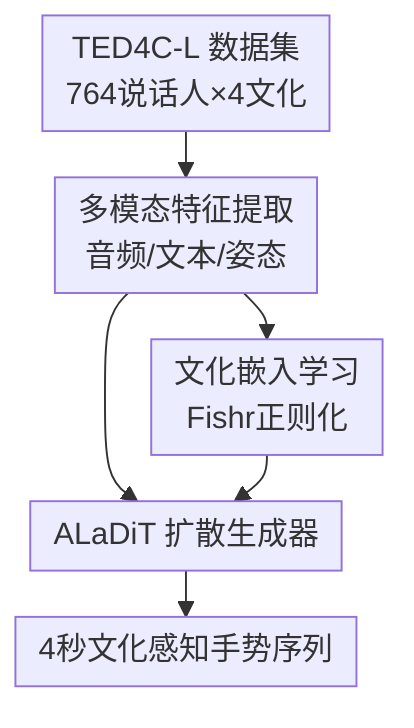

# SICAGE: Speaker-Independent Culture-Aware Gesture Generation using TED4C-L Dataset

**会议**: ECCV 2026  
**arXiv**: [2606.30001](https://arxiv.org/abs/2606.30001)  
**论文**: [Project Page](https://arielgjaci.com/sicage)  
**代码**: [https://arielgjaci.com/sicage](https://arielgjaci.com/sicage) (含数据集与源码)  
**领域**: 人体理解 / 手势生成  
**关键词**: 手势生成, 文化感知, 领域泛化, 扩散模型, 说话人无关

## 一句话总结
SICAGE 将文化感知的共语手势生成建模为领域泛化问题：把每位说话人视为一个域，用 Fishr 正则化或对抗学习从音视频和文本中提取说话人无关的文化表征，再以此条件一个实时扩散生成器 ALaDiT，在自建的 106 小时四文化 TED4C-L 数据集上显著提升手势的真实性、多样性、节拍同步和文化一致性。

## 研究背景与动机
共语手势是人类交流的关键模态，与语音协同传递语义和情感。现有数据驱动的手势生成方法——从规则系统到扩散模型——在运动质量和多样性上进展迅速，但几乎都忽略了文化维度：文化规范深刻影响手势的表现形式和解读方式，而当前模型默认所有说话人的手势风格同质化，这在跨文化人机交互场景下构成关键盲区。

更隐蔽的问题是评估协议。少数标注了文化标签的数据集中，训练和测试集经常包含相同说话人的不同片段（speaker-dependent split）。在这种设定下，模型可能只是在记忆个体说话人的手势风格，而非真正学到群体层面的文化模式——表面上看起来"文化感知"的效果，实则被说话人身份混淆。因此，一个可靠的文化泛化评估必须在说话人不重叠（speaker-disjoint）的划分上进行，且数据量要足够大才能支撑按说话人切分后的统计效力。

本文从上述矛盾出发，将文化表征学习重新表述为领域泛化（Domain Generalization）问题：每位说话人是一个域，目标是学到能跨说话人泛化的文化嵌入——对文化类别保持判别力，同时抑制对说话人身份的依赖。为此，作者构建了 TED4C-L（106 小时、764 位说话人、4 种文化），并设计了模块化框架 SICAGE，其中 Fishr 正则化匹配各说话人域的梯度方差以实现说话人不变性，ALaDiT 扩散生成器以文化嵌入为条件合成实时手势。**核心 idea**：文化手势生成不应记忆说话人，而应从"不同说话人共享的跨个体模式"中学习可泛化的文化表征。

## 方法详解

### 整体框架
SICAGE 是一个三阶段模块化框架：先从 TED4C-L 数据集提取多模态特征（音频、文本、姿态），再通过领域泛化方法学习说话人无关的文化嵌入（Fishr 或对抗学习），最后将这些嵌入连同原始特征一起送入 ALaDiT 扩散生成器，合成 4 秒的文化感知手势序列。三阶段彼此解耦，文化嵌入模块和生成器均可替换为其他实现。

### 关键设计

**1. 说话人无关的文化表征学习：将每位说话人当作一个域**

直接在一刀切文化标签上训练分类器会学到说话人特定的手势特征，缺乏跨说话人泛化能力。SICAGE 的核心操作是将每位说话人视为一个独立的域，用领域泛化的目标迫使文化嵌入对说话人身份不敏感。

具体做法：训练一个前馈网络（FFN），以音频特征（wav2vec、mel-log、onset strength）和文本特征（LaBSE 句子嵌入）为输入，各模态经独立分支 + attention pooling 后拼接，再由融合层投影为 512 维文化嵌入，最后输入文化分类头。注意这里**故意不使用姿态特征**——因为目标姿态是待生成的输出，推理时不可得。

领域泛化提供两种实现：(1) **Fishr 正则化**：匹配各说话人域内梯度方差，惩罚项 $P(\theta) = \frac{1}{|\mathcal{S}|}\sum_{d\in\mathcal{S}} \|v^d - \bar{v}\|^2$，其中 $v^d$ 是域 $d$ 内样本梯度的方差。每步采样 $k=64$ 个说话人，每域 16 个样本，前 500 步 $\lambda_p=0$ 预热，之后升至 1000。(2) **对抗学习**：在共享编码器后加梯度反转层（GRL）和说话人分类头，总损失 $\mathcal{L}_{tot} = \mathcal{L}_{cult} - \lambda_2 \cdot \mathcal{L}_{spk} + \lambda_s \mathcal{L}_{SupCon}$，逐步增大对抗权重。两种方案都额外施加监督对比损失 $\mathcal{L}_{SupCon}$（$\tau=0.07$，$\lambda_s=0.2$），将同文化样本拉近、异文化样本推远，进一步强化说话人不变性。

Fishr 的优势在于：梯度方差的二阶统计量比对抗训练的 minmax 博弈更稳定，尤其当说话人数量很大（764 个域）时，无需为每个说话人维护独立分类头，只需匹配域间的梯度方差分布，训练效率更高。

**2. ALaDiT：分层 Transformer 扩散生成器，以文化嵌入为条件**

ALaDiT 是一个可在 14 ms 内生成 4 秒手势的实时扩散模型，输入包含六种模态：mel-log 频谱、onset 强度、wav2vec 嵌入、句子嵌入、1 秒种子姿态（$X_0^{seed}$，5 个 token）和文化嵌入（$X^{cu}$）。

架构核心是一个 10 层分层 Transformer，每层依次执行：(a) 自注意力——在含噪声的目标姿态 $X_t^{fin}$（20 token）和种子姿态的拼接序列上建模时序依赖；(b) 交叉注意力——以对齐后的低层音频特征 $X^{low}$（mel-log + onset + wav2vec 经 windowed attention pooling 下采样到与姿态 token 一一对应）为 key/value，让姿态关注语音节奏和韵律；(c) **AdaIN 条件注入**——将高层语义特征 $X^{high}$（句子嵌入 + 文化嵌入拼接后投影）通过自适应实例归一化注入 Transformer 每一层，以全局方式控制手势的语义风格和文化风格。

这种"低层特征用交叉注意力 + 高层特征用 AdaIN"的分层条件设计是关键：音频的时序对齐信息（节拍、重音）需要帧级细粒度交互，适合交叉注意力；而文化风格和语义内容是全局属性，适合 AdaIN 在特征分布层面整体调节。最终去噪姿态经预训练 VQVAE 解码器还原为 9 个上半身 3D 关键点的连续运动。

**3. 多模态对齐损失：确保生成手势与音频、文本、文化一致**

仅靠重建损失 $\mathcal{L}_{rec}$（Huber Loss）训练扩散模型，无法显式保证生成手势在语义空间中和条件特征对齐——模型可能学到统计上逼真但与语音内容无关的运动。ALaDiT 引入三层对齐约束：

- **低层音频对齐** $\mathcal{L}_{low} = \mathbb{E}[1 - \cos(z_o, z_l)]$：将生成姿态和低层音频特征分别投影到共享空间后最大化余弦相似度，确保手势节拍和韵律与语音同步。
- **高层语义对齐** $\mathcal{L}_{high} = \mathbb{E}[1 - \cos(z_o, X^{high})]$：同理匹配生成姿态与句子+文化嵌入的全局语义方向。
- **对比损失** $\mathcal{L}_{cont}$：对低层和高层分别施加 InfoNCE 风格对比损失，拉近匹配对（同一段语音的姿态-音频/语义-姿态）、推远非匹配对（不同样本的），防止模型坍塌到平凡解（如所有输出都指向同一方向）。

此外，在去噪后的姿态 token 上附加一个文化分类头并施加交叉熵损失 $\mathcal{L}_{cult}$，从生成结果的层面直接监督文化一致性。这一设计在概念上和上文的"文化分类器评估 CE F1"形成闭环——生成器内部也在优化同一个目标。

### 一个完整示例：印度说话人说 Hindi 时的文化手势生成

以一段 Hindi TED 演讲的 5 秒片段为例：(1) 音频提取 wav2vec + mel-log + onset，文本经 LaBSE 编码为 768 维向量，前 1 秒姿态经 VQVAE 编码为 5 个离散 token 作为种子；(2) 音频和文本特征经 Fishr FFN 前传，输出 512 维文化嵌入——该嵌入与印度文化"高表达性、较大手势幅度"的统计模式对齐，但不包含任何特定说话人的个性风格；(3) ALaDiT 以随机噪声 $X_T^{fin}$ 起步，在 10 层 Transformer 中逐层去噪：交叉注意力层将姿态 token 与 Hindi 语音的节拍特征对齐，AdaIN 层以句子语义+文化嵌入调节全局运动风格（偏向较大幅度、更多手臂挥动），50 步扩散后输出 20 个去噪 token；(4) VQVAE 解码器重建为 4 秒连续姿态序列——最终手势在节拍点和 Hindi 重音处产生明确的手腕运动，整体幅度大于意大利/日本风格，且不同 Hindi 说话人的生成结果在统计上共享这些文化模式，但个体姿势细节各不相同。

### 损失函数 / 训练策略
ALaDiT 总损失 $\mathcal{L} = \mathcal{L}_{rec} + 0.1 \cdot \mathcal{L}_{cult} + 0.1 \cdot \mathcal{L}_{low} + 0.1 \cdot \mathcal{L}_{high} + 0.01 \cdot \mathcal{L}_{cont}$，其中 $\mathcal{L}_{rec}$ 为 Huber Loss。优化器 AdamW（$\beta_1=0.9$，$\beta_2=0.999$），学习率 $5\times 10^{-5}$，每 10 万步衰减 0.5 倍，batch size 64，扩散步数 50，EMA（$\beta=0.999$）跟踪参数。模型选择基于验证集 FGD 最低的 checkpoint（每 5 万步保存一次，最多评估到 50 万步）。VQVAE 单独训练 300 轮（Adam，学习率 $10^{-4}$，每 100 轮衰减 10 倍），损失含重建 $L_1$、commitment、速度、加速度和时序平滑正则项。Fishr 文化分类器训练 50 轮（AdamW，$lr=10^{-4}$，有效 batch 1024），前 500 步 $\lambda_p=0$ 预热后线性升至 1000。所有模型均在讲话人不重叠的 train/val/test 划分上训练和评估。

## 实验关键数据

### 主实验

| 模型 | FGD ↓ | CE F1(%) ↑ | BAS(%) ↑ | SRGR(%) ↑ | Diversity ↑ |
|------|--------|-------------|----------|-----------|-------------|
| MDM/NC | 15.58 | 38.57 | 22.52 | 51.62 | 107.62 |
| MDM/FI | 7.59 | 47.09 | 22.59 | 51.86 | 109.37 |
| DSG+/NC | 2.76 | 41.51 | 22.48 | 68.17 | 108.85 |
| DSG+/FI+Align | 2.52 | 39.80 | 22.67 | 65.17 | 111.13 |
| **ALaDiT/FI** | **1.03** | **44.61** | 22.63 | 68.09 | 110.27 |
| ALaDiT/ADV | 1.53 | 42.71 | 22.45 | 67.57 | 111.75 |
| ALaDiT/NC | 1.60 | 43.41 | 22.51 | 67.72 | 109.50 |

ALaDiT/FI 在 FGD（运动真实性）上以 1.03 显著优于所有变体和基线（MDM 最优 7.59，DSG+ 最优 2.52），说明 Fishr 文化嵌入 + 分层注意力 + 多模态对齐的组合在逼近真实运动分布上效果突出。CE F1 达 44.61%（随机基线 25%），证明生成手势中确实编码了可被分类器识别的文化信号。DSG+ 注入文化嵌入后 FGD 甚至变差（2.76→4.81），说明文化嵌入的效果高度依赖生成器架构是否显式支持多模态对齐。

### 消融实验

| 配置 | FGD ↓ | CE F1(%) ↑ | SRGR(%) ↑ | 说明 |
|------|--------|-------------|-----------|------|
| ALaDiT/FI | 1.03 | 44.61 | 68.09 | 完整模型 |
| w/o 文化条件 (NC) | 1.60 | 43.41 | 67.72 | 去掉显式文化嵌入，仅靠音频/文本隐式推断 |
| w/o 域正则化 (NoDG) | 1.56 | 43.18 | 67.76 | 用相同编码器架构但去掉说话人域正则化 |
| w/o 对齐损失 (NoAlign) | 1.36 | 43.37 | 68.17 | 用 Fishr 嵌入但去掉 ALaDiT 多模态对齐损失 |
| OneHot 文化标签 | 1.63 | 43.73 | 67.63 | 将文化嵌入替换为 one-hot 标签经 MLP 投影 |
| 对抗学习 (ADV) | 1.53 | 42.71 | 67.57 | Fishr 换对抗学习，其余相同 |

消融揭示了清晰的贡献层级：(1) **文化嵌入的存在 vs. 缺席**（NC→FI，FGD 从 1.60→1.03）是单次最大增益，说明显式文化条件对运动真实性的提升不可被音频/文本隐式替代；(2) **域正则化的必要性**（NoDG→FI，FGD 1.56→1.03）：同样有文化嵌入，不加说话人域正则化时 FGD 几乎回到 NC 水平（1.56 vs. 1.60），证明"嵌入对文化有判别力"不够，必须同时抑制说话人信息才能让嵌入真正可泛化；(3) **Fishr vs. 对抗学习**：FI 在所有指标上优于 ADV，且 ADV 的 CE F1（42.71）甚至低于 NC（43.41），说明对抗训练的 minmax 博弈在此多域设定下不如梯度方差匹配稳定；(4) **OneHot** 离散文化标签虽能略微提升多样性，但在 FGD 和 CE F1 上均不如 Fishr，说明从连续多模态信号中学到的文化嵌入比人工分组标签含更丰富的渐变文化信息。

### 关键发现
- **Fishr 是文化表征学习的最优域泛化策略**：在多说话人（764 个域）设定下，Fishr 的梯度方差匹配比对抗学习的 GRL 更稳定，且无需为每个说话人维护独立分类头；消融中 FI 在所有生成器架构（ALaDiT / MDM / DSG+）上均一致优于 ADV 和 NC。
- **文化嵌入的效果高度依赖生成器架构**：MDM 和 ALaDiT 注入 FI 嵌入后 FGD 大幅下降（15.58→7.59，1.60→1.03），但 DSG+ 注入后反而恶化，说明单独的文化嵌入不是银弹——需要生成器架构显式建模多模态对齐（交叉注意力 + AdaIN + 对比损失）才能有效利用。
- **无对齐损失时模型仍优于 NC**（NoAlign FGD=1.36 vs. NC=1.60），说明 Fishr 嵌入本身已含有利于生成的信号，但对齐损失能进一步释放其潜力（1.36→1.03）。
- **用户研究（N=20）**：FI 在整体评分上显著优于 ADV（6.06 vs. 5.65, p=0.033），在文化匹配度上显著优于 NC（6.16 vs. 5.81, p=0.038），说明 Fishr 文化嵌入带来的手势差异对人类观察者可感知。日本和意大利样本上 FI 一致最优，而土耳其样本上 NC 略高但不显著，提示文化效应的感知存在群体异质性。

## 亮点与洞察
- **把文化手势生成建模为领域泛化，概念上非常干净**：每位说话人是一个域，文化是跨域共享的标签——这个映射让域泛化领域的所有工具（Fishr、对抗学习、DG 评估协议）都可以直接搬过来，且天然要求 speaker-disjoint split，解决了该领域长期被忽视的评估混淆问题。
- **梯度方差匹配（Fishr）在多域设定下比对抗训练稳定**是一个可迁移的实用 insight：当域数量极大（数百个）且每域样本不多时，为每个域维护一个对抗分类头既昂贵又不稳定，而 Fishr 只匹配二阶统计量（梯度方差），训练开销与域数近乎解耦，适合任何"以个体为域"的场景（如个性化手势、多风格 TTS、跨用户行为建模）。
- **分层条件设计（交叉注意力做时序对齐 + AdaIn 做全局风格）**是处理多模态条件信号的一个通用范式：时序细粒度信号（音频节拍、文本 phoneme）走交叉注意力，全局风格信号（文化、情感、说话风格）走 AdaIN——这种分工避免交叉注意力被全局信息淹没，也避免了 AdaIN 丢失时序细节。
- **TED4C-L 数据集的价值超越本文**：106 小时、四语言、764 说话人的多模态数据，加上 speaker-disjoint split 的设计，使其可以支撑任何需要跨说话人泛化评估的文化感知/风格感知手势生成研究。

## 局限与展望
- **文化标签粗粒度**：以国家为文化分组（印度/意大利/日本/土耳其）忽略了国家内部的巨大文化异质性，作者也承认这是一种实用的操作近似。未来可引入更细粒度的文化标注（地域、亚文化、社会阶层）或从数据中自动发现文化子群。
- **仅 9 个上半身关键点**：出于无约束 TED 视频中手部/手指常模糊或出框的可靠性考虑，作者放弃了手指和下半身跟踪。这局限了手势的表现力——手指动作在许多文化中是关键的表达载体。未来在视频质量允许的情况下可引入更完整的身体/手部关键点。
- **文化表征与语言/韵律/语义未完全解耦**：当前方法学到的是"对文化有判别力 + 对说话人不变"的嵌入，但不保证文化信号与语言、韵律、语义信号之间的因果分离——一个 Hindi 说话人的"文化嵌入"可能部分编码了 Hindi 语言的韵律特征而非纯文化风格。未来可探索因果表示学习方法实现更干净的分离。
- **用户研究的被试群体可能不熟悉所有被评估文化**：作者提到被试对不同文化的熟悉度不均，这可能影响感知评分的可靠性，尤其是土耳其样本上 FI 未显著优于 NC 的结果。
- **生成手势与真值之间仍有可感知差距**：用户研究中 Real 条件所有指标均高于生成模型，说明手势生成的感知质量尚有提升空间。

## 相关工作与启发
- **vs DiffuseStyleGesture+ (DSG+)**：DSG+ 以风格特征为条件生成手势，但缺乏专门的文化建模和说话人不变性约束；SICAGE 的核心区别在于将文化表征学习建模为域泛化问题，且实验表明 DSG+ 注入文化嵌入后性能反而恶化，说明文化嵌入的价值高度依赖生成器架构对多模态对齐的显式支持。
- **vs MCGD 等文化标注数据集**：MCGD 标注了 263 说话人的文化标签但未公开且每文化仅约 20 人；TED4C-L 每文化约 190 人、106 小时、speaker-disjoint split，规模和质量均大幅超越，为文化手势研究提供了更可靠的基准。
- **vs Motion Diffusion Model (MDM)**：MDM 是通用扩散姿态生成框架，但缺少对文化条件和多模态对齐的显式设计；ALaDiT 在同样扩散步数和优化设置下 FGD 大幅低于 MDM（1.03 vs. 7.59），验证了分层条件架构 + 对齐损失的设计收益。

## 评分
- 新颖性: ⭐⭐⭐⭐⭐ 首次将文化感知手势生成严格建模为说话人级别的领域泛化问题，概念清晰、切入角度独到；TED4C-L 填补了大规模多文化手势数据集的空白
- 实验充分度: ⭐⭐⭐⭐⭐ 消融全面（6 种 ALaDiT 变体 + 2 种基线 × 3 种条件），客观指标（FGD/CE F1/BAS/SRGR/Diversity）+ 用户研究（20 人 × 7 问）+ 定性可视化 + 逐文化分析，证据链完整
- 写作质量: ⭐⭐⭐⭐ 方法部分清晰，实验设置详细，补充材料丰富（VQVAE 架构、数据分布、逐文化结果），但 Introduction 行文略冗长
- 价值: ⭐⭐⭐⭐⭐ 将领域泛化工具引入共语手势生成开辟了新的研究方向，TED4C-L 作为基准数据集有独立生态价值，说话人不变性视角可推广到情感手势、个性化手势等其他风格感知生成任务

<!-- RELATED:START -->

## 相关论文

- [\[ICCV 2025\] SemGes: Semantics-aware Co-Speech Gesture Generation using Semantic Coherence and Relevance Learning](../../ICCV2025/human_understanding/semges_semantics-aware_co-speech_gesture_generation_using_semantic_coherence_and.md)
- [\[CVPR 2026\] CoordSpeaker: Exploiting Gesture Captioning for Coordinated Caption-Empowered Co-Speech Gesture Generation](../../CVPR2026/human_understanding/coordspeaker_exploiting_gesture_captioning_for_coordinated_caption-empowered_co-.md)
- [\[CVPR 2026\] LiveGesture: Streamable Co-Speech Gesture Generation Model](../../CVPR2026/human_understanding/livegesture_streamable_co-speech_gesture_generation_model.md)
- [\[AAAI 2026\] ReAlign: Text-to-Motion Generation via Step-Aware Reward-Guided Alignment](../../AAAI2026/human_understanding/realign_text-to-motion_generation_via_step-aware_reward-guided_alignment.md)
- [\[CVPR 2026\] PAMotion: Physics-Aware Motion Generation for Full-Body Interaction with Multiple Objects](../../CVPR2026/human_understanding/pamotion_physics-aware_motion_generation_for_full-body_interaction_with_multiple.md)

<!-- RELATED:END -->
