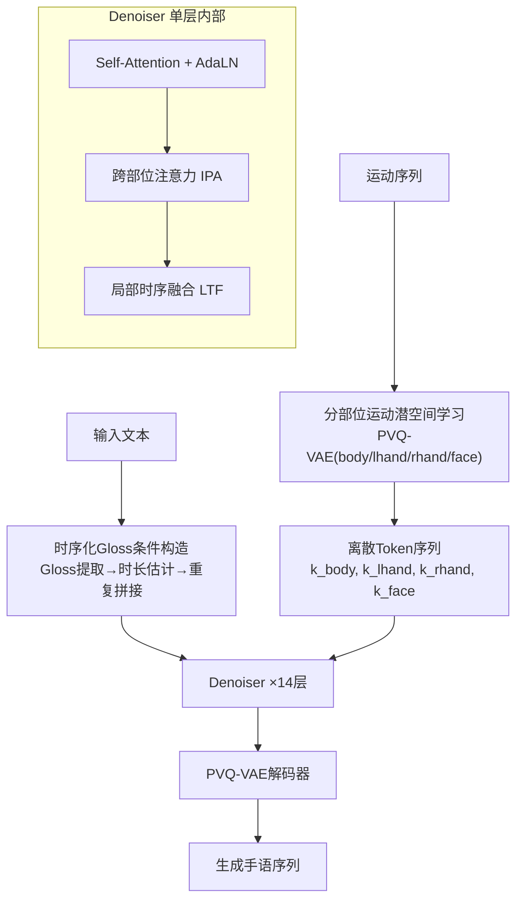

# SIGNER: Temporally Grounded Sign Language Generation via Time-Resolved Conditioning

**会议**: ECCV 2026  
**arXiv**: [2506.07460](https://arxiv.org/abs/2506.07460)  
**代码**: 无  
**领域**: 人体理解  
**关键词**: 手语生成, 时序Gloss条件, 局部时序融合, 离散扩散, 运动生成

## 一句话总结
SIGNER 提出时序化解码条件（time-resolved conditioning）框架，通过构造时序化 Gloss 条件序列并在扩散去噪中以局部时序融合（LTF）将其注入，显式保留下游手语片段的时序对应关系（temporal grounding），从而解决现有手语生成方法中词序错乱和语义不准的核心问题，在 CSL-Daily 和 Phoenix-2014T 上大幅超越此前 SOTA。

## 研究背景与动机
手语生成（text-to-sign generation）旨在从口语文本合成手语动作序列，是连接聋听人群的关键技术。与文本到图像等通用生成任务不同，手语生成受两项刚性语言学约束：其一，手语通过一系列与 Gloss（词级语义单元）对齐的手势表达含义，手势必须以正确词汇顺序出现才能传递原意；其二，每个手势必须忠实地反映对应 Gloss 的语义。这两项约束共同要求生成过程中必须保持时序对应（temporal grounding）——即每个 Gloss 的语义信号与对应手势片段在时间维上严格对齐。

现有手语生成方法普遍采用全局条件融合策略（如 cross-attention 在整条序列上共享条件信号），导致 Gloss 语义在时间维上被混合，弱化了时序对应。具体表现为：模型不知道某个特定时刻应该表达哪个 Gloss，结果是词序错乱和语义模糊。部分工作（如 G2P-DDM、NAT-EA）虽然引入了 Gloss 序列信息来反映词汇结构，但仍然通过全局 cross-attention 注入条件，时序对应问题仅被部分缓解而非根本解决。

核心矛盾：手语生成要求时间维上的严格 Gloss-手势对齐，但主流扩散/自回归模型的全局条件注入机制天然把时间维当作可自由混合的维度，二者根本冲突。本文切入角度是将条件信号从「全局共享」改为「时序解析」——把 Gloss 语义沿时间轴显式铺开，并在去噪时以局部窗口约束条件注入范围。核心 idea：用**时序化 Gloss 条件 + 局部时序融合（LTF）** 替代全局 cross-attention，强制每个时间步只看到当前及邻近 Gloss 的语义，从而天然保留下游手势的时序对应和词汇顺序。

## 方法详解

### 整体框架
SIGNER 的目标是在离散扩散生成过程中显式保持 Gloss 语义与手势片段的时序对应。整个管线分三个阶段：（1）从输入文本构造时序化 Gloss 条件——将文本转为 Gloss 序列，估计每个 Gloss 的持续帧数，将 Gloss 嵌入按时长重复拼接成时间对齐的条件序列；（2）用分部位 PVQ-VAE 将运动序列编码为四个部位（body / left hand / right hand / face）的离散 token；（3）在离散扩散去噪器中，每层依次经过 Self-Attention、跨部位注意力（IPA）和局部时序融合（LTF），其中 LTF 是保证时序对应的核心模块。

### 关键设计

**1. 时序化Gloss条件构造：将Gloss语义沿时间轴显式展开**

文本词序决定手语词序，但直接拿文本嵌入做全局条件无法指示每个时刻该表达什么 Gloss。SIGNER 的解法是用一个现成 text-to-gloss 模型将输入文本转为 Gloss 序列 $g = \{g_j\}$，用预训练 mBART 为每个 Gloss 提取嵌入 $c_j \in \mathbb{R}^{D_{\text{cond}}}$，再通过一个可学习的时长估计器（2 层 MLP）预测每个 Gloss 的 token 级持续帧数 $l_j$。以 $L_g = \sum_j l_j$ 为目标生成长度，将每个 $c_j$ 重复 $l_j$ 步并按 Gloss 原始顺序拼接得到中间序列 $\bar{S} \in \mathbb{R}^{L_g \times D_{\text{cond}}}$，最后线性投影到去噪器特征维度得到最终时序条件 $S = \Phi(\bar{S}) \in \mathbb{R}^{L_g \times D_{\text{feat}}}$。

这个设计的关键在于：$S$ 的第 $t$ 个时间步天然对应当前 Gloss 的语义嵌入，而不是所有 Gloss 的混合。这为后续 LTF 的局部注入提供了精确的逐帧条件信号，是整个框架的「时间锚点」。

**2. 局部时序融合 LTF：用局部窗口替代全局 Attention 注入条件**

这是 SIGNER 最核心的贡献。给定时序化 Gloss 条件 $S$ 和去噪器中间特征 $\mathbf{X}_{\text{IPA}}^{\text{part}}$（各个部位的 IPA 输出），LTF 用两个 MLP 从 $S$ 生成逐 token 的缩放和偏移参数 $u, v \in \mathbb{R}^{L_g \times D_{\text{feat}}}$，然后执行自适应归一化加局部 1D 卷积：

$$\mathbf{X}_{\text{LTF}}^{\text{part}} = \text{Conv1D}\!\left(\text{LN}(\mathbf{X}_{\text{IPA}}^{\text{part}}) \odot (1+u) + v\right)$$

其中 AdaLN 确保每个 token 索引处的 Gloss 条件被精确对齐到对应位置（第 $t$ 个 token 用第 $t$ 个 Gloss 的 $u_t, v_t$），1D 卷积（kernel size=3, stride=1）在局部窗口内聚合相邻上下文以产生平滑过渡。与全局 cross-attention 让每个 motion token 可以关注所有 Gloss token 不同，LTF 将条件融合限制在局部邻域内，既加强了当前 Gloss 的语义引导（保证词序正确），又防止了跨段语义过度混合（保证语义准确）。

消融实验中，将 1D 卷积替换为全连接（AdaLN + FC）会导致性能持续下降，证明局部时序聚合对引入相邻上下文和产生平滑过渡至关重要。而用全局 cross-attention 替代整个 LTF 模块时性能大幅倒退（WER 从 55.05 升至 84.90），直接验证了局部条件注入对时序对应的必要性。

**3. 跨部位注意力 IPA：协调身体-手部-面部的联动**

由于 SIGNER 的 PVQ-VAE 对四个部位（body、左手、右手、面部）独立编码/解码，去噪过程中各部位可能产生不协调的动作。IPA 通过跨部位 cross-attention 解决这一问题：身体特征作为 query 去 attend 手部和面部特征的拼接，同时手部和面部各自以身体特征为 key/value 做 cross-attention，形成 B$\rightarrow$H、H$\rightarrow$B、B$\rightarrow$F 三条注意流。消融表明三条注意流同时启用效果最好，单独启用 B$\rightarrow$H 或 H$\rightarrow$B 已有稳定提升，加入面部注意流进一步补充了表情信息，验证了多部位协同对生成质量的重要性。

**4. 分部位运动潜空间学习：用 PVQ-VAE 增强手部和面部表达**

SIGNER 采用分部位 VQ-VAE 将运动序列压缩为离散 token。输入运动 $\mathbf{X}$ 被分解为 body、左手、右手、面部四个部分，每个部分有独立的 1D 卷积编码器 $E^{\text{part}}$、解码器 $G^{\text{part}}$ 和码本 $\mathcal{Z}^{\text{part}}$。训练时最小化四个部分的 VQ-VAE 损失之和。分部位设计的动机是：手部和面部动作在表达语义时远比躯干重要，但全局 VQ-VAE 中躯干的大幅运动容易主导码本分配，分部位则让每部分的码本专注于自身动作模式，从而提升手语关键部位的重建精度。

### 损失函数 / 训练策略
采用 VQ-Diffusion 的标准离散扩散目标。给定干净 token 序列 $\mathbf{k}_0$ 和加噪后的 $\mathbf{k}_t$，去噪器在时序 Gloss 条件 $S$ 和扩散步 $t$ 的条件下预测原始 token 的后验分布 $p_\theta(\mathbf{k}_0 \mid \mathbf{k}_t, t, S)$，训练目标为负对数似然：

$$\mathcal{L}_{\text{diff}} = \mathbb{E}_{t, \mathbf{k}_0, \mathbf{k}_t}\big[-\log p_\theta(\mathbf{k}_0 \mid \mathbf{k}_t, t, S)\big]$$

扩散步数设为 50 步，去噪器 14 层，特征维度 512，注意力头数 16。PVQ-VAE 和去噪器均使用 AdamW 优化器（lr=$1\times 10^{-4}$，weight decay=$4.5\times 10^{-2}$），各训练 30K iterations，batch size 56，单张 RTX 4090 GPU。

## 实验关键数据

### 主实验

| 方法 | CSL-Daily WER↓ | CSL-Daily BLEU-4↑ | CSL-Daily ROUGE↑ | Phoenix WER↓ | Phoenix BLEU-4↑ | Phoenix ROUGE↑ |
|------|---------------|-------------------|------------------|-------------|----------------|---------------|
| MotionGPT (gloss-free) | 94.92 | 1.79 | 15.48 | 99.60 | 0.81 | 7.07 |
| MDM (gloss-free) | 95.54 | 2.78 | 16.29 | 99.83 | 0.97 | 7.40 |
| MoMask (gloss-free) | 91.51 | 3.79 | 20.12 | 92.01 | 5.15 | 22.80 |
| SOKE (gloss-free) | 85.69 | 4.09 | 21.70 | 87.74 | 5.52 | 19.69 |
| G2P-DDM (gloss-based) | 74.28 | 6.44 | 25.31 | 88.00 | 5.17 | 16.78 |
| NAT-EA (gloss-based) | 67.80 | 7.87 | 29.17 | 75.65 | 8.79 | 23.04 |
| **SIGNER (Ours)** | **55.05** | **15.60** | **39.52** | **67.16** | **11.46** | **29.39** |

在统一评估设置下（所有方法使用相同运动表示和同一个 back-translation 评估模型重新评测），SIGNER 在两个数据集上全面领先。Gloss-free 方法因缺乏词汇顺序引导表现最差；Gloss-based 方法虽有改善，但 NAT-EA 同样使用时序 Gloss 条件却仍落后 SIGNER 大幅（CSL-Daily WER 67.80 vs 55.05），说明仅有 Gloss 条件不够，关键是如何注入——LTF 的局部融合机制才是时序对应的保障。

### 消融实验

| 配置 | CSL-Daily WER↓ | CSL-Daily BLEU-4↑ | CSL-Daily ROUGE↑ | 分析 |
|------|---------------|-------------------|------------------|------|
| Cross-Attention (全局融合) | 84.90 | 5.81 | 24.87 | 全局混合导致时序对应丧失 |
| AdaLN + FC | 72.52 | 7.85 | 27.90 | 无局部上下文聚合，过渡不自然 |
| **AdaLN + 1D Conv (LTF)** | **55.05** | **15.60** | **39.52** | 逐帧对齐 + 局部平滑，全面最优 |
| w/o IPA (全部关闭) | 61.31 | 13.27 | 36.42 | 各部位独立去噪，缺乏协同 |
| IPA 全开 (B$\rightarrow$H+H$\rightarrow$B+B$\rightarrow$F) | **55.05** | **15.60** | **39.52** | 三向注意流协同效果最佳 |

LTF 消融表明：全局 cross-attention 和 AdaLN+FC 均显著差于 LTF，确认了"局部窗口约束"在保持时序对应中的不可替代性。IPA 消融中，单独开启任意一条注意流均有增益，三条全开达到最优，证明身体-手-面之间的协同信息互补。

### 运动平滑度分析

| 模型 | Peak Velocity↓ | Peak Jerk↓ |
|------|---------------|-----------|
| NSA | 0.75±0.20 | 1.75±0.59 |
| MoMask | 0.44±0.13 | 0.63±0.31 |
| NAT-EA | 0.43±0.10 | 0.69±0.31 |
| **SIGNER (Ours)** | **0.38±0.10** | **0.35±0.12** |

SIGNER 的峰值速度和峰值加速度（jerk）均为最低，表明生成动作在不同 Gloss 段之间的过渡最平滑，没有出现检索-拼接方法（如 Spoken2Sign）中常见的段边界跳变。

### 关键发现
- LTF 是整个框架中贡献最大的模块：将 LTF 替换为全局 cross-attention 后 WER 从 55.05 飙升至 84.90，退化幅度远超其他消融，验证了「时序对应破坏 = 词序错乱」这一核心假设。
- Gloss 时长对扰动鲁棒：在 CSL-Daily 上对预测时长做 ±4 帧（约 ±25%）的加减或随机扰动，WER 仅从 55.05 升至 56.60~60.74，表明模型不完全依赖精确的时长预测即可保持时序对应。
- 与 NAT-EA 的对比最具说服力：两者均使用时序 Gloss 条件，但 NAT-EA 的全局 cross-attention 注入导致时序对应仅被部分保留，SIGNER 的 LTF 局部注入将 WER 大幅拉低 12.75 个点，直接证明了「注入方式」比「条件信息」更关键。

## 亮点与洞察
- LTF 的设计本质上是对扩散模型条件注入方式的一次「局部化」重构：不同于主流的全局 cross-attention（条件信号在时间维上完全自由混合），LTF 用 AdaLN 做逐 token 索引对齐 + 1D 卷积做局部平滑，既保证了硬性的词序约束又保留了邻域连续性。这个思路可以迁移到任何需要时序对齐的条件生成任务（如文本驱动的动作序列生成、语音驱动的面部动画）。
- 「条件信息的组织形式」比「条件信息的丰富程度」更重要的洞察具有很强的普适性：NAT-EA 拥有和 SIGNER 几乎相同的 Gloss 条件信息，但组织形式不同（全局 vs 局部）导致结果天差地别——这提示我们在设计条件生成模型时，应该优先问「条件应该以什么结构注入」而非「条件应该包含多少信息」。
- 分部位 VQ-VAE 的思路简单但有效：在手语这类不同部位信息密度差异极大的场景中（手部和面部远比躯干重要），全局码本会被高幅值低信息量的躯干运动占据，分部位码本解决了这个「码本容量分配」问题，可直接迁移到全身姿态估计、手势生成等任务。

## 局限与展望
- 依赖现成 text-to-gloss 模型：虽然实验证明 SIGNER 对不同 text-to-gloss 模型选择鲁棒（表 3a），但要扩展到新语言的手语数据集时仍需先训练该语言的 text-to-gloss 模型。未来可探索 text-to-gloss 与手语生成的端到端联合优化。
- LTF 的局部窗口大小是固定的（1D 卷积 kernel=3）：不同 Gloss 对应的手势片段长度差异可能很大，固定窗口对极短或极长 Gloss 可能出现欠平滑或过平滑。自适应窗口大小（如基于 Gloss 时长动态调整 kernel size）可能进一步改善。
- 评估依赖 back-translation pipeline：back-translation 本身有误差，WER/BLEU/ROUGE 对手语质量的反映可能存在偏差，缺乏直接的手语语义保真度指标（如手语母语者的主观评分）。
- 仅测试了 CSL-Daily（中文手语）和 Phoenix-2014T（德语手语），两个数据集规模偏小（~20K 和 ~8K），在更大规模多语言数据集上的泛化性有待验证。

## 相关工作与启发
- **vs NAT-EA**: 两者均使用时序 Gloss 条件，但 NAT-EA 通过全局 cross-attention 注入，时序对应仅被部分保留；SIGNER 的 LTF 以局部窗口约束注入，从根本上解决了时序对应丢失问题。这种「同信息不同注入方式」的对比揭示了一个普适设计原则：条件注入的时空结构至少与条件内容同等重要。
- **vs MoMask / SOKE**: 这些方法将文本特征通过全局 cross-attention 注入整个序列，完全不考虑手语的词序约束，本质上是把 SLG 当作通用 motion generation 来处理。SIGNER 证明了为特定领域的结构性约束专门设计条件注入方式是可行的且收益巨大。
- **vs Spoken2Sign**: 检索-拼接范式天然保证词序，但段边界过渡不平滑（峰值 jerk 高达 1.70 vs SIGNER 的 0.35）。SIGNER 结合了生成式方法的平滑性和显式词序约束，在两者之间找到了一个优雅的平衡点。

## 评分
- 新颖性: ⭐⭐⭐⭐ 将时序对应这一手语语言学中的基本约束显式建模为条件注入的时空结构，LTF 的设计思路（AdaLN 对齐 + 局部卷积）简洁有效，不是 trivial 的模块堆砌
- 实验充分度: ⭐⭐⭐⭐⭐ 主实验覆盖两个数据集和 7 个 baseline，消融覆盖 LTF、IPA、text-to-gloss 模型选择、时长扰动四个维度，额外包含运动平滑度分析和定性可视化，实验设计周密
- 写作质量: ⭐⭐⭐⭐ 核心矛盾（全局融合 vs 时序对应）表述清晰，Figure 2 和 Figure 5 的概念对比图直观传达了设计动机，方法部分的公式和架构描述准确
- 价值: ⭐⭐⭐⭐ 首次在 SLG 领域系统论证了条件注入的时空结构对词序和语义准确性的关键作用，LTF 作为一种轻量级条件注入范式有潜力推广到其他时序条件生成任务

<!-- RELATED:START -->

## 相关论文

- [\[ECCV 2026\] SIGNET: Motion-Level Knowledge Transfer for Cross-Language Sign Language Translation](signet_motion-level_knowledge_transfer_for_cross-language_sign_language_translat.md)
- [\[ECCV 2026\] BackTranslation2.0 -- A Linguistically Motivated Metric to Assess Sign Language Production](backtranslation20_--_a_linguistically_motivated_metric_to_assess_sign_language_p.md)
- [\[CVPR 2026\] SignPR: A Progressive Vector-Quantized Diffusion Framework for Sign Language Production](../../CVPR2026/human_understanding/signpr_a_progressive_vector-quantized_diffusion_framework_for_sign_language_prod.md)
- [\[CVPR 2026\] Learning Effective Sign Features without Text for Gloss-free Sign Language Translation](../../CVPR2026/human_understanding/learning_effective_sign_features_without_text_for_gloss-free_sign_language_trans.md)
- [\[CVPR 2026\] Focal–General Diffusion Model with Semantic Consistent Guidance for Sign Language Production](../../CVPR2026/human_understanding/focal-general_diffusion_model_with_semantic_consistent_guidance_for_sign_languag.md)

<!-- RELATED:END -->
