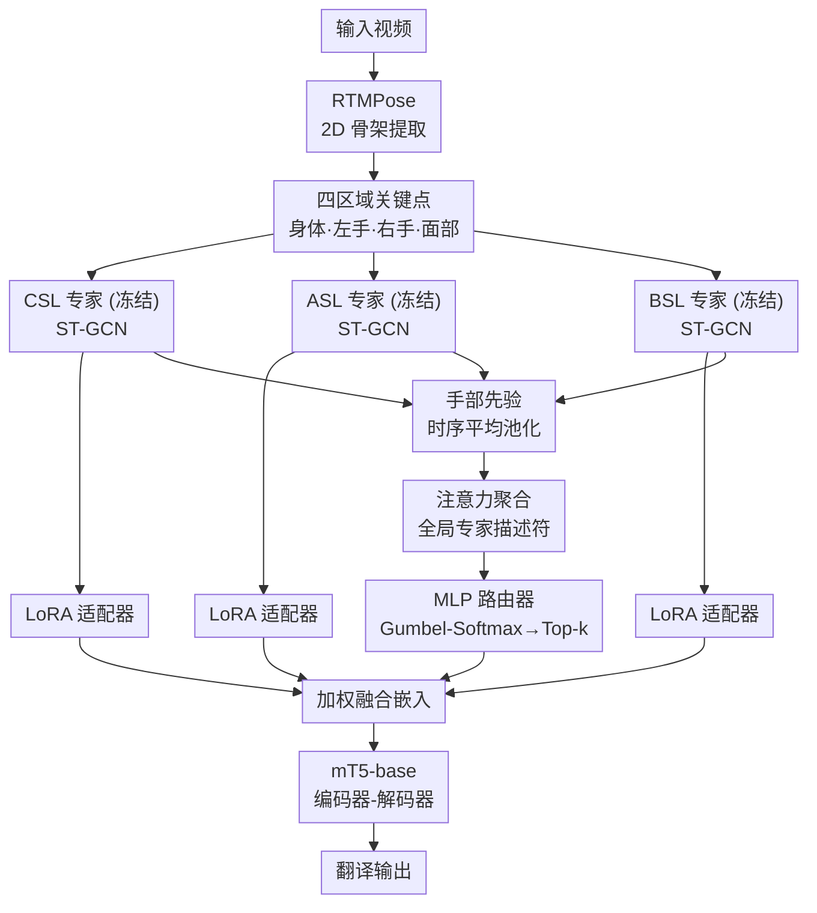

# SIGNET: Motion-Level Knowledge Transfer for Cross-Language Sign Language Translation

**会议**: ECCV 2026  
**arXiv**: [2606.28626](https://arxiv.org/abs/2606.28626)  
**代码**: 待确认（项目页 [https://cogvis-cvssp.github.io/papers/signet](https://cogvis-cvssp.github.io/papers/signet)）  
**领域**: 人体理解  
**关键词**: 手语翻译, 跨语言迁移, 运动知识迁移, 混合专家, 骨架图卷积  

## 一句话总结

SIGNET 提出将多个在大型语料上预训练的手语骨架骨干网络视为冻结核运动视觉专家，通过手部先验驱动的注意力聚合与可学习门控融合实现跨语言运动级知识迁移，仅用 150 万可训练参数即在四个翻译基准和 WLASL 识别基准上取得 SOTA 或可比结果。

## 研究背景与动机

手语翻译（SLT）旨在将连续手语视频直接转换为口语文本。免 gloss 方法虽摆脱了对昂贵中间标注的依赖，却面临严重的跨语言泛化难题：现有方法几乎都针对单个数据集/语言独立训练，每迁移到新语言就从头开始或全量微调，先前学到的表示被直接丢弃。这种做法忽略了不同手语之间一个至关重要的共性——ASL、BSL、DGS、CSL 虽分属不同语系，词汇和语法差异巨大，但底层发音器官的运动结构（手部形状变化、手臂轨迹、面部非手部信号）是共享的。运动视觉模式的可迁移性意味着，在一个语言上训练好的骨干网络捕捉到的"运动词汇"可能对另一个语言同样有价值。然而当前没有机制去利用这种跨语言的运动知识迁移，每个新语言都像从零开始的"训练孤岛"。

这一困境的核心矛盾在于数据与模型的剪刀差：单个手语数据集规模太小（Phoenix14T 仅 11 小时、CSL-Daily 仅 23 小时），不足以训练出鲁棒的通用表示，而大规模语料（YT-ASL 984 小时、CSL-News 1985 小时）上的预训练模型在新语言上却被直接抛弃。理想的方案应当能复用多个预训练模型已学到的互补运动知识，根据新语言输入的视觉特征动态选择最相关的专长组合，并且不触碰完整模型参数以避免灾难性遗忘。SIGNET 以手语自身的特点为突破口——既然手指和手部是手语词汇的核心载体，那么不同语言的手部运动模式差异最能区分专家的专长边界，以此作为路由信号自然能引导融合系统做出准确的专家选择。

本文的核心 idea 是**将多个在不同语言上预训练的骨架骨干网络视为冻结核运动视觉专家，从各专家内部提取手部时空特征作为领域特定的路由先验，通过注意力聚合生成输入相关专家描述符，再由 Gumbel-Softmax 训练/Top-k 推理的不对称门控网络动态融合最有用的专家输出，仅用 150 万可训练参数实现高效的跨语言运动级知识迁移。**

## 方法详解

### 整体框架

SIGNET 构建了一个三阶段训练管线与冻结专家+轻量适配的推理架构。输入视频先经 RTMPose 提取全身 133 个 2D 骨架关键点，划分为身体、左手、右手、面部四个解剖区域。三个在大型语料（CSL-News、YT-ASL、BSL）上端到端预训练的 ST-GCN 骨架骨干网络并行处理这些区域关键点，作为冻结核运动视觉专家。每个专家的输出嵌入经过 LoRA 风格的低秩适配器进行轻量域微调。同时，从每个专家的手部 ST-GCN 流提取的手部时序特征经由注意力聚合模块融合为输入相关的全局专家描述符，传递给轻量 MLP 路由器。训练阶段用 Gumbel-Softmax 采样随机融合权重以探索专家的专长边界，推理阶段替换为确定性 Top-k 选择，仅激活 logits 最大的 k 个专家加权融合，最终将融合嵌入送入 mT5-base 编码器-解码器自回归生成目标翻译文本。

### 关键设计

**1. 冻结视觉专家与轻量 LoRA 适配：将多语言预训练骨干视为可复用专家池**

SIGNET 的核心洞察在于：不同手语虽词汇语法各异，但预训练 ST-GCN 骨架骨干网络捕捉的是底层的发音器官运动模式——手部形状变化、手臂轨迹等——这些模式在不同语言的数据集间是共享的。论文将三个分别在 CSL-News（1985 小时）、YT-ASL（984 小时）和 BSL 语料（1666 小时）上端到端训练的骨架骨干网络完全冻结，作为异构视觉专家池。每个专家内部包含四路 ST-GCN，分别编码身体、左手、右手、面部的时空特征；各部特征拼接后经线性投影映射到 mT5 的嵌入空间，以语言建模损失端到端训练。为弥补冻结专家在目标域上的表示偏差，每个专家的输出嵌入后接一个 LoRA 风格的轻量适配器：先层归一化，再通过低秩矩阵（A:768→16, B:16→768）学习残差偏移，初始时置零以保留预训练特征。整个视频编码器仅需 1.5M 可训练参数，同时避免了全量微调带来的灾难性遗忘。

**2. 手部先验驱动的注意力聚合：将手语领域知识编码为路由信号**

标准 MoE 通常用输入特征本身作为门控信号，但手语翻译中不同专家擅长捕捉不同语言的运动模式，仅靠通用视觉特征难以区分哪个专家对当前输入更相关。SIGNET 的关键创新在于使用"手部先验"作为路由信号——从每个专家内部的手部 ST-GCN 流提取其时序平均池化特征，拼接左右手特征形成紧凑的手部描述子。这一设计的领域直觉是：手部是手语词汇和语义内容的主要载体，不同语言间手部运动既有共性（基本手形如握拳、伸指）又有特异性（特定词汇的手形配置），差异度最大、语义密度最高，是区分专家专长最有效的线索。消融实验证实，仅使用手部特征作为聚合输入效果最优，加入身体和面部特征反而引入噪声降低了翻译质量。

聚合模块采用数据相关的注意力机制：将所有专家的手部先验做平均池化，通过两层 MLP 生成一个与输入相关的查询向量，再以该查询与各手部先验做缩放点积注意力，得到加权融合的全局专家描述符。这个描述符动态编码了当前输入最需要哪些专家的信息——如果输入手势接近 ASL 的手部运动模式，ASL 专家的手部先验会获得更高的注意力权重，从而引导门控网络优先选择该专家。

**3. Gumbel-Softmax 训练与 Top-k 推理的不对称门控融合：训练时探索组合多样性、推理时保证选择确定性**

有了全局专家描述符后，一个轻量两层 MLP 路由器将其映射为 N 维 logits。论文在训练和推理阶段采用不同策略：训练时通过 Gumbel-Softmax 重参数化采样生成随机软权重，使路由器能在早期随机探索不同的专家组合（即使某个专家暂时 logits 较低也有机会被选中），从而学习各专家的专长边界而不陷入局部最优；推理时替换为确定性 Top-k 选择，只激活 logits 最高的 k 个专家并对其 Softmax 归一化后加权融合。实验发现 k=2 最佳：单专家信息不足以覆盖多语言运动模式，全部专家则引入冗余与过平滑，k=2 在稀疏性和多样性间取得平衡。相比均匀平均融合和简单拼接融合，这一选择分别带来了 +3.66 和 +3.48 BLEU-4 的提升，说明不是所有专家对每个输入都有同等贡献，动态选择最关键。

### 损失函数 / 训练策略

三阶段训练：Stage I 在各大型语料上端到端训练骨干+LLM 20 epoch（LLM 为 mT5-base，约 580M 参数），使用语言建模损失；Stage II 对下游语料中"预训练未见语言"进行 20 epoch 对称 InfoNCE 对比对齐，对齐视觉嵌入与目标语言文本嵌入空间，LLM 解码器保持冻结以保留语言先验；Stage III 在下游数据集上微调 40 epoch，更新适配器、注意力聚合、门控和 LLM 编码器-解码器。优化器为 AdamW，学习率 3×10⁻⁴，余弦调度，批大小 8，梯度累积 4，权重衰减 1×10⁻⁴。数据增强包括高斯关节噪声（sigma=0.01）和 15% 随机帧丢弃。

## 实验关键数据

### 主实验

| 数据集 | 指标 | SIGNET | 之前 SOTA | 提升 |
|--------|------|--------|-----------|------|
| Phoenix14T Test | BLEU-4 | 27.82 | PGG-SLT 27.32 | +0.50 |
| CSL-Daily Test | BLEU-4 | 28.51 | Geo-Sign 27.42 | +1.09 |
| How2Sign Test | BLEU-4 | 15.4 | SSVP-SLT-LSP 15.5 | 相近（不依赖预训练） |
| MeineDGS Test | BLEU-4 | 2.75 | Spotter+GPT 0.64 | +2.11 |
| WLASL2000 | P-I/P-C | 64.87 / 62.07 | Geo-Sign 63.64/61.89 | +1.23 / +0.18 |

SIGNET 在所有四个翻译基准上达到 gloss-free 方法的 SOTA，且仅使用骨架模态。在 WLASL2000 孤立词识别上也超越了现有方法。

### 消融实验

| 配置 | Phoenix14T B-4 | CSL-Daily B-4 | 说明 |
|------|---------------|---------------|------|
| Full (3 experts, k=2) | 27.78 | 28.27 | 完整模型 |
| 均匀平均融合 | 24.12 (-3.66) | 25.08 (-3.19) | 去掉门控，等价无视输入 |
| 简单拼接融合 | 24.30 (-3.48) | 25.75 (-2.52) | 高维拼接带来过拟合 |
| w/o Contrastive (Stage II) | 27.63 | 28.27 | 新语言(Phx)需对齐，同语言(CSL)无影响 |
| 1 骨干 (无门控) | 24.05 (-3.73) | 25.56 (-2.71) | 单专家能力不足 |
| 留一：w/o CSL expert | 24.68 (-3.10) | 21.71 (-6.56) | CSL-Daily 上 CSL 专家最关键 |
| 留一：w/o ASL expert | 23.04 (-4.74) | 26.79 (-1.48) | Phoenix14T(DGS)上 ASL 专家最关键 |

### 关键发现

- **语言匹配专家主导**：留一实验清晰地展示了"语言匹配时该专家贡献最大"的规律。CSL-Daily 上移除 CSL 专家掉 6.56 BLEU-4，How2Sign 上移除 ASL 专家掉 5.6；而对于 DGS（预训练未见语言），各专家贡献更均衡（移除 ASL/BSL/CSL 分别掉 4.74/3.76/3.10），框架自动发现互补专长。
- **手部先验优于全身先验**：仅用手部特征作路由输入效果最佳（Phoenix14T B-4 27.78），加入身体特征降至 26.23，再加入面部降至 25.12，说明高维噪声稀释了路由信号的语义密度。
- **k=2 最佳**：三个骨干下 k=2 优于 k=1（信息不足）和 k=3（冗余过平滑），且与门控移除对比发现路由机制本身贡献了显著收益。
- **预训练规模远未饱和**：将预训练数据从 100% 缩至 25% 时性能持续下降，在 100% 处仍未出现饱和，表明瓶颈在于预训练覆盖的广度而非适配模块的容量。

## 亮点与洞察

- **异构专家+动态融合的跨语言迁移范式**：将多个语言专属的预训练模型视为冻结核专家池，不对专家结构做统一假设——理论上可无缝扩展更多语言（法手语、日手语、阿拉伯手语等），为跨语言 SLT 提供了一条无需全量重训的可扩展路径。
- **领域知识驱动的路由信号设计**：利用"手部是手语语义核心载体"这一领域知识来设计路由信号，而非通用特征。消融实验从正反两面有力支撑了这一设计的必要性，是领域引导架构设计的一个好案例。
- **骨骼优势与效率的双重验证**：仅用 2D 骨架 + 1.5M 可训练参数，匹配甚至超越需要数万 A100 GPU 小时的 RGB 方法（如 SSVP-SLT-LSP 在 How2Sign 上 15.5 B-4 需要 21504 A100 小时，SIGNET 仅用约 576 RTX 3090 小时预训练 + 24 小时微调即达 15.4 B-4），效率提升近两个数量级。
- **不对称训练/推理门控**：训练时 Gumbel-Softmax 随机探索、推理时确定性 Top-k 选择的策略通用性强，可迁移到任何需要从多个预训练模型中动态选择的场景（如通用动作识别、医疗影像分析等）。

## 局限与展望

- **骨干构建的一次性成本**：Stage I 需要在三个大型手语语料上分别训练专属骨干，每套约 576 RTX 3090 GPU 小时。虽然是一次性投入，但目前只有三个语言（CSL、ASL、BSL）的专家，对资源有限的团队扩展新语言骨干存在门槛。
- **极低资源场景仍远未实用**：MeineDGS（50 小时、约 10000 个独特 gloss，DGS 未见预训练）上仅 2.75 BLEU-4，虽大幅超越基线（Spotter+Transformer 1.08），但离实用仍有数量级差距。目标语言与预训练语言家族距离远时迁移效果可能进一步衰减。
- **2D 骨架的信息瓶颈**：纯 2D 骨架无法捕捉手指细微姿态、手掌朝向、手腕旋转等精细信息，而这些对某些手语词汇可能是决定性区分特征。未来可结合 3D 手部姿态估计或局部 RGB 裁剪来补充。
- **评估指标的适用性**：BLEU 等 n-gram 指标源自机器翻译，对跨模态、跨语言的 SLT 评价不够准确（如手语语序与口语不同）。BLEURT 虽弥补了语义维度，但语义保真度的定量评估仍是开放问题。

## 相关工作与启发

- **vs GFSLT-VLP / Sign2GPT / SignLLM**: 这些 RGB 方法在单语言上训练或微调，属于"孤岛训练"。SIGNET 通过冻结专家+动态融合，以骨架轻量表示实现了跨语言迁移——当目标语言与某预训练语言相同时该方法效果最佳，但跨语言场景下也明显优于从头训练。
- **vs Uni-Sign / Geo-Sign**: 同为骨架方法，但它们在新语言上从头微调整个模型。SIGNET 的冻结+适配策略不仅在跨语言场景下性能更优（CSL-Daily B-4 28.27 vs Geo-Sign 27.42），而且计算效率更高（每批前向 320ms vs Geo-Sign 2550ms）。
- **vs 标准 MoE**: 经典 MoE 的专家通常是同构的且从随机初始化或统一起点训练。SIGNET 的"专家"天然异构——每个在不同语言上预训练，专家本身就是"专才"。路由器的任务不是训练专家而是发现和调度已有的专长，这大幅降低了 MoE 的训练要求。
- **vs SSVP-SLT-LSP**: 该 RGB 方法在 How2Sign 上同时使用 YT-ASL 和 How2Sign 做预训练且投入 64 块 A100 训练两周。SIGNET 在不使用 How2Sign 做预训练、仅用约 1/64 资源的条件下达到可比性能（15.4 vs 15.5 BLEU-4），其设计理念——在多个语言上训练并在新语言上轻量适配——比"在一个更大数据集上训练"更具可持续性。

## 评分

- 新颖性: ⭐⭐⭐⭐⭐ 将冻结异构专家 MoE 与手语领域知识（手部先验路由）创造性结合，跨语言迁移在 SLT 领域具有范式突破意义。
- 实验充分度: ⭐⭐⭐⭐⭐ 4 个翻译基准 + 1 个识别基准，全方位消融（组件/专家数/k/预训练规模/留一/融合策略），效率对比数据详尽。
- 写作质量: ⭐⭐⭐⭐ 动机强有力、逻辑自洽、消融分析深入，但方法部分符号过密——大量公式可精简为叙述以提升可读性。
- 价值: ⭐⭐⭐⭐⭐ 为手语翻译的跨语言可扩展性提供了务实高效的框架，计算效率优势（约 2 个数量级）使其具有实际部署潜力，设计理念可迁移至其他运动分析领域。

<!-- RELATED:START -->

## 相关论文

- [\[CVPR 2026\] Learning Effective Sign Features without Text for Gloss-free Sign Language Translation](../../CVPR2026/human_understanding/learning_effective_sign_features_without_text_for_gloss-free_sign_language_trans.md)
- [\[CVPR 2025\] Lost in Translation, Found in Context: Sign Language Translation with Contextual Cues](../../CVPR2025/human_understanding/lost_in_translation_found_in_context_sign_language_translation_with_contextual_c.md)
- [\[CVPR 2026\] BoostSLT: Boosting Sign Language Translation via a Plug-and-Play Diffusion-Based Semantic Enhancer](../../CVPR2026/human_understanding/boostslt_boosting_sign_language_translation_via_a_plug-and-play_diffusion-based_.md)
- [\[ECCV 2026\] BackTranslation2.0 -- A Linguistically Motivated Metric to Assess Sign Language Production](backtranslation20_--_a_linguistically_motivated_metric_to_assess_sign_language_p.md)
- [\[ECCV 2026\] SIGNER: Temporally Grounded Sign Language Generation via Time-Resolved Conditioning](signer_temporally_grounded_sign_language_generation_via_time-resolved_conditioni.md)

<!-- RELATED:END -->
