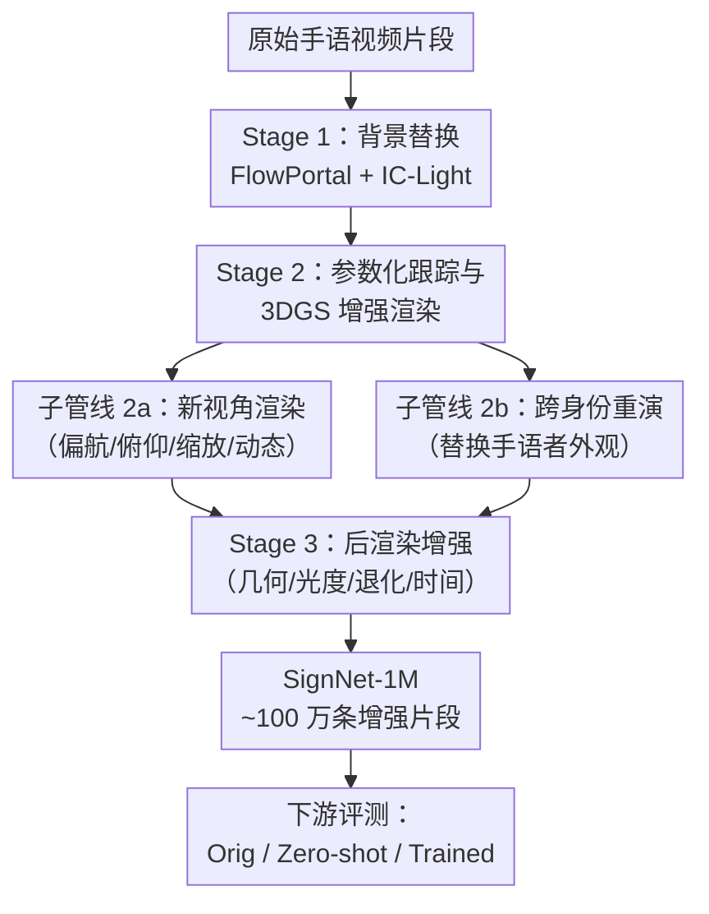

# SignNet-1M: Large-Scale Multilingual Sign Language Video Dataset with Downstream Benchmarks

**会议**: ECCV2026  
**arXiv**: [2606.24361](https://arxiv.org/abs/2606.24361)  
**代码**: [https://signnet.chatsign.ai/](https://signnet.chatsign.ai/)  
**领域**: 人体理解  
**关键词**: 手语翻译, 数据增强, 三维高斯泼溅, 新视角渲染, 分布偏移鲁棒性

## 一句话总结
SignNet-1M 利用 3DGS 新视角渲染、扩散模型场景/身份编辑和后渲染增强，将 7 个公开手语语料库扩充为约 100 万条多语言手语视频片段（ASL/CSL/DGS），并配套一套统一评估协议（Orig/Zero-shot/Trained）揭示并弥补现有模型在视角、背景、身份变化下的鲁棒性漏洞。

## 研究背景与动机

手语翻译（SLT）和手语识别（SLR）在 Phoenix14T、How2Sign、CSL-Daily 等标准基准上已取得长足进步，但这些数据集几乎都是在固定条件下采集的——正面近景摄像头、单调的影棚背景、极少数手语者。SpaMo、UniSign 等最先进模型在这种 i.i.d. 划分评测下表现亮眼，但一旦部署到真实世界——摄像头从侧面拍摄、背景是杂乱的客厅、手语者换了一个陌生人——性能就急剧下降。论文通过实验量化了这一盲区：SpaMo 在 Phoenix14T 上原始评测 BLEU-4 为 22.49，加一点视角扰动后 Zero-shot 测试就骤降至 7.81，降幅达 14.68 个点。传统像素级增强（裁剪、翻转、颜色抖动）无法合成三维结构一致的视角变化，也难以在保护手部精细运动的同时替换场景和人物。

近年来三维高斯泼溅（3DGS）和扩散模型视频编辑的进展让"结构化增强"变得可行。3DGS 在新视角合成方面支持显式相机控制，扩散模型（FlowPortal、IC-Light）能实现时序一致的场景替换与光照编辑。论文的核心洞见是：如果能把这两种生成式技术组装成一条面向手语的增强管线，在保持手部姿态和语言学标注不变的前提下，系统性地沿着视角、背景、身份三个轴生成可控变化，就可以同时做两件事——既揭示现有多大数据集都覆盖不了的鲁棒性漏洞，又用增强数据训练弥补这些漏洞。**核心 idea：构建一条三阶段生成式增强管线——扩散背景替换、3DGS 新视角渲染与跨身份重演、后处理抖动——将 7 个手语语料库扩展为百万级多语言数据集 SignNet-1M，并配套一套 Orig/Zero-shot/Trained 统一评测协议，使训练后模型在分布偏移下 BLEU-4 提升 4–15 个点且不损失原始分布性能。**

## 方法详解

### 整体框架

SignNet-1M 的增强管线包含三个串联阶段，每个阶段沿一个独立的分布偏移轴生成可控变化。输入是源语料库的原始手语视频片段，输出是保持原语言学标注（gloss/翻译）的增强片段。Stage 1 用扩散模型进行背景替换和光照编辑，生成场景多样性；Stage 2 是核心——先用 EHM-Tracker 将手语者跟踪为 SMPL-X/FLAME 参数化表示，然后通过 GUAVA（基于 3DGS 的可动画化虚拟形象渲染器）执行新视角渲染（静态/动态相机）和跨身份重演；Stage 3 应用轻量后渲染增强（视频一致的空间变换和轻微时间重采样），进一步模拟真实世界采集中的几何、光度、压缩和时序退化。

### 关键设计

**1. 三维高斯泼溅新视角渲染：在几何一致性下合成连续视角变化**

当前手语模型的根本脆弱性之一是对摄像头视角变化极度敏感——训练时正面录制的"花瓶"数据，部署时侧面或俯视拍摄就"碎"了。传统裁剪/透视变换无法合成三维一致的视角变化，因为像素级操作不知道人物的三维结构在哪里。SignNet-1M 的解法是先通过 EHM-Tracker 逐帧将手语者拟合为 SMPL-X（身体）+ FLAME（面部）参数化模型，将每个片段解耦为跨片段恒定的身份参数 $(\beta, \Delta\mathbf{j}, s_h, s_w, \gamma)$ 和时序变化的运动参数 $(\psi_t, \mathbf{e}_t, \mathbf{j}_t, \mathbf{c}^{\text{src}}_t)$。然后以运动参数 $\psi_t$ 驱动 GUAVA——一个基于 3DGS 的可动画虚拟形象渲染器——在预设相机视角下渲染并 alpha 合成到手语者当前背景上。论文定义了 K=10 个以 LookAt 为中心的球形相机预设（$\phi$ 偏航 $0^\circ{-}30^\circ$、$\theta$ 俯仰 $0^\circ{-}25^\circ$、$r$ 缩放 $0.6{-}1.5$），按扰动幅度递增索引 L1–L10。除了静态视角还支持动态相机轨迹（两个端点间线性插值），模拟真实场景中手语者边打手势边走动时视角的自然变化。这一设计的关键巧妙在于：参数化跟踪把手语者的三维几何先验"装进"了增强管线，使得所有视角变换都在几何一致的表示上进行，不会产生传统像素增强中常见的形状畸变或手部断裂。

**2. 扩散模型背景替换与光照编辑：在保护手语语义的前提下生成场景多样性**

视角之外另一个巨大鲁棒性漏洞是背景变化——在影棚白墙前训练的模型一遇到室内杂乱背景或户外自然光就剧烈掉点。但这个维度的增强极其棘手：粗暴地将手语者抠图粘贴到新背景上会产生硬边、光照不匹配、影子缺失等伪影，这些伪影反而会成为模型过拟合的新线索。SignNet-1M 的做法是先用视频抠图估计时序一致的软 alpha 遮罩 $\alpha^{\text{bg}}$，然后使用 IC-Light 生成光照感知的参考图像，再通过 FlowPortal（基于扩散模型的时序一致视频编辑框架）在潜在空间中进行残差修正的流引导编辑。编辑结果通过 $\alpha^{\text{bg}}$ 与原始手掌区域混合，确保手部精细运动和人脸表情完全不受背景编辑影响。为了定量评测背景变化对模型的影响，论文定义了一个手语者区域的光照偏移分数 $s_{\text{light}}$：在 Lab 色彩空间下计算编辑前后手语者区域的亮度差 $\Delta_L$ 和色度差 $\Delta_{ab}$，加权归一化到 $[0,1]$，然后等宽分箱为 L1–L10 严重度级别。这使评测能逐级揭示"光照变化多大时模型开始撑不住"——是细粒度诊断而不是笼统的"背景变化有用/没用"。

**3. 跨身份重演：解耦身份与运动实现手语者替换**

手语者身份的多样性是另一个被忽视的鲁棒性来源——模型如果只见过两三个人的手语风格，换一个人打同样的手势就认不出了。传统方法要么靠大量采集不同人手语视频（成本极高），要么用简单的面部替换（破坏整体动作连贯性）。SignNet-1M 利用参数化解耦的核心优势：从源片段（source image）提取身份参数 $\Theta^{\text{id}}$，从目标片段提取运动参数 $\Theta^{\text{mot}}$，组合成 $\tilde{\theta}_t = (\Theta^{\text{id}}, \Theta^{\text{mot}}_t)$ 后直接用同一套 GUAVA 渲染器和背景合成流水线渲染。这意味着源片段中任何手语者的外貌都可以"穿"到目标片段的动作序列上，且手部姿态、身体整体运动、表情时序完全不改变。根据人类评估结果，跨身份重演的视频被 14 名母语 ASL 手语者判定为语义正确的比例高达 94.8%（对比新视角/背景替换的 >99%），是目前最难的增强类型但也带来了最高的鲁棒性增益——消融实验显示身份编辑在 Zero-shot 和 Trained 两个协议下都是掉点最多或增益最大的单一因素组件（Phoenix14T Zero-shot 13.06 vs Full 7.81，说明身份变化虽然难以完全对齐但模型学了之后泛化最好）。

**4. 后渲染增强：模拟真实世界采集退化的低成本多样性层**

经过前三步生成式增强后，SignNet-1M 加了一个轻量级后处理层，模拟真实世界手语视频在采集、编码、传输中常见的退化——几何变换（裁剪/旋转/透视）、光度抖动（亮度/饱和度/gamma）、退化模拟（模糊/噪声/压缩伪影）、时间重采样（帧率变化/轻微速度抖动/跳帧）。这层增强虽然"技术含量"不高，但在消融中显示出不可替代的互补性：只靠前面三层生成式增强时 Zero-shot BLEU-4 为 5.37（Phoenix14T），加上后渲染后恢复到完整模型的 7.81。这说明生成式增强解决的是结构级分布偏移（视角、场景、身份），但真实世界视频还有大量"非结构化"退化（码率低、光线差、镜头脏）需要一个简单便宜的层来覆盖。

### 一个完整示例

以 Phoenix14T 中的一条 DGS 手语视频（时长约 4 秒，正面近景，白色背景，1 位手语者）为例。管线首先进入 Stage 1：将背景替换为一个日照充足的室外花园场景（FlowPortal + IC-Light 合成），光照偏移级别大约 L4。Stage 2 中 EHM-Tracker 拟合 SMPL-X 参数，GUAVA 将该片段渲染为偏航 +15 度、缩放 0.8 的视角（相机预设 L5），同时从另一个 ASL 语料库 How2Sign 选取一张源手语者图像，将身份注入该 DGS 动作序列，生成"新人在花园里打 DGS 手语"的跨身份重演版本。Stage 3 额外施加轻度高斯模糊和时间下采样 0.9×。最终一条原始片段经过完整管线生成 3 种增强副本（视角+动态相机混合/背景替换/身份重演），均保持原 gloss 标注。

### 损失函数 / 训练策略

下游评测中使用 Backbone 的原生训练配置不做改动：SpaMo 使用 Flan-T5-XL + LoRA（$r=16$，$\alpha=32$），AdamW（$\text{lr}=6\times 10^{-4}$，cosine 调度），最多 500 轮含早停；UniSign 使用 ST-GCN 编码器 + mT5-Base 解码器，DeepSpeed ZeRO-2，AdamW（$\text{lr}=10^{-3}$）。消融实验控制除数据外所有训练设置严格一致，确保增益来自 SignNet-1M 的数据多样性而非额外的优化轮次。

## 实验关键数据

### 主实验

表 3 展示了 SLT BLEU-4 在四个子数据集上的 Orig / Zero-shot / Trained 评测，表 4 展示 SLR WER% 的对应结果。

| 子数据集 | 方法 | A (Orig) | B (Zero-shot) | C (Trained) | Gain (C−B) | D (Trained→Orig) |
|----------|------|----------|--------------|-------------|-----------|-----------------|
| Phoenix14T | SpaMo | 22.49 | 7.81 | 18.98 | +11.17 | 27.78 |
| How2Sign | SpaMo | 10.11 | 6.25 | 10.36 | +4.11 | 18.48 |
| OpenASL | UniSign | 22.67 | 8.12 | 22.83 | +14.71 | — |
| CSL-Daily | SpaMo | 20.55 | 12.70 | 21.32 | +8.62 | 20.93 |

| 子数据集 | 方法 | Orig WER% | Zero-shot WER% | Trained WER% | Gain |
|----------|------|----------|--------------|-------------|------|
| Phoenix14T | Online-CSLR | 22.21 | 51.45 | 28.19 | +23.26% |
| CSL-Daily | UniSign | 28.20 | 56.90 | 30.74 | +26.16% |

### 消融实验

表 5 按增强组件维度分别消融（Phoenix14T, SpaMo）：

| 配置 | Zero-shot BLEU-4 | Trained BLEU-4 | 说明 |
|------|-----------------|---------------|------|
| Novel View (单视角) | 7.10 | 18.85 | 仅基础新视角渲染 |
| + yaw | 8.17 | 18.59 | 偏航方向增益稳定 |
| + pitch | 6.98 | 18.36 | 俯仰最难学 |
| + zoom | 8.89 | 18.98 | 缩放提升最一致 |
| + dynamic camera | 6.87 | 17.13 | 动态相机最不稳定 |
| Scene editing | 4.91 | 12.53 | 只有背景替时掉点最严重 |
| Identity editing | 13.06 | 22.04 | 身份编辑 Zero-shot 表现最好 |
| Post-rendering aug. | 5.37 | 18.16 | 后处理单独作用有限 |
| Full SignNet-1M | 7.81 | 18.98 | 完整管线最好 |

### 关键发现

- **身份编辑是双刃剑但增益最高**：表 5 中 Identity editing 在 Zero-shot 下的 BLEU-4（13.06）远超 Full 模型（7.81）——因为身份变化在消融中只测一种偏移，而完整模型要同时面对视角+场景+身份多重偏移。但训练后身份编辑的提升最显著（Trained 22.04 vs Full 18.98），说明跨身份增强是最有价值的单一训练信号。
- **增益随视角/光照严重度递增**：图 4 的 severity-stratified 分析显示，Zero-shot BLEU-4 随视角扰动从 L1 的 8.31 降到 L10 的 6.94，光照更惨（7.02 → 2.96）。而训练增益在第 L10 最大（视角 +9.92、光照 +6.85）——说明 SignNet-1M 在最难的扰动下收益最大。
- **缩放实验显示多样性大于数据量**：在匹配 GPU 小时数下，K=2、5、10 的性能曲线高度重叠（图 6），说明 SignNet-1M 的增益不完全来自"多看了几遍数据"，而是来自更大规模增强带来的多样性。
- **人类评估验证语义保持**：14 名母语 ASL 手语者对 27,000 对合成视频的评估显示，新视角/背景/后处理增强接受率 >99%，最难的身份重演也达 94.8%。

## 亮点与洞察

- **"结构化增强"的思路比具体方法更具迁移性**：论文没有发明新的生成模型，而是巧妙地将已有技术（3DGS、扩散视频编辑、参数化人体跟踪）组装成一条面向手语的增强管线。这种"按偏移轴拆解+组装"的范式可以迁移到其他需要鲁棒性的人类运动理解任务（如舞蹈识别、动作捕捉、社交信号分析）。
- **Orig/Zero-shot/Trained 三态协议是评估鲁棒性的优秀工具**：它同时测量了"现有数据多脆弱"（Gap = B−A）和"增强数据有多强"（Gain = C−B），再加上 Setting D 验证增强数据是否伤害原始分布性能——三态比简单的"有增强 vs 无增强"对照丰富得多。其他细粒度视频理解任务直接可复用这套协议。
- **身份编辑的高增益背后是"组合爆炸"效应**：将 N 个源手语者的身份与 M 个目标片段的运动两两组合，理论上可以产生 N×M 种新的手语者-动作组合。SignNet-1M 报告约 1 万个身份（含合成身份），如果真实采集等量手语者，成本会高几个数量级。
- **论文公开了所有分阶段配置文件和评测脚本**，不只是最终数据——使得研究者可以复现每个增强轴的参数设置、甚至修改后重新生成，这是数据论文中罕见的可复现性水平。

## 局限与展望

- **GUAVA 的重建质量取决于单张图像**：面对大幅视角变化时，精细手部细节和宽松衣物的渲染质量会下降。对于手语这种极度依赖手指精细运动的任务，任何手部伪影都可能改变语言学含义。未来可以结合多视图输入或多帧融合提升渲染保真度。
- **仅覆盖三种手语（ASL/DGS/CSL）**：世界上有超过 140 种手语，SignNet-1M 的语言覆盖远非完整。而且不同手语的视觉特征差异巨大（如 ASL 单手字母 > 英国手语 BSL 双手字母），增强管线的参数很可能需要语言特化调整。
- **身份重演的源图像来自公开数据集**：这限制了合成身份的多样性上限——如果源数据集本身的身份多样性有限，增强也很难引入全新的人种、年龄、服饰分布。未来可以加入 StyleGAN 或扩散模型直接生成虚拟身份图像来突破这一上限。
- **增强带来的计算开销不可忽视**：构建完整 SignNet-1M 约需 12K GPU 小时。虽然论文提供了低 K 版本的 scaling 曲线，但对于算力受限的团队，百万级增强可能并不现实。可探索"按需渲染"或少样本场景下的增强策略。

## 相关工作与启发

- **vs Phoenix14T / How2Sign / CSL-Daily**: 这些是单语言、固定采集条件的手语数据集（9–10 位手语者、近正面拍摄）、缺乏可控的分布偏移。SignNet-1M 以它们为源语料，沿着三条可控轴做增强而非自行采集原生数据，使训练集规模从数千到数十万扩展到百万级。
- **vs RandAugment / AugMix / CutMix**: 通用视觉增强方法在图像/视频分类上效果显著，但它们无法合成三维一致的视角变化和语义一致的背景替换——这正是 SignNet-1M 用 3DGS 和扩散模型覆盖的空白区域。
- **vs SignBT / cross-modality SLT**: 这些方法通过回译、多模态融合等方式缓解数据稀疏，但它们不改变视觉分布本身。SignNet-1M 是直指视觉分布偏移的补丁，两者可以互补。
- **vs 其他 3DGS 增强工作（如 GUAVA 本身）**: GUAVA 是一个通用可动画虚拟形象渲染器，SignNet-1M 将其封装为手语增强管线的一环，并加上面向手语的 EHM-Tracker/SMPL-X 跟踪、背景编辑和统一评测协议——不是论文的工程重复，而是面向领域特化的组装和系统化评测。

## 评分
- 新颖性: ⭐⭐⭐⭐ [将 3DGS + 扩散编辑组装成面向手语的增强管线是新的系统级设计，但各组件均为已有技术，无核心算法创新]
- 实验充分度: ⭐⭐⭐⭐⭐ [覆盖 3 种语言、4 个子数据集、2 个任务、3 种评测协议、severity-stratified 分析、组件消融、缩放实验、视觉质量评估、人类评估、matched-compute 对比——近年来最系统的手语鲁棒性研究之一]
- 写作质量: ⭐⭐⭐⭐⭐ [motivation 清晰（先用 quantitative gap 说服读者问题真实存在），方法细节完整（含附录各阶段超参数），实验层层递进]
- 价值: ⭐⭐⭐⭐⭐ [公开百万级多语言增强手语数据集 + 完整管线代码 + 统一评测协议，有可能成为手语鲁棒性研究的标准基准]

<!-- RELATED:START -->

## 相关论文

- [\[ECCV 2026\] SIGNET: Motion-Level Knowledge Transfer for Cross-Language Sign Language Translation](signet_motion-level_knowledge_transfer_for_cross-language_sign_language_translat.md)
- [\[ICCV 2025\] Signs as Tokens: A Retrieval-Enhanced Multilingual Sign Language Generator](../../ICCV2025/human_understanding/signs_as_tokens_a_retrieval-enhanced_multilingual_sign_language_generator.md)
- [\[CVPR 2026\] Learning Effective Sign Features without Text for Gloss-free Sign Language Translation](../../CVPR2026/human_understanding/learning_effective_sign_features_without_text_for_gloss-free_sign_language_trans.md)
- [\[CVPR 2026\] RoMo: A Large-Scale, Richly Organized Dataset and Semantic Taxonomy for Human Motion Generation](../../CVPR2026/human_understanding/romo_a_large-scale_richly_organized_dataset_and_semantic_taxonomy_for_human_moti.md)
- [\[CVPR 2026\] LCA: Large-scale Codec Avatars - The Unreasonable Effectiveness of Large-scale Avatar Pretraining](../../CVPR2026/human_understanding/lca_large-scale_codec_avatars_the_unreasonable_effectiveness_of_large-scale_avata.md)

<!-- RELATED:END -->
