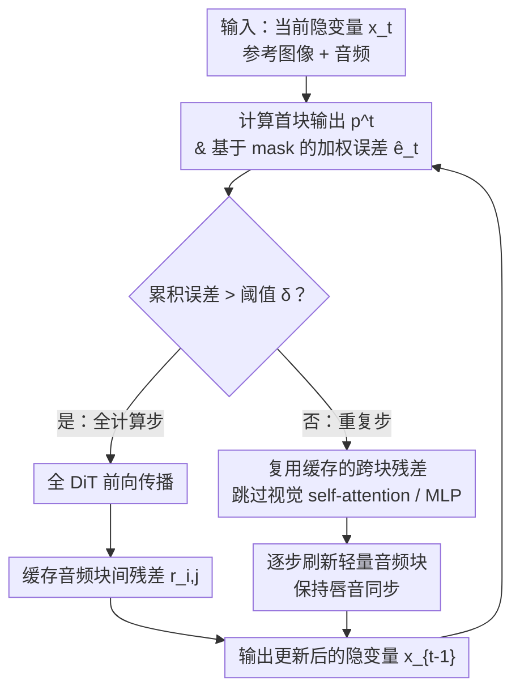

# SyncCache: Exploiting Asymmetric Dynamics for Fast Audio-Driven Portrait Animation

**会议**: ECCV 2026  
**arXiv**: [2606.30849](https://arxiv.org/abs/2606.30849)  
**代码**: 无  
**领域**: 视频理解 / 肖像动画  
**关键词**: 扩散变换器加速, 特征缓存, 音频驱动肖像动画, 模态不对称性, 训练无关加速

## 一句话总结

SyncCache 针对 DiT 架构的音频驱动肖像动画提出一种训练无关的特征缓存加速方案，通过空间非对称探测（SAP）在人脸区域优先触发重新计算、模态解耦缓存（MDC）跳过沉重视觉模块却逐时间步刷新轻量音频模块，以及记忆自适应的离线 DP 缓存规划，在 HunyuanVideo-Avatar 和 Wan-S2V 上分别实现 4.12x 和 3.75x 加速且视觉质量和唇音同步几乎无损。

## 研究背景与动机

DiT 架构大幅提升了肖像动画的视觉保真度和表情可控性，但推理延迟成为实际部署的关键瓶颈。在 8x A800 上生成一段 15 秒视频约需 10 分钟，严重阻碍了创作迭代的效率。训练无关的特征缓存（如 TeaCache、MagCache、TaylorSeer）近年来被证明能有效加速扩散推理，但这类方法主要面向文本到视频生成场景——文本条件是低频的全局信号，缓存策略天然偏好平滑。然而音频驱动的肖像动画中，模态动力学呈现高度不对称性：参考图像提供低频静止的视觉先验（背景、身份），而驱动音频是高频率的局部条件，驱动逐帧的嘴唇与肌肉运动。现有时序级缓存（跳过整个时间步）会打断音频信号的持续注入，导致高频细节严重丢失；而模块级缓存（如 TaylorSeer 系列）为每个模块保存特征图，内存开销从 O(1) 膨胀到 O(L)，在长视频或高分辨率下迅速 OOM。空间维度也存在类似不对称：人的嘴唇、面部肌肉是高频动态区，背景几乎静止，但缓存策略却将探测误差在整张画面上均一对待，错过了在关键时刻触发重新计算以保留精细人脸运动的机会。这些矛盾的根因在于：现有方法假设模态动力学均匀，而肖像动画的动力学本质上是非对称的。**核心 idea：将音频驱动肖像动画中隐含的双重不对称性（空间不对称 + 模态不对称）显式建模到缓存策略中——空间上用人物 mask 加权探测误差以优先保留人脸高频细节，模态上将沉重视觉模块与轻量音频模块解耦，稳定残差复用跳过大计算而音频信号逐时间步刷新。**

## 方法详解

### 整体框架

SyncCache 是一个训练无关的缓存加速框架，专为 DiT 架构的音频驱动肖像动画设计，运行在标准的去噪采样循环中。在每个时间步，它由三个解耦但协同的模块组成：（1）**空间非对称探测**——只计算第一个 DiT 块的输出，用人物 mask 加权的 L1 相对误差判断是否需要触发全前向传播来刷新缓存；（2）**模态解耦缓存**——在触发全计算的参考时间步缓存音频块间的跨块残差，后续重复步跳过沉重的 self-attention / MLP 计算，只恢复残差并刷新轻量音频块；（3）**记忆自适应最优选择**——用一次离线校准计算残差稳定性得分，用 DP 挑选最优的缓存块子集，通过缓存比率 sigma 灵活控制显存占用。三者的时序关系为：探测模块在每个步都运行（只花首块的计算量），当累积误差超过阈值时触发全计算时间步，在该时间步内 MDC 缓存残差、并运行完整音频块；后续重复步依赖缓存的残差跳过视觉大计算。

### 关键设计

**1. 空间非对称探测：用人物 mask 加权误差，在人脸区域优先触发重新计算**

要决定何时缓存、何时重算，需要估计相邻时间步之间的特征时间冗余。现有方法直接用一个全局 L1 相对误差作为探测指标，但在肖像动画中这存在严重缺陷——高频关键变化集中在人脸和嘴唇等人体区域，而背景几乎静止。SyncCache 利用一个先验信息：人物 mask。这个 mask 在很多 DiT 模型中已是标准辅助输入（如 Hallo3、HunyuanVideo-Avatar），对于不含 mask 的模型（如 Wan-S2V），可以用一个轻量人物检测模型在亚秒内提取。将探测误差用 mask 加权：对 mask 内区域乘以权重系数 ω（实验中 ω=2 已足够，2-4 范围鲁棒），使高频人区误差放大，背景误差缩小。这样当人脸区域的动态变化被全局平均淹没时，加权误差会率先超过阈值 δ，强迫模型在该时间步触发全前向传播，从而精确保留嘴唇运动和表情变化。

**2. 模态解耦缓存：跳过沉重视觉模块但逐时间步刷新音频模块，解决模态计算不对称**

SyncCache 的关键观察是：DiT 肖像动画中自注意力与 MLP 层占据超过 99% 的计算量，而音频块（负责注入唇音同步信号）仅占 <1% 但必不可少。更关键的是，音频块之间的跨块残差在不同去噪步之间呈现高度时间稳定性——意味着可以被缓存重复使用而不明显损失质量。基于这一计算与动力学双重不对称，SyncCache 在结构上将两个模态的计算路径解耦：在全计算时间步，缓存音频块 i 到 j 之间的跨块残差；在后续重复步，直接复用缓存的残差来跳过整个沉重的视觉 DiT 计算，同时照常运行轻量音频块。这确保了高频控制信号在每个时间步都得到刷新和同步，而不付出额外计算代价。

**3. 记忆自适应最优选择：离线 DP 规划最优缓存块子集，按显存预算缩放**

虽然模态解耦缓存已经大幅降低了计算量，但它默认缓存在每个音频块边界处的残差，内存开销仍为 O(L_a)（L_a 为音频块数）。对于长视频或在显存受限设备上部署，需要更灵活的内存控制。SyncCache 引入一个连续的缓存比率 σ∈(0,1]，用于指定缓存 n=⌊L_a σ⌋ 个残差边界。但随意选择缓存哪些边界是次优的——不同深度的音频块间的残差时间稳定性波动很大。因此 SyncCache 先将跨块残差的时间不稳定性量化为：

$$\gamma_{i,j} = \sum_{t=0}^{T-1} \frac{\| r_{i,j}^{t} - r_{i,j}^{t+1} \|_1}{\| r_{i,j}^{t+1} \|_1}$$

然后用动态规划从全去噪轨迹中选出使全局时间不稳定性最小的 n 个边界。一个关键发现在于：对于任意给定模型，这个最优缓存路径在不同输入样本（不同音频、不同参考图像）间高度一致——即使是静默样本校准出的路径也与对话样本几乎无差异。因此只要做一次离线校准前向传播（一个样本约几分钟），就可以为任意 σ 提前确定最优缓存计划，在线推理时零开销。

### 损失函数 / 训练策略

SyncCache 完全训练无关，不引入任何额外的训练损失或微调步骤。所有参数（探测阈值 δ、人体加权系数 ω、缓存比率 σ）均为推理时可调的超参数，无需重新训练模型。

## 实验关键数据

### 主实验

| 模型配置 | 指标 | Baseline (50步) | TeaCache 2.25x | MagCache 2.30x | CGCache 3.18x | SyncCache-slow 3.34x | SyncCache-fast 4.12x |
|---------|------|----------------|----------------|----------------|---------------|----------------------|----------------------|
| HunyuanVideo-Avatar | LPIPS↓ | - | 0.1730 | 0.1696 | 0.1848 | **0.1016** | 0.1172 |
| | SSIM↑ | - | 0.8428 | 0.8455 | 0.8249 | **0.8618** | 0.8493 |
| | FID↓ | 25.27 | 26.83 | 26.43 | 27.75 | **25.65** | 26.89 |
| | Sync-C↑ | 6.963 | 6.842 | 6.830 | 6.814 | **6.944** | 6.902 |

| 模型配置 | 指标 | Baseline (40步) | TeaCache 2.93x | MagCache 2.96x | DiCache 2.99x | SyncCache 3.75x |
|---------|------|----------------|----------------|----------------|---------------|------------------|
| Wan-S2V | LPIPS↓ | - | 0.1863 | 0.1839 | 0.1835 | **0.1775** |
| | PSNR↑ | - | 19.04 | 19.46 | 19.43 | **19.80** |
| | Sync-C↑ | 6.712 | 6.678 | 6.709 | 6.716 | **6.791** |
| | Sync-D↓ | 8.632 | 8.642 | 8.641 | 8.614 | **8.541** |

SyncCache 在两项模型上的视觉质量和音频同步指标全面超越现有方法。值得注意的是，TaylorSeer 系列（模块级缓存）在 8 卡 A800 上直接 OOM，印证了 O(L) 模块级缓存策略在大规模模型上的显存瓶颈。SyncCache-fast 在 4.12x 加速下仍维持接近无损的 Sync-C（6.902 vs 原始 6.963），而 TeaCache 和 MagCache 在 2.3x 时已经出现明显下降。

### 消融实验

| 配置 | LPIPS↓ | SSIM↑ | Sync-C↑ | 延迟(s) | 说明 |
|------|--------|-------|---------|---------|------|
| Full model | **0.1016** | **0.8618** | **6.944** | 157 | 完整 SyncCache |
| w/o SAP | 0.1259 | 0.8534 | 6.867 | 161 | 去掉空间非对称探测（退化为均一探测） |
| w/o MDC | 0.1571 | 0.8437 | 6.822 | 156 | 去掉模态解耦缓存（两个模态同时缓存/计算） |

| 记忆自适应选择 | LPIPS↓ | Sync-C↑ | 说明 |
|---------------|--------|---------|------|
| DP 优化 (σ=0.4) | 0.1016 | 6.944 | 离线 DP 选择最优边界 |
| w/o DP (随机选) | 0.1369 | 6.847 | 随机选择缓存边界 |
| 静默样本校准 | 0.1021 | 6.932 | 用几乎无唇动的样本校准 |

### 关键发现

- **模态解耦是唇音同步的关键**：去掉 MDC（即视觉块和音频块同步缓存）导致 Sync-C 从 6.944 跌至 6.822，说明逐时间步刷新音频信号对保持高精度唇音同步必不可少。
- **空间非对称探测主要护视觉质量**：去掉 SAP 使 LPIPS 从 0.1016 升至 0.1259，意味着没有 mask 加权的探测易在高频人区漏过关键变化。
- **DP 优化效果显著**：随机选择缓存边界比 DP 优化劣化明显（LPIPS 从 0.1016 升至 0.1369），且不同校准样本几乎无影响——即使静默样本也可校准出高质量缓存计划。
- **时序级缓存加速存在上限**：TeaCache/MagCache 在 2.3x 附近饱和，而 SyncCache 可达 4.12x 且视觉听觉同步更好。

## 亮点与洞察

- **双重不对称性建模是核心洞察**：不将缓存视为通用加速技术，而是深挖目标任务的领域结构——空间上人与背景不对称、模态上视觉与音频不对称——将领域先验编码进缓存决策，比通用缓存方案在肖像动画上提升显著。
- **离线校准+在线零开销的设计精妙**：通过发现跨块残差稳定性在不同输入间高度一致，将复杂的 NP-hard 缓存规划问题转化为一次离线 DP 求解，在线推理时零额外开销，这比需要在推理时动态评估的方法（如 TeaCache 的在线累积误差估计）效率更高。
- **缓存比率 σ 作为连续控制旋钮**：在显存和速度之间提供连续的 trade-off 调节，一个参数即可适配从短 demo 到长视频、从高端 GPU 到边缘设备的不同场景，实用性强。
- **软 mask 而非硬裁剪**：SAP 使用软乘法 mask 而非硬裁剪，当 mask 检测失败时自然退化为均匀探测，鲁棒性好。
- 该方法直接适用于现有 DiT 肖像动画模型，无需任何微调或架构修改，即插即用。

## 局限与展望

- 当前依赖于 mask 的可用性（或额外检测模型），在检测困难场景（大量遮挡、极端角度）下 mask 精度下降可能导致加速退化。
- 缓存路径基于一次离线校准假设模型结构固定，对于使用动态计算图或推理时切换架构的场景不再适用。
- 方法的有效性验证在两个主流模型（HunyuanVideo-Avatar、Wan-S2V）上，在更多 DiT 肖像动画模型上的泛化性有待验证。
- 当前仍处理「训练无关」加速，若允许轻量微调，或许可将缓存决策进一步与模型参数联合优化，在更激进加速比下保持质量。

## 相关工作与启发

- **vs TeaCache / MagCache**：时序级缓存方法通过多项式估计或幅度感知策略决定跳过完整时间步，未考虑模态不对称，在音频驱动场景下高频信号丢失明显。SyncCache 通过模态解耦保持音频连续性。
- **vs TaylorSeer / SpeCa / ClusCa**：模块级缓存方法为每个模块独立预测或缓存特征，显存开销 O(L)，在大模型上 OOM。SyncCache 只缓存跨音频块的残差，内存开销可由 σ 控制在 O(1) 到 O(L_a) 之间。
- **vs Delta-DiT / HiCache**：通过增量更新或更优的数学基（Hermite 多项式）改进特征预测精度，但同样未对非对称模态建模。SyncCache 的领域感知设计是互补的，未来或许可将二者结合。
- **与通用加速方法的差距**：SyncCache 的领域特定性是双刃剑——在肖像动画上大幅超越通用方案，但无法直接迁移到文本到视频或图像生成，其核心启发在于：针对具体任务结构做缓存策略的领域特异性设计，可能比通用优化赢得更大的收益空间。

## 评分

- 新颖性: ⭐⭐⭐⭐⭐ [将扩散缓存加速从通用域扩展到音频驱动肖像动画，首次建模双重非对称动力学，领域感知缓存的设计思路具有启发性]
- 实验充分度: ⭐⭐⭐⭐⭐ [在两个主流模型、多个指标上对比众多基线，消融实验完整覆盖三个核心组件，记忆自适应选择的鲁棒性分析到位]
- 写作质量: ⭐⭐⭐⭐⭐ [动机展开清晰，非对称动力学概念从 problem formulation 到 method design 贯彻一致，图表完整且具说明力]
- 价值: ⭐⭐⭐⭐⭐ [实际加速效果显著（4.12x），无需训练即插即用，对 DiT 推理部署有直接实用价值；领域感知缓存的方法论可启发其他多模态生成任务]

<!-- RELATED:START -->

## 相关论文

- [\[CVPR 2025\] MoEE: Mixture of Emotion Experts for Audio-Driven Portrait Animation](../../CVPR2025/human_understanding/moee_mixture_of_emotion_experts_for_audio-driven_portrait_animation.md)
- [\[CVPR 2025\] Sonic: Shifting Focus to Global Audio Perception in Portrait Animation](../../CVPR2025/human_understanding/sonic_shifting_focus_to_global_audio_perception_in_portrait_animation.md)
- [\[ECCV 2026\] Self-supervised Garment Dynamics with Persistent Wrinkles](self-supervised_garment_dynamics_with_persistent_wrinkles.md)
- [\[CVPR 2026\] DeX-Portrait: Disentangled and Expressive Portrait Animation via Explicit and Latent Motion Representations](../../CVPR2026/human_understanding/dex-portrait_disentangled_and_expressive_portrait_animation_via_explicit_and_lat.md)
- [\[CVPR 2026\] PC-Talk: Precise Facial Animation Control for Audio-Driven Talking Face Generation](../../CVPR2026/human_understanding/pc-talk_precise_facial_animation_control_for_audio-driven_talking_face_generatio.md)

<!-- RELATED:END -->
