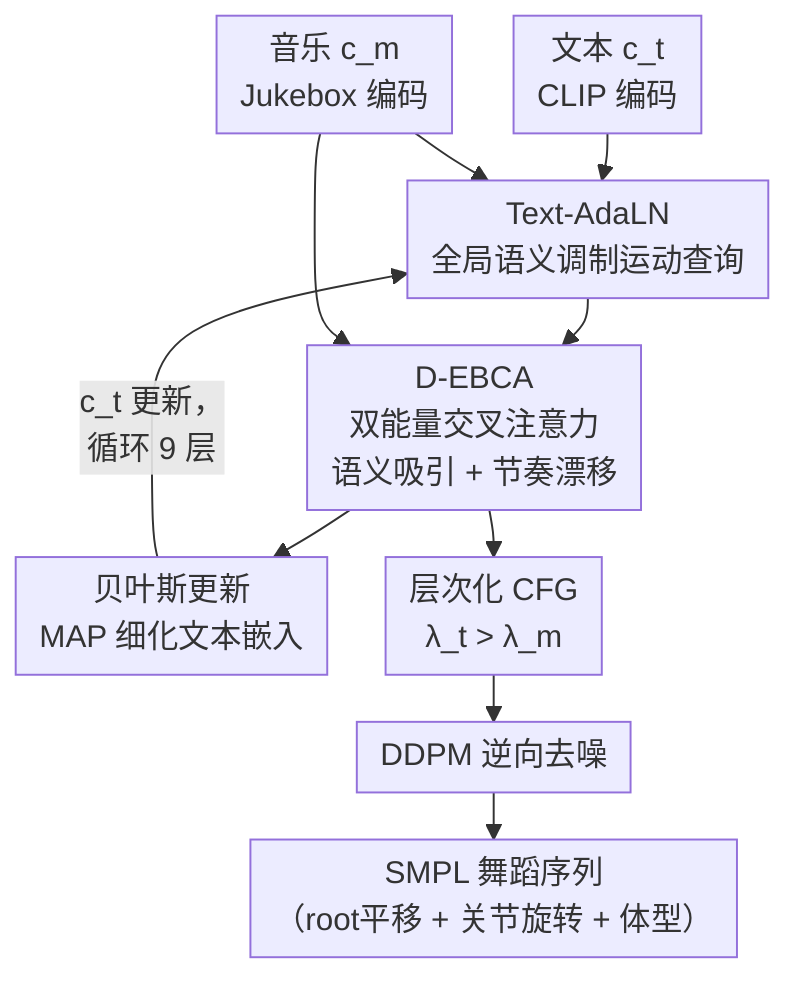

# Text Dictates, Music Decorates: Energy-based Attention for Editable Dance Motion Generation

**会议**: ECCV 2026  
**arXiv**: [2606.22726](https://arxiv.org/abs/2606.22726)  
**代码**: [https://github.com/SeongJong-Yoo/STREAM](https://github.com/SeongJong-Yoo/STREAM)  
**领域**: 人体理解 / 舞蹈动作生成  
**关键词**: 舞蹈动作生成, 能量注意力, 模态解耦, 扩散Transformer, 文本可控编辑

## 一句话总结

STREAM 提出双模态解耦的能量注意力机制 BEAM，让文本控制舞蹈动作的语义结构（"做什么动作"）、音乐仅装饰其时间节奏（"何时做"），通过数学上保证的层次化无分类器引导解决文本-音乐联合生成中的模态坍塌问题，并在新标注的 Motorica++ 数据集上达到 SOTA。

## 研究背景与动机

舞蹈动作生成一直是人机智能协作的前沿难题。与日常人体运动（行走、挥手）不同，舞蹈具有精确的节拍对齐要求、高度结构化的身体姿态约定（dance technique），以及丰富多样的风格变化。现有模型已经能从音乐生成逼真的舞蹈序列，但其内部几乎是一个黑箱——编舞者无法告诉模型"我想做 Charleston 交叉步"，只能靠换音乐或改流派标签来间接影响输出。这种缺乏语义控制的设计使得 AI 难以成为真正的创作伙伴。

问题的根源在于当前多模态生成模型的一个共性顽疾：**模态坍塌（Modality Collapse）**。当标准交叉注意力架构同时接收文本和音乐两种条件时，音频中密集的节拍信号（每秒数十个 beats）会淹没文本稀疏的高层语义信号（整段舞蹈可能只有一句话的描述），导致网络完全忽略用户输入的文本指令，退化为纯音乐驱动的舞蹈生成。泛化到训练集外的零样本场景（例如让快速街舞配合慢速爵士乐）时，这一问题更加严重——模型要么完全追随音乐节奏抛弃语义，要么死板地执行语义而完全无视节奏变化，没有"在保持舞蹈技术不变的情况下按音乐节拍调整"的中间能力。

STREAM 的切入角度是：既然文本和音乐在舞蹈生成中扮演根本不同的角色，就应该在架构上显式地解耦它们的通路。文本全局性规定"身体的骨架在空间上怎么摆"（运动学结构），音乐局部性告诉"这些动作什么时候做"（时间节奏），两者不应通过同一个交叉注意力层竞争融合。**核心 idea：将舞蹈生成的条件通路严格分离，文本通过 Adaptive Layer Normalization 全局注入以定义语义运动学流形，音乐通过新的双模态能量注意力模块（BEAM）以梯度漂移的方式局部调制时序对齐，在数学上保证音乐"装饰"但不"覆盖"用户语义指令。**

## 方法详解

### 整体框架

STREAM 以 DDPM 扩散 Transformer 为骨架，将文本和音乐分别编码后送入堆叠的双模态能量注意力模块（BEAM），通过三层子模块的迭代处理实现语义可控、节奏对齐的舞蹈生成。整体流程为：文本（高层概念如"Charleston" + 详细描述如"一脚交叉至另一脚后方"）经 CLIP 文本编码器得到文本嵌入 $c_t$；音乐经 Jukebox 编码器得到帧级音乐嵌入 $c_m$；随机噪声与条件嵌入进入 9 层 BEAM，每层依次执行 Text-AdaLN（全局语义调制）、D-EBCA（双能量交叉注意力）和贝叶斯更新（MAP 估计细化文本嵌入）；最后通过层次化无分类器引导（Hierarchical CFG）确保先建立语义流形再施加节奏修饰，经 DDPM 逆向去噪输出 SMPL 参数化的舞蹈动作序列。

### 关键设计

**1. 双模态能量注意力 BEAM：将注意力重新解释为能量最小化**

BEAM 是整个系统的核心，它将标准交叉注意力重新定义为能量最小化过程。在传统注意力中，查询 $Q$ 与键 $K$ 求相似度后加权聚合值 $V$；而 BEAM 认为这一过程等价于最小化一个关于 $Q$ 的能量函数，并将文本和音乐以不同的能量项纳入同一优化框架。

具体地，BEAM 定义的能量函数包含三个关键项。第一项是语义吸引项 $-\frac{1}{\beta}\sum_l\text{lse}(A_l,\beta)$，其中 $A = QK_t^\top + \gamma_m QK_m^\top$ 同时纳入了文本和音乐对 $Q$ 的影响。这一项的梯度优化对应标准的 Softmax 注意力，结果被称为"Dual Attractor"——它同时被文本和音乐吸引，但文本是主吸引子。第二项是音乐对齐能量 $\mathcal{R}(Q,K_m) = -\sum_{i,j}(S_m)_{i,j} \cdot (q_i^\top q_j)$，其中 $S_m$ 是音乐嵌入的自相似度矩阵；由于舞蹈动作天然带有节拍内嵌，通过惩罚预测动作的帧间相似度与音乐的自相似度之间的差异，迫使动作的节奏结构与音乐一致。这一项的梯度给出"Music Alignment Drift"——一个将 $Q$ 拉向音乐节奏方向的梯度漂移项。第三项是 L2 正则项，防止数值爆炸。

最终的查询更新为 $Q_{new} = \text{Softmax}(A/\sqrt{d})V_t - \gamma_d \nabla_Q\mathcal{R}(Q,K_m)$。前一项 Dual Attractor 保证文本语义被遵循，后一项 Music Alignment Drift 保证节奏对齐，**两者的量级由 hyperparameter $\gamma_d$ 控制，而非由注意力 logits 的自然幅值竞争**——这就是 BEAM 能够在数学上防止模态坍塌的根本原因：音乐不是通过"争夺注意力权重"来影响输出，而是作为一个显式的独立梯度信号附加在文本驱动的注意力之上。

**2. 层次化无分类器引导：先语义后节奏的推理策略**

标准 CFG 在推理时用一个引导系数 $\lambda$ 拉近条件分布、推远无条件分布。STREAM 将其扩展至双条件场景：$\hat{x}_{t-1} = \hat{x}_\theta(x_t) + \lambda_t(\hat{x}_\theta(x_t,c_t) - \hat{x}_\theta(x_t)) + \lambda_m(\hat{x}_\theta(x_t,c_t,c_m) - \hat{x}_\theta(x_t,c_t))$，其中 $\lambda_t > \lambda_m$。这一设计的关键洞察是：先通过较大的 $\lambda_t$ 将运动锁定到文本指定的语义流形上，再通过较小的 $\lambda_m$ 在该流形上微调节拍对齐。如果反过来或等权重使用，音乐信号可能在语义流形尚未建立时就施加扰动，导致模式坍塌。实验表明，当 $\lambda_t = \lambda_m$ 时，BAS 反而下降——因为节奏信息干扰了语义结构的建立。

**3. 非对称贝叶斯更新：文本精细化的同时冻结音乐**

文本条件是抽象的高层描述，在扩散早期阶段高度欠定（例如"跳一支欢快的舞"在第一步噪声中对应无数种可能）。随着去噪进行、运动逐渐成形（例如定位到"Charleston cross step"），文本嵌入应当也随之聚焦到该具体模式。STREAM 通过 MAP 估计对文本嵌入进行贝叶斯更新：$\nabla_{K_t}\log p(K_t|Q,K_m) = -(\nabla_{K_t}E(Q;K_t,K_m) + \nabla_{K_t}E(K_t))$，包含一个朝向 $Q$ 的吸引项和一个防止坍缩的斥力项，由超参 $\delta_a$ 和 $\delta_r$ 控制。

一个至关重要的设计选择是**不对称策略**：仅更新文本嵌入，而不更新音乐嵌入。点在于文本提供的是抽象的全局语义，在被具体运动实例化后可以（也应该）细化；而音乐提供的是严格的、细粒度的时问锚点——如果也通过 MAP 更新音乐嵌入，模型倾向于把音乐拉到当前生成的运动上去，而非强制运动去适应真实的乐拍，这反而会劣化 BAS 和整体生成质量。实验证实，对称更新策略 (`c_m` update) 下的 BAS 从 0.2528 降至 0.2372，佐证了"冻结音乐、只更新文本"的必要性。

### 损失函数 / 训练策略

主要损失是 DDPM 的去噪 $L_2$ 损失：$\mathcal{L}_m = \mathbb{E}_{x_0,t}[\|x_0 - \hat{x}_\theta(x_t,t,c_t,c_m)\|_2^2]$。此外引入三个辅助损失改善物理合理性：关节位置损失 $\mathcal{L}_j$（前向运动学后的关节位置与 GT 的 MSE）、滑步损失 $\mathcal{L}_f$（脚触地时速度应为零，惩罚脚部与地面的滑动）、速度损失 $\mathcal{L}_v$（预测运动与 GT 运动的帧间速度一致性）。训练时随机以概率 $p_{cfg_t}, p_{cfg_m}$ 掩码文本和音乐条件以支持 CFG。

## 实验关键数据

### 主实验

| 数据集 | 模态 | FIDk↓ | FIDg↓ | BAS↑ | S_text↑ | S_music↑ | EDS↑ |
|--------|------|-------|-------|------|---------|----------|------|
| AIST++ | A | **29.58** | **11.54** | 0.2312 | - | - | - |
| Motorica++ | A+T | **7.32** | **6.87** | **0.2528** | **1.0** | **0.4870** | **0.6539** |
| vs EDGE (A, Motorica++) | A | 67.52 | 18.34 | 0.2052 | 0.8318 | 0.3904 | 0.5272 |
| vs TM2D* (A+T) | A+T | 126.46 | 570.84 | 0.2744 | 0.8391 | 0.4625 | 0.5952 |
| vs UniMuMo (A+T) | A+T | 28.10 | 169.14 | 0.2360 | 0.7514 | 0.3945 | 0.5162 |

注：AIST++ 无文本标注，仅报告音频条件结果。Motorica++ 结果中 STREAM (A+T) 在 EDS 上显著优于所有基线，说明其在"语义保存 + 节奏适应"的联合任务上达到了最优平衡。

### 消融实验

| 配置 | FIDk↓ | BAS↑ | 说明 |
|------|-------|------|------|
| Full model (γm=1.0, γd=1.0) | 7.32 | **0.2528** | 完整 BEAM |
| Abl-4 (γm=0, γd=0) | 10.38 | 0.2301 | 仅文本条件，无音乐影响 |
| w/o Norm (不归一化 Music Drift) | 10.37 | 0.2251 | 梯度爆炸导致生成质量骤降 |
| w/o AdaLN | 7.79 | 0.2285 | 不注入全局文本，BAS 大降（模型转而过度依赖音乐） |
| c_m update（对称更新音乐） | 7.16 | 0.2372 | 更新音乐嵌入后 BAS 下降 |
| Cross-Attention + AdaLN | 236.88 | 0.2327 | 标准交叉注意力严重模态坍塌 |
| δa=0.002, δr=0.002 | 7.32 | 0.2528 | 最优贝叶斯更新速率 |

### 关键发现

- **模态坍塌可被量化验证**：标准 Cross-Attention + AdaLN 的 EDS 仅 0.5641，远低于 STREAM 的 0.6539，说明直接在 logits 层面融合文本和音乐会导致语义被节奏覆盖——这正是"模态坍塌"的直接证据。
- **Music Drift 必须归一化**：去掉梯度归一化后，BAS 从 0.2528 降至 0.2251，FIDk 从 7.32 升至 10.37，说明不归一化会导致梯度幅值爆炸和高频噪声注入，破坏扩散过程的稳定性。
- **文本贝叶斯更新速率敏感**：δa, δr 过大（0.1）时 FID 骤升至 50+，过小（0）时生成质量微降但 BAS 略低，最优为 0.002。说明 MAP 更新在扩散早期不能过度修正，否则文本嵌入会偏离语义流形。

## 亮点与洞察

- **把"注意力"还原为"能量最小化"**是 BEAM 最有品味的设计：不是发明新架构再去解释，而是拿 Hopfield 网络的能量观点重新审视已有的交叉注意力操作，自然导出将音乐作为梯度修正项附加的数学形式——这让模态解耦不再是工程 hack，而有理论基础。
- **非对称更新策略的反直觉发现**：直觉上文本和音乐应当对称处理（都是条件，都该在生成过程中动态调整），但实验证明更新音乐会适得其反。原因是音乐是刚性时问锚点，一旦变成变量它会被拉向当前生成的运动，而非反过来。这个发现对任何需要精确对齐的多条件生成任务都有启发。
- **Editable Dance Score 的设计**：用冲突文本-音乐对（如"慢速动作 × 快节奏音乐"）来评估零样本可编辑性，比单纯在匹配对上的 BAS + FID 更能反映真实可控性。其核心思想——用谐波均值平衡语义和节奏两个对抗目标——可推广到其他多条件生成评测。

## 局限与展望

- 目前仅支持单人舞蹈生成。真实编舞场景常涉及多人空间队形、协同节奏和交互动作。将 STREAM 扩展为多人生成是作者承认的首要方向。
- 97 个经过专业标注的 Motorica++ 序列（4.62 小时）规模较小，虽然质量高但域覆盖有限（8 种风格）。更大规模的专业舞蹈-文本数据集会进一步提升泛化能力。
- BEAM 的 9 层堆叠使模型参数量达 91.9M，在推理时需要联立 Dual Attractor 和 Music Drift 两个梯度项，计算开销不低。能否通过蒸馏或减少层数在精度-效率间取得更好平衡值得探索。
- EDS 中 S_text 用 TMR CLIP score 作为代理，当 S_text=1.0 时是否是 metric saturate 而非真正完美匹配？作者在补充材料中提及这是"distribution ceiling"而非 metric defect，但这一现象的本质仍需进一步解耦分析。

## 相关工作与启发

- **vs EDGE**: EDGE 用 Jukebox 条件化的扩散 Transformer 生成舞蹈，但仅支持音乐驱动，无法接收文本指令。STREAM 的 BEAM 在保持 EDGE 级节奏对齐的基础上，通过 Text-AdaLN 和 D-EBCA 增加了文本语义控制。
- **vs TM2D**: TM2D 使用 VQ-VAE + 窗口级后期融合同时接受文本和音乐，但文本和音乐特征在窗口层面冲突，导致纯文本条件反而跑得更好。STREAM 的解耦策略避免了此问题。
- **vs EnergyMoGen**: EnergyMoGen 将人体动作生成还原为能量景观的合成，但聚焦于日常动作且仅有文本条件。STREAM 延续了其能量注意力思路，但扩展出双模态能量函数和显式音乐对齐项。

## 评分

- 新颖性: ⭐⭐⭐⭐⭐ 将能量注意力框架扩展至双模态解耦、层次化 CFG 和非对称更新三个维度均有独立创新，且三者围绕同一核心问题（模态坍塌）构成闭环。
- 实验充分度: ⭐⭐⭐⭐⭐ 覆盖 AIST++ 和 Motorica++ 双数据集，与 10+ 基线对比，包含模态维度的消融（A-only / T-only / A+T）、超参探索、架构对比（Cross-Atten/Concat/Late Fusion）和 EDS 量化评估，论证链条完整。
- 写作质量: ⭐⭐⭐⭐ 开篇痛点具象（模态坍塌）、方法推导清晰（从 EBM → Hopfield → D-EBCA 一步步引出），但补充材料中的公式推导偏长，正文的 EDS 定义可更精简。
- 价值: ⭐⭐⭐⭐⭐ "让 AI 成为编舞者的工具而非替代者"的定位准确，BEAM 的非对称设计理念可推广至任何需要同时满足"刚性约束 + 可变指令"的生成任务。

<!-- RELATED:START -->

## 相关论文

- [\[ICCV 2025\] MDD: A Dataset for Text-and-Music Conditioned Duet Dance Generation](../../ICCV2025/human_understanding/mdd_a_dataset_for_text-and-music_conditioned_duet_dance_generation.md)
- [\[ECCV 2026\] Reweighting Framewise Attention in Video Transformers for Facial Expression Understanding](reweighting_framewise_attention_in_video_transformers_for_facial_expression_unde.md)
- [\[ECCV 2026\] UniMotion: A Unified Framework for Motion-Text-Vision Understanding and Generation](unimotion_a_unified_framework_for_motion-text-vision_understanding_and_generatio.md)
- [\[CVPR 2026\] Towards Decompositional Human Motion Generation with Energy-Based Diffusion Models](../../CVPR2026/human_understanding/towards_decompositional_human_motion_generation_with_energy-based_diffusion_mode.md)
- [\[ECCV 2026\] FlowerDance: MeanFlow for Efficient and Refined 3D Dance Generation](flowerdance_meanflow_for_efficient_and_refined_3d_dance_generation.md)

<!-- RELATED:END -->
