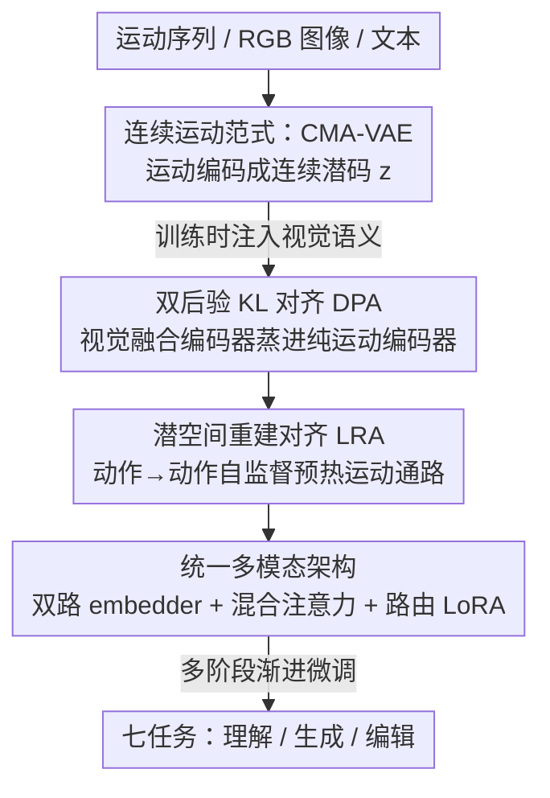

# UniMotion: A Unified Framework for Motion-Text-Vision Understanding and Generation

**会议**: ECCV 2026  
**arXiv**: [2603.22282](https://arxiv.org/abs/2603.22282)  
**代码**: [https://wangzy01.github.io/UniMotion](https://wangzy01.github.io/UniMotion)  
**领域**: 人体理解 / 多模态VLM  
**关键词**: 人体动作生成, 三模态统一, 连续运动表征, 跨模态对齐, 运动 VAE

## 一句话总结
UniMotion 把人体运动当作与 RGB 平权的**连续**模态塞进一个共享 LLM，用连续运动 VAE（CMA-VAE）+ 双路 embedder 替代离散 token，配合双后验 KL 对齐（DPA）注入视觉语义先验、潜空间重建对齐（LRA）解决运动通路冷启动，在 Motion-Text-RGB 三模态的理解、生成、编辑七个任务上做到统一并全面 SOTA。

## 研究背景与动机
统一多模态大模型这两年在「文本+图像」的联合理解与生成上已经相当能打——Show-o、Janus-Pro、Show-o2 这类工作把一个 Transformer 同时用于自回归理解和扩散生成，在共享语义空间里做跨模态推理。但人体运动这个高价值的动态模态一直被排除在统一框架之外：运动序列编码了游戏动画、具身智能、VR、医疗康复、隐私友好的行为分析都离不开的时间动态与空间结构，可至今没有一个框架能把 Motion-Text-RGB 三模态统一、还同时支持理解和生成。现有工作各做各的半张拼图：MotionGPT 用 VQ-VAE 把运动 token 化，实现了 Motion↔Text 的统一，却完全看不懂也画不出图像；UniPose 把人体姿态并进视觉语言模型，可它只处理单帧静态姿态估计和图像理解，没有生成能力。

更麻烦的是，这两条线**都依赖离散 token 化**。VQ 量化不可逆地损失信息，会给运动引入时间抖动、破坏结构保真度、还会因码本坍缩限制多样性；而且离散 token 和连续 RGB 特征空间之间天然不对称，跨模态对齐格外别扭。论文的补充材料把这一点量化得很直白：VQ-VAE 重建的绝对位置误差高达 17.15 cm，手腕这类末端关节的误差更是飙到 210+ mm，还在高频段注入了肉眼可见的抖动伪影。所以真正的核心矛盾是——要在一个模型里统一三模态的理解与生成，就必须让运动这个「有骨架拓扑、有运动学约束、又是密集动态」的模态，和 RGB 站在同一个表征形态上，可离散化恰恰把它推到了 RGB 的对立面。

本文的切入角度是：既然 RGB 在统一框架里走的是连续潜空间通路，那就别再把运动 token 化，而是给它也铺一条**对称的连续通路**，让跨模态对齐在架构层面自然发生。**核心 idea 是把运动当作与 RGB 完全平权的连续模态**——用连续的 CMA-VAE 编码运动、用对称双路 embedder 构建并行连续通路，从架构上根除量化误差，再用 DPA 把视觉语义蒸进运动编码器、用 LRA 自监督预热运动通路，最终在共享 LLM 里统一三模态的理解与生成。

## 方法详解

### 整体框架
UniMotion 的目标是在一个模型里同时支持 T2M（文生动作）、M2T（动作生成描述）、动作预测、动作编辑、Vision-to-Motion（图像恢复动作）、Vision-to-Text、以及 Motion-guided Image Editing（运动引导图像编辑）这七个任务。它基于 Show-o2 1.5B 骨干，核心思路一句话：**运动和图像都编码成连续潜表征、走对称的双路通路、进同一个 LLM 骨干、再由各模态专属的 flow head 解码生成**。

整条管线分三块。第一块是 **CMA-VAE**：把变长运动序列压成连续低维潜码 $z$，并在训练时通过 DPA 把配对图像的视觉语义悄悄注入运动编码器（推理时图像分支整个丢掉，零开销）。第二块是**统一多模态架构**：双路 embedder 把 $z$ 拆成「语义抽象」和「细节保留」两支送进 LLM，混合注意力 + 模态路由 LoRA 让运动和文本/RGB 在共享参数上各自适配，各模态专属 flow head 在对应潜空间预测速度场。第三块是 **LRA**：在所有下游任务之前，先用「动作→动作」自监督把运动通路（embedder + flow head + 运动 LoRA）预热校准，再做多阶段渐进微调。

### 关键设计

**1. 连续运动范式与 CMA-VAE：让运动和 RGB 站在同一个表征形态上**

这一步直接冲着离散 token 化的两个死穴去：量化不可逆损信息、离散 token 和连续 RGB 空间对不齐。UniMotion 的做法是用一个连续 VAE 把运动序列编成低维潜码，逐帧经线性映射 + 可学习位置编码 + SkipTransformer 编码器，输出高斯参数并重参数化采样得到 $z\in\mathbb{R}^{T_z\times d}$。这样运动的时间连续性和结构保真度得以保留，更关键的是——连续运动潜码和连续 RGB 潜码**共享对称的表征形态**，跨模态对齐可以在架构层面自然发生，而不用像离散方法那样硬凑。补充实验里 CMA-VAE 的重建误差（APE=3.53 cm）比 VQ-VAE（17.15）和普通 MLD-VAE（9.28）都低一个量级，末端关节误差几乎和躯干持平，频域残差全频段最低，这些都印证了「连续 + 跨模态锚定」既保住了全局姿态又保住了远端关节的高频细节。

但光是连续还不够，普通运动 VAE（如 MLD-VAE）孤立地编码运动，潜空间没有视觉语义结构。CMA-VAE 的「Cross-Modal Aligned」正体现在它天生是跨模态的：一个推理用的**纯运动编码器** $q_\phi(z\mid\mathbf{m})$ 通过后验对齐耦合到一个训练时的**视觉融合编码器** $q_\psi(z\mid\mathbf{m},\mathbf{v})$——这就引出了下面的 DPA。

**2. 双后验 KL 对齐（DPA）：训练时借视觉语义、推理时只吃运动**

痛点很具体：想让运动潜空间带上视觉语义（比如合理的身体构型、全局平衡感），最直接的办法是训练时喂配对图像，可推理时用户往往只给运动、没有图像。DPA 的机制是分头训练两个编码器——视觉融合编码器把 RGB 图像经冻结的 HRNet 提特征，再在**运动骨架投影出的 2D 关节位置**上做双线性网格采样（`GridSample(HRNet(v), j_2d(m))`），这样视觉特征是精准取在身体相关区域、而非全图，天然带跨模态敏感性——然后约束纯运动编码器的后验去逼近视觉融合后验，让前者在训练时把视觉语义「吸收」进参数。总目标是重建损失 + 双路 KL 正则 + 对齐损失三项，对齐项只对有配对图像的样本（如 Human3.6M）计算，没配对图像的数据集（如 HumanML3D）直接丢掉这一项，非常灵活。

对齐损失本身是两个对角高斯之间的 KL，且把视觉融合后验 $q_\psi$ detach 当固定教师：

$$\mathcal{L}_{\mathrm{align}}=D_{\mathrm{KL}}\bigl(q_{\phi}(z\mid\mathbf{m})\,\|\,q_{\psi}(z\mid\mathbf{m},\mathbf{v})\bigr)$$

这里方向选得很讲究：在「学生→教师」的蒸馏惯例下这是 **reverse KL**，性质是 mode-seeking——它逼着 $q_\phi$ 收缩到 $q_\psi$ 最显著的几个语义模态上，产出紧凑、高置信的运动表征，同时自然滤掉与运动语义无关的视角相关视觉噪声。反过来用 forward KL 会 mode-covering，强迫 $q_\phi$ 覆盖 $q_\psi$ 的所有模态（含噪声模态），导致后验过度弥散、方差被高估、表征精度被稀释。因为两个编码器前端参数共享，DPA 在 H36M 上算出的梯度还能**间接改善 HumanML3D**——这解释了为什么去掉 DPA 后连纯文本任务 T2M 都会掉点（R@3 0.841→0.818），哪怕 HumanML3D 根本没有配对图像。

**3. 统一多模态架构：双路 embedder + 混合注意力 + 模态路由 LoRA 把运动接进 Show-o2**

CMA-VAE 产出的连续潜码 $z$ 进 LLM 前要过一个双路 embedder，这是本文架构对称性的关键。它并行走两支：**语义支**（MLP + Transformer 编码器）抽高层语义，对标视觉侧的 SigLIP；**生成支**（MLP + 可学习位置编码）直接把 $z$ 映到 LLM 隐维、保留细粒度运动细节，对标视觉侧的 PatchEmbed。两支拼接后经 RMSNorm+MLP 融成统一表征，所有任务都用融合嵌入。这套「语义抽象 / 细节保留」的解耦对运动条件生成（编辑、预测）尤其关键——源运动既要提供高层结构条件、又要提供关节级细节，单支都做不到。补充实验里只留生成支或只留语义支都明显不如双路：语义支 M2T BertScore 更高、生成支 T2M/编辑更好，二者功能互补而非冗余，尤其编辑和预测任务上双路的差距最大。

进 LLM 后还有两个巧思。**混合注意力**在序列级保持全局因果顺序（照顾文本自回归），但在每个运动 span 内部开双向全注意力——这是为了迁就 flow matching 目标（要在整段运动潜码上同时预测速度场），同时严格保证运动/图像 token 只能看自己 span 内 + span 之前的 token，不泄露未来信息。**模态路由 LoRA** 给每个注意力层的 Q/K/V/O 挂两支低秩分支：Text/RGB 一支、Motion 一支，靠确定性的模态掩码路由（模态身份从序列构造时就已知），只加约 2% 参数就实现模态专属适配，还避开了 MoE-LoRA 那种需要负载均衡损失、带路由噪声的麻烦。此外 RGB 通路额外挂了一个冻结的姿态感知视觉骨干（从 TokenHMR 初始化），提供身体结构感知特征补充 SigLIP 的全局语义，与运动侧双路保持对称。

**4. 潜空间重建对齐（LRA）：用密集运动潜码解决运动通路冷启动**

DPA 预训练完，运动通路其实还没校准——embedder、运动 flow head、运动 LoRA 三者尚未联合对齐，直接上多任务训练会明显掉点（T2M R@3 只有 0.801，vs 最终 0.841）。病根在于**监督失配**：模型要生成的运动是密集且运动学丰富的，可它学习信号来源的文本却稀疏得多（一句话只描述粗略动作语义，跨步幅度、肢体协同、细微时序过渡全被略去），从这种欠定信号里学生成通路只会得到模糊、不稳、保真度差的结果。而 CMA-VAE 的潜码 $z$ 本身就是模型自己的、无损的、密集的运动编码——它的自重建是一个明确的一对一映射，是预热运动通路的理想零成本信号。

于是 LRA 设计了一个「动作→动作」（M2M）自重建任务：CMA-VAE 编出 $z$，双路 embedder 把 $z$ 投进 LLM，LLM 隐状态经运动 flow head 从噪声里重建 $z$：

$$\mathcal{L}_{\mathrm{M2M}}=\mathbb{E}_{z_0\sim\mathcal{N}(0,I),\,t}\bigl[\|v_\theta(z_t,t\mid\mathrm{Embed}_{\mathrm{fused}}(z))-(z-z_0)\|^2\bigr]$$

其中 $z_t=t\cdot z+(1-t)\cdot z_0$。关键细节是：LLM 拿到的条件是 $\mathrm{Embed}_{\mathrm{fused}}(z)$（干净的融合嵌入），而带噪的 $z_t$ 只经 AdaLN 注入 flow head——这样运动通路学的是「结构化编码运动语义」，而不是退化成一个去噪器。M2M 同时协同校准三者：embedder（把 $z$ 压成 LLM 可读 token）、共享骨干里的运动 LoRA（抽结构线索）、flow head（掌握潜空间几何），这是稀疏文本监督因几何反馈模糊而给不了的。校准好后这条通路成为所有下游任务的共享地基：T2M 直接受益于预校准的 flow head，M2T 复用 embedder 的语义压缩，Vision→M 借助对齐好的管线让 LLM 专注跨模态映射。作者还从架构必然性、信息瓶颈（对条件做时间下采样 20–50% + 15% 特征 dropout + σ=0.02 扰动，让输入≠目标）、以及**打乱条件对照实验**（匹配条件 FID=0.008，打乱后 FID=2.34，恶化约 300 倍）三层证据论证 LRA 没有退化成平凡恒等映射。

### 损失函数 / 训练策略
CMA-VAE 训练用 $\mathcal{L}_{\mathrm{VAE}}=\mathcal{L}_{\mathrm{recon}}+\lambda_{\mathrm{KL}}(\mathcal{L}_{\mathrm{KL}}^\phi+\mathcal{L}_{\mathrm{KL}}^\psi)+\lambda_{\mathrm{align}}\cdot\mathcal{L}_{\mathrm{align}}$，其中对齐项走线性 warm-up（前 10k 步）避免早期破坏重建。生成走 flow matching：$\mathcal{L}_{\mathrm{flow}}=\mathbb{E}[\|v_\theta(x_t,t)-u_t\|^2]$（速度场 $u_t=x_1-x_0$），$t$ 采样自 Logit-Normal 让中间时刻更密；总生成损失 $\mathcal{L}_{\mathrm{gen}}=\lambda_{\mathrm{ntp}}\mathcal{L}_{\mathrm{NTP}}+\lambda_{\mathrm{flow}}\mathcal{L}_{\mathrm{flow}}$（$\lambda_{\mathrm{ntp}}{=}1.0,\lambda_{\mathrm{flow}}{=}0.8$）。整体采分阶段渐进训练：CMA-VAE 预训练（210k 步）→ Stage 0 LRA 预热（M2M，80k）→ Stage 1a/1b 运动-文本对齐（T2M→+M2T+预测+编辑）→ Stage 2 跨模态扩展（+V2M/V2T/MGIE，激活图像通路）→ Stage 3 全任务微调（部分解冻 LLM）。全程 AdamW + bf16，4×A6000 GPU，推理用 Euler ODE（50 步）+ CFG（scale 3.0）。

## 实验关键数据

### 主实验
统一多任务对比（每任务取一个代表指标）：UniMotion 是唯一覆盖全部七个任务的方法，且骨干仅 1.5B（对手多为 7B）。

| 任务 | 指标 | UniMotion | 之前SOTA | 说明 |
|------|------|-----------|----------|------|
| T2M | R@3↑ | **0.841** | 0.802 (MG-MotionLLM) | 文生动作语义对齐 |
| M2T | BertScore↑ | **41.2** | 36.7 (MG-MotionLLM) | 动作描述质量 |
| 动作预测 | ADE↓ | **3.172** | 4.745 (MotionGPT) | 未来姿态预测 |
| 动作编辑 | R@3↑ | **84.94** | 73.23 (MG-MotionLLM) | 文本引导编辑 |
| V2M | MPJPE↓ | **75.0** | 81.8 (UniPose) | MLLM 类图像恢复动作 |
| V2T | BLEU-4↑ | **21.9** | 17.3 (UniPose, 7B) | 姿态描述 |
| MGIE | Mot.Acc↑ | **0.67** | 0.59 (OpenPose+ControlNet) | 运动引导图像编辑 |

T2M 上 UniMotion 的 R-Precision 和 MMDist 明显领先，Diversity（9.583）也贴近真实数据（9.503）；虽然单任务离散方法 MoMask 的 FID 更低（0.045 vs 0.194，单分布拟合的优势），但它会漏掉关键空间约束（如手只到肩高而非举过头顶）。M2T 上 BertScore/CIDEr/Bleu@4 全面大幅领先（41.2/39.3/20.7 vs 36.7/29.2/13.04）。统一多任务模型还持续优于同架构单任务变体 UniMotion†，印证 RGB 监督带来的正向跨模态迁移。

### 消融实验

DPA 与 LRA 消融（Table 9）：

| 配置 | T2M R@3↑ | M2T BertScore↑ | 编辑 R@3↑ | 说明 |
|------|---------|----------------|-----------|------|
| Full UniMotion | 0.841 | 41.2 | 84.94 | 完整模型 |
| w/o DPA | 0.818 | 38.4 | 80.35 | 去掉视觉语义对齐，全任务下降 |
| w/o LRA | 0.801 | 38.1 | 78.72 | 运动通路未校准，冷启动明显掉点 |

运动表征消融（Table 6）：VQ-VAE 重建 APE=17.15、下游 T2M R@3=0.771；MLD-VAE APE=9.28、T2M R@3=0.810；CMA-VAE（含 DPA）APE=3.53、T2M R@3=0.841，重建与下游双双最优。仅给同架构加 DPA 就把 T2M R@3 从 0.818 拉到 0.841、编辑 R@3 从 80.35 到 84.94。

架构消融（Table 11）：只留生成支或语义支都不如双路（生成支 T2M/编辑好、语义支 M2T 好，互补）；混合注意力优于纯全局因果（编辑 R@3 84.94 vs 79.6）；路由 LoRA 优于共享 LoRA 和冻结 LLM（V2M MPJPE 75.0 vs 90.4 vs 99.6）。

### 关键发现
- **LRA 掉点比 DPA 更狠**：去掉 LRA 后 T2M R@3 掉到 0.801（比去掉 DPA 的 0.818 更低），说明运动通路的几何冷启动校准是首要瓶颈——稀疏文本监督给不了这种密集几何反馈。
- **连续表征 vs 离散是全局分布性改善**：CMA-VAE 的重建 MPJPE CDF 全程左移（40mm 阈值下约 70% 序列达标 vs VQ 的 ~30%），VQ-VAE 有明显的 >2000mm 重尾（灾难性量化失败），且末端关节（手腕 212mm）误差远高于躯干——离散码本对高幅度末端动态伤害最大。
- **DPA 的跨数据集隐式迁移**：即便 HumanML3D 无配对图像，共享编码器前端参数让 H36M 的 DPA 梯度间接提升了纯文本 T2M——这是「架构层共享 + 后验对齐」组合的隐性红利。
- **零样本泛化**：仅在室内 H36M 训练，V2M 零样本迁移到野外 3DPW 达 93.6 MPJPE（优于 UniPose 的 99.4），说明连续表征学到的是可迁移的身体结构先验而非过拟合。

## 亮点与洞察
- **「把运动当连续模态平权」是全文的题眼**：一旦运动和 RGB 共享连续表征形态，跨模态对齐从「硬凑」变成「架构层自然发生」，量化误差被从根上消掉——这个视角迁移性极强，任何想把新模态接进统一 MLLM 的工作都值得借鉴「先找到与已有模态对称的连续表征形态」这一步。
- **DPA 的「训练借视觉、推理丢视觉」很实用**：用视觉融合编码器当训练时教师、纯运动编码器当推理学生，靠 reverse KL 蒸馏 + 参数共享，既拿到了视觉先验又不给推理加任何图像依赖；reverse KL 的 mode-seeking 分析也讲清了「为什么是这个方向」而非拍脑袋。
- **LRA 用模型自己的潜码当「密集提示」破冷启动**：当外部监督（文本）太稀疏无法校准新通路时，用模态自身的无损编码做自重建提供一对一的密集几何监督——这个「先从最信息充分的自编码学起，再学稀疏跨模态信号」的思路，可迁移到任何新通路预热场景。打乱条件对照实验（FID 恶化 300×）是证明「非平凡」的漂亮手段。
- **确定性模态路由 LoRA**：模态身份在序列构造时已知，就用确定性掩码路由代替学习式 MoE 路由，省掉负载均衡损失和路由噪声，只加 2% 参数——「已知信息就别再学」的工程直觉。

## 局限与展望
- 作者承认：1.5B 骨干仍有计算开销，资源受限场景部署受限；姿态感知视觉骨干依赖冻结的预训练人体编码器，对严重遮挡、相机运动、多样野外场景的鲁棒性还没充分验证（视觉-运动对齐主要建在室内 Human3.6M 上）。
- 当前三模态 benchmark 以单人为主，评测聚焦单人运动；per-span 混合注意力兼容多人交互，但多人场景留作 future work。
- V2M 评测用的是帧级视觉输入，把同一接口扩展到更丰富的视频级时序推理是有前景的方向（附录已在 MoVid 上初步验证多帧 V2T）。
- 自己发现的：MGIE 的「成功」定义为 PA-MPJPE≤100mm 的命中率，阈值较宽松；且 V2M 与专家模型（如 SMPLer 50.8 MPJPE）仍有明显差距，作为通用框架可以理解，但绝对精度尚不及专用方法。

## 相关工作与启发
- **vs MotionGPT**: 都做 Motion↔Text 统一，但 MotionGPT 用 VQ-VAE 离散 token（引量化误差、看不懂/画不出图像），本文用连续 CMA-VAE 并把 RGB 平权接入，区别在于「连续 + 三模态 + 生成理解全覆盖」，代价是骨干更重但覆盖任务从 3 个扩到 7 个。
- **vs UniPose**: UniPose 把姿态 token 化并入 VLM，但只做单帧静态姿态估计和图像理解、无生成能力（7B）；本文建模连续运动序列、支持任意方向理解+生成+编辑，且仅 1.5B 就在 V2M/V2T 上反超 UniPose。
- **vs MLD-VAE（连续 VAE 路线）**: MLD 在 VAE 潜空间做扩散平衡质量与效率，但它孤立编码运动、缺跨模态锚定，存在位置-速度权衡（AVE 0.981）；CMA-VAE 靠 DPA 把视觉语义锚进潜空间，解开这个权衡，重建全指标最优。
- **vs Show-o2**: 本文以 Show-o2 为骨干，把它从 Text-RGB 扩展到 Text-RGB-Motion——最难的不是复用预训练 MLLM，而是「如何把一个骨干里缺席的、有运动学约束的连续运动模态插进共享空间」，这正是 CMA-VAE+DPA+LRA 三件套要解决的。

## 评分
- 新颖性: ⭐⭐⭐⭐⭐ 首个连续 Motion-Text-RGB 三模态统一框架，「运动平权为连续模态」的视角 + DPA/LRA 两个对齐策略都很有原创性
- 实验充分度: ⭐⭐⭐⭐⭐ 七任务全面对比 + 多层消融（表征/架构/注意力/LoRA/DPA/LRA）+ 频域/时域重建分析 + 零样本泛化 + 非平凡性对照实验，非常扎实
- 写作质量: ⭐⭐⭐⭐⭐ 动机链清晰，reverse KL 与 LRA 非平凡性都给了理论直觉，正文与附录呼应良好
- 价值: ⭐⭐⭐⭐⭐ 为「把新模态接进统一 MLLM」提供了可复用范式，面向动画/AR-VR/机器人/医疗康复有直接应用潜力

<!-- RELATED:START -->

## 相关论文

- [\[ECCV 2024\] FreeMotion: A Unified Framework for Number-free Text-to-Motion Synthesis](../../ECCV2024/human_understanding/freemotion_a_unified_framework_for_number-free_text-to-motion_synthesis.md)
- [\[CVPR 2026\] Unified Number-Free Text-to-Motion Generation Via Flow Matching](../../CVPR2026/human_understanding/unified_number-free_text-to-motion_generation_via_flow_matching.md)
- [\[CVPR 2026\] LLaMo: Scaling Pretrained Language Models for Unified Motion Understanding and Generation with Continuous Autoregressive Tokens](../../CVPR2026/human_understanding/llamo_scaling_pretrained_language_models_for_unified_motion_understanding_and_ge.md)
- [\[ECCV 2026\] Text Dictates, Music Decorates: Energy-based Attention for Editable Dance Motion Generation](text_dictates_music_decorates_energy_based_attention_for_editable_dance_motion_generation.md)
- [\[ECCV 2026\] Odoriko: A Shape-Aware Multimodal Diffusion Framework for Human Motion](odoriko_a_shape-aware_multimodal_diffusion_framework_for_human_motion.md)

<!-- RELATED:END -->
