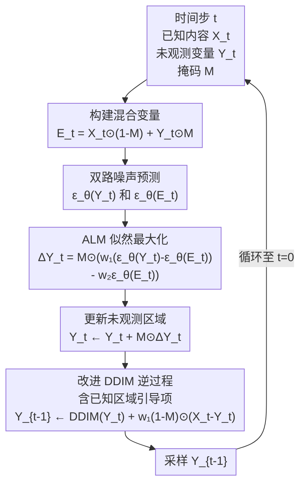

# Accelerated Likelihood Maximization for Diffusion-based Versatile Content Generation

**会议**: ECCV 2026  
**arXiv**: [2606.31323](https://arxiv.org/abs/2606.31323)  
**代码**: [http://hleephilip.github.io/ALM](http://hleephilip.github.io/ALM) (项目网站，代码待发布)  
**领域**: 扩散模型 / 图像生成  
**关键词**: 扩散模型, 似然最大化, 训练无关, 内容补全, 加速采样

## 一句话总结
ALM 提出一种完全无需额外训练的扩散模型采样策略，在逆扩散过程中对未观测区域进行显式似然最大化优化，并利用「相邻迭代更新近似相等」的性质将 N 轮迭代坍缩为单次更新，在图像补全/外扩、人体动作补全、3D 纹理生成和长视频生成等多模态任务上以零训练成本大幅超越此前最先进方法。

## 研究背景与动机

扩散模型在无条件或文生图/文生视频等标准生成任务上已展现出惊人能力，但实际应用往往要求从部分给定的输入出发生成完整内容——图像修复需要根据已知区域填充缺失部分，全景图生成需要从初始 patch 向外扩展，人体动作补全需要根据部分关键帧推断完整运动序列，3D 纹理生成需要在多视角间保持纹理一致。这些基于部分观测的生成任务被统称为通用内容生成。最直接的方案是针对每个任务重新训练或微调模型，但这样做不仅需要高昂的计算成本和大量标注数据，而且泛化能力极差——为某个数据集训练的修复模型几乎无法迁移到其他形态的任务。

训练无关的扩散同步方法（SyncTweedies、SyncSDE、StochSync）试图避免重训练，通过耦合多个扩散轨迹来保持全局一致性。然而它们的核心局限在于：只对已生成的已知区域施加约束，而对缺失区域不做任何显式优化，默认假设扩散过程会自动产生合理结果。这个假设在缺失区域较小时或许勉强成立，但一旦缺失范围变大（如图像外扩、长视频拼接），完全失效——生成结果出现语义矛盾、颜色跳变和全局不一致的伪影。以 SyncSDE 为代表的方案虽然提供了概率框架解释其引导机制，但其引导项仅作用于已知区域 (1-M)⊙Y_t，对缺失区域 M⊙Y_t 部分没有任何控制。

本文的切入角度非常直接：既然问题出在未观测区域「无人管」，那就直接对它做显式优化，而不只是间接引导。**核心 idea：将扩散同步重新建模为对未观测变量的显式似然最大化，在每次逆扩散步骤中通过条件似然（局部一致性）+ 联合对数密度（全局和谐性）的双目标导出闭式梯度更新，直接优化缺失区域，并利用 Lipschitz 连续性证明相邻迭代的更新量近似相等，从而将 N 轮迭代坍缩为单步计算，实现约 185 倍加速。**

## 方法详解

### 整体框架

ALM 完全嵌入在预训练扩散模型的逆扩散过程中，不修改网络结构，不引入额外的训练参数。给定预生成内容 X（已知区域，如图像中未被掩码的部分）和二进制掩码 M（1 标记未观测区域），ALM 在每个扩散时间步 t 执行两个核心步骤：先对未观测变量 Y_t 应用似然最大化更新，然后执行改进的 DDIM 逆过程采样 Y_{t-1}。下图展示了一个时间步内的完整流程：

核心在于 ALM 在每次更新中同时优化两个互补目标：条件似然项让缺失区域的内容与已知上下文保持一致，联合对数密度项确保整体混合结果（已知+生成）处于数据分布的高密度区域，也就是看起来逼真且和谐。两个目标的相对权重通过超参数 w₁ 和 w₂ 控制。

### 关键设计

**1. 未观测区域的显式似然最大化：从间接引导到直接优化**

此前所有扩散同步方法的引导机制都只作用于已知区域——它们约束已知区域的去噪轨迹，间接影响缺失区域，但不对 M⊙Y_t 施加任何直接的约束。以 SyncSDE 为例，它的分数分解 ∇log p(Y_t|X_t) = ∇log p(Y_t) + ∇log p(X_t|Y_t) 中的条件项只依赖已知区域，缺失区域完全靠扩散模型自身的先验自动补全。这个假设在缺失区域较小时勉强成立，但大范围缺失时会产生明显的全局不一致。

ALM 在每个时间步 t 对未观测变量 Y_t 引入额外的更新量 ΔY_t。这个更新量通过最小化一个复合似然目标导出：第一项 -λ₁ log p(X_t, M | Y_t) 鼓励缺失区域的内容与已知上下文条件对齐，第二项 -λ₂ log p(X_t, M, Y_t) 推动已知和未知区域的整体组合落在数据分布的高密度区域（即整体看起来逼真）。通过对该目标做泰勒展开并利用基于分数的替代技巧（score-based substitution），可导出闭式解：

$$\Delta \mathbf{Y}_t = \mathbf{M} \odot \big( w_1 (\epsilon_\theta(\mathbf{Y}_t) - \epsilon_\theta(\mathbf{E}_t)) - w_2 \epsilon_\theta(\mathbf{E}_t) \big)$$

其中 E_t = X_t ⊙ (1-M) + Y_t ⊙ M 是已知与未知的混合变量。这个公式有两个直观的组成部分：ε_θ(Y_t) - ε_θ(E_t) 度量「只看缺失区域 vs 看全局上下文」的噪声预测差异，让缺失区域感知全局信息；ε_θ(E_t) 则推动混合结果整体向数据流形中心靠近。λ₁ > λ₂ 的设计确保局部一致性优先于全局和谐性——先对齐上下文、再追求整体逼真。消融实验验证了去掉任一项都会导致性能下降，且在不同骨干上两项的贡献比重不同。

**2. 一步加速策略：将 N 轮迭代坍缩为单次更新**

上述似然最大化更新理论上需要迭代进行多轮：每轮计算 ΔY_t^i，更新 Y_t^i = Y_t^{i-1} + M⊙ΔY_t^{i-1}，重复 N 次后才进入下一次 DDIM 步骤。这将带来 O(N) 的额外计算开销，对于需要 50-1000 步的逆扩散采样来说不可接受。

ALM 的关键洞察在于，当超参数 λ₁、λ₂ 选择得足够小，使得泰勒展开的 ℓ₂ 范数条件 ||ΔY_t^i|| << 1 成立时，由于噪声预测网络 ε_θ 是 L-Lipschitz 连续的，相邻两次迭代的更新量满足 ||ΔY_t^{i+1} - ΔY_t^i|| ≤ L(2λ₁ + λ₂)||ΔY_t^i|| = O(||ΔY_t^i||)，即相邻更新近似相等。因此 N 轮迭代的总效果可以直接用 N 倍第一轮更新来近似：

ΔY_t ≈ N · ΔY_t^1 = M ⊙ (w₁'(ε_θ(Y_t) - ε_θ(E_t)) - w₂ε_θ(E_t))

其中 w₁' = N·λ₁、w₂ = N·λ₂ 成为可直接调优的超参数（实践中 λ₁=2×10⁻³、λ₂=10⁻⁵ 对应 w₁=1.0、w₂=0.005）。这一近似将 N 轮迭代合并为单步计算，在实验中实现了约 185 倍的运行时加速比，而定量指标（LPIPS、MS-SSIM、FSIM）几乎完全一致。更有意思的是，消融显示加速版的指标反而略优于迭代版（MS-SSIM 0.351 vs 0.298），说明单步近似在有限步数优化中反而找到了更好的方向。

### 损失函数 / 训练策略

ALM 完全无需训练，仅需在 DDIM 采样过程中调节两个超参数 w₁ 和 w₂。两者按 σ_t = √((1-α_{t-1})/(1-α_t)) · √(1 - α_t/α_{t-1}) 的比例随时间步 t 衰减，确保在逆扩散后半段（样本接近干净数据时）小更新假设仍然成立。典型配置：图像补全用 w₁=1.0、w₂=0.005；对于 FLUX 等 flow matching 框架，需将噪声预测 ε_θ 替换为速度场预测 v_θ，并采用 σ_t = t⁴ 的衰减策略。方法对超参数较为鲁棒（w₁ ∈ [0.5, 1.5]、w₂ ∈ [0.001, 0.01] 范围内性能稳定）。

## 实验关键数据

### 主实验

**图像补全（Stable Diffusion 骨干，50 DDIM 步）**

| 数据集 | 方法 | LPIPS↓ | MSE↓ | M-SSIM↑ | MS-SSIM↑ | FSIM↑ |
|--------|------|--------|------|---------|----------|-------|
| AFHQ | SyncSDE | 0.304 | 0.172 | 0.302 | 0.641 | 0.778 |
| AFHQ | BrushNet (需训练) | 0.316 | 0.216 | 0.256 | 0.589 | 0.741 |
| AFHQ | SD Inpainting (需训练) | 0.292 | 0.140 | 0.295 | 0.623 | 0.757 |
| AFHQ | **ALM** | **0.283** | **0.143** | **0.351** | **0.689** | **0.796** |
| CelebA-HQ | SyncSDE | 0.292 | 0.159 | 0.341 | 0.661 | 0.781 |
| CelebA-HQ | BrushNet (需训练) | 0.274 | 0.195 | 0.347 | 0.638 | 0.759 |
| CelebA-HQ | SD Inpainting (需训练) | 0.268 | 0.130 | 0.368 | 0.659 | 0.763 |
| CelebA-HQ | **ALM** | **0.251** | **0.126** | **0.417** | **0.732** | **0.813** |

ALM 以零训练成本全面超越训练需训练的 BrushNet/PowerPaint/SDI 和训练无关的 SyncSDE/HD-Painter。特别值得注意的是 M-SSIM（仅评估未观测区域生成质量）的大幅领先——这直接验证了显式优化缺失区域的有效性。

**宽图生成（Outpainting → 2048×512）**

| 方法 | FID↓ | KID↓(×10³) | 美学分数↑ | Q-Align↑ |
|------|------|------------|----------|---------|
| SyncTweedies | 85.95 | 58.36 | 6.104 | 4.550 |
| SyncSDE | 85.82 | 51.84 | 6.127 | 4.542 |
| StochSync | 113.21 | 92.10 | 6.026 | 4.546 |
| **ALM** | **83.41** | **42.98** | **6.133** | **4.581** |

### 消融实验

| 配置 | AFHQ M-SSIM↑ | AFHQ FSIM↑ | AFHQ LPIPS↓ | 说明 |
|------|-------------|------------|-------------|------|
| w/o ALM (纯 SyncSDE) | 0.300 | 0.782 | 0.295 | 无未观测区域优化 |
| w/o 条件似然项 | 0.323 | 0.787 | 0.295 | 去掉局部一致性约束 |
| w/o 联合对数密度项 | 0.327 | 0.793 | 0.284 | 去掉全局和谐性约束 |
| w/o 加速 (N=500 迭代) | 0.298 | 0.781 | 0.298 | 迭代更新但不加速 |
| **完整 ALM** | **0.351** | **0.796** | **0.283** | 双目标 + 一步加速 |

加速策略的消融最有趣：去掉加速（迭代 500 轮）后的指标反而略差于加速版（M-SSIM 0.298 vs 0.351），而运行时差异惊人——加速版 9.9 秒 vs 非加速版 1854 秒（约 185 倍）。作者分析可能是因为 Lipschitz 界在实践中偏保守，一步近似反而在有限步数下找到了更好的优化方向。

### 关键发现
- 两个目标项在不同骨干上有不同贡献比重：对于条件扩散模型（Stable Diffusion），条件似然项更为重要；对于无条件扩散模型（RePaint），联合对数密度项起主导作用。双目标设计让 ALM 能自动适应不同的骨干架构。
- ALM 在全部五种任务（图像补全 ×4 数据集、宽图生成、人体动作补全 ×3 场景、3D 纹理生成、长视频生成）上均创下新 SOTA，验证了方法的通用性。
- 与 FLUX（flow matching 框架）的结合需要调整衰减策略（σ_t⁴），AFHQ 上 MS-SSIM 达到 0.277——虽然略低于 SD/SDXL 骨干，但仍显著优于无优化的 FLUX-Inpainting。
- 3D 纹理生成中 ALM 的 FID 为 155.46，KID 为 74.41×10⁻³，不仅优于所有同步方法，也优于任务专用方法 Paint-it/TexPainter/TEXTure，证明了训练无关方法在 3D 领域的竞争力。

## 亮点与洞察
- **"缺失区域无人管"这个盲点抓得非常精准**：此前所有扩散同步方法都在已知区域上设计引导机制，ALM 是第一个明确意识到「问题出在未知区域、那就直接去优化它」的工作。从间接引导到直接优化的范式转变，是大幅领先的根本原因。
- **双目标设计巧借概率建模的互补性**：条件似然写局部对齐、联合对数密度写全局和谐——将不可兼得的两个目标用 composite likelihood 的框架统一，且通过 λ₁ > λ₂ 设定优先顺序。这种先局部后全局的层次化优化思路可以迁移到其他条件生成任务（如视频补全、点云修复）。
- **加速策略的数学推导令人印象深刻**：利用 Lipschitz 连续性证明相邻迭代的更新量近似相等从而坍缩为单步，这不是经验性发现而是严格的数学推导。从论文附录 D 的图 18 来看，无论掩码形状如何，相邻更新的差异都保持在极低水平，验证了推导的可靠性。
- **跨模态泛化能力极强，实验设计有说服力**：在图像（SD/SDXL/FLUX）、人体动作（U-Net 扩散）、3D（ControlNet）和视频（LaVie）上全方位验证，每个模态仅需调整超参数衰减策略，展示了训练无关方法在通用内容生成上的巨大潜力。

## 局限与展望
- 虽然加速策略效果显著，但 ALM 每次逆扩散步骤仍需两次前向传播（分别预测 ε_θ(Y_t) 和 ε_θ(E_t)），单步计算量是标准采样的 2 倍。在极端低延迟场景下仍可能存在瓶颈。
- 对于 flow matching 框架（FLUX），ALM 的适配需要额外的公式转换和差异化的超参数调度（σ_t⁴），未能做到完全即插即用。更统一的调度策略是未来的改进方向。
- 加速策略的核心假设依赖于 Lipschitz 连续性，但实际神经网络的 Lipschitz 常数难以严格保证，理论上界不够紧实。虽然论文用实验验证了近似成立，但更严格的分析将增强可信度。
- 超参数 (w₁, w₂) 在不同任务间仍需人工微调，尚未有自动化推荐机制。学习不同任务的噪声预测差异统计特性可能是自动调参的一个方向。

## 相关工作与启发
- **vs SyncSDE**: 两者同属扩散同步范式，但 SyncSDE 的分数分解中 ∇log p(X_t|Y_t) 只作用于已知区域，缺失区域无约束。ALM 在此基础上增加了缺失区域的显式似然最大化目标，从原理上解决了 SyncSDE 的根本局限。SyncSDE 的公式 (2) 中 (1-M)⊙(X_t - Y_t) 引导项被 ALM 保留，而额外增加的 ΔY_t 是 ALM 的创新。
- **vs SyncTweedies**: 基于对 60 种策略的经验搜索，缺乏底层数学原理解释。ALM 从似然最大化出发导出闭式解，原理更清晰且性能全面超越。
- **vs HD-Painter / Reconstruction Guidance**: 这些训练无关方法针对特定任务设计（注意力加权 / L2 重构损失），无法泛化到多模态。ALM 提出了统一的优化框架，适用性大幅扩展。
- **vs BrushNet / PowerPaint / CondMDI**: 这些需训练的方法在各自任务上效果好，但代价是每个任务都需要大量数据和计算资源。ALM 以零训练成本实现了超越它们的性能，展示了训练无关范式的竞争力和潜力。

## 评分
- 新颖性: ⭐⭐⭐⭐⭐ 将扩散同步重新定义为对缺失区域的显式似然最大化，与此前工作在范式上有本质区别，加速策略的数学推导简洁优雅且经实验验证。
- 实验充分度: ⭐⭐⭐⭐⭐ 覆盖 5 种任务 × 多种骨干（SD、SDXL、FLUX、Unconditional、ControlNet、LaVie）× 多个数据集，消融完整、敏感性分析充分，还包含附录 C 中的 score estimation 掩码扰动验证实验。
- 写作质量: ⭐⭐⭐⭐ 从问题动机到方法推导再到实验验证，逻辑链条清晰。但 3.3 节公式推导对不熟悉分数匹配的读者稍显跳跃，附录中的验证实验值得一读。
- 价值: ⭐⭐⭐⭐⭐ 在现代扩散模型应用（图像修复、全景图生成、3D 纹理等）中，「从部分输入完成完整内容」是普适性需求。ALM 的训练无关方案可直接嵌入现有流程，实用价值极高。

<!-- RELATED:START -->

## 相关论文

- [\[ICLR 2026\] Quantization-Aware Diffusion Models for Maximum Likelihood Training](../../ICLR2026/image_generation/quantization-aware_diffusion_models_for_maximum_likelihood_training.md)
- [\[AAAI 2026\] Diffusion Reconstruction-Based Data Likelihood Estimation for Core-Set Selection](../../AAAI2026/image_generation/diffusion_reconstruction-based_data_likelihood_estimation_for_core-set_selection.md)
- [\[ICML 2025\] Continuous Visual Autoregressive Generation via Score Maximization](../../ICML2025/image_generation/continuous_visual_autoregressive_generation_via_score_maximization.md)
- [\[ICLR 2026\] CoEmoGen: Towards Semantically-Coherent and Scalable Emotional Image Content Generation](../../ICLR2026/image_generation/coemogen_towards_semantically-coherent_and_scalable_emotional_image_content_gene.md)
- [\[CVPR 2025\] CacheQuant: Comprehensively Accelerated Diffusion Models](../../CVPR2025/image_generation/cachequant_comprehensively_accelerated_diffusion_models.md)

<!-- RELATED:END -->
