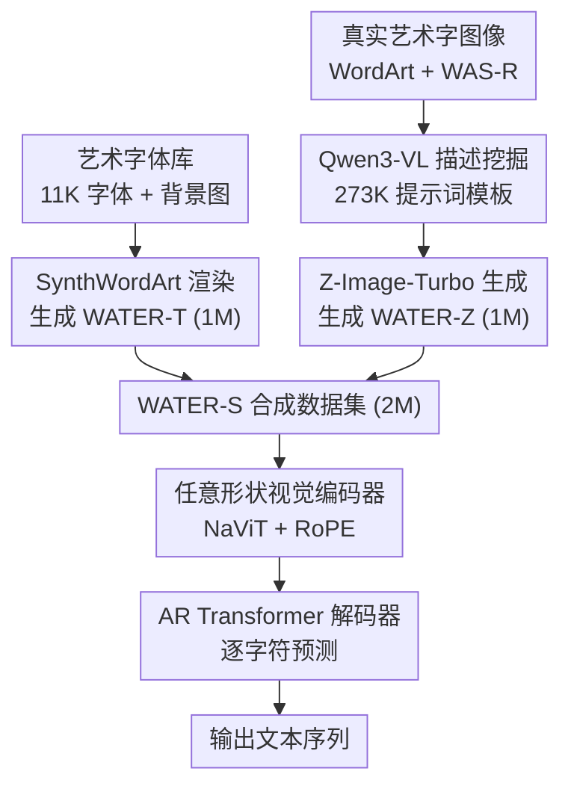

# Advancing WordArt-Oriented Scene Text Recognition: Datasets and Methods

**会议**: ECCV 2026  
**arXiv**: [2606.24484](https://arxiv.org/abs/2606.24484)  
**代码**: [https://github.com/YesianRohn/WATER](https://github.com/YesianRohn/WATER)  
**领域**: 场景文本识别 / 图像生成  
**关键词**: 艺术字识别, 场景文本识别, 合成数据, 任意形状编码, 自回归解码

## 一句话总结
本文从数据和模型两个维度系统推进艺术字场景文本识别（WATER）：数据侧构建了 2M 规模的合成艺术字数据集 WATER-S（渲染子集 WATER-T + 生成模型子集 WATER-Z），模型侧提出支持任意形状输入 + 自回归解码的 WATERec，首次在 WordArt-Bench 上突破 90% 准确率（90.40%），显著超越通用 VLM 和 OCR 专用 VLM。

## 研究背景与动机
艺术字（WordArt）广泛出现在海报、招牌、杂志等设计场景中，其字体形状、纹理、版式高度定制化，字符轮廓内常嵌入复杂图形和语义元素，使得文本同时承载语言载体和视觉符号双重功能。这种高度风格化引入了与底层文本无关的大量视觉干扰，导致面向艺术字的场景文本识别（WATER）比通用场景文本识别（STR）困难得多。

现有 STR 数据集和方法主要围绕规则场景文本和固定模板输入构建，在艺术字场景下存在两个核心瓶颈。第一，真实艺术字数据极度稀缺：现有最大的艺术字数据集 WordArt 仅含 4,805 张训练图像，标注成本高且一致性差，远不足以支撑现代模型的优化，也无法覆盖真实设计中的长尾风格。第二，主流 STR 模型普遍将输入缩放到固定尺寸（如 32x128），而艺术字的长宽比极端多变（从超宽横幅到近方形竖排文字），强制缩放会造成严重几何畸变，破坏字符结构。此外，艺术字的阅读顺序经常不遵循标准从左到右规则，需要更强的上下文推理能力。

本文的核心 idea 是：用两条互补的合成数据管线（基于渲染的精确可控 + 基于生成模型的风格多样）打破数据瓶颈，同时用保留原生长宽比的任意形状编码器 + 自回归解码器打破固定模板 STR 的架构瓶颈，二者协同使 WATER 任务首次达到实用级精度。

## 方法详解

### 整体框架
本文的方法体系包含两个相互协作的支柱：数据侧的 WATER-S 合成数据集构建，以及模型侧的 WATERec 识别架构。数据侧有两条并行的合成管线——基于渲染引擎的 WATER-T 和基于生成模型的 WATER-Z——二者在字体可控性、版式多样性和视觉真实感上互补。模型侧 WATERec 采用 NaViT 风格的视觉编码器（支持任意长宽比输入 + RoPE 位置编码）接自回归 Transformer 解码器，从根本上避免固定模板缩放带来的畸变，并能建模复杂的艺术字阅读顺序。训练时，WATERec 在经严格哈希去重的真实数据集 WATER-R（3.2M 样本）上训练，再叠加 WATER-S 获得进一步增益。

### 关键设计

**1. SynthWordArt 渲染引擎：为艺术字定制的工具化合成管线**

传统 STR 合成工具（SynthText、SynthTIGER）面向规则文本设计，使用通用字体（如 Google Fonts）和标准水平布局，生成的图像与真实艺术字在风格和版式上存在巨大差距。SynthWordArt 对此做了两项关键升级。第一，用收集整理的 11,250 个开源艺术字体替换通用字体库，覆盖 display / handwriting / cartoon / playful 等风格标签，并确保许可合规（OFL、Apache 等）和完整字符编码。第二，在标准水平布局之外增加弯曲排列、竖排文字、多方向布局以及透视、拉伸等几何变换，布局类型按约 0.2:0.2（弯曲）:0.3（多方向）:0.3（近水平）的比例随机采样。文本标签直接从现有大规模真实数据集的真实文本语料（598,615 条唯一条目，长度 1-25）中采样，以缩小合成数据与真实数据的文本分布差距。基于该引擎生成 1M 张图像构成 WATER-T，其核心优势是文本内容和字符形状的精确可控——每个字符的渲染结果与标签严格一致。

**2. VLM 驱动的提示挖掘与生成管线：用生成模型填补真实感缺口**

工具渲染虽精确可控，但在全局风格一致性、语义纹理融合和整体视觉自然感上仍落后于真实设计。为此，本文探索用生成模型合成艺术字数据，其关键在于提示词质量。本文设计了自动化的 few-shot 提示挖掘管线：首先用 Qwen3-VL-8B 对 WordArt 和 WAS-R 训练集中的 31,335 张真实艺术字图像逐一生成详细描述（描述中使用 `<Text>` 占位符代替具体文字内容），获得 31,335 条图像-描述对；然后随机采样 3 条作为 few-shot 示例，让 Qwen3-VL 模仿生成新的提示词；最后经严格去重过滤得到 273,488 条高质量提示词模板。这个提示词库独立于任何特定生成模型，可被更先进的模型复用。本文选用开源模型 Z-Image-Turbo 作为骨干生成器，输出分辨率设为 256x256，随机替换提示词中的文本占位符后合成 1M 张图像构成 WATER-Z。相比 WATER-T，WATER-Z 在背景纹理、版式构图和全局视觉风格上具有更高的多样性和真实感，但字符形状的可读性和准确性较难保证——二者恰好互补。

**3. 任意形状输入与 RoPE 位置编码：打破固定模板的架构瓶颈**

艺术字的长宽比极端多变，传统 STR 模型将所有输入统一缩放到固定尺寸（如 32x128）会严重拉伸或压扁不规则文字，SVTRv2 的多尺度模板方案仍需人工预设且缺乏灵活性。WATERec 借鉴现代 VLM 的做法，采用 NaViT 风格的视觉编码策略：给定任意分辨率的输入图像 $I \in \mathbb{R}^{H \times W \times 3}$，保持长宽比缩放到 $\hat{I}$，以 patch size $p=4$ 切块，线性投影为 $d=384$ 维的视觉 token，token 数量 $N = (\hat{H}/p) \times (\hat{W}/p)$ 约束在 $[64, 256]$ 范围内（下界防止极小图像 token 过少，上界保证与现有方法公平比较）。patch token 按行主序排列为 1D 序列，送入 6 层 Transformer 编码器。

关键问题是编码器如何感知任意形状输入的空间布局。绝对位置编码（APE）和正弦位置编码（SPE）对图像尺寸和形状高度敏感，训练数据无法覆盖所有分辨率和布局。WATERec 采用 RoPE（旋转位置编码），对 query 和 key 向量施加位置相关的旋转，使点积注意力隐式编码相对位置信息：将 $d$ 维 Q/K 向量按相邻两通道配对转为复数形式 $\bar{q}_n, \bar{k}_n \in \mathbb{C}^{d/2}$，一半复数通道分配给水平轴、一半给垂直轴，频率系数 $\omega_t = \theta^{-t/d}$（$\theta=100$），对位置 $p_n$ 构造旋转向量 $R_n$ 并通过逐元素复数乘法 $\bar{q}'_n = \bar{q}_n \circ R_n$ 施加旋转。这种设计使模型天然支持变长序列，且对不同尺度和分辨率有强泛化能力。消融实验表明，在任意形状输入下，RoPE 显著优于 APE 和 SPE，而完全去掉位置编码（NoPE）会导致性能崩溃（WordArt 从 88.55% 跌至 49.57%）。

**4. 自回归解码器：适配复杂的艺术字阅读顺序**

艺术字常违反标准从左到右阅读顺序（弯曲、竖排、多方向），基于 CTC 或并行解码（PD）的方法在这种场景下容易产生错位或遗漏。WATERec 采用自回归（AR）Transformer 解码器，使用 2 层交叉注意力层关注编码器输出的视觉特征序列，以 `<B>` 为起始 token、`<E>` 为结束 token，逐字符预测文本序列（最大长度 25，字符集 94 个含数字、字母和常用符号）。AR 解码通过逐字符的上下文迭代细化，能更好处理高度扭曲和非常规阅读顺序的文字。训练使用标准交叉熵损失，推理速度 361.66 FPS（V100），参数量 26.22M，在精度和效率之间取得了良好的平衡。

### 损失函数 / 训练策略

WATERec 使用标准交叉熵损失进行端到端训练。优化器为 AdamW，权重衰减 0.05，基础学习率 $6.5 \times 10^{-4}$，总 batch size 2048。采用 one-cycle 学习率调度器，前 1.5 个 epoch 线性预热，共训练 20 个 epoch。数据增强沿用 PARSeq 方案：随机旋转、透视畸变、运动模糊和高斯噪声。最大文本长度 25。所有模型在 8 块 NVIDIA V100 GPU 上训练。训练数据方面，先用 WATER-R（3.2M 真实样本，由 Union14M-L + WordArt-Train + WAS-R 经严格哈希去重后合并）训练基础模型，再叠加 WATER-S 获得进一步提升——最优配比为 2M WATER-S + 3.2M WATER-R（合成:真实约 2:3），继续增大合成数据比例会出现边际收益递减甚至部分子集轻微波动。

## 实验关键数据

### 主实验

在 WATER-R 上训练的主流 STR 方法对比（不含合成数据）。WATERec 在艺术字基准 A-Bench（WordArt 测试集，1,511 张）和最具挑战性的 U-Bench（Union14M-Benchmark，7 个子集）上均取得最优，在规则文本为主的 C-Bench（6 个通用基准）上略低于固定分辨率的 MAERec。

| 方法 | 解码类型 | A-Bench (WordArt) | C-Bench AVG | U-Bench AVG |
|------|---------|-------------------|-------------|-------------|
| CRNN | CTC | 62.54 | 86.07 | 41.63 |
| SVTR | CTC | 76.96 | 93.16 | 70.40 |
| SVTRv2 | CTC | 86.56 | 96.79 | 86.14 |
| ABINet | PD | 84.64 | 96.13 | 80.58 |
| PARSeq | AR | 84.51 | 96.11 | 82.26 |
| MAERec | AR | 86.23 | 96.96 | 86.52 |
| SVTRv2-AR | AR | 87.36 | 96.48 | 87.63 |
| **WATERec** | AR | **88.55** | 96.69 | **88.14** |
| WATERec + WATER-S (2M) | AR | **90.40** | 97.01 | 89.38 |

叠加 WATER-S 后 WATERec 在 A-Bench 上达到 90.40%，首次突破 90% 大关；作为对比，最强的通用 VLM（Qwen3-VL-8B）仅 72.01%，最强的 OCR 专用 VLM（HunyuanOCR）仅 81.54%。即使对 Qwen3-VL-8B 做 SFT（LoRA 微调 20k 步），加 WATER-R+WATER-S 后也只到 84.78%，仍远低于 26M 参数的 WATERec，说明专用专家模型在该任务上不可替代。

### 消融实验

对 WATERec 的任意形状建模、位置编码方案和 token 范围进行消融（均在 WATER-R 上训练）。

| 任意形状 | 位置编码 | Token 范围 | A-Bench | C-Bench Regular | C-Bench Irregular | U-Bench AVG |
|---------|---------|-----------|---------|-----------------|-------------------|-------------|
| 否 | NoPE | [256, 256] | 86.83 | 98.25 | 95.15 | 86.69 |
| 是 | NoPE | [64, 256] | 49.57 | 89.14 | 86.07 | 56.90 |
| 是 | APE | [64, 256] | 87.69 | 98.29 | 94.41 | 87.10 |
| 是 | SPE | [64, 256] | 87.29 | 98.36 | 94.37 | 86.87 |
| 否 | RoPE | [256, 256] | 87.88 | 98.71 | 94.99 | 86.99 |
| 是 | RoPE | [1, 256] | 88.29 | 98.47 | 94.80 | 87.38 |
| **是** | **RoPE** | **[64, 256]** | **88.55** | 98.52 | 94.86 | **88.14** |
| 是 | RoPE | [64, 512] | 88.82 | 98.61 | 95.75 | 89.06 |

关键发现：任意形状 + NoPE 的组合导致灾难性性能崩溃（A-Bench 49.57%），说明仅靠任意形状输入而不给位置信息，模型完全无法理解空间布局；在任意形状下 RoPE 显著优于 APE 和 SPE；扩大 token 上限到 512 可进一步提升精度但 FPS 从 361.66 降至 191.46，[64, 256] 是精度/效率最优折中。

### 关键发现

- **任意形状建模是最大贡献点**：去掉任意形状支持（退化为固定 [256,256] 输入 + NoPE）后 A-Bench 下降 1.72 个百分点，U-Bench 下降 1.45 个百分点；而任意形状必须在合适位置编码配合下才能发挥效果——RoPE 是关键使能器。
- **WATER-T 和 WATER-Z 互补性显著**：0.5M WATER-T + 0.5M WATER-Z 组成的 1M WATER-S，在 A-Bench 上优于各自单独 1M 版本（89.94% vs 89.81%/89.41%），验证了两条管线在视觉风格和场景多样性上的互补。
- **合成数据增益呈先升后平趋势**：WATER-S 从 1M 增到 2M 持续有稳定增益（A-Bench +0.46%），但增到 3M 后边际收益消失甚至部分子集轻微波动，最优合成:真实比约 2:3。
- **合成数据的跨架构通用性**：在 SVTRv2（CTC）、ABINet（PD）、SVTRv2-AR（AR）和 WATERec 四种不同架构上叠加 WATER-S 后 A-Bench 均有 +1.85% 到 +2.78% 的一致提升，证明高质量艺术字合成数据是普适资源而非仅对特定模型有效。
- **C-Bench 上的小幅度回退是可接受的权衡**：WATERec 在规则文本为主的 C-Bench 上略低于固定分辨率的 MAERec（差距不到 0.3%），但在艺术字和挑战性子集上优势巨大，这是保留原生长宽比的必然代价。

## 亮点与洞察

- **任意形状 + RoPE 的设计组合简单却高效**：不引入额外参数、不改动 Transformer 主体结构，仅靠"保留长宽比 + RoPE 替代固定位置编码"，就让模型在艺术字场景获得了质的提升。这个思路可迁移到任何需要处理极端长宽比变化的视觉任务（如文档理解、图表识别、遥感图像）。
- **提示词库作为生成器无关资产**：273K 条高质量提示词模板不绑定任何特定生成模型，随生成技术进步可持续复用，这种"描述与生成分离"的设计有远见。
- **合成数据的"适度规模"洞察**：实验清楚展示了合成数据并非越多越好——3M 时已出现噪声积累和分布失配，2M（合成:真实约 2:3）是最优配比。这个结论对做合成数据的研究者有直接指导意义。
- **专家模型 vs VLM 的差距说明任务特异性仍然重要**：即使对 8B 的 Qwen3-VL 做 SFT 微调，加了同样的 WATER-S 数据，艺术字识别精度（84.78%）仍远低于 26M 的专家模型（90.40%），提醒我们不要盲目迷信 VLM 的"万能"能力——在高度专业化的感知任务上，专用架构 + 专用数据仍然不可替代。

## 局限与展望

- 当前 WATER-S 和 WATERec 主要针对英文艺术字，虽然作者展示了中文的小规模验证（BCTR-Test 上 101 张中文艺术字，WATERec + 中文 WATER-S 达 92.08%），但多语言场景的系统性评估仍缺失。
- 生成模型子集 WATER-Z 的文本渲染准确性不可靠（错误率约 12.56%），虽然作者实验表明 OCR 过滤并无明显收益（模型能从适度噪声中鲁棒学习），但当生成模型本身进步后，这种噪声是否仍"有益的"需要重新审视。
- WATERec 在规则文本 C-Bench 上略有回退（与最优固定分辨率方法差不到 0.3%），如果下游应用需要同时处理规则文本和艺术字，可能需要多分支或动态路由策略。
- 自回归解码的推理速度（361 FPS）低于 CTC 方法（SVTRv2 608 FPS），在实时场景中可能存在吞吐量压力；探索并行解码 + 任意形状编码的混合方案是一个有价值的方向。
- 作者提到计划将 VLM 用于艺术字识别（如 chain-of-thought 推理）来逼近专家模型性能，但对 VLMs 为何在艺术字上表现不佳的根本原因缺乏深入分析（是视觉编码器分辨率不够、还是解码器缺乏字符级感知？）。

## 相关工作与启发

- **vs CornerTransformer**: 首个面向艺术字识别的基线，采用 AR 范式。本文在此基础上系统性地从数据（WATER-S vs 仅 4,805 张 WordArt）和架构（任意形状 vs 固定模板）两个维度做了根本性升级，将 A-Bench 从约 80% 推到 90%+。
- **vs SVTRv2**: 同样关注不规则文本，但 SVTRv2 的多尺度模板方案需人工预定义且对所有样本施加固定变换集合，WATERec 的任意形状方案更灵活且无需手工设计。
- **vs TextSSR / SceneVTG**: 这些工作也用扩散模型生成 STR 数据，但面向通用场景文本而非艺术字。本文的 VLM 提示挖掘管线专门针对艺术字风格描述，生成效果在艺术字上显著优于 TextSSR。
- **vs NaViT / 现代 VLM**: 本文的任意形状编码思路直接受 NaViT 启发，将其从通用视觉-语言场景迁移到 STR 这一垂直领域并验证了有效性，说明 VLM 的架构创新可以反哺传统视觉任务。

## 评分

- 新颖性: ⭐⭐⭐⭐ 单个组件（RoPE、AR 解码、渲染管线、扩散生成）都不是新东西，但把它们系统地组合起来解决 WATER 这个被忽视的困难子问题，且任意形状输入首次在 STR 中应用，整体方案有实质创新。
- 实验充分度: ⭐⭐⭐⭐⭐ 涵盖 3 类 STR 范式（CTC/PD/AR）、4 种模型架构的交叉验证、合成数据规模的边际收益分析、位置编码和 token 范围的消融、与通用/OCR 专用 VLM 的对比、跨语言验证、推理效率对比，实验设计非常扎实。
- 写作质量: ⭐⭐⭐⭐ 结构清晰，动机充分（数据瓶颈 + 架构瓶颈两条线并行），附录细节完整（含提示词模板、中文验证、效率对比），但部分实验分析可以更深入（如不同噪声水平下模型鲁棒性的定量刻画）。
- 价值: ⭐⭐⭐⭐⭐ 首次将 WordArt-Bench 推到 90%+，数据和代码全面开源，为 WATER 子领域建立了强基线；合成数据的"适度规模"结论和 VLM vs 专家模型的对比分析对社区有直接参考价值。

<!-- RELATED:START -->

## 相关论文

- [\[AAAI 2026\] MDiff4STR: Mask Diffusion Model for Scene Text Recognition](../../AAAI2026/image_generation/mdiff4str_mask_diffusion_model_for_scene_text_recognition.md)
- [\[NeurIPS 2025\] SceneDecorator: Towards Scene-Oriented Story Generation with Scene Planning and Scene Consistency](../../NeurIPS2025/image_generation/scenedecorator_towards_scene-oriented_story_generation_with_scene_planning_and_s.md)
- [\[ECCV 2026\] Gen2Balance: Generative Balancing for Long-Tailed Video Action Recognition](gen2balance_generative_balancing_for_long-tailed_video_action_recognition.md)
- [\[ECCV 2026\] Edit in 2D, Verify in 3D: Reinforcement Learning for Multi-view Consistent Scene Editing](edit_in_2d_verify_in_3d_reinforcement_learning_for_multi-view_consistent_scene_e.md)
- [\[CVPR 2026\] StyleTextGen: Style-Conditioned Multilingual Scene Text Generation](../../CVPR2026/image_generation/styletextgen_style-conditioned_multilingual_scene_text_generation.md)

<!-- RELATED:END -->
