# Anchoring on Reality: Breaking the Pseudo-Target Ceiling in Makeup Transfer

**会议**: ECCV 2026  
**arXiv**: [2606.31089](https://arxiv.org/abs/2606.31089)  
**项目页**: [https://csbowei.github.io/ART/](https://csbowei.github.io/ART/)  
**代码**: 无  
**领域**: 图像生成  
**关键词**: 妆容迁移, 扩散Transformer, 现实锚定, 可微分重建, 伪目标天花板, 高分辨率数据集  

## 一句话总结
提出ART双阶段DiT框架，通过可微分现实锚定循环——从裸肤参考重建真实参考让梯度回传惩罚遗漏——突破伪目标天花板，在2K分辨率下实现密集贴纸、面部彩绘等复杂妆容的高保真迁移。

## 研究背景与动机

妆容迁移的目标是将参考图像的化妆风格施加到源人脸图像上，同时保持源身份和几何结构。除了日常美颜，它在影视后期、虚拟数字人等场景中同样关键——这些场景涉及密集贴纸、面部彩绘、闪粉等复杂艺术风格，且常遇到跨性别、跨族裔的迁移需求。然而这一任务面临根本性的数据瓶颈：同一个人在有妆和无妆下的精确对齐图像几乎不可获得。

现有方法走两条路来绕过这一数据瓶颈。第一条是基于GAN的弱先验路线，依赖循环一致性或域对抗损失做无配对映射（CycleGAN、LADN、CSD-MT等）。这类方法在细粒度局部放置和照片级真实感上表现有限，面对闪粉、贴纸等精细纹理时往往退化为全局颜色覆盖。另一条路线借助大规模图像编辑模型（如Nano Banana Pro、StableMakeup）合成伪配对数据，让模型直接回归伪目标。这大幅提升了整体真实感，但引入了本质性的伪目标天花板——模型系统性继承伪目标中的偏差和伪影，包括身份漂移、细节退化和不必要的背景编辑。更重要的是，由于训练目标只是被动地模仿伪目标，模型理论上永远无法超越伪目标的质量上限。

本文的核心洞察在于：虽然配对的转移目标不可得，但真实参考图像本身就包含了所有所需的化妆细节——模型不需要模仿伪目标的模式，而应当在还原真实参考的过程中自己提取化妆品细节。**核心 idea：将妆容迁移从回归合成伪目标转向可微分的现实锚定重建——通过双阶段DiT框架，在阶段II构造从裸肤参考重建真实参考的可微分循环，让重建梯度穿过DiT反向传播到初期转移预测中，直接惩罚化妆品细节的遗漏，迫使模型主动提取化妆品纹理并覆盖伪目标伪影。**

## 方法详解

### 整体框架

本文提出ART（Anchoring on Reality Makeup Transfer），一个基于Diffusion Transformer（DiT）的双阶段训练框架，以后端FLUX.1-Kontext-dev为基座模型，用LoRA微调。整体管线分为两阶段：阶段I用伪目标初始化，让模型通过学习模仿合成伪目标获得基础的语义对齐和全局妆容放置能力，同时训练一个辅助卸妆器R从参考图像提取裸肤参考；阶段II将监督信号从伪目标切换到真实参考，通过可微分重建循环迫使模型修复细粒度化妆纹理。

```mermaid
%%{init: {'flowchart': {'rankSpacing': 24, 'nodeSpacing': 28, 'padding': 6, 'wrappingWidth': 400, 'subGraphTitleMargin': {'top': 8, 'bottom': 16}}}}%%
flowchart TD
    subgraph S1["Stage I: 伪目标初始化"]
        A["源图像 I_src<br/>参考图像 I_ref"] --> B["Transfer DiT<br/>LoRA Flow Matching 训练"]
        B --> C["伪目标 Imitation<br/>全局对齐 + 基础妆容放置"]
    end

    subgraph S2["Stage II: 现实锚定精炼"]
        C -->|伪目标 latent z_pseudo| D["加噪 z&#x387;<br/>&#x3C3;tr=0.6"]
        D --> E["一步欧拉预测<br/>&#x1;(z) = z&#x387; - &#x3C3;&#x22C5;v&#x3B8;"]
        E -->|可微分载体 ẑ| F["重建真实参考 z_ref<br/>条件: z_bare_ref + ẑ"]
        F --> G["L_refine 惩罚遗漏<br/>梯度反向传播"]
        G -->|更新速度场| E
    end

    A --> H["卸妆器 R<br/>裸肤提取"]
    H --> I["裸肤参考 z_bare_ref"]
    I --> F

    D -.-> J["L_bottleneck<br/>结构正则"]
    J -.-> E

    E --> K["推理: 单步前向<br/>28 步 Euler 采样"]
```

关键的输入输出关系：输入为源图像I_src和参考图像I_ref，输出为保持源身份并迁移参考妆容的生成图像。系统在VAE隐空间中操作，使用Flow Matching目标训练条件型DiT。推理时只需一次前向，无需伪目标、卸妆器或迭代优化。

### 关键设计

**1. 双阶段渐进训练：先模仿、再超越**

阶段I独立训练主传输模型和卸妆器R。传输模型通过标准Flow Matching损失在伪目标上初始化，条件编码为源图像和参考图像的隐变量，目标是让模型学会基础的面部结构对齐和全局妆容放置。卸妆器R是一个一步去噪模型，以(I_pseudo, I_src)为监督对训练，额外加入感知损失（LPIPS）、身份一致性损失（ArcFace嵌入）和关键点几何损失来保证裸肤提取的结构保真度。阶段II则是核心创新——监督信号从伪目标切换到真实参考，通过可微分重建循环来精炼。消融显示两阶段缺一不可：仅阶段I导致身份漂移（模型满足于模仿有瑕疵的伪目标），仅阶段II的化妆品载体几乎无信息量、重建信号太弱；两阶段互补才能同时达到高妆容保真度和身份保持。

**2. 可微分化妆品载体与重建循环**

这是突破伪目标天花板的根本机制。给定阶段I得到的伪目标隐变量z_pseudo，首先以噪声水平σtr加噪得到z_σtr，然后做**一步**欧拉预测得到化妆品载体ẑ = z_σtr − σtr·vθ(z_σtr, σtr; z_src, z_ref)。关键：ẑ不解码为像素图像，而是作为可微分张量保留在计算图中。同一个人，用ẑ和裸肤参考z_bare_ref做条件，通过共享权重的同一DiT模型重建真实参考z_ref。由于ẑ的可微分性，重建损失L_refine的梯度可以穿过DiT反向传播到最初产生ẑ的速度场预测中。这意味着只要初始转移预测遗漏了任何化妆品细节（如某片闪粉没覆盖），重建真实参考就会出错、L_refine增大，梯度自然引导ẑ去捕捉更多参考纹理。这与传统的循环一致性有本质区别：CycleGAN只验证能否回到源图像（域级正则化），而这里是验证能否重建真实参考（实例级监督），前者保双向一致、后者直接要求包含所有参考化妆品细节。该设计的一个巧妙副产品是卸妆器R的轻微模糊和残留充当了隐式正则——迫使ẑ只能编码化妆品的高频纹理、不能编码身份。

**3. 受控噪声瓶颈：σtr与L_bottleneck的双重制衡**

σtr是整个框架中唯一但至关重要的超参数，它决定从伪目标继承多少先验信息。σtr小（如0.2）时ẑ紧约束在伪目标附近，模型保守编辑、保留伪目标伪影；σtr大（如0.8）时生成自由度大、细节恢复好，但结构先验太弱、可能身份漂移。论文通过对σtr在0.2~0.8之间系统消融确定σtr=0.6为最优。同时引入L_bottleneck作为结构正则化项：在噪声水平σtr处约束速度场输出与伪目标先验的一致性。若只有L_refine而无L_bottleneck，模型会走捷径——直接忽略源图像身份、把ẑ编码成整个参考图像来最小化重建损失（即输出参考图像的拷贝）。L_bottleneck锚定了源身份对应的全局结构，迫使ẑ只提取化妆品纹理而不编码身份。σtr和L_bottleneck形成双重制衡：前者控制细节恢复的幅度，后者防止走捷径退化解。

### 损失函数 / 训练策略

**阶段I：伪目标初始化**
- 传输模型：L_init = L_FM(θ; z_pseudo, z_src, z_ref)，标准Flow Matching损失
- 卸妆器R：L_R = L_FM(φ; z_src, z_pseudo) + λ_lpips·L_lpips + λ_id·L_id + λ_lmk·L_lmk

**阶段II：现实锚定精炼**
- 总目标：L_s2 = L_refine + 0.2·L_bottleneck
- L_refine = L_FM(θ; z_ref, z_bare_ref, ẑ)，重建真实参考
- L_bottleneck = E[w(σtr) ‖vθ(z_σtr, σtr; z_src, z_ref) − (ε − z_pseudo)‖²]，结构正则
- σtr = 0.6

**训练配置**：基座FLUX.1-Kontext-dev，LoRA秩r=32、缩放因子32。优化器Prodigy（lr=1），4× NVIDIA H20 GPU，512分辨率时batch size=16、2K分辨率时4。阶段I训练10K步，阶段II再训练10K步。额外的高分辨率精炼可加入小波损失L_WLF增强高频细节。卸妆器R在阶段II冻结。

**推理**：仅需传输模型单次前向（28步Euler采样），无需伪目标、卸妆器或迭代循环。

## 实验关键数据

### 主实验

在四个测试集（MT、LADN、MT-Wild、MF2K）上从四维度评估：妆容相似度（VLM评分MSimG/MSimQ）、身份保持（ArcFace ID）、背景稳定性（L2-M）、图像质量（FID）。

| 数据集 | 指标 | ART | StableMakeup | GPT Image 1.5 | Banana Pro |
|--------|------|-----|-------------|---------------|------------|
| MF2K (艺术妆容) | MSimG↑ | **9.22** | 6.73 | 8.43 | 8.34 |
| MF2K | ID↑ | **0.74** | 0.43 | 0.35 | 0.65 |
| MF2K | L2-M↓ | **4.31** | 9.26 | 28.32 | 13.27 |
| MT | MSimG↑ | **8.96** | 8.34 | 8.69 | 8.34 |
| MT | ID↑ | **0.87** | 0.49 | 0.36 | 0.67 |
| LADN | MSimG↑ | **9.14** | 7.81 | 8.85 | 8.18 |

ART在MF2K上MSimG达9.22（领先第二名GPT 8.43达0.79分），背景稳定性L2-M全面最低（4.31），身份保持ID在MT上最高（0.87）。用户研究中（21人864份评分）ART在三项指标全部第一，身份一致性评分4.03/5显著领先。

### 消融实验

| 配置 | MF2K MSimG↑ | MF2K ID↑ | MF2K L2-M↓ | 说明 |
|------|------------|----------|------------|------|
| 仅阶段I伪目标 | 8.82 | 0.57 | 7.68 | 身份漂移严重 |
| 仅阶段II精炼 | 8.08 | 0.70 | 4.98 | 化妆品载体无信息 |
| 完整（I+II） | **9.22** | **0.74** | **4.31** | 两阶段互补 |
| 无L_bottleneck | — | 退化解（直接复制参考身份） | — | 走捷径保护伞 |
| σtr=0.2 | ~8.2 | ~0.72 | ~4.2 | 保留伪目标伪影 |
| σtr=0.6（最优） | **9.22** | **0.74** | **4.31** | 最佳平衡点 |
| σtr=0.8 | ~8.9 | ~0.65 | ~5.5 | 身份漂移 |

### 关键发现

- σtr是最敏感的超参数，控制先验保留与细节恢复的权衡，σtr=0.6为最优
- 伪目标质量影响有限：即使从较弱的StableMakeup伪目标出发（Ours_SM），经精炼后MSimG 8.56仍远超StableMakeup自身6.73——现实锚定精炼可系统性超越伪目标
- 额外~4,500张无伪目标的未配对图像参与阶段II精炼，MF2K上MSimG从9.14提升到9.22
- 卸妆器R的轻微模糊不是缺陷而是设计——它迫使ẑ专注于化妆品高频纹理，实现隐式身份与妆容解耦
- ART在跨域场景（动漫、3D头像）上展现零样本泛化能力
- 局限：不显式建模光照物理一致性，光源方向显著不匹配时会产生矛盾高光

## 亮点与洞察

- **伪目标天花板的破解思路**：之前所有方法都在让输出更像伪目标的路径上打转，本文巧妙地认为"虽然转移目标不可得，但真实参考本身就是最好的监督"，把问题从"生成和伪目标一样好"重新定义为"生成能重建参考的"，视角转换极为关键
- **可微分循环的简洁性**：没有引入额外的生成分支或判别器，只是保持ẑ在可微分计算图中并复用同个DiT做重建，就实现了梯度回传闭环。推理时循环完全不需要，不影响效率
- **噪声瓶颈作为双功能调节阀**：σtr不仅控制伪目标先验保留量，还通过L_bottleneck防止身份退化解，一个超参数同时完成保留结构和恢复细节两种需求，设计干净
- **对任一无配对编辑任务的启发**：可微分重建循环不限于妆容迁移——虚拟试衣、换发型、风格化等缺乏配对数据的图像编辑任务都可借鉴这一范式

## 局限与展望

- 不显式建模光照和反射的物理一致性——闪粉和金属质感在强方向光与柔和环境光之间的物理不匹配尚未处理，未来可引入物理光照分解模块
- 训练成本较高：阶段II多一次重建前向（约1.6×时间），且依赖商业模型（Banana Pro）生成高质量伪目标
- 仅在真实人脸数据上训练，虽然在动漫、3D头像上展现了零样本泛化，但分布外场景的系统性能有待验证
- 卸妆器R可升级：目前是单步去噪模型，未来可用多步扩散获得更干净的裸肤锚点，可能进一步提升精炼效果

## 相关工作与启发

- **vs StableMakeup**：StableMakeup直接回归伪目标，被天花板封住精度；ART用现实锚定循环突破，即使在低质伪目标上训练也能超越它
- **vs CycleGAN**：传统循环一致性只验证回到源，是域级正则化（不保实例细节）；ART重建真实参考，是实例级监督，直接要求化妆品纹理完整
- **vs SHMT/MAD**：SHMT用自监督层级解耦、MAD用域统一嵌入，都还在弱先验框架内；ART的可微分重建循环提供了超越弱先验的粒度
- **对图像编辑的通用启示**："没有配对数据时，用参考自身构建可微分重建循环"——这一范式对虚拟试衣、换发型、风格迁移等任务都有启发

## 评分
- 新颖性: ⭐⭐⭐⭐⭐ "从伪目标转向可微现实锚定"是妆容迁移中的新范式，噪声瓶颈设计精巧
- 实验充分度: ⭐⭐⭐⭐⭐ 4个测试集上全方位评测 + 864份用户研究 + 系统消融，非常全面
- 写作质量: ⭐⭐⭐⭐⭐ 动机层层递进，架构清晰，补充材料充实
- 价值: ⭐⭐⭐⭐⭐ 破解了长期困扰妆容迁移的核心瓶颈，方法论具有跨任务迁移潜力

<!-- RELATED:START -->

## 相关论文

- [\[CVPR 2026\] Diffusion-Based Makeup Transfer with Facial Region-Aware Makeup Features](../../CVPR2026/image_generation/diffusion-based_makeup_transfer_with_facial_region-aware_makeup_features.md)
- [\[ECCV 2026\] Learn Once, Edit Anywhere: Visual Direction Transfer for Diffusion Models](learn_once_edit_anywhere_visual_direction_transfer_for_diffusion_models.md)
- [\[ICLR 2026\] ContextGen: Contextual Layout Anchoring for Identity-Consistent Multi-Instance Generation](../../ICLR2026/image_generation/contextgen_contextual_layout_anchoring_for_identity-consistent_multi-instance_ge.md)
- [\[ECCV 2026\] H-Adapter: Pose-Robust Hairstyle Transfer via Attention-Derived, Source-Aligned Hair Masks](h-adapter_pose-robust_hairstyle_transfer_via_attention-derived_source-aligned_ha.md)
- [\[CVPR 2026\] Anchoring and Rescaling Attention for Semantically Coherent Inbetweening](../../CVPR2026/image_generation/anchoring_and_rescaling_attention_for_semantically_coherent_inbetweening.md)

<!-- RELATED:END -->
