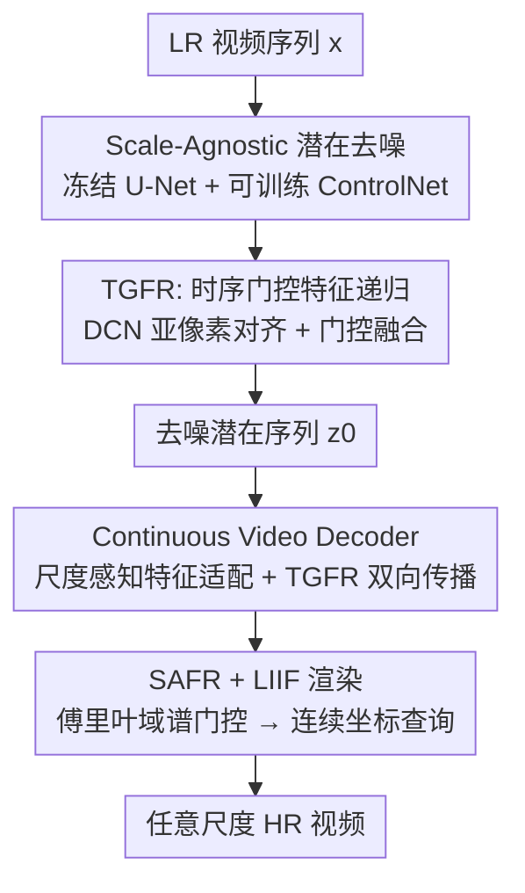

# AVSR-Diff: Scale-Agnostic Diffusion Priors for Temporally Consistent Arbitrary-Scale Video Super-Resolution

**会议**: ECCV 2026  
**arXiv**: [2607.00987](https://arxiv.org/abs/2607.00987)  
**代码**: 无（项目页: [https://kaist-viclab.github.io/AVSR-Diff/](https://kaist-viclab.github.io/AVSR-Diff/)）  
**领域**: 扩散模型 / 视频超分  
**关键词**: 视频超分辨率, 扩散模型, 任意尺度, 时序一致性, 隐式神经表示

## 一句话总结
提出 AVSR-Diff，将扩散模型的尺度无关潜在去噪与连续坐标解码解耦，通过 TGFR 模块做跨帧特征对齐抑制 flickering、SAFR 模块做傅里叶域尺度自适应频率调制，在任意尺度 VSR 上首次同时实现强生成质量与稳定时序一致性，且计算开销不随输出分辨率增长。

## 研究背景与动机
扩散模型驱动的视频超分（DM-based VSR）在固定整数放大倍数（通常 4x）上取得了显著的感知质量提升，但实际场景中经常需要连续、任意的分辨率调整——为每种尺度单独训练一个扩散模型显然不可行。另一方面，基于坐标的隐式神经表示（INR）方法天然支持任意尺度连续查询，但训练目标只有 L1/L2 回归损失，在大放大倍数（如 6x、8x）下高频细节严重丢失，画面过度平滑。

一个自然的想法是将扩散模型的生成先验与 INR 的连续解码能力结合，这条路线在单图超分中已有探索，但延伸到视频时撞上了一个非平凡瓶颈：扩散采样的每帧随机性会导致帧间特征存在微小漂移，而连续坐标解码器对这种特征不稳定高度敏感，轻微漂移即被放大为严重的时序闪烁（temporal flickering）。现有 DM-based VSR 方法虽然引入了 warping 引导、时序注意力等机制来缓解闪烁，但它们都是为固定尺度设计的，无法提供连续解码所需的尺度无关、严格对齐的潜在特征。如果直接使用全视频扩散模型（如 VEnhancer）在目标分辨率上做 3D U-Net 去噪，显存和计算量会随放大倍数急剧膨胀，大尺度推理根本不现实。

核心 idea：**把"生成先验的提取"与"分辨率的渲染"彻底解耦**——扩散采样永远在固定的低分辨率潜在空间里进行，保证生成成本与目标尺度无关；然后用一个精心设计的连续视频解码器，在这些尺度无关的潜在特征之上完成任意分辨率的像素渲染，同时通过门控特征递归和傅里叶域频率调制来死死压住时序闪烁。

## 方法详解

### 整体框架
AVSR-Diff 构建在预训练的 SD×4 Upscaler（Stable Diffusion 4x 超分模型）之上，冻结其 VAE 编解码器对 (E, D) 和去噪 U-Net (epsilon_theta)，仅训练新增的 ControlNet (C_phi) 和连续视频解码器 (D_s)。整个管线分为两个严格解耦的阶段：

**第一阶段：尺度无关潜在去噪。** 给定 LR 视频序列 x = {x^i}，在每一步扩散去噪中，LR 帧 x^i 直接与噪声潜在 z_t^i 在通道维拼接后送入 ControlNet 和冻结 U-Net。ControlNet 内部的 TGFR 模块在相邻帧之间循环传递和对齐深层残差特征，为 U-Net 提供严格对齐的时序条件，最终产出去噪后的潜在序列 z_0 = {z_0^i}。整个过程的空间分辨率始终是 LR 潜在空间大小（如 64x64），与目标放大倍数无关。

**第二阶段：连续任意尺度解码。** 将 z_0 送入扩展后的连续视频解码器 D_s：先通过冻结 VAE 解码器提取中间深层特征 F^i，经尺度感知的 GN 调制后，复用 TGFR 模块做双向特征传播以强化时序一致性，再经 SAFR 模块在傅里叶域按目标尺度动态调制频谱分量，最后用 LIIF 式坐标查询 + 双线性残差连接渲染出任一尺度的 HR 像素。

### 关键设计

**1. TGFR：时序门控特征递归——解决扩散采样导致的帧间 flickering**

扩散模型逐帧采样时，即使给定了相同的 LR 条件，每一步的随机噪声也会导致相邻帧的潜在特征存在细微差异。连续坐标解码器对这些差异极度敏感——特征空间里一个像素级的漂移，渲染出来可能就是整块纹理的抖动。TGFR 的目标是在 ControlNet 的残差特征层面把这种漂移压到最小。

具体做法分三步。第一步是粗对齐：将上一帧 i-1 在该去噪步估计的干净潜在 z_hat_0^{i-1} 通过冻结解码器 D 映射回 RGB 空间，得到 y_hat_base^{i-1}，再用预训练 RAFT 估计的光流 f^{i->i-1} 将其 warp 到当前帧，作为 ControlNet 的像素级显式条件。第二步是精对齐：将上一帧 ControlNet 的中间残差特征 H^{i-1} 同样按光流 warp 后过 ResBlock，再接一个可变形卷积 DCN，通过学习动态偏移 Delta_p 和调制掩码 Delta_m 来修正光流在亚像素特征层面的不准。第三步是门控融合：将对齐后的特征 H_aligned^{i-1->i} 与当前帧 ControlNet 残差特征 C^i 做空间自适应融合——门控图 G^i = sigmoid(Conv([C^i, H_aligned, |C^i - H_aligned|]))，最终输出 H^i = C^i + G^i * H_aligned^{i-1->i}。门控图的输入包含了当前特征与对齐特征的绝对差值 |C^i - H_aligned|，这让网络能显式判断上一帧传来的信息在当前空间位置是否可靠：差异大的区域门控值趋近 0，自动屏蔽不可靠的传播信息，防止误差累积。

这个 TGFR 机制被同时用在两处：去噪阶段（ControlNet 内，单向往复循环）和解码阶段（连续视频解码器内，双向 cascaded 传播），是整个框架的"时序脊椎"。

**2. SAFR：尺度感知傅里叶精炼——让解码器知道"该补多少高频"**

不同放大倍数对高频细节的需求截然不同：2x 时只需适度锐化边缘、避免过度增强导致的振铃，8x 时则要从几乎不存在的信息中合成纹理。如果连续解码器输出一套静态的、与尺度无关的特征图，要么小尺度过增强、要么大尺度欠平滑。SAFR 的设计动机就是在傅里叶域显式建模这种"尺度-频率"依赖关系。

SAFR 的操作在时序对齐后的深层特征 u_tilde^i 上进行。先做 2D FFT 得到频谱 U^i = F(u_tilde^i)，在复数域用 1x1 卷积 Mix_C 混合各通道的频谱信息（相当于频域通道交互），再乘上一个由 MLP 根据目标尺度 s 预测的通道维谱门控向量 psi(s)，最后 IFFT 回空间域并与原始特征残差相加：u_ref^i = u_tilde^i + Conv(F^{-1}(Mix_C(U^i) * psi(s)))。尺度变大时，psi(s) 中的高频通道权重自动拉高，频谱中的高频能量被放大，解码出更丰富的纹理；尺度小时则抑制高频，防止 over-sharpening。

除 SAFR 外，连续解码器还在特征提取的入口处做了逐通道的尺度调制：u^i = GN(F^i) * (1 + gamma(s)) + beta(s)，其中 gamma(s)、beta(s) 同样由 MLP 从尺度 s 的位置编码映射而来。这两层尺度注入（空间域入口调制 + 频域谱门控）协同工作，让解码器对任意连续尺度的适应性由粗到细逐级建立。

**3. 门控稀疏正则化：保证长序列推理不崩溃**

TGFR 的循环特征传播在长视频（如 100 帧）上存在风险：一旦某一帧的传播特征包含错误，该错误会沿着时间轴逐步累积，最终导致画面崩溃。作者的解法是在 ControlNet 训练损失中加一项门控稀疏惩罚：L_gate = (lambda_gate / |G|) * sum_{G in G} ||G||_1，即对所有尺度 TGFR 模块产生的门控图 G 施加 L1 正则。这迫使网络只在"传播收益明确大于激活代价"时才打开门控通路，抑制无关紧要的特征传播，从根源上阻断误差累积。

消融实验将这一设计的价值展示得非常清楚：在全 100 帧单次前传中，去掉门控改用简单拼接（w/o Gate Concat.）会导致 tOF 从 16.79 暴涨到 1887.47（画面完全崩溃）；保留门控但去掉稀疏惩罚（Gate w/o Sparsity）在大约 50 帧后也开始退化。完整 TGFR 则全程稳定，且在所有指标上均为最优。

### 一个完整示例：8x 超分推理流程

以一段 8 帧 64x64 LR 视频、目标 8x 放大为例走一遍完整推理。第一步：用 RAFT 在所有 LR 帧对上预估前向和后向光流。第二步：初始化潜在 z_T ~ N(0, I)，进入 50 步 DDPM 采样循环——每步交替传播方向（前向/后向），ControlNet 接收上一帧 warp 来的 RGB 锚点 + 残差特征，经 DCN 对齐和门控融合后注入冻结 U-Net，U-Net 预测当前帧噪声，DDPM 更新得到 z_{t-1}。第三步：得到干净潜在序列 z_0。第四步：将 z_0 送入 VAE 解码器提取中间特征 F^i，按 s=4.0（clip 到训练域上界，避免 OOD 位置编码外推伪影）做尺度感知 GN 调制。第五步：前向 TGFR 传播 → 后向 TGFR 传播，得到时序富集特征 u_tilde^i。第六步：SAFR 在傅里叶域按 s=4.0 做谱门控调制。第七步：LIIF 对目标 512x512 分辨率逐坐标查询 u_ref^i 中的局部特征，预测 RGB 残差并与 LR 双线性上采样结果相加，得到最终 8x HR 帧。整个去噪过程始终在 64x64 潜在空间，峰值显存恒定约 8.7GB，与 2x 时几乎相同。

### 损失函数 / 训练策略

ControlNet C_phi 和连续视频解码器 D_s 分开训练，均使用 Adam 优化器，batch size 32，每段 8 帧 64x64 LR 输入。

**ControlNet 训练**（30K 步，lr=1e-5）：L_CNet = ||epsilon - epsilon_hat||_2^2 + lambda_gate * mean(||G||_1)，其中 epsilon 为添加的真实噪声，epsilon_hat 为 U-Net（经 ControlNet 条件化后）的预测噪声；lambda_gate = 0.01。推理时使用 50 步 DDPM 采样。

**连续解码器训练**（两阶段，共 140K 步）：第一阶段（100K 步，lr=1e-4 余弦退火）仅用 L1 损失 + 感知损失（lambda_percep=1.0）；第二阶段（40K 步，lr=1e-5）引入 PatchGAN 对抗损失（lambda_adv=0.05）以增强高频真实感。训练时目标尺度 s 从 [1.1, 4.0] 均匀采样，大尺度推理时对尺度感知模块做 s=4 的 clip 策略以规避 OOD 问题。

## 实验关键数据

### 主实验

以下两个表分别展示了 4x 固定尺度和多尺度连续放大的主结果对比。所有方法在 REDS4 和 Vid4 上评估，指标涵盖感知质量（LPIPS、DISTS）、像素保真度（PSNR、SSIM）和时序一致性（tLPIPS、tOF）。

**4x 固定尺度对比（Table 1，REDS4）：**

| 方法 | 类型 | LPIPS↓ | DISTS↓ | PSNR↑ | SSIM↑ | tLPIPS↓ | tOF↓ |
|------|------|--------|--------|-------|-------|---------|------|
| BasicVSR++ | 回归·固定 | 13.49 | 6.99 | 32.32 | 0.9057 | 9.19 | 18.16 |
| RVRT | 回归·固定 | 13.32 | 6.91 | 32.70 | 0.9106 | 8.98 | 18.08 |
| StableVSR | 生成·固定 | 9.74 | 4.51 | 27.97 | 0.7951 | 5.40 | 17.20 |
| MGLD-VSR | 生成·固定 | 14.53 | 6.23 | 26.25 | 0.7408 | 16.36 | 39.62 |
| STAR | 生成·固定 | 29.48 | 12.17 | 23.08 | 0.6726 | 32.98 | 64.53 |
| VEnhancer | 生成·任意 | 34.69 | 14.91 | 22.90 | 0.6413 | 24.95 | 95.51 |
| **AVSR-Diff** | 生成·任意 | **9.54** | **4.42** | 28.75 | 0.8204 | **4.20** | **16.79** |

AVSR-Diff 在感知质量（LPIPS、DISTS）和时序一致性（tLPIPS、tOF）六项指标中五项最优，且 PSNR/SSIM 在生成式方法中也最高。作为任意尺度模型，其在固定 4x 尺度上超越了所有专为 4x 设计的固定尺度生成方法。

**多尺度任意放大对比（Table 2，REDS4，节选）：**

| 方法 | 2x LPIPS↓ | 2x PSNR↑ | 2x tOF↓ | 3.25x LPIPS↓ | 3.25x PSNR↑ | 8x LPIPS↓ | 8x PSNR↑ | 8x tOF↓ |
|------|-----------|----------|---------|--------------|-------------|-----------|----------|---------|
| SAVSR（回归） | 6.66 | 35.25 | 7.82 | 19.51 | 27.13 | 43.02 | 25.50 | 46.12 |
| V3VSR（回归） | 6.01 | 36.13 | 7.95 | 18.17 | 26.23 | 44.25 | 25.89 | 44.51 |
| StableVSR（生成·固定+bicubic） | 5.51 | 33.49 | 8.01 | 14.38 | 24.91 | 34.96 | 23.72 | 44.09 |
| VEnhancer（生成·任意） | 23.39 | 23.27 | 77.78 | 30.71 | 22.53 | 43.87 | 21.73 | 129.42 |
| **AVSR-Diff** | **3.84** | 35.47 | **7.37** | **8.17** | 26.50 | **29.43** | 24.95 | **39.13** |

在所有尺度上 AVSR-Diff 的感知质量和时序一致性全面领先，且 2x 时 PSNR（35.47）已逼近强回归基线，在更大尺度（8x）上相对 VEnhancer 的 tOF 优势高达 3.3 倍。

### 消融实验

**核心组件消融（Table 3，REDS4 4x）：**

| 配置 | TGFR Flow | TGFR DCN | Decoder | SAFR | LPIPS↓ | tLPIPS↓ | tOF↓ | PSNR↑ |
|------|-----------|----------|---------|------|--------|---------|------|-------|
| (a) Baseline (StableVSR) | | | D | | 9.74 | 5.40 | 17.20 | 27.97 |
| (b) + D_s 无 TGFR | | | D_s | | 9.65 | 5.45 | 17.24 | 28.30 |
| (c) + Flow 对齐 | ✓ | | D | | 9.73 | 5.12 | 17.17 | 28.24 |
| (d) + DCN 精对齐 | ✓ | ✓ | D | | 9.71 | 4.95 | 17.05 | 28.35 |
| (e) + D_s 含 TGFR | ✓ | ✓ | D_s | | 10.06 | 4.43 | 16.92 | 28.61 |
| **Ours (完整)** | ✓ | ✓ | D_s | ✓ | **9.54** | **4.20** | **16.79** | **28.75** |

关键发现：(b) 直接换连续解码器但不做特征对齐，反而让时序指标变差——这定量证明了"连续解码对潜在随机性高度敏感"的核心论点。(c)→(d) DCN 亚像素精对齐对 tLPIPS 和 tOF 有持续改善。(e) 加上 TGFR 对齐后的 D_s 大幅提升时序一致性（tLPIPS 从 4.95 降至 4.43），但感知质量因丢掉固定解码器的原生高频能力而轻微退化。SAFR 的加入（Ours）则一举收复感知失地并进一步强化时序稳定性。

**长序列门控消融（Table 4，REDS4 100帧）：**

| 变体 | 5×20帧 LPIPS↓ | 5×20帧 tOF↓ | 100帧单次 LPIPS↓ | 100帧单次 tOF↓ |
|------|--------------|-------------|-----------------|----------------|
| w/o Gate (Concat.) | 12.59 | 27.28 | 42.65 | 1887.47 |
| Gate w/o Sparsity | 11.85 | 25.85 | 40.57 | 1718.06 |
| Full TGFR | 11.05 | 18.52 | **9.54** | **16.79** |

去掉门控或去掉稀疏惩罚时，100 帧单次前传会导致灾难性崩溃（tOF 破千）；完整 TGFR 在 100 帧连续处理中仍保持稳定。

### 关键发现
- **TGFR 是压住 flickering 的第一功臣**：没有 TGFR 的对齐和门控，连续解码器反而放大闪烁；Flow+DCN 两阶段对齐各解决了不同粒度的漂移问题。
- **SAFR 是感知-保真平衡的关键**：将连续解码器直接搬到对齐后的特征上（e→Ours），感知质量因高频合成能力不足而下降；SAFR 通过傅里叶域尺度条件化把高频细节"补"回来，且补得恰到好处。
- **门控稀疏正则化是长序列稳定性的基石**：看似是训练细节，实际决定了方法能否用于真实长视频——100 帧单次推理无崩溃是实用化的前提。
- **尺度无关去噪带来本质效率优势**：峰值显存始终约 8.7GB，2x→8x 计算量仅增 1%；相比之下 VEnhancer 的 2x→8x FLOPs 增长 13.5 倍、峰值显存增长 1.8 倍。

## 亮点与洞察
- **"解耦"做到了位**：不仅是架构上的解耦（两个阶段），更是计算意义上的解耦——扩散采样永远跑在 LR 空间，让生成成本与输出分辨率彻底脱钩。这条设计原则可以迁移到任何需要在多个分辨率上做生成式推理的任务（如多分辨率图像生成、可变分辨率 NeRF 渲染）。
- **门控图以差值 |C-H| 为输入是点睛之笔**：多数特征融合方法只用拼接做门控预测，AVSR-Diff 显式加入"当前特征与传播特征的绝对差值"作为门控输入，让网络能直接判断传播信息的局部可靠性。这个 trick 可复用：任何需要判断"外来特征是否可靠"的融合场景都可以加差值通道。
- **频域做尺度条件是优雅的**：与其在空间域用不同卷积核去适配不同尺度（粗暴但低效），SAFR 在傅里叶域用可学习的谱门控向量直接控制各频率分量的能量，参数少、物理含义清晰（高频=细节，低频=结构），且与尺度 embedding 的映射关系端到端学习。
- **训练时 s in [1.1, 4.0]、推理 8x 用 s=4 clip 是一个务实的 OOD 策略**：不做复杂的尺度外推（如相对位置编码），直接 clip 到训练上界 + 仍用 LIIF 查询真实坐标，简单且有效。这说明在 diffusion + INR 的组合中，"生成先验来自 4x 足够强的模型" + "坐标查询负责空间映射"的分工本身就有一定的泛化能力。

## 局限与展望
- **绝对推理速度仍慢**：单帧 180x320 输入需约 42 秒（50 步 DDPM），相比 INR 方法的单次前传仍有数量级差距。作者指出可引入 DPM-Solver、一致性蒸馏等加速采样技术，这是一个明确且可行的改进方向。
- **生成先验受限于 4x 基座模型**：框架构建在 SD×4 Upscaler 上，大尺度（如 8x）时连续解码器是在 4x 生成先验的基础上"外推"，而非调用更强的生成能力。用跨多原生分辨率训练的生成基座模型有望进一步释放大尺度性能。
- **光流依赖**：整个时序对齐管线（TGFR 的 warp、DCN 的初始对齐）都建立在 RAFT 光流的基础上，对于大运动、遮挡、运动模糊等光流失效场景，性能可能退化。论文未对此做系统分析。
- **训练尺度与推理尺度的 gap**：训练仅到 4x，8x 推理靠 clip + INR 外推。在极端大尺度（如 16x、32x）下效果未知。

## 相关工作与启发
- **vs StableVSR [30]**：AVSR-Diff 的时序条件策略（双向采样 + warp RGB 引导）直接继承自 StableVSR，但 StableVSR 是固定 4x 方法，其解码器无法做任意尺度渲染。AVSR-Diff 在其基础上加了 TGFR 的特征级对齐（而非仅在 RGB 层面）、SAFR 的频域调制和 LIIF 坐标渲染，将生成 VSR 的能力边界从"固定 4x"推到了"任意连续尺度"。
- **vs VEnhancer [16]**：同为任意尺度生成式 VSR，但设计哲学相反——VEnhancer 在目标分辨率上做 3D U-Net 去噪（heavy denoising at HR），AVSR-Diff 在 LR 潜在空间去噪 + 轻量连续解码。结果是 AVSR-Diff 在 8x 时比 VEnhancer 快约 2.5 倍、tOF 低约 3.3 倍、峰值显存仅 1/8。这种"去噪在低维空间 + 渲染在高维空间"的架构分工值得推广到其他 pixel-generation 任务。
- **vs LIIF / VideoINR 等 INR 方法**：AVSR-Diff 本质上是用扩散模型的生成先验替代了 INR 方法中"从 LR 特征直接回归 RGB"的那一步——INR 的连续坐标查询机制被保留（LIIF 渲染），但被查询的特征来自扩散去噪后的潜在而非确定性的编码器输出。这说明"生成先验 + 连续表示"的配方在视频域可行，关键在于把特征对齐做到位。

## 评分
- 新颖性: ⭐⭐⭐⭐☆ 解耦框架 + TGFR + SAFR 三个设计均有明确的创新动机，但底层组件（ControlNet、LIIF、DCN、光流 warp）均为已有技术，整体属于"巧妙组合"而非"开新范式"
- 实验充分度: ⭐⭐⭐⭐⭐ 主表覆盖 4x 固定 + 2x/3.25x/8x 多尺度（10+ 基线），消融表渐进式拆解每个组件的贡献，另有 100 帧长序列稳定性测试、尺度效率分析、OOD 策略对比，实验设计堪称该方向的标杆
- 写作质量: ⭐⭐⭐⭐☆ 方法逻辑清晰、图 2/3 的对比和 overview 画得很有说服力，消融分析的"先退化再恢复"叙事（b→e 时序好转但感知变差，Ours 加上 SAFR 后双丰收）读起来很有节奏感
- 价值: ⭐⭐⭐⭐⭐ 首次在视频域实现"扩散生成 + 任意尺度连续解码"的实用化，固定 4x 性能超越所有专为此尺度设计的方法，且显存恒定使其可部署于消费级 GPU——工程价值和学术贡献都很扎实

<!-- RELATED:START -->

## 相关论文

- [\[CVPR 2026\] STCDiT: Spatio-Temporally Consistent Diffusion Transformer for High-Quality Video Super-Resolution](../../CVPR2026/image_generation/stcdit_spatio-temporally_consistent_diffusion_transformer_for_high-quality_video.md)
- [\[ECCV 2024\] Enhancing Perceptual Quality in Video Super-Resolution through Temporally-Consistent Detail Synthesis using Diffusion Models](../../ECCV2024/image_generation/enhancing_perceptual_quality_in_video_super-resolution_through_temporally-consis.md)
- [\[ECCV 2026\] DTI: Dynamic Trajectory Initialization for Generative Face Video Super-Resolution](dti_dynamic_trajectory_initialization_for_generative_face_video_super-resolution.md)
- [\[CVPR 2026\] Physics-Consistent Diffusion for Efficient Fluid Super-Resolution via Multiscale Residual Correction](../../CVPR2026/image_generation/physics-consistent_diffusion_for_efficient_fluid_super-resolution_via_multiscale.md)
- [\[ECCV 2024\] You Only Need One Step: Fast Super-Resolution with Stable Diffusion via Scale Distillation](../../ECCV2024/image_generation/you_only_need_one_step_fast_super-resolution_with_stable_diffusion_via_scale_dis.md)

<!-- RELATED:END -->
