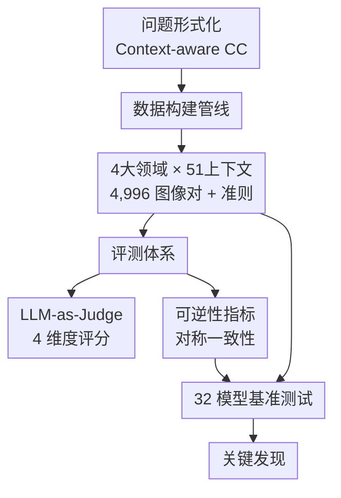

# C3-Bench: A Context-Aware Change Captioning Benchmark

**会议**: ECCV2026  
**arXiv**: [2606.25445](https://arxiv.org/abs/2606.25445)  
**代码**: [https://github.com/AutoCompSysLab/C3-Bench](https://github.com/AutoCompSysLab/C3-Bench)  
**领域**: 多模态VLM / 图像生成  
**关键词**: 变化描述, 上下文感知, 基准测试, LLM评测, 可逆性

## 一句话总结

C3-Bench 是一个面向上下文感知变化描述任务的综合性基准，包含 4,996 对人类标注图像对（覆盖 4 大领域 51 种真实变化上下文），首次将 LLM-as-Judge 引入变化描述评测体系，并引入可逆性指标；对 32 个模型的测评揭示了传统模型在开放域下全面崩溃、LMM 存在系统性感知/空间/位置偏误等关键盲区。

## 研究背景与动机

变化描述（Change Captioning）的任务是给定一对前后图像，自动生成描述其间变化的文本。这项能力在灾害监控、自动驾驶、遥感分析和媒体取证等下游应用中至关重要。然而"变化"这一概念天然具有歧义性——面对同一对图像，"什么变了"的正确答案完全依赖于看待它的上下文：在天气监测视角下，描述"积雪覆盖地面、云量减少"是有效的；在铁路监控视角下，描述"轨道左侧出现一辆列车"才是正确的，天气差异则应被视为伪变化。当前主流基准（如 LEVIR-CC、SpotTheDiff）几乎都忽略了这种上下文依赖性——它们要么在单一且狭窄的领域内构造图像对（如 LEVIR-CC 仅覆盖遥感住宅区），要么让标注者"任意"描述变化而不给定明确定义的变化准则，导致训练出的模型仅仅学会了数据集绑定的隐式语义，而非真正理解变化。与此同时，现有评测指标以 BLEU/ROUGE/BERTScore 等固定参考匹配为主，无法捕捉变化描述中哪些正确的语义等价表述——这一问题在输出灵活的大多模态模型（LMM）上尤为突出。

这种"上下文覆盖狭窄 + 评测粒度粗糙"的双重局限使得变化描述系统的真实世界泛化能力始终未得到系统检验。本文的核心洞见在于：要让变化描述评测有实际意义，必须从问题形式化层面入手——将"变化"的定义从无条件的隐式假设显式化为可指定、可控制的上下文准则。基于这一形式化，作者提出了 C3-Bench（Context-aware Change Captioning Benchmark），在数据覆盖、评测维度和模型测评三个方面同时填补空白。**核心 idea：以显式上下文准则（Change Criteria）统一变化描述的形式化定义，构建跨 4 大领域 51 种真实变化上下文的标注基准，并引入 LLM-as-Judge 细粒度评测与可逆性指标，首次系统揭示了现有模型在开放域变化理解上的系统性盲区。**

## 方法详解

### 整体框架

C3-Bench 不是一个"算法"，而是一套完整的基准设计与评测框架：它以新的上下文感知问题形式化（Context-aware Change Captioning）为理论基石，配套覆盖 51 种真实变化上下文的 4,996 对标注数据集、一套 LLM-as-Judge 细粒度自动评测指标（正确性/特异性/流畅性/相关性），以及一个独特的可逆性（Reversibility）指标——检验模型在交换前后图像顺序后描述是否对称一致。整个基准以一套高效的数据构建管线产出高质量标注，并用统一的提示模板对传统变化描述模型和 LMM 进行公平比较。

### 关键设计

**1. 上下文感知问题形式化：把"变化准则"从隐式变成显式参数**

传统变化描述的形式化 $y_{A\rightarrow B} = \arg\max p(y\mid I_A, I_B)$ 隐含了一个假设：模型知道"什么算变化"。这在实际中等于把语义边界交给了训练数据的隐式分布——LEVIR-CC 训练的模型认为颜色差异不是变化，CLEVR-CC 训练的模型却认为它是。C3-Bench 将其重写为 $y^c_{A\rightarrow B} = \arg\max p(y\mid I_A, I_B; C_c)$，将上下文准则 $C_c$ 显式作为输入参数。每个 $C_c$ 由三个结构化字段构成：(i) 需检测的变化（Change to Detect）——哪些对象/状态的变化是目标；(ii) 需忽略的变化（Change to Ignore）——哪些差异（光照、视角、季节）应视为伪变化；(iii) 语气与风格（Tone & Nuance）——应采用的叙述风格。这个形式化将传统模型作为 $C_c$ 为空（即退化为模型隐式偏好的特例，将 LMM 通过文本指令显式指定 $C_c$ 的统一到一个框架下，为公平比较奠定了基础。

**2. 多层次数据构建管线：从跨社区上下文蒸馏到多源标注质控**

数据构建的核心挑战在于变化标注成本极高，且跨上下文的图像对获取和一致性控制非常困难。C3-Bench 的管线分五步：(a) 上下文概念化（Context Conceptualization）——广泛梳理变化检测、图像编辑、异常检测等多个社区的文献，提炼出 51 种各具代表性的真实变化上下文，组织为自然场景、遥感影像、图像编辑、异常分析四大领域；(b) 上下文形式化——对每个上下文用前面提到的三字段模板编写准则 $C_c$；(c) 数据收集与配对——从 15+ 个公开基准（MVTecAD、SECOND、MagicBrush、PASLCD、ChangeVPR 等）获取多源图像对，对缺失的关键上下文从 Google Earth/Street View 等平台补充，通过特征匹配和 UTM 引导采样构建高保真对；(d) 标注——向标注者提供辅助元数据（变化掩码、损毁多边形、异常类别）和上下文准则、确保标注语义一致；(e) 过滤与质控——多轮验证（冗余过滤、时间顺序校验、描述-图像一致性检查）后按上下文重新平衡到目标数量。这个管线使得 C3-Bench 在上下文多样性上远超此前所有基准——LEVIR-CC 只有 1 个上下文（遥感住宅区/IER 覆盖 3 个上下文，而 C3-Bench 覆盖 51 个。

**3. LLM-as-Judge 评测和可逆性指标：从粗糙的词重叠到语义对齐的细粒度评估**

C3-Bench 首次在变化描述中引入 LLM-as-Judge 框架。以 GPT-5.2 为裁判，将模型生成的描述与真值对比，在四个维度上分别打分（1-10 分）：正确性（描述是否与真值语义一致）、特异性（描述是否具体而非泛泛）、流畅性（语言自然程度）、相关性（描述是否直接回答变化问题），同时输出一个聚合分数。用户实验（40 人参与）表明，这四个维度的相关性（Pearson r 0.62-0.73）显著优于 BLEU-4 (0.33) 和 BERTScore (0.45) 等传统指标。此外，可逆性指标检验模型的对称理解能力：令模型分别从 A→B 和 B→A 生成描述，用 GPT-5.2 判断两者是否描述了相反方向的同一组变化（赋分 0 或 1）。人类可逆性高达 0.93，最好的 LMM（Gemini-3-Pro）仅 0.73，最好的传统模型仅 0.28——揭示出严重的位置偏误。

### 一个完整示例：一条高速公路的上下文

以 Natural Scenes 领域下的 "highway" 上下文为例。该上下文的准则 $C_c$ 具体写明：需检测的变化包括车辆移动/出现/消失/改装、车道/护栏/路标的结构变化、交通标志的激活/停用等；需忽略的变化包括光照变化、视角导致差异、微小光度/压缩伪影、天气/季节/阴影差异；采用中性和客观的语气。评测时，系统提示模板将 $C_c$ 拼入 LMM 的 system prompt，每张图像前附 `<before>` / `<after>` 标签指示时间顺序。模型输出 `<output>...</output>` 包围的描述，与人工标注真值相比对。如果模型描述了"天色变暗"（属于需忽略的天气变化），则被标记为伪变化错误。

### 损失函数 / 训练策略

不适用（基准论文，传统模型在 4 个代表性数据集上各自独立训练，LMM 直接使用现成模型不做微调）。

## 实验关键数据

### 主实验

| 模型类别 | 模型 | Correctness | Specificity | Aggregation | Reversibility |
|---------|------|-------------|-------------|-------------|---------------|
| 人类水平 | Human | 6.96 | 7.12 | 7.45 | 0.93 |
| 商业 LMM | GPT-5.2 | **5.47** | **5.16** | **5.51** | 0.62 |
| 商业 LMM | Gemini-3-Pro | 5.45 | 5.15 | 5.50 | **0.73** |
| 商业 LMM | GPT-4o | 4.95 | 4.34 | 4.95 | 0.49 |
| 开源 LMM | Qwen3-VL-32B | 5.18 | 4.93 | 5.16 | 0.47 |
| 开源 LMM | InternVL3-78B | 4.86 | 4.51 | 4.94 | 0.45 |
| 传统模型 | DIRL | 1.36 | 1.53 | 2.30 | 0.20 |
| 传统模型 | VARD | 1.44 | 1.56 | 2.40 | 0.28 |

### 消融实验

**(a) 提示组件消融（GPT-5.2）**

| 配置 | Change Criteria | 时序标签 | Aggregation | Reversibility |
|------|----------------|---------|-------------|---------------|
| 无准则无标签 | ✗ | ✗ | 4.93 | 0.58 |
| 仅准则 | ✓ | ✗ | 5.35 | 0.60 |
| 准则 + 标签 + forward | ✓ | ✓ | **5.51** | 0.62 |
| 准则 + 标签 + backward | ✓ | ✓ | 5.31 | 0.62 |

**(b) 准则子组件消融**

| 配置 | Aggregation | 说明 |
|------|-------------|------|
| 三字段全 | **5.51** | 必检+忽略+语气 |
| 仅必检+忽略 | 5.44 | 去掉语气影响较小 |
| 仅必检+语气 | 5.49 | 去掉忽略变化影响较小 |
| 仅必检 | 5.12 | 忽略和语气缺失后下降明显 |

### 关键发现

- 传统模型在 C3-Bench 上全面崩溃（正确性 ~1.4/10），即使是在各自训练集上有 SOTA 结果的最新型号 DIRL 也不例外——说明它们习得的是数据集绑定的隐式语义，不具备任何真正的变化理解能力。
- LMM 的端到端评测表现远优于传统模型，但最强者 GPT-5.2 的聚合分（5.51/10）距人类水平（7.45）仍有很大差距。语义准确性是主要瓶颈（fluency 反而接近人类）。
- 错误分析显示感知错误（Perceptual Error）占总错误 63.3%，是首要瓶颈；空间错误在自然场景领域因视角差异突出；可逆性错误中不一致错误（Inconsistency Error）最常见，但在异常检测领域变化崩溃错误（Change Collapse Error）占优——模型倾向于专注异常线索而忽略"恢复原状"的准则。
- LMM 的位置偏误已经出现在简单的单对图像上（并非仅存在于长序列中），Gemini-3-Pro 可逆性最高仅 0.73——说明输入顺序的因果注意力缺陷是结构性的。
- 多数据集联合训练甚至损害传统模型性能（聚合分 1.79→1.31），原因是各数据集的隐式变化准则相互冲突（如颜色差异在 CLEVR-CC 中算变化，在 LEVIR-CC 中算伪变化），揭示了上下文感知形式化对数据融合的前提性意义。

## 亮点与洞察

- **上下文准则结构化**：将模糊的"变化定义"拆成"需检测/需忽略/语气"三字段模板，这一设计本身简洁且可扩展——后续新领域只需按模板编写准则即可纳入评测体系，无需重新设计标注协议。
- **可逆性指标的发现力**：仅让模型对同一对图像先后生成两个方向的描述就能拆解出位置偏误这一系统性缺陷，实验成本几乎为零，却暴露了结构性问题——一个值得在各类图像对比任务中推广的评测思路。
- **错误类型的细粒度归因**：将失败归纳为感知错误 / 伪变化错误 / 变化解释错误 / 空间错误四类 + 可逆性两类，使研究者能定位具体瓶颈——感知错误占 63% 为后 LMM 时代的变化描述指出了优先攻关方向（提升视觉感知精度比提升语言能力更紧迫）。
- **统一的 LMM 评估模板**：结构化 system prompt（任务 + 准则 + 输出格式 + 图像标签）的设计实践证明，显式指定变化准则 + 时序标签 + forward 方向推理能显著提升 LMM 性能，这一 prompt 设计原则可迁移到其他图像对比任务。

## 局限与展望

- C3-Bench 虽覆盖 51 种上下文，但每个上下文平均不到 100 对图像，且四领域分布不均衡——自然场景和遥感数据量更多，异常分析和图像编辑相对偏少，可能影响域级结论的统计稳定性。
- LLM-as-Judge 依赖 GPT-5.2 单模型，尽管论文用 Claude-Haiku-4.5 做了交叉验证，但裁判模型本身的变化描述能力可能成为评测天花板——当被评测模型有能力生成裁判无法识别的正确描述时，评分将出现偏差。
- 传统模型的评测协议要求每个模型在四个数据集上分别训练再分别测试 51 个上下文（导致 51×4 组实验），但训练数据不包含 C3-Bench 的任何图像对——这使得"传统模型全面崩溃"的结论对 LMM 同样成立吗？LMM 也未见过 C3-Bench 数据，但它的预训练数据可能包含来自相同数据源的图像，这一不公平对比在论文中未充分讨论。
- 可逆性指标仅给出 0/1 二值判断，粒度较粗——两个方向描述有部分重叠但又不完全对称时，二值判断可能掩盖中间程度的可逆理解。可以设计带权重的连续性可逆性分数。
- 变化准则的编写目前依赖人工，51 个上下文的准则设计是否充分覆盖了每个上下文内的语义变化？不同准则之间的判别性边界（如自然场景和遥感之间的地形变化重叠）可能引入模糊性。

## 相关工作与启发

- **vs CLEVR-Change / LEVIR-CC**: 前两者分别只覆盖合成场景（积木物体）和单一遥感场景（住宅区），且评测指标为 BLEU/ROUGE 等固定参考匹配。C3-Bench 覆盖 51 个真实上下文 + 4 领域，评测维度扩展到 4 个语义维度 + 可逆性，多样性高出 1-2 个数量级。
- **vs SpotTheDiff / IER**: 前两者变化上下文数量极少（1 和 3 个），且没有显式变化准则——标注者自由描述变化，导致标注语义空间不透明。C3-Bench 通过结构化准则把"什么算变化"显式化，使评测结果可追溯、可复现。
- **vs BLINK / MMTBench**: 这些多模态基准也涉及图像对比较，但采用多项选择问答而非开放式描述。C3-Bench 则是开放生成评测，与变化描述的实践场景更贴近，且首次引入了 LMM-as-Judge 和可逆性两个评测创新。
- **vs MuirBench**: 评估多图像理解的基准，但聚焦于多个图像之间的推理关系（排序/对应），不专门针对"前后变化"这一特定对比语义。C3-Bench 专注于细粒度的上下文感知变化描述，评测粒度更细。

## 评分

- 新颖性: ⭐⭐⭐⭐⭐ 首次在变化描述领域提出上下文感知问题形式化 + LLM-as-Judge 评测 + 可逆性指标，问题定义本身就有方法论贡献。
- 实验充分度: ⭐⭐⭐⭐⭐ 32 个模型（传统×6/商业 LMM×9/开源 LMM×17）在 51 个上下文上的系统性评测 + 用户实验 + 错误分析 + 提示消融 + 多数据集训练分析，覆盖全面且分析深入。
- 写作质量: ⭐⭐⭐⭐⭐ 问题形式化的动机清晰、数据构建管线描述具体、实验发现有数值支撑且归因到位。可逆性指标的引入和错误分类框架都有很强的解释力。
- 价值: ⭐⭐⭐⭐⭐ 为变化描述领域提供了一个方法论正确的、面向真实泛化的评测平台，更重要的是其揭示的系统性盲区（传统模型假性泛化 + LMM 感知瓶颈 + 位置偏误）直接指明了后续研究的攻关方向。

<!-- RELATED:START -->

## 相关论文

- [\[ECCV 2026\] VTEdit-Bench: A Comprehensive Benchmark for Multi-Reference Image Editing Models in Virtual Try-On](vtedit-bench_a_comprehensive_benchmark_for_multi-reference_image_editing_models_.md)
- [\[ECCV 2026\] PhyEditBench: A Real-World Multi-Stage Benchmark for Physics-Aware Image Editing](phyeditbench_a_real-world_multi-stage_benchmark_for_physics-aware_image_editing.md)
- [\[CVPR 2026\] MICON-Bench: Benchmarking and Enhancing Multi-Image Context Image Generation in Unified Multimodal Models](../../CVPR2026/image_generation/micon-bench_benchmarking_and_enhancing_multi-image_context_image_generation_in_u.md)
- [\[NeurIPS 2025\] ALE-Bench: A Benchmark for Long-Horizon Objective-Driven Algorithm Engineering](../../NeurIPS2025/image_generation/alebench_a_benchmark_for_longhorizon_objectivedriven_algorit.md)
- [\[ICLR 2026\] FLUX-Reason-6M & PRISM-Bench: A Million-Scale Text-to-Image Reasoning Dataset and Comprehensive Benchmark](../../ICLR2026/image_generation/flux-reason-6m_prism-bench_a_million-scale_text-to-image_reasoning_dataset_and_c.md)

<!-- RELATED:END -->
