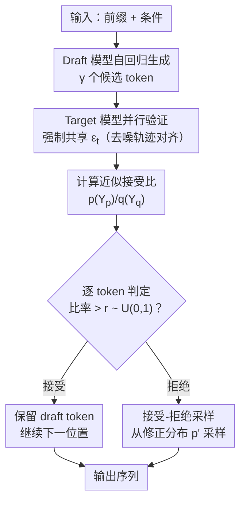

# Continuous Speculative Decoding for Autoregressive Image Generation

**会议**: ECCV 2026  
**arXiv**: [2411.11925](https://arxiv.org/abs/2411.11925)  
**代码**: 无  
**领域**: 图像生成  
**关键词**: 推测解码, 自回归图像生成, 扩散模型, 推理加速, 连续分布

## 一句话总结
本文首次将推测解码从离散分布扩展到连续分布，通过去噪轨迹对齐（denoising trajectory alignment）提升 draft-target 接受率，再配合接受-拒绝采样（acceptance-rejection sampling）解决修正分布无解析表达式的采样难题，在 MAR、xAR、Harmon 等多个连续视觉 AR 模型上实现超过 2 倍墙钟加速且保持生成质量不变，全程无需额外训练。

## 研究背景与动机
**领域现状**：连续视觉自回归（AR）模型（如 MAR、xAR、Harmon）通过扩散去噪过程逐 token 生成图像，避免了离散 VQ tokenizer 带来的训练不稳定和信息损失问题，在图像生成质量上表现优异。然而，与 LLM 类似，其逐 token 串行解码的推理方式导致生成速度极慢，成为实际部署的核心瓶颈。

**现有痛点**：推测解码（speculative decoding）是 LLM 领域成熟的加速技术——用小模型（draft model）快速生成候选 token，大模型（target model）并行验证，通过概率比 $p(x)/q(x)$ 决定接受或拒绝。已有工作（LANTERN、SJD）将其扩展到离散视觉 AR 模型，但所有这些方法都依赖离散概率分布的直接计算，无法直接用于连续分布场景。

**核心矛盾**：连续分布下存在两个根本障碍。(1) 接受率极低：draft 和 target 模型各自学到不同的数据分布，draft 的去噪轨迹与 target 期望轨迹高度发散，导致共享路径的概率比 $p(Y)/q(Y)$ 仅为 $5.33 \times 10^{-23}$ 量级，接受率近乎 0%。(2) 修正分布无解析表达式：token 被拒绝后需从修正分布 $p'(x) = \mathrm{norm}(\max(0, p(x)-q(x)))$ 中重采样，但连续空间下该分布涉及高维高斯乘积的积分 $Z = \int \max(0, p-q) \, dY$，无法解析计算，也无法直接采样。

**切入角度**：用近似接受准则 $p(Y_p)/q(Y_q)$（分别评估两个模型对同一个 token $x_0$ 的建模概率，而非要求它们走同一条轨迹）替代不可行的精确准则；再通过去噪轨迹对齐（共享重参数化噪声 $\varepsilon_t$）提升接受率并消除概率比中的指数项；最后用接受-拒绝采样配合巧妙的上界因子 $M=1/Z$ 让 $Z$ 自我消去，且复用轨迹对齐的简化结果避免额外模型推理——三个设计环环相扣，形成完整的连续推测解码方案。

**核心 idea**：在扩散去噪的重参数化过程中，让 draft 和 target 模型共享随机噪声 $\varepsilon_t$，使两条轨迹的期望平方距离减少 $2 \cdot \mathrm{tr}[\sqrt{\Sigma_t^q \Sigma_t^p}]$，从而大幅提升接受率；同时利用该对齐消去修正分布采样中的复杂积分项，实现零额外推理开销的高效重采样。

## 方法详解

### 整体框架
本方法要解决的核心问题：给定一个连续 AR 模型作为 target $M_p$ 和一个同架构更小的 draft $M_q$，如何在保持 $M_p$ 输出分布不变的前提下加速推理。整体流程遵循标准推测解码的 draft-and-verify 范式，但在两个关键环节做了针对连续分布的适配：(1) 接受准则——用近似比率 $p(Y_p)/q(Y_q)$ 替代不可行的 $p(Y)/q(Y)$；(2) 拒绝后重采样——用接受-拒绝采样替代直接采样修正分布。

框架以 target 模型预填充的一小部分 token 作为可靠前缀（解决早期 AR 步骤的不一致），draft 模型基于此前缀自回归生成 $\gamma$ 个候选 token，每个 token 的生成过程记录其去噪轨迹中的重参数化噪声 $\varepsilon_t^q$。target 模型然后以相同前缀并行验证所有候选，去噪过程中强制使用相同的 $\varepsilon_t$（即 $\varepsilon_t^p = \varepsilon_t^q$，实现去噪轨迹对齐），计算每个位置的接受比，并逐 token 判定接受或拒绝。对第一个被拒绝的位置，通过接受-拒绝采样从修正分布中重采样新 token，最终输出合并后的序列。

### 关键设计

**1. 近似接受准则与去噪轨迹对齐：解决概率比极小的根本问题**

直接套用离散推测解码的接受准则 $p(Y)/q(Y)$ 完全不可行。在连续扩散模型中，token $x_0$ 的产生经过 $T$ 步去噪 $x_T \to x_{T-1} \to \dots \to x_0$，这 $T$ 个中间状态组成一条轨迹 $Y = [x_0, x_1, \dots, x_T]$。理论上概率比应计算 target 和 draft 各自赋予同一条轨迹 $Y$ 的联合概率——但问题是，draft 生成的轨迹 $Y$ 几乎不可能落在 target 的高概率区域，每条轨迹拿出来比值都极小，$T$ 步累积后 $p(Y)/q(Y) \approx 5.33 \times 10^{-23}$，接受率 0%。

本文转而采用**近似接受准则** $p(Y_p)/q(Y_q)$：给定同一个最终 token $x_0$（由 draft 生成），让 target 模型以 $x_0$ 为终点、用自己的模型参数重新跑一遍去噪过程得到轨迹 $Y_p$（满足 $x_0^p = x_0^q = x_0$），再计算两条轨迹各自模型下的联合概率之比。直观上，这等价于比较两个模型对「同一个 token $x_0$」分别赋予的可能性，而非要求它们走完全相同的轨迹。

仅靠近似准则还不够——如果两条轨迹各自独立采样噪声 $\varepsilon_t^p \neq \varepsilon_t^q$，token 间距离仍很大。本文提出**去噪轨迹对齐**：在重参数化采样 $x_{t-1} = \sqrt{\Sigma_\theta(x_t, t)} \cdot \varepsilon_t + \mu_\theta(x_t, t)$ 中，强制 $\varepsilon_t^p = \varepsilon_t^q$，即每一步去噪使用相同的随机噪声。

**定理 1（重参数化邻近性）**：设 $\varepsilon_t^p = \varepsilon_t^q$，两步的期望平方距离之差为：
$$\mathbb{E}_{\neq}[||x_{t-1}^q - x_{t-1}^p||^2] - \mathbb{E}_{=}[||x_{t-1}^q - x_{t-1}^p||^2] = 2 \cdot \mathrm{tr}\left[\sqrt{\Sigma_t^q \Sigma_t^p}\right] \geq 0$$

经过对齐后，高斯 PDF 中共同的指数项 $\exp\{\frac{1}{2}\varepsilon_t^T\varepsilon_t\}$ 在分子分母中直接约掉，接受准则大幅简化为仅涉及方差行列式的紧凑形式：
$$\frac{p(Y_p)}{q(Y_q)} = \frac{p_\theta(x_0|x_1^p)}{q_\theta(x_0|x_1^q)} \cdot \Sigma, \quad \Sigma = \frac{\prod_{t=2}^T \sqrt{|\Sigma_t^q|}}{\prod_{t=2}^T \sqrt{|\Sigma_t^p|}}$$

其中 $\Sigma$ 沿中间去噪步骤累积，可高效计算。实验验证：对齐后平均 token 距离从 2.56 降至 1.13，接受率从 7% 跃升至 30%+。不对齐时生成的图像出现明显畸变和伪影，对齐后显著消除——因此对齐既是加速手段，也是质量保障。

**2. Token 预填充：补偿自回归早期步骤的前缀不一致**

除了去噪轨迹层面的不一致，draft 和 target 模型在自回归维度也存在不一致。在生成的最初几步，两个模型基于各自预测的前缀 token 做条件生成，前缀嵌入的差异导致输出分布发散，早期接受率极低（约 5%，见论文 Fig. 9）。随着 AR 步骤增加，前缀逐步由 target 验证过的 token 填充，分布逐渐趋同，接受率才逐步回升。

**Token 预填充**的做法简单直接：在推测解码开始前，先由 target 模型自身生成一小部分前缀 token（如总步数的 5%），确保后续 draft 验证时始终基于一致的 target 前缀。这样做不会增加延迟——因为低接受率下推测解码本就退化为 target 模型逐 token 解码，预填充只是把这一步提前做了。

实验表明：5% 预填充即可将接受率从 0.25 提升至 0.30（MAR-H + MAR-B，$\gamma=32$），同时不损失加速比（1.63× 不变）。15% 预填充可进一步提升接受率至 0.33，但加速比开始轻微下降至 1.61×——预填充的 token 不参与推测加速，收益递减。

**3. 接受-拒绝采样：解决修正分布不可直接采样且避免重复模型推理**

当 draft token 被拒绝后，需从修正分布中采样新 token：
$$p'(Y) = \frac{\max(0, p(Y) - q(Y))}{Z}, \quad Z = \int_{Y'} \max(0, p(Y') - q(Y')) dY'$$

$Z$ 涉及高维高斯乘积的积分，无解析表达式，直接采样不可行。本文采用接受-拒绝采样：从 target 分布 $p(Y)$ 采样候选，以概率 $\alpha_s = p'(Y) / (M \cdot p(Y))$ 接受。

关键的技巧在于**上界因子的选取**。由 $\max(0, p-q) \leq p$ 可设 $M = 1/Z$，此时 $\alpha_s$ 中 $Z$ 精准消去：
$$\alpha_s = \frac{\max(0, p(Y)-q(Y))/Z}{p(Y)/Z} = \frac{\max(0, p(Y)-q(Y))}{p(Y)}$$

但这仍然需要跑完整的扩散去噪来采样 $p(Y)$，开销巨大。进一步复用去噪轨迹对齐的简化结果（设计 1），得到**推论 1（易计算的拒绝阈值）**：
$$\alpha_s = \frac{\max(0, \Sigma \cdot p_\theta(x_0|x_1^p) - q_\theta(x_0|x_1^q))}{\Sigma \cdot p_\theta(x_0|x_1^p)}$$

这里 $x_0$ 只需从单步高斯分布 $p_\theta(x_0|x_1^p)$ 采样（一次前向），无需跑完整 $T$ 步去噪。实测接受-拒绝采样的运行时间仅占模型总推理时间的极小部分（$\gamma=32$ 时为 0.0047 秒 vs 模型推理 51 秒），重复采样通常只需 2-3 轮即可接受。

### 一个完整示例

以 MAR-H 为 target、MAR-B 为 draft、$\gamma=4$ 为例，演示单次推测解码步骤（对应论文算法 1）：

1. **前缀准备**：已由 MAR-H 预填充 5% 的前缀 token，作为后续 draft/target 的公共条件。
2. **Draft 生成**：MAR-B 基于前缀自回归生成 4 个候选 token $\{x_1,x_2,x_3,x_4\}$，每个 token 经扩散去噪采样的每一步记录 $\varepsilon_t^q$。
3. **Target 并行验证**：MAR-H 以相同前缀为条件，并行跑 5 次前向（前缀、前缀$+x_1$、$+x_{1:2}$、$+x_{1:3}$、$+x_{1:4}$），每次去噪使用与步骤 2 **完全相同的 $\varepsilon_t$**（轨迹对齐），得到每个位置的 target 分布参数。
4. **逐 token 判定**：对每个候选 $x_i$，计算接受比 $r_i = \Sigma \cdot p_\theta(x_i|x_1^p) / q_\theta(x_i|x_1^q)$，与 $u_i \sim U(0,1)$ 比较。若 $r_i > u_i$ 则接受，否则拒绝。假设 $x_1, x_2$ 被接受（$r_1=2.1, r_2=1.5$），$x_3$ 被拒绝（$r_3=0.6, u_3=0.8$）。
5. **重采样**：在 $x_3$ 位置执行接受-拒绝采样——从 $p_\theta(x_0|x_1^p)$ 采样候选 $x_t$，计算 $\alpha_s = \max(0, \Sigma \cdot p - q)/(\Sigma \cdot p)$，若 $\epsilon \sim U(0,1) < \alpha_s$ 则接受 $x_t$。实际约 2-3 轮循环后接受。
6. **输出**：最终输出 = 前缀 $+ [x_1, x_2, x_t]$，本步共获得 3 个有效 token（而非串行的 1 个），节省了 2 次 target 模型串行前向。

### 损失函数 / 训练策略

本方法**完全免训练**：不对 draft 或 target 模型做任何微调、蒸馏或架构修改，直接使用官方预训练权重。推测解码从理论上可保证输出分布与原始 target 模型一致（无损加速），加速完全来自推理时 draft-and-verify 的并行机制。

关键超参数：(1) draft 长度 $\gamma \in \{4, 8, 16, 32\}$——越大加速潜力越高但接受率递减，是加速效果的核心杠杆；(2) 预填充比例——推荐 5%，过大则预填充 token 不参与加速、收益递减；(3) 扩散采样器——支持 DDPM 和 DDIM 等变体，DDIM 100 步下仍有 2.30× 加速。所有实验均在单张 A100 GPU 上完成，batch size 1-256。

## 实验关键数据

### 主实验

加速比与质量指标（墙钟实测，单卡 NVIDIA A100）：

| 模型对（Target + Draft） | 分辨率 | 最大加速比 | 对应 $\alpha$ | 质量影响 |
|--------------------------|--------|-----------|---------------|----------|
| MAR-H (943M) + MAR-B (208M) | 256×256 | 2.33× (bs=256, $\gamma$=32) | 0.19 | FID 2.35→2.36±0.05，基本持平 |
| xAR-H (1.1B) + xAR-B (172M) | 256×256 | 2.72× (bs=256, $\gamma$=32) | 0.22 | FID 1.79→1.82±0.07，基本持平 |
| Harmon-H (1.5B) + Harmon-B (0.5B) | 256×256 | 2.05× (bs=32, $\gamma$=32) | 0.17 | FID 8.39→8.38，CLIPScore 34.8→34.7 |
| Harmon-H (1.5B) + Harmon-B (0.5B) | 512×512 | 2.54× (bs=32, $\gamma$=32) | 0.15 | 各项指标基本持平 |

加速比与 batch size 正相关（大 batch 下 draft/target 推理时间比 $c$ 更小，并行优势更明显）、与 draft 长度 $\gamma$ 正相关；接受率与 $\gamma$ 负相关（更长的 draft 意味着更靠后的 token 预测难度更大）。MAR 和 xAR 在 FID/IS 上与原模型无显著差异（均在标准误差范围内），Harmon 在 Geneval 细粒度指标中仅 Color Attri. 有轻微下降（0.48→0.44），其余持平。

### 消融实验

去噪轨迹对齐的效果（MAR-H + MAR-B）：

| $\gamma$ | $\alpha$（无对齐） | $\alpha$（有对齐） | token 距离（无对齐） | token 距离（有对齐） |
|----------|-------------------|-------------------|---------------------|---------------------|
| 32 | 0.07 | 0.30 | 2.56 | 1.13 |
| 16 | 0.07 | 0.33 | 2.36 | 0.91 |
| 8 | 0.13 | 0.31 | 2.22 | 0.82 |
| 4 | 0.14 | 0.32 | 2.17 | 0.80 |

对齐将 token 距离从 >2 降至约 1，接受率从 ~7% 提升至 ~30%。视觉上，不对齐时图像出现明显畸变和伪影，对齐后显著消除——对齐是接受率和生成质量的双重保障。

Token 预填充比例的消融（MAR-H + MAR-B, $\gamma=32$, bs=256）：

| 预填充比例 | $\alpha$ | 加速比 |
|-----------|----------|--------|
| 0% | 0.25 | 1.63× |
| 5% | 0.30 | 1.63× |
| 15% | 0.33 | 1.61× |

5% 预填充有效提升接受率而不损失加速比；15% 虽进一步提升接受率但加速比开始轻微下降。

### 关键发现
- **去噪轨迹对齐是贡献最大的单模块**：去掉对齐后接受率从 30% 暴跌至 7%（$\gamma=32$），且图像出现严重伪影。对齐既是加速手段，更是质量保障。
- **加速比最佳取值在 $\gamma=32$**：此时加速收益最大（2.33×），继续增大 $\gamma$ 受限于小模型能力，接受率进一步下降，综合增益可能不增反降。
- **大 batch 场景加速效果更好**：bs=256 时 2.33× vs bs=1 时 1.44×，原因在于大 batch 下 draft 相对 target 的推理时间比 $c$ 更小，并行验证的摊薄优势更大。
- **纹理复杂度决定接受率**：背景和简单纹理区域的 token 接受率高，细节丰富区域接受率低（热力图可视化证实）。draft 小模型在精细纹理建模上的能力差距是自然的瓶颈。
- **DDIM 采样同样有效**：替换 DDPM 为 DDIM（100 步），加速比仍达 2.30×（$\gamma=32$），方法对不同扩散采样器不敏感。

## 亮点与洞察
- **共享 $\varepsilon_t$ 的一石三鸟**：让两个模型在每一步去噪中使用相同的重参数化噪声，这是一个代码层面只需一行 seed 同步的极简操作，却同时做到了——缩小轨迹距离提升接受率、消除概率比中的指数项简化计算、为接受-拒绝采样提供易计算的拒绝阈值。一个设计复用三次，是本文最核心的系统性巧思。
- **上界因子 $M=1/Z$ 的优雅构造**：在接受-拒绝采样中，一般需要找一个足够大的 $M$ 保证 $M \cdot p(Y) \geq p'(Y)$。本文直接取 $M=1/Z$，恰好让 $Z$ 在 $\alpha_s$ 中自我消去，无需计算复杂积分。这一技巧在离散推测解码中并不需要（离散情况下 $Z$ 直接求和可得），是连续域特有的精巧解法。
- **完全免训练的实用价值**：不蒸馏、不微调、不改架构、不换权重，可直接挂载到任何已有连续 AR 模型的推理流程上实现 2×+ 加速。这种零门槛的即插即用特性使其从实验室到工程的迁移成本极低，在模型部署场景中有直接的应用价值。
- **框架的跨领域可迁移性**：任何输出为连续分布的自回归生成任务（音频生成、视频生成、分子生成等），只要具备 draft-target 双模型的条件，本文的三个核心设计（轨迹对齐、预填充、接受-拒绝采样）都可直接复用。附录已讨论了 GMM 分布、DDIM 采样器等变体上的理论兼容性。

## 局限与展望
- **加速上限受模型规模比约束**：当前 draft/target 规模比不够悬殊（MAR-B 208M vs MAR-H 943M，推理时间比 $c \approx 0.38$），远高于 LLM 场景中 draft 仅占 5% 推理时间的典型值。作者预期在更大 target（7B/13B）配更小 draft（97M/125M）时加速比会显著提升，但当前缺乏该量级的开源连续视觉 AR 模型。
- **仅在扩散去噪类型上实验**：论文在附录讨论了 GMM 等分布的兼容性，但未提供实验验证。所有实验均基于 DDPM/DDIM，尚未在 GMM 输出（如 GIVT、DiCoDe）或其他连续分布类型上验证。
- **生成质量在高压缩比下的退化边界不明**：论文未定量分析不同纹理复杂度下可接受的加速比上限。高纹理区域的低接受率可能在某些极端场景（如全图密集纹理）下导致质量退化。
- **预填充策略较粗糙**：当前使用固定比例（5%）预填充，未根据图像内容或实时接受率动态调整。自适应预填充策略（如根据早期 AR 步骤的接受率实时决定何时切换为推测解码）值得探索。
- **可从正交方向叠加加速**：扩散采样加速（DDIM/DPM-Solver 等减少去噪步数）和推测解码（减少 AR 步数）作用于推理流水线的不同阶段，两者叠加可进一步提升总加速比，当前论文未系统探索。

## 相关工作与启发
- **vs 离散推测解码（Leviathan et al., 2023；Chen et al., 2023）**：LLM 推测解码是本文的直接前身。核心差异在于，LLM 输出离散 softmax 分布，$p(x)/q(x)$ 可直接查表计算，修正分布的归一化求和也是 trivial 的。本文的贡献正是解决连续域中「概率不可直接获取」和「修正分布不可直接采样」这两个根本差异所引入的系列子问题。
- **vs 离散视觉推测解码（LANTERN / SJD）**：LANTERN 和 SJD 将推测解码引入基于 VQ tokenizer 的离散视觉 AR 模型。本文首次跳过了 VQ tokenizer 这一信息瓶颈，直接在连续扩散空间上实现推测解码，是范式层面的扩展。
- **vs 蒸馏对齐（DistillSpec / Online Speculative Decoding）**：通过蒸馏让 draft 分布更贴近 target 是提升接受率的另一路线。本文的免训练路线与之正交，两者可以组合——先用蒸馏提升 draft 质量，再用本文的连续推测解码框架实现无损加速。
- **vs 扩散模型快速采样（DDIM / DPM-Solver / Rectified Flow）**：这些方法减少的是每个 token 的去噪步数（$T \to$ 更少），本文减少的是自回归步数（$N \to N/\text{speedup}$），两者作用于推理的两个正交维度，理论上可直接叠加。

## 评分
- 新颖性: ⭐⭐⭐⭐☆ 首次将推测解码从离散扩展到连续分布，三个设计（轨迹对齐、预填充、接受-拒绝采样）针对连续域的两个核心难题形成了完整方案；但推测解码的 draft-and-verify 范式本身继承自 LLM 文献，顶层框架的新颖性适中，贡献主要在适配层的精巧构造。
- 实验充分度: ⭐⭐⭐⭐⭐ 在 3 个模型（MAR/xAR/Harmon）、2 个分辨率（256/512）、4 种 draft 长度、多 batch size 下做了详尽墙钟和 FID/IS/CLIPScore/Geneval 评测，消融覆盖对齐、预填充、温度、CFG、DDIM、mask generation 对比等多个维度，附录还补充了 bias 理论分析和可视化热力图。
- 写作质量: ⭐⭐⭐⭐☆ 问题定义清晰、离散/连续对比直观（Fig. 2）、理论推导完整（定理+推论均在附录给出完整证明）、算法以伪代码呈现；正文实验表格较多阅读流畅度略受影响，但整体结构合理。
- 价值: ⭐⭐⭐⭐⭐ 连续视觉 AR 模型的推理速度是落地的关键瓶颈，本文提供的免训练 2×+ 加速方案有直接实用价值。框架对连续域自回归生成任务（图像/音频/视频/分子）有通用性，去噪轨迹对齐的「共享噪声」思路也可启发其他连续生成模型的加速研究。

<!-- RELATED:START -->

## 相关论文

- [\[AAAI 2026\] Annealed Relaxation of Speculative Decoding for Faster Autoregressive Image Generation](../../AAAI2026/image_generation/annealed_relaxation_of_speculative_decoding_for_faster_autor.md)
- [\[ICCV 2025\] Grouped Speculative Decoding for Autoregressive Image Generation](../../ICCV2025/image_generation/grouped_speculative_decoding_for_autoregressive_image_generation.md)
- [\[CVPR 2026\] SJD-PAC: Accelerating Speculative Jacobi Decoding via Proactive Drafting and Adaptive Continuation](../../CVPR2026/image_generation/sjd-pac_accelerating_speculative_jacobi_decoding_via_proactive_drafting_and_adap.md)
- [\[CVPR 2026\] Multi-Scale Local Speculative Decoding for Image Generation](../../CVPR2026/image_generation/multi-scale_local_speculative_decoding_for_image_generation.md)
- [\[ICML 2026\] Speculative Coupled Decoding for Training-Free Lossless Acceleration of Autoregressive Visual Generation](../../ICML2026/image_generation/speculative_coupled_decoding_for_training-free_lossless_acceleration_of_autoregr.md)

<!-- RELATED:END -->
