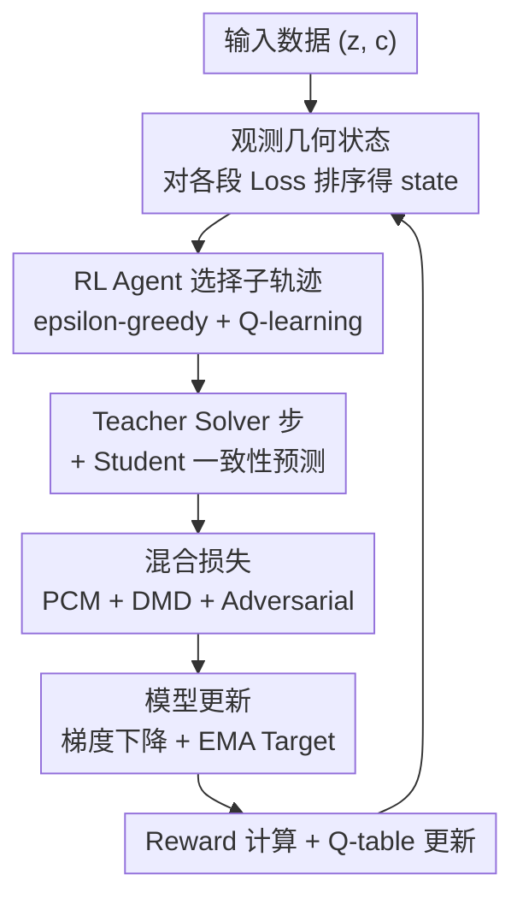

# Curvature-Adaptive Consistency Flow Matching: Autonomous Trajectory Optimization via Reinforcement Learning

**会议**: ECCV 2026  
**arXiv**: [2606.22394](https://arxiv.org/abs/2606.22394)  
**代码**: 无  
**领域**: 扩散模型 / 图像生成  
**关键词**: 一致性蒸馏, 流匹配, 强化学习, 轨迹优化, 课程学习

## 一句话总结
CACFM 将一致性蒸馏重新建模为动态决策过程，用轻量 RL agent 自动探测 PF-ODE 轨迹上的高曲率瓶颈段并优先训练，结合 Flow 适配的 DMD 和对抗一致性损失，在 FLUX 和 SDXL 上以 4 步推理达到 SOTA，FID 比 FLUX-schnell 低 2 个点以上。

## 研究背景与动机
Flow Matching 及其一致性蒸馏方法已成为加速扩散模型推理的主流范式。LCM、PCM 等方法将 PF-ODE 轨迹分段并学习从任意点到原点的直接映射，极大减少了推理步数。然而，现有蒸馏方法在采样策略上呈现出明显的**静态性**：它们要么用均匀分布采样子轨迹段，要么直接复用 Rectified Flow 训练中的 Logit-Normal 分布（假设中间步最重要），从未根据蒸馏过程自身的优化动态调整采样重点。

本文揭示了一个关键矛盾：一致性蒸馏的优化难度分布与标准迭代生成完全不同。通过计算 converged teacher 下的 Oracle Consistency Error，作者发现真正的优化瓶颈在**边界阶段**（初始化和最终精修），呈 U 形分布，而非 Logit-Normal 假定的钟形中间集中分布。静态采样策略因此大量浪费算力在低曲率的线性段，同时欠拟合高曲率的转折区，导致极低步数下出现结构坍塌和纹理模糊。

**核心 idea**：把「在哪段轨迹上训练」本身变成一个可通过 RL 学习的决策问题——用一个轻量级 Q-learning agent 作为几何探针，自动感知各段优化难度、动态分配训练预算，无需任何人工调度即可涌现出从粗到精的课程学习策略。

## 方法详解

### 整体框架
CACFM 将一致性蒸馏重构为一个闭环动态系统：RL agent 感知轨迹各段的几何瓶颈（状态），选择当前最值得优化的子轨迹段（动作），student 模型在该段上用混合损失更新（一致性 + 对抗 + DMD），更新后的 loss 变化反馈为 reward 驱动 agent 的下一轮决策。整个框架在标准 PCM 蒸馏循环中插入了一个极轻量的决策层——参数量级可忽略，但改变了训练资源分配的底层逻辑。

### 关键设计

**1. RL Agent as Geometric Probe：将子轨迹选择建模为 MDP 并用表格 Q-learning 求解**

静态采样（Uniform / Logit-Normal）的根本问题是它对 PF-ODE 轨迹的曲率异质性完全无感知——所有段的训练机会均等或按固定先验分配，导致算力浪费在已经学好的平滑段上。CACFM 的解法是把「选哪段训练」做成一个决策问题。

具体做法：将连续轨迹 $t \in [0,1]$ 离散为 $M=4$ 个语义阶段（Initialization、Structural Formation、Texture Filling、Final Refinement），状态 $s_t$ 定义为各段当前 consistency loss 的排序（共 $M! = 24$ 种可能状态），动作 $a_t \in \{1,\dots,M\}$ 为选定训练的子轨迹段。状态空间的离散化设计是刻意为之——24 种状态的表格 Q-learning 可以在极少量迭代内收敛，完全不需要神经网络策略，额外计算开销几乎为零。

reward 设计是该 MDP 的关键：不同子轨迹段天然有不同的 loss 量级，直接用原始 loss 下降量做 reward 会引入偏差。CACFM 采用 baseline-advantage 策略：为每段维护一个 consistency loss 的 EMA baseline $B_t(m)$，reward 定义为当前 loss 相对 baseline 的改进量 $r_t = \lambda_r \cdot (B_t(a_t) - \mathcal{L}_{\text{con}})$，其中 $\lambda_r=100$，baseline 更新系数 $\beta=0.95$。Q-learning 更新为 $Q(s_t, a_t) \leftarrow Q(s_t, a_t) + \alpha[r_t + \gamma \max_a Q(s_{t+1}, a) - Q(s_t, a_t)]$，$\alpha=0.1, \gamma=0.9$，探索策略 $\epsilon$ 在前 20k 步从 1.0 线性衰减到 0.1。

为什么有效：baseline-advantage 机制消去了不同段 loss 量级差异的偏差，让 agent 真正学习「选哪段收益更大」而非「哪段 loss 更高」；表格 Q-learning 的极低计算开销使 agent 可以嵌入每一次训练迭代，实现实时的动态调度；状态排序而非原始 loss 值作为状态，提供了跨 batch 的归一化鲁棒性。

**2. Flow-adapted DMD + Score Estimation：从 velocity 场解析出 score 函数，实现分布级对齐**

一致性损失约束的是点对点的轨迹映射，在极低步数（如 4 步）下容易出现 mode collapse 或模糊伪影——这是单点匹配的内在局限。CACFM 引入 Distribution Matching Distillation（DMD），在分布层面强制 student 的生成分布 $\mathbb{P}_{\boldsymbol{\theta}}^{\text{student}}(\mathbf{x}_0)$ 逼近 teacher 的分布 $\mathbb{P}_{\boldsymbol{\phi}}^{\text{teacher}}(\mathbf{x}_0)$，即最小化 KL 散度 $D_{\text{KL}}(\mathbb{P}_{\boldsymbol{\theta}}^{\text{student}} \| \mathbb{P}_{\boldsymbol{\phi}}^{\text{teacher}})$。

DMD 的梯度近似为 $\nabla_{\theta}\mathcal{L}^{\text{DMD}} \approx \mathbb{E}\left[(\boldsymbol{s}^{\text{teacher}}(\mathbf{x}_{\tau}) - \boldsymbol{s}^{\text{student}}(\mathbf{x}_{\tau})) \nabla_{\theta}\boldsymbol{f}_{\boldsymbol{\theta}}(\mathbf{x}_t, t)\right]$，需要计算 teacher 和 student 的 score 函数。关键问题在于 Flow Matching 模型预测的是 velocity 场 $\boldsymbol{v}$ 而非 diffusion 模型中的噪声 $\boldsymbol{\epsilon}$，不能直接套用扩散模型的 score 估计公式。作者利用 Tweedie's formula 推导出 Flow Matching 框架下 score 与 velocity 的精确解析关系：

$$s_{\theta}(\mathbf{x}_t, t) = -\frac{\mathbf{x}_t + (1-t)\boldsymbol{v}_{\boldsymbol{\theta}}}{t}$$

该推导基于 optimal transport 概率路径 $p_t(\mathbf{x}|\mathbf{x}_0) = \mathcal{N}((1-t)\mathbf{x}_0, t^2\mathbf{I})$，完整步骤见论文附录。此外，student 自身的 score 同样用 student 模型通过上式估计，实现自蒸馏（self-distillation），避免引入额外的判别器网络。这一步的创新在于将 DMD 无缝适配到 velocity-predicting 的 Flow Matching 框架中，而非简单地复用在 noise-predicting 扩散模型上的现成做法。

**3. Adversarial Consistency Loss：用判别器约束维持流形一致性，防止自蒸馏漂移**

DMD 的自蒸馏机制（student 用自己的 score 做引导）存在固有风险：student 的 score 估计不准确时，KL 散度的优化方向可能偏离真实分布，导致生成结果漂移到自然图像流形之外。CACFM 引入对抗一致性损失作为正则化约束：一个以文本 prompt $\boldsymbol{c}$ 为条件的判别器 $\mathcal{D}$，对 student 预测 $\tilde{\mathbf{x}}_s$ 和 teacher target $\hat{\mathbf{x}}_s$（均加噪声扰动）施加 hinge loss：

$$\mathcal{L}^{\mathrm{adv}} = \operatorname{ReLU}(1 + \mathcal{D}(\tilde{\mathbf{x}}_s, \boldsymbol{c})) + \operatorname{ReLU}(1 - \mathcal{D}(\hat{\mathbf{x}}_s, \boldsymbol{c}))$$

这个 loss 推动 student 的预测结果在判别器看来与 teacher 不可区分，本质上是对「一致性映射是否落在自然图像流形上」做对抗性检验。与 DMD 的分布匹配目标互补：DMD 在统计层面拉近分布，对抗 loss 在样本层面惩罚离群点。两者结合有效抑制了极低步数下的伪影和畸变。

### 一个完整示例

以 FLUX 4 步蒸馏为例。训练开始时，4 个子段（Phase 0-3）的初始 consistency loss 排序为 `[Phase 1, Phase 2, Phase 0, Phase 3]`（state = 某一 24 种排列之一）。Q-table 尚未学到有效策略，$\epsilon=1.0$ 下随机选段。假设选中 Phase 3（Final Refinement），训练一步后该段 loss 从 0.8 降到 0.65，reward = $100 \times (0.8 - 0.65) = 15$。Q-table 更新后，该 state 下 action=Phase 3 的 Q 值上升。

到 10k 步时，$\epsilon$ 衰减到约 0.5，agent 已从 Q-table 中学会：边界段（Phase 0 和 Phase 3）的 reward 系统性地高于中间段。因此 agent 约 70% 的时间选择边界段训练。到 20k+ 步后，agent 进一步涌现出阶段偏好：先从 Phase 0（全局结构）开始密集训练，待结构稳定后自动将焦点转移到 Phase 3（高频细节精修）——整个过程没有任何人工课程调度，完全由 reward 驱动。

### 损失函数 / 训练策略

总损失为三项加权和：

$$\mathcal{L}_{\text{total}} = \mathcal{L}^{\text{PCM}} + 0.1\mathcal{L}^{\mathrm{adv}} + 0.5\mathcal{L}^{\mathrm{DMD}}$$

其中 $\mathcal{L}^{\text{PCM}}$ 是标准的分段一致性损失（PCM loss），$\mathcal{L}^{\text{DMD}}$ 是 Flow-adapted DMD 损失，$\mathcal{L}^{\mathrm{adv}}$ 是对抗一致性损失。reward 仅基于 $\mathcal{L}^{\text{PCM}}$ 计算，避免 DMD 和对抗 loss 的高方差干扰 agent 决策。Target network $\boldsymbol{\theta}^{-}$ 用 EMA 更新。RL 超参：$\alpha=0.1, \gamma=0.9, \epsilon: 1.0 \to 0.1$（前 20k 步线性衰减），$\lambda_r=100, \beta=0.95$。训练数据为 LAION，评估用 CC3M 的 15k 随机子集。

## 实验关键数据

### 主实验

**Table 1: FID 对比 on FLUX (CC3M 15K)，越低越好**

| Methods | 4-Step | 8-Step | 16-Step |
|---------|--------|--------|---------|
| Turbo | 58.22 | 46.24 | 43.66 |
| Hyper-SD | 45.35 | 43.86 | 43.40 |
| TDD | 45.81 | 41.65 | 41.12 |
| Schnell | 41.19 | 40.47 | 39.89 |
| **CACFM (Ours)** | **39.19** | **36.96** | **37.62** |

在 FLUX 上，CACFM 在所有步数下均为 SOTA。4 步比 Schnell 低 2.0 FID，8 步比 Schnell 低 3.5 FID。步数差距在极低步数（4 步）最显著，验证了曲率自适应训练在算力极度受限时的关键作用。

**Table 2: FID 对比 on SDXL (CC3M 15K)，越低越好**

| Steps | Lightning | Turbo | LCM | Hyper-SD | PCM | InstaFlow | TDD | TCD | **Ours** |
|-------|-----------|-------|-----|----------|-----|-----------|-----|-----|----------|
| 4 | 37.49 | 52.90 | 45.57 | 39.43 | 37.26 | 38.13 | 41.75 | 46.40 | **35.29** |
| 8 | 38.28 | 65.25 | 43.67 | 41.63 | 39.30 | 35.60 | 46.00 | 49.51 | **34.42** |
| 16 | 40.22 | 77.13 | 43.33 | 44.12 | 40.47 | 34.43 | 51.22 | 54.68 | **33.49** |

SDXL 上同样全步数 SOTA，4 步 FID 比最强的 PCM 低 1.97。值得注意的是，CACFM 随着步数增加持续稳定提升（39.19→36.96→37.62 on FLUX），而 Turbo 等基线方法常随步数增加出现退化，说明 RL 引导优化真正「拉直」了概率流轨迹，而非仅在训练步数上过拟合。

主观质量评测（HPSv2 / Aesthetic / PickScore）上，CACFM 在两个 backbone 的所有步数配置下均排名前 3，多数排第 1，且在 Aesthetic 指标上优势尤为突出（FLUX 4 步 5.80 vs Schnell 5.52），说明涌现出的精修阶段课程学习直接提升了细节感知质量。

### 消融实验

**Table 3: 消融实验 on SDXL 4 步**

| 配置 | HPS | Aesthetic | PickScore | Avg Rank |
|------|-----|-----------|-----------|----------|
| Naive CFM (Uniform) | 0.236 | 5.432 | 20.69 | 4.11 |
| CFM Logit-Normal | 0.232 | 5.458 | 20.70 | 4.89 |
| CFM Loss-Aware (EMA) | 0.236 | 5.436 | 20.77 | 4.00 |
| CACFM w/o DMD | 0.239 | 5.485 | 20.78 | 3.78 |
| CACFM w/o RL | 0.235 | 5.430 | 20.71 | 3.22 |
| **CACFM (full)** | **0.276** | **5.893** | **21.22** | **1.00** |

几个关键发现：
- **RL agent 贡献最大**：去掉 RL（CACFM w/o RL）后 Avg Rank 从 1.00 跌到 3.22，且 Aesthetic 从 5.893 骤降到 5.430——说明几何感知调度是核心驱动力。
- **Logit-Normal 比 Uniform 还差**（Rank 4.89 vs 4.11）：直接验证了本文的核心发现——一致性蒸馏的难度分布是 U 形而非钟形，照搬 Rectified Flow 的采样先验会适得其反。
- **DMD 对美学质量贡献显著**：w/o DMD 的 Aesthetic 从 5.893 降到 5.485，验证了分布对齐在细节层面的关键作用。
- **RL 的超线性收益**：单独 DMD（w/o RL）和单独 RL（w/o DMD）的提升不显著，两者结合（full CACFM）产生远超加和的增益——说明几何感知调度 + 分布匹配存在协同效应。

### 关键发现
- **Wall-clock 效率**：CACFM 每步比 PCM 多约 18% 开销（RL agent + 判别器前向），但在固定时间预算下持续领先：24h 的 CACFM（FID 40.82）已超过 36h 的 PCM（FID 41.65），说明 RL 引导的课程学习带来的数据效率提升远超额外模块的计算开销。
- **涌现出的课程学习**：RL agent 的选段频率完美对齐 U 形 oracle 难度分布（相关系数 $\rho > 0.95$），并自发从早期训练专注 Phase 0（全局结构形成）过渡到后期专注 Phase 3（高频细节精修），全程无人工调度。
- **零样本步数泛化**：以 M=4 训练的 RL 策略，在推理时增加到 8 步或 16 步仍持续带来质量提升，说明优化确实拉直了轨迹而非仅在训练步数上过拟合——这是对比纯蒸馏方法（常固定步数过拟合）的关键优势。

## 亮点与洞察
- **把「在哪学」变成一个可学习的问题**：大多数加速方法关注「怎么学」（更好的 loss、更好的架构），CACFM 转向「在哪学」——用极轻量的 RL agent（24 状态 Q-table，几乎零额外开销）实现了显著的训练效率跃升。这个思路可以迁移到任何有轨迹/阶段选择自由度的训练场景，如多阶段 VLM 训练、RLHF 的 reward 模型训练阶段分配等。
- **baseline-advantage reward 设计巧妙**：不同子段的 loss 量级天然不同，直接用原始 loss 做 reward 会让 agent 退化为「永远选 loss 最高的段」的贪心策略。EMA baseline 消去了这个偏差，让 agent 真正学习「边际收益」而非绝对难度——是一个可复用的 RL reward 设计 trick。
- **Logit-Normal 在蒸馏中是错的**：这是一个重要的「反常识」发现——社区习惯性地复用 Rectified Flow 训练的 Logit-Normal 采样先验，但本文用 oracle consistency error 实验证明蒸馏的难度分布是 U 形而非钟形。这个 insight 本身对一致性蒸馏方向有警示意义。

## 局限与展望
- **上限受限于 teacher 模型**：作者坦诚 CACFM 的生成质量天花板由 teacher 的 vector field manifold 决定，无法超越 teacher——这是所有蒸馏方法的共同局限。
- **单步生成仍具挑战**：极端压缩到 1 步时，高度弯曲的拓扑流无法被单一线性步完美近似，仍会产生微小伪影。作者未给出 1 步的实验结果。
- **M 的粒度选择需要手动调参**：附录的实验表明 M=4 是最优平衡点（M=3 太粗糙、M=6 状态空间 720 过大导致探索低效），但这是通过实验搜索得到的，没有理论指导——在更大模型或不同任务上可能需要重新搜索。
- **未探索与更复杂 RL 算法的对比**：本文仅用了表格 Q-learning，未对比 PPO 等深度 RL 方法在更多段数（M>6）下的表现。当段数增加时，表格方法的状态爆炸问题需要新的解决方案，如用神经网络策略。

## 相关工作与启发
- **vs PCM / TCD / Hyper-SD（静态一致性蒸馏）**：它们都在改进「如何匹配」（更好的分段方式、更稳定的训练技巧），但全都使用静态采样先验。CACFM 的核心区别在于把采样变成了一个学习问题——RL 决定在哪段训练，而非假设一个固定的难度分布。
- **vs DDPO / DPOK（RL for alignment）**：它们用 RL 优化生成内容的对齐（美学分数、人类偏好），CACFM 则用 RL 优化训练结构本身（子轨迹选择）。两者在「RL 用于生成模型」的大方向上有交集，但作用和层次完全不同——一个是「生成什么」，一个是「怎么学会生成」。
- **vs Turbo / Lightning（对抗蒸馏）**：它们用对抗 loss 提升单步/少步生成质量，CACFM 也用了对抗一致性 loss，但对抗 loss 在 CACFM 中是辅助角色（正则化 + 稳定 DMD 自蒸馏），核心驱动仍是 RL 几何探针——去掉 RL 仅剩对抗+DMD 的提升远不如完整方法。

## 评分
- 新颖性: ⭐⭐⭐⭐⭐ 首次将 RL 引入一致性蒸馏的训练调度，发现 U 形难度分布并据此设计自适应采样——从问题定义到解决思路都是新的，不是在已有框架里做增量。
- 实验充分度: ⭐⭐⭐⭐⭐ 双 backbone（FLUX + SDXL）、多步数（4/8/16）、多指标（FID + HPS + Aesthetic + PickScore）、wall-clock 效率分析、RL 策略可视化（难度分布 + 课程涌现热力图）、消融 + 采样策略对比（Loss-Aware / MAB baseline），附录还补充了 M 敏感性和 Q-learning 收敛性分析。
- 写作质量: ⭐⭐⭐⭐ 核心 insight（U 形难度 vs Logit-Normal 钟形）贯穿全文，Figure 6 的策略可视化很有说服力。DMD score 推导较技术化但论证完备。不足是部分竞争方法的 FID 在不同表中差异较大（如 SDXL 上 Turbo 的 16 步 FID 达 77），未做充分讨论。
- 价值: ⭐⭐⭐⭐⭐ 「自适应训练调度」的思路有很强的可迁移性——任何有离散阶段选择和动态难度变化的学习过程（多任务学习、课程学习、RLHF multi-stage training）都可能受益。方法本身计算开销极小，实用性强。

<!-- RELATED:START -->

## 相关论文

- [\[NeurIPS 2025\] Composite Flow Matching for Reinforcement Learning with Shifted-Dynamics Data](../../NeurIPS2025/image_generation/composite_flow_matching_for_reinforcement_learning_with_shifted-dynamics_data.md)
- [\[ICML 2025\] Multidimensional Adaptive Coefficient for Inference Trajectory Optimization in Flow and Diffusion](../../ICML2025/image_generation/multidimensional_adaptive_coefficient_for_inference_trajectory_optimization_in_f.md)
- [\[ECCV 2026\] SONIC: Spectral Optimization of Noise for Inpainting with Consistency](sonic_spectral_optimization_of_noise_for_inpainting_with_consistency.md)
- [\[ICLR 2026\] Flow Matching with Injected Noise for Offline-to-Online Reinforcement Learning](../../ICLR2026/image_generation/flow_matching_with_injected_noise_for_offline-to-online_reinforcement_learning.md)
- [\[ECCV 2026\] Edit in 2D, Verify in 3D: Reinforcement Learning for Multi-view Consistent Scene Editing](edit_in_2d_verify_in_3d_reinforcement_learning_for_multi-view_consistent_scene_e.md)

<!-- RELATED:END -->
