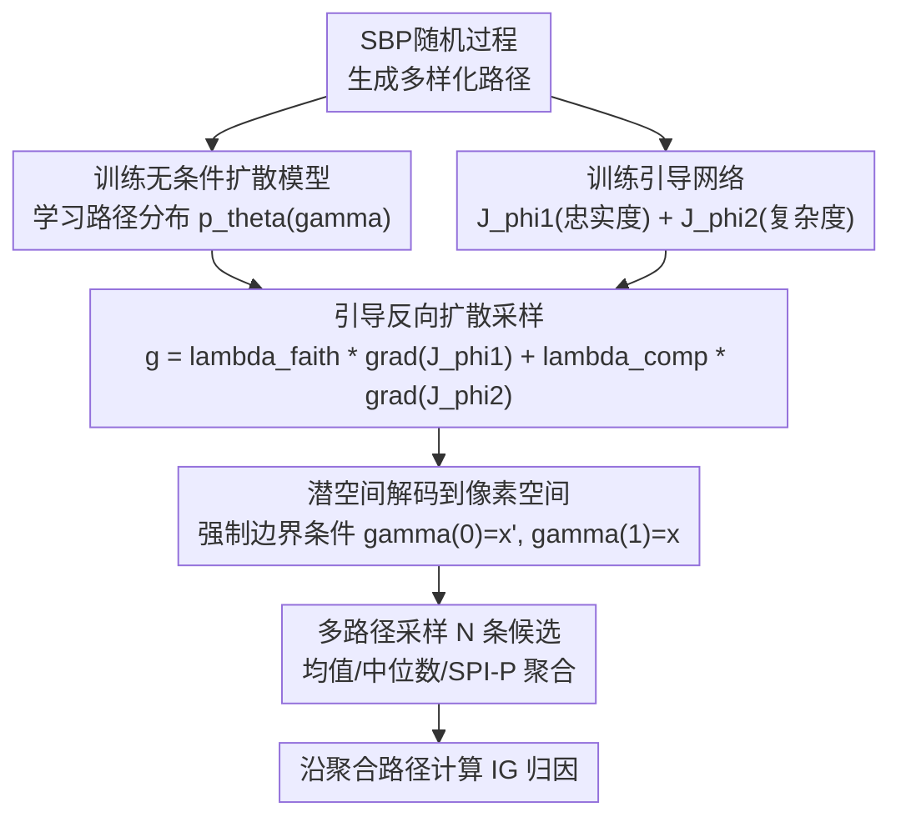

# Diffusion Integrated Gradients: Controllable Path Generation for Flexible Feature Attribution

**会议**: ECCV 2026  
**arXiv**: [2606.22314](https://arxiv.org/abs/2606.22314)  
**代码**: 无  
**领域**: 扩散模型 / XAI可解释性  
**关键词**: 积分梯度, 扩散模型, 路径归因, 可解释AI, 引导采样

## 一句话总结
DiffIG 将积分梯度（IG）中的归因路径生成重铸为条件生成建模问题——用扩散模型学习 Stick-Breaking Process 生成的路径分布，推理时通过忠实度与复杂度双重引导采样，生成自适应的非线性积分路径，在 Oxford-IIIT Pet 和 Mini-ImageNet 上 DiffID 指标大幅超越现有路径归因方法。

## 研究背景与动机
（矛盾驱动型）积分梯度（IG）因其完备性等公理性质，成为 DNN 特征归因的标准方法。IG 通过沿基线到输入的积分路径累积梯度来分配特征重要性分数。然而，IG 的归因质量高度依赖积分路径的选择：标准直线路径在保守梯度场假设下最优，但现代 DNN 的逐段线性结构导致梯度场高度不连续，直线路径穿越决策边界时积累大量噪声梯度，产生误导性归因。

现有改进方法陷入两难：Guided IG、IG2、AGI 等方法将路径搜索形式化为优化问题，但目标函数在连续函数空间上难以全局优化，只能依赖贪心或局部启发式搜索，无法保证找到全局一致的路径；SPI 等方法用随机过程建模路径分布，但完全忽略模型的决策面几何结构；EIG、MIG 等方法引入数据流形信息，却被固定的生成过程约束，缺乏灵活性。

核心矛盾：路径质量决定归因质量，但现有方法要么用贪心局部搜索（欠优），要么用模型无关的随机过程（太盲目），要么被固定流形约束（不灵活）。本文的切入角度是将路径搜索从"显式优化"转为"条件生成"——用一个扩散模型学习高质量路径的分布，推理时通过引导采样灵活控制路径属性。核心 idea：用扩散生成模型 + 引导采样替代手工路径设计，使路径归因成为推理时可控制的生成过程。

## 方法详解

### 整体框架
DiffIG 要解决的核心问题是：给定模型 f 和输入 x、基线 x'，如何生成一条从 x' 到 x 的积分路径 gamma，使得沿该路径计算的归因既忠实于模型决策逻辑，又足够简洁可解释。整体 pipeline 分四阶段：（1）用 Stick-Breaking Process（SBP）生成大量多样化的非线性路径作为训练数据；（2）训练一个无条件扩散模型学习路径分布，同时训练两个独立的引导网络分别预测路径的忠实度分数和复杂度分数；（3）推理时用分类器引导将忠实度和复杂度梯度注入反向扩散过程，控制路径生成方向；（4）在 beta-VAE 潜空间中完成路径生成以降低计算开销，采样 N 条候选路径后通过聚合（均值/中位数/方差加权）得到最终归因图。

### 关键设计

**1. 条件生成建模重铸路径搜索：从显式优化到学会生成**

传统路径归因方法（GIG、IG2、AGI）将路径搜索形式化为 gamma* = argmax J(gamma)，即找到一个最大化目标函数（如负噪声代价）的路径。但 J 定义在连续函数空间上，在 DNN 复杂的决策面拓扑下，这类优化问题通常不可解，只能退化为贪心局部搜索。DiffIG 的洞察来自离线强化学习中的轨迹规划思想：与其显式优化一条路径，不如学会生成"看起来像好路径"的轨迹。具体地，将路径搜索重铸为最大化条件对数似然：

$$\theta^* = \arg\max_\theta \mathbb{E}_{\gamma\sim\mathcal{D}}[\log p_\theta(\gamma|y=\mathcal{J}(\gamma))]$$

其中 D 是预收集的路径数据集，条件标签 y 是路径的客观质量分数 J(gamma)。DiffIG 不直接训练条件模型，而是采用无条件扩散 + 分类器引导策略：先训练无条件扩散模型学习 p_theta(gamma)，再通过 energy-based 引导采样从扰动分布 $\tilde{p}_\theta(\gamma^0) \propto p_\theta(\gamma^0)\exp(\mathcal{J}(\gamma^0))$ 中生成路径。引导通过注入回归网络 J_phi 的梯度实现：$\tilde{p}_\theta(\gamma^{\tau-1}|\gamma^\tau) = \mathcal{N}(\gamma^{\tau-1}|\mu_\theta(\gamma^\tau) + \omega\Sigma^\tau g, \Sigma^\tau)$，其中 $g = \nabla_\gamma\mathcal{J}_\phi(\gamma)|_{\gamma=\mu_\theta(\gamma^\tau)}$。这种设计一举三得：自适应——扩散模型学会避开高曲率噪声区域；全局优化——生成过程考虑整条路径而非局部贪心；可控制——推理时切换引导目标即可改变路径行为。

**2. SBP合成路径数据生成：为扩散模型提供训练信号**

训练扩散模型需要大量多样化路径，DiffIG 用 Stick-Breaking Process（SBP）生成。SBP 的核心思想是将单位长度的"棍子"逐步随机折断，折点位置和比例决定了一条从 0 到 1 的非线性插值曲线。对每个特征维度 i，采样随机测度 $G_i(t) = \sum_{k=1}^\infty \pi_k \delta_{t_k}(t)$，其中断棍权重 $\pi_k = \beta_k\prod_{j=1}^{k-1}(1-\beta_j)$，$\beta_k \sim \text{Beta}(1,\alpha)$，断点 $t_k \sim U(0,1)$。然后用 CDF $F_{G_i}(t)$ 定义非线性插值：$\gamma_i(t) = x'_i + F_{G_i}(t)(x_i - x'_i)$。由于 $F_{G_i}$ 单调非减且 $F_{G_i}(0)=0, F_{G_i}(1)=1$，生成的路径自然满足端点约束。浓度参数 alpha 控制路径多样性：alpha 大时路径趋近直线（接近标准 IG），alpha 小时路径高度非线性。DiffIG 在 alpha 取值 [1.0, 20.0] 范围内采样生成训练集，确保覆盖从近似直线到高度复杂的所有路径形态。相比直接手工设计路径族，SBP 提供了覆盖整个路径空间的自然参数化，且数学性质良好（端点约束自动满足、逐维度独立生成）。

**3. 双重引导网络：忠实度与复杂度的联合控制**

DiffIG 用两个独立的回归网络 J_phi1 和 J_phi2 分别预测路径的忠实度和复杂度分数，推理时联合引导扩散采样。两个指标的定义都直接量化归因质量：

忠实度衡量归因是否真正反映模型决策依据：$\text{Faithfulness}(\gamma) = \mathbb{E}_{r\in\mathcal{R}}[\text{Conf}^{\text{ins}}(r) - \text{Conf}^{\text{del}}(r)]$，其中 r 为扰动比例，Conf^ins 是按重要性插入像素后正确类别的置信度，Conf^del 是按重要性删除像素后的置信度。忠实度高意味着归因找对了真正驱动模型判断的特征——删掉它们置信度骤降，插入它们置信度回升。

复杂度控制归因的稀疏性和可读性，用归因权重的熵定义：$\text{Comp}(\gamma) = -\sum_i p_i \log(p_i + \varepsilon)$，其中 $p_i = |\mathcal{A}_i| / \sum_j |\mathcal{A}_j|$。复杂度低表示归因集中在少数关键区域，人更容易理解；复杂度高表示归因分散在大量像素上，难以解释。

两个引导网络各自用 MSE 目标从噪声路径 gamma^tau 回归其无噪声版本 gamma^0 的目标分数，推理时的联合梯度为 $g = (\lambda_{\text{faith}}\nabla_\gamma\mathcal{J}_{\phi_1} + \lambda_{\text{comp}}\nabla_\gamma\mathcal{J}_{\phi_2})|_{\gamma=\mu_\theta}$。lambda_faith 和 lambda_comp 是推理时可调的超参数——增大 lambda_faith 获得更忠实的归因，增大 lambda_comp（负值）获得更稀疏的归因，实现了前所未有的推断时可控性。值得注意的是，引导网络是在噪声潜空间路径上训练的代理回归器，而非直接在像素空间优化评测指标，避免了"评测即训练"的数据泄露。

**4. 潜空间路径生成与多路径聚合：降本增效的实用设计**

直接在高维像素空间（如 256x256x3）生成扩散路径计算代价极高。DiffIG 借鉴潜扩散模型的思想，用预训练 beta-VAE 编码器 E_enc 将输入 x 和基线 x' 映射到 4096 维潜空间，在潜空间中训练扩散模型和引导网络。推理时在潜空间生成轨迹 gamma_z(t)，经解码器 D_dec 还原到像素空间，同时显式强制边界条件 gamma(0)=x', gamma(1)=x 以严格保证完备性公理（即使解码器有重建误差也不影响）。

此外，扩散采样的随机性天然支持生成多条候选路径。DiffIG 提供两种利用策略：（i）Best-of-N 搜索——从 N 条路径中选联合目标分数最高的一条计算归因；（ii）多路径聚合——对所有 N 条路径各自计算归因图，再用均值、中位数、方差加权均值或 SPI-P 算子聚合成最终归因。实验发现中位数和均值聚合显著优于 Best-of-N 策略，因为聚合降低了单条路径的随机方差，产生的归因更稳定一致。完备性公理在均值聚合下仍成立（线性保持），但中位数聚合不保证完备性（论文认为鲁棒性优先时可接受）。

### 损失函数 / 训练策略

扩散模型训练：用 DiT1D 骨干网络，M=100 步扩散，DDPM 求解器，损失为 $\mathcal{L}(\theta) = \mathbb{E}_{\tau,\epsilon,\gamma^0}[\|\epsilon - \epsilon_\theta(\gamma^\tau)\|_2^2]$，即标准噪声预测 MSE。训练 100 万步，学习率 2e-4，权重衰减 1e-5，batch size 64。

引导网络训练：两个独立的 DiT1D 分别预测忠实度和复杂度分数，训练目标均为 $\min_\phi \mathbb{E}_{\tau,\epsilon,\gamma^0}[\|\mathcal{J}_\phi(\gamma^\tau) - \mathcal{J}(\gamma^0)\|_2^2]$。同样训练 100 万步。

推理时全局引导尺度 omega=1，忠实度权重 lambda_faith 取值范围 {0, 1, 10, 100, 1000}，复杂度权重 lambda_comp 取值范围 {-100, -10, -1, 0, 1, 10, 100}，路径数量 N 取值范围 {1, 10, 30, 50}。

## 实验关键数据

### 主实验

在 Oxford-IIIT Pet（37 类宠物，370 张验证集全量）和 Mini-ImageNet（100 类，500 张采样）上，用 VGG16、ResNet18、InceptionV1 三种架构评测。指标为 DiffID（Insertion AUC 减 Deletion AUC，越高越好）、Insertion AUC（越高越好）、Deletion AUC（越低越好）。

**Oxford-IIIT Pet 上 DiffID 对比：**

| 方法 | ResNet18 | VGG16 | InceptionV1 |
|------|----------|-------|-------------|
| IG | 0.3213 | 0.4654 | 0.3051 |
| GIG | 0.3486 | 0.4859 | 0.3085 |
| IG2 | 0.2767 | 0.3016 | 0.2228 |
| AGI | 0.3242 | 0.4930 | 0.4092 |
| EIG | 0.2680 | 0.3950 | 0.2698 |
| MIG | 0.2552 | 0.3681 | 0.2602 |
| SPI | 0.2738 | 0.4202 | 0.2292 |
| **DiffIG** | **0.5067** | **0.6368** | **0.4817** |

DiffIG 在 Oxford-IIIT Pet 上全面大幅领先：ResNet18 上 DiffID 从 0.3486（GIG 最佳）提升至 0.5067（+45%），VGG16 上从 0.4930（AGI 最佳）提升至 0.6368（+29%），InceptionV1 上从 0.4092（AGI 最佳）提升至 0.4817（+18%）。Mini-ImageNet 上同样全面领先（详见原文 Table 1），且优势在 ViT-B/16 上依然成立（DiffID 0.5711 vs AGI 0.4033）。

### 消融实验

**多路径采样数量 N 的消融（Oxford-IIIT Pet / ResNet18）：**

| 配置 | DiffID | Insertion | Deletion |
|------|--------|-----------|----------|
| DiffIG (N=1) | 0.3791 | 0.5201 | 0.1410 |
| DiffIG (N=10) | 0.4898 | 0.6143 | 0.1245 |
| DiffIG (N=30) | 0.4940 | 0.6222 | 0.1254 |
| DiffIG (N=50) | 0.5067 | 0.6300 | 0.1233 |

多路径采样效果显著且单调：N 从 1 增至 50，DiffID 从 0.3791 升至 0.5067（+33.7%）。N=10 已接近饱和，N=50 获得最佳性能。聚合策略方面，中位数、均值和方差加权均值性能接近且明显优于 Best-of-N 策略（Best-of-N 在多数设置下形成明显的劣质簇）。

**引导有效性**：热力图分析显示，不施加任何引导（lambda_faith=0, lambda_comp=0）时扩散模型退化为无条件路径生成，DiffID 最低；施加至少一项引导后性能显著提升，最优配置因数据集和模型架构而异。复杂度引导效果直观可见：lambda_comp 从 0 增至 -100 时，归因图明显更稀疏且聚焦于核心目标区域。与 DDPath（同期扩散归因方法，仅靠无条件扩散反演路径）对比，DiffIG 在 Mini-ImageNet 三个模型上 DiffID 平均提升 0.042-0.112，验证了引导采样的关键作用。

### 关键发现
- **多路径聚合是最大贡献因素之一**：N=50 相比 N=1 提升 DiffID 约 33%，说明扩散模型生成的路径池中存在大量高质量候选，聚合能有效降低单路径的随机方差。
- **忠实度引导在多数设置下是主要驱动力**：Oxford-IIIT Pet 上最优配置均含高 lambda_faith（1000），Mini-ImageNet 上复杂度引导贡献更大（最优配置含较高的 lambda_comp），说明引导策略需要随任务调整。
- **方法对不同 VAE 骨干鲁棒**：在 MAR、Stable Diffusion 2.1、Kandinsky 2.1 三种 VAE 骨干下 DiffIG 性能保持稳定，且对 SBP 浓度参数 alpha 不敏感。
- **Black-white 均值基线有效缓解暗区域问题**：取黑色基线和白色基线归因的均值，在 6 个设置中 5 个提升了 DiffID（最多 +0.115），简单有效。

## 亮点与洞察
- **从"手工设计路径"到"学会生成路径"的范式转换**：这是本文最核心的洞察。路径归因方法长期以来被困在"设计一个目标函数 → 贪心局部搜索"的循环中，DiffIG 用生成模型打破这个模式——与其费力优化一个不可解的目标，不如学会生成"看起来像好路径"的样本。这个思路可以迁移到任何需要"搜索一条连续轨迹"的 XAI 问题（如反事实解释路径生成、对抗样本轨迹设计）。
- **引导网络在噪声潜空间上做代理预测，而非直接优化评测指标**：这是一个巧妙的设计分离——引导网络预测的是路径自身的质量分数，而评测指标是归因图在像素空间上的 faithfulness。两个空间之间存在潜-像素域间隔，但实验证明这个 gap 在实践中是良性的（受控 3D-helix toy 实验中也验证了引导能优化像素空间目标而不离开流形）。更重要的是，这个分离避免了"评测即训练"的循环论证，使得 DiffIG 在独立的 Quantus Faithfulness Correlation 指标上也排名第一。
- **多个 lambda 超参数带来的是灵活性而非调参负担**：lambda_faith 和 lambda_comp 分开控制忠实度与稀疏度，这在传统方法中是不可能的——传统方法如果想让归因更稀疏，只能换一个完全不同的方法或重新设计目标函数。DiffIG 做到了推理时零成本切换归因风格，这是"把路径变成可控生成过程"的直接红利。
- **SBP 作为合成路径数据源的巧妙之处**：SBP 参数少（只有 alpha）、数学性质好（自动满足端点约束、逐维独立）、覆盖范围广（一条公式从直线到高度非线性）。相比用真实模型梯度引导来生成路径（需要反复前向-反向传播），SBP 是纯统计过程，生成成本极低。

## 局限与展望
- **固定基线的局限性**：DiffIG 仍使用固定的黑色基线，在视觉上暗区域（如黑色眼睛）归因不足。作者提出的 black-white 均值方案有效但只是补救措施，学习自适应基线是更根本的解决方向。
- **每次换（数据集，模型）对需重新训练**：扩散模型和引导网络需要针对特定 f 和数据分布训练，总计约 0.9 GPU 小时（单张 H100）的一次性开销。对于实际应用场景（不同模型、不同数据），这个训练成本累积可观。
- **超参数敏感性**：lambda_faith 和 lambda_comp 的最优值在不同数据集和模型间差异显著，需要逐场景调参。虽然无引导时性能退化可预测（总是最差），但找到"刚好够好"的默认值仍是一个开放问题。
- **当前仅验证了 CNN 和 ViT 图像分类器**：论文在文本、表格、图数据等模态上的适用性是开放的。特别是潜空间方案依赖 VAE 编码器质量，对非图像模态需要不同的潜在表示策略。
- **扩散采样步数 100 步 + N 条路径**：在 N=50 时每张图需 4.5 秒（H100），远慢于 IG（0.09 秒）。更高效的采样策略（如一致性模型、蒸馏）和多路径的智能剪枝是加速方向。

## 相关工作与启发
- **vs Guided IG (GIG)**：GIG 用目标函数的局部梯度做贪心路径更新，DiffIG 用扩散模型做全局路径生成。GIG 受困于局部最优，DiffIG 通过生成完整路径隐式实现了全局搜索。核心区别在于"优化一条路径" vs "生成路径分布后挑选"。
- **vs Stick-breaking Path Integration (SPI)**：SPI 同样用 SBP 生成路径分布，但直接从中采样后聚合，完全忽略模型决策面几何。DiffIG 把 SBP 路径仅作为无标签训练数据，再通过引导网络注入模型感知信息——用 SPI 的"原料"做出了 SPI 无法实现的模型自适应路径。
- **vs DDPath**：DDPath 用预训练扩散模型的反向去噪轨迹作为归因路径，核心假设是去噪轨迹天然靠近数据流形。但它完全依赖无条件扩散过程，无法控制路径质量。DiffIG 在 DDPath 的基础上加了引导采样，将"流形约束"升级为"流形约束 + 质量引导"，一致超越 DDPath。
- **vs 离线 RL 中的 Diffuser / Decision Diffuser**：DiffIG 的设计灵感直接来自离线 RL 中使用扩散模型做轨迹规划的工作。将路径归因视为"生成一条高回报轨迹"是跨领域的洞察迁移——Diffuser 用回报预测器引导轨迹生成，DiffIG 用忠实度/复杂度预测器引导路径生成，结构同构。

## 评分
- 新颖性: ⭐⭐⭐⭐⭐ 将路径归因重铸为条件生成建模是全新的视角，此前未见将扩散生成模型引入特征归因路径设计的工作，跨领域迁移（离线 RL 规划 → XAI 路径生成）自然且深入
- 实验充分度: ⭐⭐⭐⭐ 两个数据集、三种 CNN 架构 + ViT、七个 baseline、多维度消融（N/引导/VAE骨干/SBP alpha/基线选择）、独立指标验证（Quantus）、runtime 分析、失败案例分析，附录极为详尽。扣一星是因为最优超参数配置在不同设置下差异大，统一配置（Table 1）的性能并非各设置的最优
- 写作质量: ⭐⭐⭐⭐⭐ 结构清晰（动机→方法→实验→分析层层递进），公式规范，图表丰富且制作精良（Figure 1 和 Figure 2 的信息密度很高），附录含完整的公理证明和超参数分析，可复现性强
- 价值: ⭐⭐⭐⭐ 为 XAI 领域引入了一个有潜力的生成式框架，推理时可控性的设计理念有较广的迁移空间。但训练成本（每对数据集+模型需重新训练）和推理速度（N=50 时比 IG 慢 50 倍）限制了即时实用性，更适合需要高质量归因的离线分析场景而非实时部署

<!-- RELATED:START -->

## 相关论文

- [\[ECCV 2026\] Semantic Browsing: Controllable Diversity for Image Generation](semantic_browsing_controllable_diversity_for_image_generation.md)
- [\[ECCV 2024\] Linearly Controllable GAN: Unsupervised Feature Categorization and Decomposition for Image Generation and Manipulation](../../ECCV2024/image_generation/linearly_controllable_gan_unsupervised_feature_categorization_and_decomposition_.md)
- [\[CVPR 2025\] RoomPainter: View-Integrated Diffusion for Consistent Indoor Scene Texturing](../../CVPR2025/image_generation/roompainter_view-integrated_diffusion_for_consistent_indoor_scene_texturing.md)
- [\[CVPR 2026\] Attribution as Retrieval: Model-Agnostic AI-Generated Image Attribution](../../CVPR2026/image_generation/attribution_as_retrieval_modelagnostic_aigenerated.md)
- [\[ECCV 2026\] Few-Shot Synthetic Image Attribution: Identifying Unseen Generators with Limited Samples](few-shot_synthetic_image_attribution_identifying_unseen_generators_with_limited_.md)

<!-- RELATED:END -->
