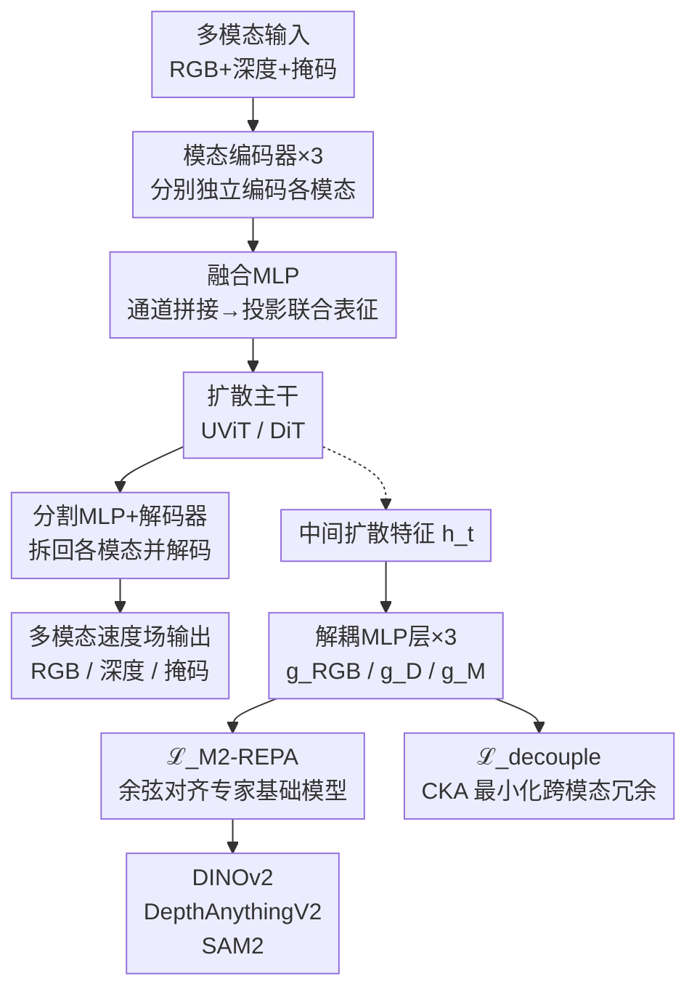

# Divide and Conquer: Decoupled Representation Alignment for Multimodal World Models

**会议**: ECCV 2026  
**arXiv**: [2605.01896](https://arxiv.org/abs/2605.01896)  
**代码**: 暂无  
**领域**: 图像生成 / 视频生成  
**关键词**: 多模态世界模型, 表示对齐, 视频扩散模型, 基础模型, 特征解耦  

## 一句话总结

M2-REPA 通过将扩散模型的中间特征解耦为模态专属的子空间，分别与 DINOv2、DepthAnythingV2、SAM2 等模态专家进行表示对齐，并借助 CKA 正则化压制跨模态冗余，首次将单模态 REPA 扩展到了多模态视频生成场景，在三模态（RGB-深度-掩码）生成中取得了显著提升。

## 研究背景与动机

世界模型旨在通过预测环境动态来支持智能体的规划和交互，近期视频扩散模型的飞速发展使其成为最有潜力的世界模拟器之一。然而，现有模型几乎全部运行在 2D RGB 像素空间上，而物理世界本质上是三维的——自动驾驶需要深度信息，具身智能需要分割理解，交互式游戏需要场景几何与语义的联合建模。为此，研究者开始探索多模态世界模型（如 Aether、WorldWeaver、TesserAct），希望在同一框架下同时预测 RGB、深度、表面法线或光流等不同模态的视频输出。但这些方法更多关注网络架构层面的多模态联合建模，尚未有效利用大规模预训练基础模型中蕴含的丰富先验知识。

与此同时，REPA 系列工作展示了将扩散模型中间特征与自监督视觉基础模型（如 DINOv2）的表征进行对齐，可以显著提升视频生成的质量和一致性——其核心思路是在训练时通过正则化让扩散网络早期的中间表示去"模仿"基础模型从干净图像中提取的语义特征，从而让深层网络专心恢复高频细节。然而，现有 REPA 方法都局限在单模态 RGB 生成中，仅使用一个基础模型进行对齐。本文作者观察到，不同基础模型天然擅长不同的模态空间——DINOv2 是 RGB 视觉专家，DepthAnythingV2 专精深度推理，SAM2 擅长掩码分割。若将这些基础模型视为互补的"模态专家"，一个自然的问题是：能否同时利用多个专家模型的先验知识来提升多模态视频生成？

作者的预先实验验证了"模态优势"现象：用 DINOv2 对齐的模型在 RGB 生成上更强，用 DepthAnythingV2 对齐的模型在深度生成上更强。但令人沮丧的是，简单地将多个基础模型同时对齐到同一个共享扩散特征上不仅没有带来增益，反而在部分指标上出现退化。深入分析发现，问题根源在于不同基础模型的先验空间存在根本性差异，强制共享特征同时匹配多个异构目标会导致特征纠缠和优化冲突。**核心 idea：将扩散模型的中间特征通过轻量 MLP 解耦为模态专属的子空间，再将每个子空间与其对应的专家基础模型进行余弦对齐，同时引入 CKA 正则化显式压制跨模态冗余，从而在避免特征冲突的前提下充分利用多模态互补先验。**

## 方法详解

### 整体框架

M2-REPA 构建在一个自回归多模态视频扩散基线之上。整体分为两条并行支路：一条是基础的扩散前向支路——多模态输入经过各自编码器、融合 MLP、扩散主干（UViT 或 DiT）、分割 MLP 和各自的解码器，产出多模态速度场预测；另一条是对齐正则化支路——从扩散主干中抽取中间特征，通过解耦 MLP 投影到各模态的专属子空间，同时分别与冻结的专家基础模型进行对齐优化和 CKA 解耦优化。框架在标准的 flow matching 训练目标之外，叠加两项正则化损失联合优化。

### 关键设计

**1. 模态特征解耦：为每个模态开辟专属对齐子空间**

直接将多个基础模型的表征对齐到同一组扩散中间特征是性能退化的根源——DINOv2 的 RGB 语义空间、DepthAnythingV2 的深度几何空间和 SAM2 的分割掩码空间存在本质差异，强制共享特征同时匹配三者必然产生纠缠。M2-REPA 引入一组轻量 MLP 作为解耦层，每个 MLP 将扩散主干输出的共享中间特征 $h_t$ 投影到对应模态的专属子空间：$\hat{h}^{(k)}_{\phi} = g^{(k)}_{\phi}(h_t)$。这组 MLP 层数仅 3 层，参数量极小，却起着关键的分路作用——它们让不同模态的监督信号各走各道、互不冲突。消融实验表明，轻量 MLP 在对齐保真度和计算开销之间取得了最优折中，全面超越了注意力适配器和基于查询的解耦方案，且训练更加稳定。

**2. 多模态表示对齐损失：分别与专家基础模型逐位置对齐**

在解耦出各模态子空间后，对每个子空间特征分别与对应的冻结基础模型特征进行逐 token 的余弦相似度最大化。RGB 子空间与 DINOv2 对齐，深度子空间与 DepthAnythingV2 对齐，掩码子空间与 SAM2 对齐。三个模态的损失取均值：

$$
\mathcal{L}_{\text{M}^2\text{-REPA}} = -\frac{1}{K}\sum_{k=1}^{K} \mathbb{E}\left[\frac{1}{N}\sum_{n=1}^{N}\cos(\hat{y}^{(k)}_{*,[n]}, \hat{h}^{(k)}_{\phi,[n]})\right]
$$

其中 $K=3$ 为模态数量，$N$ 为空间 token 数，$\hat{y}^{(k)}_{*}$ 是基础模型从干净帧提取的冻结表征。该损失的本质是在训练时为扩散网络提供导航信号——早期层去学习各模态专家理解的语义结构，深层则专注于高频细节生成。与其他条件注入方式不同，这种对齐仅在训练时施加正则化，推理时不引入额外计算，保持了 REPA 系列"零推理开销"的优势。

**3. 基于 CKA 的模态解耦正则化：显式压制跨模态信息冗余**

尽管解耦层已在架构上分离了各模态子空间，不同子空间之间仍可能残留共享信息——RGB 和深度在场景结构上天然相关，若不约束，对齐优化可能退化。为此作者引入基于 Centered Kernel Alignment 的解耦正则化，显式鼓励模态子空间之间的正交性和互补性：

$$
\mathcal{L}_{\text{decouple}} = \frac{2}{K(K-1)}\sum_{i=1}^{K}\sum_{j=i+1}^{K} \text{CKA}(\hat{h}^{(i)}_{\phi}, \hat{h}^{(j)}_{\phi})
$$

CKA 具有对等距缩放和正交变换的不变性，比直接在余弦相似度上加惩罚更适合跨模态特征比较——因为不同 MLP 输出的特征分布幅度差异很大，余弦惩罚容易给出有偏的冗余估计。消融实验证实 CKA 方案显著优于简单余弦平方（cos²）惩罚，在长视频生成上 FVD-200 降低近 60 点。该正则化权重 $\lambda_{\text{decouple}}$ 在 0.05~35 的宽范围内均能稳定工作，鲁棒性出色。

### 损失函数 / 训练策略

完整训练目标为 flow matching 回归损失、对齐损失和解耦正则化损失的三项加权求和：

$$
\mathcal{L}_{\text{total}} = \mathcal{L}_{\text{FM}} + \lambda_{\text{align}} \mathcal{L}_{\text{M}^2\text{-REPA}} + \lambda_{\text{decouple}} \mathcal{L}_{\text{decouple}}
$$

其中 $\lambda_{\text{align}}=0.5$，$\lambda_{\text{decouple}}=0.05$。训练时仅扩散主干和 MLP 解耦层可学习，所有基础模型参数冻结。RealEstate10K 上以 256×256 分辨率、8 帧视频片段训练 2500 步，学习率 $8\times10^{-6}$，批大小 8，使用 8 块 NVIDIA H20 GPU。Minecraft 环境使用 DiT 骨干在隐空间训练，50 帧 5000 步。推理时进行自回归 rollout，支持短程（8 帧）和长程（200 帧）生成。

## 实验关键数据

### 主实验

在 RealEstate10K 上的三模态（RGB-深度-掩码）视频生成结果：

| 设定 | 指标 | RGB-DM基线 | 最佳单模REPA | M2-REPA |
|------|------|-----------|-------------|---------|
| 8帧 RGB | FVD↓ | 102.44 | 96.81 | **81.13** |
| 8帧 RGB | LPIPS↓ | 0.3449 | 0.2344 | **0.2123** |
| 8帧 深度 | AbsRel↓ | 0.9076 | 0.8301 | **0.8224** |
| 8帧 深度 | δ₁↑ | 0.1724 | 0.3090 | **0.4449** |
| 8帧 掩码 | mIoU↑ | 0.8839 | 0.8801 | **0.9045** |
| 200帧 RGB | FVD↓ | 407.50 | 301.25 | **262.50** |
| 200帧 深度 | δ₁↑ | 0.1238 | 0.1247 | **0.1408** |
| 200帧 掩码 | mIoU↑ | 0.6385 | 0.6446 | **0.6591** |

在 Minecraft 动态环境（150 帧长视频，DiT 骨干）中，M2-REPA 将 FVD 从 191.25 降至 **81.81**（降幅 57.2%）。在 5B 参数量的 TesserAct（CogVideoX-5B 骨干）上同样将 FVD 从 639.3 降至 **418.3**，证明了方法的规模和骨干通用性。

### 消融实验

| 配置 | FVD-8↓ | FVD-200↓ | 说明 |
|------|--------|----------|------|
| RGB-DM Baseline | 102.44 | 407.50 | 无表示对齐 |
| REPA (DINOv2) | 100.00 | 308.50 | 单模态 RGB 对齐 |
| REPA (SAM2) | 97.63 | 301.25 | 单模态掩码对齐 |
| REPA (DAv2) | 96.81 | 319.00 | 单模态深度对齐 |
| REPA (D+S+DA naive) | 96.38 | 328.75 | 三者在共享特征上对齐 |
| M2-REPA (cos² 解耦) | 99.56 | 319.75 | 余弦平方替代 CKA |
| M2-REPA (CKA) | **81.13** | **262.50** | 完整方法 |

### 关键发现

- **"模态优势"得到定量验证**：DINOv2 对齐的模型 RGB 最佳，DAv2 对齐的模型深度最佳——不同基础模型确实携带互补先验，而非冗余。
- **朴素多专家对齐反而有害**：三模型直接在共享特征上对齐时，长视频 FVD-200（328.75）甚至差于最佳单模型（301.25），特征冲突在长程生成中尤为致命。
- **CKA 远优于余弦平方惩罚**：CKA 版本的 FVD-8 下降 18 点、FVD-200 下降 57 点，验证了 CKA 对特征幅值差异和正交变换的不变性使其更适合跨模态解耦。
- **跨源鲁棒性验证**：深度伪标签来自 Video-Depth-Anything（而非对齐教师 DAv2）时，M2-REPA 仍一致超越基线，证明提升来自表征正则化而非标签泄露。
- **MLP 投影头最优**：轻量 3 层 MLP 在全部指标上超越注意力适配器和基于查询的解耦方案。
- **解耦强度宽泛鲁棒**：$\lambda_{\text{decouple}}$ 在 0.05~35 范围内性能稳定。

## 亮点与洞察

- **"解耦再对齐"的设计哲学简洁而有效**：面对多基础模型的特征冲突，没有设计复杂的融合机制或注意力调制，而是加几个轻量 MLP 做解耦——这种"先分家、再各自谈"的思路既保留了 REPA 的简洁性，又解决了多目标对齐的核心矛盾。
- **CKA 的选择让解耦正则化真正落在了痛点上**：余弦相似度对幅值敏感，跨模态特征尺度差异大时难以准确衡量冗余，CKA 的不变性天然适合这种场景——这是"选对工具"的好例子。
- **方法作为插件可迁移**：不挑骨干（U-Net / DiT 均可），能直接挂到 5B 参数量的 TesserAct 上获得大幅提升，说明解耦对齐这种训练时正则化思路具有很强的通用性。
- **实验设计扎实**：跨源验证（对齐教师 ≠ 数据标注来源）排除了标签耦合的质疑；Minecraft 环境验证保持了分布多样性；大规模模型验证证明了 scalability。

## 局限与展望

- **训练计算开销**：训练时需额外计算三个基础模型的前馈，对齐和 CKA 损失涉及中间特征提取，显存略有增加（尽管推理时无开销）。
- **依赖基础模型质量**：对齐效果受限于所选基础模型的质量和完备性——若某个模态缺少合适的预训练专家模型，该方法难以直接应用。
- **仅验证了三种模态**：论文在 RGB-深度-掩码上做了验证，但在更广泛的模态（光流、表面法线、景深）和更多专家模型（CLIP、VGGT）上的扩展性尚未充分探索。
- **长程一致性仍有空间**：尽管大幅超越基线，200 帧长视频的 FVD 和 AbsRel 仍偏高，生成场景的长期语义保持仍是开放挑战。

## 相关工作与启发

- **vs REPA/VideoREPA**：REPA 系列首次提出将对齐基础模型表征作为扩散训练的正则化。M2-REPA 将其从单模态 RGB 扩展到多模态，核心差异在于引入特征解耦以避免多目标对齐冲突。
- **vs Aether/WorldWeaver/TesserAct**：这些工作关注多模态世界模型的架构设计，但未利用基础模型先验作为训练信号。M2-REPA 可作为训练增强插件直接挂载（已在 TesserAct 上验证）。
- **vs Pixel-Perfect Depth / Geometry Forcing**：这类工作通过直接注入基础模型特征到扩散网络增强几何感知，但推理时仍需基础模型前馈，且多特征注入存在训练不兼容风险。M2-REPA 的对齐范式推理时零开销，更轻量实用。

## 评分
- 新颖性: ⭐⭐⭐⭐ 首次将 REPA 扩展到多模态视频生成，解耦对齐解决特征冲突的思路简洁有效；但"多基础模型联合引导"并非全新概念，核心创新在于发现并解决了多目标对齐冲突问题。
- 实验充分度: ⭐⭐⭐⭐⭐ 覆盖短/长帧、三模态、两个数据集、三种骨干（U-Net/DiT/CogVideoX-5B）、跨源验证、投影头消融、超参敏感性分析，实验设计非常扎实。
- 写作质量: ⭐⭐⭐⭐⭐ 动机推演条理清晰（观察到现象→验证→方案），Fig.1 的可视化有力支撑了直觉，实验叙事完整，结论与实验一致。
- 价值: ⭐⭐⭐⭐ 直接让多模态世界模型的生成质量上了一个台阶，且作为插件适用于现有方法；推理时零开销，实用性强。局限在于仅覆盖三模态，更多模态的扩展有待验证。

<!-- RELATED:START -->

## 相关论文

- [\[ICML 2026\] Divide and Conquer: Reliable Multi-View Evidential Learning for Deepfake Detection](../../ICML2026/image_generation/divide_and_conquer_reliable_multi-view_evidential_learning_for_deepfake_detectio.md)
- [\[CVPR 2025\] Divide and Conquer: Heterogeneous Noise Integration for Diffusion-based Adversarial Purification](../../CVPR2025/image_generation/divide_and_conquer_heterogeneous_noise_integration_for_diffusion-based_adversari.md)
- [\[ECCV 2026\] MEPA: Multi-Scale Representation Alignment for Visual Autoregressive Modeling with Mixture of Experts](mepa_multi-scale_representation_alignment_for_visual_autoregressive_modeling_wit.md)
- [\[ECCV 2026\] Intermediate Text Representation Guided Text-to-Image Generation for Enhancing One-and-Only Alignment](intermediate_text_representation_guided_text-to-image_generation_for_enhancing_o.md)
- [\[ECCV 2026\] The Illusion of High Utility in Safety Alignment of Text-to-Image Diffusion Models](the_illusion_of_high_utility_in_safety_alignment_of_text-to-image_diffusion_mode.md)

<!-- RELATED:END -->
