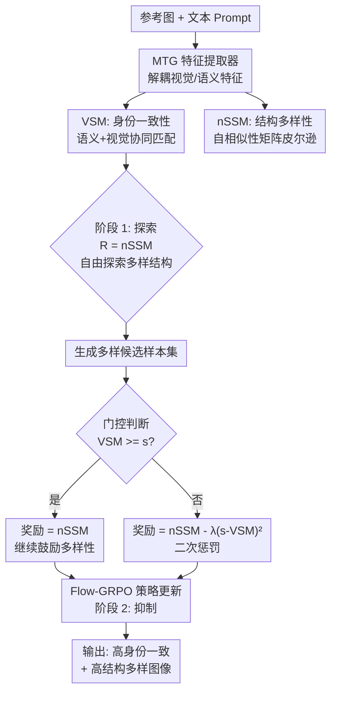

# DivRL: Disentangled Self-Similarity Rewards for Diverse Subject-Driven Generation

**会议**: ECCV2026  
**arXiv**: [2606.23950](https://arxiv.org/abs/2606.23950)  
**代码**: [https://github.com/QianWangX/DivRL](https://github.com/QianWangX/DivRL)  
**领域**: 图像生成 / 扩散模型  
**关键词**: 主体驱动生成, 身份多样性悖论, 强化学习, 自相似性度量, 视觉语义匹配

## 一句话总结

DivRL 提出基于 Flow-GRPO 的后训练框架，通过解耦的视觉特征分别衡量结构多样性和身份一致性，并用「探索-抑制」两阶段优化策略让模型同时生成高身份保持和高结构多样性的图像。

## 研究背景与动机

主体驱动图像生成旨在让模型在给定一张参考图后，能在各种新场景、姿态、风格下还原该主体的视觉身份。以 Flux-Kontext、OmniGen 为代表的原生多模态扩散模型已展现出很强的保真度，但它们在身份一致性与结构多样性之间面临一个根本矛盾：越强调身份保持，生成图像往往越跟参考图「长一个样」——同样的视角、同样的姿态、同样的空间排布；而越鼓励多样性，又容易偏离主体身份特征。论文把这种张力称为「身份-多样性悖论」。

这个悖论的深层根源在于，身份特征在参考图像中与空间结构是高度纠缠的。当模型去捕捉「这个主体长得什么样」时，不可避免地也学到了「这个主体在参考图里是怎么摆的」。反过来，想让模型生成不同结构的图像时，又可能改动到定义身份的关键属性。现有方法大多用成对偏好排序来缓解这一矛盾——让模型比较两幅生成图哪个更一致、哪个更多样，但这类相对优化缺乏显式解耦，很难同时推高两个目标。

本文的核心观察来自一篇此前的工作 MTG（Mind the Glitch），它发现扩散模型 backbone 中解耦出的纯视觉特征（与语义特征分离）对空间变换非常鲁棒——即便主体换了姿态或视角，这些视觉特征仍能可靠地反映身份一致性。但单独用 MTG 特征做奖励仍不够：模型可以「作弊」——通过复制参考图的空间布局来获取高身份奖励，本质上还是缺一个能显式衡量「结构是否多样」的机制。**核心 idea：利用解耦视觉特征的自相似性矩阵来度量结构多样性（而非全局特征差异），并设计一个门控优化策略，让身份一致性从竞争目标转换为可行性约束，使两类奖励在 GRPO 框架下协作优化。**

## 方法详解

### 整体框架

DivRL 是一个基于 Flow-GRPO 的 RL 后训练框架，输入一张参考图和一个文本 prompt，输出既保持身份又结构多样的图像。框架由三个核心组件构成：两个奖励模型（VSM 衡量身份一致性，nSSM 衡量结构多样性）和一个两阶段「探索-抑制」优化策略。第一阶段只用 nSSM 做奖励，让模型自由探索多样的空间配置；第二阶段引入 VSM 作为门控约束——只有当生成样本的身份一致性低于阈值时才施加二次惩罚，否则继续最大化 nSSM。这一设计将身份保持从竞争目标降为一个可行性约束，让一致性和多样性不再此消彼长。

### 关键设计

**1. nSSM：负自相似性度量——用特征内部组织来衡量结构多样性**

传统做法用全局特征差异（如 CLIP 图像相似度）来衡量多样性，但全局特征同时编码了身份和结构信息，两者纠缠不清。本文的洞察是：如果从参考图和生成图中分别提取解耦后的视觉特征网格（48×48 的密集特征图），每个网格点代表该位置的局部视觉信息，那么这两张特征网格各自内部的「自相似性矩阵」就编码了目标的空间组织结构——高相关意味着相似的空间布局，低相关对应不同的姿态或视角。

具体做法：先通过 MTG 网络提取参考图和生成图的纯视觉特征图 $\mathcal{F}^v_{ref}$ 和 $\mathcal{F}^v_{gen}$，在通道维度上归一化，再各自计算自相似性矩阵 $\mathcal{M}^v = \hat{\mathcal{F}}^v (\hat{\mathcal{F}}^v)^\top$，这个矩阵的第 $(i,j)$ 元素度量了第 $i$ 个空间位置与第 $j$ 个空间位置的视觉模式相似程度，本质上是目标的「空间骨架」描述。然后用 GT 目标掩码滤除背景，计算两个自相似性矩阵的皮尔逊相关系数：

$$\text{nSSM} = 1 - \rho(\hat{\mathcal{M}}^v_{ref}, \hat{\mathcal{M}}^v_{gen})$$

当两个矩阵高度相关时，nSSM 低（结构相似，多样性差）；当相关性低时，nSSM 高（结构多样）。由于 nSSM 作用在密集的潜空间特征网格上，它捕获的是细粒度的几何组织信息，比全局特征对结构变化更敏感。

**2. VSM：视觉语义匹配——给身份一致性一个可靠的度量**

身份一致性需要一个既精确又鲁棒的度量标准。现有方法常直接用 CLIP 或 DINO 的全局特征余弦相似度，但它们对姿态变化不够鲁棒——"同一个人换个姿势"特征相似度就会明显下降。本文使用 MTG 的解耦特征做两层次匹配：先取参考图和生成图的语义特征图，计算逐点语义相似度，通过语义阈值 $\tau_s$ 筛选出语义对应的区域（确保只比较「同一个部位」），然后在语义匹配区域中计算视觉特征的一致性。VSM 度量的是「在语义正确对应上的像素中，视觉相似度超过阈值 $\tau_v$ 的比例」，值越高说明身份保持越好。这个度量天然对视角和姿态不敏感，因为它先语义对应、再比视觉，不依赖全局空间对齐。

**3. 「探索-抑制」两阶段优化——把身份保持从目标变成约束**

直接在 RL 里同时优化两个目标（一致性和多样性）会导致梯度冲突和 reward hacking——模型发现「什么都不管、随便生成个乱七八糟的图」反而 nSSM 高。本文的两阶段策略巧妙地将这两个目标解耦：第一阶段禁用身份奖励，仅靠 nSSM 让模型自由探索各种结构配置，这个阶段模型可能生成多样但有时偏离身份的样本；第二阶段引入门控机制，Reward 变为分段函数：

$$
R_2 = \begin{cases}
\text{nSSM} & \text{VSM} \geq s \\
\text{nSSM} - \lambda (s - \text{VSM})^2 & \text{VSM} < s
\end{cases}
$$

当样本的身份一致性达到阈值 $s$ 以上时，只奖励多样性（nSSM），模型可以放心地探索不同结构；一旦样本偏离身份超过阈值，就施加一个二次铰链惩罚，且惩罚与偏离程度平方成正比。这个设计的关键在于：身份保持不再是一个需要「最大化」的目标，而是一个只需要「满足」的约束——模型只要不越线，就只管做结构创新。这种「目标-约束分离」有效规避了线性加权两个目标时的竞争困境。

**4. 下采样稳定训练——避免高频伪影的细节**

MTG 视觉特征的空间分辨率为 48×48，直接在此分辨率上计算 nSSM 会隐式鼓励模型去保留密集的局部相关性模式，导致 RL 训练中产生高频纹理伪影——模型通过制造精细纹理来抬高 nSSM，而不是真正改变结构。解决方案很简单：在计算 nSSM 之前对归一化的视觉特征施加 2×2 平均池化，降采样到 24×24。这相当于一个频谱低通滤波器，强制模型从更粗粒度的结构层面去提升多样性。消融实验也证实了降采样版本在视觉质量上明显优于原始分辨率版本。

### 损失函数 / 训练策略

整体训练采用 Flow-GRPO 框架，组大小 21，去噪步数 6 步（推理 28 步），KL 正则系数 $\beta=0.1$。两个阶段各 3200 步优化，在 8 张 A100 80GB GPU 上各需约 24 小时。LoRA 权重仅增加 1.8% 参数。超参数上，语义和视觉阈值均设为 $\tau_s=\tau_v=0.7$，门控阈值 $s=0.5$，惩罚权重 $\lambda=5$。

## 实验关键数据

### 主实验

在 DreamBench++ 基准（150 个主体，涵盖动物、人类、物体、风格迁移）上，基于 Flux-Kontext 骨干进行评测：

| 模型 | CLIP-T↑ | CLIP-I↑ | DINO↑ | VSM↑ | DINO-nSSM↑ | MTG-nSSM↑ | sIoU↓ |
|-----------|---------|---------|-------|------|------------|------------|-------|
| Flux-Kontext | 0.283 | 0.781 | 0.594 | 0.605 | 0.433 | 0.659 | 0.694 |
| PaCo-RL | 0.287 | 0.766 | 0.570 | 0.576 | 0.445 | 0.668 | 0.683 |
| DivRL (VSM only) | 0.278 | **0.806** | **0.670** | **0.688** | 0.383 | 0.608 | 0.757 |
| DivRL (nSSM only) | **0.287** | 0.756 | 0.520 | 0.562 | **0.489** | 0.704 | 0.634 |
| DivRL (full) | 0.279 | 0.786 | 0.600 | 0.614 | 0.453 | **0.689** | **0.697** |

可以看到两个极端变体各自推到了单一目标的峰值：VSM-only 在身份一致性指标（CLIP-I、DINO、VSM）上全面领先，但多样性（DINO-nSSM、MTG-nSSM）大幅下降；nSSM-only 多样性最好但身份保持最差。完整模型在保持与基线相当的身份一致性（VSM 0.614 vs 0.605）的同时，多样性显著提升（MTG-nSSM 0.689 vs 0.659），有效填上了解空间中两个目标共存的「高价值区」。

### 消融实验

| 配置 | 关键指标 | 说明 |
|------|---------|------|
| 线性加权 VSM+nSSM | 无法同时提升一致性与多样性 | 梯度直接竞争，trade-off 前沿无 Pareto 改进 |
| 两阶段门控（本文） | 一致性 + 多样性同时提升 | 探索-抑制解耦，VSM 和 nSSM 协作 |
| nSSM 原始 48×48 分辨率 | 高频伪影 | 模型通过精细纹理 reward hacking |
| nSSM 降采样 24×24 | 视觉干净，多样性相当 | 低通滤波有效抑制伪影 |

### 关键发现

- **结构多样性带来 prompt 对齐红利**：nSSM-only 变体虽然没有显式优化文本对齐，CLIP-T 反而最高（0.287）。这是因为身份保持训练本身引入了几何刚性，鼓励结构多样性恰好松弛了这种刚性，使模型能更好地将主体适配到 prompt 的上下文要求中。
- **门控 vs 线性加权的本质区别**：线性加权下两个奖励的梯度方向相反，任何比例都无法同时改善两个目标；而门控策略先探索后抑制，让梯度不同时存在冲突。
- **方法具有 backbone 无关性**：将 MTG 特征替换为 DINOv2 特征、用余弦相似度替换 VSM，全流程重跑后性能与默认设置相当，证明探索-抑制框架本身是通用范式。

## 亮点与洞察

- **nSSM 的设计巧妙在「用特征内部结构关系替代特征之间差异」**：传统对比式度量（如求特征余弦距离）天然受身份特征和结构特征耦合的困扰，而自相似性矩阵刻画的是「目标内部的空间组织」而非「这个目标长什么样」，天然解耦了身份和结构。
- **「目标变约束」是处理多目标矛盾 RL 的精妙范式**：不要求身份一致性最大化（那样必然损失多样性），只要求不低于阈值。这种「够好就行」的设计在实务中往往比「越大越好」更稳定。
- **2×2 池化解高频伪影这个修正是典型的「小改动、大收益」trick**：没有引入复杂正则化，仅通过降采样一个特征图就让视觉质量大幅改善，值得在类似 dense feature 驱动的 RL 场景中复用。
- **nSSM 对结构变化敏感、对语义变化较钝**：即使画面整体语义改变（如背景更换），只要主体的空间组织未变，nSSM 增长有限；而主体的姿态改变会显著拉升 nSSM。这保证了多样性奖励确实导向结构变化而非语义漂移。
- **意外发现结构多样性自动改善了 prompt 对齐**——这提示我们身份保持训练的「副作用」可能比想象中大，未来或可以用松弛结构性约束来代替复杂的 prompt 对齐训练。

## 局限与展望

- nSSM 目前主要对姿态和视角的结构性变化敏感，尚未覆盖更高层次的语义多样性（如构图变化、交互方式变化）或组合多样变化。
- RL 后训练带来额外计算开销（48 小时/8 A100），相比纯前向推理的方法（如 adapter）代价仍较高。
- 基础模型 Flux-Kontext 只接受单张参考图，当参考图中存在模糊的身份线索或复杂遮挡时，效果可能不稳定。扩展为多参考图条件是一个自然的前进方向。
- 在某些极端情况下，模型仍会出现高频伪影（继承自 Flux-Kontext 的条件机制），虽然 24×24 池化有所缓解，但根源性问题仍需架构层面的改进。

## 相关工作与启发

- **vs PaCo-RL / Identity-GRPO**：这些方法用成对偏好排序做相对优化，本文则通过显式解耦度量和门控约束做绝对优化，前者只能「比谁更好」而后者可以「直接推高多样性」。
- **vs 线性加权多奖励 RL**：线性加权下梯度冲突不可避免，本文的两阶段门控提供了另一种解——不是求 Pareto 前沿上的点，而是把一个目标设为可行域，另一个目标在可行域内自由优化。
- **vs MTG（Mind the Glitch）**：MTG 提供了解耦视觉特征这一利器，但仅用它直接做 RL 奖励会导致模型复刻参考图空间布局；本文的 nSSM 才是真正让「多样性」被显式度量的关键。

## 评分

- **新颖性**: ⭐⭐⭐⭐⭐ 用自相似性矩阵的负皮尔逊系数来度量结构多样性，以及「探索-抑制」两阶段门控策略，两个设计都很有原创性和启发性。
- **实验充分度**: ⭐⭐⭐⭐⭐ 在 DreamBench++ 全覆盖评测，包含 VSM-only/nSSM-only/full 三种对比、与线性加权全面比较、阈值消融、backbone 泛化验证、多 prompt/多 seed 定性示例、失败案例分析。
- **写作质量**: ⭐⭐⭐⭐ 话术精炼，动机链条清晰，但方法部分的公式编排略多且符号复杂，影响了可读性。
- **价值**: ⭐⭐⭐⭐⭐ 直接解决了主体驱动生成中最核心的矛盾（身份-多样性悖论），且 nSSM 范式天然可迁移到其他需要解耦一致性和多样性的视觉生成任务。

<!-- RELATED:START -->

## 相关论文

- [\[CVPR 2026\] PSR: Scaling Multi-Subject Personalized Image Generation with Pairwise Subject-Consistency Rewards](../../CVPR2026/image_generation/psr_scaling_multi-subject_personalized_image_generation_with_pairwise_subject-co.md)
- [\[CVPR 2026\] Self-Corrected Image Generation with Explainable Latent Rewards](../../CVPR2026/image_generation/self-corrected_image_generation_with_explainable_latent_rewards.md)
- [\[CVPR 2026\] Disentangling to Re-couple: Resolving the Similarity-Controllability Paradox in Subject-Driven Text-to-Image Generation](../../CVPR2026/image_generation/disentangling_to_re-couple_resolving_the_similarity-controllability_paradox_in_s.md)
- [\[CVPR 2026\] FlowFixer: Towards Detail-Preserving Subject-Driven Generation](../../CVPR2026/image_generation/flowfixer_towards_detail-preserving_subject-driven_generation.md)
- [\[CVPR 2026\] Proxy-Tuning: Tailoring Multimodal Autoregressive Models for Subject-Driven Image Generation](../../CVPR2026/image_generation/proxy-tuning_tailoring_multimodal_autoregressive_models_for_subject-driven_image.md)

<!-- RELATED:END -->
