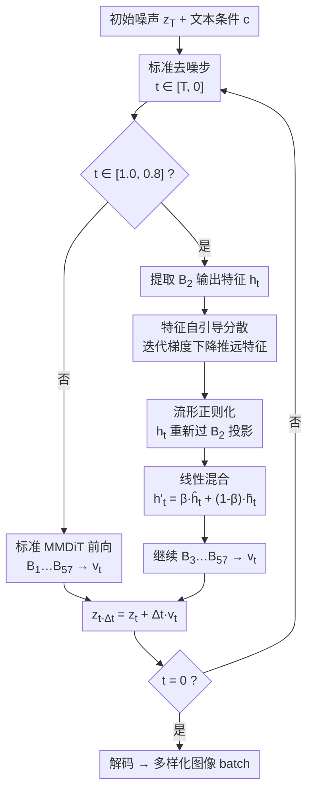

# Don't Settle at the Mode! Mitigating Diversity Collapse in Pretrained Flow Models via Feature Self-Guidance

**会议**: ECCV 2026  
**arXiv**: [2606.27371](https://arxiv.org/abs/2606.27371)  
**项目页**: [dont-settle-at-the-mode.github.io](https://dont-settle-at-the-mode.github.io/)  
**代码**: 无  
**领域**: 图像生成  
**关键词**: 流匹配模型, 多样性坍塌, 特征自引导, 流形正则化, 免训练推理

## 一句话总结
本文发现预训练流匹配模型（如 FLUX）在相同条件输入下生成多样本时会出现内部 MMDiT 特征坍塌，进而导致输出多样性坍塌；提出一种免训练的推理时特征自引导（Feature Self-Guidance）机制——对 batch 内样本的中间特征做迭代分散后，再通过同一 MMDiT block 重投影回流形，以极小的推理开销显著提升生成多样性，同时保持 prompt 对齐度。

## 研究背景与动机
以 FLUX 为代表的流匹配（flow matching）模型在文本到图像生成上取得了惊艳的质量，但当用户对同一个 prompt 反复采样时，模型往往输出高度雷同的图像——同一女性肖像 prompt 下，FLUX.1-dev 生成的 8 张图在构图、色调、姿态上几乎不可区分。这种**多样性坍塌（diversity collapse）**在需要批量候选供用户挑选或迭代 prompt 优化的实际场景中是致命的。

现有解决方案分两路：**潜空间引导**（如 Particle Guidance、Interval Guidance、Shielded Diffusion、CNO）计算轻量但多样性提升有限，往往只是风格微调而非结构级变化；**奖励模型筛选**（如 Group Inference）从大候选池中按 CLIP/DINO 分数挑选高多样性子集，效果好但推理开销巨大——需先生成 64-128 张候选图再用奖励模型打分，延迟数倍于标准推理，且依赖外部模型。两路方法的核心矛盾在于：**它们都在潜空间（latent space）或像素空间操作，没有触及多样性坍塌的根源**。

本文的关键发现来自一个诊断实验：向 FLUX 内部 MMDiT block 的特征 $h_t$ 注入高斯噪声 $\epsilon \sim \mathcal{N}(0, \sigma^2 I)$，随着特征空间方差增大，输出图像的 pairwise 距离直方图右移，多样性显著上升；而同样的扰动加在 latent $x_t$ 上则导致图像严重退化。这揭示了一个直接对应关系：**内部 MMDiT 特征的空间分散程度是输出多样性的直接代理**，多样性坍塌本质上是特征坍塌。

**核心 idea**：在推理时对 batch 内样本的 MMDiT 中间特征做有原则的分散（dispersion）以扩大多样性，同时利用同一 transformer block 的读写机制将分散后的特征投影回自然图像流形（manifold regularization），在保证保真度的前提下恢复多样性——全程无需训练、无需外部奖励模型。

## 方法详解

### 整体框架
本文方法是一个插入预训练流匹配模型推理过程的「分散-精炼」（Disperse-and-Refine）即插即用模块。给定一个 batch 的 $N$ 个初始噪声，在去噪早期阶段（$t \in [1.0, 0.8]$）、在第二个 MMDiT block（$B_2$）处提取图像 token 的中间特征 $h_t^{[1:N]}$，先通过特征自引导迭代地将 batch 内特征互相推远（分散阶段），再将推远后的特征重新送入同一个 $B_2$ block 做前向投影（精炼阶段），最后将分散特征与投影特征做线性插值得到最终特征 $h'_t$，传给后续 block 继续去噪。其他 timestep 和 block 不做任何干预，保持原始推理流程。

### 关键设计

**1. 特征自引导分散：直接操作内部特征而非潜变量**

针对「内部特征坍塌导致输出多样性坍塌」这一核心发现，本文设计了一个基于 batch 内 pairwise 特征距离的能量函数，并直接对特征做梯度下降来显式推远特征。能量函数定义为 batch 内所有样本对余弦相似度的 LogSumExp 形式：

$$\mathcal{G}(h_t^{[1:N]}) = \log \mathbb{E}_{i,j \sim \{1, N\}} \left[\exp\left(\frac{sim(\boldsymbol{h_t^i}, \boldsymbol{h_t^j})}{\tau}\right)\right]$$

其中 $N$ 为 batch size，$sim(\cdot, \cdot)$ 为余弦相似度，$\tau$ 为温度参数。随后直接在特征上做梯度更新 $h_t^k := h_t^k - w \nabla \mathcal{G}(h_t^{[1:N]})$，迭代 $N_{opt}$ 步（默认 30 步，学习率 $w=0.5$）。

这一设计与以往潜空间引导方法（对 $x_t$ 求梯度）的关键区别在于：更新 $h_t$ 只需修改中间层激活值，**无需反向传播穿过前面的 transformer block**，因此计算开销极低——仅比标准 I.I.D. 推理多约 7% 的时间（1.59s vs 1.70s），远快于 Group Inference 的 2.86s-4.55s。同时，在特征空间而非潜空间操作避免了直接扰动 latent 带来的图像退化（纹理丢失、结构破坏），因为特征空间对扰动的鲁棒性远高于潜空间。

**2. 流形正则化：利用 transformer 读写机制将分散特征拉回自然图像流形**

单纯的特征分散存在风险：迭代梯度下降可能将特征推出特征流形的有效区域，表现为生成图像出现视觉伪影或偏离输入条件。为解决此问题，本文借鉴 mechanistic interpretability 中关于 transformer 残差连接「读写机制」的洞察——每个 block 从主信息流中「读取」$h_t$，经过计算后「写回」一个增量 $\Delta h_t$ 到信息流中。

基于此，将分散后的特征 $\tilde{h_t}$ 重新送入**同一个** $B_2$ block 做一次前向传播，得到投影特征 $\hat{h_t}$。这一操作相当于让预训练 block 利用其内部先验对偏离流形的特征做「纠偏」，写出一个修正量 $\Delta \tilde{h_t}$，将特征拉回条件特征流形。最终特征由分散特征与投影特征的线性插值给出：

$$h'_t := \beta \hat{h_t} + (1 - \beta) \tilde{h_t}$$

其中 $\beta \in [0, 0.6]$ 作为可控旋钮：$\beta$ 越大，正则化越强，prompt 对齐度越高但多样性略降；$\beta$ 越小，多样性越强但可能牺牲保真度。默认取 $\beta=0.4$ 在多样性-保真度 tradeoff 中取得良好平衡。

**3. 干预位置与时机选择：只在早期 block 和早期 timestep 做干预**

方法只在**第二个 MMDiT block（$B_2$）**和**去噪早期阶段（$t \in [1.0, 0.8]$）**施加干预，这并非随意选择，而是通过系统消融得出的最优设计。Block 消融实验（附录 Table G）表明：在 $B_1$ 做引导虽多样性最高（DINO=0.69, VS=3.91），但 CLIPScore 降至 31.29，prompt 对齐明显受损；$B_2$ 是 sweet spot（DINO=0.68, CLIPScore=32.05），在多样性与对齐度之间取得最佳平衡；$B_3$ 及以后 block 多样性增益急剧衰减（DINO=0.60），因为后期 block 主要处理细节而非语义结构。此外，跳块实验表明直接移除 $B_1$-$B_3$ 会导致生成纯噪声，验证了早期 block 承载核心语义信息。

Timestep 消融（附录 Table H）显示：在 $t \in [1.0, 0.8]$ 做引导已足够，延长到 $t=0.7$ 或 $t=0.5$ 的多样性增益微乎其微（DINO 从 0.68 到 0.68，VS 从 3.57 到 3.62），但 CLIPScore 从 32.05 降到 31.82。原因在于图像的整体结构在 $t \in [1.0, 0.8]$ 阶段已基本形成（见论文 Fig. L 的中间 $x_0$ 预测），后续 timestep 只是添加细节纹理——早期干预决定「长什么样」，后期干预只能微调。

### 损失函数 / 训练策略
本文方法**完全免训练（training-free）**，只在推理时修改单个 MMDiT block 的输出特征。不存在训练目标函数或参数更新。唯一需要设置的是推理时超参：优化步数 $N_{opt}$、学习率 $w$、温度 $\tau$、混合系数 $\beta$、干预 block 编号 $B_i$ 和干预时间窗口 $[T_a, T_b]$——这些在不同模型和 batch size 下有推荐默认值（见附录 Table C/D）。方法可无缝插入任何预训练 flow model（DiT 或 UNet 架构均支持），包括 step-distilled 模型（如 FLUX.2-Klein-4B）。

## 实验关键数据

### 主实验
**Table 1: 文本到图像生成在 GenEval 上的主结果（FLUX.1-dev, batch size=8）**

| 方法 | Latency↓ | DINO↑ | VS↑ | DreamSim↑ | MSS↓ | CLIPScore↑ |
|------|----------|-------|-----|-----------|------|-------------|
| I.I.D. | 1.59s | 0.57 | 2.77 | 0.27 | 0.32 | 32.43 |
| Particle Guidance | 2.94s | 0.58 | 3.16 | 0.31 | 0.29 | 32.22 |
| Interval Guidance | 1.59s | 0.57 | 2.88 | 0.28 | 0.30 | 32.46 |
| Shielded Diffusion | 1.59s | 0.61 | 3.35 | 0.40 | 0.23 | 32.11 |
| CNO | 1.75s | 0.63 | 3.46 | 0.39 | 0.22 | 31.97 |
| GroupInference (8/64) | 2.86s | 0.67 | 3.37 | 0.35 | 0.21 | 32.49 |
| GroupInference (8/128) | 4.55s | 0.70 | 3.61 | 0.37 | 0.19 | 32.37 |
| **Ours** | **1.70s** | **0.68** | **3.57** | **0.40** | **0.19** | **32.05** |

在所有多样性指标上，本文方法大幅领先 I.I.D. 基线和潜空间引导方法（DINO 从 0.57 提升到 0.68，MSS 从 0.32 降到 0.19），多样性达到 GroupInference (8/128) 的同等水平，但延迟仅 1.70s（vs 4.55s），且无需外部奖励模型。CLIPScore 仅比 I.I.D. 基线下降 0.38 点，prompt 对齐度基本保持。

**Table 2: 条件图像生成结果（深度条件与参考图像条件）**

| 任务 | 方法 | DINO↑ | CLIPScore↑ |
|------|------|-------|-------------|
| Depth-to-Image | I.I.D. | 0.43 | 30.85 |
| Depth-to-Image | Group Inference | 0.47 | 30.63 |
| Depth-to-Image | **Ours** | **0.52** | 30.49 |
| Personalized (I2I) | I.I.D. | 0.45 | 31.93 |
| Personalized (I2I) | Group Inference | 0.49 | 32.58 |
| Personalized (I2I) | **Ours** | **0.57** | 32.04 |

在深度到图像和个性化图像生成任务上，本文方法在 FLUX.1-Depth 和 FLUX.1-Kontext 上均一致地提升了多样性（DINO 分别提升 0.09 和 0.12），且 CLIPScore 仅微降，证明了方法的跨任务泛化能力。在 step-distilled 模型 FLUX.2-Klein-4B（4 步推理）上同样有效（DINO 从 0.46 到 0.60），表明方法不依赖 classifier-free guidance 机制。

### 消融实验
**Table 3: MMDiT Block 选择消融（FLUX.1-dev, GenEval）**

| Block | DINO↑ | VS↑ | DreamSim↑ | MSS↓ | CLIPScore↑ |
|-------|-------|-----|-----------|------|-------------|
| $B_1$ | 0.69 | 3.91 | 0.44 | 0.18 | 31.29 |
| $B_2$ | **0.68** | **3.57** | **0.40** | **0.19** | **32.05** |
| $B_3$ | 0.60 | 2.94 | 0.29 | 0.29 | 32.39 |
| $B_4$ | 0.60 | 2.88 | 0.28 | 0.29 | 32.38 |
| $B_5$ | 0.59 | 2.83 | 0.28 | 0.30 | 32.37 |

$B_2$ 是多样性与对齐度的最佳平衡点。$B_1$ 多样性最高但 CLIPScore 最低（31.29），说明最早 block 承载最强的语义信息，扰动它虽带来最大多样性但也最损害对齐。$B_3$ 及以后的 block 多样性增益微乎其微，因为语义结构已在早期 block 确定。

### 关键发现
- **$\beta$ 是平滑的 diversity-fidelity 旋钮**：$\beta$ 从 0 到 0.6 连续调节，低 $\beta$ 高 diversity、低 fidelity，高 $\beta$ 反之。用户可根据下游场景灵活选择——这在实用部署中非常有价值。
- **Batch size 可扩展性好**：当 batch size 从 8 扩展到 128，本文方法依然保持高多样性和 prompt 对齐，而 Group Inference 的多样性随选中比例增大而退化回 I.I.D. 水平（因为候选池中难以及时剔除相似样本）。
- **计算开销极低**：在 H200 GPU 上，本文方法的吞吐量和显存占用几乎与 I.I.D. 基线重合，远优于 Group Inference（后者显存和延迟随候选池大小线性增长）。用户研究也表明本文方法在多样性上大幅领先基线，图像质量与 prompt 跟随度有竞争力。

## 亮点与洞察
- **找准了多样性坍塌的根源**：诊断实验发现 MMDiT 特征空间分散度与输出多样性直接相关——这是一个简洁有力的 insight，为整个方法提供了坚实动机。以往的潜空间/像素空间方法都在症状层面打转，本文在病因层面出手。
- **利用 transformer 读写机制回流形**：流形正则化的设计借用 mechanistic interpretability 的「read-write」视角来解释「再过一个 block = 投影回特征流形」，不是简单的 trick 堆叠，有理论直觉支撑。这个思路可以迁移到其他 transformer-based 生成模型（如 video DiT、3D DiT）中——凡是残差连接的 transformer block 都可做类似正则化。
- **单 block + 短时间窗口的极简干预**：只在 57 个 block 中的第 2 个、在 28 步去噪的前 20% 步做干预就够——这种「精准打击」既省计算又规避了对后续推理步骤的连锁影响。Block 选择消融和 timestep 消融做得很扎实。
- **即插即用的工程价值**：方法无需微调、不依赖外部模型、不修改模型权重，插入任何预训练 flow model（包括 step-distilled、深度条件、参考图像条件、UNet 架构）即可生效——这种 zero-friction 的设计在实际部署中非常友好。

## 局限与展望
- **受限于基座模型**：作为推理时方法，无法超越预训练模型的上限，会继承基座模型的 bias（如训练数据的分布偏差）。如果基座模型本身在某些概念上就缺乏多样性，本文方法只能有限缓解。
- **不适用于流式生成**：方法依赖 batch 内 pairwise 特征距离计算，无法在单张流式生成场景中使用。对于实时交互式单张生成场景，需要设计单样本版本的特征扰动策略。
- **仅在视觉模态验证**：作者计划扩展到 3D 合成、视频生成、分子结构生成等领域，但目前缺乏实验支撑——这些模态的 transformer 内部特征是否也呈现类似的坍塌模式，尚待验证。
- **超参对新模型需重新调优**：不同模型（FLUX.1 vs FLUX.2 vs QwenImage）和不同 batch size 需要不同的学习率、混合系数等超参（见附录 Table C/D），缺乏自动调参机制。

## 相关工作与启发
- **vs 潜空间引导方法（Particle/Interval/Shielded/CNO）**: 它们都在潜变量 $x_t$ 上做引导或优化，本文直接在内部特征 $h_t$ 上操作——特征空间对扰动的鲁棒性远高于潜空间，且更新 $h_t$ 无需反向传播穿过前置 block，计算效率更高。
- **vs Group Inference**: 它用外部 CLIP/DINO 奖励模型选子集，需要先生成 64-128 个候选再筛选；本文不需要外部模型和候选池，直接在生成过程中确保多样性，延迟接近 I.I.D.。本质区别是 Group Inference「先冗余生成再筛选」，本文「在生成过程中消除坍塌」。
- **vs CADS**: CADS 通过扰动文本嵌入来增加多样性，但极易导致语义漂移（CLIPScore 从 32.43 暴跌到 18.05），因为它在输入侧无差别加噪；本文在特征侧做有方向性的梯度分散，且用流形正则化兜底，保真度好得多。
- **vs REPA / RAE 等训练时表示正则化方法**: 这些方法在训练 DiT 时加自监督表示对齐或分散损失来提升训练效率或表示质量；本文取灵感于「内部表示可被操控」这一前提，但将干预完全推到推理时，免训练且即插即用。

## 评分
- 新颖性: ⭐⭐⭐⭐ 在特征空间解决多样性坍塌是新的切入点，「特征分散 + 流形正则化」的双阶段设计以及 transformer 读写机制的借用都有新意，但特征引导本身不算全新概念
- 实验充分度: ⭐⭐⭐⭐⭐ 在 4 个模型（FLUX.1-dev, FLUX.1-Depth, FLUX.1-Kontext, FLUX.2-Klein）+ 2 个额外 T2I 模型（QwenImage, Sana1.5）+ UNet DDPM 上验证，block/timestep/$\beta$/batch size 消融完整，有计算分析和用户研究
- 写作质量: ⭐⭐⭐⭐ 行文清晰，诊断实验（Fig. 2）为整个方法提供了直观动机，但附录超参表（Table C/D）的组织方式略显冗余
- 价值: ⭐⭐⭐⭐ 实际部署价值高（即插即用、免训练、低开销），为后续研究（视频/3D/分子生成的多样性增强）打开了特征空间干预这一新方向

<!-- RELATED:START -->

## 相关论文

- [\[CVPR 2026\] DiverseGRPO: Mitigating Mode Collapse in Image Generation via Diversity-Aware GRPO](../../CVPR2026/image_generation/diversegrpo_mitigating_mode_collapse_in_image_generation_via_diversity-aware_grp.md)
- [\[ICML 2026\] Escaping Mode Collapse in LLM Generation via Geometric Regulation](../../ICML2026/image_generation/escaping_mode_collapse_in_llm_generation_via_geometric_regulation.md)
- [\[ECCV 2026\] Semantic Browsing: Controllable Diversity for Image Generation](semantic_browsing_controllable_diversity_for_image_generation.md)
- [\[ECCV 2026\] Rethinking Garment Conditioning in Diffusion-based Virtual Try-On: Decouple, Don't Denoise](rethinking_garment_conditioning_in_diffusion-based_virtual_try-on_decouple_dont_.md)
- [\[ECCV 2026\] Diffusion Integrated Gradients: Controllable Path Generation for Flexible Feature Attribution](diffusion_integrated_gradients_controllable_path_generation_for_flexible_feature.md)

<!-- RELATED:END -->
