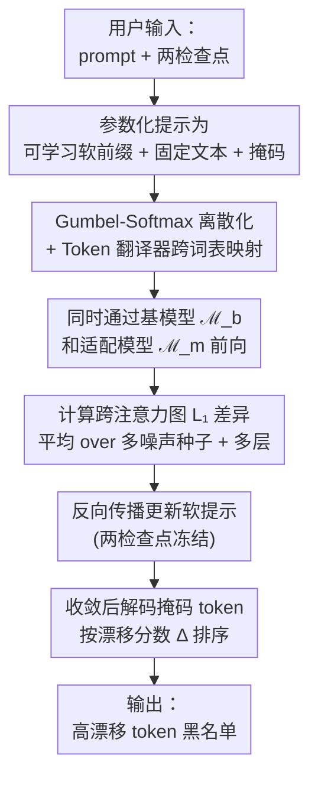

# DriftScope: Measuring The Hidden Effects of Diffusion Model Adaptation

**会议**: ECCV 2026  
**arXiv**: [2607.00183](https://arxiv.org/abs/2607.00183)  
**代码**: 无（项目页 [https://hyping111.github.io/DriftScope/](https://hyping111.github.io/DriftScope/)）  
**领域**: 扩散模型 / 模型诊断  
**关键词**: 扩散模型适配、概念漂移、跨注意力分歧、模型差分、零样本分类

## 一句话总结

本文证明文本到图像扩散模型在概念定制和概念遗忘两种适配操作中都会系统性地损害语义无关的其他概念（零样本分类最差类别掉点最高 18.9 分），而 FID/KID 等聚合指标对此结构性盲视；作者提出 DriftScope，一种基于软提示优化的 token 级概念漂移诊断工具，通过最大化两检查点间交叉注意力图的差异来排定受漂移影响最严重的 token。

## 研究背景与动机

**领域现状**：文本到图像扩散模型（如 Stable Diffusion）的适配（adaptation）是实际部署中的常见操作，主要分两类——概念定制（DreamBooth、Custom Diffusion 等，让模型学会生成一个新概念）和概念遗忘（EraseDiff、MACE、SPM 等，从模型中移除不安全内容）。这些适配操作通常只评估其预期效果：定制模型能否生成新概念？遗忘模型能否避免有害内容？

**现有痛点和核心矛盾**：标准评估指标（FID、KID、面向特定 prompt 的评估）只关注聚合质量和目标任务性能，对细粒度的分布偏移完全盲视。当适配造成的损伤足够大以至于 FID 和 KID 开始响应时，模型已经几乎不可用；而当模型仍能正常运行时，FID 和 KID 保持平稳，但特定类别已经静静地经历了最差零样本准确率高达 18.9 个百分点的下降。问题本质在于粒度——聚合指标结构性无法发现集中在特定概念上的损伤。更关键的是，这一现象同时出现在适配光谱的两端（添加概念和移除概念），暗示它是权重级修改的系统性后果，而非特定方法的偶然产物。

**切入角度与核心 idea**：本文先通过稀疏自编码器（SAE）分析证明概念级漂移真实存在，再用零样本分类验证漂移确实反映为语义能力的丧失（即概念真的"坏了"而非只是分布变了）。随后提出 DriftScope——给定任意 prompt 和两个检查点（基模型和适配模型），通过可微的交叉注意力分歧最大化来寻找两模型处理方式差异最大的 token，返回排序的漂移报告。核心 idea 是用可微提示优化技术作为测量仪器，把"这两个模型在哪 disagree"定位到具体的单词上，实现可解释的概念级审计。

## 方法详解

### 整体框架

论文方法由两部分组成：（1）**证明阶段**——用 SAE 分析和零样本分类建立"适配导致隐藏概念漂移"的事实基础；（2）**诊断阶段**——DriftScope 作为实用工具输出 token 级漂移报告。

证明阶段中，SAE 分析利用训练在 DINOv2 特征上的稀疏自编码器将图像嵌入分解为近似可解释的概念激活值，计算基模型和适配模型生成的成对图片在各概念上的漂移分数 $\omega(k)$；零样本分类则通过高斯扩散分类器（GDC）在 CIFAR-10、Flowers-102、Food-101 三个标准 benchmark 上评估适配前后的准确率变化，暴露"均值平稳、最差剧烈掉点"的损伤模式。

诊断阶段即 DriftScope，其 pipeline 如下：

### 关键设计

**1. SAE 概念级漂移分析：用稀疏自编码器将分布偏移归因到具体概念**

SAE 分析最早来自 Bohacek 等人用于比较生成图像与训练数据之间的概念盲区。本文将其改造为比较同一架构下两套权重的生成分布。具体做法：从 DiffusionDB 采样 10,000 个 prompt，用相同 prompt 和噪声种子分别在基模型 $\mathcal{M}$ 和适配模型 $\mathcal{M}'$ 上生成成对图像。对每个概念 $k$，计算 SAE 激活值的漂移分数：

$$\omega(k)=\sigma\left(\mathbb{E}_{x'\sim\mathcal{M}'}[\varepsilon_k(x')]-\mathbb{E}_{x\sim\mathcal{M}}[\varepsilon_k(x)]\right),$$

其中 $\sigma$ 为 sigmoid 函数，$\omega(k)=0.5$ 表示两分布完全对齐。基线实验（同一模型不同随机种子）显示 $\omega(k)$ 严格集中在 0.5 附近，证实随机方差无法解释后续观测到的重尾分布（大量概念偏离 0.5 向 0 或 1 靠拢）。这一分析虽然能揭示哪些概念发生了漂移，但无法区分"只是分布变了"和"语义能力受损了"——因此需要零样本分类来验证漂移的语义后果。

**2. 零样本分类验证：用 GDC 暴露聚合指标盲区**

GDC 为每个类别生成 240 张图像并聚合成 CLIP 图像嵌入原型，测试图像按余弦相似度分配到最近原型。分类准确率完全依赖于生成模型的语义覆盖——如果适配侵蚀了某个概念，对应原型就会退化，该类准确率随之下降。关键指标是**均值变化和最差类别变化的缺口**：均值小幅下降伴随某类别大幅掉点，就是聚合指标盲区的直接证据。

实验发现三个损伤阶段：① 灾难性（EraseDiff），FID/KID 显著升高，准确率全面崩溃，最差掉点 90%+——此时聚合指标虽能检测到问题，但模型已不可用；② 隐蔽性（SPM），FID仅 3.64、KID 仅 $2\times10^{-5}$，但 CIFAR-10 最差类掉点 18.9 分——模型通过聚合检查但静默失去语义覆盖；③ 最微妙（DreamBooth），FID 和均值准确率几乎不变，但标准差极大（如 Flowers 上均值仅降 2.88 但标准差 12.21），表明少数类被严重损害而多数类不受影响。

**3. DriftScope 可微分提示优化：将两模型分歧定位到 token 级**

DriftScope 的核心思想是把 prompt 构造作为一个 fill-mask 任务，用 Gumbel-Softmax 松弛实现离散 token 的可微优化。提示参数化为 $p_\theta=[\mathbf{s}_\theta,\mathbf{t},\mathbf{m}]$，其中 $\mathbf{s}_\theta$ 是可学习软前缀，$\mathbf{t}$ 是固定文本，$\mathbf{m}$ 是待优化的掩码位置。通过一个固定的二进制映射矩阵 $\mathbf{M}\in\{0,1\}^{V\times W}$ 将 MLM 词表的 one-hot token 映射到目标编码器词表，实现跨扩散架构（CLIP/T5）的兼容。

优化目标是最小化两模型在相同 prompt 和噪声种子下的跨注意力图差异的 L1 范数（比 L2 产生更尖锐的定位效果）：

$$D(p)=\frac{1}{S}\sum_{s=1}^{S}\sum_{\ell\in\mathcal{L}}\left\|A^{(\ell)}(\mathcal{M}_b,p,z_s)-A^{(\ell)}(\mathcal{M}_m,p,z_s)\right\|_1.$$

两检查点全程冻结，梯度只流经软提示参数。优化仅用前 4 步去噪轨迹（早期步控制高层语义结构，对概念漂移最敏感），每次运行得到一个候选 token 及其漂移分数 $\Delta$。多次初始化运行后聚合频率最高的高漂移 token，生成黑名单。

**4. 词级漂移归因：全 prompt 上下文而非单 token 切片**

与直觉上只提取对应 token 的注意力切片不同，DriftScope 的漂移分数基于完整 prompt 的跨注意力图计算，从而捕获两模型在处理整个场景（包括对象关系和上下文）时的差异，而非孤立的单个概念外观。这样就排除了"单个 token 注意力图因 prompt 重排导致的偶发差异"，反映的是系统性的表示变化。通过反转目标（最小化而非最大化 $\Delta$），还可以识别保持稳定的 token，形成对比验证。

### 一个完整示例：SPM 遗忘 nudity 的漂移诊断

用户提供 prompt 模板"A photo of a [MASK]"以及 SD1.4 基模型和 SPM 遗忘 nudity 后的适配模型。DriftScope 对此模板运行 100 次优化（不同初始化种子），每次得到使交叉注意力分歧最大的离散 token。聚合后，"body""goddess""woman""baby""sheet" 成为最高频 token——其中 woman、body、goddess 与裸体高度相关的概念被意外波及。用这些高漂移 token 生成图像的 CLIP-i 为 0.88、LPIPS 为 0.33；对比低漂移 token（battle、boat、car）的 CLIP-i 0.96、LPIPS 0.14，差距显著，证实 DriftScope 能有效区分稳定和受损概念。

### 损失函数 / 训练策略

DriftScope 不存在传统意义上的"训练"，其优化过程仅更新软提示 $\mathbf{s}_\theta$ 的参数。约束和策略包括：使用 Gumbel-Softmax 温度退火实现离散 token 的可微优化；批处理多个固定噪声种子（$S$ 个）使结果泛化；限制去噪轨迹到前 4 步以降低内存和计算开销（早期步控制语义结构，足够产生可靠的漂移信号）。两检查点全程冻结，无额外训练目标。

## 实验关键数据

### 主实验：适配模型隐藏损伤的零样本分类证据

| 范式 | 方法 | 模型 | FID↓ | KID↓ | CIFAR-10 最差/均值 | Flowers-102 最差/均值 | Food-101 最差/均值 |
|------|------|------|------|------|---------------------|----------------------|---------------------|
| 遗忘 | AC | SD1.4 | 10.250 | 0.002 | −21.5/−2.05 | −87.3/−5.81 | −29.5/−2.19 |
| 遗忘 | EraseDiff | SD1.4 | 321.621 | 0.377 | −91.9/−23.24 | −98.1/−23.60 | −87.3/−5.68 |
| 遗忘 | MACE | SD1.4 | 60.812 | 0.033 | −39.8/−5.93 | −98.1/−19.77 | −49.1/−11.65 |
| 遗忘 | SPM | SD1.4 | 3.643 | 0.00002 | −18.9/−3.91 | −14.6/−0.13 | −5.0/−0.19 |
| 定制 | DreamBooth | SD1.5 | 6.86±2.18 | 0.002±0.001 | 0.96±7.95 | −2.88±12.21 | 0.08±11.86 |
| 定制 | DreamBooth | SD2.1 | 6.68±3.66 | 0.003±0.003 | −2.22±5.73 | −0.74±10.91 | −0.91±12.45 |
| 定制 | DreamBooth | SD3.5 | 8.45±2.33 | 0.003±0.001 | 0.84±8.88 | −0.21±10.72 | −1.11±9.36 |

> 遗忘方法：FID/KID 值越低指标越好；定制方法：DreamBooth 报告均值±标准差（跨 10 个微调概念）。SPM 行清晰展示了"FID/KID 几乎完美，但 CIFAR-10 最差类掉点 18.9 分"的隐蔽损伤模式。DreamBooth 行的标准差揭示了均值掩盖的差异化损伤——Flowers 上均值仅降 2.88 但标准差 12.21。

### DriftScope 高漂移 vs 低漂移 token 的诊断分离

| 方法 | 模型 | 条件 | CLIP-i↑ | MS-SWD↓ | LPIPS↓ | Q-Eval↑ |
|------|------|------|---------|---------|--------|---------|
| SPM | SD1.4 | 高漂移 | 0.88±0.11 | 1.02 | 0.33±0.20 | 0.50±0.16 |
| SPM | SD1.4 | 低漂移 | 0.96±0.05 | 0.39 | 0.14±0.11 | 0.43±0.14 |
| ESD | SD1.4 | 高漂移 | 0.72±0.13 | 1.84 | 0.57±0.15 | 0.41±0.17 |
| ESD | SD1.4 | 低漂移 | 0.79±0.11 | 1.74 | 0.52±0.13 | 0.41±0.12 |
| Scissorhands | SD1.4 | 高漂移 | 0.56±0.09 | 4.15 | 0.82±0.08 | 0.12±0.07 |
| Scissorhands | SD1.4 | 低漂移 | 0.62±0.10 | 4.01 | 0.78±0.11 | 0.19±0.08 |
| DreamBooth | SD1.5 | 高漂移 | 0.81±0.13 | 1.87 | 0.51±0.18 | 0.52±0.18 |
| DreamBooth | SD1.5 | 低漂移 | 0.85±0.10 | 1.41 | 0.44±0.16 | 0.56±0.16 |
| DreamBooth | SD2.1 | 高漂移 | 0.81±0.10 | 1.81 | 0.54±0.14 | 0.39±0.15 |
| DreamBooth | SD2.1 | 低漂移 | 0.84±0.09 | 1.44 | 0.50±0.15 | 0.42±0.16 |
| DreamBooth | SD3.5 | 高漂移 | 0.81±0.10 | 2.20 | 0.54±0.13 | 0.69±0.17 |
| DreamBooth | SD3.5 | 低漂移 | 0.81±0.10 | 2.11 | 0.53±0.13 | 0.71±0.16 |

> SPM 的高低漂移差距最显著（CLIP-i 差 0.08、LPIPS 差 0.19），表明 DriftScope 对其诊断最有效。Scissorhands 的高低漂移几乎无差距且 Q-Eval 极低（0.12），确认其为整体模型退化而非局部概念侵蚀，此时 DriftScope 的归因应谨慎解读。DreamBooth 在 SD2.1 上 Q-Eval 高漂移仅 0.39（SD3.5 为 0.69），暗示 SD3.5 更鲁棒。

### 关键发现

- **最致命的隐蔽损伤来自 SPM**：FID 仅 3.64、KID 仅 $2\times10^{-5}$，看起来几乎完美，但 CIFAR-10 某类准确率暴跌 18.9 分——这是聚合指标盲区的教科书式例证。DriftScope 对其分离度最大，证实其在"轻微损伤、高度集中"场景下诊断价值最高。
- **DreamBooth 的损伤是分散而非均匀**：各类准确率变化的标准差（Flowers 12.21）远大于均值变化（-2.88），说明损伤集中在少数类别。SD3.5 相对最鲁棒（Q-Eval 高漂移为 0.69，显著高于 SD1.5 的 0.52 和 SD2.1 的 0.39）。
- **漂移 token 与遗忘/定制目标语义关联，但波及范围出乎意料**：遗忘 nudity 意外损坏 body、goddess、woman；遗忘 garbage 损坏 truck、bus；遗忘 tench 损坏 book、calendar；以狗为定制目标在 SD3.5 上损坏 bible、dragon、devil。这证实损伤是有结构的、与目标相关的，而非随机，因此 DriftScope 返回的漂移报告对具体适配操作可操作。
- **Scissorhands 为退化基线**：其高漂移 token 的 Q-Eval 仅 0.12、CLIP-i 仅 0.56，属于全局模型退化，此时概念级归因不再可靠。

## 亮点与洞察

- **用"可微提示优化作为测量仪器"而非攻击手段**：已有工作（SAGE、Ring-A-Bell、DEXTER）都用可微提示优化生成对抗性 prompt 来暴露单个模型的失败模式或绕过移除机制。DriftScope 把同一套工具拿来做比较——不是问"这个模型在哪失败"，而是问"这两个模型在哪 disagree"。这一视角转换是本质性的：从攻击工具变成诊断仪器。
- **SAE 加零样本分类的双层验证设计**：SAE 分析 $\omega(k)$ 在概念级层面暴露分布偏移，零样本分类验证这种偏移是否对应实际语义能力的丧失。两层互补：SAE 找出"概念变了"，GDC 确认"概念坏了"。缺其一都可能被批评为"只是分布变换不重要"或"只看到性能下降但不知源头"。
- **全 prompt 跨注意力地图而非单 token 切片**：乍看直觉会隔离每个 token 的注意力响应，但这样做会丢失上下文关系（对象关系、修饰语、场景）。用完整 prompt 的跨注意力图计算漂移，捕获的是两模型对整个场景处理方式的差异——这一设计选择虽然使归因结果不能在视觉上"对应到单像素区域"，但排除了大量伪相关。
- **跨架构兼容性通过二进制映射矩阵**：不同 SD 版本使用不同文本编码器（CLIP 变体或 T5），二进制映射矩阵将 MLM 预测的 token转到目标编码器词表中距离最近的对应 token，无需修改优化目标或架构特定代码。
- **高/低漂移的分叉验证**：通过反转目标同时找出低漂移 token，形成天然的"正常对照"——如果高漂移 token 确实反映了损伤，低漂移 token 应产生几乎一致的图像对。SPM 中 CLIP-i 0.88 vs 0.96、LPIPS 0.33 vs 0.14 的差距就是对这一自洽检查的最有力确认。

## 局限与展望

- **计算开销大**：DriftScope 基于优化（非解析），需多次初始化搜索并跨多个噪声种子平均——每次运行 100 次 × 每类 5 个 prompt 模板 = 500 次优化。虽然只用到前 4 步去噪，但对大规模部署扫描而言仍较昂贵。作者提及多次初始化的目的是减轻退化噪声实现的影响，但未给出如何自适应决定运行次数的策略。
- **对全局模型退化失效**：当适配导致广泛退化（如 Scissorhands），跨注意力图全局失去信息性，概念级归因崩溃。这本质上是个体退化与全局退化的边界——DriftScope 的设计前提是"模型仍能有效生成，只是某些概念掉了"，当这个前提不成立时，工具无意义。
- **token 映射精度有限**：二进制映射矩阵把 MLM 词表 token 映射到目标编码器词表中"最近"的对应 token（基于词向量余弦相似度或精确匹配），但不同词表之间可能存在无法精确对应的概念（特别当目标编码器为 T5 而 MLM 为 BERT 时），导致优化到的高漂移 token 在目标词表中没有精确等价物。
- **仅检测、不修复**：DriftScope 是诊断工具，只能告诉用户"哪些概念坏了"，不能给出如何避免或修复损伤的策略。一个自然延伸是把漂移信号作为约束项集成到适配训练过程中，但本文未探讨。

## 相关工作与启发

- **vs COMPCON（Dunlap et al.）**：COMPCON 用进化搜索发现两个独立训练 T2I 模型之间的视觉属性差异，但比较的是**架构、数据、训练过程**都不同的模型，无法将差异归因到特定起因。DriftScope 比较的是**同架构同权重起点**、仅在一次适配操作后发生变化的两个检查点，归因更精准；且 DriftScope 是完全自包含的（无需迭代调外部 VLM/LLM），通过梯度反向传播直接产生 token 级结果。
- **vs SAGE / Ring-A-Bell / DEXTER**：这些工作都用可微/对抗提示优化来探测**单个模型**的失败模式或绕过防御。DriftScope 复用同一范式但目标完全不同——它不寻找单模型的弱点，而是定位两模型之间最分歧的 token。这种"比较而非攻击"的区分使得 DriftScope 的输出是一个概念级漂移报告而非失败样例集。
- **vs Crosscoders（Lindsey et al.）**：Crosscoders 训练跨编码器 SAE 在 LLM 残差流激活上分解基模型和微调模型的共享和特有特征。DriftScope 对标同一目标（比较两检查点）但针对不同模态（T2I 扩散模型）和层面（跨注意力图而非残差流），且不要求访问模型内部结构（注意力图是标准输出），更具通用性。
- **vs C-LoRA / FL2T**：这些工作解决持续定制场景下的遗忘问题，假设"遗忘是需要被缓解的已知问题"。DriftScope 处理的是一个更前置的问题——在单次适配中，工具不防止遗忘，而是**暴露**它，提供概念级审计作为任何缓解策略的必要前提条件。

## 评分

- 新颖性: ⭐⭐⭐⭐⭐ 用可微提示优化做"比较而非攻击"的诊断视角是原创的，SAE+GDC 双层验证也是可信的方法论创新。与 COMPCON、Crosscoders 等模型差异工作形成清晰互补。
- 实验充分度: ⭐⭐⭐⭐⭐ 覆盖 8 种适配方法（4 遗忘 + 4 定制）× 3 种架构（SD1.4/1.5/2.1/3.5）× 3 个零样本 benchmark，以及 4 种图像级发散指标（CLIP-I、MS-SWD、LPIPS、Q-Eval）。消融验证了长 prompt 和领域特定 prompt 的泛化能力。
- 写作质量: ⭐⭐⭐⭐⭐ 动机链清晰（聚合指标盲区→SAE 揭示漂移→GDC 验证语义退化→DriftScope 定位到 token），三个损伤阶段的区分（灾难性/隐蔽性/最微妙）是对现象的精准提炼。
- 价值: ⭐⭐⭐⭐⭐ 直接挑战了当前广泛采用的 FID/KID 评价体系的有效性边界，提供了可落地的逐 prompt 诊断方案。对任何将 T2I 模型适配后投入生产的团队都有实际意义。

<!-- RELATED:START -->

## 相关论文

- [\[AAAI 2026\] How Bias Binds: Measuring Hidden Associations for Bias Control in Text-to-Image Compositions](../../AAAI2026/image_generation/how_bias_binds_measuring_hidden_associations_for_bias_control_in_text-to-image_c.md)
- [\[ICML 2026\] Recovering Hidden Reward in Diffusion-Based Policies](../../ICML2026/image_generation/recovering_hidden_reward_in_diffusion-based_policies.md)
- [\[ICLR 2026\] A Hidden Semantic Bottleneck in Conditional Embeddings of Diffusion Transformers](../../ICLR2026/image_generation/a_hidden_semantic_bottleneck_in_conditional_embeddings_of_diffusion_transformers.md)
- [\[ICLR 2026\] Geometric Image Editing via Effects-Sensitive In-Context Inpainting with Diffusion Transformers](../../ICLR2026/image_generation/geometric_image_editing_via_effects-sensitive_in-context_inpainting_with_diffusi.md)
- [\[ICLR 2026\] GeoDiv: Framework for Measuring Geographical Diversity in Text-to-Image Models](../../ICLR2026/image_generation/geodiv_framework_for_measuring_geographical_diversity_in_text-to-image_models.md)

<!-- RELATED:END -->
