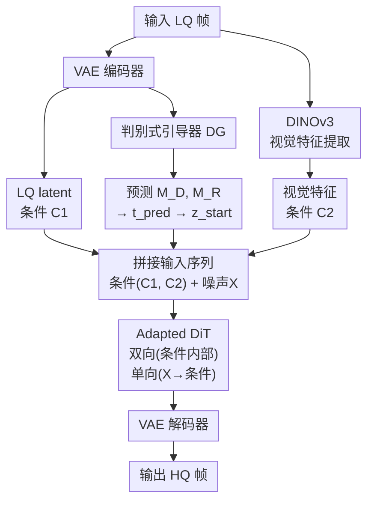

# DTI: Dynamic Trajectory Initialization for Generative Face Video Super-Resolution

**会议**: ECCV2026  
**arXiv**: [2606.29198](https://arxiv.org/abs/2606.29198)  
**代码**: [https://github.com/MediaX-SJTU/DTI](https://github.com/MediaX-SJTU/DTI)  
**领域**: 图像生成 / 人脸视频超分  
**关键词**: 人脸视频超分辨率, 扩散模型, 动态轨迹初始化, 判别式引导, 保真度-感知质量权衡

## 一句话总结

DTI 提出一种"动态轨迹初始化"范式，将生成式人脸视频超分从"全生成"重新定义为"输入驱动的定向恢复"——通过判别式引导器（DG）结合 SNR 对齐理论，为每个低质量输入动态确定扩散采样起点，仅需少量微调就在保真度、感知质量和推理效率上全面超越现有方法。

## 研究背景与动机

人脸视频超分辨率（FVSR）是典型的病态逆问题：要从未知的复杂退化中恢复接近真值的时空信息。近年来，基于扩散模型的生成式方法（GFVSR）取得了最强的感知质量——借助预训练大模型的生成先验，它们能补出传统判别式方法无法恢复的高频纹理细节。然而，这类方法也继承了扩散模型的固有缺陷：大量的多步采样导致推理开销巨大；更严重的是，为了追求高无参考感知分数，模型倾向于"脑补"看起来逼真但偏离真值的细节，产生重复性伪影或非自然扭曲——本文将其概括为"分布生成陷阱"（distribution generation trap）。

深入分析会发现一个被忽视的关键矛盾。现有 GFVSR 方法把任务当作从纯噪声出发的**完整生成**，但事实上低质量（LQ）输入已经保留了绝大部分低频信息（整体结构、肤色、区域颜色等），信息损失主要发生在高频纹理区域。这意味着从纯噪声开始的完整扩散过程效率极低——大量采样步数被浪费在早已满足的低频成分重建上。更根本的问题在于：LQ 虽然包含大量可用信息，但它服从的是真实退化的复杂分布，并非扩散模型所学习的参数化高斯分布，因此不能直接当作某个中间扩散状态来用。这需要在扩散轨迹上为每个 LQ 输入搜寻一个合理的起始点，使得从该点出发的采样既能利用 LQ 已有的低频信息，又能充分发挥扩散模型对高频缺失部分的生成能力。

本文的切入点是：既然 LQ 已经包含大部分低频结构信息，就不需要从纯噪声开始完整生成，而应该让生成过程退化为一个"定向恢复"——仅对真正丢失的高频部分做生成式采样，对已有的低频部分则直接保留。**核心 idea：将 GFVSR 从无条件式的条件生成重新定义为"输入驱动的定向恢复"，核心在于两个机制——通过从 LQ 中提取增强视觉特征（DINOv3）并设计高效注意力注入来精确约束条件化过程，同时通过一个判别式引导器（DG），基于 SNR 对齐理论为每个 LQ 输入动态计算其在扩散轨迹上的合理起始时间步，从而在保真度、感知质量和推理效率三个维度同时取得提升。**

## 方法详解

### 整体框架

DTI 的核心思路是利用 LQ 输入中已保存的低频信息，通过判别式引导器动态确定扩散采样的起始点，从而把完整生成转变为定向恢复。整个框架由三个协同工作的部分组成：增强式条件注入机制、判别式引导器（DG）和经过轻微适配的 DiT 骨干。

### 关键设计

**1. 增强式视觉条件注入：用 DINOv3 从 LQ 中提取"净化"过的视觉特征**

传统 GFVSR 方法在注入 LQ 条件时要么使用 ControlNet（需要大量辅助组件和训练），要么采用 concat-flatten-MLP（仅通道级信息交换、质量有限），要么直接把 LQ 和噪声线性混合（与扩散模型对齐差）。DTI 从一个更根本的观察出发：LQ 作为唯一的输入信息来源，其实是一个退化信号——大量有用的视觉结构信息埋在模糊和噪声之下，直接作为条件是不够充分的。人脸恰好具有清晰的主体结构、明显的边缘和区域划分，特别适合应用视觉特征提取器来增强条件的表达能力。

DTI 引入了自监督视觉模型 DINOv3 作为特征提取器：在 VAE 编码器的时间下采样间隔处取帧，提取的精细视觉特征被编码为额外的条件 token（C2），与 LQ latent 条件 token（C1）一起作为输入。在注入方式上，DTI 将噪声 token（X）与条件 token（C1, C2）拼接为同一序列送入 DiT 的注意力层。关键的设计在于注意力的不对称性：条件 token 之间做双向自注意力使其互相参考和增强，而噪声 token 仅做单向的交叉注意力到条件 token 上——只能读取条件信息、不让条件被噪声污染。这不仅充分激活了条件信息，而且将注意力复杂度从 O((N+M)²) 降至 O(M² + N×M)（其中 N 为噪声 token 数，M 为条件 token 数），显著降低了计算量。

**2. 判别式引导器（DG）：用可解释的监督学习预测最优扩散起始点**

DG 是一个轻量级映射网络，核心目标是回答一个关键问题：给定一个 LQ 输入，它应该从扩散轨迹的百分之几处开始采样？DG 通过监督学习预测两个量：

第一个是局部信息损失矩阵 M_D，其中每个元素 M_D[i,j] = ||z_L[i,j] - z_H[i,j]|| / (1 + ||z_L[i,j] - z_H[i,j]||)，度量该像素位置的信息丢失比例（0 表示完全保留，趋于 1 表示完全丢失）。第二个是低频残差 M_R = z_H - z_L，即高、低分辨率之间的逐元素差值。

$$t_{pred} = \frac{\text{RMSE}(z_L, z_H)}{1+\text{RMSE}(z_L, z_H)} = \frac{\sqrt{\mathbb{E}\left[(\frac{M_D}{1-M_D})^2\right]}}{1+\sqrt{\mathbb{E}\left[(\frac{M_D}{1-M_D})^2\right]}}$$

$t_{pred}$ 即为 SNR 对齐的预测起始时间步。由于 DG 是轻量级网络、能力有限，预测的 M_R 误差较大，仅用作粗粒度的低频精炼（z_anchor = z_L + M_R），而高频细节的恢复仍然交给 DiT 的生成先验。这种"判别式做粗修复、扩散做细生成"的分工确保即使 DG 预测有偏差，也不会破坏最终结果的质量。

**3. SNR 对齐的动态初始化与保真度-感知质量可调节超参数**

DG 预测的 t_pred 对应 SNR 对齐下的最优起始点。但实际应用中可能需要不同程度的感知质量——如果应用场景看重锐利细腻的视觉观感（牺牲一点保真度），应该从更靠后的时间步出发。因此 DTI 引入超参数 λ 来灵活控制 trade-off：

$$t_{start} = (1-\lambda)t_{pred} + \lambda, \quad \lambda \in [0,1]$$

λ = 0 时完全忠实于 SNR 对齐的预测（偏向保真度），λ = 1 时退化为从纯噪声开始的完整生成（最大感知质量）。最终起始噪声 latent 为 z_start = (1 - t_start)·z_anchor + t_start·ε。整个框架提供一个可控的外部接口，用户可以根据具体需求在保真度和感知质量之间调节。论文的实验表明实际退化对应的噪声水平大约在扩散过程的 20%-45% 之间，这意味着即使 λ = 0（最保真模式），采样步数也可减少 55%-80%。

### 损失函数 / 训练策略

模型基于预训练的 Wan2.1-1.3B T2V DiT 骨干，仅通过 LoRA 微调已有 DiT 块。新增的不对称注意力块从零初始化训练。DG 从头训练 15k iterations，整体模型仅微调 20k iterations，无需大规模辅助训练或知识蒸馏。扩散训练目标为标准的 flow-matching 损失：$\mathcal{L}_{FM}(\theta) = \mathbb{E}_{t,x_0,x_1}[\omega(t)\|v_\theta(x_t,t,c) - (x_1 - x_0)\|^2]$，DG 使用 MSE 目标。空间分辨率 512×512。

## 实验关键数据

### 主实验

| 数据集 | 指标 | PGTFormer | SVFR | Vivid-VR | FlashVSR | SeedVR2 | **DTI** |
|--------|------|-----------|------|----------|----------|---------|---------|
| VFHQ | PSNR↑ | 25.63 | 25.54 | 19.82 | 19.57 | 19.80 | **26.35** |
| VFHQ | SSIM↑ | 0.66 | 0.72 | 0.72 | 0.71 | 0.73 | **0.74** |
| VFHQ | LPIPS↓ | 0.30 | 0.22 | 0.21 | 0.18 | 0.21 | **0.17** |
| VFHQ | LMD↓ | 6.055 | 4.71 | 4.64 | 6.10 | 4.59 | **4.20** |
| VFHQ | TLME↓ | 5.72 | 4.11 | 3.98 | 4.29 | 4.19 | **3.72** |
| CelebV-HQ | PSNR↑ | 22.75 | 24.95 | 23.91 | 24.59 | 24.66 | **25.52** |
| CelebV-HQ | LPIPS↓ | 0.55 | 0.28 | 0.40 | 0.32 | 0.34 | **0.22** |
| CelebV-HQ | LMD↓ | 45.05 | 7.54 | 15.30 | 9.44 | 16.04 | **5.26** |
| CelebV-HQ | TLME↓ | 29.16 | 5.34 | 8.59 | 6.34 | 11.39 | **4.01** |

DTI（不含 DG）在全部有 GT 的数据集上取得最低 LPIPS（<0.2），在所有保真度指标（PSNR, SSIM, IDS, LMD, TLME）上全面最优。FlashVSR 凭借大规模后训练在无参考指标上最优，但其保真度指标最差（VFHQ PSNR<20）。

### 消融实验与效率分析

| 配置 | PSNR↑ | LPIPS↓ | MUSIQ↑ | NFE | 说明 |
|------|-------|--------|--------|-----|------|
| DTI w/o DG | 26.35 | 0.17 | 71.54 | 50 | 完整条件注入，从纯噪声开始 |
| DTI w/ DG | **26.85** | **0.17** | 65.17 | **12** | 加 DG 后 NFE 降 76%，保真度↑ |
| 仅 LQ 条件 | 22.15 | 0.28 | 69.20 | 50 | 不加入 DINOv3 特征 |
| DTI 双条件 | **26.35** | **0.17** | 71.54 | 50 | LQ + DINOv3 完整条件 |

### 关键发现

- DG 的加入将 NFE 从 50 降至 12（降低 76%），PSNR 额外提升 0.5dB 至 26.85，无参考指标（MUSIQ）相应下降——验证了判别式引导向保真度方向移动了感知-失真 trade-off
- 双条件注入相比单条件（仅 LQ latent）在 VFHQ 上 PSNR 提升达 4.2dB，LPIPS 从 0.28 降至 0.17，且加速了模型收敛——DINOv3 特征提取提供的"净化"视觉信息增益极大
- 论文在实验后独立分析了指标与真实质量的关系，发现 LPIPS 是最能反映综合质量的指标：高 MUSIQ 样本常伴有明显的视觉伪影，高 PSNR 样本看起来模糊，而低 LPIPS 要求两方面都表现良好
- λ 参数对 trade-off 的控制被实验验证，为用户提供了实用的外部调节接口

## 亮点与洞察

- 范式转换的巧妙之处：将 GFVSR 从"生成"重新定义为"恢复"，看似只是一个视角改变，但系统性地影响了条件注入方式、训练目标和推理策略——这种"先想清楚任务本质再设计方法"的思路值得借鉴
- DINOv3 特征增强的直觉非常普适：不是所有退化信息都等量——LQ 中的低频骨架是可信的，DG 应该优先保留它们而不是让扩散模型从头再生成一遍——这一观察可迁移到更多退化任务
- DG 的训练目标可解释（M_D 是每像素信息损失度量），区别于大多数辅助网络的端到端黑盒训练，让人能理解每个预测的物理含义
- λ 参数作为可控制的外部接口优雅地统一了直觉（退化越重越晚开始采样）和可操作性（用户按需调节），而且有完整的 SNR 对齐理论支撑

## 局限与展望

- DG 从头训练在单一 VFHQ 数据集上，跨数据集的泛化性受限。论文提到对基于预训练 ViT 初始化 DG 的探索不足——利用预训练先验（如 DINOv3 自身）可能进一步提升泛化能力
- DINOv3 特征提取仅作用于 VAE 下采样间隔处的帧，在时间维度上比较稀疏（每 4 帧取一帧），可能丢失部分时序细节
- 加入 DG 后无参考指标（MUSIQ, CLIP-IQA）的下降说明感知质量仍有提升空间——在实际应用中可能需要在不同场景下调节 λ 参数
- DTI 基于扩散模型的"从中间时间步启动"的思路虽然通用，但 DG 的设计高度依赖人脸特征的结构化特性，迁移到无清晰主体结构的通用视频超分可能需要调整

## 相关工作与启发

- **vs FlashVSR**: FlashVSR 通过大规模后训练（160k 图像-视频数据集）实现一步生成，感知质量最高但保真度最低；DTI 仅少量微调就在保真度上大幅领先，证明了定向恢复范式的有效性
- **vs Vivid-VR**: Vivid-VR 采用 ControlNet 注入 LQ 条件（需要大量辅助网络训练），DTI 的注意力拼接方式更简洁高效，且无需额外独立组件
- **vs SeedVR2**: 基于扩散对抗后训练的一步生成，DTI 的多步动态起始在 trade-off 上更灵活可控
- **vs DR2**: DR2 也观察到 LQ 保留低频信息的现象，但 DTI 从 SNR 对齐理论严格推导了起始时间步与退化程度的定量关系，而非仅凭经验设定

## 评分
- 新颖性: ⭐⭐⭐⭐ 将 GFVSR 重新定向为"恢复而非生成"的范式转换带来了系统性的方法链改进，但核心组件（注意力拼接注入、SNR 对齐）并非完全首创
- 实验充分度: ⭐⭐⭐⭐⭐ 在 3 个 benchmark、多种全参考与无参考指标上全面对比，消融完整（条件类型、DG、λ 参数），且附带指标质量分析
- 写作质量: ⭐⭐⭐⭐ 逻辑链条清晰，问题-方案对应完整，但方法部分（Sec.4）一些实现细节可以更直白
- 价值: ⭐⭐⭐⭐⭐ 显著提升保真度（PSNR +0.7~4.2dB）和效率（NFE 降 76%），仅需少量微调，实用价值极高；对 trade-off 的分析也有启示意义

<!-- RELATED:START -->

## 相关论文

- [\[CVPR 2026\] DTG-Restore: Training-Free Diffusion Refinement for Generative Video Super-Resolution](../../CVPR2026/image_generation/dtg-restore_training-free_diffusion_refinement_for_generative_video_super-resolu.md)
- [\[ECCV 2026\] AVSR-Diff: Scale-Agnostic Diffusion Priors for Temporally Consistent Arbitrary-Scale Video Super-Resolution](avsr-diff_scale-agnostic_diffusion_priors_for_temporally_consistent_arbitrary-sc.md)
- [\[CVPR 2026\] VOSR: A Vision-Only Generative Model for Image Super-Resolution](../../CVPR2026/image_generation/vosr_a_vision_only_generative_model_for_image_super_resolution.md)
- [\[NeurIPS 2025\] Image Super-Resolution with Guarantees via Conformalized Generative Models](../../NeurIPS2025/image_generation/image_super-resolution_with_guarantees_via_conformalized_generative_models.md)
- [\[CVPR 2026\] DUO-VSR: Dual-Stream Distillation for One-Step Video Super-Resolution](../../CVPR2026/image_generation/duo-vsr_dual-stream_distillation_for_one-step_video_super-resolution.md)

<!-- RELATED:END -->
