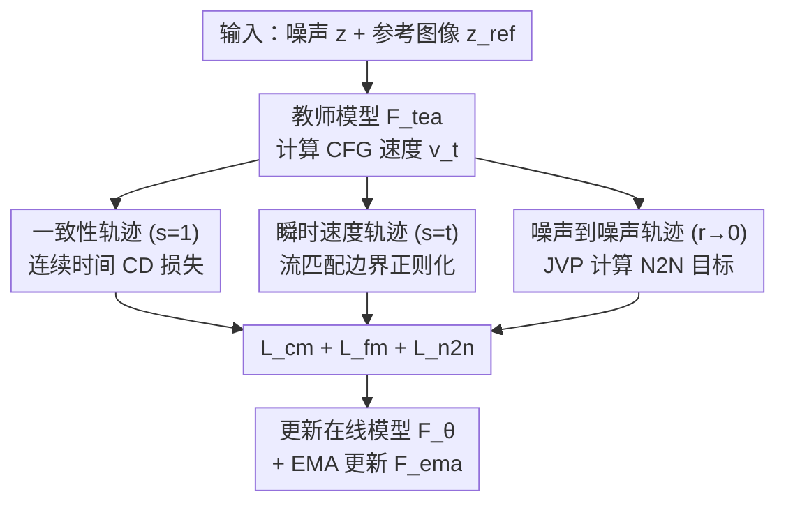

# Dual-End Consistency Model

**会议**: ECCV 2026  
**arXiv**: [2602.10764](https://arxiv.org/abs/2602.10764)  
**代码**: 无  
**领域**: 扩散模型  
**关键词**: 一致性模型, 扩散蒸馏, 少步生成, 流匹配, PF-ODE

## 一句话总结
DE-CM 通过从 PF-ODE 整条轨迹中挑选三条关键子轨迹（一致性轨迹 + 瞬时速度轨迹 + 噪声到噪声轨迹）作为优化目标，用流匹配做边界正则化稳定训练，用 N2N 映射缓解误差累积，在 ImageNet 256 上以一步生成达到 FID 1.70 的 SOTA 水平。

## 研究背景与动机
扩散模型和流匹配模型在图像、视频、3D 生成等任务中取得显著进展，但其迭代采样速度慢是部署的核心瓶颈。一致性模型（CMs）通过学习沿 PF-ODE 轨迹从噪声直接映射到数据的自洽函数，成为少步生成最有效的蒸馏路径之一。从离散时间 CMs 到连续时间 CMs 的演进消除了离散化误差，但并未解决两个根本问题：训练不稳定和采样不灵活。

现有工作尝试从三个方向缓解这些问题——扩散建模（sCMs 的 TrigFlow、MeanFlow/AYF 的流映射）、网络架构调整（定制化架构设计）、训练目标正则化（IMM、MeanFlow、SplitMeanFlow、sCoT、FACM）。然而，这些方法都忽略了一个关键洞察：**核心问题不在于怎么优化，而在于优化哪些轨迹**。MeanFlow 和 AYF 对整个轨迹空间做全枚举优化（O(n^2) 复杂度），纠缠的学习目标导致收敛慢甚至训练崩溃；sCMs 只优化单条 CM 轨迹，缺少关键路径约束增加了不稳定性。FACM 通过显式解耦 PF-ODE 轨迹上的瞬时速度目标取得了更好的训练稳定性，这说明**选择合适的候选轨迹子集才是同时实现训练稳定性和高性能的关键**。

本文的切入角度是：先分析 CMs 不稳定和不灵活的根本原因，再基于分析结果有选择地挑选最关键的轨迹段做优化。核心 idea：**从 PF-ODE 轨迹的 {(t,s) | t < s} 全空间中，只选取一致性轨迹（s=1）、瞬时速度轨迹（s=t）和噪声到噪声轨迹（r→0）三条关键子轨迹簇作为优化目标，用流匹配做边界正则化、用 N2N 映射消除长跳误差累积。**

## 方法详解

### 整体框架
DE-CM 要解决的核心问题是连续时间 CMs 的训练不稳定和采样不灵活。整体思路是：将 PF-ODE 整条轨迹按中间时间 t 为界分解，只选取三条对蒸馏最关键的子轨迹簇作为优化目标，用三个配套的损失函数分别处理。输入为噪声 z 和参考图像/文本条件，输出为训练好的蒸馏模型 F_θ，可支持 1 到 50 NFE 的灵活采样。

框架采用流映射参数化 `f_θ(x_t, t, s) = x_t + (s-t)F_θ(x_t, t, s)`，其中 F_θ 是神经网络（在预训练 LightningDiT 基础上增加右端点时间条件 s 的输入），t 和 s 分别表示轨迹段的左右时间端点。训练时，每个 batch 同时计算三个损失：一致性蒸馏损失 L_cm（s=1，学习从噪声到数据的映射）、流匹配损失 L_fm（s=t，作为左边界正则化稳定训练）、噪声到噪声映射损失 L_n2n（左端点 r→0，学习从纯噪声到任意中间状态的映射），三者加和后更新参数。

### 关键设计

**1. 轨迹簇选择：从全枚举到三条关键子轨迹**

CMs 训练不稳定的根源可以通过对其连续时间目标的分解来理解。将式 (6) 的梯度目标展开后，CMs 的训练目标等价于两项之和（式 8）：全监督项 `‖F_θ(x_t, t) - v_φ‖²`（对齐教师模型的瞬时速度）和自监督项 `‖F_θ(x_t, t) - ṽ‖²`（对齐当前网络状态的时变导数修正值，其中 `ṽ = F_θ⁻(x_t, t) + (1-t)·dF_θ⁻/dt`）。实验表明，自监督项梯度比全监督项更不稳定、波动更大——这是因为在网络未收敛时，`dF_θ⁻/dt` 的 Jacobian-Vector Product 计算高度依赖当前参数状态，一个错误的参数更新就可能让在线模型发散。同时，过度强调一致性会让模型"遗忘"预训练阶段学到的瞬时速度概念（catastrophic forgetting）。

基于这个分析，DE-CM 不做全 {(t,s) | t<s} 空间枚举（MeanFlow/AYF 的做法，O(n^2) 复杂度且冗余轨迹拖慢收敛），而是只选三条有明确功能边界的轨迹簇：
- **一致性轨迹（t∈[0,1], s=1）**：提供自洽性约束，实现少步推理能力
- **瞬时速度轨迹（s=t）**：此时自监督项为零，仅剩全监督的流匹配目标，作为左边界正则化消除训练不稳定
- **噪声到噪声轨迹（r→0, t）**：学习从纯噪声到任意中间点的映射，为推理时的第一步提供噪声感知能力，缓解长跳误差累积

实验证明这三条轨迹就够了——FM+CD+N2N 组合在 1/2/4/50 NFE 下均优于任何子集组合。

**2. N2N 映射：打破只能预测 x_1 的限制**

标准 CMs 受其自洽函数和边界条件 `f_θ(x_1, 1) = x_1` 约束，只能学习从任意 x_t 到数据 x_1 的"长跳"映射。这带来三个问题：推理步数固定（只能做 γ=1 的长跳采样）、误差累积（多步长跳导致总变差距离聚合到 O(√(T+t₁+⋯+t_N))）、对初始噪声敏感。

N2N 映射的核心思想是将左端点从 t 换为 r→0（即纯噪声 x_0），优化区间 [r, t]（r→0），让模型学会从纯噪声 x_0 映射到任意中间状态 x_t，而不只是数据 x_1。在训练目标上，N2N 的离散形式为式 (13)：`‖f_θ(x_r, r, t) - S_ψ(f_θ⁻(x_r, r, t'))‖²`，其中 S_ψ 是沿 PF-ODE 从 x_{t'} 到 x_t 的 Euler 单步解算器。对其分别做右端点 t 和左端点 r 的连续时间极限推导（取 ϵ→0），得到统一梯度目标（式 15）：

`∇_θ E[ w'(r,t) · f_θ^⊤(x_r, r, t) · ( λ·df_θ⁻/dt − γ·df_θ⁻/dr − λ·v_tea(f_θ⁻(x_r, r, t), t) ) ]`

其中 λ、γ 是加权系数，分别控制右端点 t 和左端点 r 的梯度贡献。最终 L_n2n 化为式 (16) 的实用形式：`‖F_θ − F_θ⁻ + w'(r,t)·g‖²`，其中 `g = (λ+γ)F_θ⁻ − (γ·v_φ + λ·v_ψ) − (t−r)·Ḟ_θ⁻`，Ḟ_θ⁻ 是通过 JVP 计算的时变导数 `[∇_{x_r}F_θ⁻, ∂F_θ⁻/∂r, ∂F_θ⁻/∂t] · [λ·v_φ, λ, −γ]^⊤`。消融实验中 λ=0.5, γ=1 取得最优，γ 过小导致优化困难，λ 过大或为零都会损害性能。

**3. 流匹配边界正则化：填补自监督项不稳定留下的空白**

式 (8) 表明 CMs 目标由两个 mse 项组成：`‖F_θ − v_φ‖² + ‖F_θ − ṽ‖²`。当 s→t 时，第二项为零——此时只有全监督的第一项，即标准流匹配损失。这个观察揭示了 FM 的真正角色：它不是一个独立的"辅助训练目标"，而是在自监督项不稳定时为优化提供确定性锚点的**左边界条件**。

据此设计的 L_fm（式 18）不仅包含 L2 损失 `‖F_θ(x_t, t, s) − v_φ‖²`（s=t），还引入了余弦相似度损失 `L_cos(F_θ, v_φ)` 以保护预训练模型的方向特征，支持多步 ODE 采样不掉点。实验验证了 FM 的边界正则效果：加上 FM 后梯度范数曲线变得平滑稳定（图 5a），训练崩溃不再出现。在消融中，去掉 FM 仅用 CM 蒸馏（CD），1 NFE FID 从 1.70 恶化到 3.08，且高 NFE 性能从 1.26 掉到 6.52——说明没有 FM 做边界约束时，一致性自监督项不仅让训练不稳定，还导致了"越蒸馏越差"的多步性能崩塌。

**4. r 值衰减与速度归一化：两个关键训练技巧**

在 N2N 训练中，r 值理论上应该趋近于 0，但实验发现训练初期直接设 r=0 会导致梯度剧烈震荡。DE-CM 引入 r 值衰减策略：`r = max(0, (1 − i/i_max)·δ)`，其中 δ=0.1，i_max=20000。在前 2 万次迭代中 r 从 0.1 逐步衰减到 0，给模型一个平滑的过渡期。消融显示设置 δ=0（不衰减）比 δ=0.1 的 1 NFE FID 差 0.04。

速度归一化针对 CFG 引导的过饱和问题：`v_φ^cfg = v_φ^cond + (w_cfg−1)·min(1, η/‖Δv‖)·Δv`，其中 Δv = v_φ^cond − v_φ^uncond。通过限制条件-无条件速度差 Δv 的范数上限 η，防止 CFG 放大导致生成图像过度饱和，同时 JVP 向量也因此受到隐式正则化约束，间接提升训练稳定性。消融中去掉速度归一化，1 NFE FID 从 1.70 升到 1.75。

### 一个完整示例：单次训练迭代

以 C2I 训练的一个 batch 为例，batch size=1，设 w_cfg=1.75：

1. 从数据集中采样参考图像 z_ref 和类别标签 y_ref；采样噪声 z~N(0,I) 和时间 t~U(0,1)，r 按衰减策略计算
2. 构造加噪样本：z_t = (1−t)·z + t·z_ref；z_r = (1−r)·z + r·z_ref
3. 教师模型计算 CFG 速度：v_t^cond = F_tea(z_t, t; y_ref)，v_t^uncond = F_tea(z_t, t; ∅)，v_t = v_t^uncond + 1.75·(v_t^cond − v_t^uncond)（经速度归一化）；同理计算 v_r
4. **三个损失并行计算**：
    - CD 损失：`L_cm = ‖F_θ(z_t, t, 1; y_ref) − v_cm^tar‖²`，其中 v_cm^tar 是 v_φ 和 F_θ⁻ 的加权组合
    - FM 损失：`L_fm = ‖F_θ(z_t, t, t; y_ref) − v_t‖² + L_cos(F_θ, v_t)`
    - N2N 损失：通过 JVP 计算 F_θ(x_r, r, t; y_ref) 的时变导数 Ḟ_θ⁻，构造 g_n2n 和 v_n2n^tar，`L_n2n = ‖F_n2n − v_n2n^tar‖²`
5. 总损失 L = L_cm + L_fm + L_n2n，更新在线模型 F_θ 和 EMA 模型 F_ema

### 损失函数 / 训练策略
总损失为三部分之和：`L = L_cm + L_fm + L_n2n`。C2I 任务使用 LightningDiT-XL/1 作为教师模型（675M 参数），latent space 32×16×16，AdamW 优化器，lr=1e-4，训练 250 epoch。T2I 任务使用 SD3.5-Medium 教师模型，LoRA rank=64，lr=5e-4，训练数据为 text-to-image-2M 中的 100K 样本。关键超参：λ=0.5，γ=1，δ=0.1，N2N 更新频率 freq=3（每 3 步更新一次 N2N 损失），timestep 采用均匀分段采样而非对数正态分布。CFG 权重通过网格搜索 η 使教师模型 FID 最优来确定。

## 实验关键数据

### 主实验

**C2I：ImageNet 256×256 类条件生成 FID 对比**（表 1 摘要）：

| 方法 | NFE | 参数量 | FID↓ |
|------|-----|--------|------|
| GigaGAN | 1 | 569M | 3.45 |
| StyleGAN-XL | 1 | 166M | 2.30 |
| VAR-d30 | 10 | 2B | 1.92 |
| LightningDiT-XL/1 (w=6.7) | 250×2 | 675M | 1.35 |
| MeanFlow | 1 / 2 | 675M | 3.43 / 2.20 |
| MeanFlow-† (250 epoch repro) | 1 / 2 | 675M | 2.79 / 1.74 |
| FACM-† (250 epoch repro) | 1 | 675M | 1.76 |
| sCMs-† (250 epoch repro) | 1 / 2 | 675M | 3.34 / 1.94 |
| **DE-CM (Ours)** | **1 / 2 / 50** | 675M | **1.70 / 1.33 / 1.26** |

DE-CM 在 1 NFE 下以 1.70 FID 超过所有同规模蒸馏方法，2 NFE（1.33）甚至超越了教师模型 LightningDiT 在 250 NFE 下的 1.35。50 NFE 时 FID 降至 1.26，表明模型不仅少步强，多步也不掉点。

**T2I：文本到图像生成的反馈指标对比**（表 2 部分摘要）：

| 方法 | NFE | CLIP↑ | BLIP↑ | ImageReward↑ |
|------|-----|-------|-------|---------------|
| SD3.5-Medium | 50×2 | 0.2998 | 0.5451 | 0.8750 |
| Flux.1-Dev | 50×2 | 0.2941 | 0.5384 | 0.9634 |
| LCM | 1 / 4 / 8 | 0.2508 / 0.2948 / 0.2993 | 0.4560 / 0.5306 / 0.5318 | −1.0622 / 0.4910 / 0.5871 |
| Hyper-SD | 1 / 4 / 8 | 0.2939 / 0.2949 / 0.3029 | 0.5161 / 0.5307 / 0.5293 | 0.5704 / 0.7931 / 0.8447 |
| **DE-CM (Ours)** | **1 / 4 / 8 / 50** | **0.2996 / 0.2999 / 0.3000 / 0.2993** | **0.5398 / 0.5474 / 0.5479 / 0.5490** | **0.5758 / 0.8117 / 0.8671 / 0.9712** |

T2I 方面，DE-CM 在所有 NFE 设定下 BLIP 得分均为最优，1 NFE 下 ImageReward 0.5758 远超同 NFE 的 LCM（−1.0622）和 CTM（−0.7639）。高 NFE（50）下 BLIP 0.5490 和 ImageReward 0.9712 均达到与多步预训练大模型（Flux、SD3.5）相当甚至略优的水平。

### 消融实验

| 配置 | NFE=1 | NFE=2 | NFE=4 | NFE=50 |
|------|-------|-------|-------|--------|
| Baseline Teacher (w=1.75) | 262.60 | 221.03 | 87.56 | 1.59 |
| 仅 FM | 263.86 | 220.55 | 87.93 | 1.45 |
| 仅 CD | 3.08 | 2.50 | 2.54 | 6.52 |
| FM + CD | 1.78 | 1.41 | 1.62 | 1.78 |
| FM + N2N | 441.66 | 297.28 | 132.60 | 1.41 |
| **FM + CD + N2N (Full DE-CM)** | **1.70** | **1.33** | **1.41** | **1.26** |

消融揭示各组件分工清晰：CD 提供少步能力（缺失时 1 NFE 爆炸到 262+），FM 提供稳定性和多步性能（FM+CD 在 50 NFE 为 1.78，加入 N2N 后降到 1.26），N2N 连接噪声端和中间态（FM+CD 在 50 NFE 明显弱于 Full）。三者缺一不可。

超参数消融（表 0.D.1）：λ=0.5, γ=1 为最优（λ=0 时 1 NFE 降至 1.73，λ=1 时降至 1.79）。δ=0.1（r 衰减）优于 δ=0（无衰减，1.74 vs 1.70）。速度归一化去掉后 1 NFE FID 升到 1.75。timestep 采用均匀分段采样优于 arctan-norm 和 log-norm。N2N 更新频率 freq=3 最优（freq=1 太频繁导致训练不稳定，freq=5 少步性能下降）。

### 关键发现
- **三个损失分工具备不同职责**：CD 实现少步推理、FM 稳定训练并保护多步性能、N2N 消除首步误差累积。去掉任何一个都会在对应 NFE 区间出现性能崩塌。
- **多步不降反升**：DE-CM 在 50 NFE 下 FID 1.26 优于教师模型（1.59 w/ CFG），说明训练过程不仅没破坏预训练能力，反而有增益。
- **效率突出**：仅 16 GPU 小时的训练就获得了优于 sCMs 和 MeanFlow 同等资源的 1 NFE 质量（图 8）。
- **速度归一化有隐式正则化效果**：不仅防止过饱和，还通过限制 Δv 的范数间接约束 JVP 向量的数值范围，提升训练稳定性。

## 亮点与洞察
- **对 CMs 不稳定根源的解剖清晰有力**：将连续时间 CMs 的目标分解为全监督 + 自监督两项，通过梯度实验证明不稳定来自自监督项的 JVP 波动，这个诊断方法学干净利落，可复用到其他自监督蒸馏场景。
- **"选轨迹而非改目标"的思维方式**：许多工作试图通过加约束、改架构来稳定 CMs，DE-CM 反其道而行——回到 PF-ODE 轨迹的源头，通过挑选最关键的轨迹子集达到 O(n) 效率且更稳定。这种"做减法"的思路在蒸馏领域少见但效果显著。
- **N2N 映射将 CMs 推向了真正的灵活采样**：标准 CMs 只能做 γ=1 的长跳，DE-CM 通过 N2N 让模型学会了"短跳"能力，从纯噪声到任意中间状态的映射本质上是让模型内化了整个 ODE 轨迹的局部线性近似，这是以往 CMs 工作做不到的。
- **FM 作为"边界条件"的定位改变了其工具性认知**：FM 在这里不是另一个独立的训练任务，而是用来填补自监督项不稳定留下的边界空隙。这种"左边界正则化"的视角可推广到其他自监督蒸馏方法——任何有自监督项不稳定的蒸馏，都应当考虑在 s=t 处加入全监督锚点。

## 局限性 / 可改进方向
- **JVP 与 FSDP/Flash Attention 不兼容**：作者明确指出 JVP 算子与 FSDP 框架和 Flash Attention 冲突，导致 GPU 显存消耗大，限制了更大规模模型的训练。这是工程层面的硬伤，需要框架级别的改进或寻找 JVP 的近似替代方案。
- **N2N 更新频率是额外超参**：freq=3 需要调参，且论文未深入解释为什么频率过高会导致训练不稳定、过低又影响少步性能的内在机制。
- **GAN 结合实验（表 0.D.2）揭示了一个有趣的矛盾**：GAN 在训练早期加速收敛，但后期高 NFE 性能出现拐点（~160 epoch 后 2/4/50 NFE FID 上升）。这说明 GAN 倾向于优化单一映射，可能与 DE-CM 的多轨迹目标冲突。这个 trade-off 值得进一步研究。
- **r 值衰减和 timestep 调度策略**可能在不同教师模型/分辨率下需要重新调整，泛用性待验证。

## 相关工作与启发
- **vs MeanFlow/AYF**：两者都使用流映射 `f_θ(x_t, t, s)` 对整个 {(t,s)} 空间枚举优化，O(n^2) 复杂度且冗余轨迹拖慢收敛。DE-CM 只选三条轨迹簇，O(3n) 效率，且因为 FM 提供确定性锚点而更稳定。论文从公式层面论证了 DE-CM 与 MeanFlow 目标在 w'(t,s)=1 时形式等价，区别在于后者全枚举、前者选择性优化。
- **vs sCMs**：sCMs 使用 TrigFlow 参数化且只优化单一 CM 轨迹（s=T），缺少边界条件和 N2N 灵活性。DE-CM 在 sCMs 基础上增加了 FM 边界正则化和 N2N 映射两个维度。
- **vs FACM**：FACM 解耦瞬时速度目标来提升稳定性，但缺少 N2N 机制导致多步误差累积。DE-CM 继承了解耦思路，并用 N2N 补上了多步性能的短板。
- **vs BOOT**：两者都优化从纯噪声到 x_t 的路径段，但 BOOT 基于离散一致性属性的 bootstrapping（数据自由蒸馏），N2N 则是从连续时间 CM 推导出来的理论化轨迹族，目标和推导路径完全不同。
- **vs Shortcut 方法**：Shortcut 仅在 d→0 的低噪区域依赖 FM 做锚定，稳定性高度依赖模型在 d→0 的行为。DE-CM 的 FM 扩展到了整个噪声范围，作为通用的左边界正则化器。

## 评分
- 新颖性: ⭐⭐⭐⭐☆ 选轨迹而非改目标的思路有启发性，N2N 映射让 CMs 首次实现真正的灵活采样，但三大轨迹簇的选法（s=1, s=t, r→0）在前人工作中已有影子（CMs、FM、BOOT），更偏向"系统化整合"而非完全原创概念。
- 实验充分度: ⭐⭐⭐⭐⭐ C2I + T2I 双任务验证，表 1/2/4 + 附录 4 个消融表覆盖消融/超参/设计选择/GAN 结合，效率对比（图 5b/8）、定性对比（图 6/7/9）、附录大量可视化，消融结论干净有力，各组件职责分明。
- 写作质量: ⭐⭐⭐⭐☆ 核心贡献和动机分析清晰，公式推导完整（正文 + 附录 0.A），算法伪代码可复现。但 Sec 4.2 N2N 推导部分公式密度较高，部分符号切换（v_φ vs v_ψ vs v_tea）可能造成读者困惑。
- 价值: ⭐⭐⭐⭐⭐ 1.70 FID@1 NFE 是 CMs 蒸馏路线上新的 SOTA，方法核心直觉（选轨迹做减法 + FM 当边界条件）简洁可迁移，适用面广（C2I/T2I 均已验证），对少步生成模型部署有实际推动价值。

<!-- RELATED:START -->

## 相关论文

- [\[NeurIPS 2025\] Riemannian Consistency Model](../../NeurIPS2025/image_generation/riemannian_consistency_model.md)
- [\[CVPR 2025\] See Further When Clear: Curriculum Consistency Model](../../CVPR2025/image_generation/see_further_when_clear_curriculum_consistency_model.md)
- [\[ECCV 2026\] UniTranslator: A Unified Multi-modal Framework for End-to-end In-Image Machine Translation](unitranslator_a_unified_multi-modal_framework_for_end-to-end_in-image_machine_tr.md)
- [\[CVPR 2026\] SpeeDiff: Scalable Pixel-Anchored End-to-End Latent Diffusion Model](../../CVPR2026/image_generation/speediff_scalable_pixel-anchored_end-to-end_latent_diffusion_model.md)
- [\[ECCV 2026\] MIMFlow: Integrating Masked Image Modeling with Normalizing Flows for End-to-End Image Generation](mimflow_integrating_masked_image_modeling_with_normalizing_flows_for_end-to-end_.md)

<!-- RELATED:END -->
