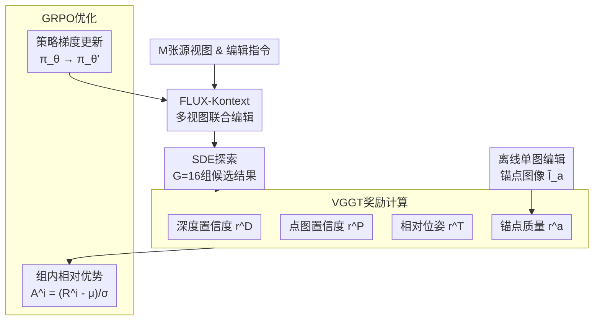

# Edit in 2D, Verify in 3D: Reinforcement Learning for Multi-view Consistent Scene Editing

**会议**: ECCV 2026  
**arXiv**: [2603.03143](https://arxiv.org/abs/2603.03143)  
**代码**: 将开源  
**领域**: 图像生成  
**关键词**: 3D场景编辑, 多视图一致性, 强化学习, VGGT, GRPO, FLUX-Kontext

## 一句话总结
RL3DEdit利用GRPO强化学习框架，以VGGT三维基础模型的置信度图和位姿预测作为几何感知奖励信号，无需成对3D编辑数据即可将FLUX-Kontext二维编辑器锚定到三维一致流形上，实现单遍推理的高效多视图一致3D场景编辑。

## 研究背景与动机

三维场景编辑在AR/VR和游戏等应用中扮演着关键角色，其核心挑战在于如何在灵活编辑语义内容的同时严格保证多视图之间的几何一致性。当前主流范式是"以2D编辑器为前端、以3D表示为后端"：先用2D扩散模型编辑多视角图像，再通过3D高斯泼溅（3DGS）重建出编辑后的三维场景。然而，现有方法在这一范式下各受掣肘——基于几何条件的方法（如Tinker）依赖源图像的深度图来引导一致性，从根本上无法处理涉及几何结构改变的编辑指令；基于迭代优化的方法（如IN2N、EditSplat）逐视角编辑再融合，不但效率低下（每场景耗时数分钟到数十分钟），而且不一致的编辑信号在3DGS中累积为模糊和伪影；基于注意力操作的方法（如DGE、VCEdit）依赖跨视角注意力特征投影来约束一致性，但在几何不连续区域仍会累积对齐误差。

这些困境背后有一个更深层的矛盾：严格的多视图一致性需要海量成对的三维一致编辑数据进行监督微调（SFT），而这类配对数据的构建成本极高、几乎不可获得。回顾2D图像编辑的发展历程，注意力操作同样曾是早期方案，最终被数据驱动的大规模SFT所取代——说明监督训练仍是保证一致性的最有效路径。但在3D领域这条路行不通。本文的核心洞察在于发现了一个重要的不对称性：生成三维一致的多视图图像虽然极其困难，但验证三维一致性却是相对容易的——判断多视角图像是否存在几何矛盾（如重影、结构错位）远比从零生成一致图像简单。这种"生成难、验证易"的内在不对称性恰恰使强化学习（RL）成为天然解决方案：不需要繁重的配对数据，只需要一个可靠的验证器来提供奖励信号。

基于这一洞察，本文提出RL3DEdit。该框架以GRPO为核心算法，以在大规模真实3D数据上预训练的VGGT作为三维一致性验证器，通过精心设计的几何感知复合奖励，在无需任何成对3D编辑数据的条件下优化FLUX-Kontext的三维一致性先验。**核心idea：利用GRPO强化学习框架，以VGGT三维基础模型的深度/点云置信度图与相对位姿预测构建几何复合奖励，同时引入锚点策略保护编辑保真度，驱动2D编辑器在保持自身高质量编辑能力的同时收敛到三维一致流形上，仅用少量训练数据（8场景70提示）即实现单遍推理的高效3D场景编辑。**

## 方法详解

### 整体框架

RL3DEdit的核心思路是"2D中编辑、3D中验证"。训练阶段，对给定场景的M张多视角渲染图（M=9），FLUX-Kontext在编辑指令下通过SDE噪声注入探索G=16组候选多视图编辑结果；每组候选结果由VGGT评估三维一致性和编辑保真度（计算深度置信度、点图置信度、相对位姿对齐和锚点质量四个奖励分量），得到复合奖励后通过GRPO计算组内相对优势来更新策略，使模型逐渐学习三维一致性先验。推理阶段则极为简洁：微调后的FLUX-Kontext对输入多视图进行一次前向传播即生成多视图一致的编辑结果，随后经3DGS重建得到最终编辑好的三维场景——无需逐场景/逐提示的迭代优化。

### 关键设计

**1. 多视图联合编辑：RL优化的必要前提**

GRPO的优化依赖于对候选输出的"探索→奖励→强化"循环。如果2D编辑器对每张视图独立处理（如InstructPix2Pix），G组M张视图几乎不可能自然产生任何三维一致的结果——RL就没有成功样本可供强化，优化必然失败。因此，多视图联合编辑能力是RL是否能奏效的必要前提。本文采用FLUX-Kontext作为基座编辑器：它的DiT架构将所有输入视图的token沿序列维度拼接为 $X=\text{Concat}(x^1,\dots,x^K)$，全局自注意力机制使得每张视图的生成过程都能通过注意力权重分布获取其他视图的信息，实现隐式的跨视图交互。这种架构特性使得RL有机会从候选样本中筛选出三维一致的输出并予以强化——让模型"看到"一致性好的结果长什么样，是整个方法得以运转的基石。相比之下，InstructPix2Pix的低分辨率局部卷积操作无法支持这种跨图像交互。

**2. VGGT三维基础模型：一致性验证器的关键选择**

有了RL框架和合适的编辑器，核心问题就是如何鲁棒地验证编辑结果的三维一致性。本文的关键洞察是：受SDS（Score Distillation Sampling）启发——SDS利用在高质量图像上预训练的Stable Diffusion来监督图像质量——在三维领域可以类比地利用在大规模真实三维数据上预训练的VGGT来评估多视图一致性。VGGT的独特之处在于它在训练中同时预测每个像素的置信度图来衡量预测的不确定性。实证分析发现一个关键的线性关系：逐步用编辑后的视图替换原始视图、破坏一致性时，VGGT预测的平均深度置信度与一致性退化程度几乎呈线性负相关（替换越多、置信度越低）。这意味着VGGT的置信度图可以直接作为三维一致性的量化奖励信号。

相比传统的验证器（重投影warping和SfM），VGGT具有决定性优势：SfM依赖手工特征匹配，RL策略可以通过生成无纹理图像来"欺骗"它获得高奖励；重投影损失同样会被模糊图像轻易最小化。而VGGT学习的是真实世界的隐式先验——模糊、无纹理或变形的输入会产生更低的置信度，因此它天然地同时约束了几何一致性和图像质量，从根本上避免了奖励欺骗问题。

**3. 锚点策略：在优化一致性中保护编辑保真度**

RL优化有一个危险倾向：模型会自发偏好"更容易实现一致性"的低频平滑解，这会严重牺牲FLUX-Kontext原有的高质量编辑能力。为此，本文设计了一个简洁而巧妙的锚点策略：训练前先用FLUX-Kontext对所有视图做一次独立单图编辑，得到一组彼此三维不一致但每张单图编辑质量很高的结果集 $\tilde{I}$。训练时，随机选择一张视图作为锚点 $a$，将其在候选结果中的对应视图 $I'_a$ 替换为锚点图像 $\tilde{I}_a$ 后再送入VGGT计算几何一致性奖励；同时用LPIPS感知距离衡量锚点视图自身的编辑质量损失 $r^a = \exp(-\lambda \mathcal{L}_{\text{LPIPS}}(I'_a, \tilde{I}_a))$。这个设计一石二鸟：被替换的锚点视图持续向高质量编辑方向优化（受 $r^a$ 约束），而其他视图则被推动与这个高质量锚点保持三维一致——最终所有视图同时收敛到正确的语义和细节上，既保证了一致性、又捍卫了编辑保真度。

### 损失函数 / 训练策略

整体复合奖励为四个分量等权求和：$R^i = 0.25(r^D + r^P + r^T + r^a)$。GRPO的组大小G=16，采用SDE将确定性Flow-ODE转化为随机微分方程以增强探索多样性（噪声水平0.8，12步去噪——相比2D编辑RL的6步，3D一致性要求更高的图像保真度）。为加速收敛引入了MixGRPO（窗口大小4）。模型以FLUX-Kontext-dev为基座，采用LoRA微调（rank=32, alpha=32），通过KL散度惩罚 $\beta D_{\text{KL}}(\pi_\theta \| \pi_{\text{ref}})$ 约束策略更新幅度，防止模型偏离原始2D编辑能力。训练数据极为精简：仅8个场景、70条VLM生成的编辑提示、共1319个样本，在单张RTX Pro 6000 GPU上训练1个epoch（42小时）。

## 实验关键数据

### 主实验

| 方法 | VIEScore↑ | CLIP-dir↑ | Ph-Loss↓ | 平均编辑时间↓ |
|------|-----------|------------|----------|---------------|
| DGE | 2.81 | 0.116 | 0.086 | 4min |
| GaussCtrl | 2.37 | 0.096 | 0.077 | 12min |
| EditSplat | 2.72 | 0.121 | 0.081 | 3.5min |
| EditSplat w/ FLUX-Kontext | 3.23 | 0.125 | 0.082 | 40min |
| **RL3DEdit (本文)** | **5.48** | **0.147** | **0.076** | **1.5min** |

在100个测试用例（70个新视角 + 16个未见指令 + 14个新场景）上，RL3DEdit在所有指标上全面领先。VIEScore（VLM评估的编辑质量与语义对齐）达到5.48，远超第二名的3.23；Ph-Loss（重投影损失，衡量三维一致性）最低；编辑时间仅1.5分钟，是同类FLUX方案（40min）的20倍以上。用户偏好率在分布内场景达71.4%、零样本场景达60.0%，均大幅领先。

### 消融实验

| 配置 | VIEScore↑ | Ph-Loss↓ | 说明 |
|------|-----------|----------|------|
| Full model (面部数据) | 5.26 | 0.077 | 标准配置 |
| w/o (r^D, r^P) | 2.11 | 0.193 | 去掉几何一致性奖励后出现严重重影伪影 |
| w/o r^T | 4.77 | 0.131 | 缺少相对位姿约束，视角出现微小偏移 |
| w/o r^a | 4.34 | 0.091 | 无锚点约束，结果趋向过平滑 |
| 替换为SfM奖励 | 0.97 | 0.201 | SfM被奖励欺骗，生成无纹理图 |
| 替换为Warp奖励 | 1.41 | 0.065 | 重投影被奖励欺骗，输出严重模糊 |
| 扩展至Qwen-Image-Edit | 5.43 | 0.079 | 框架可平滑迁移至更强2D编辑器 |

### 关键发现
- **三维一致性奖励（r^D+r^P）是最关键的组件**：移除后VIEScore从5.26骤降至2.11，Ph-Loss翻倍至0.193，产生严重重影——几何一致性是多视图编辑的根基保障
- **传统验证器极易被奖励欺骗**：SfM偏好无纹理图（VIEScore仅0.97）、重投影warping偏好模糊图（Ph-Loss看似最低但视觉极差），而VGGT的数据驱动先验从根本上阻断了两类reward-hacking路径
- **奖励权重平衡至关重要**：几何偏重（w_D+w_P=0.8）牺牲语义丰富度（4.31），质量偏重（w_a=0.7）导致多视图不一致（Ph-Loss 0.091），等权是最优配置
- **RL框架具有跨编辑器迁移性**：用Qwen-Image-Edit替换FLUX-Kontext同样取得优秀结果（VIEScore 5.43），说明该范式不绑定特定2D编辑器架构

## 亮点与洞察
- **"生成难、验证易"的问题框架转换**：将三维一致性的瓶颈从"数据驱动的生成"巧妙转换为"可验证的优化"，绕过了数据稀缺瓶颈。这一洞察可以迁移到其他"生成费力、验证轻松"的视觉任务（如视频一致性、多视角渲染）
- **VGGT置信度图的再发现**：论文发现VGGT原本用于误差容忍的置信度图与三维一致性衰退近乎线性相关——这是"已有能力的跨领域重新定位"的典范，说明精心设计的实证分析能从现有模型中挖掘出意料之外的价值
- **锚点策略的设计精巧**：用离线单图编辑结果作为锚点，通过"替换+LPIPS"在单次前向中同时评估几何一致性和编辑保真度，无需额外分支或辅助网络。这种"用已有信息间接约束任务冲突"的思路值得借鉴
- **极低的数据需求**：仅8场景、70提示、1319样本就能习得泛化的三维一致性先验，展现了RL相比SFT在数据效率上的数量级优势——这是该方法最具实用价值的特点

## 局限与展望
- **2D编辑器自身限制**：多视图共享token容量导致视角数量与分辨率之间存在取舍。未来可借助流式/因果注意力机制覆盖更多视角
- **大幅非刚性形变仍具挑战**：对"低头""张嘴"等动作幅度模糊的指令，微小的多视图不一致仍会破坏3DGS重建质量。目前所有baseline在此类场景上也同样失败
- **GRPO训练计算开销大**：每组16候选×12步去噪，当前配置下训练约需2天。探索更高效的RL策略（更小的群组、更少的去噪步数）或蒸馏方法值得尝试
- **高度受限的训练规模**：1个epoch、8个场景的规模虽已展示强大能力，但更大规模的数据和训练周期几乎必然能进一步提升泛化性和鲁棒性

## 相关工作与启发
- **vs IN2N/EditSplat（迭代优化方法）**：它们交替进行单图编辑和3D优化，缺乏跨视图信息导致一致性差且耗时。本文用RL+3D验证器实现了单遍推理，速度提升2-20倍
- **vs DGE/VCEdit（注意力操作方法）**：它们通过跨视图注意力特征传播/投影约束一致性，但累积对齐误差。本文用VGGT做直接的三维几何验证，约束更强、更鲁棒
- **vs Flow-GRPO（2D RL编辑方法）**：2D RL编辑只需验证单图质量，本文将其推广到3D场景，新增了几何一致性奖励和锚点策略，并发现3D场景需要更多去噪步数（12步而非6步）
- **vs SDS（DreamFusion）**：SDS用2D扩散模型评估图像质量，本文类比地用3D基础模型VGGT评估三维一致性——这是"SDS式验证"在三维维度上的自然延拓

## 评分
- 新颖性: ⭐⭐⭐⭐⭐ [首次将RL引入3D场景编辑，"生成难、验证易"的洞察深刻，VGGT置信度作为奖励的转化巧妙]
- 实验充分度: ⭐⭐⭐⭐⭐ [100例测试+系统消融+用户研究+零样本泛化+跨编辑器迁移，消融实验清晰量化了各组件的贡献]
- 写作质量: ⭐⭐⭐⭐ [动机清晰、技术细节充分，但附录存在部分重复内容；图5的置信度分析直观且有力]
- 价值: ⭐⭐⭐⭐⭐ [为3D场景编辑的数据稀缺问题提供了一个切实可行且高效的新范式，框架可迁移性强，实用价值高]

<!-- RELATED:START -->

## 相关论文

- [\[CVPR 2026\] InstructMix2Mix: Consistent Sparse-View Editing Through Multi-View Model Personalization](../../CVPR2026/image_generation/instructmix2mix_consistent_sparse-view_editing_through_multi-view_model_personal.md)
- [\[CVPR 2026\] Leveraging Verifier-Based Reinforcement Learning in Image Editing](../../CVPR2026/image_generation/leveraging_verifier-based_reinforcement_learning_in_image_editing.md)
- [\[CVPR 2026\] ScenDi: 3D-to-2D Scene Diffusion Cascades for Urban Generation](../../CVPR2026/image_generation/scendi_3d-to-2d_scene_diffusion_cascades_for_urban_generation.md)
- [\[ICML 2026\] CoCoEdit: Content-Consistent Image Editing via Region Regularized Reinforcement Learning](../../ICML2026/image_generation/cocoedit_content-consistent_image_editing_via_region_regularized_reinforcement_l.md)
- [\[ECCV 2026\] Curvature-Adaptive Consistency Flow Matching: Autonomous Trajectory Optimization via Reinforcement Learning](curvature-adaptive_consistency_flow_matching_autonomous_trajectory_optimization_.md)

<!-- RELATED:END -->
