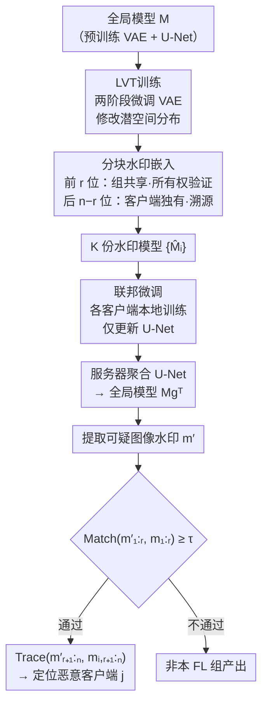

# FedOT: Ownership Verification and Leakage Tracing via Watermarks for Federated LDMs

**会议**: ECCV 2026  
**arXiv**: [2606.22875](https://arxiv.org/abs/2606.22875)  
**代码**: 有（项目页 [https://spyzixuan.github.io/FedOT/](https://spyzixuan.github.io/FedOT/)）  
**领域**: 图像生成（潜扩散模型）  
**关键词**: 联邦学习, 潜扩散模型, 数字水印, 所有权验证, 模型泄露溯源, VAE替换攻击

## 一句话总结

FedOT 提出在联邦潜扩散模型训练中嵌入分块水印并结合潜向量变换（LVT），首次同时实现所有权验证和恶意客户端溯源，即使攻击者替换带水印的 VAE 也无法去除水印而不严重损伤生成质量。

## 研究背景与动机

联邦潜扩散模型（FedLDMs）将联邦学习的隐私保护优势与潜扩散模型的强大生成能力相结合，允许分布式客户端在不共享原始数据的情况下协同微调 Stable Diffusion 这类模型。在典型的联邦训练流程中，每个客户端只上传 U-Net 参数的更新，VAE 始终保持冻结——这种设计降低了通信开销，但也引入了一个严重的知识产权漏洞：全局模型需要在所有参与客户端之间共享，任何恶意客户端都可以将训练好的模型私自泄露、分发甚至转售，而模型的原始拥有者既无法证明该模型的归属，也无法追溯到具体是哪个客户端干的。

现有方案面临两个核心挑战。其一，已有的 FL 版权保护方法（如 FedTracker、WAFFLE）仅针对分类任务设计，其算法结构天然不适用于生成式模型。其二，VAE-based 水印方法（如 Stable Signature）虽然可以嵌入水印来验证所有权，但在 FL 场景下存在根本性弱点——由于 VAE 在微调中全程冻结，攻击者可以零成本地将带水印的 VAE 替换为一个公开的干净 VAE 解码器，生成质量几乎不受影响，但水印被彻底移除。这意味着仅靠 VAE 水印无法防止替换攻击，更无法实现按客户端溯源。

本文的核心 idea 是**将水印编码为「所有权验证 + 客户端标识」的分块比特串，并通过潜向量变换（LVT）迫使 U-Net 适应一个被修改过的 VAE 潜空间，使 VAE 和 U-Net 之间形成强依赖关系**——任何替换 VAE 的尝试都会导致生成质量严重退化，从而在威慑恶意客户端的同时，实现从所有权验证到恶意客户端溯源的全链路保护。

## 方法详解

### 整体框架

FedOT 的整体流水线包含三个阶段。首先，可信服务器在全局 VAE 上执行潜向量变换（LVT）训练，修改 VAE 编码器/解码器的潜空间分布。随后，服务器基于变换后的模型拷贝出 K 份副本，为每份的 VAE 解码器嵌入一个唯一的 n 比特分块水印（前 r 位共享用于所有权验证，后 n−r 位客户端独有用于溯源），将其分发给 K 个客户端。最后，客户端在本地用私有数据微调各自的模型（仅更新 U-Net 参数），各轮次上传 U-Net 聚合再下发；训练完成后，服务器通过水印提取器从可疑图像中提取水印，先验证所有权（前 r 位匹配度是否超过阈值），再溯源到具体客户端（后 n−r 位与各客户端记录比对的 argmax）。

### 关键设计

**1. 分块水印：让所有权验证和客户端溯源在一组编码中共存**

「验证归属」和「追溯泄露源」是两个不同的需求，但现有 VAE 水印方法只支持前者。FedOT 把一个 n 比特水印拆成两段：前 r 比特是全局共享的固定模式，用来确认模型是否来自本 FL 组（所有权验证）；后 n−r 比特是每个客户端独有的编码，用来在确认归属后再精准定位是哪个客户端泄露了模型。验证时先检查前缀的位匹配度是否超过阈值 τ——只有通过所有权验证才进行完整溯源匹配，避免在大规模部署中对每张图片都做全量比对。客户端独有后缀的生成采用 Hamming Distance 最大化策略（用遗传算法近似优化），确保不同客户端之间的溯源编码足够分散，降低误判概率。实验显示即使在 10³ 个客户端下碰撞概率仍为 0%。

**2. 潜向量变换（LVT）：让 VAE 与 U-Net 形成「换掉 VAE 就毁掉生成」的强绑定**

VAE 水印方案的根本弱点在于 VAE 在联邦训练中全程冻结，攻击者替换 VAE 解码器几乎零代价。FedOT 的核心洞察是：U-Net 在训练中会逐渐适应 VAE 编码器输出的潜空间分布——因此如果把 VAE 的潜空间主动改掉，然后让联邦训练中的 U-Net 去适应这个新分布，那么已经习惯了新潜空间的 U-Net 就再也无法与原始 VAE 正常配合。LVT 分两阶段微调 VAE。第一阶段冻结解码器，仅训练编码器学习一个确定性的变换 T 使潜向量 z 变为 z′；第二阶段冻结编码器，训练解码器从已变换的潜空间 z* 中重建图像（等价于学习逆变换 T⁻¹）。经过这样的两阶段训练，编码器和解码器都依赖于新潜空间，而后续的联邦 U-Net 训练又基于被修改过的 VAE，三者形成耦合：任何替换 VAE 的行为都会因潜空间不匹配而导致生成质量灾难性下降。

**3. 三类 LVT 策略的系统化筛选：负片变换是最优折中**

LVT 的设计难点在于「变换必须足够强」以破坏与原始 VAE 的兼容性，但又「不能太强」以至于连联邦训练中 U-Net 都学不好。作者系统探索了三种确定性策略。平移变换（z′ = z + c）将潜向量整体平移一个常量，能产生很强的绑定效果（c=11 时替换攻击后 FID 暴涨至 92.497），但会导致图像全局色偏。镜像变换（z′ = −z）对称翻转潜空间，绑定能力中等（FID +49），但语义一致性严重受损（CLIP-Score 下降 0.064）。最佳选择是负片变换：对像素域做 x⁻ = 1 − x，迫使 VAE 学习将正片输入映射到负片对应的潜空间。由于像素级变换保留了输入数据流形的拓扑结构，高频细节损失最小，生成质量仅小幅下降（FID 20.367 vs 原始 SD 的 22.99），同时替换攻击后 FID 升至 40.537（+20.170），CLIP-Score 仅降 0.023——绑定性、生成质量、语义一致性三者达到最佳平衡。

### 一个完整示例

假设场景中有 5 个客户端（K=5），水印总长 48 位（n=48），前缀 16 位用于所有权验证（r=16）。服务器先用 COCO 数据集对 VAE 执行负片变换 LVT 训练（约 24h/4×RTX 4090），然后为每个客户端生成一个 48 位水印：前 16 位五份相同（如 1010101010101010），后 32 位各自不同（经 Hamming 距离优化确保客户端间最大区分度）。将这 5 份带水印的 VAE 解码器安回模型分发给各客户端。每个客户端在 LAION-10K 子集上本地微调 15 轮（约 7.5h/GPU），只更新 U-Net，VAE 保持冻结。想象此时客户端 3 将训练好的模型私自泄露到第三方。当第三方用该模型生成图像时，服务器提取图像中的 48 位水印：先比对前 16 位，匹配度 0.96 > 阈值 0.69（FPR 仅 0.1%），确认图像来自本 FL 组；再拿后 32 位与 5 个客户端的水印后缀比对，发现与客户端 3 的位匹配度最高——锁定了泄露源。如果第三方试图把带水印的 VAE 解码器换成标准 Stable Diffusion V2.1 的干净解码器来抹除水印，由于 LVT 已迫使 U-Net 适应了负片变换后的潜空间，切换后生成的图像质量会降到 FID 40.537，基本不可用。

### 损失函数 / 训练策略

水印嵌入损失包含两项：二值交叉熵损失（ℒₘ）确保提取到的水印准确，Watson-VGG 感知损失（ℒᵢ）维持图像质量，总损失 ℒ_w = ℒₘ + λᵢ·ℒᵢ（λᵢ = 0.2）。VAE 的 LVT 训练采用标准的 VAE 损失组合：MSE 重建损失 + VGG 感知损失 + 极小权重（λ_K L = 10⁻⁸）的 KL 散度 + 自适应加权的对抗生成损失。联邦训练使用 FedAvg 聚合策略，每轮只聚合 U-Net 参数，VAE 和文本编码器全程冻结。实验观察到 FID 和 CLIP-Score 在约 15 轮时达到最优，继续训练反而退化。

## 实验关键数据

### 主实验

在 COCO2017（LVT/水印训练）+ LAION-10K（联邦微调）验证集上，FedOTneg 在 VAE 替换攻击前后的表现与基线对比：

| 方法 | 攻击前 FID↓ | 攻击前 CLIP↑ | 攻击前检测率↑ | 攻击后 FID↑ | 攻击后检测率↑ | 攻击后位准确率↑ |
|------|------------|-------------|-------------|------------|-------------|---------------|
| Original SD | 22.99 | 0.316 | – | – | – | – |
| Stable Signature* | 16.412 | 0.314 | **0.994** | 16.282 (-0.130) | **0.000** | 0.543 |
| FedOTw/o LVT | 16.687 | 0.313 | **0.998** | 17.054 (+0.367) | **0.000** | 0.494 |
| FedOTneg | 20.367 | 0.295 | 0.954 | **40.537** (+20.170) | **0.000** | 0.524 |
| FedOTtran (c=11) | 22.427 | 0.301 | 0.988 | **92.497** (+70.070) | **0.000** | 0.475 |
| FedOTmir | 21.475 | 0.293 | 0.962 | **70.622** (+49.147) | **0.000** | 0.522 |

Stable Signature* 和 FedOTw/o LVT 在替换攻击后检测率降为 0（水印完全移除）、FID 几乎没有变化，而 FedOT 三类 LVT 策略均使 FID 大幅恶化至不可用。

### 消融实验

| 配置 | 所有权检测率↑ | 溯源检测率↑ | 说明 |
|------|-------------|-------------|------|
| FedOTneg (r=8) | 0.944 | 0.957 | 前缀短：所有权弱但溯源强 |
| FedOTneg (r=16) | **0.960** | **0.932** | 最优折中（默认配置） |
| FedOTneg (r=24) | 0.958 | 0.928 | 前缀长：溯源弱 |
| λᵢ=0.05 | 位准确率 0.965 | PSNR 29.842 | 水印强但图像质量损失大 |
| λᵢ=0.8 | 位准确率 0.906 | PSNR 34.793 | 图像质量好但水印弱 |

### 关键发现

- **负片变换是最优策略**：在三类 LVT 中，FedOTneg 同时实现了最好的生成质量（FID 20.367）和足够的防御力（替换攻击后 +20.17 FID），且 CLIP-Score 下降最小（仅 0.023），说明像素域变换保留了更好的语义结构。
- **LVT 的绑定强度与生成质量存在根本性权衡**：平移系数 c 从 2 增大到 11，防御力递增但生成质量递减；c=2 时替换攻击后 FID 反而改善（−1.424），说明过小的变换不能形成有效绑定。
- **LVT 对抗净化攻击同样有效**：即使用干净数据对模型进行 300 轮净化微调，FedOT 三类变体的 FID 仍从 <22 升至 >26，说明水印无法在不牺牲质量的前提下被清洗。
- **共谋攻击下所有权水印依然顽强**：多个恶意客户端平均其 VAE 参数后，溯源位准确率大幅下降（0.905→0.584），但所有权位准确率几乎不变（0.936→0.961），因为所有权前缀在所有客户端间共享，平均反而增强了信号。

## 亮点与洞察

- **分块水印的设计精巧之处在于「先验后溯」的层级验证**：前 r 位共享、后 n−r 位独有，既降低了溯源的计算开销（不需要每次匹配所有客户端），又天然对共谋攻击有鲁棒性（共享位无法被平均抹除），这个结构本身就嵌入了安全属性。
- **LVT 的核心洞见「改潜空间而不是改水印算法」非常巧妙**：传统思路是在水印算法本身上加鲁棒性，而 FedOT 直接把 VAE 的潜空间改了，让 U-Net 在训练中「长」到新的空间上——这是一种工程思维层面的范式转换，从「防破解」变成「让破解行为自身产生不可接受的代价」，且不依赖任何加密假设。
- **负片策略与其他两类策略的对比揭示了「数据流形拓扑保持」的重要性**：平移和镜像修改的是潜空间中的数值分布，而负片修改的是输入像素域的语义翻转，保留了点之间的相对结构关系——这解释了为什么只有负片能兼顾防御力和生成质量，这个原理可以迁移到任何需要分布偏移但又想保持生成质量的场景。

## 局限与展望

- **水印引入本身会轻微降低生成质量**：即使最优的 FedOTneg，攻击前的 FID（20.367）也比不带水印的 Stable Signature*（16.412）高不少，说明 LVT 改潜空间是有代价的。这对于对生成质量极为敏感的部署场景（如医学图像生成）可能难以接受。
- **VAE 存储开销随客户端数线性增长**：每维护一个客户端就要存一份约 335MB 带独有水印的 VAE 解码器，扩展到百万级客户端时存储成本巨大；虽然作者引用 Stable Signature 的论点说明水印在 10⁷ 用户下仍有效，但存储本身的工程实现尚未讨论。
- **水印对图像级攻击（JPEG、裁剪、调亮度）的鲁棒性弱于基线**：FedOTneg 在综合攻击下位准确率降至 0.778，虽然仍可用但不如 Stable Signature*（0.853），对于需要极端鲁棒性的场景（如社交媒体自动检测），可能需要额外设计纠错码或更鲁棒的水印提取器。

## 相关工作与启发

- **vs Stable Signature [Fernandez et al., 2023]**：两者都基于 VAE 解码器水印。Stable Signature 面向集中式训练，不支持溯源，且 VAE 可被零成本替换。FedOT 增加分块水印实现溯源 + LVT 绑定组件来防止替换攻击，代价是生成质量略降。
- **vs FedTracker [Zheng et al., 2022]**：FedTracker 首次实现了 FL 中按客户端溯源，但仅限于分类模型、依赖分类器结构设计。FedOT 将溯源能力拓展到生成式潜扩散模型，且通过潜空间变换实现了对「替换式去水印」的防御。
- **vs WAFFLE [Bieringer et al., 2023]**：WAFFLE 在 FL 分类模型上做服务端水印嵌入，只做所有权验证。FedOT 在生成模型上同时做所有权验证和溯源，且专为 VAE+U-Net 架构设计了 LVT 绑定机制。

## 评分

- 新颖性: ⭐⭐⭐⭐ 将 FL 版权保护从分类模型扩展到生成模型是自然的延伸，但分块水印+潜空间变换的技术组合本身有不错的原创性——尤其是「改潜空间代替改水印算法」这个逆向思维。
- 实验充分度: ⭐⭐⭐⭐⭐ 三类 LVT 策略全方位对比（攻击前/攻击后/净化攻击/共谋攻击/恢复攻击/图像级攻击），消融了平移系数、权重系数、前缀长度等关键超参，还做了 Flickr30K 跨数据集验证和端到端溯源准确率，非常扎实。
- 写作质量: ⭐⭐⭐⭐ 动机清楚、方法流程逻辑严密、实验组织有条理。Table 1 把攻击前后放在同一张表内对比的设计很好（一眼看出哪些方法被攻破了）。不足是 some 附录里的推导可以更紧凑。
- 价值: ⭐⭐⭐⭐ 联邦扩散模型在隐私数据场景（医疗、金融图像生成）中很可能是刚需，而 FedOT 解决了这类场景中模型被泄露后「无法证明、无法溯源」的根本困局，实用价值明确。

<!-- RELATED:START -->

## 相关论文

- [\[ICLR 2026\] Verification of the Implicit World Model in a Generative Model via Adversarial Sequences](../../ICLR2026/image_generation/verification_of_the_implicit_world_model_in_a_generative_model_via_adversarial_s.md)
- [\[ICLR 2026\] Bridging Generalization Gap of Heterogeneous Federated Clients Using Generative Models](../../ICLR2026/image_generation/bridging_generalization_gap_of_heterogeneous_federated_clients_using_generative_.md)
- [\[ICLR 2026\] SMOTE and Mirrors: Exposing Privacy Leakage from Synthetic Minority Oversampling](../../ICLR2026/image_generation/smote_and_mirrors_exposing_privacy_leakage_from_synthetic_minority_oversampling.md)
- [\[NeurIPS 2025\] WMCopier: Forging Invisible Image Watermarks on Arbitrary Images](../../NeurIPS2025/image_generation/wmcopier_forging_invisible_image_watermarks_on_arbitrary_images.md)
- [\[ICCV 2025\] FedDifRC: Unlocking the Potential of Text-to-Image Diffusion Models in Heterogeneous Federated Learning](../../ICCV2025/image_generation/feddifrc_unlocking_the_potential_of_text-to-image_diffusion_models_in_heterogene.md)

<!-- RELATED:END -->
