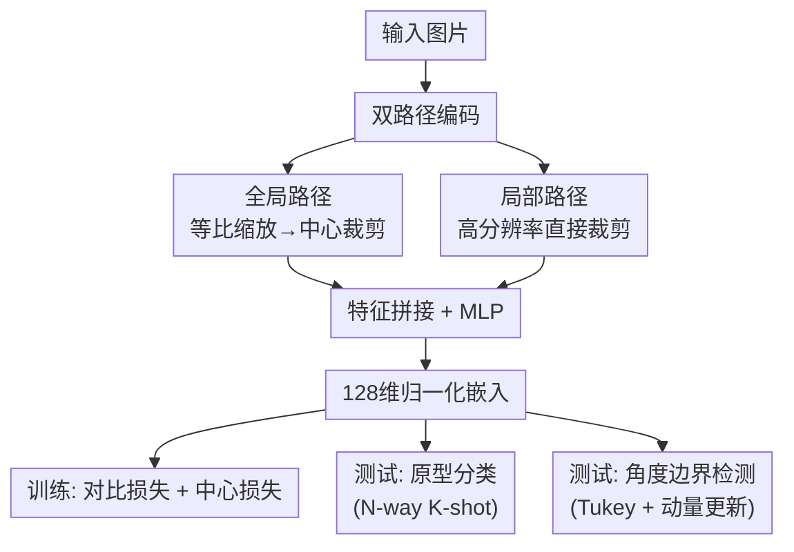

# Few-Shot Synthetic Image Attribution: Identifying Unseen Generators with Limited Samples

**会议**: ECCV 2026  
**arXiv**: [2509.25682](https://arxiv.org/abs/2509.25682)  
**代码**: [https://github.com/teheperinko541/OmniDFA](https://github.com/teheperinko541/OmniDFA)  
**领域**: 图像生成  
**关键词**: 合成图像溯源, 少样本学习, 对比学习, AI生成图像检测, 开放集分类

## 一句话总结
本文定义了一个全新的「少样本合成图像溯源」任务——用每类仅 10 张参考图就能识别训练时未见过的图像生成器，并构建了含 45 个独立生成器（无 PEFT 变体）的 OmniFake 数据集和双路径对比学习基线 OmniDFA，在溯源与检测上均显著超越前人。

## 研究背景与动机

AI 生成图像（AIGI）已经跨过了「能否分辨真伪」的阶段。当前更紧迫的问题是：给定一张假图，能否说清它是哪个生成模型产的？这对舆论溯源、模型漏洞分析、司法取证都至关重要。现有的图像溯源方法大致分两类：闭集方法（如 DNA-Det、CPL）只能识别训练时见过的生成器，遇到新生成器必须重新训练；开集方法则把所有未见过的生成器统归为「未知」类——本质上只解决了「是否认得出」，不能回答「是谁干的」。随着 Midjourney V6、FLUX、Janus-Pro、Hunyuan-DiT 等新模型日新月异，这两种范式在实际部署中都不可持续：每次新模型出现就重训整个网络既不现实也不经济。

核心矛盾在于：溯源需要区分远比「真 / 假」更细粒度的类别边界——每个生成器都有独特的痕迹模式（artifact pattern），但新生成器层出不穷，不可能在训练时穷举。理想的能力是：给模型几张新生成器的样图，它就能在测试时迅速定位该生成器的特征，无需再训练就能认出同类图片。这正是少样本学习的优势场景。然而现有 AIGI 数据集要么类别太少（GenImage 仅 8 类，且含同质化变体），要么优先服务于检测而非溯源，缺乏为多类溯源精心设计的、类别间结构互异的标注资源。

**核心 idea：将合成图像溯源形式化为开放集下的 N-way K-shot 少样本分类问题，训练时用监督对比学习拉近同类生成器的特征、用中心损失约束真实图像紧密聚簇，测试时仅凭每类 10 张支持样本即可识别未见过的生成器。**

## 方法详解

### 整体框架

OmniDFA 的流程分为两个阶段。训练阶段，每张输入图片经过双路径编码器（低层局部裁剪 + 高层全局缩放）提取互补特征，拼接后经 MLP 投影为 128 维归一化嵌入，在监督对比损失和球面中心损失的联合约束下优化：对比损失拉近同类生成器嵌入、推开异类；中心损失单独将真实图像聚向一个可学习的球面中心。测试阶段的溯源使用原型分类：从 N 个未见生成器的 K 张支持样本中计算每类的原型中心，查询样本按到各原型的最小距离溯源；检测则通过一个基于 Tukey 法 + 动量更新的自适应角度边界来判断——落在真实中心边界内的判为真，超出则判为假。

### 关键设计

**1. 双路径特征提取：兼顾全局结构与局部痕迹**

高分辨率 AIGI 图片中的检测线索可能存在于不同尺度上：全局构图风格和白平衡属于高层语义信息，而像素级混叠伪影、块边界不连续等 artifact 往往只出现在局部高分辨率区域。现有方法按固定分辨率缩放输入，要么丢失全局结构，要么压碎局部细节。OmniDFA 用两条互补路径来解决：全局路径将短边缩放至 224 像素后中心裁剪，保留画面整体的布局和语义；局部路径直接在原图上做高分辨率裁剪，最大限度保持纹理级 artifact 的完整性。两条路的特征在通道维度拼接后经 MLP 投影为 128 维嵌入。消融显示双路比任意单路在溯源准确率上高出 5-8%，验证了多尺度融合的必要性。

**2. 监督对比学习 + 球面中心损失：联合优化溯源与检测**

少样本溯源的难点在于：不同生成器的痕迹既细微又高度重叠，仅靠交叉熵难以学到足够可分的嵌入。OmniDFA 采用监督对比损失，在一个 batch 内对同生成器的样本拉近（余弦相似度高）、异生成器推开。这个损失天然适合多类场景——它不依赖固定分类层，所以测试时可以无缝接入未见过的类别。对比损失单独已足够做溯源，但面对海量真实图片（训练集中真实与假图各一半）会导致真实类在嵌入空间中过于分散，检测时难以界定边界。因此引入球面中心损失：为真实类维护一个 L2 归一化的可学习中心向量，约束所有真实图片的嵌入靠近该中心。两者联合构成最终损失 $\mathcal{L} = \mathcal{L}_{sup} + \lambda \mathcal{L}_{cen}$。

**3. 自适应角度边界阈值：将溯源嵌入直接用于二分类**

常规做法是在特征提取器上加一个独立的二分类头做检测，但这会引入额外的参数量和训练耦合。OmniDFA 巧妙地复用了已学到的嵌入空间：真实图片在球面中心损失约束下紧密聚簇，那么任何真实图片到中心的角度应该在一个合理的上界之内。这个上界用 Tukey 法（箱线图四分位距法）从当前 batch 内真实图片的角度分布中估计：$\gamma_b = Q_3 + 1.5 \times IQR$。训练过程中通过动量更新 $\gamma \leftarrow \beta\gamma + (1-\beta)\gamma_b$ 平滑地调整全局边界，避免单 batch 统计波动导致过激裁切。测试时算查询嵌入与真实中心的夹角，小于 $\gamma$ 判为真、大于判为假。这个设计让同一个嵌入空间同时服务于溯源和检测，无需额外分类头。不足是在真实图片边缘样本上偶有保守误判（真实类 F-Acc 略低于主流检测器），但总体检测 AP 达 96.97%，显著超越前人。

### 损失函数 / 训练策略

监督对比损失
$$\mathcal{L}_{sup} = \sum_{i=1}^{N}\frac{-1}{|P(i)|}\sum_{p\in P(i)}\log\frac{e^{\mathbf{z}_i \cdot \mathbf{z}_p / \tau}}{\sum_{a \in P(i)\setminus\{p\}} e^{\mathbf{z}_i \cdot \mathbf{z}_a / \tau}}$$

球面中心损失
$$\mathcal{L}_{cen} = \frac{1}{|P_r|}\sum_{p \in P_r}(1 - \mathbf{z}_p \cdot \mathbf{c}_r)$$

联合损失 $\mathcal{L} = \mathcal{L}_{sup} + \lambda \mathcal{L}_{cen}$，温度 $\tau=0.07$，$\lambda=0.01$。使用 ConvNeXt-Small 作骨干，AdamW 优化器，8 卡 A100，batch size 1152（每卡 128 张假图 + 16 张真图），20 轮训练，余弦退火学习率调度。

## 实验关键数据

### 主实验

**少样本溯源（5-way / 15-way 10-shot）**：

| 方法 | 5-way Acc | 5-way Macro-F1 | 15-way Acc | 15-way Macro-F1 |
|------|-----------|----------------|-------------|-----------------|
| ComFor | 59.86 | 58.82 | 38.75 | 37.40 |
| FSD | 73.31 | 72.52 | 52.28 | 51.07 |
| **OmniDFA** | **75.34** | **74.45** | **53.54** | **51.74** |

**开放集检测（OmniFake 跨折平均）**：

| 方法 | Acc | AP |
|------|-----|-----|
| AIDE | 88.01 | 94.10 |
| ComFor | 89.75 | 93.13 |
| **OmniDFA** | **95.58** | **96.97** |

**跨数据集零样本检测**：

| 方法 | GenImage Avg Acc | Chameleon Acc | Chameleon F1 |
|------|------------------|---------------|--------------|
| PatchCraft | 90.32 | 55.70 | 2.62 |
| AIDE | 90.53 | 65.77 | 40.19 |
| **OmniDFA** | **95.86** | **83.48** | **80.09** |

### 消融实验

| 配置 | 5-way Acc / Detection Acc | 说明 |
|------|--------------------------|------|
| Full model | 75.34 / 95.58 | 完整双路 + 对比 + 中心损失 |
| w/o 局部分支 | ~67 / ~90 | 只用全局 resize，丢失局部 artifact |
| w/o 全局分支 | ~68 / ~89 | 只用局部裁剪，缺乏全局整合 |
| w/o 对比学习（二分类器） | ~45 / ~86 | 退化为普通分类，少样本溯源能力大幅下降 |
| w/o 中心损失 | 75.0 / ~92 | 溯源基本不变，但检测 AP 下降明显 |

### 关键发现

- 监督对比损失是少样本溯源能力的核心来源：去掉它退化为二分类器后 5-way 准确率从 75% 骤降至 45%。
- 支持样本数从 1-shot 到 10-shot 准确率提升最快（约 +20%），10-shot 之后收益递减——验证了「少量样本即可有效溯源」的设定合理性。
- 在 JPEG 压缩鲁棒性上，OmniDFA 在训练增强范围内表现稳定；超出范围后仍优于多数对比方法，但高斯模糊超范围时下降明显——说明需要更广泛的数据增强策略。
- 跨数据集零样本检测在 Chameleon 上超出第二名 17.71%，说明多生成器混合训练学到了真正通用的痕迹表征，而非过拟合到特定数据集风格。

## 亮点与洞察

- **任务定义好**：将「溯源」抽象为 N-way K-shot 开放集少样本分类，既有实际落地价值又有明确的技术指标，填补了 AIGI 检测和溯源之间的空白带。
- **数据集结构设计值得注意**：OmniFake 特意排除所有 PEFT / LoRA 变体，只保留架构本质不同的 45 个生成器——这保证了类别间差异是真的「痕迹不同」而非「参数微调」。这一设计理念反常识（通常数据集追求尽可能多），但在溯源评测中避免了同质化类别导致的虚假泛化。
- **回用嵌入空间做检测**：用 Tukey 法 + 动量更新从同一嵌入空间中派生检测边界，免去了额外分类头和对应的训练复杂度，是一个轻量且优雅的复用设计。
- **对比学习 + 中心损失的组合**：单独交对比学习擅长分离不同类但不在意类内紧致度，中心损失专为真实类补了紧致约束——两者分工明确，分别服务溯源和检测任务。

## 局限与展望

- 真实图像检测的准确率略低于假图检测（R-Acc ~94% vs F-Acc ~97%），作者归因于边界阈值对边缘样本的保守判决。未来可以研究更自适应的边界机制（如基于密度估计的动态边界）。
- 高斯模糊超出训练增强范围后性能下降显著，说明当前增强策略对模糊的覆盖不足。后续可纳入更强的模糊增强。
- 当前方法依赖 ConvNeXt-Small 骨干，更大的骨干（如 ViT-L）或许能进一步提升少样本泛化，但计算成本也会剧增。
- 数据集虽排除了 PEFT 变体，但实际应用中同一个基座模型的不同 finetune 也会产生图片，这些「同一家族」的细粒度区分仍是一个开放问题。

## 相关工作与启发

- **vs ComFor**: ComFor 在大规模扩散模型集上预训练后天然具备较好的特征提取能力，但受限于二分类框架，在少样本多类溯源中仍落后 OmniDFA 约 15%。
- **vs FSD**: FSD 也使用度量学习做开放集检测，但仅做二分类不做多类溯源；OmniDFA 的对比学习 + 双路特征在检测和溯源上均优于 FSD。
- **vs DNA-Det / CPL / UnivAttr**: 这些纯闭集 / 开集方法在少样本设置下表现不佳（~50% 5-way），因为它们针对已知类优化，缺乏对未知类的泛化机制。
- **vs AIDE / PatchCraft**: 传统检测器在 GenImage 这种类别较少的数据集上表现尚可，但 Chameleon 这类真实场景数据上严重偏斜（F1 低至 2-40%），而 OmniDFA 通过多生成器训练实现了更均衡的双向检测。

## 评分
- 新颖性: ⭐⭐⭐⭐ [任务层面创新——首次将少样本学习引入合成图像溯源，是最早定义和系统解决该问题的论文之一]
- 实验充分度: ⭐⭐⭐⭐⭐ [3 折交叉验证 × 2 种任务 × 跨数据集零样本 × 充分的消融，实验设计系统周密]
- 写作质量: ⭐⭐⭐⭐ [结构清晰，Motivation 有说服力，方法论和实验结果组织得当]
- 价值: ⭐⭐⭐⭐⭐ [为 AIGI 溯源提供了全新的范式、高质量开源数据集（45 个独立生成器）和强基线，对学术研究和实际部署都有重要推动意义]

<!-- RELATED:START -->

## 相关论文

- [\[ICML 2026\] Envisioning Beyond the Few: Disentangled Semantics and Primitives for Few-Shot Atypical Layout-to-Image Generation](../../ICML2026/image_generation/envisioning_beyond_the_few_disentangled_semantics_and_primitives_for_few-shot_at.md)
- [\[CVPR 2026\] Uni-DAD: Unified Distillation and Adaptation of Diffusion Models for Few-step Few-shot Image Generation](../../CVPR2026/image_generation/uni-dad_unified_distillation_and_adaptation_of_diffusion_models_for_few-step_few.md)
- [\[CVPR 2026\] Attribution as Retrieval: Model-Agnostic AI-Generated Image Attribution](../../CVPR2026/image_generation/attribution_as_retrieval_modelagnostic_aigenerated.md)
- [\[CVPR 2026\] Few-shot Acoustic Synthesis with Multimodal Flow Matching](../../CVPR2026/image_generation/few-shot_acoustic_synthesis_with_multimodal_flow_matching.md)
- [\[ECCV 2024\] DreamDrone: Text-to-Image Diffusion Models are Zero-shot Perpetual View Generators](../../ECCV2024/image_generation/dreamdrone_text-to-image_diffusion_models_are_zero-shot_perpetual_view_generator.md)

<!-- RELATED:END -->
