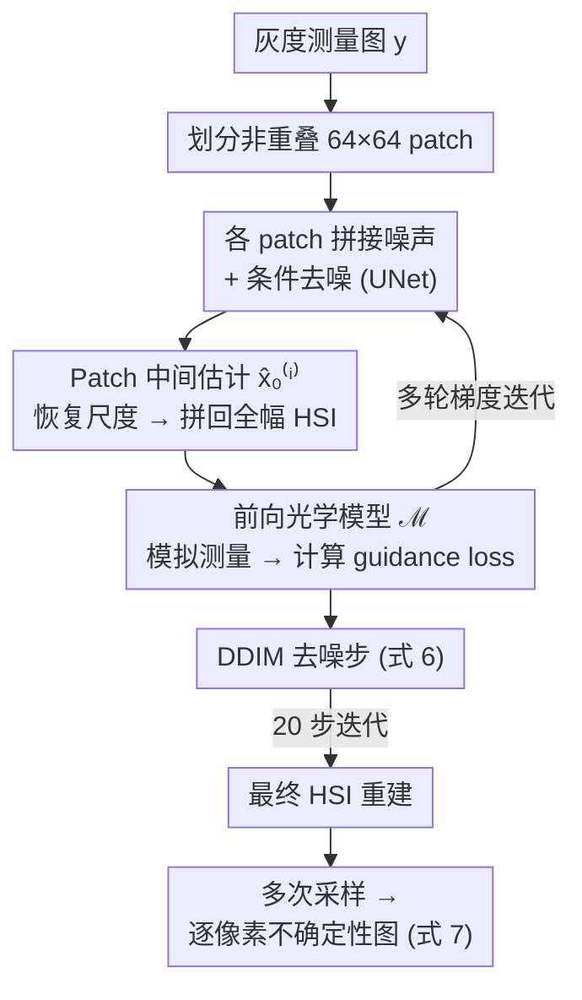

# 无滤波快照高光谱成像：基于引导Patch扩散模型

**会议**: ECCV 2026  
**arXiv**: [2412.02798](https://arxiv.org/abs/2412.02798)  
**代码**: 无  
**领域**: 图像生成 / 高光谱重建  
**关键词**: 高光谱成像, 无滤波快照, 扩散模型, 点扩散函数引导, 不确定性估计  

## 一句话总结

本文提出一种基于 patch 条件扩散模型的无滤波快照高光谱成像方法，仅用一片衍射透镜（metalens）加无滤波全色传感器拍摄单张灰度图，即可重建出 H×W×31 的高光谱图像；核心是在推理时通过光学点扩散函数（PSF）的物理一致性引导同步各 patch 预测，在 ARAD1K 上以 34.6 dB PSNR 超越此前最优方法近 2.9 dB，并能提供与重建误差高度相关（r=0.80）的逐像素不确定性估计。

## 研究背景与动机

**领域现状**：快照式高光谱相机在一次曝光中同时捕获场景空间和光谱信息，传统方案通常在光学端采用复杂多级透镜组、在传感器端使用彩色滤波阵列（CFA）或超分辨率传感器来缓解重建的病态性。然而，滤波阵列会丢弃大量入射光（例如拜耳滤波每个像素只捕获三个通道之一），复杂光学组件则增加了系统体积和成本。

**核心矛盾**：本文挑战一个更极端的设定——仅用一片平面衍射透镜（metalens）加无滤波的全色传感器，即 H×W 个像素的灰度测量图直接对应 H×W×31 的高光谱输出。这个设定极具吸引力：去掉滤波阵列大幅提升光通量，平面光学器件使系统极致紧凑。但重建问题极为病态——传感器只记录全波段强度的空间加权叠加，不同波长的信息被 PSF 以不同方式模糊和偏移后混叠。更棘手的是，PSF 的作用范围（kernel 大小）与重建 patch 大小相当，意味着每个测量 patch 内丢失了大量来自邻域的光谱信号，传统 patch 级方法在此设定下基本失效。

**核心 idea**：在推理时引入全局光学一致性引导——各 patch 先独立去噪、再拼成完整高光谱图像、通过前向光学模型与测量图计算物理一致性 loss，该 loss 的梯度回传到每个 patch 更新其潜变量。这一机制使得 patch 可以在保持局部学习优势（小样本高效训练、位移不变性）的同时，通过全局约束消除边界歧义，从而突破此前 patch 扩散模型无法处理大核退化（kernel size ≈ patch size）的限制。

## 方法详解

### 整体框架

输入为单通道灰度测量图 $y \in \mathbb{R}^{H \times W}$（通过衍射透镜拍摄），输出为高光谱图像 $x \in \mathbb{R}^{H \times W \times 31}$（31 个波段均匀覆盖 400–700 nm）。整个 pipeline 包含三个核心阶段：patch 化与条件扩散去噪 → PSF 引导的全局一致性矫正 → 多采样不确定性聚合。

### 关键设计

**1. Patch 条件扩散模型：从小样本学习局部光谱先验**  

高光谱数据集规模极小（ARAD1K 仅 950 张），在全幅上直接训练扩散模型极易过拟合。本文采用条件 DDPM，在随机裁剪的 64×64 patch 对上训练——每个训练样本包含 HSI patch $x_0^{(i)}$ 和对应的测量 patch $y^{(i)}$。条件通过通道维拼接实现：网络输入为 $[x_t^{(i)}; y^{(i)}]$，输出为预测噪声 $\epsilon_\theta$。Patch 级操作带来三个关键好处：数据效率大幅提升（一张全幅图提供数十个有效训练 patch）；模型自动具有位移不变性（shift-invariant），可在任意分辨率图像上推理；局部光学线索成为光谱重建的主要信息来源——实验显示 saliency map 几乎与 PSF kernel 形状完全一致（图 6b），说明网络隐式学到了物理成像过程，优先关注与每个输出像素有光学映射关系的测量像素。

**2. 逐 patch 尺度恢复：封闭解消除归一化歧义**  

训练时每个 patch 在输入前被除以最大值（max-normalization），这引入了每个 patch 的未知尺度因子 $c^{(i)}$。推理时若直接忽略这个尺度，拼合后的 HSI 在全局上无法保持光学一致性。本文在每步去噪后先求解一个最小二乘问题来恢复尺度因子：

$$c^p_{\text{lsq}} = \mathop{\mathrm{argmin}}_{c^p} \|\mathcal{M}(\text{Stitch}(c^p \cdot \hat{x}_0^p(x_t^p))) - y\|^2$$

该问题具有封闭解，可在一次前向中计算完毕。消融实验表明，去掉这一步（令 $c^p=1$）会导致 PSNR 从 34.7 dB 暴跌至 31.8 dB，说明尺度恢复是 guidance 能有效工作的前提条件。

**3. PSF 引导采样：用物理一致性同步各 patch 预测**  

这是本文的核心创新。独立去噪的 patch 在边界处会产生不一致的预测（因为 PSF 把邻域信号散射到了当前 patch 外）。本文提出将各 patch 中间估计 $\hat{x}_0^p$ 拼成完整 HSI 后，送入前向光学模型 $\mathcal{M}$（式 1 的波长加权卷积）重投影为模拟测量图，定义 guidance loss：

$$\mathcal{L}(x_t^p, y) = \|\mathcal{M}(\text{Stitch}(c_{\text{lsq}}^p \cdot \hat{x}_0^p(x_t^p))) - y\|^2$$

该 loss 对每个 patch 的噪声潜变量 $x_t^{(i)}$ 求梯度，在去噪步前执行多轮梯度下降（默认每步 20 轮）：

$$\tilde{x}_t^p = x_t^p - \eta \nabla_{x_t^p} \mathcal{L}(x_t^p, y) / \|\nabla_{x_t^p} \mathcal{L}(x_t^p, y)\|$$

然后再执行标准 DDIM 去噪步（式 6）。这个梯度方向使所有 patch 的联合输出更符合全局测量，从而有效消除边界伪影。消融显示去掉引导后 64-patch 的 PSNR 从 34.7 降至 32.2 dB、32-patch 从 33.3 暴跌至 29.3 dB——patch 越小对引导的依赖越大。引导迭代数呈对数收益递减，默认 20 轮在精度和速度间取得平衡。

**4. 不确定性估计：多次采样的方差映射**  

扩散模型的随机性不再是缺点，而成为优势。用 $N$ 个不同随机种子从同一测量图出发重复完整采样流程，得到 $N$ 个合理的高光谱重建，对它们逐像素计算光谱维方差：

$$\text{Uncertainty} = \sum_\lambda \text{Var}\left(\{x_0\}_{i=1}^N\right)$$

在仿真实验中，不确定性图与真实 MSE 的 Pearson 相关系数达 0.80（12.5K 随机像素）；在实物实验中也达 0.69。低纹理区域（如 ColorChecker 均匀色块）不确定性高，纹理丰富区域不确定性低，与物理直觉完全吻合。

### 一个完整示例

以 ARAD1K 中一张 256×256 的测试图为例：测量图 $y$ 被划分为 4×4=16 个 64×64 非重叠 patch。每个 patch $y^{(i)}$ 与随机高斯噪声 $x_T^{(i)}$ 在通道维拼接，经 UNet 去噪得 $\hat{x}_0^{(i)}$（64×64×31）。16 个 $\hat{x}_0^{(i)}$ 先经式 3 恢复各自尺度因子 $c^{(i)}$，再经 Stitch 拼回 256×256×31 全幅 HSI。通过 $\mathcal{M}$（R1 PSF 的 64×64 kernel 进行 31 通道加权卷积）投影为 256×256 模拟测量图。与真实 $y$ 的差异按式 4 计算 guidance loss，梯度回传更新所有 16 个 patch 的 $x_t^{(i)}$（式 5），然后执行单步 DDIM 更新（式 6）。重复此循环 20 次（每次含 20 轮梯度迭代），得到最终重建。改用 5 个不同种子重复上述流程，按式 7 计算逐像素光谱方差即得不确定性图。

### 损失函数 / 训练策略

训练采用标准 DDPM 噪声预测损失：

$$\mathbb{E}_{x_0, \epsilon, t} \left[ \|\epsilon - \epsilon_\theta(x_t, t; y)\|^2 \right]$$

在 ARAD1K 的 900 张训练图上随机裁剪 64×64 patch 对训练，Adam 优化器。推理使用 DDIM 采样器（20 步），每步执行 20 轮 guidance 梯度迭代（默认）。实物实验部分引入 rank-8 LoRA 微调（更新 166K 参数，占全模型 0.22%），学习率 $1\times10^{-6}$，10 个 epoch，利用 6 张台架场景弥合仿真到实物的 gap。

## 实验关键数据

### 主实验

Table 1: ARAD1K 测试集上的无滤波高光谱重建结果（R1 PSF，256×256 分辨率）

| 模型 | SAM ↓ | SSIM ↑ | PSNR ↑ |
|------|--------|--------|--------|
| Ours（完整） | 0.11 | 0.94 | 34.63 |
| Ours（无引导） | 0.14 | 0.92 | 32.32 |
| UNet-Regress | 0.15 | 0.83 | 29.12 |
| SST | 0.15 | 0.90 | 31.80 |
| SPECAT | 0.18 | 0.84 | 29.60 |
| MST | 0.17 | 0.87 | 29.80 |
| In2Set | 0.18 | 0.86 | 30.10 |
| DAUHST | 0.17 | 0.86 | 29.70 |
| DGSMP | 0.16 | 0.88 | 30.00 |
| HDNet | 0.17 | 0.86 | 29.30 |
| TSANet | 0.20 | 0.87 | 29.20 |

本文方法全面领先，PSNR 超出次优方法（SST）2.83 dB，SAM 从 0.15 降至 0.11（光谱角缩小 27%）。UNet-Regress（同一 backbone 做端到端回归）仅 29.12 dB，说明增益来自 patch diffusion + guidance 的联合设计而非 backbone 容量。

### 消融实验

Table 2: 消融实验——patch 大小、尺度恢复、引导、重叠的影响

| 配置 | SSIM ↑ | PSNR ↑ | 说明 |
|------|--------|--------|------|
| 64 patch, 有尺度/有引导 | 0.94 | 34.67 | 完整模型（默认） |
| 64 patch, 有尺度/无引导 | 0.92 | 32.16 | 去掉引导掉 2.5 dB |
| 64 patch†, 有尺度/有引导 | 0.95 | 34.80 | 重叠 patch 增益极小 |
| 64†, 有尺度/无引导 | 0.93 | 33.00 | 无引导时重叠 patch 更有用 |
| 32 patch, 有尺度/有引导 | 0.93 | 33.27 | patch 小至 PSF kernel 大小仍可用 |
| 32 patch, 有尺度/无引导 | 0.87 | 29.27 | 小 patch 更依赖引导（掉 4.0 dB） |
| 64 patch, 无尺度/有引导 | 0.92 | 31.80 | 不恢复尺度掉 2.9 dB |
| 64 patch, 无尺度/无引导 | 0.86 | 27.50 | 全部去掉效果最差 |

† stride=32 的重叠 patch。

### 关键发现

- **引导贡献最大**：从完整模型上去掉引导，PSNR 下降 2.5 dB（64-patch）或 4.0 dB（32-patch），是所有消融项中影响最大的单个组件。
- **patch 可小至 PSF kernel 大小**：32×32 patch（等于 PSF kernel 宽度）仍可获得 33.27 dB PSNR，说明局部光学线索已足够携带光谱信息，全局一致性由 guidance 保证。
- **尺度恢复不可缺**：不恢复 patch 尺度即使有引导 PSNR 仍从 34.7 降至 31.8 dB，丢失近 3 dB。
- **不同 PSF 设计影响显著**：8 种 metalens 设计中 R1 最佳（35.0 dB），AIF 最差（29.8 dB）；适度空间-光谱混合对重建最有利——过弱（AIF）信息不足，过强（R2/R3）模糊空间细节。
- **交叉数据集泛化**：不经微调在 ICVL（33.48 dB / 0.94 SSIM）和 Harvard（32.37 dB / 0.92 SSIM）上测试，性能下降有限。
- **不确定性相关性**：仿真实验 Pearson r=0.80，实物实验 r=0.69，可用于置信度判断。
- **实物验证**：自制 metalens 原型 + 15 场景实测，平均 PSNR 31.20 dB，SAM 0.157（8.9°），SSIM 0.894。

## 亮点与洞察

- **光学-计算联合权衡的新范式**：本文展示了一条全新路线——用极简光学（单平面透镜 + 裸传感器）配合强计算解码。与传统 CASSI 类方法需要编码掩膜 + 色散元件 + 超分辨率传感器相比，光学复杂度大幅降低，但计算解码难度被巧妙化解。这种 tradeoff 可启发其他极端病态成像任务（如无镜头成像、单像素相机）。
- **引导推理的通用框架**：Patch 扩散 + 全局物理引导的模式不限于高光谱重建——任何前向模型可微的病态逆问题（去模糊、超分、压缩感知）均可套用。关键洞察是：patch 级训练保证数据效率，推理时全局引导消除边界伪影。
- **不确定性免费附带**：扩散模型的多次采样特性天然提供了逐像素不确定性估计，无需额外训练或模型修改，且在仿真和实物中均与 MSE 高度相关（r=0.80 / 0.69）。
- **PSF 隐式学习可解释性强**：Saliency 可视化显示网络从未见过 PSF 矩阵却学出了与 PSF 几乎完全一致的空间关注模式，证明物理先验可以被数据驱动模型有效内化。
- **LoRA 迁移低成本仿真→实物**：仅更新 0.22% 参数（166K/75M）配合随机偏移增强处理 imperfect alignment，展示了低成本的 sim-to-real 迁移路径。

## 局限与展望

- **依赖场景纹理**：方法要求在 PSF kernel 尺度内有足够的空间纹理——均匀区域（如 ColorChecker 大色块）产生的测量几乎不含光谱鉴别信息，重建误差显著增大。这是物理原理性局限，无法通过更强的先验完全消除。
- **缺乏全局上下文传播**：Patch 独立重建后仅通过 shared boundary 的 guidance 耦合，全局语义信息无法跨空间传播，导致同一场景内不同区域重建质量不均匀。可考虑引入全局图像嵌入作为每个 patch 的额外条件。
- **推理速度慢**：引导迭代是计算瓶颈——ARAD1K 上约 22 秒/场景，Harvard/ICVL 高分辨率场景达 52 分钟/场景（RTX 3090）。虽然二次调度引导可使速度提升约 3 倍，DMD 蒸馏可降至数秒，但仍不适于实时应用。
- **光学-计算未联合优化**：当前 metalens 设计与重建模型分离设计，若可微 PSF 参数与网络参数联合端到端优化，可能获得更大增益。

## 相关工作与启发

- **vs CASSI 类方法**（Wagadarikar 2008, Meng 2020 等）：CASSI 需要编码掩膜 + 色散元件 + 超分辨率传感器（H×(W+30)），本文仅需一片 metalens + 同分辨率全色传感器，光学端极致简化但计算端对应增强。
- **vs RGB-to-HSI 方法**（Jeon 2019, Zhang 2023 等）：这类方法利用拜耳滤波 R/G/B 三个通道的部分光谱信息配合弥散透镜。本文去掉滤波阵列，只用单通道灰度，信息量更少但仍重建 31 通道，展示了解码能力的显著提升。
- **vs 传统 patch 扩散**（Wang 2023, Hu 2024, Ozdenizci 2022）：此前工作仅处理空间紧凑退化（kernel << patch size），普遍认为 patch 方法在 PSF ≈ patch size 的设定下无效。本文用 guidance 打破这一认知边界，使 patch 扩散可处理大核退化。
- **vs 不确定性量化**（Romero 2025）：同期工作也探索扩散后验采样的 HSI 不确定性，但应用于 RGB 输入而非 filterless 灰度输入，后者信息更少、不确定性量化的挑战更大。

## 评分

- 新颖性: ⭐⭐⭐⭐⭐ 首个在极端病态设定（单 metalens + 裸传感器 → 31 通道 HSI）下成功的端到端方案；patch diffusion + PSF guidance 的组合具有跨任务通用潜力。
- 实验充分度: ⭐⭐⭐⭐⭐ 仿真 + 自制 metalens 实物原型覆盖全链路；8 个 baseline 对比 + 详尽的消融 + PSF 设计空间探索 + 交叉数据集验证 + 不确定性相关性分析 + 实物实验。
- 写作质量: ⭐⭐⭐⭐ 动机清晰、方法推导完整、公式编号工整；实物实验部分物理量描述较多，部分细节依赖补充材料。
- 价值: ⭐⭐⭐⭐⭐ 提出 filterless snapshot HSI 新范式可大幅降低高光谱相机光学成本和体积，不确定性输出增强实用性，引导框架对其他病态逆问题有广泛示范价值。

<!-- RELATED:START -->

## 相关论文

- [\[CVPR 2026\] DDiT: Dynamic Patch Scheduling for Efficient Diffusion Transformers](../../CVPR2026/image_generation/ddit_dynamic_patch_scheduling_for_efficient_diffusion_transformers.md)
- [\[CVPR 2026\] Rel-Zero: Harnessing Patch-Pair Invariance for Robust Zero-Watermarking Against AI Editing](../../CVPR2026/image_generation/rel-zero_harnessing_patch-pair_invariance_for_robust_zero-watermarking_against_a.md)
- [\[CVPR 2026\] MPDiT: Multi-Patch Global-to-Local Transformer Architecture for Efficient Flow Matching](../../CVPR2026/image_generation/mpdit_multi-patch_global-to-local_transformer_architecture_for_efficient_flow_ma.md)
- [\[CVPR 2025\] Efficient Long Video Tokenization via Coordinate-based Patch Reconstruction](../../CVPR2025/image_generation/efficient_long_video_tokenization_via_coordinate-based_patch_reconstruction.md)
- [\[CVPR 2026\] Memory-Efficient Fine-Tuning Diffusion Transformers via Dynamic Patch Sampling and Block Skipping](../../CVPR2026/image_generation/memory-efficient_fine-tuning_diffusion_transformers_via_dynamic_patch_sampling_a.md)

<!-- RELATED:END -->
