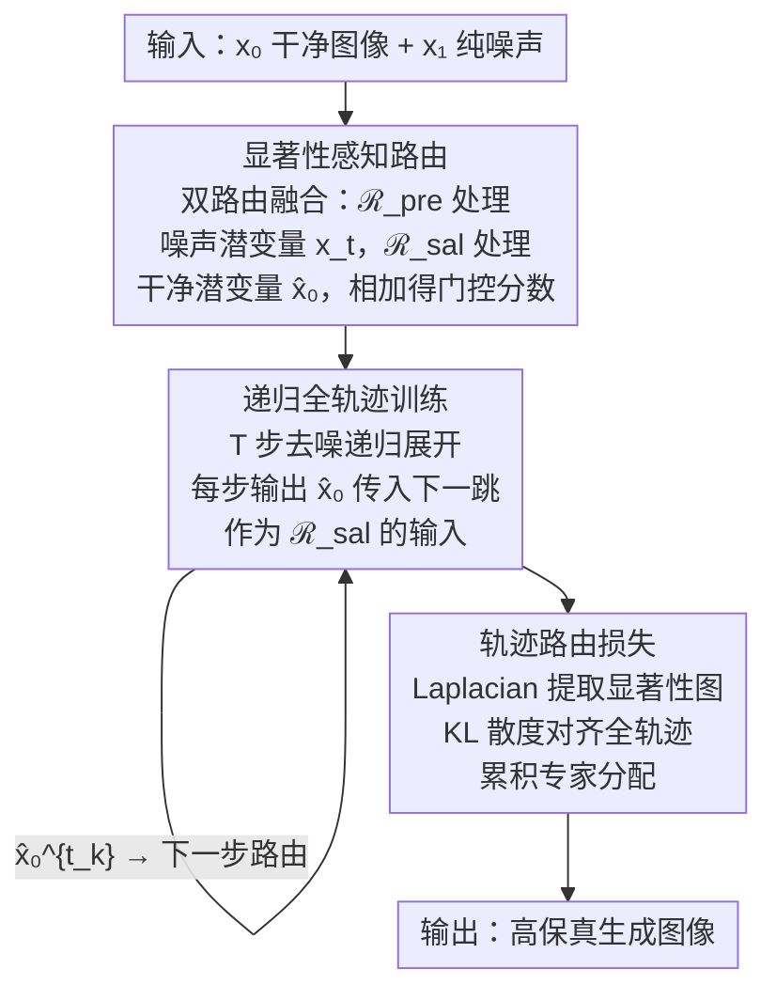

# Focusing on What Matters: Saliency-Harnessing Accurate Routing for Diffusion MoE

**会议**: ECCV 2026  
**arXiv**: [2606.26938](https://arxiv.org/abs/2606.26938)  
**代码**: 无  
**领域**: 扩散模型  
**关键词**: Mixture-of-Experts, 扩散模型, 显著性感知路由, 后训练, 视觉生成  

## 一句话总结
SharpMoE 提出一种即插即用的后训练框架，利用前一步去噪预测的干净潜变量 x̂₀ 替代噪声潜变量作为路由器输入，解决扩散 MoE 中"噪声路由"导致显著性 token 识别失败的核心问题，并辅以轨迹路由损失全局对齐累积计算分配，仅需 100K 步后训练即可显著提升多种已收敛预训练扩散 MoE 模型的生成质量。

## 研究背景与动机
扩散 Transformer（DiT）将扩散模型从 U-Net 推向 Transformer 架构，展现出优异的可扩展性。为突破密集参数激活的效率瓶颈，Mixture-of-Experts（MoE）被引入扩散模型——路由器为每个 token 动态分配稀疏专家子集，以可控计算成本支撑数十亿参数规模。近期工作（如 EC-DiT、DiffMoE）进一步认识到不同图像区域的 token 对计算资源的需求不同：包含关键结构和纹理的显著性 token 理应获得更多专家，而冗余背景区域只需少量专家即可。

然而，作者发现现有扩散 MoE 存在一个根本性的路由分配问题：路由器实际分配的专家数量与 token 显著性几乎无关。通过 Laplacian 算子提取每个 token 的纹理信息作为显著性表征，并统计不同显著性水平 token 被分配的专家数，结果显示现有方法（如 DiffMoE）的路由结果呈现"显著性不敏感"——高显著性和低显著性 token 获得的专家数差异极小。作者将根因归结为"噪声路由"（noisy routing）：扩散 MoE 的路由器始终以当前噪声污染的潜变量 x_{t_k} 为输入，而去噪过程中的残留噪声——尤其在高噪声的早期时间步——会严重掩盖 token 的语义结构信息，使路由器无法有效区分显著性区域和背景。

核心 idea：用前一个去噪步预测的干净潜变量 x̂₀ 作为路由器的输入信号，让路由器始终基于"图像应该是什么样"的估计来做专家分配决策，而非基于"当前噪声还剩多少"来做判断。干净潜变量天然编码了图像的语义骨架（VAE 潜空间本身强调结构显著性，且 x̂₀ 是向干净图像流形的投影），即使在早期高噪声阶段也能稳定捕捉物体轮廓和纹理复杂度。

## 方法详解

### 整体框架
SharpMoE 在已收敛的预训练扩散 MoE 模型上工作，是一个轻量后训练增强框架。输入为干净图像 x₀ 和高斯噪声 x₁，经过 T 步递归去噪展开，每步的核心操作是双路由器融合：当前噪声潜变量 x_{t_k} 输入保留的预训练路由器 ℛ_pre，上一步预测的干净潜变量 x̂₀^{t_{k-1}} 输入新增的显著性路由器 ℛ_sal，两者输出相加得到最终门控分数以驱动稀疏专家分配。T 步展开完成后，用轨迹路由损失约束全轨迹累积专家分配与 Laplacian 显著性分布对齐。总损失为 Flow Matching 损失与轨迹路由损失的加权和。

### 关键设计

**1. 显著性感知路由：以干净潜变量替代噪声潜变量作为路由输入**

现有扩散 MoE 的路由器 ℛ 直接以当前噪声潜变量 x_{t_k} 为输入计算 token-专家亲和度分数 S = ℛ(x)，但 x_{t_k} 中残留的噪声会掩盖 token 的语义显著性，导致路由结果与 token 重要性脱节。SharpMoE 的核心洞察是：去噪过程中预测的干净潜变量 x̂₀^{t_{k-1}}（由前一步通过 x̂₀^{t_{k-1}} = x_{t_{k-1}} - t_{k-1}·v_{k-1} 反推得到）天然包含图像的语义骨架信息。VAE 潜空间本身就会编码结构显著性，且 x̂₀ 是向干净图像流形的投影，即使在早期高噪声阶段也能稳定捕捉物体轮廓和纹理复杂度（Fig. 1 可视化证明了这一点）。

具体实现上，SharpMoE 在每个 MoE 层引入双路由器机制：保留原始预训练路由器 ℛ_pre（输入 x_{t_k}，捕捉当前去噪状态的瞬时需求），新增显著性感知路由器 ℛ_sal（输入 x̂₀^{t_{k-1}}，提供干净显著性引导）。最终路由分数为两者之和：S = ℛ_pre(x_{t_k}) + ℛ_sal(x̂₀^{t_{k-1}})。ℛ_sal 是一个两层 MLP（SiLU 激活），权重初始化为零——这一设计确保后训练初期新路由器不输出任何信号，模型行为完全等同于原始预训练模型，随后在训练中逐步融入显著性引导，实现平滑过渡。经 TopK 选择后得到门控矩阵 G，MoE 输出为所选中专家的加权和。

**2. 递归全轨迹训练：从单步去噪到 T 步递归展开以支撑 x̂₀ 依赖**

标准扩散训练是单步范式——随机采样时间步 t，加噪得 x_t，训练模型预测速度场 v_θ(x_t, t)。但 SharpMoE 的 ℛ_sal 需要上一步的 x̂₀^{t_{k-1}} 作为输入，这一步在单步训练中根本不存在。为解决这一递归依赖，SharpMoE 将训练改为 T 步递归全轨迹展开：每个训练迭代采样 T 个连续时间步 t₁ > t₂ > ... > t_T，从 t₁=0.999（近似纯噪声，因 t=1 的纯高斯噪声会使 Flow Matching 目标无意义）开始。第 k 步以 x_{t_k} 和 stop-gradient 阻断的 x̂₀^{t_{k-1}} 为输入预测速度 v_k，随后通过 x̂₀^{t_k} = x_{t_k} - t_k·v_k 推导下一步的干净预测，传入第 k+1 步。第一步 t₁ 时无先前的 x̂₀，直接用噪声潜变量 x_{t₁} 作为显著性近似。stop-gradient 确保 x̂₀ 仅作为路由信号不参与速度预测的梯度计算，避免训练不稳定。T=10 在实验中效果最优且对 T 取值高度鲁棒。

**3. 轨迹路由损失：以全局视角将全轨迹累积专家分配与显著性分布对齐**

仅靠 ℛ_sal 提供干净路由信号，还不足以从优化层面确保专家分配真正与显著性成正比。全轨迹训练提供了一个单步方法不具备的全局视角：可以统计整个去噪过程中每个 token 的累积专家分配，而非依赖于可能有偏的单步快照。SharpMoE 提出轨迹路由损失 ℒ_routing 来实现这一约束：对于 T 步展开序列，第 i 个 token 的轨迹级累积分配分数 A_i = Σ_k Σ_l Σ_e ℐ(k,l,e,i) · S_{k,l}(e,i)，即所有时间步、所有 MoE 层、所有专家上该 token 被分配的路由分数之和。同时，用 Laplacian 算子 ∇² 对干净图像 X₀ 提取二阶导数得到边缘和纹理响应，经 AvgPool 下采样到 token 粒度，得到每个 token 的显著性水平 M_i——Laplacian 响应对高频纹理、锐利边缘和前景边界天然敏感，是视觉显著性的有效计算代理。最终 ℒ_routing = D_KL(softmax(A) || softmax(M))，即最小化归一化累积分配与归一化显著性之间的 KL 散度，迫使模型在全轨迹范围内将更多专家分配给高显著性 token。

### 损失函数 / 训练策略
总训练目标为 ℒ_total = ℒ_fm + λ_routing·ℒ_routing，其中 ℒ_fm = E[||(x₁-x₀) - v_θ(x_t, t)||²] 是标准 Flow Matching 的 MSE 速度场回归损失，ℒ_routing 为轨迹路由 KL 散度损失，λ_routing = 0.001。全轨迹训练步数 T=10，第一步 t₁=0.999。优化器 AdamW，学习率 1×10⁻⁴，batch size 256，EMA 衰减率 0.9999，所有报告指标基于 EMA 权重计算。ℛ_sal 零初始化，其余参数从预训练 checkpoint 加载。后训练仅需 100K 步。注意 TC-DiT 采用均匀 token 计算分配，ℒ_routing 对其无意义，TC-DiT 上的 SharpMoE 仅在 ℒ_fm 下训练 ℛ_sal。

## 实验关键数据

### 主实验
在 ImageNet 256×256 类条件生成上评估。所有模型经 500K 步预训练后，再经 100K 步后训练。使用 250 步 Flow Matching Euler 采样生成 50K 张图像计算 FID 和 IS。下表展示 L 规模上的核心对比（S、B 规模结论一致，详见原文 Tab. 1）。

| 方法 | 激活参数量 | 总参数量 | FID₅₀K (cfg=1.0)↓ | IS (cfg=1.0)↑ | FID₅₀K (cfg=1.5)↓ | IS (cfg=1.5)↑ |
|------|-----------|----------|---------------------|----------------|---------------------|----------------|
| Dense-DiT-L | 458M | 458M | 19.02 | 71.61 | 4.74 | 183.54 |
| TC-DiT-L | 458M | 1.16B | 20.53 | 69.01 | 5.07 | 174.98 |
| TC-DiT-L + SharpMoE | 484M | 1.18B | 16.63 | 81.29 | 3.72 | 206.93 |
| EC-DiT-L | 458M | 1.16B | 16.61 | 78.20 | 4.09 | 195.12 |
| EC-DiT-L + SharpMoE | 484M | 1.18B | 14.82 | 88.02 | 3.27 | 221.36 |
| DiffMoE-L | 458M | 1.98B | 15.13 | 83.62 | 3.86 | 203.00 |
| DiffMoE-L + SharpMoE | 470M | 1.99B | **13.93** | **93.66** | **3.10** | **228.88** |

SharpMoE 在所有基线（TC-DiT、EC-DiT、DiffMoE）和所有模型规模（S、B、L，详见原文）上均取得一致且显著的性能提升。在最强基线 DiffMoE-L 上，SharpMoE 将 FID 从 3.86 降至 3.10（cfg=1.5），IS 从 203.00 升至 228.88。即使在采用均匀 token 分配的 TC-DiT 上，SharpMoE 仍通过引入显著性感知显著改善了路由。参数量增加极小（约 2%-3%），展示了后训练框架的高效性。

### 消融实验
在 DiffMoE-B 上消融 SharpMoE 各组件（ImageNet 256×256）。

| 配置 | FID₅₀K (cfg=1.0)↓ | IS (cfg=1.0)↑ | FID₅₀K (cfg=1.5)↓ | IS (cfg=1.5)↑ |
|------|---------------------|----------------|---------------------|----------------|
| DiffMoE-B（基线） | 27.50 | 54.45 | 8.03 | 138.49 |
| + 显著性感知路由（仅 ℛ_sal） | 25.93 | 58.33 | 6.95 | 152.65 |
| + 轨迹路由损失（完整 SharpMoE） | **25.71** | **59.60** | **6.66** | **155.64** |

仅加入显著性感知路由（ℛ_sal，以 x̂₀ 引导路由器），FID 即从 8.03 降至 6.95，证明干净路由信号替代噪声路由是核心收益来源。进一步加入轨迹路由损失，FID 降至 6.66，表明全局累积分配对齐可额外增益。

### 关键发现
- **干净路由是主要驱动力**：仅替换路由输入信号（而不改变损失函数）已有显著提升，说明现有扩散 MoE 的主要瓶颈确实是噪声路由导致的路由失准。
- **全轨迹训练步数 T 高度鲁棒**：T 从 5 到 20 变化时 FID 波动极小，SharpMoE 无需精细调参即可部署，实用性很强。
- **对预训练阶段不敏感**：无论从 400K 步还是 700K 步的预训练 checkpoint 启动，SharpMoE 均能在 100K 步后训练中稳定提升，展现了作为通用后训练增强的鲁棒性。
- **专家分配可视化直接验证了核心假设**：SharpMoE 的专家分配数与 token 显著性呈显著单调正相关（尤其在高噪声的早期步骤改善最明显），而 DiffMoE 基线则几乎无相关性（Fig. 5），直接证明了干净路由的有效性。

## 亮点与洞察
- **"噪声路由"问题的发现和证明非常漂亮**：作者不仅指出现有方法"路由不准"，更用 Laplacian 显著性分析 + 专家分配统计（Fig. 1、Fig. 5）将问题从定性感受变成了定量证据——不同显著性 token 的专家分配数曲线几乎是平的，这一可视化极具说服力。
- **x̂₀ 作为路由信号是简洁且深刻的 idea**：扩散模型本来就要通过速度场反推 x̂₀，SharpMoE 只是把这个已有的"副产品"拿来当路由器的输入，几乎零额外推理开销（ℛ_sal 仅为两层轻量 MLP）。这种"把已存在但被忽略的信号用起来"的设计哲学值得在其他任务中借鉴。
- **stop-gradient + 零初始化 = 真正的即插即用**：这两个看似微小的实现选择，是 SharpMoE 能"不破坏预训练模型"的关键——新路由器从零开始生长，训练初期不输出任何信号，模型行为完等于原始预训练模型，随后自然过渡到显著性感知路由。这种平滑集成策略可以迁移到任何需要在预训练模型中插入新组件的场景。
- **轨迹级而非单步级的全局约束**：单步看专家分配可能有偏（某一步多分配了不等于全局分配合理），全轨迹累积后再与显著性对齐才是真正公平的约束。这个"从局部到全局"的思路可以推广到其他需要时域一致性约束的序列生成任务中。

## 局限与展望
- **仅在 ImageNet 类条件生成上验证**：论文未在文本到图像生成（如 Stable Diffusion 的 MoE 变体）或更高分辨率场景下评估，显著性感知路由在开放域、多模态条件生成中的泛化性有待验证。
- **Laplacian 显著性代理的语义局限**：Laplacian 算子主要捕捉边缘和纹理等 low-level 特征，对高层语义显著性（如"人脸天然比背景更显著"）可能不敏感。用更强的预训练显著性检测器替代 Laplacian 或可进一步提升效果。
- **全轨迹训练的内存开销未充分讨论**：T=10 步递归展开意味着训练时需维护多步计算图，虽每步 x̂₀ 通过 stop-gradient 断开梯度链，但内存和计算开销仍显著高于单步训练，论文未报告具体训练成本。
- **依赖预训练模型的 x̂₀ 质量**：如果基础模型本身在早期步骤的 x̂₀ 预测质量差，干净路由的优势将打折扣。论文未探索这一下界，也未分析基础模型质量与 SharpMoE 增益之间的关系。
- **可探索的改进方向**：ℛ_pre 和 ℛ_sal 目前是简单相加，可尝试交叉注意力等更紧密的交互方式；轨迹路由损失可推广到时域更长的视频生成中做时域一致性约束；可探索在预训练阶段而非后训练阶段就引入干净路由。

## 相关工作与启发
- **vs DiffMoE / EC-DiT**: 这些方法同样追求显著性感知的专家分配，但都依赖噪声潜变量做路由决策。SharpMoE 的本质区别在于用 x̂₀ 替代 x_t 作为路由信号源，从根本上绕过噪声干扰。SharpMoE 不是替代这些方法，而是作为它们的通用后训练增强层叠加使用，实验中在三种架构上均取得一致提升证明了这一点。
- **vs TC-DiT**: TC-DiT 采用固定 top-K 路由，每个 token 分配相同数量专家，完全忽略 token 间显著性差异。SharpMoE 在 TC-DiT 上的提升说明，即使最朴素的均匀路由也能从显著性信号中获益，暗示"知道哪些 token 重要"比"设计复杂的动态分配策略"更根本。
- **vs LLM 中的 MoE（DeepSeek-V3 等）**: LLM MoE 的路由也面临负载均衡等挑战，但文本 token 的离散性和高语义密度与图像 token 的空间冗余性截然不同。SharpMoE 的"干净路由"概念在文本域没有直接对应（不存在"去噪→x̂₀"），但其元思路——"用辅助信号替代主信号做路由以规避主信号中的噪声/偏差"——在 LLM 中也有潜在应用场景（如用检索增强信号辅助 MoE 路由）。

## 评分
- 新颖性: ⭐⭐⭐⭐ 揭示"噪声路由"问题并用 x̂₀ 做干净路由的 idea 简洁有力，双路由器 + 零初始化的即插即用后训练策略颇具巧思，但核心机制并非范式级突破
- 实验充分度: ⭐⭐⭐⭐ 覆盖 3 种 MoE 架构 × 3 个模型规模，消融实验、鲁棒性分析、专家分配可视化齐全，但缺少文本到图像生成和更多数据集的评估
- 写作质量: ⭐⭐⭐⭐ 问题阐述清晰，Fig. 1 和 Fig. 5 的可视化直观有说服力，动机链完整，技术细节交代清楚
- 价值: ⭐⭐⭐⭐ 即插即用的后训练框架实用性强，100K 步即可提升已收敛模型，对工业界部署扩散 MoE 有直接参考价值；干净路由的洞察可能影响后续扩散 MoE 路由器设计

<!-- RELATED:START -->

## 相关论文

- [\[ICLR 2026\] Routing Matters in MoE: Scaling Diffusion Transformers with Explicit Routing Guidance](../../ICLR2026/image_generation/routing_matters_in_moe_scaling_diffusion_transformers_with_explicit_routing_guid.md)
- [\[ECCV 2026\] Symbiotic-MoE: Unlocking the Synergy between Generation and Understanding](symbiotic-moe_unlocking_the_synergy_between_generation_and_understanding.md)
- [\[ICLR 2026\] What Matters for Representation Alignment: Global Information or Spatial Structure?](../../ICLR2026/image_generation/what_matters_for_representation_alignment_global_information_or_spatial_structur.md)
- [\[CVPR 2026\] Seeing What Matters: Visual Preference Policy Optimization for Visual Generation](../../CVPR2026/image_generation/seeing_what_matters_visual_preference_policy_optimization_for_visual_generation.md)
- [\[ECCV 2026\] Accelerated Likelihood Maximization for Diffusion-based Versatile Content Generation](accelerated_likelihood_maximization_for_diffusion-based_versatile_content_genera.md)

<!-- RELATED:END -->
