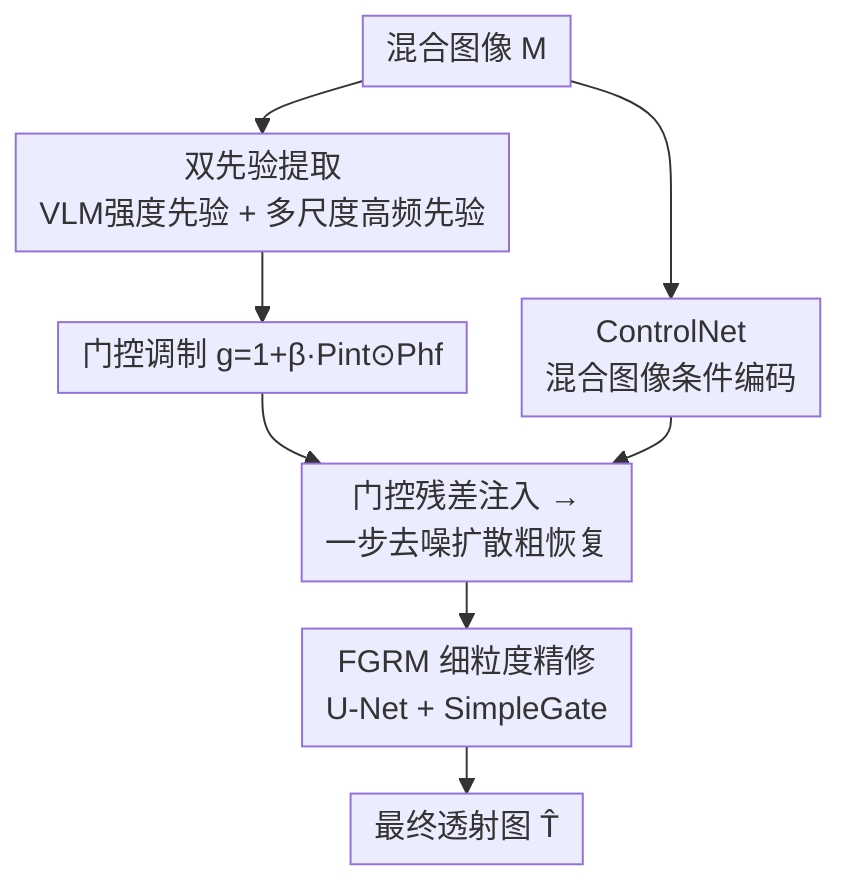

# FUMO: Prior-Modulated Diffusion for Single Image Reflection Removal

**会议**: ECCV 2026  
**arXiv**: [2603.19036](https://arxiv.org/abs/2603.19036)  
**代码**: [https://github.com/Lucious-Desmon/FUMO](https://github.com/Lucious-Desmon/FUMO)  
**领域**: 图像恢复 / 扩散模型  
**关键词**: 单图像反射去除, 扩散模型, 先验调制, 粗到细恢复, 门控机制  

## 一句话总结

FUMO 提出一种先验调制的扩散框架用于单图像反射去除，从混合图像中提取 VLM 驱动的反射强度先验和多尺度高频先验，通过门控机制对 ControlNet 的条件残差注入进行空间自适应调制，再经粗到细两阶段（一步去噪扩散粗恢复 + 细粒度精修模块）在三个标准基准和真实场景中取得有竞争力的量化结果和一致的感知质量提升。

## 研究背景与动机

**领域现状**：透过玻璃拍摄的图像往往包含不必要的反射，遮挡底层场景并降低视觉质量。单图像反射去除（SIRR）旨在从单张混合图像中恢复清晰的透射图像，是一个病态数学问题。基于学习的方法通过从数据中隐式学习先验取得了显著进展，但真实场景下的鲁棒反射去除仍然充满挑战。扩散模型在图像恢复任务中展现出强大潜力，但其对合适的条件引导有较高要求，以避免内容漂移和结构失真。

**核心矛盾**：反射去除面临一个内在的权衡——激进的反射抑制与忠实的结构保持之间的矛盾。在真实场景中，反射强度在空间上变化剧烈，反射模式与透射结构紧密纠缠。现有方法在真实混合图像上常表现为三种典型失败模式：反射抑制不彻底、颜色不一致、细节丢失。这三类问题源自同一个根本矛盾：要想彻底去除强反射区域就必须施加较强的条件约束，但这往往会牺牲边缘和纹理区域的几何保真度；反之若保守处理则以保留结构为主，则反射残留明显。

**本文目标**：针对上述矛盾，FUMO 希望引入一种显式的空间调制机制，能够在空间上区分不同区域的反射强度并相应调节恢复力度，同时兼顾结构敏感区域的细节保持。

**切入角度**：核心观察是，混合图像本身虽然缺少直接分离两层所需的线索，但从中可以提取互补的指导信号——一方面通过 VLM 的语义理解能力估计反射的空间强度分布，另一方面通过多尺度残差分解捕获对纹理细节敏感的高频响应。这两个先验信号一个"告诉模型哪里需要大力去除反射"，一个"提醒模型哪里不能破坏细节"。

**核心 idea**：将这两个互补先验组合成空间门控，对扩散模型的条件残差注入进行逐空间位置的自适应调制，使得在反射主导区域增强条件干预、在结构敏感区域保持细节敏感度，再通过细粒度精修模块纠正几何畸变并恢复精细结构。

## 方法详解

### 整体框架

FUMO 的整体流程如下：输入混合图像 M，经双先验提取管道获得强度先验 Pint 和高频先验 Phf；两个先验通过元素级相乘构成空间门控 g = 1 + beta * Pint * Phf，用于调制 ControlNet 输出的多尺度条件残差向量，使调制后的条件注入在反射强且结构丰富的区域获得更大权重；调制后的条件送入 Stable Diffusion 2.1 的 U-Net 去噪器，采用一步去噪策略直接从全噪声潜变量 z_N 预测目标潜变量 z_t，经 VAE 解码得到粗恢复结果；最后，细粒度精修模块以通道拼接方式接收混合图像、粗恢复结果和两个先验，在图像空间进行确定性精修并输出最终透射图像。

### 关键设计

**1. VLM 驱动的反射强度先验：用大模型的语义理解能力估计空间反射严重程度**

先验提取的第一个分支从混合图像中估计像素级的反射强度图。将混合图像 M 划分为非重叠的图像块，逐块向一个固定的 VLM（如 InternVL3 或 Qwen2.5-VL）查询反射严重程度。不同于直接依赖自由文本输出，该方法利用模型对下一 token 的 logits，将概率质量限制在预定义的五个有序等级集合 C = {None, Minor, Mid, Major, Critical} 上，通过 softmax 得到各类别的概率 p(c)，再以加权期望 s = sum_{c in C} w(c) * p(c) 计算连续严重度分数（权重 w(c) 取 {1,2,3,4,5}），将块级分数回填到图像平面形成初始强度场 S。然而块级评分可能遗漏全局尺度上视觉显著的反射区域，因此进一步引入图像级分析：同样通过 VLM 定位反射主导区域并返回边界框，对对应区域的强度值施加倍增因子得到增强映射 $\tilde{S}$。在 100 张人工标注反射主导区域的真实图像上，此定位步骤达到 0.65 mIoU，是一个粗粒度的空间线索。最后，通过边缘感知引导滤波对 $\tilde{S}$ 进行稠密化，去除块状伪影并让强度过渡与图像主结构对齐，得到最终的像素连续强度先验 $P_{\mathrm{int}} \in [0,1]^{H \times W}$。巧妙之处在于：用 VLM 的语义推理能力做"打分 + 定位"而非直接生成图像，既保持了输出可控性，又比纯 CNN 方法获得了更丰富的语义上下文感知。

**2. 多尺度高频先验：从混合图像中提取结构敏感细节响应**

强度先验从语义层面提供"哪里反射强"的指示，但在结构敏感区域需要补充信号层面的引导。高频先验分支通过多尺度残差分解从同一混合图像中提取细节响应。以膨胀卷积实现平滑算子 $B_r(\cdot)$，在每个尺度 i 上迭代计算平滑图像 $L^{(i)} = B_{r_i}(M^{(i)})$、残差 $H^{(i)} = M^{(i)} - L^{(i)}$，然后将 $L^{(i)}$ 作为下一尺度的输入。尺度参数 $r_i = 2^i$ 随 i 指数增长。最终高频先验通过对所有尺度的残差求和得到 $P_{\mathrm{hf}} = \sum_{i=0}^{L-1} H^{(i)}$。由于该先验同样提取自混合图像，同时包含透射层和反射层的高频成分，因此它不试图分离两层，而是作为一个结构敏感的引导信号——告诉模型哪些区域的局部结构细节需要被保护。此设计的简洁性值得注意：整个分解仅依赖膨胀卷积和元素级减法，不需要额外的学习参数。

**3. 门控调制 + 粗到细两阶段：让条件注入在空间上自适应**

这是连接先验与扩散模型的桥梁，也是全文的方法核心。将两个先验组合为空间门控 $g = 1 + \beta \, P_{\mathrm{int}} \odot P_{\mathrm{hf}}$：加法恒等项保证当任一引导信号较弱时退化为标准条件注入，乘法交互强调两者的联合存在，使门控在"反射严重且结构丰富"的区域取值最大，同时保持简单可微。在粗恢复阶段，ControlNet 输出多尺度条件残差张量集合 $\mathbf{c}_m = \{\mathbf{c}_s\}$，对每个尺度 s 将门控缩放到对应分辨率并进行逐元素调制：$\tilde{\mathbf{c}}_s = \mathrm{clip}(\mathcal{I}_s(g), 1, 1+\beta_{\max}) \odot \mathbf{c}_s$。$\beta$ 从 0 逐步预热到 $\beta_{\max}=0.25$，使门控影响渐进引入。

粗恢复阶段的训练采用一步去噪策略：与标准扩散模型在多步上预测噪声不同，网络以最大扰动潜变量 $z_N$（N=1000）为输入，直接预测一个较少扰动的潜变量 $z_t$，损失为 $\mathcal{L}_{\text{coarse}} = \|z_t - \mu_\theta(z_N, t, \tilde{\mathbf{c}}_m)\|_2^2$。推理时设 t=0 得到 $\hat{z}_{\mathbf{T}}$ 后解码。仅优化 ControlNet 和 U-Net 的上采样块，VAE 和其余参数冻结以保持预训练生成先验。

细粒度精修模块（FGRM）在粗恢复完成后对几何偏差和局部不一致进行修正。FGRM 为 U-Net 结构，将标准激活替换为 SimpleGate（将特征沿通道分成两半后逐元素相乘），以通道拼接方式接收混合图像、粗恢复结果和两个先验，输出精修后的透射图像 $\hat{\mathbf{T}}$。精修阶段的综合损失包含 L1 像素损失、LPIPS 感知损失和边缘感知梯度损失。

### 损失函数 / 训练策略

两阶段分别优化。粗恢复阶段（100k 步，lr=5e-5）：仅训练 ControlNet 和 U-Net 上采样块，损失为一步去噪回归损失 $\mathcal{L}_{\text{coarse}}$。精修阶段（10k 步，lr=1e-4）：冻结粗恢复部分，仅训练 FGRM，损失函数为 $\mathcal{L}_{\text{refine}} = \lambda_{\text{pix}} \mathcal{L}_{\text{pix}} + \lambda_{\text{perc}} \mathcal{L}_{\text{perc}} + \lambda_{\text{grad}} \mathcal{L}_{\text{grad}}$，其中 $\lambda_{\text{pix}}=0.5, \lambda_{\text{perc}}=0.25, \lambda_{\text{grad}}=0.25$。$\mathcal{L}_{\text{pix}}$ 为 L1 像素损失，$\mathcal{L}_{\text{perc}}$ 为 LPIPS 感知损失，$\mathcal{L}_{\text{grad}}$ 为 Sobel 梯度差分 L1 损失。训练数据包含真实配对（Real / Nature / RR4k / RRW / DRR 共约 3.5 万对）和合成数据（COCO 混合生成 1.6 万对，混合模型 $M = \gamma_1 T + \gamma_2 R - \gamma_1 \gamma_2 T \odot R$），所有图像缩放到 768x768。

## 实验关键数据

### 主实验

在 Nature（20 对）、Real（20 对）和 SIR2（500 对）三个标准基准上进行评测，对比 IBCLN、Dong et al.、YTMT、DSRNet、Zhu et al.、RDNet、DAI 共 7 种 SOTA 方法，所有基线在相同训练数据上微调。

| 数据集 | 指标 | IBCLN | DSRNet | RDNet | DAI | FUMO |
|--------|------|-------|--------|-------|-----|------|
| Nature | PSNR↑ | 23.77 | 24.58 | 25.74 | 26.81 | **26.93** |
| Nature | LPIPS↓ | 0.145 | 0.120 | 0.109 | 0.203 | **0.088** |
| Real | PSNR↑ | 21.55 | 23.37 | 24.81 | 25.21 | **25.95** |
| Real | LPIPS↓ | 0.210 | 0.157 | 0.118 | 0.150 | **0.097** |
| SIR2 | PSNR↑ | 23.89 | 25.51 | 26.46 | **27.35** | 27.22 |
| SIR2 | LPIPS↓ | 0.127 | 0.094 | 0.080 | 0.093 | **0.067** |
| 平均 | PSNR↑ | 23.79 | 25.39 | 26.36 | **27.24** | 27.15 |
| 平均 | LPIPS↓ | 0.131 | 0.098 | 0.083 | 0.100 | **0.069** |
| 平均 | MUSIQ↑ | 58.19 | 59.02 | 58.71 | 54.57 | **59.88** |

FUMO 在 PSNR 上与 DAI 基本持平（Nature/Real 上超越，SIR2 上略低），但在所有感知指标（LPIPS、CLIPIQA、MUSIQ）上全面领先，表明门控调制和精修模块显著改善了视觉质量和结构保真度。

### 消融实验

| 配置 | PSNR↑ | SSIM↑ | LPIPS↓ | CLIPIQA↑ | 说明 |
|------|-------|-------|--------|----------|------|
| 无门控（w/o gate） | 26.55 | 0.897 | 0.076 | 0.390 | 条件注入无空间调制 |
| 拼接先验（Concat） | 26.87 | 0.906 | 0.072 | 0.406 | 先验拼入条件特征而非调制 |
| 仅强度先验 | 26.94 | 0.905 | 0.073 | 0.403 | 门控仅由 Pint 驱动 |
| 仅高频先验 | 26.78 | 0.906 | 0.071 | 0.393 | 门控仅由 Phf 驱动 |
| 仅有粗恢复 | 26.27 | 0.865 | 0.133 | 0.385 | 无 FGRM 精修 |
| 精修解码器 | 26.75 | 0.891 | 0.084 | 0.398 | DAI 式 fine-tuned decoder |
| 完整 FUMO | **27.15** | **0.918** | **0.069** | **0.424** | 双先验门控 + FGRM |

### 关键发现

- **门控调制是感知质量的核心**：去除门控后 LPIPS 从 0.069 升至 0.076（-10%），而 PSNR 仅从 27.15 降至 26.55（-2%），说明门控主要改善的是感知结构保真度而非像素级误差。
- **两个先验各有侧重**：强度先验改善高严重度区域的反射去除，高频先验提升边缘和纹理区域的细节响应，两者联合使用效果最佳。
- **粗恢复不可或缺但单独不够**：仅粗恢复的变体 LPIPS 高达 0.133（退化 93%），表明直接解码的输出存在显著模糊和修复痕迹，FGRM 精修是结构一致性的关键所在。
- **先验调制优于拼接**：将先验拼接进条件特征路径效果弱于用先验调制残差注入，说明先验的核心价值不在于作为额外输入特征，而在于信号级的空间加权。

## 亮点与洞察

- **用 VLM 做退化程度估计**：利用 VLM 的 logits 做有序分类后再转换为连续数值分数，而非让 VLM 生成自由文本——这是一个可复用于多种图像增强任务的技巧（去雾、去噪、低光增强中的退化程度估计）。
- **门控的乘法交互设计**：$g = 1 + \beta P_{\mathrm{int}} \odot P_{\mathrm{hf}}$ 中加法恒等项保证退化为基准条件，乘法交互强调"反射严重且细节丰富"区域联合激活，比简单拼接或加和更合理地控制了空间上施加条件干预的力度。
- **粗到细的角色分离**：粗阶段用生成模型"大胆去除"、精阶段用判别模型"小心修复"，虽然这个哲学在图像恢复中常见，但具体实现（粗阶段用一步去噪而非多步采样、精阶段用 SimpleGate U-Net）体现了实用主义的设计取舍。
- **感知质量优先的设计导向**：FUMO 在 LPIPS/MUSIQ/CLIPIQA 上全面领先，验证了其设计目标——通过空间自适应调制优先改善视觉感知质量——的成功。

## 局限与展望

- **反射与透射内容语义混淆**：当反射区域与透射内容在强度和结构上高度相似时，方法难以判断哪些内容应保留。用户提供的空间引导（粗略掩码或稀疏边缘标注）是实际可行的缓解方向。
- **VLM 先验的推理开销**：在 11K 分辨率、RTX 4090 上，先验提取需 3.40s，而整个恢复网络仅需 0.63s。论文建议替换为轻量级预测器，但未在本文中实现。
- **先验提取质量瓶颈**：VLM 定位步骤的 mIoU 仅 0.65，在复杂场景中精度可能不足并影响门控效果。另外强度先验依赖冻结的 VLM，无法端到端训练，限制了先验与下游任务的联合适应。
- **合成数据的混合模型局限**：合成数据沿用 $M = \gamma_1 T + \gamma_2 R - \gamma_1 \gamma_2 T \odot R$ 的准线性混合假设，与真实世界中复杂的非线性混合仍有差距。

## 相关工作与启发

- **vs DAI (Hu et al. 2025)**：DAI 同样使用 ControlNet 条件注入 + 扩散主干，并用 fine-tuned decoder 改善解码质量。FUMO 在中间引入了显式的双先验门控调制，并用 FGRM（LPIPS 0.069）替代简单 decoder 调优（LPIPS 0.084），消融实验证实了这一改进。
- **vs L-DiffER (Hong et al. 2024)**：L-DiffER 首次将扩散模型引入反射去除，采用前次预测作为条件迭代去噪。FUMO 采用一步去噪而非多步迭代，在推理效率和训练稳定性上更具优势。
- **vs 隐式先验网络 (DSRNet / RDNet)**：这些方法通过精心设计的网络架构隐式学习反射与透射的差异。FUMO 的差异在于将先验显式化并用于空间调制，比隐式学习更可控、可解释。
- **迁移启发**：双先验 + 门控调制的范式可迁移至其他图像恢复任务（去雾、去雨、低光增强），其中"退化程度先验 + 结构敏感先验 + 空间门控"可构成通用设计模式。VLM logits 转连续分数的方法也可广泛复用。

## 评分

- 新颖性: ⭐⭐⭐⭐ 将 VLM 显式先验引入扩散条件调制是新颖的设计，但扩散 + ControlNet + 粗到细的整体架构并非全新。
- 实验充分度: ⭐⭐⭐⭐ 三个基准 + 真实场景定性 + 消融实验（门控形式 4 种、精修形式 2 种）较为全面，但缺少跨数据集迁移实验和更多扩散基线对比。
- 写作质量: ⭐⭐⭐⭐ 方法描述清晰，图 3 框架图配合文字易于理解，但消融分析部分可进一步精炼。
- 价值: ⭐⭐⭐⭐ 单图像反射去除有广泛应用需求，该方法在感知质量上的显著提升有实际价值，且设计思路可推广。

<!-- RELATED:START -->

## 相关论文

- [\[ECCV 2024\] L-DiffER: Single Image Reflection Removal with Language-Based Diffusion Model](../../ECCV2024/image_generation/l-differ_single_image_reflection_removal_with_language-based_diffusion_model.md)
- [\[CVPR 2026\] Diff-SemiER: Transparency-Aware Adaptive Fusion Diffusion Model with Generative Prior for Semi-Transparent Eyeglasses Removal](../../CVPR2026/image_generation/diff-semier_transparency-aware_adaptive_fusion_diffusion_model_with_generative_p.md)
- [\[ECCV 2026\] Continuous Speculative Decoding for Autoregressive Image Generation](continuous_speculative_decoding_for_autoregressive_image_generation.md)
- [\[ECCV 2026\] Revisiting Autoregressive Models for Generative Image Classification](revisiting_autoregressive_models_for_generative_image_classification.md)
- [\[ICLR 2026\] Weak-to-Strong Diffusion with Reflection](../../ICLR2026/image_generation/weak-to-strong_diffusion_with_reflection.md)

<!-- RELATED:END -->
