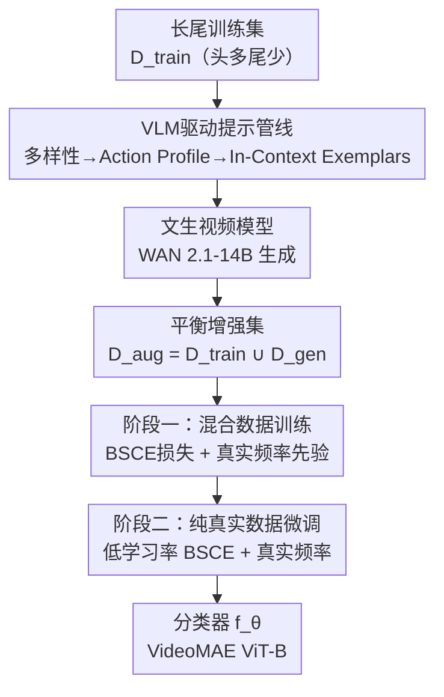

# Gen2Balance: Generative Balancing for Long-Tailed Video Action Recognition

**会议**: ECCV 2026  
**arXiv**: [2606.22416](https://arxiv.org/abs/2606.22416)  
**论文**: [https://prajwalgatti.github.io/gen2balance/](https://prajwalgatti.github.io/gen2balance/)  
**代码**: 无  
**领域**: 视频理解  
**关键词**: 长尾学习, 视频动作识别, 生成式数据增强, 文生视频, 两阶段训练

## 一句话总结
Gen2Balance 用文生视频模型（WAN 2.1）为长尾视频动作识别合成尾部类样本，通过 VLM（Gemini 2.5 Pro）驱动的三层提示管线（多样化 + Action Profile 消歧 + In-Context Exemplars 锚定）保证生成视频的多样性和语义正确性，再配合两阶段训练策略（合成+真实数据学特征，纯真实数据校准），在 K100-LT 和 UCF-LT 上分别超越最强长尾基线 7.0% 和 5.1%，在 RareAct 稀有动作上提升 31.9%。

## 研究背景与动机

长尾分布是视觉识别的顽固难题。即使在 ImageNet-LT 上 SOTA 也只有 80.6%，而平衡版 ImageNet 用同 backbone 可达 91.0%。视频动作识别同样受害：UCF-101 从平衡下的 92% 骤降到长尾下的 64%。现有长尾方法分三类——重采样（过采样尾部易过拟合）、重加权（尾部梯度放大常伤头部）、数据增强（隐式特征插值无法产生新信息，显式网页检索受限于尾部类在线数据本身就稀缺且有标注噪声）——它们全在特征空间或 logit 空间操作，无法真正为尾部类注入新的外观和运动多样性。

核心矛盾：尾部类训练样本极度稀缺，模型学不到足够的视觉和时序特征，但视频理解又天然需要丰富的场景、人物、动作变化——仅靠特征层面的操作无法弥补像素层面多样性的缺失。与此同时，文生视频模型（WAN 2.1、Sora 等）已能生成相当质量的视频片段，图像域已有用生成数据做长尾增强的成功先例（SYNAuG、Fill-Up、LTGC），但在视频域，这条路线几乎空白。

**核心 idea**：用精心设计的 VLM 提示管线让文生视频模型为每个尾部类合成多样化、语义准确的视频，把不平衡训练集"填平"为平衡集，再通过两阶段训练（先在合成+真实混合数据上学特征，再在纯真实数据上微调校准）缓解合成域偏移，从而在不牺牲头部性能的前提下大幅提升尾部识别率。

## 方法详解

### 整体框架

Gen2Balance 由两个串行组件构成：(1) 利用 VLM 驱动的提示管线 + 文生视频模型为尾部类生成合成视频，把训练集填充至目标规模；(2) 采用两阶段训练策略在混合数据上学习分类器。给定原始长尾训练集 $\mathcal{D}_{train}$，为每个样本数 $N_c < B$ 的类 $c$ 生成 $N'_c = B - N_c$ 个合成视频，得到生成集 $\mathcal{D}_{gen}$，增强集 $\mathcal{D}_{aug} = \mathcal{D}_{train} \cup \mathcal{D}_{gen}$。$B$ 默认设为最大头类的样本数（完全平衡），也可设为更小值做部分平衡。分类器 $f_\theta$ 使用 VideoMAE (ViT-B) 预训练 backbone，仅微调最后一层 encoder 和分类头（7.4M/86M 参数）。

### 关键设计

**1. 三层提示生成管线：从多样性到语义精确定位**

直接对文生视频模型用模板化提示（如 "A video depicting the action of [class name]"）有两个致命问题：(1) 类名本身可能语义模糊——例如 Kinetics 中的 "Robot Dancing" 指的是一种人类模仿机器人的街舞风格，而模板提示会生成真正的机械机器人跳舞；(2) 模板化提示产出重复、刻板的样本，缺乏训练所需的视觉多样性。

Gen2Balance 的提示管线分三层逐级消歧。第一层**多样化提示**：用 MLLM（Gemini 2.5 Pro）沿九个多样性轴生成变体——场景环境、镜头构图、视频画质、演员人口特征、相关道具、动作强度、光照条件、背景密度、社交情境——确保生成的视频覆盖丰富的视觉条件。第二层 **Action Profile 消歧**：让 MLLM 为每个类生成一个 Action Profile $\mathcal{A}_c$，包含三部分：(a) 动作定义，(b) 正面约束（应出现的视觉特征），(c) 负面约束（常见误解，如"不是机械机器人"）。这一步相当于反向工程数据集标注过程——编码人类标注者判断某视频是否属于该类的先验知识。MLLM 再以 $\mathcal{A}_c$ 为条件生成提示 $\mathcal{T}_c = \mathcal{M}(\mathcal{A}_c, c)$。但仅靠文字描述仍可能选错解释（图 2 Col. 3 中 still 出现真机器人）。第三层 **In-Context Exemplars 锚定**：给 MLLM 喂入 5 个来自训练集的真实视频片段 $\mathcal{S}_c$ 作为上下文示例，让 MLLM 先看真实样本再生成 Action Profile，即 $\mathcal{A}_c = \mathcal{M}(\mathcal{S}_c, c)$，$\mathcal{T}_c = \mathcal{M}(\mathcal{A}_c, c)$。关键设计：exemplars 只影响 Action Profile，不直接注入提示生成阶段——这保证了 diversity axes 驱动的多样性不受限于少数真实样本的狭窄分布。

消融实验（Table 6）验证了每层的独立贡献：naive prompting 在 10 个尾部类的平均准确率仅 37.3%，加入多样化提示升至 44.9%，再加入 Action Profile 升至 47.2%，完整管线（含 In-Context Exemplars）达 49.8%，FVD 从 1277.1 持续降至 836.1。

**2. 两阶段训练：合成域学习 + 真实域校准，用真实频率做先验**

直接把合成视频和真实视频混在一起用标准 CE 训练不仅不涨点，反而掉 4%（Table 5 中 (a) vs (b)），因为模型会学到合成数据的 shortcut 而非可泛化特征，且合成-真实域偏移会把表征拉离真实数据流形。

Gen2Balance 的两阶段方案解决这个问题。**阶段一**：在 $\mathcal{D}_{aug}$ 上用 Balanced Softmax (BSCE) 损失训练，其形式为 $\mathcal{L}_{BS} = -\log\left(\frac{N_c e^{\eta_c}}{\sum_{j=1}^{C} N_j e^{\eta_j}}\right)$，其中 $\eta_c$ 为 logit，$N_c$ 为类 $c$ 的样本数。BSCE 根据类频率调整 loss margin，让样本少的类获得更大的梯度惩罚。关键细节：使用的频率 $N_c$ 来自**原始训练集**的样本数，而非增强后总样本数 $N_c + N'_c$。如果使用后者，当数据集完全平衡时所有类的 $N_c + N'_c$ 相同，BSCE 退化为标准 CE，重加权效果完全消失。使用真实频率则赋予少数类更大的 loss margin，让模型在用大量生成数据学习特征的同时，决策边界仍按真实类先验校准。**阶段二**：仅在 $\mathcal{D}_{train}$ 上微调，使用相同的 BSCE 损失和更低的学习率（$5 \times 10^{-4}$ vs 阶段一的 $5 \times 10^{-3}$），做小幅纠正更新，消除合成数据引入的域偏移而不遗忘已学到的表征。

Table 5 的消融拆解了每个选择：用 CE 在增强集上训练掉 4%（(b) vs (a)）；加入 BSCE 用增强频率升至 61.3%（(c)）；加入阶段二微调升至 70.6%（(d)）；换成真实频率做 BSCE prior 再升至 70.9%（(g)）——小样本类从 61.0% 提到 62.1% 的同时头部类保持 87.9%。若用单独延长阶段一训练（135 epochs 无阶段二）代替阶段二（135 vs 100+35），仅得 67.9%（(f)），证明提升来自两阶段策略本身而非额外训练量。

### 损失函数 / 训练策略

两阶段均使用 Balanced Softmax 损失。阶段一：100 epochs，学习率 $5 \times 10^{-3}$，AdamW，weight decay 0.05，batch size 84，cosine 衰减 + 5-epoch 线性 warm-up，输入分辨率 $224 \times 224$。阶段二：35 epochs，学习率 $5 \times 10^{-4}$，其余同。BSCE 中频率统一使用真实训练集样本数 $N_c$。

## 实验关键数据

### 主实验

| 方法 | K100-LT Few | K100-LT Tail | K100-LT Head | K100-LT Avg | UCF-LT Few | UCF-LT Tail | UCF-LT Head | UCF-LT Avg |
|------|------------|-------------|-------------|------------|-----------|------------|------------|-----------|
| CE (Full Dataset) | 74.9 | 81.7 | 88.4 | 80.4 | 92.7 | 89.4 | 94.0 | 92.0 |
| CE | 23.4 | 63.3 | 94.7 | 54.8 | 45.7 | 79.6 | 95.7 | 64.0 |
| BSCE | 48.7 | 68.5 | 86.7 | 64.5 | 74.3 | 83.0 | 88.5 | 79.3 |
| Logit Adj. | 55.5 | 68.4 | 78.5 | 65.6 | 81.2 | 83.4 | 88.6 | 83.1 |
| LMR (视频SOTA) | 51.5 | 68.7 | 83.1 | 65.1 | 79.6 | 84.6 | 94.4 | 83.6 |
| Sariyildiz et al. (Gen) | 26.2 | 58.8 | 93.2 | 52.8 | 73.1 | 86.4 | 94.3 | 80.6 |
| Li et al. (Gen) | 23.8 | 62.6 | 93.4 | 54.4 | 75.2 | 88.1 | 95.9 | 82.5 |
| **Gen2Balance** | **62.2** | **75.0** | **88.4** | **72.6** | **86.7** | **90.3** | **93.4** | **88.9** |

K100-LT 是由 Kinetics-400 中精选 100 个时序依赖类构造的长尾版（不平衡比 198，30% 小样本类）。UCF-LT 是 UCF-101 的长尾版（不平衡比 24，55% 小样本类）。Gen2Balance 在两个基准上均取得最高整体准确率，Few-shot 类提升尤为显著（K100-LT +6.7%，UCF-LT +5.5% vs Logit Adj.），同时头部类准确率与 CE 基线持平（K100-LT 88.4% vs 94.7%，差距远小于 Logit Adj. 的 78.5%）。两个纯生成基线（Sariyildiz 和 Li et al.）尽管使用同一批合成数据，表现甚至不如非生成型长尾基线，说明仅靠生成数据不够，训练策略同等关键。

**RareAct 稀有动作**：将 RareAct 中清洗后的 22 个稀有动作（如 cut keyboard、drill phone）作为 few-shot 类附加到 K100-LT，Gen2Balance 在这 22 个类上达 59.7%，而 CE 仅 11.3%、Logit Adj. 仅 27.8%——证明生成填充对真实世界中真正稀缺的动作同样有效。

### 消融实验

**训练策略消融 (Table 5, B=330)**

| 配置 | 数据 | 损失 | 频率来源 | Epochs | 阶段二 | Few | Tail | Head | Avg C/A |
|------|------|------|---------|--------|--------|-----|------|------|---------|
| (a) | $\mathcal{D}_{train}$ | CE | - | 100 | 无 | 23.4 | 63.3 | 94.7 | 54.8 |
| (b) | $\mathcal{D}_{aug}$ | CE | - | 100 | 无 | 27.3 | 55.2 | 91.2 | 50.8 |
| (c) | $\mathcal{D}_{aug}$ | BSCE | $N+N'$ | 100 | 无 | 41.8 | 65.7 | 90.5 | 61.3 |
| (d) | $\mathcal{D}_{aug}$ | BSCE | $N+N'$ | 100+35 | 有 | 61.0 | 72.4 | 87.7 | 70.6 |
| (e) | $\mathcal{D}_{aug}$ | BSCE | $N$ | 100 | 无 | 61.9 | 68.3 | 82.7 | 67.8 |
| (f) | $\mathcal{D}_{aug}$ | BSCE | $N$ | 135 | 无 | 54.6 | 70.7 | 89.7 | 67.9 |
| **(g)** | $\mathcal{D}_{aug}$ | **BSCE** | **$N$** | **100+35** | **有** | **62.1** | **72.3** | **87.9** | **70.9** |

关键结论三步递进：(1) 加入生成数据用 CE 反而掉点（(b) < (a)），必须配合类别平衡损失；(2) 阶段二微调（(d) vs (c)）带来全面增益，有效纠正域偏移；(3) 使用真实频率做 BSCE prior（(g) vs (d)）在保持头部性能的同时进一步提升小样本类。

**生成管线消融 (Table 6, 10 个尾部/少样本类)**

| 管线阶段 | FVD↓ | ViCLIP↑ | 10类Avg↑ | 整体Avg↑ |
|----------|------|---------|---------|---------|
| Naive Prompting | 1277.1 | 0.1635 | 37.3 | 68.9 |
| + 多样化提示 | 886.8 | 0.1585 | 44.9 | 69.5 |
| + Action Profile | 842.8 | 0.1649 | 47.2 | 70.0 |
| + In-Context Exemplars | 836.1 | 0.1774 | 49.8 | 70.9 |

每增加一层管线，FVD（Fréchet Video Distance，越低越好）持续下降，ViCLIP 语义相似度在最终阶段最高，准确率稳步提升，验证了三层设计的递进必要性。

### 关键发现
- **核心贡献来自训练策略而非单纯的数据量**：两个对比生成方法使用同一批合成数据但表现远不如 Gen2Balance（甚至输给纯非生成型基线），说明两阶段训练 + 真实频率 BSCE 的设计是关键区分因素。
- **部分平衡的性价比极高**：在 K100-LT 上，B=330（仅填到最大类 1/3 规模）用 2.5K GPU 小时达到 70.9% Avg C/A，占完整平衡（B=990, 9.2K GPU 小时, 72.6%）79% 的性能增益，但计算成本仅 27%。
- **在小数据集上生成填充可溢出受益**：UCF-LT 上即使 B 超过最大头类（B > 121）继续过采样，小样本类仍持续提升（从 74.4% 到 88.8%），说明对小规模基准，生成填充不仅纠正长尾，还充当了全分布的数据增强。
- **对 Web 流行度重排序具有鲁棒性**：将 K100-LT 类按 WebVid10M 中的频率重排（把生成模型训练数据中真正罕见的类推为 few-shot），Gen2Balance 在 Few-shot 类上仍领先 Logit Adj. 19%，证明方法不依赖生成模型对特定类的预训练记忆。
- **生成质量经人工验证**：用户研究（500 个任务、2500 次判断）显示生成视频的语义正确率为 87%，而 Kinetics 真实训练视频本身也只有 92%（两者误差均为 false negative，无 false positive）——合成数据与真实数据的标注噪声差距仅 5%。
- **Backbone 和方法可叠加**：换用更大的 V-JEPA 2 (375M) backbone 后，Gen2Balance 仍是最强方法（76.3% vs BSCE 71.3%），且提升幅度与 VideoMAE 上一致（+5.0% vs +6.4%），说明生成数据和训练策略带来的增益与 backbone 缩放正交。

## 亮点与洞察
- **三层提示管线的递进消歧逻辑非常清晰**：从"多样化"到"定义消歧"到"实例锚定"，每层解决上一层遗留的问题，且三层之间有保护性边界（exemplars 不直接进入提示生成，避免多样性坍缩），这种"分层隔离"的设计思维可迁移到任何用 LLM/生成模型做数据合成的场景。
- **"用真实频率做 BSCE prior"是一个微小的实现选择但有巨大效果**：在完全平衡的增强集上，如果用总样本数做频率，BSCE 退化为 CE，所有重加权消失。用真实频率等于是把"数据增强可以随便加，但类别重要性仍按真实世界分布来"这个直觉精确地编码进损失函数。这个技巧可以推广到任何"合成数据 + 重加权损失"的组合。
- **用户研究直接对比生成视频和真实视频的标注质量**是扎实的做法：不做孤立的"生成视频有多好"，而是用同标准（Kinetics 标注流程）测真实训练集，发现真实数据也有 8% 标注噪声，生成数据的 87% 只差了 5pp——这个 benchmarking 思路值得所有做生成增强的论文学习。
- **部分平衡 vs 全平衡的 scaling 分析给出了操作性的指导**：79% 增益只需 27% 成本，这对工业界落地极其重要，说明不需要"填满"就能获得大部分好处。

## 局限与展望
- **计算成本仍高**：K100-LT 完整平衡需要 9.2K H100 GPU 小时生成视频，虽然是一次性离线成本（类比数据集采集），但对于更大规模数据集（如完整 Kinetics-400）仍是显著负担。部分平衡（B=330, 2.5K 小时）是一个务实的折中。
- **生成视频质量受模型能力约束**：文中展示的失败案例包括物体在画面中但无对应动作、动作模拟但缺少必要道具。随着视频生成模型迭代（WAN 2.1 -> 未来更强的模型），生成质量和下游识别性能应同步提升。
- **对时序敏感类的特殊筛选可能影响结论的泛化性**：K100-LT 的 100 个类刻意选择了时序依赖类（如 breakdancing, robot dancing），在这些类上"视频优于静态图像"的结论更强烈（Table 4 中 Qwen-Image 图像生成低于 WAN 视频生成）。对于静态特征已足够区分的动作类（如 "drinking" vs "smoking" 可能主要靠物体识别），生成视频的边际价值可能降低。
- **单模态 VLM 替代性未充分测试**：Table 0.B.3 测试了 Qwen3-VL 替代 Gemini 的效果且结果表明一致性好，但仅限于 10 个类。不同 VLM 生成的提示差异如何影响大规模（100+ 类）训练尚不清楚。
- **阶段二的"rehearsal"本质是 catastrophic forgetting 的缓解**：但文中没有直接测量两阶段之间发生了多少遗忘、阶段二恢复了几何。定量的遗忘分析可以让两阶段设计的必要性更有说服力。
- **改进方向**：(1) 在生成管线中加入自动质量过滤，剔除语义偏差大的合成视频，可能进一步提升训练稳定性；(2) 探索将阶段二替换为更轻量的域自适应技术（如对抗训练或 feature alignment），可能以更少的真实数据微调获得同等效果；(3) 扩展到视频理解的其他任务，如时序动作定位、视频问答等。

## 相关工作与启发
- **vs SYNAuG / Fill-Up (图像长尾生成增强)**: 这两者均用文本反演或简单提示做图像域的长尾增强，并采用两阶段训练。Gen2Balance 的核心差异化在于：(a) 视频域引入了时序一致性的额外挑战；(b) 三层提示管线比文本反演更可扩展（反演需要 per-class 训练，在 WAN 2.1-14B 上直接超 H100 显存）；(c) 使用 MLLM 的"看一眼" (In-Context Exemplars) 替代了训练密集的反演，是巧妙的工程降级。
- **vs LTGC (LLM 驱动图像长尾生成)**: LTGC 也用 LLM 生成多样化提示做尾部类图像合成，但直接用于改进 VLM。Gen2Balance 在此基础上增加了 Action Profile 和 In-Context Exemplars 两层消歧，这对视频域尤为重要（视频的语义歧义比图像严重得多——"robot dancing" 在图像里可能是机器人，在视频里需要看运动模式才能区分）。这种"根据数据模态的歧义程度决定提示管线深度"的思路值得借鉴。
- **vs LMR / MOVE / MEDC (视频长尾识别)**: 这些方法全在特征空间操作——LMR 做头尾特征线性组合，MOVE 做特征外推和内插，MEDC 用多专家分支。Gen2Balance 是第一篇在像素空间做视频长尾增强的工作，直接合成新视频而非重组已有特征。两种路线本质互补：特征空间方法计算成本低但无法注入真正的新信息；像素空间方法能注入新信息但计算成本高。一个自然的下一步是两者结合——用生成视频做 backbone 预训练，再在特征空间做细粒度增强。
- **vs Li et al. (视频生成做 few-shot)**: Li et al. 先在合成视频上预训练再在真实数据上微调，与 Gen2Balance 的两阶段训练形式相似但关键区别在于：(a) 他们用简单的模板化提示，而 Gen2Balance 有三层消歧提示管线；(b) 他们的阶段二用 uncertainty-based label smoothing，Gen2Balance 用 BSCE + 真实频率——实验证明后者在长尾场景下远优于前者（Li et al. 仅有 54.4% vs Gen2Balance 72.6% on K100-LT）。

## 评分
- 新颖性: ⭐⭐⭐⭐⭐ 首次将生成式像素空间增强用于视频长尾识别，三层提示管线（Action Profile + In-Context Exemplars）的设计在视频域是全新的，且同时解决了"多样性"和"语义正确性"两个正交问题
- 实验充分度: ⭐⭐⭐⭐⭐ 两个主基准 + 稀有动作外推 + 6 组消融（训练策略/生成管线/数据源/填充量 scaling/backbone 泛化/VLM 泛化/Web 重排序/测试集泄露检查/用户研究），覆盖全面且每项都有明确的因果结论
- 写作质量: ⭐⭐⭐⭐⭐ 图 2 的"Robot Dancing 消歧过程"是最出彩的 Fig. 1 型图示——用一个贯穿全文的例子逐列展示每层管线的效果；方法部分公式精确、实验表格式清晰；supp 材料充实（用户研究界面、失败案例、prompt 全文均有附录）
- 价值: ⭐⭐⭐⭐⭐ 开源 140K 合成视频数据集（覆盖 223 个类、三个基准），为后续视频长尾和生成增强研究提供了可直接使用的公共资源；部分平衡的性价比分析和"真实频率做 BSCE prior"的 trick 有直接的工业落地指导意义

<!-- RELATED:START -->

## 相关论文

- [\[NeurIPS 2025\] CORAL: Disentangling Latent Representations in Long-Tailed Diffusion](../../NeurIPS2025/image_generation/coral_disentangling_latent_representations_in_longtailed_dif.md)
- [\[ECCV 2024\] Idempotent Unsupervised Representation Learning for Skeleton-Based Action Recognition](../../ECCV2024/image_generation/idempotent_unsupervised_representation_learning_for_skeleton-based_action_recogn.md)
- [\[ECCV 2026\] Advancing WordArt-Oriented Scene Text Recognition: Datasets and Methods](advancing_wordart-oriented_scene_text_recognition_datasets_and_methods.md)
- [\[ICLR 2026\] Mirror Flow Matching with Heavy-Tailed Priors for Generative Modeling on Convex Domains](../../ICLR2026/image_generation/mirror_flow_matching_with_heavy-tailed_priors_for_generative_modeling_on_convex_.md)
- [\[ECCV 2026\] DTI: Dynamic Trajectory Initialization for Generative Face Video Super-Resolution](dti_dynamic_trajectory_initialization_for_generative_face_video_super-resolution.md)

<!-- RELATED:END -->
