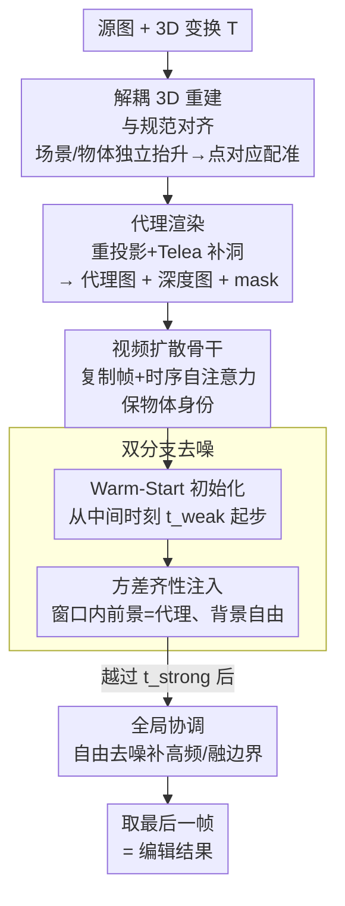

# GeoEdit: Geometry-Aware Object Editing via Dual-Branch Denoising

**会议**: ECCV 2026  
**arXiv**: [2606.30003](https://arxiv.org/abs/2606.30003)  
**代码**: [https://github.com/Heey731/GeoEdit](https://github.com/Heey731/GeoEdit)  
**领域**: 扩散模型 / 图像编辑 / 3D视觉  
**关键词**: 几何感知编辑, 双分支去噪, 方差齐性注入, 免训练, 单图物体操纵

## 一句话总结
GeoEdit 用一条免训练的「抬升-操纵-渲染-去噪」流水线，先把单张照片解耦重建到 3D、按用户指定的 3D 变换（平移/旋转/缩放）渲染出一张几何对齐的粗代理图，再用「双分支去噪」在去噪窗口内以方差齐性的方式把 3D 约束只注入前景、让背景自由生成，从而在遵守透视/遮挡等物理约束的同时兼顾前景刚性与背景真实感。

## 研究背景与动机
在一张照片里把某个物体精确地平移、旋转、缩放，同时让结果符合透视、遮挡和场景几何——这是内容创作和 AR 里很实用、但扩散编辑器至今没解决好的任务。当前主流做法是基于 mask 的 2D inpainting（如 RePaint），它整个跑在像素平面上，因此有三个系统性毛病：一是没有 3D 空间意识，直接在图像坐标里挪物体会破坏透视、把几何拉歪；二是扩散模型的强生成先验会在物体的旧位置残留出一个「幽灵」（ghosting）；三是如果硬把 hard mask 之类的结构代理塞进 latent，会造成分布错配——突兀的干预打破了 Diffusion Transformer 假设的方差齐性（variance homogeneity），随之而来的自注意力泄漏（self-attention leakage）会让背景发糊、结构坍塌。DragGAN/DragDiffusion 这类点操纵、以及 GeoDiffuser、Diffusion Handles、Object-3DIT 这些注入 3D 条件的工作，要么困于平面内变换、要么依赖合成数据存在 sim-to-real gap，要么像 3DitScene 那样靠 SDS 逐场景优化、算力高且几何正确性偏弱。

这些失败其实指向同一个被忽视的结构性事实：编辑后的前景和被掀开的背景，对生成提出的是**不对称**的要求。挪走的物体必须刚性地服从一套预定的 3D 几何，而暴露出来的背景——此刻既有去遮挡后的空洞、又有原物体留下的「脚印」——恰恰需要生成自由度去合成看得过去的内容。用一条统一的去噪轨迹同时满足这两者，本质上是做不到的：给足自由度背景就真实了、前景骨架却漂移；压死自由度几何是守住了、背景却停留在粗糙代理的伪影上。

本文的切入角度是：既然一条轨迹满足不了，就让前景和背景在同一次去噪里走**不同的待遇**，而衔接两者的关键是别破坏预训练 DiT 的 latent 统计量。**核心 idea：把编辑抬升进 3D 得到几何对齐的代理，再用「双分支去噪」——复用视频扩散骨干的时序先验免训练地保住物体身份，在一个狭窄去噪窗口内以「方差齐性注入」把 3D 约束只打进前景、背景则自由去噪；因为注入信号与该时刻噪声调度规定的方差完全一致，自注意力看到的是空间齐性的分布，泄漏被压住，前景刚性与背景灵活得以在无需任何训练或改架构的前提下同时成立。**

## 方法详解

### 整体框架
GeoEdit 走的是一条 `2D → 3D → 2D` 的免训练流水线，全程编排现成的预训练模型、不微调任何权重。输入是一张源图 $I_{\text{src}}$ 和用户对目标物体指定的 3D 变换 $\mathcal{T}=\{\mathbf{R},\mathbf{t},s\}$（旋转、平移、缩放）；输出是一张严格遵守 $\mathcal{T}$、且未编辑背景保持一致的真实感合成图。中间分两大块：前半段把场景「抬升-操纵-渲染」成几何对齐的代理图 $I_{\text{proxy}}$ 加一张结构深度图 $D_{\text{rep}}$ 和物体投影 mask $M$；后半段是本文真正的贡献——「双分支去噪」，把这张粗代理变成照片级合成图。

前半段用的是已有技术的组合：先用单目深度/几何模型（VGGT）把源图抬升成一个不完整的 3D 场景，mask 把它切成背景点云与可见前景点云；再对被抠出的前景跑多视角扩散（SV3D）补出被遮挡面、在一个孤立的规范空间里得到一朵几何完整的物体点云；因为完整点云和可见前景点云都源自同一张源图、同像素坐标对应同一物理表面点，就能抽出稠密的 3D-3D 对应，用最小二乘解出把物体配准回全局场景的相似变换（旋转/平移/尺度）。用户在这个统一坐标系里施加想要的 $\mathcal{T}$，然后把原可见前景抠掉、用 Telea 快速行进 inpainting 把空洞粗填出一个结构连续的底色，最后把变换后的 3D 物体重投影上去，得到 $I_{\text{proxy}}$ 与 $D_{\text{rep}}$。此时背景纹理是粗的，交给下游去噪去合成高频细节。

后半段的双分支去噪是关键。它建立在一个深度条件的视频扩散骨干（Wan2.2-VACE）上：把代理图复制成若干相同帧构成一段短序列送进去，骨干的时序自注意力会强制跨帧一致，天然保住物体身份、不需要任何身份专用微调；深度图 $D_{\text{rep}}$ 通过 ControlNet 式控制块注入，充当锚住物体骨架的几何脚手架。在此之上，用 warm-start 从中间时刻起步、并在一个精心选定的去噪窗口内做 variance-homogeneous injection，只替换前景 latent、背景自由演化，窗口外则完全放开让先验去掉旧物体并补全背景。整条流程如下图。

### 关键设计

**1. 解耦 3D 重建与对应感知对齐：绕开单目抬升的遮挡歧义，把物体真正搬进场景坐标系**

单张图抬升 3D 最大的坑是遮挡——你看不到物体背面，直接整体抬升会把不可见面塞成一坨错误几何。GeoEdit 的做法是**把场景和物体分开重建**：先用 VGGT 把整图抬成不完整场景并按 mask 切出背景与可见前景，再单独对抠出的前景跑多视角扩散（SV3D，生成 21 个新视角）补出被遮挡面，在孤立的规范空间里得到几何完整点云。补完的物体要搬回场景，靠的是一个很干净的观察：完整点云 $\mathcal{P}_{fg}^{\text{comp}}$ 和可见前景点云 $\mathcal{P}_{fg}^{\text{vis}}$ 都来自同一张源图，因此**同一像素坐标 $\mathbf{u}$ 处的点对应同一物理表面点**。据此抽出稠密对应集 $\mathcal{C}=\{(\mathcal{P}_{fg}^{\text{comp}}(\mathbf{u}),\,\mathcal{P}_{fg}^{\text{vis}}(\mathbf{u}))\mid M(\mathbf{u})=1\}$，再用最小二乘解出把补全物体对齐进全局场景的相似变换：

$$\mathop{\arg\min}_{\mathbf{R}_{\text{align}},\,\mathbf{t}_{\text{align}},\,s_{\text{align}}}\sum_{(\mathbf{p},\mathbf{q})\in\mathcal{C}}\left\|s_{\text{align}}\,\mathbf{R}_{\text{align}}\,\mathbf{p}+\mathbf{t}_{\text{align}}-\mathbf{q}\right\|_2^2$$

与其用标准 RANSAC，作者改用确定性最小二乘、再按残差保留前 95% 的内点来抗离群。对齐完成后就有了一个统一坐标系，用户可以在里面精确施加 $\mathcal{T}$。这一步之所以有效，是因为「像素同坐标即物理同点」这个先验免去了任意对应搜索，让补全物体和真实场景严丝合缝，为后续渲染出物理可信的代理打下基础。

**2. 代理渲染：给下游去噪一个既有正确 3D 结构、又结构连续的起点**

物体在 3D 里摆好后要变回 2D 条件。抠掉原可见前景会在源图上留一个暴露的背景空洞，作者不用黑盒启发式，而是用基于快速行进法的 Telea inpainting（邻域半径严格设 3 像素，既连续又不过度模糊）把空洞粗填成一个结构连续的全局底色，再把对齐并变换后的 3D 物体重投影上去，形成几何对齐代理 $I_{\text{proxy}}$ 和结构深度图 $D_{\text{rep}}$。这里的关键取舍是「粗但对」：背景纹理此刻是粗糙的，但它给下游提供了一个结构基线，让去噪阶段有据可依地去合成真实高频，而不是从纯噪声里凭空猜。

**3. 双分支去噪 + 方差齐性注入：让前景刚性与背景自由在一次去噪里并存，而不打破 latent 统计量**

这是全文的数学基石，直接针对「一条轨迹满足不了不对称约束」的痛点。作者先指出，若用 SDEdit 那种单时刻初始化，会陷入两难：初始噪声时刻定大，先验有自由度把背景幻化得真实，却会让规定的 3D 骨架严重漂移；定小则死守代理、背景停在粗糙伪影上。于是把去噪拆成前景/背景两支不对称处理。整个过程从 warm-start 得到的 $z_{t_{\text{weak}}}$ 出发（设计 4），在窗口 $t_{\text{strong}}<t\le t_{\text{weak}}$ 内每一步做**选择性 latent 替换**：前景区不是拿骨干预测值、也不是生替换，而是把代理图**前向加噪到当前时刻**再填进去，背景区保留骨干的预测：

$$\tilde{z}_{t-1}=M\odot\Big(\sqrt{\bar{\alpha}_{t-1}}\,\mathcal{E}(I_{\text{proxy}})+\sqrt{1-\bar{\alpha}_{t-1}}\,\epsilon'\Big)+(1-M)\odot z_{t-1}^{\text{pred}}$$

其中 $z_{t-1}^{\text{pred}}$ 是视频骨干在这一步的预测，$\epsilon'$ 是开头一次性采样、之后**全程复用**的固定高斯噪声。窗口外（$t\le t_{\text{strong}}$）则完全放开、背景在生成先验下自由演化。这个式子里唯一真正承载 trick 的是「前景注入项用的是 $\sqrt{\bar\alpha_{t-1}}$、$\sqrt{1-\bar\alpha_{t-1}}$ 这套**与噪声调度在 $t-1$ 时刻规定的方差完全一致**的系数」——正因为注入信号的方差恰好是原生去噪路径在该时刻应有的方差，它在统计上与原生轨迹不可区分，自注意力看到的是空间齐性分布，泄漏被压住；固定 $\epsilon'$ 则保证被注入代理的结构在各步之间保持一致。这也是它与 Blended Diffusion 的分水岭：后者做 masked blending 但不维护方差齐性，边界处会错配起伪影。为量化验证，作者定义了**注意力泄漏比 ALR**（Attention Leakage Ratio）——背景 query 错误分配给前景代理 token 的注意力质量占比 $\mathrm{ALR}=\mathrm{mean}_{l,h}\, A^{l,h}_{\mathcal{B}\to\mathcal{F}}/A^{l,h}_{\mathcal{B}\to *}$——在泄漏峰值步（$t=46$）方差匹配把 ALR 从 8.4% 降到 6.4%，实证了它抑制泄漏的效果。

**4. Warm-Start 初始化 + 视频骨干时序先验：锚住全局色彩布局与物体身份，无需身份微调**

两个辅助但不可少的设计合在一起讲。其一，作者不从纯噪声（$t=T$）起步以避开其语义歧义，而是把 $I_{\text{proxy}}$ 编码后加噪到一个中间时刻 $t_{\text{weak}}$ 作为反向过程起点，这样从去噪轨迹一开始就确立了全局色彩布局和结构基线、保住场景整体身份（消融显示去掉后 PSNR 从 23.499 掉到 21.320、背景合成不自然）。其二，把视频扩散模型当骨干、并**把代理复制成一段相同帧**，靠其时序自注意力强制跨帧一致——这一步巧妙地把「保物体身份」这个通常要专门微调或加 adapter 的问题，转成免费的副产品；深度图作为几何脚手架在高噪阶段锚住骨架防漂移。作者发现必须用骨干原生的 81 帧上下文才能锁住 3D 刚性，帧数砍到 1/21/41 会导致结构坍塌和「双板」重影，最后取序列末帧为输出。

### 损失函数 / 训练策略
全流程**免训练**、零样本，不微调任何权重，只在预训练 DiT 的反向采样过程里做干预。骨干沿用 Latent Diffusion 的标准去噪目标（预训练自带），本文不引入新 loss。关键超参：扩散调度 $T=50$ 步，warm-start 阈值 $t_{\text{weak}}=47$、注入结束于 $t_{\text{strong}}=40$（该窗口经验最优）；CFG scale 5.0；分辨率 $720\times480$。单卡 A800，3D 抽取阶段约 2 分钟/19 GB 显存，去噪阶段约 16 分钟/44 GB 显存。物体分割单物体用 rembg（U2-Net）、复杂多物体用 SAM2。

## 实验关键数据

### 主实验
在自建 GeoEditBench 的固定 50 对分层子集上零样本评测，覆盖重建保真（PSNR）、身份保持（DINO/CLIP）、感知差异（LPIPS/DreamSim）以及本文新引入的几何正确性指标 PoseMap IoU（预测位姿图与目标位姿图对比）与 Object IoU（轮廓与目标 mask 对齐），另有 AI（VLM）与人类偏好分。

| 方法 | PSNR↑ | DINO↑ | CLIP↑ | LPIPS↓ | DreamSim↓ | PoseMap IoU↑ | Object IoU↑ | 人类偏好↑ |
|------|-------|-------|-------|--------|-----------|--------------|-------------|-----------|
| Qwen-Image | 14.013 | 0.685 | 0.885 | 0.431 | 0.185 | 66.7% | 8.8% | 2.667 |
| NanoBanana | 19.164 | 0.948 | **0.976** | 0.118 | 0.031 | 75.0% | 25.2% | 2.286 |
| 3DiT | 21.532 | 0.771 | 0.941 | 0.371 | 0.084 | 60.0% | 33.5% | 1.191 |
| Flux-Kontext | 20.250 | 0.841 | 0.927 | 0.261 | 0.112 | 66.7% | 51.3% | 2.714 |
| Image Sculpting | 22.101 | 0.802 | 0.939 | 0.147 | 0.104 | 80.0% | 28.2% | 2.619 |
| **GeoEdit（本文）** | **23.499** | **0.961** | 0.952 | **0.114** | **0.027** | **94.9%** | **57.9%** | **4.810** |

GeoEdit 在绝大多数指标上最好：最高 PSNR 23.499、DINO 0.961，最低 LPIPS 0.114、DreamSim 0.027；几何指标尤为突出——PoseMap IoU 94.9%、Object IoU 57.9%，远超次优。CLIP 上 NanoBanana 略高（0.976 vs 0.952），但它几何 IoU 只有 25.2%/中等，本文在几何正确性、身份保持、感知质量、背景保真之间给出最强综合平衡。人类/AI 偏好双双第一（人类 4.810，远高于第二名 Flux-Kontext 2.714；Krippendorff's α=0.74 表明评分者一致性可靠）。作者还在外部 3DEdit-Bench 的 30 例子集上验证泛化：GeoEdit 在 Object IoU 上达 0.460，显著超过靠逐场景 SDS 优化的 3DitScene（0.310）和 NanoBanana（0.134），且算力只需其零头。

### 消融实验
两组消融：时刻窗口 $(t_w,t_s)$ 的取值、以及各核心组件（留一法，unified 50 对协议）。

| 配置 | PSNR↑ | DINO↑ | CLIP↑ | DreamSim↓ | 说明 |
|------|-------|-------|-------|-----------|------|
| Pure Prior (50,50) | 18.479 | 0.894 | 0.921 | 0.057 | 纯先验，几何漂移严重 |
| SDEdit Init (47,47) | 20.724 | 0.932 | 0.921 | 0.044 | 单时刻初始化，几何偏弱 |
| Low Noise Init (40,40) | 21.822 | 0.942 | 0.906 | 0.060 | 低噪守几何但语义受限 |
| Full Injection (50,0) | 20.012 | 0.860 | 0.871 | 0.050 | 全程注入扰乱扩散过程 |
| Pure Proxy (1,1) | 19.465 | 0.812 | 0.806 | 0.084 | 过度注入暴露渲染伪影 |
| **Ours (47,40)** | **23.499** | **0.961** | **0.952** | **0.027** | 标定窗口，最佳平衡 |

| 组件 | PSNR↑ | DINO↑ | CLIP↑ | LPIPS↓ | DreamSim↓ | 说明 |
|------|-------|-------|-------|--------|-----------|------|
| Naive Baseline | 16.217 | 0.835 | 0.890 | 0.253 | 0.049 | 位姿扭曲、背景失真 |
| w/o Warm-Start | 21.320 | 0.943 | 0.942 | 0.134 | 0.043 | 背景合成不自然、光照被改 |
| w/o Variance Homogeneity | 11.494 | 0.314 | 0.682 | 0.520 | 0.240 | 灾难性坍塌 |
| **Ours (Full)** | **23.499** | **0.961** | **0.952** | **0.114** | **0.027** | 完整模型 |

### 关键发现
- **方差齐性注入是命门**：去掉它（用未标定约束替换同步前向加噪）性能灾难性崩塌——DINO 从 0.961 暴跌到 0.314、CLIP 掉到 0.682、DreamSim 飙到 0.240，视觉上出现极端注意力泄漏和渲染伪影。这证实「注入信号的方差必须与噪声调度一致」不是可选项而是稳定生成的前提。
- **去噪窗口是一条几何↔语义的权衡曲线**：初始噪声大（47）给足自由度、CLIP 高但 PSNR 低、几何漂移；调小到 40 则空间对齐好（PSNR 21.822）但语义多样性受限（CLIP 0.906）。作者标定的 $(47,40)$ 窗口在两端之间取到最优，PSNR/DINO/DreamSim 全面最好。
- **Warm-Start 贡献相对温和但必要**：去掉后 PSNR 23.499→21.320、LPIPS 0.114→0.134，主要影响是背景合成自然度与全局光照一致性，说明它负责锚住低频色彩布局。
- **81 帧时序上下文是刚性锚**：帧数砍到 1/21/41 会导致几何严重偏差和「双板」重影，只有原生 81 帧能在注入阶段锁死物体空间刚性——代价是推理慢。

## 亮点与洞察
- **把「不对称生成需求」显式化，是本文最核心的洞见**：前景要刚性、背景要自由，这个二分一旦被点破，双分支去噪就是自然推论。很多前作在一条轨迹里硬凑，正是没看清这个矛盾。
- **方差齐性注入是可复用的通用 trick**：在任何基于扩散的区域约束/局部编辑里，「要往 latent 里塞东西，就把它前向加噪到当前时刻、匹配噪声调度规定的方差」都能用来避免自注意力泄漏和背景发糊，比 Blended Diffusion 的裸 blending 稳得多。
- **用视频骨干的时序自注意力免费换取身份保持**：把单图复制成相同帧序列，让「保 ID」这个通常要微调/加 adapter 的活变成时序一致性的副产品——这个「把静态问题伪装成时序问题」的思路很巧，可迁移到其他需要一致性的单图编辑。
- **ALR 这个指标把「泄漏」从定性变定量**：给出了一个可测量、可对比的注意力泄漏定义（背景 query 分给前景 token 的注意力占比），让「变得更稳」有了数字支撑（8.4%→6.4%）。

## 局限与展望
- **级联误差传播**（作者承认）：整条流水线被中间 3D 点云重建的精度卡脖子——单目深度或多视角合成一旦出错，扭曲会一路传到最终合成图；处理密集遮挡（如物体藏在茂密树叶后）仍困难。
- **极端空间编辑失效**（作者承认）：大幅平移会暴露超出背景先验能力的去遮挡区域导致 inpainting 失败；大幅旋转要幻化大量未见背面，易糊或不一致。
- **算力/延迟高**（作者承认）：为锁住 3D 刚性必须用视频骨干的原生 81 帧上下文，去噪阶段约 16 分钟/44 GB 显存，远慢于单步 2D 编辑器；未来想探索轻量微调与更高效架构。
- **依赖学习先验、缺物理渲染**（作者承认）：视角相关光照、阴影、镜面/玻璃反射靠生成先验合成而非显式物理建模，难以严格模拟；未来考虑引入 PBR 引导。
- 我的观察：评测主表只在固定 50 对子集上，规模偏小；PoseMap/Object IoU 依赖外部估计器，其误差会混入几何评分，横向比较时需留意。Object IoU 本文最高也只有 57.9%，说明「几何严格正确」这件事整体仍远未解决。

## 相关工作与启发
- **vs 2D mask-based 编辑（RePaint / InstructPix2Pix / DragDiffusion）**：它们全在像素平面操作、缺 3D 空间推理，做不了出平面变换且易 ghosting；本文把编辑抬升进 3D，前景遵循刚性几何、背景才自由生成。
- **vs 注入 3D 条件的扩散编辑（GeoDiffuser / Diffusion Handles / Object-3DIT）**：Object-3DIT 靠合成数据、存在 sim-to-real gap；本文用单目抬升支持完整刚性变换（旋转+缩放），无需外部 3D 软件或合成数据。
- **vs 3DitScene（SDS + 3D Gaussian）**：语义对齐虽具竞争力，但 SDS 逐场景优化算力高、几何正确性偏弱、常有 ghosting；本文免训练、Object IoU 显著更高且快得多。
- **vs BlenderFusion / ObjectMover**：BlenderFusion 需外部 3D 软件；ObjectMover 用视频先验但主要做平移。本文同样借视频先验，却覆盖平移/旋转/缩放/相机移动全谱。
- **vs Time-to-Move / Blended Diffusion / SDEdit**：借鉴了 Time-to-Move 的区域相关调度思想，但把它落到「方差齐性注入」上——严格维护 latent 统计量、抑制自注意力泄漏，是相较 Blended Diffusion 裸 blending、SDEdit 单时刻初始化的关键改进。

## 评分
- 新颖性: ⭐⭐⭐⭐ 「不对称约束」洞见清晰、方差齐性注入是漂亮的机制创新；但整条抬升-渲染流水线基本组合现成模型，创新集中在去噪阶段。
- 实验充分度: ⭐⭐⭐⭐ 主表+两组消融+外部 benchmark+人类/AI 双评+ALR 定量分析，覆盖到位；扣分在主表子集仅 50 对、几何指标依赖外部估计器。
- 写作质量: ⭐⭐⭐⭐⭐ 矛盾定义-方法-验证一线贯通，Algorithm 1 与公式把机制讲得干净，图 4/6/7 的权衡可视化很有说服力。
- 价值: ⭐⭐⭐⭐ 免训练、零样本就能做物理可信的 3D 物体编辑，对 AR/内容创作实用；方差齐性注入这个 trick 的可复用性拉高了它的价值上限，主要短板是速度。

<!-- RELATED:START -->

## 相关论文

- [\[ECCV 2026\] OTCache: Optimal Transport for Geometry-Aware Caching in Diffusion Models](otcache_optimal_transport_for_geometry-aware_caching_in_diffusion_models.md)
- [\[ICML 2026\] Geometry-Aware Tabular Diffusion](../../ICML2026/image_generation/geometry-aware_tabular_diffusion.md)
- [\[ICLR 2026\] Dragging with Geometry: From Pixels to Geometry-Guided Image Editing](../../ICLR2026/image_generation/dragging_with_geometry_from_pixels_to_geometry-guided_image_editing.md)
- [\[ECCV 2026\] Dual-End Consistency Model](dual-end_consistency_model.md)
- [\[ICML 2026\] Geometry-Aware Dataset Condensation for Diffusion Model Training](../../ICML2026/image_generation/geometry-aware_dataset_condensation_for_diffusion_model_training.md)

<!-- RELATED:END -->
