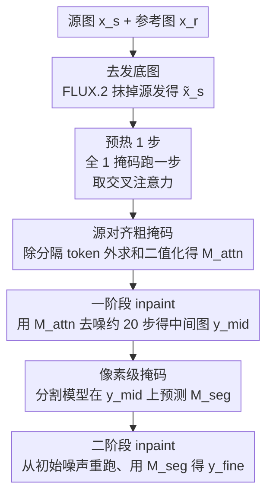

# H-Adapter: Pose-Robust Hairstyle Transfer via Attention-Derived, Source-Aligned Hair Masks

**会议**: ECCV 2026  
**arXiv**: [2606.25578](https://arxiv.org/abs/2606.25578)  
**代码**: 无  
**领域**: 图像生成 / 扩散模型  
**关键词**: 发型迁移, 扩散 inpainting, 交叉注意力, 区域特定损失, 姿态鲁棒

## 一句话总结
H-Adapter 用一个「区域特定损失」把 IP-Adapter 微调成只在头发区域注入参考发型、在非头发区域保持原样的适配器，训练后的交叉注意力自然分离出头发/非头发，从中导出一张与源头姿态对齐的粗掩码来引导两阶段扩散 inpainting，从而在源图与参考图头姿差异很大时也能把发型放对位置、贴合脸型。

## 研究背景与动机
发型迁移的目标是把参考图的发色和发型形状搬到源图上、同时保住源图的身份、背景和衣着，虚拟试发这类应用让它成了一个有实际价值的图像编辑任务。难点在于这是一个「区域依赖」的任务：模型要在头发区域反映参考的发型特征，又要在非头发区域原封不动地保留源内容，这两个目标天然冲突，稍不注意编辑就会外溢、把脸和背景一起改了。更棘手的是头发是非刚性的、强烈依赖头姿——头一转，头发的空间位置和轮廓就大幅改变，所以当源图和参考图头姿差异很大时，模型必须先想清楚「头发应该出现在源头几何的哪个位置、大概什么形状」，这正是现有方法最容易翻车的地方。

过去的主力是 GAN 类方法（Barbershop、Style-Your-Hair、HairFastGAN 等），它们通常依赖对齐好的人脸数据集，在受控场景下有效，但在无约束图像上鲁棒性有限；后来出现的扩散类方法（Stable-Hair、HairFusion）想提升泛化，可在姿态不匹配下仍有两种常见失败：一是头发区域定位不准，导致编辑放错位置或过度外扩；二是即便全局位置合理，也难以复现参考的细粒度结构与纹理。这些方法要么依赖显式的对齐、要么往注意力里硬塞姿态线索（如 DensePose）、要么做隐码变换，本质都是从外部引入姿态信息去纠正定位。作者观察到一个更省事的路子：IP-Adapter 这类图像条件适配器本身就是通过交叉注意力注入参考特征的，如果能让它的注意力自己学会「哪里是头发、哪里不是」，那这张注意力图就直接是一份与源图对齐的空间指引，根本不需要外部姿态先验。

问题是标准 IP-Adapter 是被训练成「全局」注入条件的，直接拿来做发型迁移会把参考特征糊到整张脸上，注意力也分不出头发和非头发。**核心 idea 是：用一个区域特定损失重训 IP-Adapter——头发区域照常做去噪、非头发区域则被正则化去对齐原始扩散模型的预测，逼着适配器只在头发处生效；这样训练出的交叉注意力会在头发与非头发之间形成清晰空间分离，从中二值化出一张与源姿态对齐的粗掩码，再用它约束两阶段 inpainting，把发型放到贴合源头几何的位置。**

## 方法详解

### 整体框架
给定源图 $x_s$ 和参考图 $x_r$，目标是把参考发型迁到源图上、同时保住非头发内容。整套方法分三块：一是用区域特定损失把 IP-Adapter 训练成「只关注头发区」的 H-Adapter（训练侧）；二是推理时用一个源对齐的粗注意力掩码把扩散 inpainting 限制在目标头发区，采用「预热 → 一阶段 → 二阶段」的由粗到精流程；三是靠适配器的即插即用特性衍生出文生图、发色控制、身份保持等扩展用法。

训练在标准文生图骨干（SD v1.5）上进行，推理时换成 inpainting 变体。训练数据由三元组 $(x_i, x_j, M_i)$ 构成：$x_i$ 是目标图、$x_j$ 是 IP-Adapter 的条件图、$M_i$ 是从 $x_i$ 抽的二值头发掩码；FFHQ 用自配对（$x_j=x_i$，同一张图既当参考又当目标），CelebV-HQ 用同一身份的两帧（$x_i\ne x_j$，两帧姿态/表情不同）。推理时先用一个指令式编辑模型（FLUX.2）把源图变成「去发的秃头底图」$\tilde{x}_s$，再在这张底图上做 inpainting。

下面这张图描述推理侧的由粗到精流程（训练侧的区域特定损失见「关键设计 1」）：

### 关键设计

**1. 区域特定损失：把「只改头发、别碰其它」写进训练目标**

标准 IP-Adapter 的问题是它被训练成全局注入条件，直接拿来迁发型会连脸带背景一起被参考特征污染，注意力也分不出头发。作者的做法是把去噪损失拆成两半、各管一个区域。头发区里照常做扩散去噪，但只在掩码 $M$ 内计算——即让加了 H-Adapter 的噪声预测器去拟合真实噪声，这样参考发型的外观只在头发处被学到：

$$\mathcal{L}_{\mathrm{hair}}=\mathbb{E}_{z,\epsilon,t}\left[\left\|(\epsilon-\epsilon_{\theta_{\mathrm{H}}}(z_t,t,c_t,c_i))\cdot M\right\|_2^2\right]$$

非头发区则反过来：不去拟合真实噪声，而是正则化 H-Adapter 的输出去贴近「不带适配器的原始扩散模型」$\epsilon_{\theta_0}$ 的预测，等于告诉模型「这些地方你别插手，保持原样就好」：

$$\mathcal{L}_{\mathrm{non\text{-}hair}}=\mathbb{E}_{z,\epsilon,t}\left[\left\|(\epsilon_{\theta_{\mathrm{H}}}(z_t,t,c_t,c_i)-\epsilon_{\theta_0}(z_t,t,c_t))\cdot(1-M)\right\|_2^2\right]$$

总损失是两项之和，非头发项权重 $\lambda_{\mathrm{non\text{-}hair}}$ 全程取 0.1。这个设计的巧妙之处在于：它不是简单地在头发区加监督，而是显式地在非头发区「锚定」到预训练模型，把「哪里能改、哪里不能改」变成了两个方向相反的目标；正因为条件分支被逼着只对头发负责，它的交叉注意力才会自发地在头发与非头发之间拉开空间距离——这份分离度正是后面导出掩码的基础。

**2. 源对齐的粗注意力掩码：从注意力里免费捞出一张「头发在哪」的空间图**

区域特定损失训练出的交叉注意力有一个可利用的副产物：16 个 IP-Adapter token 里，恰好有一个 token（记作分隔 token $t_s$）稳定地只关注非头发区、充当「分隔符」，其余 token 则主要聚焦头发区。于是把除分隔 token 外的所有 token 的交叉注意力图求和、再二值化，就得到一张注意力导出的粗 inpainting 掩码 $M_{\mathrm{attn}}=\mathrm{Binarize}\left(\sum_{k\ne s}\mathrm{CA}(t_k)\right)$。实现中 $K=16$，作者通过实验发现 $t_8$ 就是那个分隔 token。

为什么是 $t_8$、以及它为什么稳定，作者做了两层验证。一是在自配对、有真值头发掩码的受控设置下，逐个把 16 个 token 当候选分隔符，比较「排除该 token 后聚合出的掩码」与「只用该 token 的掩码」两者与真值的 IoU、取较大值，结果 $t_8$ 在 3000 个样本上取得最高平均 IoU（0.549）。二是从 value 向量范数看，$t_8$ 在预训练 IP-Adapter 里本来就范数最小（对注入参考外观贡献弱），区域特定损失进一步把它的相对范数从约 0.22 压到 0.15，同时它的注意力图跨随机种子都稳定对齐非头发区——说明这不是单次运行的偶然，而是训练把一个原本微弱的 token 级偏置放大成了一个稳定的非头发分隔符。掩码分辨率上，作者比较了 8×8/16×16/32×32 后选定 16×16，因为它对头发整体范围的粗定位粒度最合适、平均 IoU 最高。

**3. 两阶段由粗到精 inpainting（含预热步）：粗掩码定位、细掩码精修**

注意力导出的 $M_{\mathrm{attn}}$ 只是粗定位、不足以做最终像素级编辑，所以作者设计了「预热 + 两阶段」的由粗到精流程。难点是推理一开始根本没有源对齐掩码，作者的解法是先用全 1 掩码跑一个预热去噪步，专门为了抽出交叉注意力、从中导出 $M_{\mathrm{attn}}$。拿到 $M_{\mathrm{attn}}$ 后，一阶段用它做约 20 步去噪，得到一张中间图 $y_{\mathrm{mid}}$——这张图虽然掩码粗、可能含杂散区域，但已经保住了源头的姿态和形状。二阶段则请一个预训练分割模型（BiSeNet）在 $y_{\mathrm{mid}}$ 上预测像素级头发掩码 $M_{\mathrm{seg}}$，再从初始噪声潜变量 $z_T$ 重新起跑、以 $M_{\mathrm{seg}}$ 为 inpainting 掩码得到最终结果 $y_{\mathrm{fine}}$。

这个「先粗后细、逐步提高空间精度」的策略是姿态鲁棒的关键：作为对比，不带区域特定损失的 IP-Adapter 基线注意力弥散、二值化后掩码几乎全为 1，编辑近乎全局；即便退而用它稳定强调面部的 $t_2$ 掩码，也会引起轮廓漂移、传播到错位的 $M_{\mathrm{seg}}$、最终边界漂移。而 H-Adapter 因为一阶段就给出了源对齐的引导，二阶段才能抽出准确的像素级掩码，把编辑牢牢限制在头发区。

**4. 逐时间步的参考门控与即插即用扩展：让同一个适配器兼容多种下游**

除了把掩码用于两阶段流程，作者还在每个时间步重算一张空间掩码 $M_t$ 去门控交叉注意力里的参考注入项：标准交叉注意力照常算，参考分支的贡献则被 $M_t$ 逐元素相乘、再以权重 $\lambda$ 加回，$\lambda$ 越小越听文本提示、越大越忠于参考发型：

$$Z=\mathrm{softmax}\!\left(\frac{QK^{\top}}{\sqrt{d}}\right)V+\lambda\Bigl(M_t\odot\mathrm{softmax}\!\left(\frac{Q{K'}^{\top}}{\sqrt{d}}\right)V'\Bigr)$$

其中 $(K,V)$ 来自标准文本上下文、$(K',V')$ 来自 H-Adapter 的参考条件。正是这套门控机制让 H-Adapter「训练一次、即插即用」：它能不改源图条件直接做参考引导的文生图；能加一句发色提示（如「a photo of a person with blue hair」）做辅助发色控制；还能和身份保持适配器（IP-Adapter FaceID Plus）组合——此时把 H-Adapter 分支用头发掩码 $M_t$ 门控、FaceID 分支用互补掩码 $1-M_t$ 门控，就能既换发型又保住身份，且这些扩展都无需重训。

### 损失函数 / 训练策略
最终目标为 $\mathcal{L}=\mathcal{L}_{\mathrm{hair}}+\lambda_{\mathrm{non\text{-}hair}}\mathcal{L}_{\mathrm{non\text{-}hair}}$，$\lambda_{\mathrm{non\text{-}hair}}=0.1$。H-Adapter 从 IP-Adapter-Plus 权重初始化、在 SD v1.5 上微调，图像编码器用 CLIP-ViT-H-14；文本条件训练时固定用通用提示「a photo of a person」。数据经清洗后含 68,058 张 FFHQ 图（自配对）和 9,188 对 CelebV-HQ（同身份、选 yaw 差异最大的帧对）；单张 RTX 5090 训练 16,000 步、batch size 8、学习率 $1\times10^{-4}$。推理单对耗时约 3.05 秒，慢于 HairFastGAN（0.78s）但快于 Stable-Hair（8.82s）和 HairFusion（66.28s）。

## 实验关键数据

### 主实验
在 CelebA-HQ 上构建两个各 3000 对的评测子集：pose-agnostic（不控头姿）与 pose-different（源参考 yaw 差 >15°）。指标含 FID / FIDCLIP（视觉真实度）、SSIM / PSNR（非头发区保持，在非头发交集上算）、CLIP-I（发型迁移忠实度）。下表为 pose-different 子集主结果：

| 方法 | FID ↓ | FIDCLIP ↓ | SSIM ↑ | PSNR ↑ | CLIP-I ↑ |
|------|-------|-----------|--------|--------|----------|
| **Ours** | **12.47** | **3.98** | 0.831（次优） | 23.06 | **0.659** |
| IP-Adapter (t8) | 15.27 | 8.83 | 0.803 | 21.56 | 0.639 |
| IP-Adapter (t2) | 12.53 | 4.26 | 0.825 | 22.70 | 0.651 |
| FLUX.2 | 12.66 | 5.18 | **0.904** | **25.35** | 0.643 |
| HairFusion | 28.03 | 8.80 | 0.756 | 17.26 | 0.626 |
| Stable-Hair | 25.79 | 8.70 | 0.798 | 22.39 | 0.640 |
| HairFastGAN | 12.78 | 4.53 | 0.817 | 24.40 | 0.649 |
| HairCLIPv2 | 13.44 | 7.91 | 0.824 | 23.63 | 0.623 |
| Style-Your-Hair | 15.95 | 8.54 | 0.816 | 22.80 | 0.649 |

本文在 FID / FIDCLIP / CLIP-I 三项上全部最优。FLUX.2 拿下 SSIM / PSNR 最高（源保持强），但在 FID / FIDCLIP / CLIP-I 上均逊于本文；本文 SSIM 次优、PSNR 有竞争力，说明它在「忠实迁发型」与「保住非头发」之间取得了更好平衡。pose-agnostic 子集趋势一致，本文 FID / FIDCLIP / SSIM / CLIP-I 均最优。

VLM-as-a-judge（GPT-4o 为代表评委，一致性 Krippendorff's α ≥0.90）沿三个轴打 1–5 分：HFS（发型忠实度）、NPS（非头发保持）、AQS（伪影质量，越无接缝/色溢越高）：

| 方法 | HFS ↑ | NPS ↑ | AQS ↑ |
|------|-------|-------|-------|
| **Ours** | **3.11** | **4.23** | **3.73** |
| HairFusion | 2.55 | 3.55 | 3.09 |
| Stable-Hair | 2.90 | 3.42 | 2.75 |
| HairFastGAN | 2.83 | 3.91 | 3.29 |
| HairCLIPv2 | 2.10 | 4.05 | 3.57 |
| Style-Your-Hair | 2.87 | 3.98 | 3.61 |

本文三个轴全部最高，且是唯一 HFS 超过 3.0 的方法（评分普遍偏低是因为评分标准严格，要求颜色/纹理/长度/轮廓/分缝同时匹配）。其它基线各有短板：HairCLIPv2 NPS 高但 HFS 垫底，Stable-Hair 反之。53 名受试者的 3193 次成对偏好投票中，本文以 72.7% 的整体偏好率胜过所有基线（对 HairFastGAN 差距最小、55.3%，对 HairCLIPv2/HairFusion 达 80%+）。

### 消融实验

| 配置 | 关键指标（pose-different） | 说明 |
|------|--------------------------|------|
| Ours（FFHQ + CelebV-HQ） | SSIM 0.830 / PSNR 23.05 | 完整训练数据 |
| Ours w/o CelebV-HQ | SSIM 0.761 / PSNR 18.35 | 去掉跨帧对，SSIM/PSNR 大幅下降 |
| Ours（t8 掩码，注意力抽取） | 见主表 | 完整流程 |
| w/o 区域特定损失（IP-Adapter t8） | FID 15.27 / FIDCLIP 8.83 | 注意力弥散、掩码近全局 |
| w/o 区域特定损失（IP-Adapter t2） | FID 12.53 / FIDCLIP 4.26 | 换 t2 掩码仍轮廓漂移 |

### 关键发现
- 区域特定损失是「源对齐掩码」能成立的根本：去掉它的 IP-Adapter 基线在 $t_8$ 上得不到可靠分隔 token，注意力弥散、二值化后掩码几乎全 1、导致近全局编辑；即便退用 $t_2$ 掩码也会轮廓漂移。它把注意力从「全局糊」变成了「头发/非头发分离」的可用定位信号。
- 加入 CelebV-HQ 跨帧对主要提升 SSIM / PSNR（去掉后分别从 0.830 掉到 0.761、23.05 掉到 18.35）：因为参考帧与目标帧同身份但姿态表情不同，逼模型学到非头发区更强的不变性、避免多余改动；而 CLIP-I 两种数据组成下相当，说明单靠自配对也能捕到发型属性。
- 掩码分辨率 16×16 与真值头发掩码 IoU 最高，太粗抓不准范围、太细易被高频结构主导；分隔 token 选择上 $t_8$ 平均 IoU 最高且 value 范数分析证明其稳定性，非随机指定。
- 受控实验（所有方法都用同一去发底图）下本文 FID/FIDCLIP/CLIP-I 仍全优，说明优势不能仅归因于 FLUX 去发输入；多数基线在秃头底图上因分布偏移反而变差。

## 亮点与洞察
- 最「啊哈」的点是把训练损失的区域结构直接转化为注意力的空间结构：不往模型里塞任何姿态先验，只是让损失在头发区做去噪、在非头发区锚定原模型，交叉注意力就自发学会了分离头发——省事、且掩码天然与源姿态对齐。
- 「分隔 token」的发现很巧妙：16 个 token 里恰有一个稳定只看非头发区，把它剔掉再聚合就得到头发掩码。而且作者没停在现象层面，用 value 范数分析证明区域特定损失是「放大了一个预存的弱偏置」而非制造偶然，可信度高。
- 用全 1 掩码跑一个「预热步」专门抽注意力、再进两阶段的做法，优雅地解决了「推理初始没有掩码」这个鸡生蛋问题，可迁移到其它需要「从注意力自举出空间掩码」的编辑任务。
- 逐时间步门控 + 互补掩码（头发分支用 $M_t$、身份分支用 $1-M_t$）让同一个适配器免重训就能兼容文生图、发色控制、身份保持，是很实用的即插即用设计范式。

## 局限与展望
- 作者承认仅在 SD1.5 / IP-Adapter-Plus 骨干上验证；不同骨干与适配器的 token 行为、注意力模式可能不同，分隔 token 选择与掩码抽取策略需针对新架构重新适配。
- benchmark 只覆盖无头部遮挡的人脸，戴帽子/围巾/头盔等场景不在范围内；鲁棒地把头发与非头发头部覆盖物区分开仍是开放难题。
- 作者观察到的失败案例：模型有时保不住参考特有的「头发与脸部结构的空间关系」，如刘海相对额头/眉毛的延伸方式；细粒度的发型-脸部几何关系建模仍是短板。
- 依赖外部组件（FLUX.2 去发、BiSeNet 分割），流程较长、单对 3.05 秒虽快于扩散基线但慢于 GAN 编码器方法，且底图去发质量会影响下游。

## 相关工作与启发
- **vs HairFusion**：两者都用交叉注意力取空间线索，但 HairFusion 是把姿态线索（DensePose）注入注意力、在最后 n 步做潜空间混合、掩码还要再和源头发掩码结合；本文靠区域特定训练直接提升信号选择性，导出的粗掩码更紧贴头发区，而 HairFusion 的掩码倾向外扩到邻近视觉上下文。
- **vs HairFastGAN**：后者是 GAN 编码器方法、引入 Rotate Encoder 变换人脸隐码来实现姿态感知迁移；本文不做隐码变换，走扩散 inpainting 路线，质量指标（FID/CLIP-I）更优但速度慢（3.05s vs 0.78s）。
- **vs MasaCtrl / DiffEdit / InstDiffEdit**：这些从注意力/噪声差异导出编辑掩码的工作面向通用编辑定位；本文专攻姿态不匹配下的发型迁移，导出的是「源对齐的头发掩码」，且掩码分离能力来自专门的区域特定训练而非通用注意力操控。
- **vs 直接用 IP-Adapter**：标准 IP-Adapter 全局注入条件、会污染非头发区、注意力分不出头发；本文的区域特定损失是把它从「全局适配器」改造成「头发专用适配器」的关键一步。

## 评分
- 新颖性: ⭐⭐⭐⭐ 「用损失的区域结构诱导注意力的空间分离、再自举出源对齐掩码」这个思路清晰且省事，分隔 token 的发现与论证有说服力。
- 实验充分度: ⭐⭐⭐⭐⭐ 定量 + 定性 + 三评委 VLM judge + 人类偏好 + 受控去发实验 + 掩码分辨率/分隔 token/训练数据多组消融，覆盖很全。
- 写作质量: ⭐⭐⭐⭐ 方法与分析条理清晰，附录把分隔 token 的稳定性论证得很扎实；两阶段流程首次读稍需对照图。
- 价值: ⭐⭐⭐⭐ 虚拟试发有明确落地场景，即插即用扩展实用；但绑定 SD1.5 骨干、依赖外部去发/分割，泛化到新骨干仍需工作。

<!-- RELATED:START -->

## 相关论文

- [\[ECCV 2026\] Phase-Aligned RoPE for Mixed-Resolution Diffusion Transformer](phase-aligned_rope_for_mixed-resolution_diffusion_transformer.md)
- [\[ICLR 2026\] Mod-Adapter: Tuning-Free and Versatile Multi-concept Personalization via Modulation Adapter](../../ICLR2026/image_generation/mod-adapter_tuning-free_and_versatile_multi-concept_personalization_via_modulati.md)
- [\[ICLR 2026\] Partition Generative Modeling: Masked Modeling Without Masks](../../ICLR2026/image_generation/partition_generative_modeling_masked_modeling_without_masks.md)
- [\[ICCV 2025\] DPoser-X: Diffusion Model as Robust 3D Whole-Body Human Pose Prior](../../ICCV2025/image_generation/dposer-x_diffusion_model_as_robust_3d_whole-body_human_pose_prior.md)
- [\[ECCV 2026\] Anchoring on Reality: Breaking the Pseudo-Target Ceiling in Makeup Transfer](anchoring_on_reality_breaking_the_pseudo-target_ceiling_in_makeup_transfer.md)

<!-- RELATED:END -->
