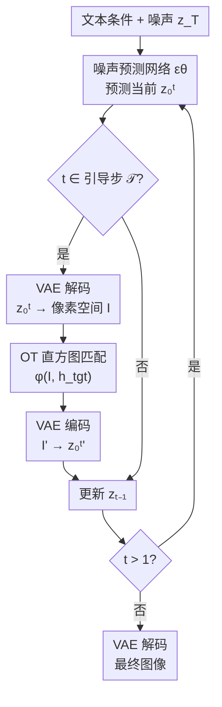

# Histogram-constrained Image Generation

**会议**: ECCV2026  
**arXiv**: [2606.31683](https://arxiv.org/abs/2606.31683)  
**代码**: 无（项目页面 [https://maps-research.github.io/hig/](https://maps-research.github.io/hig/)）  
**领域**: image_generation  
**关键词**: 直方图约束, 最优传输, 扩散模型, 可控生成, 信息嵌入

## 一句话总结

本文提出 HIG，在扩散模型采样过程中利用最优传输（OT）将中间预测显式变换为与目标直方图精确匹配的分布，从而在直方图粒度实现精确、可解释、训练无关的可控生成，并拓展到高容量信息嵌入和隐空间直方图匹配。

## 研究背景与动机

扩散模型在图像生成领域取得了统治性地位，随之而来的是大量可控生成工作。按控制信号的粒度排序，现有方法大致分布在一条谱线的两端：一端是文本提示、LoRA 风格微调等高层控制，它们给出抽象的语义或风格约束，扩散过程保留大量自由发挥空间；另一端是 ControlNet 及其变体，利用边缘图、深度图、姿态骨架等稠密信号对生成结构的每个局部做精细约束。这两种粒度的方案各自适配不同场景，但两者之间存在着一个天然的空白地带——分布级控制。所谓分布级控制，指的是不逐像素指定内容，也不只给定一个语义标签，而是对生成图像的全局统计属性（如颜色直方图、潜空间 token 频次分布）施加精确约束。这种控制粒度在风格迁移、光照统一、多张图像保持色彩一致性、乃至信息隐藏等场景中都有直接需求，却缺乏一种既能精确满足分布约束、又不对图像质量造成严重破坏的通用方案。

现有方法在处理直方图级约束时面临一个根本矛盾：直接对最终生成图像做后处理匹配（如直方图规定化）虽然能精确吻合目标分布，但这种刚性重映射忽略了像素之间的空间连续性，往往导致局部颜色断裂、伪影明显；而如果在生成过程中通过可微损失反向传播来引导模型，代价是每步都需要计算梯度且无法保证约束的精确满足，这对扩散模型数十步的采样来说计算开销很大。更重要的是，这些方案都难以扩展到潜空间 token 分布的控制——当分布定义在离散码本上时，可微逼近更是失去了意义。因此，一个既能精确满足分布约束、训练无关、又能与现有控制方案正交兼容的中间粒度控制机制，是可控生成中一个值得深入的方向。

本文的核心洞察是：最优传输理论天然适配分布约束问题——给定源分布和目标分布，OT 能求解出最小代价的搬运方案，保证目标分布被精确满足且变换代价最小。基于这个思路，本文提出 HIG（Histogram-constrained Image Generation），在扩散模型的采样过程中，对选定的中间时间步，将当前预测的隐编码解码到像素（或 token）空间，以 OT 求解其到目标直方图的最小代价变换，再编码回隐空间继续采样。**核心 idea：将直方图约束建模为最优传输问题，在扩散采样的关键时间步对中间预测施加最小代价显式变换，从而以训练无关的方式精确满足分布约束，同时保留扩散模型的后续精化能力来消除刚性变换带来的伪影。**

## 方法详解

### 整体框架

HIG 的核心思想十分简洁：在标准 DDIM 采样的循环中，选定一组引导时间步 $\mathcal{T}$，在这些步上对当前预测的干净图像 $\mathbf{z}_0^t$ 执行解码—OT变换—编码的干预流程，使其中间结果精确匹配目标直方图；非引导步则沿用标准更新。这个范式不改变扩散模型的网络结构，也不引入任何额外参数，只需在推理时插装一个可配置的变换模块。

下图展示了 HIG 的整体采样流程。虚线框内是 HIG 的核心介入点——在常规的去噪循环中插入一个显式的分布变换步骤：

从数学上看，在每个时间步 $t$，扩散模型先预测当前对最终图像的估计 $\mathbf{z}_0^t = \frac{1}{\sqrt{\bar{\alpha}_t}}\mathbf{z}_t - \frac{\sqrt{1-\bar{\alpha}_t}}{\sqrt{\bar{\alpha}_t}}\epsilon_\theta(\mathbf{z}_t,\mathbf{c},t)$。如果 $t \in \mathcal{T}$，则将 $\mathbf{z}_0^t$ 解码到像素空间，应用 OT 变换 $\varphi$，再编码回隐空间得到 $\mathbf{z}_0^{t'}$，最后用变换后的值计算下一时间步的隐变量：

$$\mathbf{z}_{t-1} = \sqrt{\bar{\alpha}_{t-1}}\,\mathbf{z}_0^{t'} + \sqrt{1-\bar{\alpha}_{t-1}}\,\epsilon_\theta(\mathbf{z}_t,\mathbf{c},t)$$

非引导步则直接使用原始的 $\mathbf{z}_0^t$。这种设计的精妙之处在于，后续的扩散步骤会对被 OT 干预过的结果继续做精化去噪，因此即使 OT 变换引入了某些不自然的硬边界或局部伪影，模型也有机会在剩余步数中将其平滑掉。

### 关键设计

**1. 基于最优传输的直方图精确匹配：将分布约束转化为最小代价搬运问题**

HIG 的核心是把"让图像的像素值分布等于目标直方图"这一约束转化为一个最优传输问题。给定一张图像，先统计其像素颜色落在每个 bin 中的数量得到源直方图 $\mathbf{h}^{src}$，目标直方图 $\mathbf{h}^{tgt}$ 由用户指定（可以从参考图像提取或通过其他方式构造）。OT 问题求解一个传输计划 $\gamma$，在保证 $\gamma$ 的行和等于 $\mathbf{h}^{src}$、列和等于 $\mathbf{h}^{tgt}$ 的约束下，最小化 $\langle \gamma, \mathbf{M} \rangle_F$，其中 $\mathbf{M}$ 是预计算的 bin 间距离代价矩阵。得到的 $\gamma$ 明确指示了每个源 bin 中有多少比例的像素需要搬运到哪个目标 bin。执行时，HIG 从每个源 bin 中随机采样对应数量的像素，将其颜色值设置为目标 bin 的代表色，从而在精确满足目标直方图的同时使总变换代价最小。论文采用经典的 Network Simplex 算法求解 OT 问题，对于 $1024^2$ 图像、$d=4096$ 个 bin 的配置，求解耗时约 0.2 秒，对推理整体延迟影响很小。

**2. 多选项 Binning：在 bin 级约束下保留颜色之间的感知相似性**

单选项 binning 将每个 bin 对应到一个具体的颜色值（如 RGB 空间的一个小立方体），当目标直方图与源直方图差异较大时，这种刚性映射容易产生视觉伪影——某个像素被强制分配到与原始值差异巨大的色块上，产生孤立的不自然像素点。为了解决这个问题，HIG 引入多选项 binning：每个 bin 包含 $k$ 个候选颜色值，OT 传输计划只约束每个 bin 的总像素数量，但具体分配到 bin 内的哪个候选值则是灵活的。形式上，OT 计划变为一个 $kd \times d$ 的矩阵，代价矩阵 $\mathbf{M}_{ik+j,p} = \min_q \text{dist}(\mathbf{v}_{ik+j}, \mathbf{v}_{pk+q})$，即每个源选项到目标 bin 的最小距离为代价。这样，在满足 bin 级直方图约束的前提下，每个像素都能自动选择视觉上最接近的目标候选值，显著减少了刚性匹配导致的视觉失真。论文实验显示，多选项 binning 的信息嵌入图像在视觉上与未受约束的生成几乎无法区分。

**3. 推断时渐进引导：选定时步逐步施加分布约束**

OT 变换的介入时机对最终质量至关重要。如果将 OT 只作为后处理在最终图像上施加一次（"direct OT" 变体），虽然 HistKL 可以达到完美的 0，但图像上会出现明显的颜色断裂和局部伪影。HIG 的关键改进是在扩散采样的中间步骤中插入 OT 变换，而不是只在最终结果上处理。论文通过消融实验发现，对于颜色直方图约束，在采样中后期（如 $\mathcal{T}=\{20\}$，50 步中的第 20 步）施加 1-2 次 OT 变换就能在直方图对齐（HistKL=1.09）和图像质量（CLIP=27.19, Aesthetics=6.78）之间取得最佳平衡；对于信息嵌入这类需要精确约束的场景，则需要 3-4 次 OT 变换（如 $\mathcal{T}=\{40,30,20,10\}$）并在末尾附加一次 post-hoc OT 来确保完美对齐。OT 施加越早，扩散剩余的精化步数越多、图像质量越好，但直方图对齐精度会因后续去噪而部分衰减；施加越晚则对齐越精确但质量下降。这种渐进式引导的巧妙之处在于它利用了扩散模型自身的插值能力——OT "推"一下，扩散模型自然地"修"一下，二者交替协作使约束和自然度兼得。

### 一个完整示例：基于直方图的信息嵌入

信息嵌入是 HIG 最令人印象深刻的用途之一，完整展示了直方图约束从构造到应用的全流程。目标很直接：生成一张看起来完全自然的图像，但其颜色直方图编码了一段隐藏文本，通过直方图解码可以精确还原原文。

流程分为两步。第一步，用 Prompt Tuning 将目标文本编码为一个软提示向量 $\mathbf{p} \in \mathbb{R}^{4096}$：冻结 Llama-3.1-8B 的全部参数，仅优化 $\mathbf{p}$ 使得当它被拼接到输入序列前面时，模型能准确输出目标文本（如一段 512 token 的 README）。优化约 500 步即可收敛于数百 token 以内的文本序列。第二步，通过一个简单的确定性映射 $\mathbf{h}^{tgt} = \texttt{softmax}(\mathbf{p})$ 将软提示向量转换为颜色直方图——这一步是关键的，因为该映射是双射，解码时可以从图像中恢复出直方图、逆映射回 $\mathbf{p}$，再用 LLM 解码出原文，不需要额外存储任何密钥。然后 HIG 以 $\mathbf{h}^{tgt}$ 为目标直方图进行约束生成，在采样过程中施加 4 次 OT 变换（$\mathcal{T}=\{40,30,20,10\}$）并附加一次 post-hoc OT 确保精确对齐。一个具体的数字：对于嵌入 256 个 token 的文本，软提示优化只需约 20 秒、成功率 99.7%，生成图像的精确解码率为 97.3%。即使嵌入 512 个 token 的超长文本，解码率仍超过 90%。

### 损失函数 / 训练策略

HIG 完全训练无关，不涉及任何损失函数或模型参数更新。OT 变换本身基于闭式优化（Network Simplex），无需梯度传播。唯一的"优化"出现在信息嵌入场景中——对软提示嵌入 $\mathbf{p}$ 的梯度上升目标为最大化目标文本的条件对数似然（公式 6），但这属于信息预处理阶段而非生成阶段的操作。

## 实验关键数据

### 主实验

论文在颜色约束生成任务上对比了多类基线，包括 GPT-4o-Image、LoRA+ControlNet+IP-Adapter 堆叠、PixelShuffler、MPGD、多种风格迁移方法（InST、StyleID、StyleShot、InstantStyle++）等。HIG 在直方图对齐、提示遵从度和美学质量上均表现领先：

| 方法 | HistKL ↓ | CLIP ↑ | 美学分 ↑ | 训练无关？ |
|------|----------|--------|----------|-----------|
| Unconstrained | 10.87 | 29.47 | 6.98 | — |
| LoRA+CN+IP | 3.16 | 22.53 | 5.39 | ✗ |
| PixelShuffler | 5.90 | 23.56 | 4.87 | ✗ |
| MPGD | 4.24 | 24.46 | 4.94 | ✓ |
| GPT-4o-Image | 8.96 | 25.72 | 6.62 | ✓ |
| StyleShot | 1.90 | 26.39 | 5.83 | ✓ |
| InstantStyle++ | 2.72 | 26.23 | 6.54 | ✓ |
| **HIG (guidance)** | **1.09** | **27.19** | **6.78** | ✓ |
| HIG (guidance + post-hoc) | 0.00 | 26.91 | 6.66 | ✓ |

### 消融实验

| 配置 | HistKL ↓ | CLIP ↑ | 美学分 ↑ | 说明 |
|------|----------|--------|----------|------|
| 无引导（𝒯={}） | 10.87 | 29.47 | 6.98 | 不做约束的基线 |
| 仅后处理OT | 0.00 | 26.94 | 6.52 | 直接对最终图像做OT |
| 𝒯={30} | 2.55 | 28.09 | 6.82 | 单步引导，对齐较弱 |
| 𝒯={20} | 1.09 | 27.19 | 6.78 | 最佳平衡点 |
| 𝒯={10} | 0.43 | 26.88 | 6.71 | 更晚引导，对齐更好但质量略降 |
| 𝒯={20,30,40} | 0.43 | 25.93 | 6.60 | 多次引导进一步降质量 |

### 关键发现

- **OT 引导时机是关键超参数**：在 50 步采样的第 20 步施加单次 OT 变换（$\mathcal{T}=\{20\}$）在颜色约束任务上达到最佳质量-对齐平衡；引导越早质量越高但对齐越弱，引导越晚对齐越精确但质量越低。对于信息嵌入这类需要精确对齐的场景，需要 3-4 次引导加 post-hoc。
- **多选项 binning 显著缓解视觉伪影**：在信息嵌入场景中，单选项 binning 的直接 OT 变体产生粗糙噪声图像，而多选项 binning 的变体（加上渐进引导）生成的嵌入图像与无约束图像视觉上几乎无法区分。
- **HIG 与 ControlNet/LoRA 完全兼容**：附录展示了将 HIG 的颜色控制与 DreamBooth LoRA、ControlNet++ 堆叠使用的效果，三种控制各司其职（内容、结构、分布），未出现相互干扰。
- **信息嵌入的鲁棒性分析**：对随机缩放（0.5-2.0×）的容忍度较高（128 token 以内解码率约 90%），但对 JPEG 压缩更敏感——超过 32 token 时解码率就降至 90% 以下。

## 亮点与洞察

- **训练无关且几乎零开销**：HIG 不须在任何模型上微调，0.2 秒的 OT 求解时间在 50 步扩散的上下文中仅增加约 2 秒的总延迟，与加载一个 LoRA 的开销基本持平。这种极低的使用成本使得它很容易被集成到现有的任意 T2I pipeline 中。
- **中间步引导 vs 后处理的精妙设计**：在扩散过程中间步施加 OT 变换而非只在最终结果上一次做完，是最关键的设计抉择。剩余的去噪步数天然充当了"平滑器"，消除了刚性映射产生的局部伪影。这个思路值得推广到其他分布约束任务——只要有迭代去噪过程，就总可以在中间插入变换并让后续步骤去修复它。
- **直方图作为信息载体**：用颜色直方图编码文本信息是一种优雅的做法。双射的 softmax 映射确保编码和解码不需要额外密钥，而直方图是图像的天然统计量，不引人注目。将信息隐藏扩展到数百 token 级别的文本（而非传统 steganography 的固定比特载荷），打开了新的应用空间。
- **粒度为"分布级"的通用控制范式**：HIG 填补了文本级与像素级控制之间的空白，且 OT 是一个与领域无关的数学工具——只要目标属性可以表示为直方图（颜色、边缘方向分布、深度直方图、注意力分布等），都可以用同样的方法论约束。这为混合粒度控制（文本+结构+分布）提供了一个可组合的新维度。

## 局限与展望

- **OT 中的随机采样可改进**：当前实现从每个源 bin 中随机采样像素并置为目标 bin 的颜色值，没有考虑空间局部性和结构保持。如果能在传输时考虑空间邻域一致性（如保持超像素内的颜色连续性），可以进一步减少视觉伪影。
- **显式变换与自然度的根本矛盾**：OT 变换是刚性的——满足约束的同时必然对内容造成扰动。虽然中间步引导缓解了这个问题，但在约束极强（如直方图极其稀疏或不自然）时视觉退化仍然可见。探索更柔性的设计，如在变换前后表示之间做插值，可能是更有前景的方向。
- **信息嵌入的实用性瓶颈**：虽然 512 token 的解码率超过 90%，但对 JPEG 压缩和编码后编辑的鲁棒性还不够强。要想实用，需要引入错误纠正编码或更 robust 的嵌入方案。
- **潜空间控制的系统性研究**：当前对潜空间直方图匹配的探索是概念验证性质——控制效果严重依赖于 tokenizer 的隐空间语义特性，不同 tokenizer（VQ-GAN、TokenFlow、TiTok）产生的控制效应差异很大（从低级的颜色到高级的语义）。对这一问题的系统分析仍然缺失。

## 相关工作与启发

- **vs ControlNet 等稠密控制**：ControlNet 通过额外条件网络对局部结构做精细控制，粒度是像素级的；HIG 的粒度是分布级的，二者正交。实验证明两者可以堆叠使用而互不干扰，分布级控制可以作为现有控制方案的一个可组合新维度。
- **vs 风格迁移方法（StyleShot、InstantStyle++）**：风格迁移的工作侧重于将一张参考图像的风格（纹理、笔触等）迁移到目标内容上，不是以精确满足直方图为目标；HIG 追求的是"严格等于"而非"相近"，在这一方面游刃有余，但在风格迁移这种需要高层语义理解的任务上不如专门方法。
- **vs 信息隐藏/隐写术**：传统生成式隐写术要么编码固定比特载荷（steganography），要么在 coverless 容器中隐藏另一幅图像。HIG 在编码容量（数百 token 的任意文本）和载体自然度之间达到了新的平衡，且利用预训练 LLM 的 soft prompt 机制实现了编码解码无需密钥的双射映射，这是显著的区别。
- **vs 可微引导方法（如 CFG、Classifier Guidance）**：可微方法需要计算关于生成目标的梯度（或 Score 函数），对非可微约束无能为力。HIG 在同一个 OT 框架下统一处理了连续颜色直方图和离散的潜空间 token 直方图，不依赖梯度，适用范围更广。

## 评分

- 新颖性: ⭐⭐⭐⭐☆ 将最优传输引入扩散采样做分布级控制是新颖的角度，填补了中间粒度的空白；信息嵌入的应用也非常巧妙
- 实验充分度: ⭐⭐⭐⭐⭐ 在颜色约束、信息嵌入、潜空间匹配三个场景下都有详尽的定量定性实验，消融覆盖了引导步数、binning 策略、分辨率、鲁棒性等多个维度
- 写作质量: ⭐⭐⭐⭐⭐ 逻辑清晰，从"控制粒度谱"的直觉出发层层递进，OT 的数学表述严谨但限制在必要范围内，不造成阅读负担
- 价值: ⭐⭐⭐⭐☆ 作为一个训练无关、即插即用的分布控制模块，有较高的实用价值；信息嵌入方向的应用潜力尤其值得关注。美中不足是目前缺乏官方的开源代码

<!-- RELATED:START -->

## 相关论文

- [\[CVPR 2026\] Hist2Style: Histogram-Guided Stylization with Bilateral Grids](../../CVPR2026/image_generation/hist2style_histogram-guided_stylization_with_bilateral_grids.md)
- [\[NeurIPS 2025\] Training-Free Constrained Generation with Stable Diffusion Models](../../NeurIPS2025/image_generation/training-free_constrained_generation_with_stable_diffusion_models.md)
- [\[ICLR 2026\] Projected Coupled Diffusion for Test-Time Constrained Joint Generation](../../ICLR2026/image_generation/projected_coupled_diffusion_for_test-time_constrained_joint_generation.md)
- [\[CVPR 2026\] High-Fidelity Diffusion Face Swapping with ID-Constrained Facial Conditioning](../../CVPR2026/image_generation/high-fidelity_diffusion_face_swapping_with_id-constrained_facial_conditioning.md)
- [\[ICML 2026\] Budget-Constrained Step-Level Diffusion Caching](../../ICML2026/image_generation/budget-constrained_step-level_diffusion_caching.md)

<!-- RELATED:END -->
