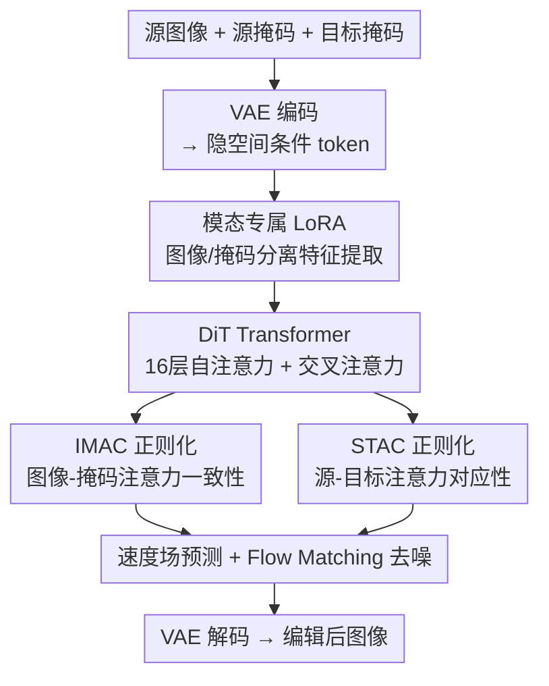

# In-context Region-based Drag: Drag Any Region to Any Shape

**会议**: ECCV 2026  
**arXiv**: [2606.25907](https://arxiv.org/abs/2606.25907)  
**代码**: [https://github.com/bcmi/ICRDrag-Region-Drag-Editing](https://github.com/bcmi/ICRDrag-Region-Drag-Editing)  
**领域**: 图像生成 / 扩散模型  
**关键词**: 区域拖拽编辑, 上下文学习, 注意力正则化, 扩散Transformer, 课程学习

## 一句话总结
ICRDrag 将区域拖拽（region-based drag）建模为上下文学习（in-context learning）任务，以源图像、源区域掩码、目标区域掩码作为统一条件输入 DiT，通过图像-掩码注意力一致性（IMAC）和源-目标注意力对应性（STAC）两个新颖的正则化损失引导生成目标图像，并配套构建了 28.7 万样本的 Paired Region Dataset（PRD），在编辑精度、视觉保真度和用户偏好上显著超越已有方法。

## 研究背景与动机
扩散模型在拖拽式图像编辑（drag-style editing）上展现出巨大潜力，但现有工作主要集中在基于点的拖拽（point-based drag），用户通过若干源点-目标点对来指定编辑意图。这种稀疏条件存在固有的歧义性：例如，面部上的一个源点被拖向面部外侧，既可能意味着转动面部朝向，也可能意味着拉伸面部宽度，多个合理解释往往只有一种符合用户意图。此外，稀疏点对条件导致编辑精度不足，源点很难精确拖到目标点位置。

区域拖拽（region-based drag）通过密集的空间条件——源区域掩码和目标区域掩码——从根本上解决了上述歧义问题。然而，此前区域拖拽方法只有寥寥数篇：EditGAN 将掩码仅用作损失函数而非深度融入生成过程，RegionDrag 采用隐空间复制-粘贴策略，导致边界不自然且难以处理复杂形变。核心矛盾在于：**区域掩码的稠密结构信息与图像生成过程之间缺乏深度耦合机制**——掩码告诉你编辑目标是什么形状、在哪里，但生成过程并不知道如何利用这些结构约束来逐像素地指导图像合成。

本文的目标是让掩码不再是"事后监督信号"或"粗暴的特征搬运工"，而是作为与图像同等的上下文条件深度参与生成全过程。切入角度是将区域拖拽重新定义为上下文学习问题：源图像、源掩码、目标掩码三者构成统一的上下文，模型在单次前向传播中直接生成目标编辑图像。在此基础上，通过在注意力层施加图像-掩码一致性和源-目标对应性两个正则化约束，显式地将掩码的结构信息注入到图像特征的聚合过程中。

**核心 idea**：把拖拽编辑的三个条件（源图、源mask、目标mask）打包成 in-context 输入，让 DiT 自己学会"看图+看mask → 生成符合mask约束的图"，并用两个注意力正则化损失确保掩码结构信息真正引导了图像特征的聚合。

## 方法详解

### 整体框架
ICRDrag 基于 Next-DiT（Lumina）架构，将区域拖拽任务建模为条件生成问题。输入为三部分：源图像 $I_s$、源区域掩码 $M_s$（待编辑区域，不同区域用不同标签 ID 标注）、目标区域掩码 $M_g$（编辑后期望的形状/位置，标签 ID 与源掩码保持一致）。三者和目标图像 $I_g$ 均通过 VAE 编码器映射到隐空间，得到 $\hat{I}_s, \hat{M}_s, \hat{M}_g, \hat{I}_g \in \mathbb{R}^{H \times W \times D}$。

在整个训练和推理过程中，条件输入 $\{\hat{I}_s, \hat{M}_s, \hat{M}_g\}$ 始终保持无噪状态，仅目标图像隐变量 $\hat{I}_g$ 经历加噪-去噪过程。模型预测速度场（velocity field）$\bm{v}_{\theta}(t, \hat{I}_s, \hat{M}_s, \hat{I}_g^t, \hat{M}_g)$，通过 flow-matching 损失监督其逼近目标速度 $\bm{u} = \hat{I}_g - \bm{\epsilon}$。推理时从随机高斯噪声出发逐步去噪，最终的干净隐变量经 VAE 解码器重建出编辑后图像 $I_e$。

### 关键设计

**1. 模态专属 LoRA：解决图像与掩码特征混淆**

图像和掩码具有本质不同的特性：图像富含纹理和细粒度细节，掩码稀疏且仅编码空间结构信息。如果通过共享参数处理两者，掩码的结构表示会污染图像通路，导致细节丢失和过度平滑生成。

具体做法是在 DiT 的前馈网络（FFN）中为图像 token 和掩码 token 分别插入独立的 LoRA 模块。这让每种模态学习适合自身特性的表示，在共享骨干网络的同时避免跨模态干扰。这是一种轻量级设计——不修改原始 DiT 的预训练权重，只训练新增的 LoRA 参数，既保留了基础模型的生成能力，又让掩码信息有专属的处理通道。

**2. IMAC（Image-Mask Attention Consistency）：让图像生成扎根于掩码结构**

核心假设：目标区域的某个 patch 在图像模态中关注源图像的哪些区域，应该与掩码模态中对应 patch 关注源掩码的哪些区域保持一致。换句话说，图像生成过程中"该去哪找视觉素材"应该由掩码定义的空间结构来引导。

形式化地，设 $\mathcal{P}_g$ 为目标区域掩码内的 patch 集合。对每个 $p \in \mathcal{P}_g$，取目标图像分支中该 patch 的 token 作为 query，计算对源图像所有 patch 的注意力图 $\bm{A}_p^{I_s \leftarrow I_g}$；同时取目标掩码分支中同一空间位置的 token 作为 query，计算对源掩码所有 patch 的注意力图 $\bm{A}_p^{M_s \leftarrow M_g}$。IMAC 损失直接最小化两张注意力图之间的 MSE：

$$\mathcal{L}_{\text{imac}} = \sum_{p \in \mathcal{P}_g} \|\bm{A}_p^{I_s \leftarrow I_g} - \bm{A}_p^{M_s \leftarrow M_g}\|^2$$

为什么有效：掩码中"头发区域关注源图的头发区域"是一个非常容易学到的先验——因为掩码本身就是离散的语义标签区域。IMAC 把这个"容易学的结构先验"从掩码模态蒸馏到图像模态，迫使图像生成过程遵循相同的空间对应关系，从而确保生成的像素内容不跑偏到错误的语义区域。

**3. STAC（Source-Target Attention Correspondence）：双向互注意力保证对应一致性**

核心假设：源图像和目标图像中的相关区域应该互相关注。如果目标 patch $i$ 强烈关注源 patch $j$，那么源 patch $j$ 也应该强烈回关目标 patch $i$。这种互信息约束确保模型在源和目标之间建立一致的对应关系，对于物体移动、缩放、关节调整等空间变换至关重要。

设 $\mathbf{A}^{g \rightarrow s} \in \mathbb{R}^{|\mathcal{P}_g| \times |\mathcal{P}_s|}$ 为目标到源的注意力矩阵，$\mathbf{A}^{s \rightarrow g} \in \mathbb{R}^{|\mathcal{P}_s| \times |\mathcal{P}_g|}$ 为源到目标的反向注意力矩阵。考虑乘积 $\mathbf{A}^{g \rightarrow s} \mathbf{A}^{s \rightarrow g} \in \mathbb{R}^{|\mathcal{P}_g| \times |\mathcal{P}_g|}$，其对角线元素 $(\mathbf{A}^{g \rightarrow s} \mathbf{A}^{s \rightarrow g})_{ii} = \sum_j \mathbf{A}^{g \rightarrow s}_{ij} \mathbf{A}^{s \rightarrow g}_{ji}$ 恰好衡量了目标 patch $i$ 与其关注的所有源 patch 之间的双向注意力乘积之和。最大化对角线元素等价于强制互注意力闭环，损失函数为：

$$\mathcal{L}_{\text{stac}} = -\text{Trace}(\mathbf{A}^{g \rightarrow s} \mathbf{A}^{s \rightarrow g})$$

具体实现时，先从第 7-11 层 transformer 提取多头注意力（作者通过实验分析发现中间层最适合施加此类约束，早期层关注局部内容定位，后期层关注空间细化，中间层刚好做源-目标上下文整合），在多个头上取平均后再计算双向注意力矩阵乘积的迹。IMAC 和 STAC 均使用 softmax 归一化的注意力图。

**4. 两阶段课程训练策略：从完整掩码到稀疏掩码的渐进学习**

真实应用中用户可能只标注少数几个待编辑区域（不完整掩码），相比将所有语义区域全部分割出来的完整掩码，模型面临的信息更稀疏：编辑可能涉及显式标注区域之外的内容变化，模型必须推断未标注区域所需的连带调整。

第一阶段用完整区域掩码训练 60,000 步（batch size 2, lr $1 \times 10^{-4}$），让模型在信息充足的条件下先学到基本的"掩码→图像"映射能力。第二阶段切换到不完整掩码，再训练 2,000 步（batch size 1, lr $5 \times 10^{-5}$）：从完整掩码中随机采样 1-5 个关键区域保留，其余区域填充灰色值，并对采样区域随机施加膨胀操作以增强对用户输入不精确性的鲁棒性。这种从易到难的课程设计让优化过程更平滑，避免了直接在不完整掩码上冷启动导致的训练不稳定。

### 一个完整示例

以图 2 中的面部拖拽为例。用户提供：（1）源图像——一张正脸；（2）源掩码——头发（标签1）、面部（标签2）、手臂（标签3）三块蓝色标注；（3）目标掩码——将头发区域向左侧拉伸、面部略微侧转后的形状（红色标注，标签ID与源掩码保持一致）。

系统处理流程：三组输入经 VAE 编码后分别进入图像 LoRA 和掩码 LoRA 提取专属特征。在 DiT 的第 7-11 层，IMAC 正则化确保目标图像中属于"头发"区域的 patch 在聚合源图像特征时，其注意力分布与掩码模态中"头发 patch 关注源掩码头发区域"的分布一致——这样生成的头发纹理就来自源图像的头发区域，不会错位到面部。同时 STAC 正则化确保源图像的面部 patch 如果被目标图像的某个 patch 关注，那个源 patch 也会回关同一个目标 patch，形成双向锁定。经过去噪后解码输出：面部朝向略微侧转、头发随掩码形状拉伸、其余未标注区域（如背景）自动推断出合理的连带变化。

### 损失函数 / 训练策略

总损失为三项加权和：$\mathcal{L}_{\text{total}} = \mathcal{L}_{\text{flow}} + \lambda_1 \mathcal{L}_{\text{imac}} + \lambda_2 \mathcal{L}_{\text{stac}}$。其中 $\mathcal{L}_{\text{flow}}$ 是标准 flow-matching 损失（预测速度场逼近 $\bm{\epsilon} - \hat{I}_g$ 的负值，实际目标速度为 $\hat{I}_g - \bm{\epsilon}$）。时间步 $t$ 从 LogNormal(0, 1) 分布采样，这是 Rectified Flow 的标准做法（Esser et al., 2024），相比均匀采样让训练更关注中间信噪比区域。

IMAC 和 STAC 作为辅助损失仅在目标区域掩码覆盖的 patch 上计算（$\mathcal{P}_g$ 和 $\mathcal{P}_s$），不施加在背景区域，避免无意义的约束干扰生成质量。$\lambda_1$ 和 $\lambda_2$ 为超参数，由实验调参确定。

## 实验关键数据

### 主实验

**PRD 基准定量对比**（Table 1）。PRD benchmark 包含 1,000 个人工校验样本，有真实目标图像作为 ground truth，因此可以使用全参考指标。

| 方法 | MSE $\downarrow$ | LPIPS $\downarrow$ | SSIM $\uparrow$ | MD(RegionDrag) $\downarrow$ | MD(DragLoRA) $\downarrow$ |
|------|-------------------|---------------------|------------------|------------------------------|-----------------------------|
| DragDiffusion | 0.0937 | 0.1836 | 0.5993 | 5.17 | 26.79 |
| SDE-Drag | 0.1017 | 0.2018 | 0.5849 | 7.97 | 44.04 |
| DiffEditor | 0.0959 | 0.1949 | 0.6071 | 23.45 | 31.19 |
| FastDrag | 0.0962 | 0.2049 | 0.5862 | 6.01 | 31.22 |
| Inpaint4Drag | 0.0972 | 0.1923 | 0.6102 | 4.24 | 23.62 |
| GoodDrag | 0.0902 | 0.1761 | 0.6094 | 3.70 | 18.01 |
| DragLoRA | 0.0933 | 0.1870 | 0.5974 | 4.62 | 23.96 |
| RegionDrag | 0.0977 | 0.1944 | 0.6076 | 8.02 | 43.05 |
| **ICRDrag** | **0.0735** | **0.1610** | **0.6284** | **3.66** | **22.34** |

ICRDrag 在所有指标上全面领先，MSE 较最佳基线 GoodDrag 降低 18.5%，LPIPS 降低 8.6%，SSIM 提升 0.019。值得注意的是 RegionDrag（唯一直接可比的区域拖拽方法）在所有指标上均弱于 GoodDrag 等强点拖拽基线，而 ICRDrag 将区域拖拽的性能拉升到了新的上限。

**用户研究**（Table 2，DragBench 上对 50 名参与者的偏好投票）。DragBench 无 ground truth，采用三个主观维度评估。

| 方法 | Realism $\uparrow$ | Fidelity $\uparrow$ | Region Accuracy $\uparrow$ |
|------|---------------------|----------------------|-----------------------------|
| GoodDrag | 0.2876 | 0.2120 | 0.1276 |
| RegionDrag | 0.2442 | 0.2314 | 0.3518 |
| **ICRDrag** | **0.4682** | **0.5566** | **0.5206** |

ICRDrag 以压倒性优势胜出：真实感是第二名的 1.6 倍，保真度是 2.4 倍，区域精度方面 GoodDrag 仅用点对条件因此区域精度极低（0.1276），ICRDrag 相比 RegionDrag 也提升了 48%。

### 消融实验

| 配置 | MSE $\downarrow$ | LPIPS $\downarrow$ | 说明 |
|------|-------------------|---------------------|------|
| Full ICRDrag | 0.0735 | 0.1610 | 完整模型，IMAC + STAC |
| w/o IMAC | — | — | 编辑结果偏离目标掩码，出现结构扭曲和边界不对齐 |
| w/o STAC | — | — | 源图细粒度细节丢失，纹理和身份特征在拖拽过程中被改变或丢失 |

定量结果仅给出完整模型，消融的定量数据在补充材料中。定性结果（Figure 8）清晰展示了两个损失各自的作用：去掉 IMAC 后图像内容无法严格对齐目标掩码形状，去掉 STAC 后源图的纹理细节无法保持。

### 关键发现
- **IMAC 和 STAC 的作用分工明确**：IMAC 负责"编辑精度"（生成内容贴合目标掩码），STAC 负责"内容保真"（源图细节不失真），两者互补且缺一不可。
- **注意力图在不同层的分工**：早期层（1-6）做源内容定位，中间层（7-11）做源-目标上下文整合（因此 IMAC/STAC 施加于此），后期层（12-16）做空间细化——这一分层特性是作者设计损失施加层数的依据。
- **跨数据集泛化强**：在 Adobe Stock 真实图片上无需任何微调即可生成合理编辑结果，说明 ICRDrag 学到的不是 PRD 分布的特殊模式，而是通用的"掩码→图像"映射能力。
- **困难场景**：大拓扑变化、遮挡、人体四肢重定位等非刚性编辑场景下，ICRDrag 仍能生成合理结果，而点拖拽基线在这类场景下明显失效。

## 亮点与洞察
- **"In-context learning for drag" 这个 framing 很巧妙**：把区域拖拽从"迭代优化/GAN 隐空间编辑/特征复制粘贴"的传统思路中解放出来，变成条件生成问题，本质上是把拖拽任务"生成化"——一次前传出结果，比迭代方法快且稳定。
- **IMAC 本质是一种跨模态注意力蒸馏**：掩码模态容易学到正确的空间对应（因为掩码本身就是离散标签区域），把这种"容易学"的结构先验通过 L2 蒸馏到图像模态，避免了图像模态自己从零摸索注意力分布。这个思路可以迁移到任何需要"用简单模态的结构信息约束复杂模态生成"的任务，例如用深度图约束新视角合成、用 edge map 约束图像翻译。
- **STAC 的迹最大化公式简洁优雅**：双向注意力乘积的迹天然捕捉了互注意力闭环——不需要额外的前向后向传递，仅需从已有注意力矩阵中提取并计算，零新增推理开销。这种"在注意力矩阵上做结构约束"的思路可以迁移到其他需要双向对应的任务（如双向图像匹配、视频帧间对应）。
- **两阶段课程训练的实用价值**：第一阶段用完整掩码学基础能力，第二阶段只用 2,000 步（总步数的 3.2%）适应稀疏掩码，这种"大头砸容易、小头砸困难"的分工策略很高效，可以推广到其他需要处理稀疏/噪声条件的生成任务。

## 局限与展望
- **作者未明确讨论的局限**：PRD 数据集基于 OpenVid 视频数据集构建，视频帧对天然保证了源-目标图像场景一致性和光照稳定性——这意味着 ICRDrag 在场景光照剧烈变化或背景大幅改动的拖拽场景下可能表现不佳，但论文未对此做诊断实验。此外，掩码需要用户通过 SAM 等工具提供或手动绘制，实际使用门槛高于点拖拽。
- **推理效率对比缺失**：作为基于 DiT 的单次前向生成方法，ICRDrag 的推理速度理论上优于迭代优化的点拖拽方法（如 DragDiffusion、GoodDrag），但论文未提供推理时间的定量对比。
- **与 DragFlow 的定位关系**：ICRDrag 是训练依赖方法（需要在 PRD 上训练），而同期工作 DragFlow 是训练无关方法（基于 DiT 特征层的区域级仿射监督）——两者的适用场景和成本结构完全不同，论文未讨论这种 trade-off。
- **改进方向**：（1）将 ICRDrag 扩展到视频拖拽编辑，利用视频帧间的时序一致性提升编辑稳定性；（2）结合 LLM 实现语言引导的区域拖拽（"把左边的杯子拖到右边"），降低用户手动标注掩码的成本；（3）探索将 IMAC/STAC 正则化思想迁移到其他 DiT-based 的可控生成任务（如主体驱动的图像生成、虚拟试穿）。

## 相关工作与启发
- **vs RegionDrag**：RegionDrag 在隐空间做复制-粘贴，将区域掩码转换为点对后搬运特征，本质上仍然是 point-based drag 的变体。ICRDrag 将掩码作为一等条件输入 DiT，并通过注意力正则化将结构约束注入生成核心。ICRDrag 的劣势是需要训练，RegionDrag 训练无关；优势是编辑质量显著更高，尤其是在复杂形变和边界融合上。
- **vs GoodDrag / DragDiffusion**：GoodDrag 和 DragDiffusion 是点拖拽方法的代表，依赖迭代优化（运动监督 + 点跟踪）。它们的根本局限是点对条件的稀疏性导致歧义，ICRDrag 用区域掩码从源头消除了这个歧义。两者的关系不是"同一任务的不同方法"，而是"区域拖拽定义了更精确的输入空间，因此上限更高"。
- **vs DragFlow**：DragFlow 也是训练无关的 DiT-based 区域拖拽方法，用区域级仿射监督替代逐点监督。ICRDrag 与 DragFlow 的技术路线正交——一个是训练依赖的上下文学习，一个是训练无关的特征约束。未来两个方向可能结合：用 DragFlow 的特征约束思想设计更强的训练无关 baseline，或用 ICRDrag 的注意力正则化思想提升 DragFlow 的生成质量。
- **vs In-Context Learning 系列（Prompt-to-Prompt、Self-Supervised ICL）**：ICRDrag 的 in-context 设计与视觉 ICL 的工作一脉相承——将多个相关输入拼成上下文，让模型隐式地推断任务。区别在于 ICRDrag 的"上下文"不是同类样本（如图像对），而是异质的图像-掩码多模态信息，且通过显式的注意力正则化（而非仅依靠隐式学习）来确保上下文信息的有效利用。

## 评分
- 新颖性: ⭐⭐⭐⭐ 将区域拖拽重新定义为 in-context learning 任务是巧妙的视角转换，IMAC 和 STAC 两个注意力正则化的设计有明确的直觉支撑且公式优雅；但整体框架建立在已有 Next-DiT 架构之上，核心贡献偏向损失函数设计和训练策略。
- 实验充分度: ⭐⭐⭐⭐ 在 PRD benchmark 和 DragBench 上做了全面的定量/定性/用户研究对比，覆盖了点拖拽和区域拖拽两大类基线，还有困难案例分析和跨数据集迁移测试；但消融实验的完整定量数据留在了补充材料中，主文中仅有定性展示。
- 写作质量: ⭐⭐⭐⭐ 问题定义清晰（第 3 节专门定义符号和任务），方法逐层展开（框架→IMAC→STAC→课程训练），图表充分（Figure 2 三子图覆盖框架/IMAC/STAC）；但 PRD 数据集构建的细节穿插在方法和实验之间，阅读时略有跳跃感。
- 价值: ⭐⭐⭐⭐ 为区域拖拽建立了新的性能标杆（全面超越 RegionDrag 和所有点拖拽方法），28.7 万样本的 PRD 数据集对社区有独立贡献，IMAC/STAC 的注意力正则化思想具有跨任务迁移潜力；实际应用受限于用户需要提供区域掩码的额外成本。

<!-- RELATED:START -->

## 相关论文

- [\[ICLR 2026\] DragFlow: Unleashing DiT Priors with Region Based Supervision for Drag Editing](../../ICLR2026/image_generation/dragflow_unleashing_dit_priors_with_region_based_supervision_for_drag_editing.md)
- [\[ICLR 2026\] Follow-Your-Shape: Shape-Aware Image Editing via Trajectory-Guided Region Control](../../ICLR2026/image_generation/follow-your-shape_shape-aware_image_editing_via_trajectory-guided_region_control.md)
- [\[CVPR 2026\] Region-Adaptive Sampling for Diffusion Transformers](../../CVPR2026/image_generation/region-adaptive_sampling_for_diffusion_transformers.md)
- [\[CVPR 2026\] SpotEdit: Selective Region Editing in Diffusion Transformers](../../CVPR2026/image_generation/spotedit_selective_region_editing_in_diffusion_transformers.md)
- [\[ECCV 2024\] ZipLoRA: Any Subject in Any Style by Effectively Merging LoRAs](../../ECCV2024/image_generation/ziplora_any_subject_in_any_style_by_effectively_merging_loras.md)

<!-- RELATED:END -->
