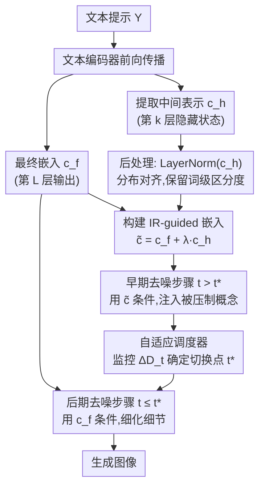

# Intermediate Text Representation Guided Text-to-Image Generation for Enhancing One-and-Only Alignment

**会议**: ECCV 2026  
**arXiv**: [2606.30262](https://arxiv.org/abs/2606.30262)  
**项目页面**: https://soyoun-won.github.io/one-and-only-ir-guidance/  
**代码**: 无  
**领域**: 扩散模型  
**关键词**: 文本到图像生成, 概念关联偏置, 中间表示引导, 信息论, 免训练方法

## 一句话总结
本文通过信息论分析证明文本编码器中间层比最终嵌入保留更多概念互信息，提出 IR-guided diffusion——在去噪早期将中间隐藏状态注入条件信号以恢复被强先验压制的属性，无需训练或外部模型，在 OAO-AttackBench 上 VQAScore 最高提升 19.1 个百分点，同时保持生成质量与人类偏好。

## 研究背景与动机
文本到图像（T2I）扩散模型在生成逼真图像方面取得了显著进展，但当文本提示与模型从训练数据中学到的强视觉先验冲突时，模型常常忽略显式的文本指令，默认生成其"记忆"中的典型外观。本文将这种现象称为**概念关联偏置**（concept association bias）：模型将某些视觉属性与特定概念绑定得如此紧密，以至于文本中的显式覆盖被抑制。这种偏置本身并非有害——恰恰是它让模型能从稀疏描述生成丰富图像——但当用户需要创意性或反事实生成时，它构成了根本性限制。

概念关联偏置在**"唯一实体"（One-and-Only, OAO）**上最为严重——那些只存在单一规范形态的实体，如地球、蒙娜丽莎、埃菲尔铁塔。例如，给定提示 "Earth is a purple planet"，SD3.0 始终无法覆盖其学到的蓝绿色地球先验，要么完全忽略颜色属性，要么无法将紫色与地球正确关联。

本文的核心洞察来自一个关键观察：简单概念在文本编码器的早期层中涌现，但部分概念在最终嵌入中丢失。作者通过信息论分析形式化了这一直觉：文本编码器形成马尔可夫链 $Y \rightarrow c_h \rightarrow c_f$，由数据处理不等式可得 $I(Y; c_h) \geq I(Y; c_f)$，即**中间隐藏状态与输入文本的互信息不小于最终嵌入**。结合已有研究发现"对象级概念在早期层涌现并随后保持稳定"，可进一步推出 $I(b; x_t^h \mid A) \geq I(b; x_t^f \mid A)$——中间表示为条件能增强属性特定的互信息。基于此，提出 IR-guided diffusion，一种完全在推理时运作、不需要任何训练、优化或外部模型的方法。

**核心 idea**：将文本编码器中间层的隐藏状态作为"补充信号"注入去噪条件，利用中间层保留但最终嵌入中被压缩的词级概念信息，在不改变模型结构的前提下恢复被强先验压制的文本-图像对齐。

## 方法详解

### 整体框架
IR-guided diffusion 要解决的核心问题是：T2I 模型在生成 OAO 实体时，由于概念关联偏置，无法根据文本提示中的显式属性覆盖学到的强视觉先验。方法的整体思路是：从文本编码器的中间层提取隐藏状态 $c_h$，将其通过加法注入与最终嵌入 $c_f$ 融合为 IR-guided 嵌入 $\tilde{c} = c_f + \lambda c_h$，在去噪早期使用 $\tilde{c}$ 作为条件以恢复被压制的属性信息，当图像结构稳定后由自适应调度器自动切换回 $c_f$ 完成细节细化。整个过程完全在推理时进行，不涉及任何训练、微调或外部模型。

### 关键设计

**1. 信息论分析：为什么中间层保留更多概念信息**

针对"为什么概念会被最终嵌入丢弃"这一根本问题，作者从信息论角度给出了严格形式化。给定文本提示 $Y = \{A, b\}$（其中 $A$ 为 OAO 对象，$b$ 为指定属性），概念丢失的特征是：以 $(A, b)$ 和仅以 $A$ 为条件生成的图像在分布上几乎无差异，即 $D_{\mathrm{KL}}(p_\theta(x_t \mid A, b) \;\|\; p_\theta(x_t \mid A)) \approx 0$，等价于条件互信息 $I_\theta(x_t; b \mid A) \approx 0$。

文本编码器将提示 $Y$ 通过一系列 transformer block 处理，每个 block 是其输入的确定性函数，因此形成马尔可夫链 $Y \rightarrow c_h \rightarrow c_f$，其中 $c_f = h(c_h)$。由数据处理不等式（DPI）直接推出：

$$I(Y; c_h) \geq I(Y; c_f)$$

后续处理层只能保留或丢失信息，不可能凭空增加——中间表示的信息量严格不小于最终嵌入。进一步，已有研究 [toker2024diffusion] 发现对象级概念在早期层涌现并随后保持稳定，即 $I(A; x_t^h) \approx I(A; x_t^f)$。利用互信息的链式法则 $I(Y; x_t) = I(A; x_t) + I(b; x_t \mid A)$，结合上述两条性质可得核心结论：

$$I(b; x_t^h \mid A) \geq I(b; x_t^f \mid A)$$

这意味着以中间表示为条件可以增强"属性特定"的互信息——正是本文方法有效性的理论根基。补充材料中给出了 Lemma 1 的完整证明（基于条件独立性与链式法则展开）。这一分析同时解释了为何选择第 1 个 transformer block 之后（$k=1$）提取 $c_h$：逐层和逐 token 的余弦相似度分析显示，早期层保留词级独特性，深层逐渐收敛到句子级语义，而 OAO 对齐需要的恰好是词级信号。

**2. IR-guided 嵌入构建与注入：如何将中间表示融入去噪**

针对"如何将中间表示有效融入去噪过程"的问题，作者设计了简洁的加法注入方案。核心操作是将中间表示作为补充信号加到最终嵌入上：

$$\tilde{c} = c_f + \lambda c_h$$

其中 $\lambda \in [0, 1]$ 控制注入强度（实验固定 $\lambda = 0.2$）。注入前先对 $c_h$ 施加文本编码器的最终 LayerNorm，目的是对齐 $c_h$ 与 $c_f$ 的分布。实验分析显示，LayerNorm 将 Wasserstein 距离从 0.20 降至 0.05，同时保留了逐 token 的余弦相似度波动（相比之下，Mean-Std 对齐虽能将 WD 降至 0.03，但使逐 token 相似度变得平坦——词级区分度被平滑掉了）。这正是 LayerNorm 作为后处理选择的关键原因：OAO 对齐需要词级信号，而只有 LayerNorm 能在分布匹配和词级信息保留之间取得平衡。

对于多编码器架构（如 SD3.0 有三个文本编码器：OpenCLIP ViT-G、CLIP ViT-L、T5-XXL），从每个编码器独立提取中间表示，按原生拼接方案组装后统一加到拼接后的最终嵌入上：

$$\tilde{c} = \bigl[c_f^{(1)} \;\|\; \cdots \;\|\; c_f^{(N)}\bigr] + \lambda \bigl[c_h^{(1)} \;\|\; \cdots \;\|\; c_h^{(N)}\bigr]$$

其中 $[\cdot \|\cdot]$ 表示拼接，上标索引不同编码器。这保留了每个架构的原生条件接口，无需任何架构修改。

作者还系统比较了四种替代后处理策略：(1) **None**——直接用 $c_h$ 替换 $c_f$，引入严重分布不匹配；(2) **Mean-Std**——将 $c_h$ 归一化到 $c_f$ 的逐样本统计量，但丢失词级区分度；(3) **Projection**——将 $c_h$ 投影到 $c_f$ 的方向上，只保留对齐分量；(4) **Residual**——取投影后的正交残差，但丢弃了 $c_f$ 中的稳定语义。实验表明加法注入在所有指标上一致优于或匹敌这些替代方案。

**3. 自适应调度：何时停止 IR 引导**

虽然中间表示携带更丰富的信息，但全程使用 $\tilde{c}$ 会引入伪影。扩散模型在早期步骤确定全局结构、后期步骤细化细节，因此只需要在结构形成阶段使用 IR 引导。核心问题是：如何自动确定切换点 $t^*$ 而不依赖手工超参？不同数据集和不同架构的最优引导步数不同（消融显示 SD2.1 在 OAO-AttackBench 上 k=5 最优，Whoops 上 k=1 最优），手工设定无法泛化。

作者设计了基于结构加速度的自适应调度器。首先通过 Tweedie 公式在每个时间步估计干净图像：

$$\hat{x}_{0|t} = \frac{x_t - \sqrt{1-\bar{\alpha}_t}\,\epsilon_\theta(x_t, t)}{\sqrt{\bar{\alpha}_t}}$$

然后计算连续时间步估计之间的结构变化量 $D_t = \|\hat{x}_{0|t} - \hat{x}_{0|t-1}\|_2^2$，并定义其一阶差分作为结构加速度：

$$\Delta D_t = D_t - D_{t-1}$$

$\Delta D_t > 0$ 表示结构仍在剧烈变化，$\Delta D_t \leq 0$ 表示布局开始稳定。切换点定义为加速度首次非正的时间步：

$$t^* = \min\bigl\{t \;\big|\; \Delta D_t \leq 0\bigr\}$$

完整去噪过程为：

$$x_{t-1} = \begin{cases} \text{denoise}(x_t, \tilde{c}) & \text{if } t > t^*,\\[2.0pt] \text{denoise}(x_t, c_f) & \text{if } t \leq t^*. \end{cases}$$

消融实验证实，自适应调度在所有数据-架构组合上均优于或匹敌最优固定调度，且避免了为每个设定手工搜索最优步数。计算 $D_t$ 的开销相对去噪步骤本身可忽略（补充材料中单张 A100 推理时间从 4.80 秒增至 5.07 秒，增幅约 5.6%，峰值显存完全不变）。

### 一个完整示例

以 "Octagon-shaped Earth"（八边形地球）为例走一遍流程。文本提示 $Y = \{\text{Earth}, \text{octagon-shaped}\}$ 送入 SD3.0 的三个文本编码器。

**前向传播与提取**：每个编码器同时输出最终嵌入 $c_f^{(1)}, c_f^{(2)}, c_f^{(3)}$ 和第 1 层隐藏状态 $c_h^{(1)}, c_h^{(2)}, c_h^{(3)}$。此时 $c_f$ 中，Earth 与"球形"的关联极强——"八边形"这一属性信息在 24 层 CLIP ViT-G 编码器的层层抽象中被逐步压缩；而 $c_h$ 的逐 token 余弦相似度分析显示，"octagon" token 仍保留显著区别于其他 token 的独特性。

**嵌入构建**：对每个 $c_h^{(i)}$ 施加对应编码器的最终 LayerNorm，使其分布与 $c_f^{(i)}$ 对齐（WD 从 ~0.2 降至 ~0.05），然后按原生方式拼接，构建 $\tilde{c} = [c_f^{(1)}\|c_f^{(2)}\|c_f^{(3)}] + 0.2 \cdot [c_h^{(1)}\|c_h^{(2)}\|c_h^{(3)}]$。

**去噪与调度**：从纯噪声 $x_T$ 开始，前若干步用 $\tilde{c}$ 条件。自适应调度器实时计算 $\Delta D_t$：在去噪初期 $\Delta D_t$ 持续为正（全局形状——圆形还是八边形——在快速演化），大约进行到总步数的 30%-50% 时 $\Delta D_t$ 首次变为非正（整体布局已锁定，地球的形状已确定），即 $t^*$。此后切换回标准 $c_f$ 条件完成大陆纹理、海洋颜色等细节生成。最终图像中地球呈现八边形轮廓而非默认球形——IR 引导在结构形成阶段成功将"八边形"属性注入，而 $c_f$ 在后期阶段保证了地球的表面特征得到保留。值得注意的是，分析表明 baseline 在去噪极早期（T-6）的估计图像已接近最终输出（过早收敛到球形先验），而 IR-guided 在同阶段的估计图像噪点更多、结构明显不同——IR 引导有效延缓了过早的结构收敛，为属性探索留出了空间。

### 损失函数 / 训练策略

IR-guided diffusion 是完全免训练的方法。没有损失函数，没有梯度更新，没有可学习参数，所有操作在推理时完成。仅有两个关键超参：(1) 中间层提取位置 $k=1$（所有实验均取第 1 个 transformer block 之后，消融显示早期层 VQAScore 更高且与理论预测一致——词级信息在早期层最丰富）；(2) 注入强度 $\lambda = 0.2$（消融表明 $\lambda \in [0.1, 0.5]$ 范围内性能稳定，过大的 $\lambda$ 会引入分布偏移导致性能下降）。计算开销极小：在 A100 上，SD3.0 原生推理 4.80 秒/张，IR-guided 推理 5.07 秒/张（增加约 5.6%），峰值显存完全不变（18.76 GB）。

## 实验关键数据

### 主实验

下表汇总 IR-guidance 在四个 benchmark 上的核心结果。VQAScore 的显著提升反映细粒度属性对齐的改善，CLIPScore 的温和变化表明全局语义质量保持稳定。

| Benchmark | Backbone | 指标 | Baseline | IR-guidance | 提升 |
|-----------|----------|------|----------|-------------|------|
| OAO-AttackBench | SD3.0 | VQA | 0.625 | 0.707 | +0.082 |
| OAO-AttackBench | SD3.0 | CLIP | 0.260 | 0.272 | +0.012 |
| OAO-AttackBench | SD3.0 | HPSv2.1 | 0.263 | 0.271 | +0.008 |
| OAO-AttackBench (Landmarks-Material) | SD3.0 | VQA | 0.525 | 0.716 | +0.191 |
| OAO-AttackBench | SD2.1 | VQA | 0.596 | 0.621 | +0.025 |
| Whoops | SD3.0 | VQA | 0.778 | 0.802 | +0.024 |
| Whoops | SD3.0 | CLIP | 0.291 | 0.296 | +0.005 |
| Whoops | SD3.0 | HPSv2.1 | 0.295 | 0.299 | +0.004 |
| Gecko(R) | SD3.0 | VQA | 0.866 | 0.871 | +0.005 |
| Gecko(S) | SD3.0 | VQA | 0.744 | 0.748 | +0.004 |

### 消融实验

| 配置 | VQAScore (OAO-AttackBench, SD3.0) | 说明 |
|------|-----------------------------------|------|
| Full model（加法注入 + LayerNorm + 自适应调度, λ=0.2） | 0.707 | 完整方法 |
| w/o 自适应调度, 固定 k=5 | ~0.695 | 自适应调度优于所有固定步数；最优固定值随数据集/架构变化 |
| w/o 自适应调度, 固定 k=10 | ~0.688 | Whoops 上 k=1 最优，与 OAO 不同——无通用最优固定值 |
| 注入强度 λ=0.1 | ~0.705 | λ∈[0.1,0.5] 均优于 baseline (0.625)，方法对 λ 不敏感 |
| 注入强度 λ=1.0 | ~0.685 | 过强注入导致分布偏移，性能下降但仍优于 baseline |
| 后处理替换为 None（直接用 $c_h$） | 0.509（SD2.1） | 严重分布不匹配，掉点最大 |
| 后处理替换为 Mean-Std | 0.617（SD2.1） | 词级区分度被平滑，掉点显著 |
| 后处理替换为 Projection | 0.627（SD2.1） | 仅保留与 $c_f$ 对齐的分量，丢失正交信息 |
| 后处理替换为 Residual | 0.617（SD2.1） | 丢弃 $c_f$ 的稳定语义 |
| w/o IR-guidance（Baseline） | 0.625 | 仅使用 $c_f$，概念关联偏置未解决 |

### 关键发现
- **VQAScore 的提升远大于 CLIPScore**：说明 IR 引导主要改善细粒度属性绑定而非全局语义。Landmarks-Material 子类（如"黏土制成的马丘比丘"）提升最大（+19.1 pp），因为这些材质属性与 OAO 实体的规范外形冲突最剧烈，信息被压缩最严重。CLIPScore 的稳定性同时说明方法不会破坏图像的全局语义质量。
- **早期层（k=1）效果最好且逐层递减**：在 OAO-AttackBench 上，从第 1 层提取的 VQAScore 最高，随层深增加单调下降。这与"词级信息存在于早期层并在深层被压缩为句子级语义"的理论预测一致。Whoops 上层间差异较小，反映日常物体的先验刚性不如 OAO 实体。
- **IR 引导延缓了过早的结构收敛**：分析显示 baseline 在去噪极早期（T-6）的 $\hat{x}_0$ 估计已接近最终输出（球形地球），而 IR-guided 在同阶段的结构明显不同、噪点更多。均方差异曲线显示 IR-guided 在过渡点后出现两个局部极大值，佐证去噪轨迹被重新调整——IR 引导为属性探索留出了空间，防止模型过早锁定到学到的先验结构上。
- **KID 和人类偏好均未受损**：IR-guidance 在 OAO-AttackBench 三类上的 KID 持平或略优于 baseline（SD3.0 Celestial 从 0.0576 降至 0.0483，Landmarks 从 0.0583 降至 0.0500）。HPSv2/HPSv2.1 在 OAO-AttackBench 和 Whoops 上均略有提升，说明更强的文本对齐同时带来了更好的视觉观感。
- **Gecko 上的稳健表现证明方法泛化性**：在 Gecko(R) 和 Gecko(S) 这两个通用组合性 benchmark 上，IR-guidance 在四个指标（CLIP/VQA/HPSv2/HPSv2.1）上均小幅超越 baseline，说明方法在常规提示上不会降低质量，反而是轻度有益的——即使没有显式的概念冲突，中间表示的额外信息仍有助于更忠实的文本对齐。

## 亮点与洞察
- **信息论与实验闭环的完整论证链**：从概念丢失的形式化（KL 散度 $\approx$ 0）到互信息分解（$I(Y;x_t)=I(A;x_t)+I(b;x_t|A)$），经数据处理不等式推出中间表示的信息优势（$I(b;x_t^h|A) \geq I(b;x_t^f|A)$），最后通过四组 benchmark 的实验验证闭合论证。这比单纯的经验性方法更有说服力——每个设计选择都有理论依据。
- **"无成本"的推理时方法设计**：不需要任何训练、微调、优化、外部模型或预定义偏置集，仅利用模型内部已有的中间表示，额外计算开销约 5.6% 且显存零增加。这种"挖掘模型内部废弃信号"的思路可迁移到其他编码器-解码器架构：任何使用编码器的生成模型，都可以检查中间层是否保留了最终输出丢失的信息，用类似的注入策略恢复。
- **自适应调度作为通用去噪监控组件**：用 Tweedie 公式估计干净图像并监控结构加速度的思路，本质上是一种在线检测"去噪过程是否收敛"的方法。这个设计不限于 T2I，也适用于任何扩散模型的推理时干预场景——如 classifier-free guidance 的自适应权重调整、概念编辑的最佳干预时机选择等，可作为通用组件迁移。
- **OAO-AttackBench 填补评估空白**：现有 benchmark（Whoops / Gecko / T2I-CompBench）关注日常物体的组合性或常识违反，而 OAO-AttackBench 专门攻击"只有一种形态"的实体的核心视觉身份（三种类型：天体/地标/艺术品），是概念关联偏置最极端的测试场景。504 条反事实提示（按形状/材质/图案/风格/流派子类切分）设计系统、可扩展，可成为概念对齐研究的标准测试平台。

## 局限与展望
- **上下文溢出问题**：作者承认 IR 引导有时会将属性的视觉特征扩散到背景上（如 "Big Ben made of clay" 生成时背景也呈现黏土质感），而非精确局限在目标物体。这源于方法目标是"文本对齐"而非"物体编辑"——在没有参考图像的情况下确保整体画面忠于文本。精确的目标级编辑属于 text-to-image editing 的范畴，将 IR 引导与编辑方法结合（如先做 IR 引导生成、再基于生成结果做局部编辑）是一个有前景的方向。
- **继承骨干模型的能力上限**：IR 引导无法超越骨干模型的能力边界。例如在复杂人体姿态生成上，即使 IR 引导改善了文本对齐，SD3.0 固有的解剖学不准确性依然存在。这意味着方法效果有"天花板效应"——当骨干模型对某个概念根本没有好的表示时，中间层也不会包含相关信息。
- **对封闭源模型不可用**：论文测试了 Nano Banana Pro（Gemini 系列）在 OAO-AttackBench 上的表现，发现即使 frontier 封闭模型仍存在概念关联偏置（VQAScore 0.819，但形状攻击的天体提示和图案-物体绑定仍有失败）。然而 IR 引导需要白盒访问中间层表示，无法直接应用于黑盒 API。探索如何将这一思路迁移到黑盒设置（如通过 prompt engineering 策略模拟中间层注入的效果，或通过 API 返回的 logit/likelihood 信号近似判断哪些概念可能被压制）是一个有价值的方向。
- **注入机制可能简化**：加法注入 $\tilde{c} = c_f + \lambda c_h$ 简单有效，但理论上 $c_h - c_f$（中间与最终表示的差异）直接代表了被压缩的信息量，注入差异而非原始中间表示可能更高效或更可控。此外，在交叉注意力维度而非 embedding 维度注入（如修改 cross-attention map）也值得探索。

## 相关工作与启发
- **vs Diffusion Lens [toker2024diffusion]**：Diffusion Lens 发现早期层蕴含简单概念但未在生成图像中体现，但仅停留在观察层面，没有提出利用方案。本文直接将这一观察转化为实用的推理时干预，并在信息论框架下解释了"为什么早期层更好"（词级互信息更大），从"观察到"到"利用"迈出了关键一步。
- **vs Attend-and-Excite [chefer2023attend] 等需要先验的方法**：这类方法需要在推理时指定"哪些 prompt token 需要特别关注"（即需要被忽视概念的先验知识），而本文不需要任何预定义偏置集或 token 级先验，自动恢复所有被抑制的概念——因为中间层会自然保留所有被压缩的信息，不需要人工指定"哪些被丢了"。
- **vs Kim et al. [kim2025text]**：同样利用文本编码器内部表示改善对齐，但需要优化交叉注意力图与自注意力图的对齐，增加了计算复杂度且仅适用单编码器架构。本文方法免优化、兼容 SD3.0 的三编码器架构，适用范围更广且效率更高。
- **vs 投影空间编辑 [orgad2023editing]**：通过投影编辑消除特定关联偏置，但需要预先知道"哪些关联需要编辑"。本文本质上是"恢复被忽略的概念"，与"移除不需要的关联"互补——可以先用投影编辑消除社会偏置，再用 IR 引导恢复被压制的内容描述，两个方向各司其职。

## 评分
- 新颖性: ⭐⭐⭐⭐ 将"中间表示比最终嵌入信息更丰富"这一已知现象转化为实用的推理时引导方法——单个想法不算石破天惊，但信息论形式化 + 多编码器兼容 + 自适应调度 + OAO 场景聚焦的组合构成了完整且有洞见的系统；自适应调度器的"结构加速度"设计尤其巧妙。
- 实验充分度: ⭐⭐⭐⭐⭐ 四个 benchmark（含新提出的 OAO-AttackBench）、两个 backbone（SD2.1/SD3.0）、七类指标（VQA/CLIP/KID/HPSv2/HPSv2.1/CHAIR/图结构评估）、全面的消融（层选择/注入强度/调度策略/四种后处理/与固定调度对比/计算开销），实验设计严谨且覆盖面广。
- 写作质量: ⭐⭐⭐⭐ 信息论部分的论证清晰且有完整证明（含补充材料中的 Lemma 1 证明演算），方法描述结构分明、公式完整；部分定量结果分散在多张表格中（Table 1-4 + Table S4 等），集中呈现会更清晰。
- 价值: ⭐⭐⭐⭐ 对于需要精确文本对齐的 T2I 应用（创意设计、教育可视化、反事实推理等）有直接实用价值；免训练特性使其易于集成到现有管线——任何部署了 SD 的推理服务都可以零成本接入；OAO-AttackBench 为概念关联偏置研究提供了新的标准测试场景。主要限制在于依赖白盒访问，无法直接惠及闭源 API 用户。

<!-- RELATED:START -->

## 相关论文

- [\[CVPR 2026\] Extending One-Step Image Generation from Class Labels to Text via Discriminative Text Representation](../../CVPR2026/image_generation/emf_meanflow_text_to_image.md)
- [\[ICML 2026\] Alignment-Guided Score Matching for Text-to-Image Alignment in Diffusion Models](../../ICML2026/image_generation/alignment-guided_score_matching_for_text-to-image_alignment_in_diffusion_models.md)
- [\[ECCV 2026\] The Illusion of High Utility in Safety Alignment of Text-to-Image Diffusion Models](the_illusion_of_high_utility_in_safety_alignment_of_text-to-image_diffusion_mode.md)
- [\[CVPR 2025\] A Comprehensive Study of Decoder-Only LLMs for Text-to-Image Generation](../../CVPR2025/image_generation/a_comprehensive_study_of_decoder-only_llms_for_text-to-image_generation.md)
- [\[AAAI 2026\] Unleashing the Potential of Large Language Models for Text-to-Image Generation through Autoregressive Representation Alignment](../../AAAI2026/image_generation/unleashing_the_potential_of_large_language_models_for_text-to-image_generation_t.md)

<!-- RELATED:END -->
