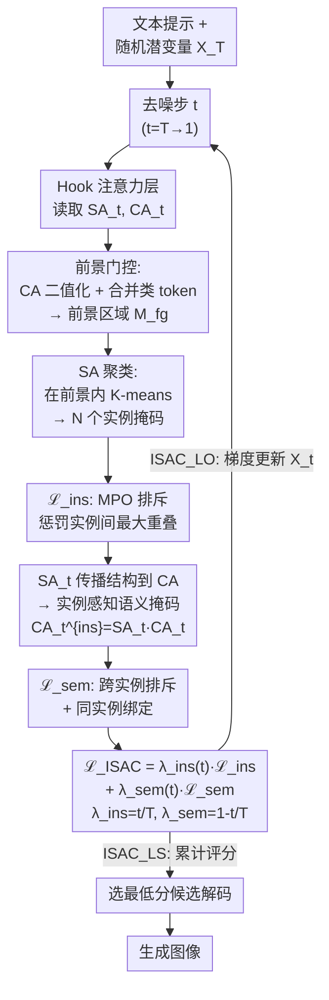

# ISAC: Training-Free Instance-to-Semantic Attention Control for Multi-Instance Generation

**会议**: ECCV 2026  
**arXiv**: [2505.20935](https://arxiv.org/abs/2505.20935)  
**代码**: [https://shjo-april.github.io/ISAC](https://shjo-april.github.io/ISAC) (有)  
**领域**: 图像生成  
**关键词**: 多实例生成, 注意力控制, 自注意力, 扩散模型, 免训练引导

## 一句话总结
ISAC 通过层次化、实例优先的免训练注意力控制方法，先利用自注意力在早期去噪步中稳定实例布局，再在已确立的实例区域内绑定额外语义，显著提升扩散模型多实例生成的计数准确率和语义分离度。

## 研究背景与动机

文本到图像扩散模型在单物体或简单组合 prompt 上已取得惊人效果，但在多实例场景中仍频繁失败：要求「两只马」时经常只生成一匹，要求「一只狗和一只羊」时两个动物的身份涂改在一起，属性（颜色、纹理）跨实例泄漏。这些失败并非少数长尾 case——当 prompt 中包含多个同类（如同一超类下的猫和狗、不同数量的马）的实例时，现有模型几乎无法同时做到准确计数和语义分离。已有免训练引导方法（Attend-and-Excite、SynGen、InitNO、Self-Cross 等）主要通过修正交叉注意力中的语义信号来改善生成，例如抬升被忽略 token 的注意力峰值或使用对比目标分离不同 token 的语义空间。这些方法假设实例区域已经形成，它们的导向作用只在语义层面有效，但无法从根本上保证每个请求的实例被划分成独立的图像区域——当两个同类物体共享同一个语义 token 时，这种「语义驱动结构」的范式就会失效，因为语义 token 本身无法区分同一类下的多个实例。

核心矛盾在于扩散模型去噪过程中「实例结构」和「语义信息」的发展速度不同步。自注意力在去噪早期（时间步靠近 T 时）就已经能够暴露出与类别无关的实例布局——哪些像素可能属于同一个物体、哪些属于不同物体，这种结构信号在去噪过程的大约前 20-30% 步中就相对清晰了。而交叉注意力的语义信号此时仍处于粗粒度纠缠状态，远远无法提供可靠的实例边界。当前方法全部以交叉注意力语义信号来驱动实例结构，等于用「尚不可靠的语义去猜测尚未成形的结构」，自然在同类多实例场景中溃败。为了系统验证这一诊断，作者定义了一个 Dice 重叠度量来量化语义信号在不同类对之间的混淆程度，发现同类超类内的语义重叠显著高于跨类对——这正是语义驱动方法失效的根因。

本文从这一诊断出发，提出一个层次化解耦方案：将生成过程拆成「实例结构形成」和「语义赋值」两个阶段，分别利用扩散模型内部两种注意力机制的时序优势。**核心 idea：将多实例生成解耦为「实例布局形成」和「语义赋值」两个阶段——先利用自注意力在早期去噪步中提取 N 个与类别无关的实例掩码并强制排斥重叠（Phase 1），再将这些稳定的结构信号注入交叉注意力以在已划分的实例区域内绑定额外语义（Phase 2），通过一个简单的时间步自适应权重实现两阶段的平滑过渡。**

## 方法详解

### 整体框架

ISAC 是一个模型无关、免训练的推理时引导目标函数。在每个去噪步 t，它通过 Hook 机制读取模型内部的自注意力图 SA_t 和交叉注意力图 CA_t，然后按两阶段计算引导损失 ℒ_ISAC，最后通过梯度更新潜变量（ISAC_LO 变体）或作为评分函数选用最佳候选（ISAC_LS 变体）来优化生成。第一阶段（Phase 1）基于自注意力构建前景门控并从中聚类出 N 个实例掩码，用最大像素重叠排斥损失促使这 N 个区域互相分离；第二阶段（Phase 2）将自注意力中的结构线索注入交叉注意力得到实例感知语义掩码，再对跨实例 token 施加排斥-绑定损失。两个阶段由一个时间步自适应的权重 λ(t) 平滑衔接——早期专注形成实例结构，后期专注语义精修。

### 关键设计

**1. 自注意力聚类提取实例布局：在前景内找到 N 个区域**

核心前提：自注意力图 SA_t 中属于同一实例的像素间注意力权重显著高于不同实例像素，因此通过对 SA 行向量做聚类就能发现实例边界。但直接在整个图像空间做聚类容易被背景干扰，所以 ISAC 先构建前景门控。先计算实例感知语义掩码 CA_t^{ins} = SA_t·CA_t，二值化后取所有类 token 的并集作为前景 M_fg。这个乘积的直觉是：SA 提供了「像素-像素」之间的实例结构关联，CA_t 提供了「像素-token」间的语义响应，两者相乘得到「被实例结构约束的语义响应」——前景区域就是那些有语义响应的结构连续区域。在前景像素集 ℐ 内，对 SA 行向量加上归一化空间坐标做 K-means 聚类（K=N，实例总数），得到 one-hot 分配 K ∈ {0,1}^{F×N}，再与 SA 行向量加权得到软实例掩码 M = SA_t[ℐ,ℐ]·stopgrad(K)。stopgrad 使梯度只更新 SA_t 而非聚类分配，从而梯度优化会强化实例内部注意力、抑制跨实例注意力，使边界在迭代中越来越清晰。整个过程不需要任何类别标签，纯粹从像素间的结构相关性发现「应该有几个东西」以及「它们之间的界线在哪里」。

**2. 最大像素重叠排斥损失：用最坏 case 拉开实例**

得到 N 个软掩码后需要避免互相重叠。ISAC 设计了最大像素重叠（Maximum Pixel-wise Overlap, MPO）度量——取两个掩码在逐像素乘积上的最大值。MPO 的精妙之处在于只关心最严重的那个冲突像素：只要有一个像素被两个实例同时争夺，MPO 就会给出高值，迫使优化解决这个冲突，而不是容忍平均意义上的低重叠却存在局部分裂。实例分离损失定义为所有掩码对的 MPO 最大值：

$$\mathcal{L}_{\text{ins}}(X_t) = \max_{1 \leq i < j \leq N} \text{MPO}\big(M[i], M[j]\big)$$

这个损失使实例掩码不仅在平均意义上分离，而且在每个像素层面都有清晰的归属，从源头防止了「合并」失败。

**3. 实例感知语义分离：在布局内绑定语义**

Phase 1 完成后 SA_t 已经编码了稳定的实例边界。ISAC 利用这一结构信号做两件事。首先将实例边界传播到语义空间：CA_t^{ins} = SA_t·CA_t——这个乘法等价于用自注意力的实例结构信息对交叉注意力的语义响应做滤波，使 CA_t^{ins} 每一列突出「与该 token 对应且在实例边界内的区域」。然后对属于不同实例的 token 对施加排斥损失 ℒ_repel（最大化它们的 MPO——让语义掩码不重叠），对属于同一实例的 token 对（如一个类 token 和它的属性 token）施加绑定损失 ℒ_bind（最小化 1−MPO——使它们在同区域激活）。组合得到 ℒ_sem = ℒ_repel + ℒ_bind。此前 SynGen 和 CONFORM 等也做语义排斥/绑定，但它们的排斥是语义空间本身的自由排斥，没有「实例区域」这个概念；ISAC 把排斥和绑定限制在 Phase 1 已划分好的实例区域内，语义不会溢出到邻近实例，因此能在同类多实例场景中可靠工作。

**4. 渐进式实例到语义调度**

两个阶段由非常简单的调度参数衔接：λ_ins(t) = t/T，λ_sem(t) = 1 − t/T，ℒ_ISAC = λ_ins·ℒ_ins + λ_sem·ℒ_sem。在 t≈T 的早期去噪步，λ_ins≈1，模型几乎只做实例布局形成——语义信号太弱且不可靠所以不被利用；随着去噪推进到 t≈0，λ_sem≈1，实例布局已稳定，模型逐渐转向语义精修。消融实验显示：只用实例损失（多实例准确率 65% 但多类准确率仅 10%）、只用语义损失（54% 和 28%）、固定权重（60% 和 25%）、或反向调度（55% 和 21%）都劣于渐进调度（69% 和 36%），时序上「先结构后语义」的顺序不可或缺。

### 一个完整示例：两只马

以 prompt "two horses" 为例。LLM 解析器得到类 token {horse}、实例计数 n₁=2、实例总数 N=2。在早期去噪步（t≈T），SA_t 已经隐式编码了两个物体区域但还不知道它们是马。ISAC 通过前景门控定位到图像中的前景区域，在其中做 K=2 的 K-means 聚类，找到大致对应两匹马的各一组像素，计算 MPO 排斥使它们不重叠。在中期去噪步，两实例边界在梯度更新后已基本稳定，SA_t 的聚类结构更清晰。在后期去噪步（t→0），CA_t^{ins} = SA_t·CA_t 将 "horse" token 的语义响应限制在两个实例区域内，ℒ_bind 确保每匹马的属性（如「棕色」vs「白色」）绑定到各自区域而不扩散到另一匹上。最终输出中两匹马各自独立成形且属性正确。作者给出的量化效果显示，ISAC_LO 在 SD1.5 上对 2 匹马类实例准确率从基线的 55% 提升到 100%，3 匹从 2%→31%，在同类多实例任务上效果尤为显著。

### 损失函数 / 训练策略

ISAC 是免训练的推理时引导方法，无额外训练过程。总引导损失为 ℒ_ISAC(X_t, t) = λ_ins(t)·ℒ_ins(X_t) + λ_sem(t)·ℒ_sem(X_t)。两种变体共享相同的 ℒ_ISAC 公式和调度权重：ISAC_LO（潜空间优化）在每个去噪步先做标准去噪预测，计算 ℒ_ISAC 对 X_t 的梯度，用全局统一学习率 η=0.01 更新潜变量后再进入下一步去噪；ISAC_LS（潜空间选择）无需反向传播，并行生成 B=10 个候选，对每个候选累计每一步的 ℒ_ISAC 得分，选总分最低的候选解码为最终图像。

## 实验关键数据

### 主实验

| 基准 | 指标 | SD1.5基线 | +ISAC_LO | SD3.5-M基线 | +ISAC_LO |
|------|------|-----------|----------|-------------|----------|
| HRS-Bench 颜色 | Score | 0.136 | **0.318** | 0.425 | **0.473** |
| HRS-Bench 空间 | Score | 0.094 | **0.263** | 0.264 | **0.350** |
| HRS-Bench 大小 | Score | 0.091 | **0.252** | 0.209 | **0.258** |
| T2I-CompBench 颜色 | Score | 0.356 | **0.683** | 0.796 | **0.838** |
| T2I-CompBench 纹理 | Score | 0.406 | **0.631** | 0.726 | **0.739** |
| IntraCompBench #2 | 多类准确率 | 28% | **65%** | 62% | **98%** |
| IntraCompBench #3 | 多类准确率 | 2% | **31%** | 23% | **51%** |
| IntraCompBench #4 | 多类准确率 | 1% | **29%** | 12% | **40%** |
| IntraCompBench #5 | 多类准确率 | 0% | **18%** | 3% | **20%** |
| IntraCompBench 平均 | 多类准确率 | 8% | **36%** | 25% | **52%** |

### 消融实验

| 配置 | 多类准确率 | 多实例准确率 | 说明 |
|------|-----------|-------------|------|
| 仅实例损失 (A) | 10% | 65% | 能形成正确数量的实例但无法分配语义 |
| 仅语义损失 (B) | 28% | 54% | 语义分离无布局约束，不稳定 |
| 固定权重 (C) | 25% | 60% | 时序错配，损失了最优窗口 |
| 语义→实例调度 (D) | 21% | 55% | 逆序调度：早期语义无效、后期结构无法修复 |
| **实例→语义调度 (E)** | **36%** | **69%** | **先结构后语义，兼顾两类** |

### 关键发现
- ISAC 在同类多实例（intra-supercategory）场景中提升最大：这是所有先前方法共同薄弱的区域，ISAC 通过自注意力结构聚类从根本上解决了「同一 token 下多个实例」的分辨问题。
- ISAC_LO 在 SD1.5 上将 HRS-Bench 空间分数提升约 2.8 倍，在 SD3.5-M 上将 IntraCompBench 平均类准确率从 25% 提升到 52%，提升效果跨模型一致。
- ISAC 可增强布局到图像控制器（GLIGEN + ISAC 将 HRS-Bench 从 0.666 提至 0.713，计数 F1 从 0.307 提至 0.452），说明它能自动将粗糙的重叠边界框细化为密集实例掩码。
- 在少步数模型（Z-Image-Turbo 8 步、Flux.2-klein-4B 4 步）上 ISAC 仍有效（Z-Image-Turbo 多类准确率 48%→68%），验证了低延迟场景的适用性。

## 亮点与洞察
- **实例优先的层次设计**：发现并利用了自注意力在早期去噪步的「结构优势」和交叉注意力在后期去噪步的「语义优势」之间的时序不对称性——这是一个非常优雅地契合扩散模型本身动态特性的设计选择，而非强行施加外部约束。
- **MPO 指标以最坏 case 驱动优化**：用逐像素乘积的最大值替代平均重叠，使损失函数直接针对「最严重的合并冲突」而非整体统计量，收敛更高效。
- **完整的变体覆盖**：同时提供潜空间优化（ISAC_LO，高质量）和潜空间选择（ISAC_LS，无梯度可扩展）两种变体，在质量/计算量和骨干网络适应性上留下了充足的设计空间。
- **模型无关且零训练**：不需要微调、不需要外部检测模型、不改变骨干网络任何参数，即插即用，在不同规模模型（SD1.5 到 Flux.2 到 Qwen-Image）和任务（T2I 和 L2I）上直接迁移。

## 局限与展望
- 依赖实例计数解析：需要从 prompt 中自动解析出每个类别的实例个数，对于模糊表达（如 "some dogs"）超出本文范围，实际使用中需搭配 LLM-based parser。
- 计算开销：ISAC_LO 的梯度计算增加了推理延迟和 VRAM（SD1.5 上从 8s/4.9GB 到 21s/9.7GB），与同类注意力引导方法相当，但对大规模部署可能仍需优化。
- 多实例上限：从 IntraCompBench 看，实例数增加到 #5 时准确率大幅下降（SD3.5-M 上 #2=98% → #5=20%），非常拥挤的场景仍是开放挑战。
- 论文未探索扩展至视频生成或多视角生成中的实例分离，但作者在 conclusion 指出了这个方向。

## 相关工作与启发
- **vs Attend-and-Excite（A&E）**：A&E 只提升被忽略 token 的注意力峰值，不解决同类多实例的分辨问题；ISAC 从结构层面分离实例。
- **vs InitNO / Self-Cross**：这些方法虽然也用了自注意力，但使用交叉注意力的语义来选择和聚合自注意力图，结构仍然受语义驱动；ISAC 纯粹从自注意力结构出发。
- **vs TEBOpt / DOS**：文本嵌入优化方法无空间意识且依赖 CLIP 架构，无法与新一代 Flux/Qwen-Image 等 LLM-based T2I 模型兼容；ISAC 只操作注意力图，模型无关。
- **vs CountGen / Counting Guidance**：计数监督方法需要额外训练或外部视觉模型，且只在去噪后期语义足够清晰时才生效；ISAC 免训练且在早期结构形成阶段就起作用。

## 评分
- 新颖性: ⭐⭐⭐⭐☆ 将实例形成和语义赋值解耦的「实例优先」层次是一个干净且有力的洞察。
- 实验充分度: ⭐⭐⭐⭐⭐ 覆盖 3 个基准 × 多种骨干网络 × 2 个任务 × 与 7 种方法比较 × 消融完备。
- 写作质量: ⭐⭐⭐⭐⭐ 动机清晰、方法分两阶段讲得很清楚、大量消融实验支撑设计选择。
- 价值: ⭐⭐⭐⭐⭐ 免训练、即插即用、效果显著提升多实例生成这一实际高频需求。

<!-- RELATED:START -->

## 相关论文

- [\[ICLR 2026\] ContextGen: Contextual Layout Anchoring for Identity-Consistent Multi-Instance Generation](../../ICLR2026/image_generation/contextgen_contextual_layout_anchoring_for_identity-consistent_multi-instance_ge.md)
- [\[NeurIPS 2025\] InstanceAssemble: Layout-Aware Image Generation via Instance Assembling Attention](../../NeurIPS2025/image_generation/instanceassemble_layoutaware_image_generation_via_instance_a.md)
- [\[CVPR 2026\] Semantic Derivative Flow: Graph-Guided Diffusion for Controllable Instance Interactions](../../CVPR2026/image_generation/semantic_derivative_flow_graph-guided_diffusion_for_controllable_instance_intera.md)
- [\[CVPR 2025\] MCA-Ctrl: Multi-party Collaborative Attention Control for Image Customization](../../CVPR2025/image_generation/mca_ctrl_attention_control_customization.md)
- [\[ICML 2026\] Shifting the Breaking Point of Flow Matching for Multi-Instance Editing](../../ICML2026/image_generation/shifting_the_breaking_point_of_flow_matching_for_multi-instance_editing.md)

<!-- RELATED:END -->
