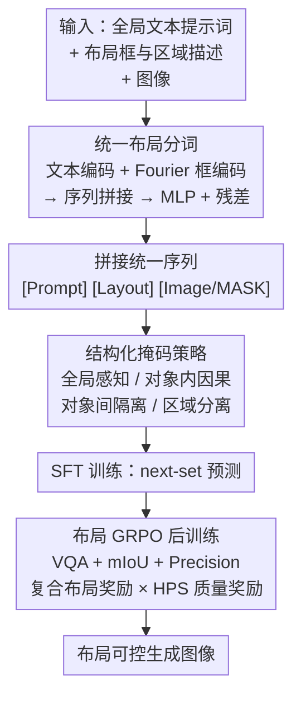

# Layout-Conditioned Autoregressive Text-to-Image Generation via Structured Masking

**会议**: ECCV 2026  
**arXiv**: [2509.12046](https://arxiv.org/abs/2509.12046)  
**代码**: 无  
**领域**: 图像生成  
**关键词**: 自回归图像生成, 布局可控生成, 结构化掩码, GRPO 后训练, 文本到图像

## 一句话总结
SMARLI 提出结构化掩码策略，通过显式控制自回归 Transformer 中文本提示词、布局和图像三类 token 之间的注意力交互，在无需修改模型架构的前提下实现 AR 模型的布局可控图像生成；并首次将 GRPO 后训练引入 AR 布局到图像生成，设计包含 VQA、mIoU、precision 的复合布局奖励，在 LayoutSAM-Eval 和 OverLayBench 上以 1.3B 参数超越多数扩散模型 SOTA。

## 研究背景与动机

**领域现状**：自回归模型在大语言模型中的成功已延伸至图像生成领域，LlamaGen、Show-o、Emu3、VAR 等工作证明 AR 范式是扩散模型的有力竞争者。其中 Show-o 采用 next-set 预测范式（每步并行预测一组 token），在生成效率与质量之间取得了良好平衡。

**现有痛点**：布局到图像（Layout-to-Image, L2I）生成是可控图像生成的核心场景，但 AR 模型在 L2I 上的探索极为有限。扩散模型做 L2I 的主流方案是引入额外注意力模块或分支来注入布局条件（如 GLIGEN 加门控交叉注意力层、SiamLayout 加独立布局编码分支），这类做法破坏了 AR Transformer 架构的简洁性，引入显著参数量和计算开销。另一条 ControlNet 式路线（ControlAR、ControlVAR）依赖边缘图、深度图等稠密视觉条件，天然不适合稀疏的边界框布局。

**核心矛盾**：PlanGen 首次在 AR 模型中采用统一输入序列范式做 L2I——将布局 token 直接拼入输入序列，避免了架构修改。但标准因果注意力掩码将整个序列同等对待，导致两个严重问题：(1) **语义干扰**：不同对象的布局 token 互相可见，图像 token 可能关注到无关区域的布局信息，造成特征纠缠和属性混淆；(2) **图像质量不足**：PlanGen 的视觉保真度明显低于扩散模型 SOTA，复杂场景下产生明显伪影。

**本文目标**：在保持 AR Transformer 架构不变的前提下，解决统一序列范式中的语义干扰问题，同时提升生成质量与布局精度。

**核心 idea**：用结构化注意力掩码显式规定不同 token 类型之间"谁能看谁"——布局 token 按对象隔离、图像 token 只看所属区域的布局——从而在不改模型结构的情况下注入布局控制的归纳偏置；再辅以 GRPO 后训练，用复合布局奖励消除 AR 模型的 exposure bias 并进一步提升质量与可控性。

## 方法详解

### 整体框架

SMARLI 以 Show-o（next-set 预测 AR 模型）为基座，整个框架分三个阶段：将文本提示词、布局条件和图像分别分词后拼接为统一序列；在 AR Transformer 的注意力计算中引入结构化掩码策略，控制三类 token 的交互模式；SFT 训练后，接入 GRPO 后训练阶段，用布局奖励与图像质量奖励联合优化策略模型。整体流程如下图所示。

输入为全局文本描述、一组由边界框坐标与区域文本描述构成的对象布局、以及部分掩码的图像 token。输出为符合布局约束的完整图像。中间经过统一序列构建、结构化掩码注意力、SFT 和 GRPO 后训练四个关键阶段。其中"统一布局分词""结构化掩码策略""布局 GRPO 后训练"是本文三个核心贡献节点。

### 关键设计

**1. 结构化掩码策略：消除跨对象语义干扰**

统一序列范式的核心问题在于标准因果注意力掩码不加区分地让所有 token 互相可见——不同对象的布局 token 之间存在信息串扰，图像 token 可能从无关对象的布局中吸收噪声，导致属性错配和空间偏移。SMARLI 用一套结构化掩码规则显式规定了三类 token 之间的注意力交互模式，其设计遵循四条原则。

第一条，**全局上下文感知**：所有布局 token 可以关注全局文本提示词 token。这使每个区域能获取整图的语义上下文，理解自身在全局场景中的角色。第二条，**对象内因果连贯**：同一对象的布局 token 之间采用标准因果掩码，使其能按顺序累积该对象的细粒度空间与语义信息。第三条，**对象间隔离**：不同对象的布局 token 之间完全阻断注意力。这保证了每个对象的布局表示不受其他对象干扰，避免了"红衬衫"的属性泄露到"蓝裙子"的区域。第四条，**区域分离**：图像 token 关注所有其他图像 token 和全局提示词 token，但只关注与其空间位置关联的布局 token。判断关联的方式是检查图像 token 对应的空间位置是否落在某个对象的边界框内；若一像素落在多个重叠框内，则该图像 token 同时关注这些对象的所有布局 token，此时全局提示词提供对象间语义关系的消歧上下文。

这四条规则构成一个与序列组织（Prompt-Layout-Image）相匹配的归纳偏置，直接在注意力计算层面注入布局控制信号，不引入额外参数，不修改 Transformer 架构。消融实验表明，去掉对象间隔离和区域分离（w/o Local Causal）导致空间定位指标 mIoU 从 80.08 掉到 78.39、precision 从 80.69 掉到 77.04；去掉全局上下文感知（w/o LP）则严重损害属性绑定能力，颜色从 86.17 掉到 79.83。

**2. 统一布局分词：序列维度融合空间与语义**

布局条件由两部分信息构成：边界框坐标 $[x_0, y_0, x_1, y_1]$（归一化到 $[0,1]$）和区域文本描述（如"a girl in a blue dress"）。扩散模型通常将文本 token 与 Fourier 编码的框坐标沿通道维度拼接后输入额外模块。SMARLI 的设计原则是充分复用 Show-o 预训练的文本表示能力，因此做出两个关键决策：(1) 使用 Show-o 的文本分词器 $E$ 和码本 $C$ 对区域描述编码得到文本 token，框坐标用 Fourier 嵌入编码为同维向量；(2) 沿序列维度拼接文本 token 与 Fourier 嵌入，而非沿通道维度。拼接后的序列再经过一个零初始化 MLP 加残差连接的变换：

$$x_i = \mathrm{Concat}\left(C(E(obj_i^{\text{text}})),\; \mathrm{Fourier}(obj_i^{\text{box}})\right)$$

$$obj_i^{\text{layout}} = x_i + \mathrm{MLP}(x_i)$$

零初始化 MLP 确保训练初期布局 token 不破坏预训练文本表示，随着训练逐步融入空间信息。最终每个对象的布局 token 序列与全局提示词 token、图像 token 按 [Prompt][Layout][Image] 的顺序拼接送入 AR Transformer。这种设计将布局条件自然地嵌入 AR 的统一序列框架，无需额外条件编码器。

**3. 布局 GRPO 后训练：复合奖励驱动质量与可控性**

AR 模型存在 train-test discrepancy（训练时用 ground-truth token，推理时用模型自己生成的 token）导致的 exposure bias 问题，且 SFT 阶段的单一 next-token 预测目标无法直接优化图像质量与布局精度。SMARLI 首次将 GRPO 引入 AR 布局到图像生成，需要解决两个挑战。

第一个挑战是 next-set 范式下的动作定义。传统 next-token AR 模型在 GRPO 中，每个 token 是一次动作，所有时间步的 log-probability 可通过一次带因果掩码的前向传播并行计算。但 Show-o 每步以完整序列为上下文、预测并保留一组高置信度 token，不同时间步的上下文在相同空间位置上可能有不同的 token 值，无法用固定掩码复现。SMARLI 的做法是：在 rollout 阶段显式记录每步保留的 token 集合及其空间位置作为"复合动作"，当前输入序列作为"状态"；训练时 $\pi_{\theta}$ 和 $\pi_{\text{ref}}$ 按步重放相同的状态-动作轨迹，在相同上下文下计算概率比 $r_{i,t} = \frac{\pi_{\theta}(o_{i,t} \mid c, o_{i,<t})}{\pi_{\theta_{\text{old}}}(o_{i,t} \mid c, o_{i,<t})}$。

第二个挑战是如何设计既不损害图像质量、又能提升布局精度的奖励函数。SMARLI 提出复合布局奖励，由三项组成：

$$R_{\text{layout}} = \lambda_{\text{VQA}} \cdot S_{\text{VQA}} + \lambda_{\text{mIoU}} \cdot S_{\text{mIoU}} + \lambda_{\text{prec}} \cdot S_{\text{prec}}$$

$S_{\text{VQA}}$ 用 Qwen3-VL 以视觉问答方式判断每个框内区域是否包含指定属性（颜色、形状、纹理），取二值分数。该分数的局限是只要主体出现在区域内即判正，不惩罚边界不精确或误检。$S_{\text{mIoU}}$ 和 $S_{\text{prec}}$ 用 Grounding DINO 检测生成图像中的目标，与布局真值计算 mIoU 和 precision，分别解决空间定位精度和误检（false positive）问题。最终优势函数为 HPS 图像质量优势与布局优势的加权和，且对落在布局指定框内的图像 token 放大 $\omega^{\text{layout}}$ 权重，使策略优化更聚焦于布局相关区域。

### 一个完整示例

假设输入："A photo of a living room"，布局为两个对象——(1) 左侧红色沙发 `[0.05, 0.4, 0.45, 0.9]`，"a red sofa"；(2) 右侧绿色盆栽 `[0.55, 0.3, 0.95, 0.85]`，"a green potted plant"。分词阶段，红色沙发的文本描述经 Show-o 文本分词器得到若干 token、框坐标经 Fourier 编码为向量，两者序列拼接后过 MLP+残差得到沙发布局 token；绿色盆栽同理。全局提示词 token、两组布局 token、被掩码的图像 token 按序拼接为一条统一序列。

进入 AR Transformer，结构化掩码生效：沙发布局 token 能看全局提示词 token（理解"客厅"场景），也能看沙发自己的布局 token（按因果顺序累积"红色""沙发"语义），但完全看不见盆栽布局 token；盆栽布局 token 同理。图像生成阶段，落在沙发框 $[0.05,0.4,0.45,0.9]$ 内的图像 token 关注沙发布局 token + 所有图像 token + 全局提示词，以此生成红色沙发纹理；落在重叠区的 token 同时关注两组布局，由提示词"living room"提供的全局语义协调两者关系。SFT 输出后，GRPO 阶段用 Qwen3-VL 检查沙发区域是否确实是红色、盆栽区域是否确实是绿色，用 Grounding DINO 检测生成的目标位置与布局真值计算 mIoU/precision，联合 HPS 质量分数更新策略。消融实验显示，HPS 单独使用时颜色指标从 86.17 掉到 83.96（模型为了高美感牺牲了属性精度），而复合奖励使颜色回升到 87.35，同时 IR 从 60.88 提升到 74.81。

### 损失函数 / 训练策略

SFT 阶段采用 Show-o 原生的 next-set 预测损失，在训练时对图像 token 按比例随机掩码，模型学习预测被掩码 token。优化器 AdamW，固定学习率 $2 \times 10^{-5}$，训练 30,000 迭代，全局 batch size 128，分辨率 $512 \times 512$，在 8 张 AMD MI300X GPU 上训练 3 天。可训练参数包括整个 AR Transformer 和布局分词器中的 MLP。

GRPO 后训练阶段，组数 $G=4$，生成步数 10，batch size 28，学习率 $1 \times 10^{-4}$，训练 100 迭代，每个 Transformer block 用 LoRA（rank=256）微调。Rollout 温度设为 1，classifier-free guidance scale 为 5。$\beta$ 设为 0（与 DanceGRPO 做法一致），$\omega^{\text{hps}}=\omega^{\text{layout}}=1$，布局框内图像 token 的 $\omega^{\text{layout}}$ 提升至 1.2。布局奖励权重 $\lambda_{\text{VQA}}=0.5$，$\lambda_{\text{mIoU}}=0.5$，$\lambda_{\text{prec}}=0.1$。GRPO 阶段在 8 张 AMD MI250 GPU 上仅需 4 小时，训练开销远小于 SFT 阶段。

## 实验关键数据

### 主实验

**LayoutSAM-Eval 结果**：SMARLI 以 1.3B 参数在多数指标上超过参数量数倍于己的扩散模型方法（SiamLay-Flux 22B、InstsAssemb 2B），尤其在颜色（87.35 vs. SiamLay-Flux 80.71）、纹理（90.90 vs. 83.53）、形状（89.82 vs. 82.80）等细粒度属性控制上优势明显。相比同为 AR 统一序列范式的 PlanGen（1.5B），SMARLI 在布局控制全线领先，且图像质量大幅提升（IR 74.81 vs. 39.58）。FID 18.16 好于多数扩散方法，接近 SiamLay-Flux（16.12）。

| 方法 | 参数量 | Spatial | Color | Texture | Shape | mIoU | Precision | IR | FID |
|------|--------|---------|-------|---------|-------|------|-----------|-----|-----|
| GLIGEN | 1.2B | 77.53 | 49.41 | 55.29 | 52.72 | 69.62 | 70.99 | -10.31 | 21.92 |
| InstanceDiffusion | 1.4B | 87.99 | 69.16 | 72.78 | 71.08 | 81.29 | 72.34 | 9.14 | 19.67 |
| SiamLay-Flux | 22B | 95.67 | 80.71 | 83.53 | 82.80 | 78.01 | 78.33 | 80.48 | 16.12 |
| InstsAssemb | 2B | 94.97 | 77.53 | 80.72 | 80.11 | 73.33 | 74.19 | 70.14 | 20.24 |
| PlanGen | 1.5B | 92.21 | 82.69 | 86.53 | 85.36 | 78.04 | 81.15 | 39.58 | 13.91 |
| **SMARLI** | **1.3B** | **95.55** | **87.35** | **90.90** | **89.82** | **81.31** | **81.84** | **74.81** | **18.16** |

**OverLayBench-Complex 结果**：在具有大量重叠边界框的复杂布局场景下，SMARLI 的 mIoU 56.42（vs. SiamLay-Flux 54.50）、O-mIoU 29.59（重叠区域 mIoU，vs. SiamLay-Flux 28.97）、实体成功率 SRE 80.52（vs. SiamLay-Flux 69.72）均取得最优，证明结构化掩码的对象间隔离设计在处理重叠对象的语义混淆时尤为有效。

**T2I-CompBench 结果**：引入 GPT-5.2 生成的布局条件后，SMARLI 在空间推理上相比无布局的 Show-o 从 39.6 提升到 49.7，颜色、纹理、numeracy 均有明显增益，表明布局条件不仅改善空间控制，还对属性绑定和计数能力有正向迁移。

### 消融实验

**GRPO 奖励组合消融**（基于 SFT 基线 SMARLI-SFT，LayoutSAM-Eval）：

| 配置 | Spatial | Color | Texture | Shape | mIoU | Precision | IR |
|------|---------|-------|---------|-------|------|-----------|-----|
| SFT only（基线） | 95.26 | 86.17 | 89.79 | 88.56 | 80.08 | 80.69 | 60.88 |
| Only HPS | 93.82 | 83.96 | 87.72 | 86.78 | 77.79 | 77.89 | 76.62 |
| Only Layout（VQA+DET） | 95.41 | 87.04 | 90.15 | 89.32 | 80.76 | 80.81 | 58.34 |
| HPS + VQA | 95.48 | 87.30 | 90.01 | 88.97 | 77.73 | 74.50 | 73.36 |
| HPS + DET | 95.13 | 85.61 | 89.45 | 88.29 | 80.70 | 80.88 | 73.05 |
| **HPS + VQA + DET（Full）** | **95.55** | **87.35** | **90.90** | **89.82** | **81.31** | **81.84** | **74.81** |

### 关键发现

- **HPS 与布局奖励互补**：单独使用 HPS 奖励虽然大幅提升图像质量（IR 60.88 $\to$ 76.62），但严重损害布局控制——颜色从 86.17 掉到 83.96，mIoU 从 80.08 掉到 77.79。模型为了追求"好看"而牺牲了属性精确性。单独使用布局奖励则反之，布局精度轻微提升但图像质量下降。两者联合后，IR 提升到 74.81 同时布局控制全面改善，实现了帕累托改进。
- **VQA 与检测奖励互补**：VQA 奖励（HPS+VQA）擅长属性对齐（Color 87.30），但 mIoU（77.73）和 precision（74.50）反而比 SFT 基线低——因为 VQA 只要对象主体在框内就给正分，不惩罚 IoU 低和误检。检测奖励（HPS+DET）有效修复了 mIoU 和 precision 但属性一致性下降。两者联合后才达到平衡最优。
- **结构化掩码的对象间隔离是关键**：去掉对象间隔离和区域分离（w/o Local Causal）后，空间指标 mIoU 下降 1.69 个百分点、precision 下降 3.65 个百分点，远超去掉全局上下文感知的影响（颜色掉 6.34 个百分点），说明跨对象语义干扰是统一序列范式最主要的瓶颈。
- **AR 模型可以超越大得多的扩散模型**：SMARLI 1.3B 在 LayoutSAM-Eval 上的布局控制指标全面超过 22B 的 SiamLay-Flux，尤其在细粒度属性（颜色、纹理、形状）上优势显著，表明 AR 模型在可控生成上的潜力被低估。

## 亮点与洞察

- **结构化掩码四原则设计精炼**：全局上下文感知、对象内因果连贯、对象间隔离、区域分离——四条规则覆盖了 prompt-layout-image 三类 token 之间所有有意义的交互组合，没有遗漏也没有冗余。这种"谁该看谁"的显式建模思路简洁优雅，且完全在注意力层面实现零参数注入，可无障碍迁移到任何 AR Transformer。
- **复合布局奖励的三项分工清晰**：VQA 管语义属性（颜色/形状/纹理对不对）、mIoU 管空间精度（框对不对齐）、precision 管误检（是否在不该出现的地方生成了目标），三项各司其职且互相纠偏。这种分解设计可推广到其他需要细粒度空间+语义联合控制的生成任务。
- **Exposure bias 问题被巧妙验证**：消融中 HPS 单独使用导致布局控制全面下降的现象，本质是 SFT 模型的 exposure bias——推理时生成的图像偏离训练分布，HPS 奖励引导模型走向"好看但不对"的分布，布局奖励恰好起到了锚定作用。这为 AR 图像生成中 RL 后训练的必要性提供了实证支撑。
- **布局条件对 T2I 的溢出收益**：T2I-CompBench 上引入布局后 numeracy（计数能力）也提升了（62.3 $\to$ 68.4），暗示空间约束作为一种额外的结构信号，能帮助模型更好地执行组合式文本理解——这对纯文本 prompt 的 T2I 模型是一个有启发的现象。

## 局限与展望

- **布局分词器的 MLP 设计相对简单**：当前仅用一个零初始化 MLP 加残差连接融合文本 token 和 Fourier 嵌入，本质上是对两种模态做浅层线性组合。更复杂的布局条件（如自由形式掩码、关键点、3D 框）可能需要更强的条件编码器。
- **GRPO 后训练的数据筛选依赖 Grounding DINO 预筛选**：训练数据需要过滤掉 Grounding DINO 检测 mIoU/precision 未达 0.9 的样本，意味着奖励信号的可靠性受限于检测器性能。若检测器本身在特定类别上不准，布局奖励可能误导训练。
- **未探索开放词汇布局控制**：当前布局描述使用固定的区域文本，未测试模型是否能泛化到训练中未见过的对象类别描述组合。
- **仅验证了 Show-o 和 Janus-Pro-1B 两个基座**：论文在补充材料中展示了 Janus-Pro-1B 上的迁移结果，但未在更多 AR 架构（如 VAR、LlamaGen）上验证结构化掩码的通用性。
- **改进方向**：(1) 将结构化掩码的思想扩展到视频生成的时空布局控制；(2) 用更强的 VLM 替换 Qwen3-VL 做 VQA 评判，提升属性检测精度；(3) 探索在线 GRPO（即 rollout 和训练交替进行）以进一步缓解 exposure bias。

## 相关工作与启发

- **vs GLIGEN / InstanceDiffusion**：扩散模型的布局控制方案通过新增可训练的门控交叉注意力层或实例级条件注入实现，核心代价是架构修改和额外参数。SMARLI 用掩码替代模块，保持 AR Transformer 结构不变，理念上更接近"让模型学会看该看的东西"而非"给模型加一个新器官"。
- **vs PlanGen**：同为 AR 统一序列范式，PlanGen 依赖标准因果掩码导致语义干扰，SMARLI 的结构化掩码是该范式的关键补丁。PlanGen 的 FID（13.91）虽然更低，但其 IR 仅 39.58（SMARLI 74.81），说明 PlanGen 的图像在感知质量上明显不足，FID 的优势可能来自对训练分布的过拟合。
- **vs ControlAR / ControlVAR**：两者沿袭 ControlNet 思路，将编码后的视觉条件特征图注入 AR 模型。这种范式适用稠密对齐条件（边缘图、深度图），不适合稀疏布局。SMARLI 的序列拼接 + 掩码方案是更自然的布局注入方式，且无需训练条件编码器。
- **启发**：结构化掩码的"分类型控制注意力"思想可被抽象为一种通用的 AR 条件注入范式——不仅适用于布局，任何可以拆解为"与特定区域/片段关联的条件"（如参考图像、草图、人体姿态）都可以通过定义新的 token 类型和掩码规则接入，而不改模型结构。

## 评分
- 新颖性: ⭐⭐⭐⭐ 结构化掩码将布局控制转化为注意力规则设计，思路在 AR 图像生成中首次提出；GRPO 后训练引入 L2I 也是首次，但基座模型 Show-o 非自研
- 实验充分度: ⭐⭐⭐⭐⭐ 两个 L2I 基准 + T2I-CompBench + 丰富的消融（掩码策略各组件、GRPO 奖励各子项、布局分词器设计、权重超参），覆盖全面
- 写作质量: ⭐⭐⭐⭐ 方法动机链条清晰，结构化掩码的四原则表述精炼，GRPO 对 next-set 的适配说明到位；部分实验细节放在补充材料，主文消融实验较多但条理清楚
- 价值: ⭐⭐⭐⭐ 为 AR 模型在可控图像生成领域打开了一个简洁有效的入口，结构化掩码和复合布局奖励的设计思路有较好的可迁移性；代码未开源是目前的主要不足

<!-- RELATED:START -->

## 相关论文

- [\[ECCV 2026\] Continuous Speculative Decoding for Autoregressive Image Generation](continuous_speculative_decoding_for_autoregressive_image_generation.md)
- [\[ECCV 2026\] Text-Conditioned Background Generation for Editable Multi-Layer Documents](text-conditioned_background_generation_for_editable_multi-layer_documents.md)
- [\[ECCV 2026\] Obliviate: Erasing Concepts from Autoregressive Image Generation Models](obliviate_erasing_concepts_from_autoregressive_image_generation_models.md)
- [\[AAAI 2026\] LongT2IBench: A Benchmark for Evaluating Long Text-to-Image Generation with Graph-structured Annotations](../../AAAI2026/image_generation/longt2ibench_a_benchmark_for_evaluating_long_text-to-image_generation_with_graph.md)
- [\[CVPR 2026\] LumiX: Structured and Coherent Text-to-Intrinsic Generation](../../CVPR2026/image_generation/lumix_structured_and_coherent_text-to-intrinsic_generation.md)

<!-- RELATED:END -->
