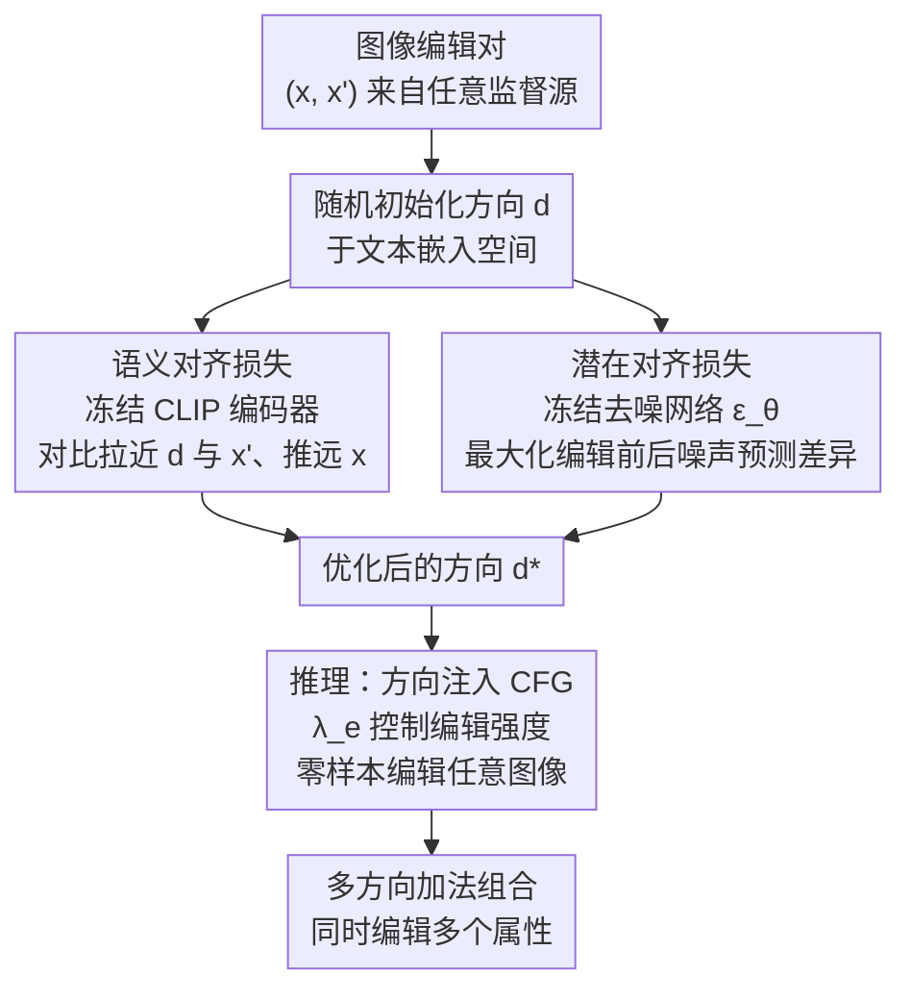

# Learn Once, Edit Anywhere: Visual Direction Transfer for Diffusion Models

**会议**: ECCV 2026  
**arXiv**: [2403.19645](https://arxiv.org/abs/2403.19645)  
**项目页**: [vidit-edit.github.io](http://vidit-edit.github.io)  
**代码**: 无  
**领域**: 扩散模型 / 图像编辑  
**关键词**: 扩散模型, 图像编辑, 视觉方向迁移, 解耦编辑, 零样本编辑

## 一句话总结
ViDiT 提出一种"学一次，到处编"的框架：从少量图像编辑对（before/after）中优化一个连续的潜在方向 d，将该方向注入扩散模型的 CFG 推理过程，实现对任意图像零样本、解耦、强度可控的细粒度属性编辑，无需微调基座模型也无需逐图像优化。

## 研究背景与动机
扩散模型在文本到图像生成上取得了巨大成功，现有的图像编辑方法几乎都依赖自然语言描述来指定编辑意图（如 SEGA、InstructPix2Pix、Prompt2Prompt）。然而，自然语言存在根本性的"描述瓶颈"：许多细粒度视觉变化——精确的面部结构调整、微妙的纹理迁移、风格化的笔触改变——在两幅图像之间一目了然，却极难用文字精确描述。一句"给这个人加上胡子"不仅是一个粗糙的先验，还会不可避免地将编辑与其他属性（如年龄、肤色）纠缠在一起。同时，GAN 的潜在空间已被证明具有丰富的、线性可操作的解耦语义方向（如 StyleSpace），但扩散模型的递归去噪架构和跨时间步的复杂变量管理使得类似的方向发现极为困难，目前仅发现了极少数的解耦方向。核心矛盾在于：视觉差异的表达力远超文本，但现有扩散模型编辑工具却被文本接口所限制。本文的核心 idea 是：将图像编辑对中自明的视觉 delta（Δx = x' - x）直接迁移为扩散模型条件空间中的一个紧凑、连续的编辑方向 d，从而绕过文本瓶颈，实现"学一次，到处编"。

## 方法详解

### 整体框架
ViDiT 的目标是从一组图像编辑对 {(x, x')} 中学到一个连续的潜在方向 d，使其能够复现从 x 到 x' 的语义变换。整个流程分为两个阶段：（1）**方向学习阶段**——给定 N 对编辑前后的图像，随机初始化 d 于 Stable Diffusion 的文本嵌入空间中，通过双目标损失函数（语义对齐 + 潜在对齐）迭代优化 d，过程中冻结去噪网络 ε_θ 和 CLIP 图像编码器 E_I；（2）**推理编辑阶段**——将优化好的 d 注入 CFG 公式，替换原有的文本条件残差项，通过编辑强度 λ_e 控制效果强弱，对任意输入图像（含真实照片经 DDPM 反演）零样本施加编辑。多个独立学习的方向可在推理时加法组合，实现多属性同时编辑。

### 关键设计

**1. 语义对齐损失：用 CLIP 对比学习将 d 锚定到正确的语义概念**

单独优化一个方向向量 d 面临的首要问题是：如何让 d "知道"它应该代表什么语义变换？ViDiT 利用冻结的 CLIP 图像编码器 E_I 作为全局语义锚点。核心直觉是：如果 d 真正代表了从 x 到 x' 的编辑方向，那么在 CLIP 的特征空间中，d 应该与编辑后的图像 x' 余弦相似，而与原始图像 x 余弦不相似。由此构造对比形式的语义对齐损失：$\mathcal{L}_{\text{sem}} = 1 - \text{cossim}(E_I(x'), \mathbf{d}) + \text{cossim}(E_I(x), \mathbf{d})$。这个损失将 d 推到目标概念的"语义邻域"，确保方向在高层语义上是正确的。然而，CLIP 的全局池化特征缺乏空间分辨率——单独使用 L_sem 学到的方向虽然语义对（比如确实加了胡子），但会连带改变脸型、肤色等不相关属性，因为 CLIP 无法区分"胡子纹理变化"和"下颌形状变化"。

**2. 潜在对齐损失：用去噪网络锁定空间细节与身份一致性**

为了解决 L_sem 空间粒度不足的问题，ViDiT 引入第二个损失 L_latent，直接作用在扩散模型的去噪网络内部。关键观察是：与 GAN 在紧凑低维潜码上条件的做法不同，扩散模型的去噪网络输出的是空间对齐的高维噪声预测图 $\epsilon_\theta(x_t, \mathbf{d})$，它编码了逐像素的密集信息。L_latent 最大化编辑前后图像在同一方向 d 条件下的噪声预测差异：$\mathcal{L}_{\text{latent}} = -\mathbb{E}_{x_0,\epsilon,t}[||\epsilon_\theta(x'_t, \mathbf{d}) - \epsilon_\theta(x_t, \mathbf{d})||_2^2]$。直观上，这迫使 d 产生的噪声预测在编辑前后的图像之间产生最大区分，从而将方向"接地"到模型原生的去噪表示空间中。实验表明 L_latent 对于保留发丝纹理、眼镜反光、皮肤质感等高频身份线索至关重要，去掉它后编辑会出现明显的属性纠缠（如"白发"编辑连带改变肤色）。

**3. Edit Anywhere 推理与多方向组合：修改 CFG 实现零样本、强度可控、多属性编辑**

一旦 d 学好后（每个概念只需学一次），它就像扩散模型词汇表中的一个新"token"。推理时，ViDiT 修改标准 CFG 公式，将原本依赖文本条件的残差项替换为视觉 delta 残差：$\bar{\epsilon}_\theta(x_t, c, \mathbf{d}) = \tilde{\epsilon}_\theta(x_t, c) + \lambda_e(\epsilon_\theta(x_t, \mathbf{d}) - \epsilon_\theta(x_t, \phi))$。其中 $\lambda_e \in \mathbb{R}$ 提供连续、精细的编辑强度控制：设为 0 恢复原图，正值增强编辑效果，负值实现反向编辑。由于编辑方向是加法注入的，多个独立学习的方向可以在推理时直接组合——$\hat{\epsilon}_\theta = \tilde{\epsilon}_\theta + \sum_i \lambda_{e_i}(\epsilon_\theta(x_t, d_i) - \epsilon_\theta(x_t, \phi))$——无需任何重新训练。例如，同时对一张人脸施加"微笑"+"亚洲人"+"胡子"三个方向，每个方向保持高度解耦。对于真实照片，先用 DDPM Inversion 将输入反演到模型的潜在轨迹中，再在反向去噪过程中注入方向，整个推理约 5 秒（单张 NVIDIA L40 GPU）。

### 一个完整示例：学习"胡子"编辑方向

以学习"胡子"编辑方向为例走一遍完整流程。监督源使用在 FFHQ 上训练的 StyleGAN2，生成 1000 对"无胡子/有胡子"的配对图像 {(x_i, x_i')}。d 在 Stable Diffusion 的文本嵌入维度中随机初始化。每轮迭代：随机采样一对图像，对两张图加相同噪声和时间步 t 得到 x_t 和 x'_t；计算 L_sem——将 x, x' 分别送入冻结的 CLIP 图像编码器，与 d 做余弦相似度对比；计算 L_latent——将 x_t, x'_t 分别送入冻结的去噪网络（条件为 d），最大化二者噪声预测的 L2 距离；总损失 L = L_sem + L_latent 反向传播，仅更新 d。AdamW 优化 1000 轮后，d* 捕获了"加胡子"这一语义变换。推理时，对一张新的真实人脸照片经 DDPM 反演得到噪声序列，在反向去噪的每一步将 d* 注入 CFG 公式，设 λ_e = 1.0，输出即为加了胡子的编辑结果——身份、背景、光照完好保留。

### 损失函数 / 训练策略
总训练目标为两个损失的直接求和：$\mathcal{L} = \mathcal{L}_{\text{sem}} + \mathcal{L}_{\text{latent}}$，不加任何平衡权重。优化器使用 AdamW，学习率 η，训练 1000 轮，每轮遍历全部 N=1000 对样本。整个训练过程中，Stable Diffusion 的去噪网络 ε_θ 和 CLIP 图像编码器 E_I 完全冻结，只有方向向量 d 被更新。d 初始化为文本嵌入空间中的随机向量。训练约需数分钟即可完成（单 GPU）。

## 实验关键数据

### 主实验
在 200 对输入-编辑图像上（覆盖"亚洲人"和"微笑"两种语义），将 ViDiT 与四种文本驱动编辑方法对比。ViDiT 不使用任何目标文本描述，仅依赖从视觉对中学到的方向。结果显示 ViDiT 在身份保持指标上全面领先，LPIPS 低至 0.030（InstructPix2Pix 为 0.059），DINO 高达 0.929，同时语义对齐指标与依赖文本描述的方法持平。

| 方法 | LPIPS↓ | CLIP-T↑ | DINO↑ | SigLIP-T↑ | DreamSim↑ |
|------|--------|---------|-------|-----------|-----------|
| SEGA | 0.179 | 0.388 | 0.714 | 0.134 | 0.757 |
| Prompt2Prompt | 0.074 | 0.408 | 0.867 | 0.143 | 0.869 |
| InstructPix2Pix | 0.059 | 0.403 | 0.851 | 0.145 | 0.877 |
| Concept Sliders | 0.121 | 0.325 | 0.842 | 0.097 | 0.844 |
| **ViDiT (Ours)** | **0.030** | 0.407 | **0.929** | 0.139 | **0.905** |

与视觉条件方法的对比（100 张生成样本）同样验证了 ViDiT 的优势：CLIP-I 达 0.831、SigLIP-I 达 0.913、DINO 达 0.886，均显著优于 Weights2Weights（DINO 0.642）、IP-Adapter（DINO 0.767）、W+ Adapter（DINO 0.759）等需要额外训练或适配器模块的方法。用户研究（40 名参与者，60 对输入-编辑图，1-5 分制）中 ViDiT 获得最高平均偏好分 3.36（Concept Sliders 3.25、Prompt2Prompt 2.74）。

### 消融实验

| 配置 | LPIPS↓ | CLIP-T↑ | DINO↑ | SigLIP-T↑ | DreamSim↑ | 说明 |
|------|--------|---------|-------|-----------|-----------|------|
| N=10 | 0.098 | 0.403 | 0.869 | 0.143 | 0.872 | 仅 10 对就捕获有意义语义 |
| N=100 | 0.136 | 0.425 | 0.842 | 0.148 | 0.771 | CLIP-T 峰值在 N=100 |
| w/o L_latent | 0.121 | 0.409 | 0.832 | 0.143 | 0.860 | 去掉潜在对齐后编辑纠缠明显 |
| **Ours (ViDiT, N=1000)** | **0.093** | 0.406 | **0.891** | 0.147 | 0.861 | 完整模型身份保持最佳 |

此外，推理时间步消融显示：在完整 T 时间步注入方向可取得编辑保真度与身份保持的最佳平衡；缩减到 0.4T 时编辑效果更强但出现明显身份偏移。DDPM Inversion 相比 DDIM Inversion 在高频细节（发丝、镜框、肤色）的保真度上显著更优。Rescoring 分析验证了编辑的解耦性：对 100 张图施加四种编辑方向（亚洲人/微笑/性别/胡子），对角线上 CLIP 分类概率变化显著（亚洲人 +53.6%、微笑 +41.2%、性别 +94.7%、胡子 +28.3%），非对角线交互普遍较小，表明各方向独立可控。

### 关键发现
- **L_latent 是关键组件**：去掉 L_latent 后 DINO 从 0.891 降至 0.832，定性结果显示明显的属性纠缠（如"白发"编辑连带改变肤色），证明了仅靠 CLIP 全局语义不足以保持细粒度身份一致性
- **样本效率极高**：N=10 对就能学到有意义的编辑方向（DINO 0.869），但更大的 N（1000）带来更强的泛化能力（DINO 0.891），因为更多样本覆盖了目标概念更广泛的变异
- **CLIP-T 在 N=100 时达到峰值**（0.425），暗示在语义对齐和结构保真度之间存在温和的权衡——样本过多时语义对齐略有下降，但结构保真度持续改善
- **编辑强度连续可控**：λ_e 从负值到正值连续调节，实现同一方向的双向编辑（如"加胡子"/"去胡子"），无需额外训练

## 亮点与洞察
- **"视觉 delta 迁移"范式**：将图像编辑问题从"写 prompt"重新框定为"迁移视觉差异"，绕过了自然语言的描述瓶颈。这一思路具有广泛的迁移价值——任何能产生 before/after 图像对的编辑源（GAN、域适应模型、甚至 Photoshop 操作）都可以接入 ViDiT 框架
- **双损失互补设计的精巧之处**：L_sem 提供高层语义方向（"往哪走"），L_latent 提供底层空间约束（"走到哪为止"），两者加和即得最优。这种"语义锚定 + 空间细化"的双层优化模式可以推广到其他需要条件控制的生成任务中
- **不碰基座模型的实用哲学**：整个训练仅优化一个 d 向量，去噪网络和视觉编码器全部冻结。这意味着 ViDiT 可以作为任何预训练扩散模型的即插即用插件，不引入模型漂移风险，也不增加推理时的参数量
- **加法组合的自然涌现**：因为每个方向独立优化且注入方式是加法的，多方向组合编辑不需要任何特殊设计就直接可用。这种"组合性"来源于将编辑定义为 CFG 残差空间中的方向向量这一核心抽象，而非事后工程

## 局限与展望
- **解耦上限受制于监督源**：ViDiT 学到方向的解耦程度不会超过监督图像对本身的解耦质量。如果 StyleGAN 的编辑方向本身存在纠缠（如"年龄"与"白发/眼镜"相关），ViDiT 也会继承这些偏差
- **单全局方向的空间局限性**：当前 ViDiT 为每个概念优化一个全局方向 d，对于空间上不均匀的编辑（如只编辑左眼而不影响右眼、局部纹理替换）表达能力有限，因为一个全局向量无法承载空间变化的编辑需求
- **CLIP 和 Stable Diffusion 的内置偏见**：Rescoring 分析揭示了一些统计上预期内的交叉属性偏移（如"女性化"编辑显著降低"胡子"分数），这些偏差继承自预训练组件而非 ViDiT 本身引入
- **细粒度不足的场景**：当监督图像对编码的变化过于微妙（如鼻子形状的微小调整），d 可能学不到足够的语义信号来忠实地复现编辑效果，这是扩散模型条件空间信息容量的固有限制
- **展望**：将 d 扩展为空间变化的方向图（每个像素位置独立的方向向量）有望支持局部化编辑；引入更强的编辑监督源（如更解耦的 GAN 方向发现方法）可直接提升 ViDiT 的编辑质量；将框架扩展到物体级和场景级编辑是一个自然且有价值的方向

## 相关工作与启发
- **vs Concept Sliders**: Concept Sliders 为每个概念训练一个 LoRA 适配器，依赖文本描述且需要微调模型参数；ViDiT 不训练任何模型权重，仅优化一个方向向量，更轻量且不受文本瓶颈限制。但 LoRA 方式可能在极细粒度编辑上有更强的表达能力
- **vs W+ Adapter**: W+ Adapter 训练额外的适配器模块将 StyleGAN 的 W+ 空间映射到扩散模型；ViDiT 无需引入任何新模块，直接学习条件空间中的方向，更简洁但可能不如专用映射模块灵活
- **vs Prompt2Prompt / SEGA / InstructPix2Pix**: 这些方法依赖文本 prompt 描述编辑意图，受语言瓶颈限制，在细粒度面部属性编辑上容易产生纠缠；ViDiT 从视觉对中直接学习，天然避免了文本歧义，身份保持显著优于所有文本驱动方法
- **vs NoiseCLR**: NoiseCLR 在扩散模型内部用对比学习发现解耦方向，但仅限于模型已学到的表示中的方向；ViDiT 可以从任意外部源（GAN、域适应模型、其他扩散编辑器）迁移语义，方向来源更加灵活多样

## 评分
- 新颖性: ⭐⭐⭐⭐☆ 将 GAN 方向发现的思想迁移到扩散模型、用视觉对替代文本 prompt 做编辑，核心 idea 简洁而有效，虽非颠覆性但框架视角新颖
- 实验充分度: ⭐⭐⭐⭐⭐ 消融实验覆盖样本量、损失项、推理时间步、反演方法；与两类方法（文本驱动和视觉条件）全面对比；用户研究和 rescoring 分析补充了感知和定量解耦证据
- 写作质量: ⭐⭐⭐⭐☆ 动机清晰（文本描述瓶颈→视觉 delta 迁移），方法逻辑自洽，图表丰富；附录提供了充分的补充实验和失败案例分析
- 价值: ⭐⭐⭐⭐☆ 框架源无关、即插即用、无需微调、推理极快，实用性强；"视觉 delta 迁移"范式为扩散模型编辑打开了新的思路空间，可能启发后续将更多结构化生成模型的语义能力引入扩散模型的工作

<!-- RELATED:START -->

## 相关论文

- [\[ICML 2026\] Let EEG Models Learn EEG](../../ICML2026/image_generation/let_eeg_models_learn_eeg.md)
- [\[ICLR 2026\] Learn to Guide Your Diffusion Model](../../ICLR2026/image_generation/learn_to_guide_your_diffusion_model.md)
- [\[CVPR 2026\] Visual Diffusion Models are Geometric Solvers](../../CVPR2026/image_generation/visual_diffusion_models_are_geometric_solvers.md)
- [\[AAAI 2026\] DogFit: Domain-guided Fine-tuning for Efficient Transfer Learning of Diffusion Models](../../AAAI2026/image_generation/dogfit_domain-guided_fine-tuning_for_efficient_transfer_learning_of_diffusion_mo.md)
- [\[CVPR 2026\] RegionRoute: Regional Style Transfer with Diffusion Model](../../CVPR2026/image_generation/regionroute_regional_style_transfer_with_diffusion_model.md)

<!-- RELATED:END -->
